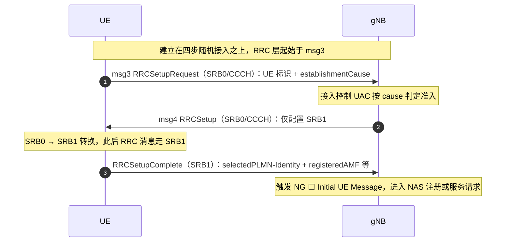

## 一句话答案

RRC 建立是终端从 RRC_IDLE 进入 RRC_CONNECTED 的过程：UE 在 msg3 中发送携带建立原因的 RRCSetupRequest，gNB 回 RRCSetup（含 SRB1 配置），UE 回 RRCSetupComplete 完成建立，随后触发 NAS 层注册或服务请求；建立原因共 6 类，其中紧急呼叫优先级最高。

## 详细展开

**1. 流程三步（建立在四步随机接入之上）**

```
UE                          gNB
 |--- msg1: PRACH preamble -->|
 |<-- msg2: RAR (TC-RNTI/TA) -|
 |--- msg3: RRCSetupRequest -->|   ← CCCH，携带建立原因
 |<-- msg4: RRCSetup ----------|   ← SRB1 配置
 |--- RRCSetupComplete ------->|   ← SRB1 上发送，携带选中的 PLMN/注册区信息
```

- RRCSetupRequest 内容：UE 标识（有 5G-S-TMSI 用 ng-5G-S-TMSI-Part，否则随机初始 UE 标识）+ establishmentCause。
- RRCSetup 只配 SRB1，之后所有 RRC 消息（含 Complete）都走 SRB1。

**2. 建立原因值（establishmentCause）**

| 原因值 | 含义 | 典型场景 |
|---|---|---|
| emergency | 紧急呼叫 | 112/110 等无卡/限卡呼叫 |
| highPriorityAccess | 高优先级接入 | 特权用户/ MPS |
| mt-Access | 移动终接接入 | 响应寻呼（来话、来数据） |
| mo-Signalling | 主叫信令 | 注册、去附着、TAU |
| mo-Data | 主叫数据 | 上网、应用数据 |
| mo-VoiceCall / mo-SMS（R16+ 细化） | 主叫语音/短消息 | VoNR、SMS over NAS |

- 原因值影响接入控制（UAC/ACB）与调度优先级，运营商可按原因做差异化准入。

**3. 建立完成之后**

- RRCSetupComplete 上报选网结果（selectedPLMN-Identity、registeredAMF 等），触发 NG 口 Initial UE Message，进入 NAS 注册或服务请求流程。
- 若小区禁止或接入受限（SIB1 cellBarred / UAC），UE 不会发起建立，转而重选其他小区。

**4. 与 LTE 的差异**

- NR 的建立原因值集基本沿用 LTE 并在 R16 增加了 mo-VoiceCall / mo-SMS 的细分，便于语音/短消息业务识别。
- NR 的 RRCSetupRequest 走 SRB0（CCCH），成功后才建 SRB1，与 LTE 一致。

**标准信令时序（UE ↔ gNB，SRB0 → SRB1 转换）**：



## 关联考点

- 随机接入：[CBRA 竞争随机接入四步流程](ch05-q007-cbra-four-step.md)
- 注册流程：[NAS 注册流程要点](ch05-q013-nas-registration-flow.md)
- 服务请求：[Service Request 流程](ch05-q016-service-request.md)

## 面试追问

- **为什么 msg3 里就要带建立原因？** —— 要点：基站与核心网需要尽早知道接入意图，用于接入控制（UAC 按 cause 分类限制）与差异化调度；等到 NAS 消息才上报就失去了准入控制的意义。
- **mt-Access 和 mo-Signalling 分别什么时候用？** —— 要点：被叫场景（寻呼响应）用 mt-Access；UE 主动发起的纯信令过程（注册、周期性 TA 更新、去附着）用 mo-Signalling，两者在话统中是区分被叫/信令负荷的关键。
- **RRCSetupComplete 之后一定跟注册吗？** —— 要点：不一定——若 UE 已注册且只是被寻呼或要传数据，走 Service Request 流程；只有 IDLE 下未注册/注册态失效时才触发完整 NAS 注册。
