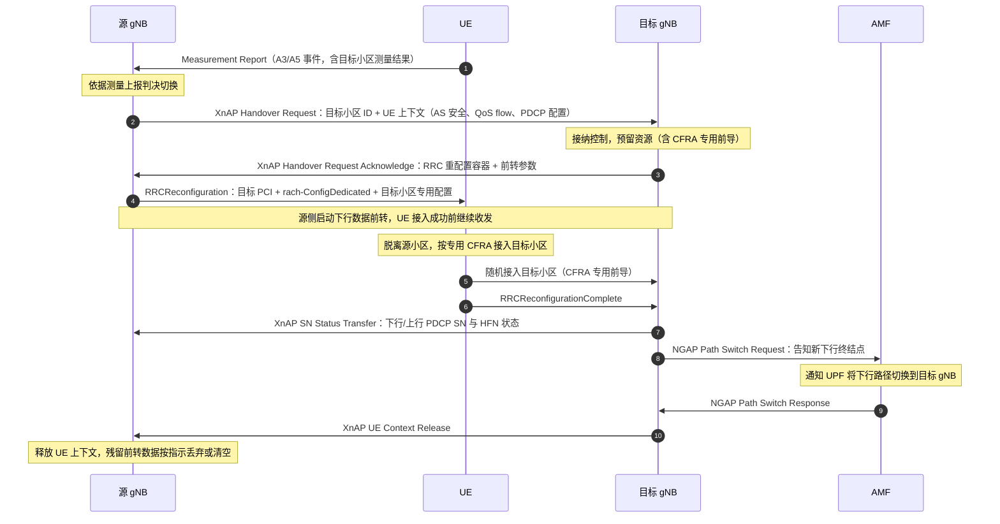

## 一句话答案

Xn 切换是源 gNB 与目标 gNB 之间直接通过 Xn 接口协商完成的切换，不经核心网参与切换决策。流程为：源 gNB 发 Xn 切换请求（Handover Request）→ 目标 gNB 准备资源并回复 ACK → 源 gNB 下发 RRC Reconfiguration（含 target 配置与 rrc-TransactionIdentifier）→ UE 断源随机接入目标 → 目标 gNB 通过 Xn 发 Data Forwarding 相关的 SN Status Transfer（PDCP 序列号状态）并向 AMF 发 Path Switch Request 切换用户面下行路径，AMF 回 Path Switch ACK，最后源 gNB 释放 UE 上下文。

## 详细展开

**1. 准备阶段（Xn 上完成）**

- 源 gNB 依据测量上报（如 A3/A5）判决切换，通过 XnAP 发送 **Handover Request**，携带目标小区 ID、UE 上下文（能力、AS 安全信息、E-RAB/QoS flow 信息、PDCP 配置等）；
- 目标 gNB 做接纳控制，预留资源（含 PDCP/RLC/MAC/PHY 配置、随机接入专用 CFRA 前导码），回复 **Handover Request Acknowledge**，内含目标侧的 RRC 重配置容器与给源侧的前转参数；
- 若目标拒绝，走 Handover Preparation Failure，源侧另择目标或保持。

**2. 执行阶段（Uu 空口）**

- 源 gNB 向 UE 下发 **RRCReconfiguration**（含 mobControlInfo：目标 PCI、专用随机接入配置、目标小区专用配置），同时启动对本 UE 下行数据的前转（若配了 data forwarding）；
- UE 收到后脱离源小区，按专用 CFRA（免竞争随机接入）或 CBRA 接入目标小区，发 **RRCReconfigurationComplete** 给目标 gNB；
- 接入成功前，源 gNB 继续收发并按 SN Status Transfer 维护 PDCP 状态；接入成功后目标 gNB 通知源侧停止前转（或继续前转剩余数据）。

**3. 完成阶段（Xn + NG 协作）**

- 目标 gNB → 源 gNB：XnAP **SN Status Transfer**（下行/上行 PDCP SN 与 HFN 状态，供无损前转排序）；
- 目标 gNB → AMF：**Path Switch Request**（告知新下行终结点），AMF 通知 UPF 切换下行路径到目标 gNB，回 **Path Switch Response**；
- 目标 gNB → 源 gNB：**UE Context Release**，源 gNB 释放上下文，残留前转数据按指示丢弃或继续清空。

**4. 三个关键机制**

| 机制 | 作用 |
|---|---|
| 数据前转（data forwarding） | 源侧把未确认的下行 PDCP PDU 前转到目标侧，避免切换期间丢包（make-before-break 精神） |
| SN Status Transfer | 传递 PDCP 收发序列号状态，目标侧据此继续按序处理，实现无损且有顺序保障 |
| Path Switch | 用户面下行终结点从源 gNB 换到目标 gNB，上行因 UE 已直接发给目标，无需切换路径 |

**标准信令时序（源 gNB ↔ UE ↔ 目标 gNB）**：

## 关联考点

- 与 NG 切换对比：[NG 接口切换与 Xn 切换的差异](ch05-q024-ng-vs-xn-handover.md)
- 切换安全：[切换中的密钥更新（KgNB 刷新与水平/垂直推导）](../04-空口协议栈/ch04-q028-handover-key-update.md)
- PDCP 顺序保障：[PDCP 重排序与按序递交（含重建/切换场景）](../04-空口协议栈/ch04-q006-pdcp-reordering.md)

## 面试追问

- **Xn 切换时 UPF 的下行数据在切换期间去哪了？** —— 要点：UPF 下行仍发往源 gNB；源 gNB 一边继续发给 UE（在 UE 离开前），一边按前转配置复制/前转到目标 gNB 缓存；UE 接入目标后由目标侧下发缓存数据，配合 SN Status Transfer 保证按序不丢。
- **为什么 Path Switch 由目标 gNB 发起而不是源 gNB？** —— 要点：切换完成的确认点在目标侧（收到 RRCReconfigurationComplete），只有目标 gNB 确认 UE 已接入，才有资格请求修改核心网下行路径；源侧此时已无法保证 UE 还在自己下面。
- **Xn 切换失败的可能原因有哪些？** —— 要点：目标资源接纳失败、Xn 链路故障退化为 NG 切换、UE 在目标侧随机接入失败或 RRCReconfigurationComplete 超时（回退源小区或走重建）、目标判定配置不兼容拒绝；现网排查需结合 Xn 建链状态与目标小区负荷。
