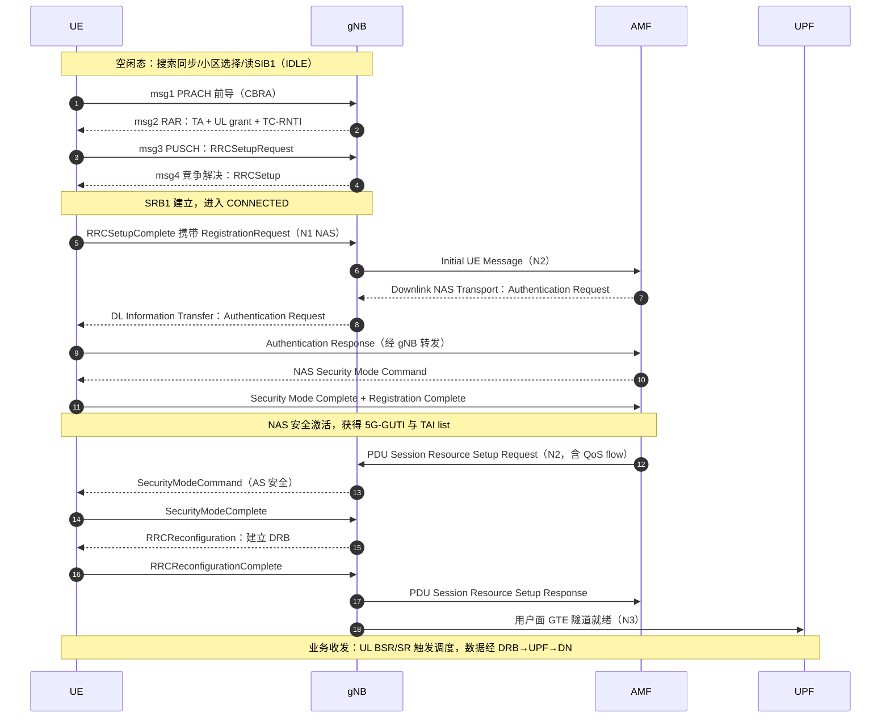

## 一句话答案

完整呼通链路是"搜索同步 → 小区选择 → 读系统消息 → 随机接入 → RRC 建立 → NAS 注册（鉴权/安全）→ 会话建立（PDU 会话）→ 业务收发"八个环节；其中空闲态解决"找到并驻留合适的网络"，连接态解决"鉴权合法、建立安全、搭好承载"。面试时按这条主线串讲，每环节点到关键信令与消息名，体现对端到端流程的整体把握。

## 详细展开

**1. 八环节串讲**

| 环节 | 关键动作 | 关键信令/参数 |
|---|---|---|
| ① 小区搜索 | SSB 同步（PSS/SSS/PBCH），获取 PCI 与 MIB | 同步栅格、SSB 周期 |
| ② 小区选择 | 按 S 准则判断是否可选（RSRP/RSRQ 达门限） | Srxlev/Squal 计算 |
| ③ 系统消息获取 | 读 SIB1（初始 BWP、上行配置、接入控制），按需读其他 SIB | SIB1 是驻留前提 |
| ④ 随机接入 | CBRA 四步（msg1–msg4）或两步，获得 TA 与 C-RNTI | 前导码、RAR、竞争解决 |
| ⑤ RRC 建立 | UE 发 RRCSetupRequest（带建立原因），gNB 下发 RRCSetup，回 Complete；SRB1 建立 | 建立原因值（emergency/…/mo-Data） |
| ⑥ NAS 注册 | 经 SRB1 发 Registration Request → 鉴权（5G-AKA）→ NAS 安全模式 → 注册接受（获 5G-GUTI/TAI list） | AMF 侧主流程 |
| ⑦ 会话建立 | 注册中/后建立 PDU 会话（PDU Session Establishment，含 QoS flow），gNB 侧建立 DRB（AS 安全：RRC SecurityModeCommand → 重配置 DRB） | N2/NG 信令 + 空口重配置 |
| ⑧ 业务收发 | 数据经 DRB → UPF → DN；调度/功控/HARQ 常态运行 | 上行 BSR/SR 触发首个调度 |

**2. 状态机视角**

- ①–③ 在 RRC IDLE；④–⑤ 从 IDLE 到 CONNECTED；⑥–⑧ 在 CONNECTED 完成；
- 呼通后业务间隙可能去激活（回 INACTIVE），下次业务走 resume 快速恢复——完整链路与状态机互通。

**3. 安全视角**

- NAS 安全（注册流程内，AMF-UE 之间）与 AS 安全（gNB-UE 之间，RRC/UP 加密完整性保护）分别激活，密钥体系从 K 分层推导（KAMF/KgNB），呼通流程中两次安全激活不可混淆顺序。

**完整信令时序（开机 → msg1 → 业务收发）**：

**4. 排障视角（面试加分点）**

- 卡在 ①–②：覆盖/同步问题（看 RSRP、S 准则差多少）；
- 卡在 ④：随机接入失败（按四步分点定位）；
- 卡在 ⑤：接入控制/许可问题（看拒绝原因）；
- 卡在 ⑥：鉴权失败（查 USIM/鉴权参数）、安全模式失败（查算法协商）；
- 卡在 ⑦：会话拒绝（查 DNN/切片签约、QoS 参数）；
- 串讲时能指出"哪一步卡了看什么日志"是工程功底的体现。

## 关联考点

- 开机三步：[NR 小区搜索完整流程：从 SSB 检测到读取 SIB1](ch05-q001-cell-search-full-procedure.md)
- 接入与注册：[RRC 建立流程与建立原因值](ch05-q012-rrc-establishment.md)、[NAS 注册流程要点（鉴权/安全模式/注册区域更新）](ch05-q013-nas-registration-flow.md)
- 业务触发：[数据到达触发的连接建立全链路（service request 视角）](../04-空口协议栈/ch04-q037-service-request-mob-data.md)

## 面试追问

- **注册和 PDU 会话建立的先后关系是什么？** —— 要点：注册先行且必须成功（网络要确认 UE 合法并建立安全），PDU 会话可在注册流程内同步请求（注册请求带会话建立需求）或注册完成后按需发起；没有注册（无安全上下文）就不可能建会话。
- **AS 安全激活前能传用户数据吗？** —— 要点：不能。RRC 层在 SecurityModeComplete 之后才允许下发含用户面配置的重配置，DRB 建立前数据无承载可走；协议强制"先安全、后业务"，呼通时延里安全激活是必经环节。
- **如果让你优化呼通时延，你会动哪些环节？** —— 要点：按耗时排序找瓶颈——常见优化：减少 SIB 获取轮次（按需 SIB 提前广播）、两步随机接入（省 msg2/msg4 轮次）、注册与会话建立并行（early data/注册携带）、INACTIVE resume 替代完整建立；但每项都有代价（资源开销/兼容性），需按业务模型权衡。
