本页收录全部 322 题的完整解析，专供打印或导出 PDF 离线使用。

<PrintExport />
# 无线基础与演进 · 5G NR 与 LTE 相比的主要设计目标与技术差异

> 难度：易 ｜ 频率：高

## 一句话答案

5G NR（New Radio，新空口）的设计目标是面向三大场景（eMBB/uRLLC/mMTC）提供统一灵活的空口，核心关键词是"灵活"与"低时延"。相比 LTE，NR 在帧结构（可变子载波间隔）、双工方式（支持 TDD 为主并预留 FDD）、信道编码（LDPC/Polar 取代 Turbo）、天线形态（massive MIMO 原生支持）和协议栈（新增 SDAP 层）等方面做了全面重构。

## 详细展开

LTE 的设计出发点是移动宽带，NR 则要求一张网同时承载增强移动宽带（eMBB）、超可靠低时延通信（uRLLC）和海量机器类通信（mMTC），因此两者在设计哲学上有本质差异：

| 维度 | LTE | 5G NR |
|---|---|---|
| 子载波间隔 | 固定 15 kHz | 可变：15/30/60/120/240 kHz（μ=0~4，2 的幂次扩展） |
| 帧结构 | 固定 1 ms 子帧、10 ms 无线帧，TDD 配比受限 | 1 ms 子帧但时隙长度随 μ 变化，时隙内符号可灵活配置为下行/上行/灵活 |
| 双工 | FDD/TDD 分离设计 | 统一框架，支持 TDD、FDD，还支持补充上行（SUL） |
| 信道编码 | 数据 Turbo 码、控制面咬尾卷积码 | 数据 LDPC 码、控制信道 Polar 码 |
| 天线/波束 | 最多 4~8 端口，波束赋形非强制 | 原生支持 massive MIMO，波束管理是协议基础能力 |
| 核心网 | EPC（4G 核心网） | 5GC（基于服务的架构 SBA，网络切片原生支持） |
| 协议栈 | PDCP 之上直接 RRC | 新增 SDAP 层负责 QoS 流到 DRB 的映射 |
| 最小时延目标 | 用户面时延约 10 ms 量级 | 下行/上行各 1 ms 量级（URLLC 场景） |

关键技术差异可归纳为四点：

1. **灵活参数集（Numerology）**：NR 引入可扩展的子载波间隔族，子载波间隔 = 15 × 2^μ kHz，允许同一载波内混合不同参数集，适配不同业务（大 SCS 低时延抗多普勒，小 SCS 覆盖好）。
2. **自包含子帧（self-contained subframe）**：一个时隙内尽量包含 DMRS、数据及对应的 HARQ-ACK 反馈，缩短反馈环路，降低调度时延。
3. **无小区专属参考信号（CRS）**：NR 取消了 LTE 的常开 CRS，改用按需发送的解调参考信号（DMRS）与信道状态信息参考信号（CSI-RS），降低开销与干扰。
4. **低时延设计**：mini-slot 调度（2/4/7 符号）、前置调度请求与快速 HARQ（支持跨时隙/时隙内反馈）等机制共同把空口时延压到毫秒级。

## 关联考点

- eMBB/uRLLC/mMTC 三大应用场景及各自关键指标：[三大应用场景](./01-无线基础与演进/ch01-q002-three-scenarios-embb-urllc-mmtc.md)
- LTE 与 NR 帧结构设计差异：[帧结构差异](./01-无线基础与演进/ch01-q012-lte-nr-frame-structure-diff.md)
- LDPC 与 Polar 码在 NR 中的分工：[信道编码](./01-无线基础与演进/ch01-q013-ldpc-polar-codes.md)
- SCG 添加、修改、变更与失败的典型流程：[SCG 流程](./01-无线基础与演进/ch01-q008-scg-procedures.md)

## 面试追问

- **NR 为什么取消 LTE 的 CRS？** —— 要点：CRS 常开导致小区间干扰和功耗开销；NR 波束赋形是模拟波束按需指向，不存在全小区常开参考信号的必要；改为按需 DMRS/CSI-RS + 波束对齐，开销随负载缩放。
- **NR 支持比 LTE 更大系统带宽的原因是什么？** —— 要点：FR2 高频段可用频谱资源丰富；大带宽需配合更大 SCS 以规避相位噪声与子载波间干扰；终端射频能力有限，引入 BWP（部分带宽）让终端不必支持全带宽。
- **LTE 与 NR 在双工设计上最大的不同是什么？** —— 要点：NR 用统一帧结构框架支持 FDD/TDD/SUL；TDD 场景上下行配比从"半静态固定配比"演进为支持动态指示与灵活符号，便于适配非对称业务。

---

# 无线基础与演进 · eMBB/uRLLC/mMTC 三大应用场景及各自关键指标

> 难度：易 ｜ 频率：高

## 一句话答案

5G 定义了三大应用场景：增强移动宽带（eMBB, enhanced Mobile Broadband）主打高速率，超可靠低时延通信（uRLLC, ultra-Reliable and Low-Latency Communications）主打低时延高可靠，海量机器类通信（mMTC, massive Machine-Type Communications）主打海量连接。ITU 在 5G 需求报告中为每类场景给出了量化的关键能力指标，是面试必须能脱口而出的数字。

## 详细展开

三大场景面向的业务完全不同，因此网络设计侧重点不同：

| 场景 | 典型业务 | 关键指标（ITU 通识口径） |
|---|---|---|
| eMBB | 4K/8K 视频、VR/AR、大文件下载 | 峰值速率：下行 20 Gbps、上行 10 Gbps；用户体验速率 100 Mbps（下行）；区域流量容量 10 Tbps/km² |
| uRLLC | 工业自动化、自动驾驶、远程手术、电网差动保护 | 空口时延：上行/下行各 1 ms；可靠性 99.999%（1 ms 内丢包概率 10⁻⁵） |
| mMTC | 智能抄表、传感器网络、智慧城市 | 连接密度 100 万设备/km²；终端低功耗（电池数年级）、低成本 |

补充说明：

1. **eMBB** 是 5G 商用部署最先落地的场景，当前 NSA/SA 网络提供的增强宽带业务都属于此类；峰值速率依赖大带宽（100 MHz FR1 / 400 MHz FR2）、massive MIMO 多层传输和高阶调制（256QAM，部分场景 256QAM 上行）。
2. **uRLLC** 依赖短时隙调度（mini-slot）、更大子载波间隔（60/120 kHz）、时隙内重复传输与 PDCP 复制（duplication）等机制保障时延与可靠性的平衡。
3. **mMTC** 在 5G 阶段主要仍由 NB-IoT/eMTC 等 LTE 演进技术承载，NR 原生 mMTC 特性在后续版本持续增强；考察重点通常是连接密度与低功耗设计思路。
4. 除三大场景外，ITU 还定义了若干横向能力指标，常被追问的包括：移动性 500 km/h、能效与频谱效率较 4G 提升 3 倍等。

面试口播技巧：先报场景名与业务例子，再各报一个最核心的数字（20 Gbps / 1 ms+99.999% / 100 万/km²），条理清晰即可。

## 关联考点

- 5G NR 与 LTE 的主要设计差异：[LTE 到 NR](./01-无线基础与演进/ch01-q001-nr-vs-lte-design.md)
- FR1 与 FR2 频段范围及传播特点：[FR1/FR2](./01-无线基础与演进/ch01-q009-fr1-fr2-bands.md)
- 载波聚合与双连接的区别与联系：[CA 与 DC](./01-无线基础与演进/ch01-q011-ca-vs-dc.md)

## 面试追问

- **uRLLC 的"1 ms + 99.999%"是在什么条件下定义的？** —— 要点：是 ITU 对空口（Uu 口）的要求，指 32 字节包在 1 ms 内传输成功概率 99.999%；实际端到端时延还要加上传输网、核心网与业务处理时延。
- **mMTC 为什么当前主要由 NB-IoT 承载而不是 NR？** —— 要点：NB-IoT 已成熟商用且深度覆盖、功耗优化到位；NR mMTC 相关特性（覆盖增强、RedCap 等中速物联）按版本演进，RedCap 定位介于 eMBB 与 NB-IoT 之间的中速物联。
- **峰值速率 20 Gbps 依赖哪些技术要素？** —— 要点：大带宽（FR2 400 MHz）、高阶调制 256QAM、massive MIMO 最高 8 流（对应 4 层×2 极化方向的 MIMO 层数上限口径）、更短的 TTI；同时说明这是理想条件下的理论峰值。

---

# 无线基础与演进 · NSA 与 SA 组网架构的区别及演进路径

> 难度：易 ｜ 频率：高

## 一句话答案

非独立组网（NSA, Non-Standalone）指 5G 基站不能独立工作，必须依托 4G 基站作为控制面锚点、依托 4G 核心网（EPC）或 5G 核心网（5GC）提供业务；独立组网（SA, Standalone）指 5G 基站与 5G 核心网完整独立成网。演进路径上运营商普遍"先 NSA 快速铺覆盖、后 SA 承载全部业务"，最终目标是 SA。

## 详细展开

两者在控制面、核心网、业务能力上的差异：

| 维度 | NSA（以 Option 3x 为例） | SA（Option 2） |
|---|---|---|
| 无线控制面 | LTE 基站（eNB）为锚点，NR 基站（gNB）受其辅控 | gNB 独立控制 |
| 核心网 | EPC（4G 核心网）为主 | 5GC（5G 核心网） |
| 信令承载 | RRC 走 LTE（MeNB） | 全部走 NR |
| 5G 核心网新特性 | 不可用（无网络切片、SBA 等） | 网络切片、边缘计算、新 QoS 框架均可 |
| 语音 | 依赖 VoLTE / EPS fallback | NR 上原生语音（VoNR），过渡期可回落 |
| 终端要求 | 支持 EN-DC 的 4G/5G 双模终端 | 支持 SA 的 5G 终端 |
| 部署节奏 | 快：复用 4G 覆盖与核心网，gNB 即插即用 | 慢：需新建 5GC 与全 5G 覆盖 |

演进路径的典型叙事（按运营商实践归纳）：

1. **起步期——NSA Option 3x**：利用成熟的 4G 连续覆盖做锚点，5G 做"热点提速层"，用户面尽量走 NR，快速放大 5G 流量；核心网只需在 EPC 上做少量增强（MME 支持 S1-U 分拆、新增锚点选择逻辑）。
2. **过渡期——NSA/SA 双模并存**：核心网侧引入 5GC（通常与 EPC 混合组网，即 Option 4/7 系列），网络同时服务 NSA 与 SA 终端。
3. **成熟期——SA Option 2**：5GC 承载全部业务，gNB 连续覆盖后独立驻留；网络切片、uRLLC 等真正 5G 能力只有在 SA 下才能兑现。

关键结论：NSA 的"非独立"指控制面与核心网依赖 4G；SA 才是完整的 5G 网络。NSA 无法提供低时延网络切片等 5GC 特性，这是两者本质区别而非速率差异。

## 关联考点

- NSA/SA 常见部署选项差异：[部署选项](./01-无线基础与演进/ch01-q004-deployment-options.md)
- EN-DC 双连接的基本概念与架构：[EN-DC](./01-无线基础与演进/ch01-q005-en-dc-architecture.md)
- NSA 语音方案 EPS fallback：[NSA 语音](./01-无线基础与演进/ch01-q015-nsa-voice-eps-fallback.md)

## 面试追问

- **NSA 用户的速率能达到 5G 水平吗？** —— 要点：能。NSA 下用户面数据可以走 NR（如 Option 3x 的 SCG bearer），速率与 SA 相近；差别不在速率而在 5GC 特性（切片、QoS 框架、低时延能力）。
- **为什么运营商不直接一步上 SA？** —— 要点：SA 需要 5GC 全新建设与 NR 连续覆盖，投资大、周期长；NSA 复用 4G 锚点可"增量演进"，先抢占 5G 用户与流量，再逐步向 SA 迁移。
- **NSA 终端在 SA 网络下能否使用？** —— 要点：要看终端是否支持 SA 模式；仅支持 NSA 的终端无法在纯 SA 网络驻留，当前主流 5G 终端均为 NSA/SA 双模。

---

# 无线基础与演进 · NSA/SA 常见部署选项 Option 3/3a/3x 与 Option 2 的差异

> 难度：中 ｜ 频率：高

## 一句话答案

Option 系列描述 5G 基站（gNB）、4G 基站（eNB）、4G 核心网（EPC）与 5G 核心网（5GC）的组合方式：Option 3/3a/3x 是"4G 锚点 + EPC"的 NSA 组网，三者的区别在于用户面数据在 LTE 与 NR 间的分拆位置；Option 2 是"新空口 + 5GC"的 SA 组网。记住 3 系列看用户面分流点、Option 2 看核心网，即可串起全图。

## 详细展开

Option 编号逻辑：1 表示 4G 全套，2 表示 NR 直连 5GC，3 表示"NR 依托 4G/EPC"，4、5、7 系列分别是"5G 锚点连 EPC"与"4G 依托 5G 侧"的过渡形态。面试重点掌握 3 系列内部差异与 Option 2：

| 选项 | 控制面锚点 | 核心网 | 用户面（U 面）走向 | 特点 |
|---|---|---|---|---|
| Option 3 | eNB（MeNB） | EPC | 数据经 MeNB 分拆：主承载在 LTE 侧分出 SCG 承载（PDCP 层在 MeNB 分流） | 分流与聚合逻辑都在 MeNB，MeNB 处理负担最大 |
| Option 3a | eNB（MeNB） | EPC | 数据经 EPC/S-GW 分流到两条独立承载：一条走 eNB、一条走 gNB，MeNB 不做数据分流 | MeNB 只管控制面，用户面各走各的，对 MeNB 硬件要求低 |
| Option 3x | eNB（MeNB） | EPC | 数据经 MeNB 分拆，但大流量数据（如 5G 承载）由 NR 侧作为分流点（split 承载由 gNB 侧协助） | 3 的增强版：NR 吞吐高，让 gNB 承担更多分流处理，MeNB 只处理小包/低速率部分 |
| Option 2 | gNB（独立） | 5GC | NR 直连 5GC，无 LTE 参与 | 完整 5G 能力：切片、SBA、uRLLC、VoNR 演进基础 |

记忆要点：

1. **3 系列共同点**：控制面都锚定在 LTE（MCG 侧），终端的 RRC 与移动性管理由 eNB 主导；核心网都是 EPC。
2. **3/3x 与 3a 的本质区别**：分流发生在锚点基站（3/3x，对应 split bearer）还是核心网（3a，对应两条独立承载）。3x 是 3 的演进，把分流"重活"交给处理能力更强的 gNB。
3. **商用主流是 Option 3x**：因为 NR 用户面能力远强于 LTE，分流点放在 NR 侧可获得更优吞吐与更低的锚点升级成本。
4. **Option 2 与 3 系列不可比的是核心网能力**：3 系列无论怎么分流都受限于 EPC，无法提供切片与 5GC QoS。

补充：Option 4/4a（5G 锚点 + 5GC，LTE 作辅站）与 Option 7/7a/7x（4G 锚点但连 5GC）用于 NSA→SA 过渡期，了解即可。

## 关联考点

- NSA 与 SA 的区别及演进路径：[NSA 与 SA](./01-无线基础与演进/ch01-q003-nsa-vs-sa-evolution.md)
- EN-DC 中控制面与用户面走向：[控制面与用户面](./01-无线基础与演进/ch01-q006-en-dc-cp-up.md)
- MCG/SCG/split bearer 的区别：[承载类型](./01-无线基础与演进/ch01-q007-bearer-types.md)

## 面试追问

- **Option 3x 相比 Option 3 改在哪里，为什么商用选 3x？** —— 要点：3 的分流点在 MeNB，5G 大流量全部经 MeNB 转发，锚点负荷重；3x 把分流点移到 gNB（大包直接从核心网到 gNB），MeNB 只处理小数据流，锚点改动小、总吞吐更高。
- **Option 3a 下终端如何聚合两条承载的速率？** —— 要点：分流发生在核心网/S-GW，形成两条独立 E-RAB，一条映射 LTE 一条映射 NR；速率聚合在 PDCP 之上的端到端流层面体现，不需要 MeNB 做数据面复制分发。
- **Option 2 与 Option 3x 在语音方案上有什么不同？** —— 要点：3x 下语音由 VoLTE 承载（走 LTE）；Option 2 初期若无 VoNR，可通过 EPS fallback 回落到 4G 打电话，成熟后演进 VoNR。

---

# 无线基础与演进 · EN-DC 双连接的基本概念与整体架构

> 难度：中 ｜ 频率：高

## 一句话答案

EN-DC（E-UTRA-NR Dual Connectivity）指终端同时连接一个 LTE 主节点（MeNB, Master eNB）和一个 NR 辅节点（SgNB, Secondary gNB）的双连接架构，是 NSA（Option 3 系列）的空口实现基础。控制面由 MeNB 统一掌管（终端只有一条 RRC 连接），用户面可同时在 LTE 与 NR 上传输以聚合速率。

## 详细展开

双连接（DC, Dual Connectivity）的通用定义：终端（UE）在 RRC_CONNECTED 态下同时使用两个调度节点的无线资源，两个节点通过 Xn/X2 接口相连、至少一个共享同一核心网。EN-DC 是 DC 在"4G 锚点 + 5G 辅站"场景的特例（E-UTRA + NR）。

整体架构要素：

1. **节点角色**：
   - MeNB（Master eNB）：LTE 主节点，终结与 MME 的控制面（S1-MME），负责 RRC 连接与移动性管理。
   - SgNB（Secondary gNB）：NR 辅节点，提供 NR 用户面资源，通过 X2-C 接口与 MeNB 交互，通过 S1-U 直连 S-GW（或经 MeNB 中转）传输数据。
2. **接口**：
   - X2-C：MeNB 与 SgNB 之间的控制面接口，承载 SgNB 添加/修改/释放等流程消息。
   - S1-U：SgNB 用户面到 S-GW 的直接隧道（Option 3a/3x 部署下）。
3. **控制面原则**：终端只与 MeNB 有一条 RRC 连接；SgNB 生成 NR 侧的无线资源控制消息（SgNB 产生的 RRC 消息经 MeNB 转发给终端，即 NR RRC via E-UTRA RRC），终端向 SgNB 的反馈也由 MeNB 路由。
4. **用户面原则**：按承载类型决定走向——MCG bearer 只走 LTE、SCG bearer 只走 NR、split bearer 在 MeNB PDCP 层分拆同时走两侧（详见承载类型专题）。
5. **核心网视角**：MeNB 终结 S1-MME；用户面锚点在 S-GW，根据承载类型将数据发往 eNB 和/或 gNB。

时序上的典型动作：终端先在 LTE 上完成 RRC 连接与安全激活，随后 MeNB 通过 X2 发起 SgNB Addition，SgNB 完成 NR 侧配置后，终端开始使用 NR 资源。

一句话架构图（文字版）：

```
        S1-MME            S1-U
 MME ←—— MeNB ——→ S-GW ←—— SgNB
            |   X2-C / X2-U    ↑
            └————————UE————————┘
       （LTE+NR 空口同时连接）
```

## 关联考点

- EN-DC 控制面与用户面走向：[控制面与用户面](./01-无线基础与演进/ch01-q006-en-dc-cp-up.md)
- MCG/SCG/split bearer 区别：[承载类型](./01-无线基础与演进/ch01-q007-bearer-types.md)
- SCG 添加与变更流程：[SCG 流程](./01-无线基础与演进/ch01-q008-scg-procedures.md)
- Option 3/3a/3x 与 Option 2 差异：[部署选项](./01-无线基础与演进/ch01-q004-deployment-options.md)

## 面试追问

- **EN-DC 与普通载波聚合（CA）的区别是什么？** —— 要点：CA 的多个成员载波由同一个基站调度、只有一个 MAC 层；DC 有两个独立节点各自有 MAC/PHY，各自调度与 HARQ，节点间只需 Xn/X2 半静态协调；EN-DC 还叠加了跨 RAT（LTE+NR）这一维度。
- **终端为什么只有一条 RRC 连接？** —— 要点：保证移动性控制的单一权威（MeNB），避免双控制面冲突；SgNB 的 NR RRC 消息以容器方式嵌在 LTE RRC 中下发，测量报告也由 MeNB 收集后按需转发 SgNB。
- **SgNB 是否有独立的移动性控制权？** —— 要点：没有。SgNB 只能控制 NR 侧资源（如 SCG 内的移动性、波束管理），跨节点变更（SCG 变更/释放）由 MeNB 发起或经 MeNB 执行；SN 变更时可能涉及数据前传以保证无损。

---

# 无线基础与演进 · EN-DC 中控制面与用户面的走向（锚点与承载分拆）

> 难度：中 ｜ 频率：高

## 一句话答案

EN-DC 下控制面全部锚定在 LTE：终端唯一的一条 RRC 连接终结在 MeNB，MME 只认识 MeNB，SgNB 的 NR RRC 消息经 MeNB 以容器方式透传。用户面锚点在 S-GW，按承载类型决定走向：只走 LTE、只走 NR，或在 PDCP 层分拆后同时走两侧。

## 详细展开

**控制面走向**（自上而下）：

1. 终端 ↔ MeNB：唯一一条 LTE RRC 连接，NAS（非接入层）消息也经 MeNB 送达 MME。
2. MeNB ↔ SgNB：X2-C 上的 SgNB 添加/修改/释放流程；SgNB 需要给终端下发 NR RRC 消息时（如 NR 专用配置），消息封装在 SgNB 产生的容器里，由 MeNB 转发；反之终端的 NR 测量报告由 MeNB 接收后再决定是否转发给 SgNB。
3. MeNB ↔ MME：S1-MME 终结点，S1AP 流程（如 E-RAB 修改）由 MeNB 与 MME 交互，SgNB 对核心网控制面"不可见"。

**用户面走向**（核心网 S-GW 为总锚点）：

| 承载类型 | S-GW 数据去向 | 空口走向 | 分拆点 |
|---|---|---|---|
| MCG bearer | MeNB | 只走 LTE（MeNB） | 无 |
| SCG bearer | 直连 SgNB（S1-U） | 只走 NR（SgNB） | 无 |
| split bearer | MeNB | MeNB PDCP 分拆 → LTE + NR 同时走 | MeNB PDCP |

两条典型数据路径：

- **Option 3a/3x 下的 SCG bearer**：S-GW →（S1-U 直连）→ SgNB → NR 空口，不经 MeNB。
- **Option 3/3x 下的 split bearer**：S-GW → MeNB PDCP → 分成 LTE PDCP PDU 与经 X2-U 到 SgNB 的 NR 部分；Option 3x 中 gNB 承担主要分流处理。

**关键理解点**：

1. PDCP 层是分拆发生的地方——split bearer 在 MeNB 的 LTE PDCP（严格说是锚点侧 PDCP）做复制/分发；NR 侧与 LTE 侧各自有独立的 RLC/MAC/PHY。
2. 上行方向对称存在：终端侧 split bearer 的上行数据在 PDCP 层按网络指示（如数据量、缓存状态）决定发往哪个节点，或在 SCG 失联时把数据切换回 MCG 侧保障连续性。
3. 承载类型可在 SgNB 添加/修改时由网络决定并动态调整（如从 SCG bearer 改为 split bearer），对核心网表现为 E-RAB 修改。

## 关联考点

- EN-DC 整体架构：[EN-DC 架构](./01-无线基础与演进/ch01-q005-en-dc-architecture.md)
- MCG/SCG/split bearer 的选择：[承载类型](./01-无线基础与演进/ch01-q007-bearer-types.md)
- Option 3/3a/3x 的用户面差异：[部署选项](./01-无线基础与演进/ch01-q004-deployment-options.md)

## 面试追问

- **split bearer 的上行分流由谁决定？** —— 要点：终端在 PDCP/MAC 层依据网络配置（含各节点无线状况、缓存）决定上行发往 MeNB 还是 SgNB；下行分流由 MeNB PDCP 决定，两者不对称。
- **SgNB 失联时用户面业务会中断吗？** —— 要点：取决于承载类型——SCG bearer 上的业务中断，split/MCG bearer 可继续走 LTE；网络可在 SCG 失败流程中把数据从 NR 侧回退到 LTE 侧，保证 MCG bearer 业务连续。
- **NR RRC 消息为什么不能由 SgNB 直接发给终端？** —— 要点：终端只有一条 RRC 连接且加密锚在 MeNB（密钥体系由 MME→MeNB 派生），SgNB 无独立 RRC 通道；经 MeNB 转发既统一了控制权威，也复用了 LTE 的安全与重传机制。

---

# 无线基础与演进 · MCG bearer、SCG bearer 与 split bearer 的区别及选择

> 难度：中 ｜ 频率：高

## 一句话答案

双连接下每个 E-RAB 按用户面走向分为三类：MCG bearer（主小区组承载）只走 LTE 主节点，SCG bearer（辅小区组承载）只走 NR 辅节点，split bearer（分拆承载）在锚点 PDCP 层分拆后同时走两侧。选择原则是：追求 NR 高速率用 SCG/split，强调业务连续性用 MCG/split，核心网侧分流不增加锚点负担用 SCG。

## 详细展开

以 EN-DC（Option 3 系列）为例，三类承载的完整对比：

| 维度 | MCG bearer | SCG bearer | split bearer |
|---|---|---|---|
| 用户面走向 | 仅 MeNB（LTE） | 仅 SgNB（NR） | MeNB PDCP 分拆，LTE+NR 并行 |
| 核心网连接 | S1-U 终结在 MeNB | S1-U 直连 SgNB | S1-U 终结在 MeNB |
| NR 侧速率贡献 | 无 | 全部 | 一部分 |
| SCG 失败时业务 | 不受影响 | 该承载业务中断（待重配恢复） | 数据自动回落 LTE 侧，不中断 |
| 锚点处理负担 | 无数据面分流 | 无 | 有（MeNB PDCP 复制分发） |
| 对应部署选项 | — | Option 3a 典型 | Option 3/3x 典型 |

补充两个延伸概念：

1. **NR 侧 split（Option 3x）**：split bearer 的变体——分流点仍在锚点侧 PDCP，但 NR 承担大流量。工程上常把"Option 3x 的 split bearer"与"3a 的 SCG bearer"对照记忆：前者锚点参与分流，后者完全不参与。
2. **PDCP 层是分界点**：无论哪种类型，两个节点的 MAC/PHY 完全独立，各自的 HARQ、调度互不干扰；分拆与聚合发生在 PDCP（分组数据汇聚协议，Packet Data Convergence Protocol）层，这正是双连接协议设计的关键——PDCP 之上"一个逻辑通道"，之下"两条腿走路"。

**选择逻辑**（网络侧决策，终端被动执行）：

- 默认策略：绝大多数流量应走 NR，因此 QCI=9 之类的默认承载通常配为 SCG bearer 或 split bearer。
- 语音/QCI=1 承载：NSA 下语音走 VoLTE，即 MCG bearer，天然保障连续性。
- NR 覆盖不稳或负载高的场景：配 split bearer，利用 NR 可用即加速、失效即回落的自适应特性。
- 锚点容量受限的热点场景：配 SCG bearer，绕过 MeNB 用户面。

面试时若被问"split bearer 与 SCG bearer 谁更好"，标准答法：split 用锚点资源换鲁棒性，SCG 用锚点零负担换单点依赖，取决于锚点容量与 NR 覆盖质量，无绝对优劣。

## 关联考点

- EN-DC 控制面与用户面走向：[控制面与用户面](./01-无线基础与演进/ch01-q006-en-dc-cp-up.md)
- Option 3/3a/3x 部署选项差异：[部署选项](./01-无线基础与演进/ch01-q004-deployment-options.md)
- SCG 添加、修改、变更与失败流程：[SCG 流程](./01-无线基础与演进/ch01-q008-scg-procedures.md)
- EN-DC 基本概念与架构：[EN-DC](./01-无线基础与演进/ch01-q005-en-dc-architecture.md)

## 面试追问

- **SCG bearer 对应的 NR 侧无线链路失败后，业务怎么办？** —— 要点：终端上报 SCG 失败信息（经 MeNB），MeNB 发起 SgNB 释放或重添加；期间 SCG bearer 数据缓存于 SgNB/MeNB 并尽可能前传（data forwarding），恢复后继续传输；split/MCG bearer 则始终有 LTE 兜底。
- **split bearer 的下行分流比例是固定的吗？** —— 要点：不是固定比例，由 MeNB PDCP 根据两条腿的调度结果/缓存状态动态分发；上行则由终端按网络下发的分流门限等参数决定。
- **为什么说 PDCP 层的设计使 DC 成为可能？** —— 要点：PDCP 提供按序递交、重排与安全功能，天然适合作为跨节点聚合点；RLC 以下各节点独立，避免了跨节点实时协同 MAC 调度的复杂度——这正是 DC 与 CA 的架构分界。

---

# 无线基础与演进 · SCG 添加、修改、变更与失败的典型流程

> 难度：难 ｜ 频率：高

## 一句话答案

SCG（Secondary Cell Group，辅小区组）流程是 NSA 日常维护 NR 链路的核心信令：添加（SgNB Addition）让终端用上 NR，修改（SgNB Modification）调整 NR 资源配置，变更（SgNB Change）应对终端移出原 NR 覆盖，失败（SCG Failure）是 NR 侧链路异常后的恢复机制。四类流程都经由 MeNB 的 X2 控制面与 LTE RRC 载荷执行。

## 详细展开

**1. SgNB 添加（最常考）**

前提：终端在 LTE 上处于 RRC_CONNECTED 且安全已激活。

```
UE          MeNB                SgNB
 |  B1 测量报告 → |                 |
 |           测量结果转发/新增请求 →  |
 |            ←准入决策+NR配置容器—— |
 |  ← RRCConnectionReconfiguration|
 |     （含 NR 无线承载配置容器）    |
 |  ——随机接入 NR（无竞争 RACH）———→ |
 |            ←SgNB Reconfiguration Complete———— |
 |            ——SgNB Reconfiguration Complete→    |
```

要点：MeNB 向候选 SgNB 发 SgNB Addition Request（携带终端能力、测量结果、SCG 承载配置建议）；SgNB 准入后在应答的容器中返回 NR RRC 重配内容；MeNB 用 LTE RRC 重配消息（内嵌容器）下发给终端；终端对 NR 做无竞争随机接入并回 SgNB Reconfiguration Complete。数据面同步建立 S1-U/X2-U 隧道。

**2. SgNB 修改**

不改变 SgNB 节点本身，仅调整配置：如增加/修改 SCG 承载、变更 split 比例参数、调整 NR 测量配置。由 MeNB 或 SgNB 发起，同样经"请求—应答容器—LTE RRC 重配—完成确认"四步；若 SgNB 发起，MeNB 保留拒绝权（需 MeNB 确认）。

**3. SgNB 变更**

终端移出原 SgNB 覆盖、或原 SgNB 负载/干扰恶化时触发：

- **同 MeNB 下 SN 变更**：MeNB 向新 SgNB 发起添加（携带原 SN 上下文），成功后释放旧 SgNB；期间可通过数据前传保证无损。
- **跨 MeNB 的 SN 变更**：与 LTE 切换叠加，先完成 MeNB 切换，新 MeNB 再向目标 SgNB 发起添加，原 SgNB 与旧 MeNB 资源随后释放。

**4. SCG 失败**

NR 侧异常（SCG 无线链路失败、SCG 重配失败、SgNB 侧随机接入问题、NR 同频测量失败等）触发：

1. 终端挂起 SCG 侧行为，通过 LTE 上报 SCGFailureInformation 给 MeNB（NR 侧数据不停发——split/MCG 承载继续走 LTE）。
2. MeNB 决策：发起 SgNB 释放，或择机重新添加（可能换一个 SgNB）。
3. 若承载为 SCG bearer，失败期间该承载业务受影响；split bearer 靠 LTE 侧兜底。

**记忆框架**：四类流程共享"经 MeNB 中转 + 容器式 NR RRC"的模式；区别只在触发条件与是否换节点。

## 关联考点

- MCG/SCG/split bearer 区别：[承载类型](./01-无线基础与演进/ch01-q007-bearer-types.md)
- EN-DC 中控制面与用户面走向：[控制面与用户面](./01-无线基础与演进/ch01-q006-en-dc-cp-up.md)
- NSA 终端驻留 LTE 并测量 NR（B1/B3 事件）：[NSA 测量](./01-无线基础与演进/ch01-q014-nsa-measurement-b1-b3.md)
- EN-DC 双连接基本概念：[EN-DC](./01-无线基础与演进/ch01-q005-en-dc-architecture.md)

## 面试追问

- **SgNB 添加流程中终端为什么不走竞争随机接入？** —— 要点：MeNB 已把专用前导码（rach-ConfigDedicated）随 NR 配置下发，SgNB 预留了接入资源，属于无竞争接入，时延短且不冲突。
- **SN 变更与 MeNB 切换的先后关系？** —— 要点：跨 MeNB 场景下先做 LTE 侧切换（安全重激活、路径转换），再由新 MeNB 发起 SgNB 添加；不采用同时并发，避免两个过程的状态耦合。
- **SCG 失败与 LTE 侧 RLF 的处理有何不同？** —— 要点：SCG 失败不触发 RRC 重建——终端保持 RRC 连接（MCG 仍有效），仅上报失败信息由 MeNB 决策恢复；LTE RLF 则意味着主链路失效，必须走重建或重建立流程。

---

# 无线基础与演进 · FR1 与 FR2 频段范围、传播特点及典型频段号

> 难度：易 ｜ 频率：高

## 一句话答案

NR 把工作频段分为两个频率范围：FR1（Frequency Range 1）为 410 MHz–7.125 GHz 的 sub-6GHz 频段，兼顾覆盖与容量，是当前商用主力；FR2 为 24.25 GHz–71.0 GHz 的毫米波频段，带宽大但传播损耗高、覆盖半径小。频段号约定 n 开头（如 n78），与 LTE 的 B 开头（Band）区分。

## 详细展开

**范围与特性对比**：

| 维度 | FR1 | FR2 |
|---|---|---|
| 频率范围 | 410 MHz – 7.125 GHz | 24.25 GHz – 71.0 GHz |
| 最大信道带宽 | 100 MHz | 400 MHz |
| 子载波间隔 | 15/30/60 kHz | 60/120 kHz（数据）；SSB 用 120/240 kHz |
| 传播特点 | 损耗较低，覆盖数百米至数公里 | 路径损耗与穿透损耗大、绕射差、雨衰明显，覆盖仅一二百米量级 |
| 天线形态 | 4/8 天线至 64T64R 均有 | 高度依赖大规模天线阵的模拟/混合波束赋形补偿损耗 |
| 典型用途 | 连续覆盖与容量层 | 热点容量补充（目前国内未规模商用） |

**典型频段号**（记这几组即可应对多数面试）：

- **n41**：2496–2690 MHz，TDD，中国移动 2.6 GHz 主力频段，带宽 160 MHz。
- **n78**：3.3–3.8 GHz，TDD，国内 3.5 GHz 主力频段（电信/联通使用其内部子段），是"黄金频段"的代名词。
- **n79**：4.4–5.0 GHz，TDD，中国移动 4.9 GHz 频段（行业专网常用）。
- **n28**：703–748/758–803 MHz，FDD，700 MHz 黄金覆盖频段（广电与移动共建共享使用）。
- **n1/n3**：FDD 2.1 GHz / 1.8 GHz，电信、联通的 5G 重耕频段（把原 LTE 频段重耕为 5G 使用）。
- FR2 代表：**n257/n258/n260/n261**（26/28/39/28 GHz 附近的毫米波，海外运营商使用）。

**传播机制要点**：

1. 自由空间损耗随频率升高而增大（同距离下 FR2 比 3.5 GHz 多出约 10–20 dB），因此 FR2 依赖波束赋形增益（大天线阵）与更密的站址。
2. FR2 穿透墙体、人体损耗严重，覆盖设计基本按"视距（LOS）+ 近距离热点"考虑。
3. FR1 中的低频段（如 700 MHz）传播特性好、穿透强，用作广覆盖打底；中频段（2.6/3.5 GHz）做容量主力，构成"低频打底 + 中频提容"的分层组网。

## 关联考点

- 中国运营商主流 5G 频段与组网策略：[中国频段策略](./01-无线基础与演进/ch01-q010-china-operator-bands.md)
- eMBB/uRLLC/mMTC 场景指标：[三大场景](./01-无线基础与演进/ch01-q002-three-scenarios-embb-urllc-mmtc.md)
- LTE 与 NR 帧结构差异（不同 SCS 的参数集）：[帧结构差异](./01-无线基础与演进/ch01-q012-lte-nr-frame-structure-diff.md)

## 面试追问

- **FR2 为什么必须用波束赋形才能工作？** —— 要点：毫米波路损大且单功放功率低，唯有把几十上百个天线单元的能量合成窄波束（模拟/混合波束赋形）获得阵列增益，才能对冲传播损耗；这也带来波束管理（扫描、对齐、恢复）的协议开销。
- **n78 为什么被称为 5G 黄金频段？** —— 要点：3.5 GHz 兼顾覆盖与带宽（国内可拿 100 MHz）、国际主流（全球漫游协同好）、产业成熟（终端与设备支持度最高）；比 2.6 GHz 干扰环境干净，比毫米波覆盖远。
- **700 MHz 重耕给 5G 带来什么价值？** —— 要点：广覆盖成本大幅下降（同等覆盖所需站点远少于 3.5 GHz）、深度穿透改善室内体验；但带宽有限、容量低，定位是覆盖打底层，与中频容量层互补组网。

---

# 无线基础与演进 · 中国运营商主流 5G 频段与组网策略（移动/电信/联通/广电）

> 难度：中 ｜ 频率：高

## 一句话答案

中国移动主力频段是 2.6 GHz 的 n41（160 MHz 带宽）与 4.9 GHz 的 n79，并与中国广电共建共享 700 MHz 的 n28；中国电信与中国联通各持 3.5 GHz 附近的 n78 100 MHz 并全程共建共享。策略上均以 TDD 中频段为容量主力、低频段为广覆盖打底，全国已实现连续覆盖。

## 详细展开

国内四大运营商的频段与策略一览：

| 运营商 | 主力 5G 频段 | 频段号 | 带宽 | 双工 | 组网策略要点 |
|---|---|---|---|---|---|
| 中国移动 | 2515–2675 MHz | n41 | 160 MHz | TDD | 自建主力容量层；2.6 GHz 大带宽做全国连续覆盖 |
| 中国移动 | 4800–4900 MHz | n79 | 100 MHz | TDD | 行业专网/热点补充 |
| 中国移动+广电 | 703–733/758–788 MHz | n28 | 2×30 MHz | FDD | 与广电共建共享 700 MHz，农村与室内广覆盖打底 |
| 中国电信 | 3400–3500 MHz | n78（下段） | 100 MHz | TDD | 与联通共建共享，各用 100 MHz 合计 200 MHz |
| 中国联通 | 3500–3600 MHz | n78（上段） | 100 MHz | TDD | 同上；两家共用一张接入网、各自计费 |
| 中国广电 | 700 MHz（n28 共享）+ 4.9 GHz 独立 | n28/n79 | — | FDD/TDD | 与移动共建 700 MHz；持有 700 MHz 金牌频段做广覆盖 |

（频段号为 3GPP NR 频段通识编号；各段具体频率以工信部批复为准，面试报"频段号+中心频率+带宽"即可。）

**策略层面的共性与差异**：

1. **共性——中频 TDD 为主力**：2.6/3.5 GHz 兼顾覆盖与带宽，配合 massive MIMO（64T64R 为主）提升频谱效率；NSA 起步期各家用 Option 3x，当前均以 SA 为目标网。
2. **移动的差异点**：频谱资源最厚（n41 160 MHz + n28 共享 + n79），采取"n41 打容量、n28 打覆盖"的立体网；700 MHz 共建共享使其在农村/深度覆盖上成本大幅下降。
3. **电信联通的差异点**：频谱相邻且合计 200 MHz，索性共建共享一张 3.5 GHz 网（一个逻辑网络、共享接入侧），站点规模与投资近乎减半；各自保留独立的核心网与用户。
4. **广电的差异点**：700 MHz FDD 覆盖能力强（同等覆盖比 3.5 GHz 省大量站点），但带宽有限；定位是与移动中频网互补的广覆盖层，不承担热点容量。
5. **共建共享的机制**：接入网共享（基站、AAU 共用），核心网各自独立；终端通过广播的运营商标识识别归属，用户无感知。

面试口播建议：先报"移动 n41 2.6G + 广电共建 700M，电信联通共建共享 3.5G 各 100M"这句主干，再按追问展开策略细节。

## 关联考点

- FR1 与 FR2 频段范围及传播特点：[FR1/FR2](./01-无线基础与演进/ch01-q009-fr1-fr2-bands.md)
- NSA 与 SA 组网区别及演进路径：[NSA 与 SA](./01-无线基础与演进/ch01-q003-nsa-vs-sa-evolution.md)
- 载波聚合与双连接的区别：[CA 与 DC](./01-无线基础与演进/ch01-q011-ca-vs-dc.md)

## 面试追问

- **为什么电信联通选择共建共享而不是各自建网？** —— 要点：两家频谱相邻（合计 200 MHz 连续），共建一张网可实现单站频谱效率翻倍、站点与运维成本近乎减半；竞争焦点转向服务与套餐而非重复投资。
- **700 MHz 与 3.5 GHz 在组网中如何分工？** —— 要点：700 MHz FDD 上行覆盖好、穿透强，做乡镇农村与室内深度覆盖打底；3.5 GHz TDD 大带宽 + massive MIMO 做城区容量主力；两者通过载波聚合或互联切换协同。
- **共建共享网络下终端如何识别归属运营商？** —— 要点：网络广播 PLMN 列表（共享网络可广播多个 PLMN），终端按 SIM 卡归属选择对应 PLMN 驻留；计费、鉴权、核心网仍走各自归属运营商。

---

# 无线基础与演进 · 载波聚合（CA）与双连接（DC）的区别与联系

> 难度：中 ｜ 频率：高

## 一句话答案

载波聚合（CA, Carrier Aggregation）是同一个基站把多个成员载波聚合起来联合调度，终端只有一个 MAC 层、一套 HARQ 实体；双连接（DC, Dual Connectivity）是终端同时连接两个独立基站，各有各的 MAC/PHY、各自调度。本质区别在"一个调度点还是两个调度点"：CA 靠 Xx 接口几乎不需要节点间协调，DC 需要两个节点通过 Xn/X2 协同。

## 详细展开

**核心对比**：

| 维度 | CA | DC（含 EN-DC） |
|---|---|---|
| 节点数 | 1 个（主服务小区所在基站） | 2 个（主节点 MN + 辅节点 SN） |
| MAC/PHY | 一套，跨载波联合调度 | 两套，各自独立调度与 HARQ |
| RRC 连接 | 一条 | 一条（锚定 MN，NR RRC 经 MN 容器转发） |
| 节点间接口 | 不需要（同站内部） | 需要 Xn/X2（控制面流程 + 可选数据前传） |
| 理想回传依赖 | 无 | 无（非理想回传也可，靠 PDCP 分流点解耦） |
| 载波要求 | 同制式（LTE CA 或 NR CA），一般要求相同双工/参数集可配 | 可跨制式（EN-DC 即 LTE+NR） |
| 失败影响 | 某成员载波失败，仅去激活该载波 | SCG 失败需走 SN 释放/变更流程 |
| 面向场景 | 同覆盖多频段提速 | 异构融合（如 4G 锚点+5G 提速） |

**联系与组合**：

1. **可以叠加**：EN-DC 场景下，LTE 侧可以有自己的 CA，NR 侧（SCG）也可以聚合多个 NR 载波——即"DC 内套 CA"，终端同时享受跨节点与跨载波增益。
2. **架构分界在 PDCP**：CA 的聚合点在 MAC（因此能跨载波联合调度、动态选载波）；DC 的聚合点在 PDCP（两个 MAC 独立，PDCP 之上才是一条逻辑通道）。这个差异决定了两者的能力边界——CA 调度灵活但同站；DC 灵活组网但协同粒度粗（半静态分流 + 各自动态调度）。
3. **互通转化**：某些场景下二者可等效——同站部署的 LTE/NR 共站基站，EN-DC 与"伪 CA"在用户体验上接近，但协议上仍是 DC（两个逻辑节点）。
4. **演进一致性**：NR 内部继续用 CA 扩容（FR1+FR1、FR1+FR2 间 CA），跨制式融合则依赖 DC 体系（EN-DC、NE-DC、NGEN-DC 等），两套机制长期共存。

**一句话记忆**：CA 是"一个大脑指挥多条腿"，DC 是"两个大脑各管各的腿、腰部（PDCP）协调"。

## 关联考点

- EN-DC 双连接基本概念与架构：[EN-DC](./01-无线基础与演进/ch01-q005-en-dc-architecture.md)
- MCG/SCG/split bearer 区别：[承载类型](./01-无线基础与演进/ch01-q007-bearer-types.md)
- EN-DC 控制面与用户面走向：[控制面与用户面](./01-无线基础与演进/ch01-q006-en-dc-cp-up.md)

## 面试追问

- **为什么 CA 能跨载波联合调度而 DC 不能？** —— 要点：CA 各成员载波的 MAC 在同一个实体，调度器可在一个 TTI 内统一决策；DC 的两个 MAC 分属两个节点，节点间只有 Xn/X2 的半静态信息交互（负载、干扰），无法毫秒级联合调度。
- **EN-DC 下 NR 侧还能再做 CA 吗？** —— 要点：能。SCG 内可配置多个 NR 成员载波（PSCell + SCell），即"DC + CA"叠加，NR 侧多载波聚合进一步提升速率；LTE 侧同理。
- **主服务小区失败时 CA 与 DC 的行为差异？** —— 要点：CA 下 PCell 失败触发 RRC 重建（SCell 只是被去激活）；DC 下 MCG 失败走重建，SCG 失败仅上报 SCGFailureInformation、保持 RRC 连接由网络恢复——失效域不同是两者可靠性行为的本质区别。

---

# 无线基础与演进 · LTE 与 NR 帧结构设计差异（灵活参数集与自包含子帧）

> 难度：中 ｜ 频率：高

## 一句话答案

LTE 帧结构固定（1 ms 子帧、15 kHz 固定子载波间隔，TDD 配比半静态受限），NR 则以可扩展参数集（Numerology：子载波间隔 15×2^μ kHz，μ=0~4）与时隙内符号级灵活配置为核心，并引入自包含（self-contained）子帧设计——把参考信号、数据与对应的 ACK/NACK 反馈尽量收进同一时隙，显著缩短反馈环路。

## 详细展开

**1. 固定 vs 可扩展参数集**

| 项 | LTE | NR |
|---|---|---|
| 无线帧/子帧 | 10 ms / 1 ms（固定） | 10 ms / 1 ms（时长不变，作为对齐基准） |
| 子载波间隔 | 15 kHz 固定 | 15×2^μ kHz：15/30/60/120/240 kHz（μ=0~4；R17 起 FR2-2 另有 480/960 kHz） |
| 时隙长度 | 1 子帧 = 14 符号（常规 CP） | 随 μ 变化：1/(2^μ) ms，μ=0 时 1 ms 14 符号，μ=1 时 0.5 ms 14 符号…… |
| 调度粒度 | 1 ms 子帧（1 个 TTI） | 1 时隙，或 mini-slot（2/4/7 符号） |
| TDD 配比 | 半静态固定配比（若干特殊子帧） | 符号级灵活：DL/UL/flexible 三态，支持半静态+动态指示 |

大子载波间隔的价值：符号长度变短 → 时延降低；对 FR2 的相位噪声更鲁棒。小间隔的价值：循环前缀（CP）相对更长 → 支持大覆盖。这就是"一个框架适配多场景"的设计逻辑。

**2. 自包含子帧（self-contained subframe）**

LTE 的典型时序：下行数据在子帧 n，其 HARQ 反馈在 n+4（FDD），TDD 下受配比限制可能隔更久。NR 的自包含设计把一个时隙内排布为：下行导频/数据 → 保护间隔（GP）→ 上行 ACK/NACK（或 SRS），使同一时隙内完成"发—收反馈"闭环。

收益与代价：

- 收益：HARQ 往返时间（RTT）大幅缩短，URLLC 低时延可达；调度周转快。
- 代价：终端需在同一时隙内完成"收转发"切换，要求收发转换时间小；上下行间需要保护符号，引入少量开销。因此协议允许配置"时隙内反馈"或"跨时隙反馈"（时序参数 K1 灵活配置），商用网络多为跨时隙以平衡开销与终端能力。

**3. 其他结构性差异**

- LTE 有 CRS（小区专属参考信号）常开；NR 无 CRS，参考信号按需（DMRS/CSI-RS），配合波束赋形。
- LTE TDD 存在特殊子帧（DwPTS/GP/UpPTS 固定模板）；NR 无特殊子帧概念，灵活符号替代。
- NR 支持 mini-slot 调度（不必等整个时隙），进一步压低时延。

## 关联考点

- 5G NR 与 LTE 的主要设计差异：[LTE 到 NR](./01-无线基础与演进/ch01-q001-nr-vs-lte-design.md)
- FR1 与 FR2 频段及传播特点：[FR1/FR2](./01-无线基础与演进/ch01-q009-fr1-fr2-bands.md)
- eMBB/uRLLC/mMTC 场景指标：[三大场景](./01-无线基础与演进/ch01-q002-three-scenarios-embb-urllc-mmtc.md)

## 面试追问

- **NR 为什么保留 1 ms 子帧长度不变？** —— 要点：保持与 LTE 的时间对齐基准，便于 LTE/NR 共存部署（如邻频共存、TDD 网络间干扰协调）以及复用既有时钟同步体系；时隙粒度变化由 μ 表达，不必改动子帧定义。
- **自包含子帧为什么商用网络不默认全开？** —— 要点：时隙内反馈要求终端收发切换快、并对下行快速解码，实现难度与功耗高；GP/保护符号浪费部分资源；跨时隙反馈（K1 可配）能平衡时延与开销，eMBB 场景性价比更高。
- **TDD 配比从 LTE 到 NR 的最大进步是什么？** —— 要点：从"系统级半静态固定配比"到"符号级三态（DL/UL/flexible）+ 动态调度"，网络可按业务潮汐动态调整上下行资源；同时灵活符号可用于保护间隔与 SSB/CSI-RS 等放置，提升频谱利用率。

---

# 无线基础与演进 · LDPC 与 Polar 码在 NR 中的分工及相对 LTE Turbo 码的优势

> 难度：难 ｜ 频率：中

## 一句话答案

NR 中数据信道（PDSCH/PUSCH）采用 LDPC（Low-Density Parity-Check，低密度奇偶校验）码，广播与下行控制信道（PBCH/PDCCH）及部分上行控制信息采用 Polar（极化）码，取代了 LTE 的 Turbo 码与咬尾卷积码。LDPC 胜在大码块下吞吐高、译码并行度好、功耗低；Polar 胜在短码块下性能逼近理论极限；Turbo 码则在两者之间且译码串行度高，难以支撑 5G 的吞吐与时延要求。

## 详细展开

**分工总览**：

| 信道 | LTE 编码 | NR 编码 |
|---|---|---|
| 数据（DL-SCH/UL-SCH） | Turbo 码 | LDPC 码 |
| 下行控制（PDCCH）/广播（PBCH） | 咬尾卷积码 | Polar 码 |
| 上行控制（PUCCH/PUSCH 上的 UCI） | 块码/咬尾卷积码（按长度） | 小于等于 11 bit 用简单编码，长于 11 bit 用 Polar 码 |

**为什么数据信道选 LDPC：**

1. **高吞吐友好**：LDPC 译码基于稀疏校验矩阵的置信传播，消息传递高度并行，可用大规模并行硬件达到数十 Gbps 译码吞吐；Turbo 的 MAP/滑动窗译码串行依赖强，并行化困难。
2. **速率匹配优雅**：LDPC 采用基础图（Base Graph，BG1 面向大码块高码率、BG2 面向小码块低码率）+ 打孔/重复实现速率匹配，无需像 Turbo 那样依赖复杂的打字方案（Mother Code + Rate Matching）。
3. **增量冗余 HARQ 高效**：LDPC 天然支持增量冗余重传（不同 RV 版本对应校验位的不同读取起点），配合异步 HARQ 灵活高效。
4. **功耗与时延**：并行译码迭代轮次少、单轮时延低，契合 NR 低时延目标。

**为什么控制信道选 Polar：**

1. **短码性能优异**：Polar 码在短码块（几十到几百比特）下编码增益明显，是可证明达到二进制对称信道容量的编码方式；控制信令恰恰是短码块、高可靠要求。
2. **确定性强**：无随机交织依赖，译码（SCL，串行消除列表译码）时延可控，适合控制信道低时延要求。
3. **覆盖广播信道的严苛场景**：PBCH 要在最差覆盖下可靠解析，Polar 短码增益+重复编码组合保障了 cell 搜索性能。

**相对 Turbo 的综合优势总结**：并行度高（吞吐）、支持灵活码长码率（协议简化）、HARQ 增量冗余效率高、译码时延与功耗低——这四点正是 5G 大带宽、低时延、多场景对编码的核心诉求。面试加分点：能说出"编码选型是按码长分段的——长码 LDPC、短码 Polar"这一设计哲学，而不是死记信道对应表。

## 关联考点

- 5G NR 与 LTE 的主要设计差异：[LTE 到 NR](./01-无线基础与演进/ch01-q001-nr-vs-lte-design.md)
- eMBB/uRLLC/mMTC 场景与指标：[三大场景](./01-无线基础与演进/ch01-q002-three-scenarios-embb-urllc-mmtc.md)
- LTE 与 NR 帧结构差异：[帧结构差异](./01-无线基础与演进/ch01-q012-lte-nr-frame-structure-diff.md)

## 面试追问

- **LDPC 的两张基础图（BG1/BG2）如何选择？** —— 要点：按传输块大小与目标码率选——大码块/高码率用 BG1（支持大 Z 值扩展到高吞吐），小码块/低码率用 BG2；协议以码块大小和码率门限为判据，面试记住"大图大块、小图小块"即可。
- **Polar 码为什么不适合做数据信道编码？** —— 要点：Polar 译码（SCL/CA-SCL）复杂度随时码长增长明显，长码下并行度不足、吞吐上不去；而其短码增益在长码块下被 LDPC 追平甚至反超，因此分工给短码块控制信道。
- **NR 的 HARQ 与编码方案如何配合？** —— 要点：LDPC 增量冗余通过不同冗余版本（RV0~RV3，对应校验位不同起始位置）实现；重传只补发增量校验比特，接收端软合并，编码增益随重传次数累积——这比 Turbo 的 Chase 合并+IR 混合更贴合大带宽异步 HARQ。

---

# 无线基础与演进 · NSA 终端如何驻留 LTE 并测量 NR（B1/B3 事件与系统消息配合）

> 难度：难 ｜ 频率：高

## 一句话答案

NSA 终端始终先驻留在 LTE 上（由 SIB1 中 upperLayerIndication 等参数指示存在 NR 上层），MeNB 通过 RRC 重配下发针对 NR 的测量配置；当终端满足 NR 侧的 B1 事件（邻区 NR 信号好于门限）或 LTE 侧 B3 事件（邻 LTE 小区优于服务小区，用于锚点切换）时上报测量报告，MeNB 据此发起 SgNB 添加或锚点切换。整条链路是"LTE 驻留 → NR 测量 → 事件上报 → SN 添加"。

## 详细展开

**1. 驻留阶段：怎么知道这里有 5G？**

LTE 小区在系统消息（SIB1）中携带 upperLayerIndication，告知终端本小区上层可接入 NR（即本小区可作 EN-DC 锚点）。终端据此：

- 保持 LTE 驻留与移动性管理（NSA 终端的 RRC/IDLE 行为完全是 LTE 逻辑）；
- 知道该 LTE 频点是"锚点候选"，小区重选优先级可被专门设置（把锚点频点优先级抬高，引导终端驻留到锚点）。

**2. 测量配置：MeNB 下发三件套**

进入 RRC_CONNECTED 后，MeNB 通过 RRCConnectionReconfiguration 下发：

- **NR 测量对象**：NR ARFCN（频点）+ 待测 SSB 的时频位置（SSB 频率、半帧定时等），告诉终端"去哪里找 NR"。
- **报告配置**：事件类型与门限——重点是 B1（Inter RAT：邻区量好于绝对门限）与 A2/A1（LTE 服务小区变差/变好，用于启停 NR 测量）。
- **测量标识/上报方式**：周期性或事件触发，报告含 NR 小区的 PCI、ARFCN、RSRP/RSRQ。

关键配合关系：为省电，网络常配 **A2 门限启动 NR 测量、A1 门限关闭 NR 测量**（LTE 信号差时才开 NR 测量，恢复后关掉）；这是"测量开关"的经典设计。

**3. 事件含义与用途**

| 事件 | 定义 | NSA 用途 |
|---|---|---|
| B1 | 异系统邻区（NR）质量高于绝对门限 | 触发 SN 添加/变更的核心事件（NR 覆盖好，上 5G） |
| B2 | 服务小区变差 且 异系统邻区变好 | 兼顾"LTE 不行了 + NR 可以了"的场景 |
| B3 | 同频/异频邻区优于服务小区（偏移+滞后） | LTE 锚点小区间的切换判决（锚点移动性） |
| A2/A1 | 服务小区低于/高于门限 | 启动/停止 NR 测量的开关 |

**4. 完整链路举例**

1. 终端驻留 LTE 锚点小区（SIB1 带 upperLayerIndication）。
2. 连接态收到 NR 测量配置（B1 事件，NR SSB RSRP 门限）。
3. 走近 5G 站：NR SSB RSRP 越过门限并满足触发时间（timeToTrigger）+ 滞后，终端上报 B1（含 NR PCI/频点/RSRP）。
4. MeNB 判定后向对应 gNB 发 SgNB Addition Request，走标准 SN 添加流程（详见 SCG 流程专题）。
5. 锚点移动时，B3 事件触发 LTE 邻区切换；若目标锚点下 NR 配置不同，MeNB 切换后重新下发 NR 测量配置或直接携带 SN 添加。

**排查视角**（网优面试加分）：NSA 用户"看不到 5G"的常见断点依次是——SIB1 无 upperLayerIndication、未下发 NR 测量对象、B1 门限过高、终端 NR 能力未上报（UECapability 里不支持 EN-DC 组合）。

## 关联考点

- SCG 添加、修改、变更与失败流程：[SCG 流程](./01-无线基础与演进/ch01-q008-scg-procedures.md)
- EN-DC 双连接基本概念：[EN-DC](./01-无线基础与演进/ch01-q005-en-dc-architecture.md)
- MCG/SCG/split bearer 区别：[承载类型](./01-无线基础与演进/ch01-q007-bearer-types.md)

## 面试追问

- **B1 与 B2 事件在 NSA 中如何取舍？** —— 要点：B1 只看 NR 门限，适合"NR 好就去"的主动添加；B2 要求 LTE 服务小区同时变差，适合负载迁移或覆盖边缘场景；商用网络添加多用 B1，少数场景配 B2。
- **为什么用 A2/A1 控制 NR 测量的启停？** —— 要点：NR SSB 测量需要终端在 LTE 调度间隙做异频/异制式采样，功耗明显；LTE 信号好时没必要持续测 NR，A2（变差）开测、A1（恢复）停测可显著省电。
- **锚点切换后 NR 为什么可能掉？** —— 要点：切换后新 MeNB 需重新下发 NR 测量/添加，若切换是盲切（目标锚点无 NR 覆盖或未配 NR 测量），SN 会被释放；跨锚点移动的"锚点切换 + SN 变更"时序配合是 NSA 移动性的主要掉话来源。

---

# 无线基础与演进 · NSA 语音方案：EPS fallback 与 VoLTE 的关系

> 难度：中 ｜ 频率：高

## 一句话答案

NSA（EN-DC）下语音只能走 LTE 的 VoLTE（Voice over LTE）——因为 EPC 不支持 5GC 的 5QI 语音承载框架，NR 侧不承载 IMS 语音。所谓 EPS fallback（回落到 4G）本质是 SA 时代的概念：SA 终端在 NR 上发起 VoNR 前若网络尚不支持 VoNR，就回落到 LTE 用 VoLTE 打电话。因此 NSA 阶段"语音 = VoLTE"，EPS fallback 是 SA 与 VoNR 之间的过渡桥。

## 详细展开

**1. NSA 下语音为什么只能是 VoLTE**

- NSA 核心网是 EPC，语音由 IMS（IP 多媒体子系统）通过 QCI=1 专用承载承载，整个体系定义在 LTE/EPC 框架内。
- NSA 的控制面锚在 MeNB，终端的 IMS 信令天然走 LTE；NR（SgNB）只是用户面加速器，没有为 IMS 语音建立专用 QCI 承载的机制。
- 结论：NSA 终端打电话时，数据业务可继续走 EN-DC，语音本身始终是 VoLTE（LTE 空口 + EPC + IMS）。

**2. EPS fallback 是什么、属于谁**

- EPS fallback 是 **SA 组网下的过渡语音方案**：SA 终端在 5G（NR+5GC）上建立 IMS 语音时，若网络暂未开通 VoNR（或终端在 NR 弱覆盖），网络发起向 4G 的重定向或切换，终端回落到 LTE 后以 VoLTE 完成通话。
- 流程概要：终端在 NR 发起 IMS 会话 → 5GC/网络判断需回落 → 触发 NGAP/RRC 层面的切换（handover）或重定向（release with redirect，可能带测量的重定向）到 LTE → 终端在 LTE 重新注册并建立 VoLTE 承载 → 通话建立，通话结束后可返回 NR。
- 判别要点：EPS fallback 发生在 **SA 终端 + 5GC** 环境；NSA 终端"本来就在 LTE 上"，不存在"回落"动作。

**3. 三者关系一张表**

| 阶段 | 语音方案 | 承载空口 | 说明 |
|---|---|---|---|
| NSA（Option 3x） | VoLTE | LTE | 语音走 LTE，数据可走 NR |
| SA 过渡期（无 VoNR） | EPS fallback → VoLTE | 先 NR 后 LTE | 回落建立 VoLTE，通话后返回 NR |
| SA 成熟期 | VoNR | NR | NR 空口 + 5GC + IMS，5QI=1 承载，目标终态 |

**4. 面试常见混淆点澄清**

- "NSA 的 EPS fallback"是错误说法：NSA 无 fallback 动作，语音本来就在 LTE。
- EPS fallback 的两种实现：**基于切换的回落**（handover based，时延小、体验好，需 LTE 邻区与切换准备）与**基于重定向的回落**（release with redirect，实现简单但呼叫建立时延长，盲重定向时延更大）。
- 语音连续性问题：通话中从 LTE 返回 NR 的时机由网络策略控制；若通话中移出 LTE 覆盖，靠 eSRVCC 切到 2G/3G（存量场景）保障不掉话。

## 关联考点

- NSA 与 SA 组网区别及演进路径：[NSA 与 SA](./01-无线基础与演进/ch01-q003-nsa-vs-sa-evolution.md)
- Option 3/3a/3x 与 Option 2 差异：[部署选项](./01-无线基础与演进/ch01-q004-deployment-options.md)
- EN-DC 控制面与用户面走向：[控制面与用户面](./01-无线基础与演进/ch01-q006-en-dc-cp-up.md)

## 面试追问

- **为什么 NSA 不能直接在 NR 上打 VoNR？** —— 要点：VoNR 依赖 5GC 的 QoS 框架（5QI=1 专用承载）与 NR 侧 IMS 承载建立流程，NSA 的 EPC + MeNB 锚点架构两者皆无；且 NSA 语音走 IMS/LTE 生态已成熟，无演进动力。
- **EPS fallback 用切换还是重定向更好？** —— 要点：切换式提前做了目标小区准备，中断时间短（百毫秒级），呼叫建立时延与 VoLTE 相当；重定向式需释放后重新驻留接入，时延长（可到秒级），但网络配置简单；商用网优先切换式，弱覆盖区域辅以盲重定向兜底。
- **VoNR 相比 VoLTE 有什么挑战？** —— 要点：TDD 大配比下语音包到达周期与帧结构适配、NR 弱覆盖（FR1 远点）下的鲁棒编码（如专用 5QI 语音的鲁棒模式）、与数据业务共调度时的时延抖动控制；这也是运营商最后开通 VoNR 的原因。

---

# 无线基础与演进 · SA 语音方案：VoNR 与 EPS fallback 的对比

> 难度：中 ｜ 频率：高

## 一句话答案

VoNR（Voice over NR）是 SA 的目标语音方案：IMS 语音由 NR 空口 + 5GC 承载，走 5QI=1 的专用承载，数据与语音可同时留在 5G。EPS fallback（EPS Fallback）是过渡方案：网络暂不支持 VoNR 或 NR 覆盖不足时，把终端回落到 LTE 用 VoLTE 完成通话。商用策略是"先 fallback 保语音、后逐步开通 VoNR"，最终收敛到 VoNR。

## 详细展开

**1. 两种方案的机制对比**

| 维度 | VoNR | EPS fallback |
|---|---|---|
| 所处网络 | SA（NR + 5GC + IMS） | SA（回落时用 LTE + EPC + IMS） |
| 语音承载 | NR 空口，5QI=1 专用承载 | 回落后在 LTE 建立 VoLTE（QCI=1）承载 |
| 呼叫时延 | 与 VoLTE 相当甚至更优（NR 调度更灵活） | 切换式回落百毫秒级中断；盲重定向可达秒级 |
| 数据业务 | 语音期间可继续走 NR | 回落期间数据也回到 LTE（速率下降） |
| 网络要求 | NR 连续覆盖、5GC 开通 VoNR 功能、IMS 对接完成 | 需 LTE 覆盖兜底与互操作参数配置 |
| 定位 | 目标终态 | 过渡方案 |

**2. EPS fallback 的两种实现**

- **基于切换的回落（handover based）**：网络在呼叫建立时提前对 LTE 目标小区做测量与切换准备，终端以切换方式迁移到 4G，中断时间短、体验好，是商用主流。
- **基于重定向的回落（release with redirect）**：网络直接释放 NR 连接并携带目标频点重定向，终端重新驻留 4G 后再建立 VoLTE；实现简单但时延长，弱覆盖/无邻区配置时用盲重定向兜底。

**3. 演进策略与判别**

1. **初期**：5G 覆盖不连续、VoNR 产业链未成熟，商用网普遍先开通 EPS fallback，保证"有 5G 也能打电话"。
2. **成熟期**：NR 连续覆盖 + VoNR 功能开通后，语音原生驻留 NR，fallback 仅作为 NR 弱覆盖时的兜底路径。
3. **判别要点**：EPS fallback 只发生在 SA 终端 + 5GC 环境；NSA 终端语音本来就是 VoLTE，不存在"回落"动作（上一题已述）。通话结束后终端可按网络策略返回 NR。

**4. VoNR 落地的主要挑战**

- TDD 大配比下语音包周期与帧结构适配、时延抖动控制。
- NR 远点/弱覆盖下的语音鲁棒性（覆盖补偿与专用鲁棒模式）。
- 与数据业务共调度时的资源保障（5QI=1 的 GBR 保障比特速率调度优先级）。

## 关联考点

- NSA 阶段语音只能走 VoLTE 的原因：[NSA 语音与 EPS fallback](./01-无线基础与演进/ch01-q015-nsa-voice-eps-fallback.md)
- SA 与 NSA 组网差异：[NSA 与 SA](./01-无线基础与演进/ch01-q003-nsa-vs-sa-evolution.md)
- 部署选项与语音能力的关系：[部署选项](./01-无线基础与演进/ch01-q004-deployment-options.md)

## 面试追问

- **EPS fallback 用切换还是重定向更好？** —— 要点：切换式提前准备目标小区、中断短（百毫秒级），商用首选；重定向式配置简单但需重新驻留接入，时延可到秒级，多作兜底。
- **VoNR 通话中走出 NR 覆盖怎么办？** —— 要点：依赖 4G/5G 互操作，通话中从 NR 向 LTE 的切换（或回落式切换）保证连续性；在纯 SA 覆盖边缘，网络可按策略触发向 LTE 的异系统切换，语音不中断。
- **为什么 VoNR 开通滞后于数据业务？** —— 要点：语音对时延/鲁棒性要求苛刻，需 NR 连续覆盖与 5GC/IMS 全链路就绪；TDD 配比与远点覆盖问题需要专门优化，运营商宁可先 fallback 保体验。

---

# 无线基础与演进 · 4G/5G 互操作：EPC 与 5GC 间的切换与重选

> 难度：中 ｜ 频率：中

## 一句话答案

4G/5G 互操作分空闲态与连接态两条线：空闲态靠小区重选（广播优先级控制，驻留 4G 或 5G），连接态靠异系统切换（handover）与重定向（release with redirect）。核心网侧，EPC 与 5GC 之间通过 N26 接口才能做无缝的注册迁移与连接态切换；无 N26 时只能靠终端重新发起注册/TAU，属"非无缝"互操作。

## 详细展开

**1. 空闲态：小区重选**

- 网络通过 SIB 消息广播各 RAT（无线接入技术）的绝对优先级（LTE 与 NR 各自配置），终端按优先级从高到低驻留；同优先级按 R 准则排序。
- 典型策略：SA 覆盖良好区域把 NR 优先级设高，终端空闲态优先驻留 5G；NR 弱覆盖区域通过门限（如 SIB 中 threshold）让终端回落驻留 LTE。
- EPS fallback 场景依赖的空闲态返回（通话结束后回到 NR）也走重选机制。

**2. 连接态：切换与重定向**

| 方式 | 机制 | 中断 | 前提 |
|---|---|---|---|
| 异系统切换（inter-RAT handover） | 终端测量上报（LTE→NR 用 B1/B3 类事件，NR→LTE 同理），源基站经核心网做切换准备，目标侧资源就绪后命令切换 | 百毫秒级，无缝 | 核心网间有 N26（EPC↔5GC），两网交换终端上下文 |
| 基于测量的重定向 | 测量后释放连接，携带目标频点 | 秒级，业务中断后重连 | 无需 N26，但体验差 |
| 盲重定向 | 不测量直接释放并指定频点 | 时延最大 | 配置最简单，兜底手段 |

**3. 核心网侧的关键差异：有无 N26**

- **有 N26**：EPC 的 MME（Mobility Management Entity）与 5GC 的 AMF（Access and Mobility Management Function）互为对等节点，切换前互取终端的移动性与承载/会话上下文，实现"空闲态信令无缝迁移 + 连接态切换"；4G 注册与 5G 注册的追踪区可做映射协调。
- **无 N26**：终端在两网间迁移时需重新执行注册流程（5G 侧 Registration / 4G 侧 TAU，跟踪区更新），业务有感知中断；互操作退化为"小区重选 + 重连"，多见于以漫游或合作网络访问为主的场景。

**4. NSA 与 SA 的互操作差别**

- NSA（EN-DC）下不存在 4G↔5G 切换问题：控制面始终在 LTE，移动性就是 LTE 切换，NR 侧只随锚点做 SgNB 变更。
- SA 下才有真正的跨 RAT 互操作需求，这也是 N26 与切换流程的用武之地；双连接过渡选项（Option 4/7 系列）在商用中较少，主流是 Option 3x → Option 2 的演进。

## 关联考点

- N26 接口的作用与无 N26 互操作：[N26 接口](./01-无线基础与演进/ch01-q018-n26-interface.md)
- NSA 下移动性（SgNB 变更）：[SCG 流程](./01-无线基础与演进/ch01-q008-scg-procedures.md)
- NSA 测量事件 B1/B3：[NSA 测量](./01-无线基础与演进/ch01-q014-nsa-measurement-b1-b3.md)

## 面试追问

- **空闲态重选与连接态切换在策略上为什么要分开配置？** —— 要点：空闲态重选决定驻留比例（影响 5G 用户占比与待机功耗），连接态切换决定业务连续性；两者参数（优先级/门限/测量事件）独立生效，网络需分别优化避免"驻留上不来、切不过去"。
- **无 N26 时连接态能不能切换？** —— 要点：标准上 4G↔5G 连接态切换依赖核心网上下文互通（N26）；无 N26 时只能走重定向或释放后重连，终端重建会话，时延长且可能丢业务，因此商用 SA 与 EPC 网间通常部署 N26。
- **EPS fallback 与 4G/5G 互操作是什么关系？** —— 要点：EPS fallback 本质就是一次 NR→LTE 的互操作（切换或重定向），区别在于触发原因是语音业务而非覆盖/负载；两者复用同一套测量与切换机制。

---

# 无线基础与演进 · N26 接口的作用与无 N26 互操作的区别

> 难度：中 ｜ 频率：中

## 一句话答案

N26 是 5GC 的 AMF（Access and Mobility Management Function）与 EPC 的 MME（Mobility Management Entity）之间的互通接口，用于 4G/5G 两网交换终端的移动性与会话上下文，支撑空闲态无缝迁移与连接态无缝切换。没有 N26 时，终端跨网只能重新执行注册/TAU（跟踪区更新）流程，业务有感知中断，互操作退化为"重选 + 重连"。

## 详细展开

**1. N26 上跑什么**

- **上下文获取**：切换或空闲态迁移前，目标侧核心网节点（MME↔AMF）通过 N26 向源侧索取终端上下文（移动性管理状态、安全能力、PDN 连接/PDU 会话映射信息），免去重复鉴权与安全流程。
- **状态迁移协调**：支持 4G 空闲/连接态 ↔ 5G 空闲/连接态（RM/CM 状态）之间的双向迁移，包括空闲态重选时的注册上下文继承。
- **映射关系**：EPC 的 PDN 连接与 5GC 的 PDU 会话按 APN/DNN 映射，EPS 承载参数（QCI/ARP）与 5QI 映射互通，保证迁移后 QoS 尽量一致。

**2. 有 N26 vs 无 N26 对比**

| 维度 | 有 N26 | 无 N26 |
|---|---|---|
| 空闲态迁移 | 重选后上下文继承，无需重新鉴权 | 重新 Registration/TAU，重新鉴权 |
| 连接态切换 | 支持无缝 inter-RAT handover | 不支持，只能重定向/释放重连 |
| 业务体验 | 中断百毫秒级，IP 地址尽量保持 | 中断秒级，会话重建，可能重新获取 IP |
| 部署要求 | MME 与 AMF 间需开通互通与配置映射关系 | 无接口要求，参数配置简单 |
| 典型场景 | 国内 4G/5G 混合组网、EPS fallback | 国际漫游（部分场景）、初期过渡组网 |

**3. 与其他互通接口的分工**

- 5GC 内部还定义了 N26 之外的互通面：网关侧的互通由 SMF/UPF 与 S-GW/P-GW 间的接口承担用户面数据的会话级互通（如 EPC 与 5GC 间会话迁移），但**控制面上"终端上下文级"的互通就靠 N26**。
- 记忆口径：N26 管"人"（终端移动性/安全上下文），网关互通接口管"数据"（会话与承载迁移）。

**4. 部署实践要点**

1. 国内 SA 商用网普遍开通 N26，支撑 EPS fallback 的切换式回落（无 N26 时 fallback 只能重定向，时延大）。
2. N26 要求两网的 PLMN（Public Land Mobile Network，公共陆地移动网）间配置对应关系，跨运营商场景（漫游）需双方协商开通。
3. 追踪区（TA）与跟踪区（TAI）映射需要规划，减少"刚切过去就位置更新"的乒乓。

## 关联考点

- 4G/5G 切换与重选整体机制：[4G/5G 互操作](./01-无线基础与演进/ch01-q017-4g-5g-interworking.md)
- EPS fallback 依赖 N26 的原因：[VoNR 与 EPS fallback](./01-无线基础与演进/ch01-q016-vonr-vs-eps-fallback.md)
- 5GC 架构与 AMF/SMF 功能：[组网与架构章](./06-组网与架构/index.md)

## 面试追问

- **没有 N26，EPS fallback 还能做吗？** —— 要点：能，但只能走重定向式回落（释放后重选驻留 LTE 再建 VoLTE），呼叫建立时延明显增大；要做基于切换的回落必须有 N26 提前交换上下文。
- **N26 与 Xn 接口有什么本质区别？** —— 要点：Xn 是基站间的无线侧接口，管接入网移动性（切换、双连接）；N26 是核心网间接口，管终端移动性管理上下文互通；连接态跨 RAT 切换两者配合——Xn 走不到的（跨核心网）由 N26 兜底。
- **国际漫游为什么常常不开 N26？** —— 要点：需要漫游地运营商与归属运营商间协商部署互通与安全配置，成本高；且漫游场景通常允许业务短暂中断，终端重注册可接受，商业上不值得为毫秒级收益建接口。

---

# 无线基础与演进 · SgNB 变更与锚点更换的触发场景

> 难度：难 ｜ 频率：中

## 一句话答案

在 EN-DC（NSA）中，SgNB 变更（SgNB Change）指终端的 NR 辅节点从源 SgNB 换到目标 SgNB（含站内换小区），锚点更换（MeNB 变更，常与 SgNB 变更联动）指 LTE 主节点本身发生切换。触发场景主要是移动导致的 NR/LTE 信号变化、负载均衡与覆盖边缘的 SgNB 释放，变更过程靠 X2 接口协调并可能触发数据前传保证无损。

## 详细展开

**1. 概念区分**

- **SgNB 变更**：MeNB 不变，NR 侧辅节点更换。细分两种：站内变更（同一 gNB 内换 PSCell，类似 NR 辅小区组内移动）与站间变更（换到另一个 gNB）。
- **SgNB 释放/添加**：NR 信号变差到门限以下时先释放 SgNB（终端退回纯 LTE），之后再按需重新添加——"释放再添加"也是变更的退化形式。
- **锚点（MeNB）变更**：本质是 LTE 切换；若终端带着 NR 资源切换，目标 MeNB 需决定是否重建 NR 腿（联动 SgNB 添加/变更），这就是"锚点更换 + SgNB 变更"的复合流程。

**2. 典型触发场景**

| 场景 | 触发源 | 结果 |
|---|---|---|
| NR 弱覆盖（远点、深度室内） | B1/B3 类 NR 测量低于门限，或 SCG 失败 | SgNB 释放，退回 LTE |
| 移动跨出源 NR 覆盖、进入另一 NR 小区 | NR 侧测量上报（如 A3 类事件） | SgNB 变更（站内/站间） |
| LTE 锚点移动性 | LTE 测量事件触发 MeNB 切换 | 锚点更换，目标侧按配置决定 NR 腿去留 |
| NR/LTE 负载不均 | 节点间负载信息交互（X2） | 网络（非终端）发起 SgNB 变更/释放 |
| 终端能力或业务变化 | 核心/无线侧策略 | SgNB 释放后再按需添加 |

**3. 流程与数据保障要点**

1. **角色分工**：SgNB 站间变更由 MeNB 主导协调（源 SgNB 与目标 SgNB 之间走 X2 完成准备工作，终端只在最后执行重配）；MeNB 也可根据源 SgNB 建议发起。
2. **数据前传（forwarding）**：站间 SgNB 变更时，源 SgNB 可将未发送完的 PDCP 数据前传给目标 SgNB，保证无损；是否前传由网络决定。
3. **安全与密钥**：SgNB 变更时 NR 侧密钥（S-KgNB）按目标节点刷新；锚点更换涉及 LTE 密钥刷新并连带 NR 侧密钥重建。
4. **失败处理**：NR 腿失败走 SCG 失败信息上报（终端保持 RRC 连接），由网络决定释放或重建 NR 腿；若 MCG 失败才走 RRC 重建。

**4. 面试叙述框架**

先分"谁变了"：NR 腿变（SgNB 变更/释放）vs LTE 腿变（锚点更换）→ 再说"为什么变"（覆盖/负载/移动性）→ 最后讲"怎么保业务"（X2 协调、数据前传、失败兜底）。

## 关联考点

- EN-DC 架构与节点角色：[EN-DC](./01-无线基础与演进/ch01-q005-en-dc-architecture.md)
- SCG 添加/修改/释放流程：[SCG 流程](./01-无线基础与演进/ch01-q008-scg-procedures.md)
- NSA 测量事件 B1/B3：[NSA 测量](./01-无线基础与演进/ch01-q014-nsa-measurement-b1-b3.md)
- MCG/SCG/split 承载：[承载类型](./01-无线基础与演进/ch01-q007-bearer-types.md)

## 面试追问

- **SgNB 变更时终端会断流吗？** —— 要点：做好数据前传的站间变更基本无损；即使无前传，PDCP 层丢包也只影响 NR 腿（SCG bearer），LTE 腿业务不受影响；split bearer 由 MeNB 分流的业务同样连续。
- **锚点切换后 NR 为什么要重新添加而不是继承？** —— 要点：NR 腿的配置与新锚点的 X2 关联、密钥体系都要按新 MeNB 重建，协议上以"目标 MeNB 发起新的 SgNB 添加"实现，等价于继承但流程上走添加流程。
- **为什么 NSA 网优重点关注 SgNB 释放/添加乒乓？** —— 要点：NR 门限配置不当会让终端频繁添加/释放 NR 腿，信令风暴且速率体验抖动；需协调 NR 添加/释放门限与迟滞时间，与 LTE 移动性参数解耦优化。

---

# 无线基础与演进 · 5G 小区搜索与 LTE 的异同

> 难度：中 ｜ 频率：中

## 一句话答案

两者的目的相同——终端通过同步信号获取频率/时间同步与小区 PCI（物理小区标识），再读广播完成驻留。主要差异在结构：LTE 的 PSS/SSS 固定在子帧 0/5 的固定符号、带宽 72 子载波，NR 则把 PSS/SSS/PBCH 打包成 SSB（同步信号块）以波束扫描方式在时域多点发送，且 PCI 数量从 LTE 的 504 增加到 1008。

## 详细展开

**1. 相同点**

- 都由主同步信号（PSS, Primary Synchronization Signal）与辅同步信号（SSS, Secondary Synchronization Signal）完成下行同步，PSS 确定符号定时与小区 ID 组内身份，SSS 确定帧定时与组号。
- 都在同步之后接收广播信道（LTE 的 PBCH / NR 的 PBCH）获取 MIB（主信息块），进而读 SIB 完成小区选择与驻留。
- PCI 都由"组号 × 组内数量 + 组内 ID"构成（NR：1008 = 336 组 × 3；LTE：504 = 168 组 × 3），PSS 序列本身只有 3 个，对应 3 个组内身份。

**2. 结构差异**

| 维度 | LTE | NR |
|---|---|---|
| 同步信号形态 | PSS/SSS 分散在固定子帧的固定符号 | PSS + SSS + PBCH 组成 4 符号 × 240 子载波的 SSB 块 |
| 发送方式 | 全向/扇区级常开，覆盖整个带宽中心 72 子载波 | 按波束在时域轮发（波束扫描，SSB burst set），多波束小区发送多个 SSB |
| 时域位置 | 子帧 0/5 固定符号，周期 5 ms | 突发集周期可配（5/10/20/40/80/160 ms），位置由半帧内候选位置图样决定，随频段与 SCS 不同 |
| 频域位置 | 固定在带宽中心 | SSB 频点不必然等于载波中心，由 GSCN（全局同步信道号）栅格约束 |
| PCI 数量 | 504 | 1008 |
| 波束关联 | 无 | 每个 SSB 关联一个波束，PBCH DMRS 序列隐含 SS 块时间索引，终端可知"自己在哪个波束上" |

**3. 为什么要改设计**

1. **高频段必须波束赋形**：FR2 路损大，同步信号必须按波束集中能量发送；波束扫描让终端在不同方向都能收到 SSB，终端记录最佳 SSB 即锁定波束，后续 RACH 也按该 SSB 关联发送。
2. **灵活频点与共存**：SSB 独立于载波中心，方便与 LTE 共存部署（错开 LTE 控制信道），也为大带宽、多载波规划提供自由度。
3. **按需开销**：SSB 周期与发送数量可配，低负载/低频段可稀疏发送降低常开开销，这与 LTE CRS 常开的设计哲学不同。

**4. 对网络规划的影响**

- SSB 周期与波束数影响广播开销与终端搜网速度：波束多、周期短则同步快但开销大。
- PCI 规划数量翻倍且需考虑 SSB 波束方向，模 3/模 30 干扰协调逻辑与 LTE 类似但粒度更细。

## 关联考点

- SSB 的组成与时频结构：[SSB 组成](./02-物理层/ch02-q010-ssb-composition.md)
- SSB 周期与 GSCN 频点栅格：[SSB 周期与 GSCN](./02-物理层/ch02-q012-ssb-period-gscn.md)
- PCI 规划与 PSS/SSS 序列：[PSS/SSS 与 PCI 规划](./02-物理层/ch02-q014-pss-sss-pci-planning.md)

## 面试追问

- **终端怎么知道自己在哪个波束上？** —— 要点：PBCH DMRS 序列隐含 SS 块时间索引，终端解码 PBCH 即知当前 SSB 编号；该编号与 RACH 资源关联，终端在对应 RO 上发 preamble，网络由此获知下行最佳波束。
- **NR 同步信号为什么不再固定在载波中心？** —— 要点：高频大带宽下载波中心不一定是覆盖最优频点，且要与 LTE/其他系统共存错频；用 GSCN 栅格约束 SSB 位置，兼顾终端搜网效率与部署灵活性。
- **SSB 波束扫描开销有多大，怎么权衡？** —— 要点：开销 = SSB 数量 × 周期倒数 × 每 SSB 资源占比；波束多覆盖好但开销大，商用网常按站型配 4~8 波束、周期 20 ms 折中；低频广覆盖可减少波束数降低开销。

---

# 无线基础与演进 · R15/R16/R17 各版本主要特性演进（含 RedCap 与覆盖增强）

> 难度：中 ｜ 频率：中

## 一句话答案

R15 是 5G 第一版标准（2018 年冻结），聚焦 eMBB 基础能力与 NSA/SA 架构；R16（2020 年冻结）补齐 URLLC 增强、V2X、NR 定位、TDD 干扰协调等"行业能力"；R17（2022 年冻结）把 5G 拉向中速物联与广覆盖，标志性项目是 RedCap（Reduced Capability，轻量化终端）与覆盖增强，还引入 NR 组播、Non-Terrestrial Network（NTN，非地面网络）等。

## 详细展开

**三版本主线一张表**：

| 版本 | 冻结时间 | 定位 | 代表特性 |
|---|---|---|---|
| R15 | 2018 | "打好地基"：5G 首版 | NSA/SA 架构（EN-DC、Option 2）、基础帧结构/BWP/SSB、eMBB 峰值能力、基本 URLLC（时隙/迷你时隙调度） |
| R16 | 2020 | "补行业能力" | URLLC 增强（免调度重传、多 TRP/多面板传输）、NR V2X（sidelink）、NR 定位（到达角/离开角、多 RTT）、IIoT 与 TSN 融合、跨站干扰协调（CLI）、载波聚合增强与 DC 增强、5G 上行能力增强 |
| R17 | 2022 | "扩边界" | RedCap 轻量化终端、覆盖增强（PUSCH/PUCCH/PRACH 深覆盖）、NR 组播广播（MBS）、NR NTN（卫星接入）、定位增强（工纠精度提升）、终端节电增强、IAB 增强、XR 分层调度 |

**1. R15——把"能用"做出来**

- 确立 SA/NSA 双路径与 EN-DC 体系，商用网由此起步。
- 物理层三件套（Numerology、BWP、SSB 波束扫描）定型，eMBB 达成设计指标。

**2. R16——把"行业"拉进来**

- URLLC 从"时延够低"走向"可靠可控"：多 TRP 分集、免调度增强把可靠性与时延边界再推进。
- NR V2X 补上 sidelink 直连通信，定位从"无"到"米级"，使 5G 具备工厂与车联的基础能力。
- TDD 网络间交叉链路干扰（CLI, Cross Link Interference）治理、上行覆盖增强等运维痛点纳入标准。

**3. R17——把"人和物"都装进 5G**

- **RedCap**：面向可穿戴、工业传感、视频监控等中速场景，通过减少天线数（如 1R/2R）、降低最大带宽（FR1 约 20 MHz）、放宽调制阶数、引入节电机制，把终端芯片成本与功耗降一个量级，填补 eMTC/NB-IoT 与全能力 5G 之间的空档。
- **覆盖增强**：针对 FR1 远点与深覆盖，通过重复发送、聚合上行传输（时隙聚合）、提升 PRACH/PUCCH 覆盖等手段改善上行受限场景。
- **NTN/MBS/XR**：卫星直连、组播广播、XR（扩展现实）业务的分层调度与抖动适配，扩展 5G 应用边界。

**4. 记忆口诀**

R15 立框架、R16 强行业、R17 广物联与广覆盖；面试按"版本 → 主线关键词 → 1~2 个代表特性"三层展开即可。

## 关联考点

- 5G-A（R18）关键方向：[5G-A R18](./01-无线基础与演进/ch01-q022-5ga-r18-directions.md)
- 三大场景与 R16 URLCC 能力对应：[三大场景](./01-无线基础与演进/ch01-q002-three-scenarios-embb-urllc-mmtc.md)
- NTN 卫星通信（另见 3GPP 规范库）：可延伸至第 2 章帧结构在低轨场景的适配问题

## 面试追问

- **RedCap 为什么不直接用 NB-IoT/eMTC 承接中速场景？** —— 要点：NB-IoT/eMTC 基于 LTE 窄带，速率与实时性不足以承载工业传感/可穿戴/视频监控；RedCap 保持 NR 空口能力（切片、定位、安全体系一致），只裁剪终端硬件，形成"高速 eMBB/URLLC — 中速 RedCap — 低速 NB-IoT"的梯度。
- **R16 对 TDD 组网最大的运维价值是什么？** —— 要点：CLI 治理（远端干扰管理）把邻区交叉时隙干扰纳入标准机制，配合帧结构协调显著缓解"远端基站下行打本站上行"问题，这是 TDD 大规模组网的现实痛点。
- **R17 覆盖增强主要解决什么问题？** —— 要点：5G 上行受终端功率限制天然受限，中频段深覆盖/远点场景上行先到瓶颈；通过时隙聚合提升能量积累、重复传输提升可靠性、PRACH 增强改善接入成功率，缩小上下行覆盖差。

---

# 无线基础与演进 · 5G-A（R18）关键方向：通感一体、AI 空口与 RedCap 增强

> 难度：中 ｜ 频率：低

## 一句话答案

R18 是 5G-Advanced（5G-A）的首版标准（2024 年冻结），把 5G 从"宽带通信"推向"通信 + 感知 + 智能"。三大标志性方向：通感一体（ISAC，让空口兼具雷达式感知能力）、AI 空口（AI/ML 进入物理层与空口流程，如波束管理、CSI 反馈预测）、RedCap 增强与演进（eRedCap，进一步降速率降成本），此外还有 XR 增强、NTN 增强、双工演进等。

## 详细展开

**1. 通感一体（ISAC, Integrated Sensing and Communication）**

- 思路：复用 5G 大带宽 + 大规模天线阵列的波形与硬件，让基站既能通信又能"感知"——对无人机、车辆、行人做测距、测速、成像。
- 潜在场景：低空经济（无人机探测/航路监管）、交通感知、周界安防、降雨/环境监测。
- 关键课题：通感波形与资源帧结构设计、感知精度与通信容量的资源折中、隐私与合规（感知数据监管）。

**2. AI 空口**

- 方向：把 AI/机器学习用于空口关键环节的"预测与决策"——波束管理（波束预测降低扫描开销）、CSI 反馈压缩与预测、定位增强、切换与移动性预测、节能（AI 辅助小区休眠）。
- 标准化姿态：R18 主要做"AI 生命周期管理框架 + 若干典型用例"，把模型训练/推理/更新流程接口化，而非一上来就替换物理层算法。
- 面试口径：AI 进空口的现实路径是"辅助优化"（预测类、开销压缩类），完全"替代"传统算法仍需时间。

**3. RedCap 增强与演进（eRedCap）**

- R17 RedCap 定位中速（约百 Mbps 以内）；R18 eRedCap 进一步把带宽裁剪到约 5 MHz 量级、速率压到约 10 Mbps 级，对齐 LTE Cat.1/Cat.4 市场，扩大 NR 物联承接面。
- 另有 RedCap 副链路（sidelink）、RedCap 定位与覆盖增强等配套，强化工业与可穿戴场景。

**4. 其他值得关注的方向**

| 方向 | 要点 |
|---|---|
| XR 与多媒体增强 | 面向视频/AR 的时延抖动优化、分层可靠性 |
| NTN 增强 | 存量终端接入卫星、星间/星地切换、窄带 NTN |
| 双工演进 | 网络侧全双工（子带全双工）研究，突破 TDD/FDD 边界 |
| 能效与节能 | 网络节能专题（小区休眠、按需传输） |
| 高精度定位增强 | 亚米级、低功耗定位 |

**记忆框架**：R18 的叙事 = "一个进化（5G-A）+ 三张新牌（通感、AI、物联降本）+ 一批补强（XR/NTN/双工/节能）"。

## 关联考点

- R15/R16/R17 版本演进：[版本演进](./01-无线基础与演进/ch01-q021-rel15-16-17-features.md)
- RedCap 的定位与裁剪手段：[R17 特性](./01-无线基础与演进/ch01-q021-rel15-16-17-features.md)
- 毫米波与大规模天线是通感一体的硬件基础：[FR1/FR2](./01-无线基础与演进/ch01-q009-fr1-fr2-bands.md)

## 面试追问

- **通感一体为什么基于 5G 空口做，而不是专用雷达？** —— 要点：专用雷达无通信能力且建网成本高；5G AAU 已具备大带宽与阵列增益，感知能力"顺带"获得，且 5G 站址密集、连续组网，能形成大范围协同感知网络；代价是波形与资源要在通/感间折中。
- **AI 空口标准化为什么先做"框架"而不是"算法"？** —— 要点：算法迭代快且厂商各异，标准固定算法会锁死演进；把数据采集、模型管理、推理接口标准化，让各厂商算法可插拔，符合通信业标准化分工惯例。
- **eRedCap 与 NB-IoT 的边界在哪？** —— 要点：eRedCap 约 10 Mbps 级、支持语音/低时延与 NR 安全体系，承接 Cat.4 量级业务；NB-IoT 面向低速低功耗（十 kbps 级）广域传感，两者共同构成 NR 物联梯度，互不替代。

---

# 无线基础与演进 · 上下行解耦（SUL 频段）的概念与应用场景

> 难度：中 ｜ 频率：低

## 一句话答案

上下行解耦指上行与下行可以工作在不同频段：下行用中频大带宽（如 3.5 GHz）保容量，上行用低频（如 1.8 GHz 或 700 MHz 附近的上行频段）补覆盖。NR 引入 SUL（Supplementary Uplink，补充上行）频段实现这一设计——因为终端发射功率有限，频率越高上行覆盖越差，"下行中频 + 上行低频"可显著缩小上下行覆盖差距。

## 详细展开

**1. 为什么需要 SUL**

- 覆盖瓶颈在上行：终端功放功率（如 23/26 dBm 量级）远低于基站，频率越高路径损耗越大，中频段小区边缘往往"下收得到、上发不出"，上行受限成为小区半径的决定因素。
- 传统思路是缩小站间距或降频段，成本高；上下行解耦让两个频段各干擅长的事——低频保上行覆盖、中频保下行容量。

**2. 两种实现形态**

| 形态 | 机制 | 说明 |
|---|---|---|
| SUL 频段（补充上行） | NR 定义成对/非成对频谱之外的 SUL band（如 n81/n82/n83/n84 等，取 LTE 低频段的上行频率），小区下行在 n78/n41，上行可调度 SUL 频段 | SUL 小区在 SIB 中同时配置 NR UL（中频）与 SUL UL（低频）两个上行，终端按路径损耗选择：近点走中频上行（大带宽），远点走低频上行（覆盖好） |
| UL 重定向/上行载波聚合 | 通过 RRC 配置把上行切换/聚合到低频载波 | 与 SUL 的区别：SUL 是"一个小区两个上行"，UL CA/切换是"跨小区或跨载波"操作 |

**3. 与 PCell/PSCell 选择的关系（面试加分点）**

- SUL 小区中，终端随机接入时就面临"用哪个上行"的选择：协议按测量到的路径损耗与广播门限（rsrp-ThresholdSSB-SUL）判决——低于门限选 SUL 低频接入，高于门限走普通中频上行。
- 双连接/切换场景中，SUL 频段让 LTE 锚点频段的上行频率可被 NR 直接复用，这也是"上下行解耦"支持 NSA→SA 平滑演进的设计初衷之一。

**4. 应用场景**

1. **郊区/农村广覆盖**：3.5 GHz 下行配 1.8 GHz 上行，单站覆盖半径明显扩大，节省站址。
2. **上行受限热点**：体育场馆、高层楼宇，低频上行兜底边缘用户，中频上行保近点速率。
3. **行业专网上行大流量**：视频回传类业务可把低频上行与中频上行聚合使用，提升上行吞吐。

一句话记忆："下行看得远没用，得喊得回去——把嘴（上行）放到低频。"

## 关联考点

- FR1/FR2 传播特点与上行受限：[FR1/FR2](./01-无线基础与演进/ch01-q009-fr1-fr2-bands.md)
- TDD/FDD 应用差异：[TDD 与 FDD](./01-无线基础与演进/ch01-q029-tdd-fdd-nr-diff.md)
- 随机接入中 SUL 的选择判决：[随机接入](./05-关键信令流程/index.md)

## 面试追问

- **SUL 与 UL 载波聚合有什么区别？** —— 要点：SUL 是同一小区配置两个上行载波，终端在任一时刻主要按路径损耗选其一接入（也可配聚合），不要求下行伴随；UL CA 是多小区/多载波的上行聚合，通常与下行 CA 配套，属于载波聚合体系。
- **终端怎么决定用 SUL 还是普通上行？** —— 要点：依据 SSB RSRP 与广播的门限比较，RSRP 低（路径损耗大）选 SUL 低频上行发起接入与传输，RSRP 高走中频上行；连接态网络也可通过调度动态在两个上行间分配。
- **为什么 SUL 频段可以直接"借"LTE 的上行频率？** —— 要点：LTE 的 FDD 上行频率本来就是终端发射、基站接收的低频资源，4G/5G 静态共享该上行（网络侧调度避免碰撞）即可让 NR 终端借道低频上行，这是上下行解耦能快速落地的频谱基础。

---

# 无线基础与演进 · DSS 动态频谱共享原理与部署价值

> 难度：难 ｜ 频率：低

## 一句话答案

DSS（Dynamic Spectrum Sharing，动态频谱共享）让 LTE 与 NR 在同一频段上按业务负载实时共存：两者共用同一载波频谱，网络动态划分 LTE 与 NR 各自占用的资源比例。核心价值是"频谱重耕不用清频"——4G 用户不清退的前提下，把存量频谱（如 1.8/2.1 GHz FDD）平滑引入 5G，实现 5G 广覆盖快速铺开。

## 详细展开

**1. 原理：MBSFN 子帧打底 + 毫秒级动态划分**

- **控制层共存**：LTE 的 CRS（小区专属参考信号）常开，会与 NR 的传输冲突。DSS 的经典做法是把 LTE 子帧配置为 MBSFN 子帧（组播单频网子帧），其前 1~2 个符号保留 LTE 控制区、后续符号无 CRS，NR 的数据、SSB 与 CSI-RS 嵌在无 CRS 区域传输。
- **动态分配**：基站调度器按两类用户的业务负载，以毫秒级子帧为单位动态决定每个子帧给 LTE 还是 NR（或共享），频谱利用率远高于静态划分。
- **NR 侧适配**：NR 的 SSB、CSI-RS 等信号按 LTE 无 CRS 的资源位置打孔放置；终端速率能力与测量按 DSS 指示配置。

**2. 部署价值**

| 价值 | 说明 |
|---|---|
| 免清频重耕 | 4G/5G 同频共存，存量 4G 用户无感，5G 直接上线 |
| 快速广覆盖 | 借用低频 FDD（1.8/2.1 GHz）的传播优势补 5G 覆盖，与中频容量层互补 |
| 频谱效率最大化 | 按负载动态划分，比静态劈分（固定比例）利用率高，4G/5G 流量此消彼长时自动跟进 |
| 演进友好 | 4G 负载萎缩后，频谱自然过渡为全 5G，无需二次割接 |

**3. 代价与限制**

1. **空口开销增大**：LTE 控制区常开 + NR 打孔避让，两端开销叠加，峰值速率低于纯 5G 载波。
2. **功能与终端要求**：基站需支持 DSS 调度与共存特性，终端需支持相应能力（SSB/CSI 位置适配）；早期终端兼容性问题多。
3. **部署形态**：典型用于 FDD 频段（上下行都有对称频率）；TDD 中频段因带宽大、4G 占用少，通常直接重耕而不上 DSS。
4. **商用现状**：是 4G→5G 过渡期的典型手段，随 4G 负载下降与中频连续覆盖完善，DSS 的长期地位被"全量重耕"取代。

**4. 与静态重耕的对比（面试常用）**

- 静态重耕：把某频段整块从 4G 迁给 5G——简单高效，但要求 4G 用户已迁移完，否则 4G 容量受损。
- DSS：共载波动态共存——不清频但开销大。选择逻辑："4G 负载高、5G 需要快速覆盖 → DSS；4G 负载低 → 直接重耕"。

## 关联考点

- LTE 与 NR 帧结构/参考信号差异（DSS 共存的基础）：[帧结构差异](./01-无线基础与演进/ch01-q012-lte-nr-frame-structure-diff.md)
- 上下行解耦同样是"借低频补覆盖"的思路：[SUL](./01-无线基础与演进/ch01-q023-sul-uplink-decoupling.md)
- 频段策略与重耕：[中国频段策略](./01-无线基础与演进/ch01-q010-china-operator-bands.md)

## 面试追问

- **DSS 为什么必须处理 LTE CRS？** —— 要点：CRS 全带宽常开且 LTE 子帧固定发送，NR 若不避让会被 CRS 打扰（时/频冲突）；MBSFN 子帧去掉后半段 CRS，给 NR 腾出干净资源，这是 DSS 共存的基石。
- **DSS 与 SUL 都是"低频补 5G"，区别是什么？** —— 要点：DSS 是 4G/5G 共用同一载波的频谱共享问题；SUL 是 NR 小区内上行借用低频频率的覆盖问题，不涉及与 LTE 共载波（可静态共享上行频谱）；两者一个管"频谱怎么分"、一个管"上行怎么远"。
- **为什么 DSS 主要用在 FDD 低频段？** —— 要点：FDD 上下行对称、低频覆盖价值高，是 4G 存量主力频段，清频代价最大，最适合 DSS；TDD 中频段带宽大、4G 占比低，直接重耕收益更好且无 MBSFN 改造负担。

---

# 无线基础与演进 · NSA 升级 SA 对现网设备与终端的要求

> 难度：难 ｜ 频率：低

## 一句话答案

NSA 升级 SA 本质是"5GC 建成 + gNB 独立工作 + 终端驻留 NR"三件事：现网 gNB 大多只需软件升级（硬件普遍按 NSA/SA 双模设计），但核心网要新建 5GC 并部署 N26 互通，终端必须是支持 SA 模式的双模终端——仅支持 NSA 的早期终端无法在纯 SA 网络使用。

## 详细展开

**1. 无线侧：gNB 的改造量**

- **硬件**：主流商用 AAU/BBU 自 NSA 商用起即按"NSA/SA 双模"设计（同硬件支持 EPC 与 5GC 接入），升级 SA 通常不需要换设备；个别早期单模设备需软件授权或板卡更换。
- **软件**：需要升级支持 NG 接口（gNB↔AMF 的 NGAP）、SA 空口功能（如 SUL、切片感知调度、VoNR 承载等按需开通）。
- **互操作配置**：新增 4G/5G 互操作参数（重选优先级、切换事件、SIB 邻区），配合 4G 侧打开对应开关；EN-DC 参数在纯 SA 区域可逐步精简。

**2. 核心网侧：全新建设为主**

- 新建 5GC（AMF/SMF/UPF 等网元），与存量 EPC 并行运行，通过 N26 打通移动性互通（支撑 EPS fallback 与跨网切换）。
- 开通 5GC 特性按节奏推进：先基础移动性与数据业务，再 VoNR、网络切片、边缘计算。
- 与 EPC 侧配套：HSS/UDM 融合或签约迁移，保证用户"一号通"两网。

**3. 终端侧：双模是硬门槛**

| 终端类型 | NSA 网络 | SA 网络 | 说明 |
|---|---|---|---|
| 仅 NSA 终端 | 可用 | 不可驻留（无 NR 独立接入能力） | 早期存量，逐步淘汰 |
| NSA/SA 双模终端 | 可用 | 可用 | 当前市场主流 |

- 双模终端需支持 NR 独立注册、5GC NAS（非接入层）信令、SA 空口功能；通话依赖 VoNR 或 EPS fallback 能力。
- 终端搜网策略：双模终端按广播优先级优先驻留 NR（SA），NSA 区域走 EN-DC 添加流程。

**4. 升级路径与验收要点（面试叙述框架）**

1. **先核后无**：先建 5GC 与 N26 互通（此阶段 NSA 用户无感）。
2. **逐区域开 SA**：gNB 软件升级 → 配置 NG 链路与互操作参数 → 分区域开通 SA 驻留，观察 KPI（驻留比、掉话、fallback 时延）。
3. **语音跟进**：VoNR 分阶段开通，未开通区域靠 EPS fallback 兜底。
4. **收尾**：4G 层逐步转为覆盖层/容量补充，EN-DC 参数按流量下降精简退网。

## 关联考点

- SA 与 NSA 架构差异（升级的对象差异）：[NSA 与 SA](./01-无线基础与演进/ch01-q003-nsa-vs-sa-evolution.md)
- N26 互通部署：[N26 接口](./01-无线基础与演进/ch01-q018-n26-interface.md)
- 升级后语音方案：[VoNR 与 EPS fallback](./01-无线基础与演进/ch01-q016-vonr-vs-eps-fallback.md)
- 终端双模工作模式：[终端能力与双模](./01-无线基础与演进/ch01-q026-ue-capability-dual-mode.md)

## 面试追问

- **为什么 gNB 升级 SA 主要是软件活？** —— 要点：NSA 商用时设备商已把双模能力做进硬件（基带支持 NGAP 与 NR 独立小区），NSA/SA 的差别在连接的核心网与控制面协议，属软件配置范畴；例外是极早期单模硬件。
- **升级期间 NSA 与 SA 用户如何共存？** —— 要点：5GC 与 EPC 并行、gNB 同时具备两种接入能力，按终端能力与配置分别接入；同一载波可同时服务 EN-DC 终端与 SA 终端，互操作参数保证双模终端优先 SA 驻留。
- **升级后 4G 网络的角色怎么变？** —— 要点：从"锚点+承载"退为覆盖与容量补充层，4G/5G 流量按重选优先级与重耕节奏逐步向 NR 迁移；语音在 VoNR 成熟前仍大量依赖 4G 承载（fallback）。

---

# 无线基础与演进 · 终端能力上报与 NSA/SA 双模终端的工作模式

> 难度：中 ｜ 频率：中

## 一句话答案

终端能力上报是终端把"我支持什么"（频段、带宽、调制、MIMO 层数、双连接/CA 组合等）通过 RRC 消息告诉网络，网络据此调度与配置，不会配置终端不支持的功能。NSA/SA 双模终端指同时支持 EN-DC（挂 EPC 的 NSA）与 NR 独立组网（SA）的终端：在 NSA 网络走 LTE 锚点 + NR 辅站，在 SA 网络独立驻留 NR，按网络广播与配置自动选择工作模式。

## 详细展开

**1. 终端能力上报机制（要点版）**

- **时机**：RRC 连接建立后，网络通过 UE Capability Enquiry（能力查询）主动索取，终端用 UE Capability Information 应答；能力按 RAT 分域（NR、EUTRA、EUTRA-NR 双连接等）组织。
- **内容**：频段与频段组合、最大带宽、BWP 数量、调制阶数（如是否 256QAM 上行）、MIMO 层数与天线数、CA/DC 组合能力、测量与定位能力等。
- **网络侧处理**：网络缓存终端能力（核心网可存 UE Radio Capability，避免每次查询），配置时严格遵守能力边界；终端也可能被要求提供"过滤后的能力"（按目标频段过滤，减少信令）。
- **面试口径**：能力上报是"终端声明、网络尊重"的机制——网络不会给终端配不存在的功能，出了问题先核对能力域。

**2. 双模终端的三种工作状态**

| 状态 | 触发网络 | 工作方式 |
|---|---|---|
| NSA（EN-DC）模式 | EPC + 开通 EN-DC 的 LTE 锚点 | 先驻留 LTE，网络按 B1/B3 测量添加 NR 辅站（SgNB），控制面在 LTE，数据可走 NR |
| SA 模式 | 5GC + NR 独立小区 | 直接在 NR 上注册驻留，RRC/数据全走 5G |
| 纯 4G | 无 5G 覆盖或网络未配置 | 只驻留 LTE，与 4G 终端无异 |

- **选择逻辑**：终端按广播（PLMN、小区重选优先级、EN-DC 配置开关）与自身能力决定驻留与接入方式；双模终端在 SA 覆盖良好时优先 SA 驻留（网络把 NR 空闲态优先级设高），进入仅 NSA 区域则退回 LTE 锚点 + NR 添加。
- **语音差异**：NSA 模式语音即 VoLTE；SA 模式语音为 VoNR 或 EPS fallback（取决于网络开通状态）。

**3. 能力与模式的关系（易考混淆点）**

1. "双模"指同时支持 NSA 与 SA 两种接入方式，与"支持多少频段"（频段组合）是两个维度。
2. 终端在 NSA 模式上报 EN-DC 能力（含 NR 频段组合），在 SA 模式上报 NR 独立能力；同一终端两套能力可能不同（如某些频段只在 SA 支持）。
3. 网络侧判断终端能否添加 NR 腿，依据正是 EN-DC 能力域中的组合项；不支持则永远停留在 LTE。

**4. 实网排障视角**

速率不达预期时，先查"终端工作在哪个模式"（是否添加了 NR 腿/是否 SA 驻留），再查能力上报是否完整（如终端只上报了部分频段组合导致未配满），最后查覆盖与调度。

## 关联考点

- EN-DC 架构（NSA 模式的工作基础）：[EN-DC](./01-无线基础与演进/ch01-q005-en-dc-architecture.md)
- NSA 测量与 NR 添加（B1/B3）：[NSA 测量](./01-无线基础与演进/ch01-q014-nsa-measurement-b1-b3.md)
- NSA 升级 SA 对终端的要求：[NSA→SA 升级](./01-无线基础与演进/ch01-q025-nsa-to-sa-upgrade.md)
- 空口协议栈 RRC 层（能力消息归属）：[空口协议栈章](./04-空口协议栈/index.md)

## 面试追问

- **为什么网络要主动查询而不是终端上线就报全部能力？** —— 要点：全量能力消息很大（尤其多频段多组合终端），按需查询+按目标频段过滤可显著省信令；核心网缓存能力后，跨基站移动也无需反复查询。
- **双模终端在 SA 弱覆盖区域会怎么表现？** —— 要点：空闲态按重选优先级与门限退驻 LTE（可保持 EN-DC 能力待命），连接态按互操作参数切换/回落到 4G；表现为"5G 图标闪烁"与速率波动，是网络策略而非终端故障。
- **终端上报了 EN-DC 能力，为什么还是添加不上 NR？** —— 要点：常见原因依次为——所在 LTE 小区未开通 EN-DC/邻区未配 NR、测量未达 B1/B3 门限、终端能力组合与网络配置的频段不匹配（组合能力与单频段能力的区别）、SgNB 资源受限。

---

# 无线基础与演进 · 5G 与 WiFi6 的竞争与互补关系

> 难度：易 ｜ 频率：中

## 一句话答案

两者是"竞合并存"：WiFi6（IEEE 802.11ax）在室内小范围、免授权频谱、部署成本上占优，适合家庭、企业办公等固定/准固定场景；5G 在广域连续覆盖、移动性、有保障的 QoS 与安全鉴权上占优，适合户外移动与行业专网。面向消费者多数场景两者互补共存，面向企业专网存在一定竞争。

## 详细展开

**1. 关键能力对比**

| 维度 | 5G（NR） | WiFi6（802.11ax） |
|---|---|---|
| 频谱 | 授权频谱（运营商持有） | 免授权频谱（2.4/5 GHz，WiFi6E 扩展 6 GHz） |
| 覆盖 | 广域连续、支持高速移动 | 热点式，室内为主，移动性弱 |
| QoS 保障 | 网络级 QoS（5QI/GBR 承载），可承诺时延/速率 | 尽力而为为主，有 QoS 映射机制但难承诺 |
| 安全与鉴权 | SIM 卡统一鉴权、运营商级安全 | WPA3 加固，但开放网络与企业部署差异大 |
| 部署成本 | 需建网许可，广域成本高 | 即插即用，AP 成本低，室内部署极快 |
| 干扰管理 | 网络统一规划调度 | 免授权频段自组织，环境干扰不可控 |
| 生态 | 公网 + 行业专网 | 家庭/办公/物联网设备生态庞大 |

**2. 竞争面在哪**

1. **室内大带宽**：家庭与企业 broadband 场景，千兆 WiFi 已满足多数需求，5G 室分投资回报压力大——这是最主要的竞争区。
2. **企业无线办公**：WiFi 部署快、终端生态成熟，多数企业不因 5G 而替换 WiFi；5G 专网主要切入对 QoS/安全/移动性有硬要求的场合（园区 AGV、远程控制）。
3. **FWA（固定无线接入）**：5G FWA 与家庭宽带/Wifi 组网在某些市场互替，但通常 5G 出户、WiFi 进屋，仍属分工。

**3. 互补面在哪**

- **层次分工**："5G 管广域与移动、WiFi 管室内与静止"是长期格局；终端普遍双持（5G + WiFi6），按场景自动选择。
- **融合演进**：3GPP 与 IEEE 在融合互操作上有机制演进（如 N3IWF/TNGF 支持非 3GPP 接入接入 5GC 的可信非 3GPP 网关，WiFi 可作为 5G 的接入技术统一鉴权与策略），体现"竞合而非替代"。
- **行业场景分工**：工厂内 AGV/机械臂控制走 5G 专网（确定性 QoS），办公与访客网络走 WiFi；两者在同一个园区里各司其职。

**4. 面试叙述框架**

先给结论"竞合并存"→ 按"频谱性质决定服务模型"讲本质差异（授权=可承诺 QoS 与广域规划，免授权=低成本但不可控）→ 各举一个对方优势场景 → 落到"专网竞争、公众互补、融合演进"三句收尾。

## 关联考点

- 5G 行业专网与公网差异：[行业专网](./01-无线基础与演进/ch01-q030-private-network-vs-public.md)
- 三大场景指标（URLLC 是 WiFi 难以承诺的部分）：[三大场景](./01-无线基础与演进/ch01-q002-three-scenarios-embb-urllc-mmtc.md)
- 5GC 对非 3GPP 接入的支撑（组网章延伸）：[组网与架构章](./06-组网与架构/index.md)

## 面试追问

- **为什么 WiFi 无法提供运营商级 QoS？** —— 要点：免授权频谱干扰不可控、AP 无统一调度权威、多 AP 间无集中资源管理，业务质量随环境波动；5G 有授权频谱与集中调度，可对承载做 GBR/时延承诺。
- **5G 专网会取代园区 WiFi 吗？** —— 要点：不会整体取代——WiFi 的成本、终端生态、部署灵活度在办公场景优势明显；5G 切入的是移动性、可靠性、覆盖连续性有硬需求的场景（AGV、远程控制、园区外延），两者在园区中长期并存。
- **WiFi6 在技术点上与 5G 有哪些相似设计？** —— 要点：都采用 OFDMA 多用户调度、更高阶调制（1024QAM）、上下行 MU-MIMO、更窄子载波间隔（WiFi6 78.125 kHz 量级）与 TDD 化的调度思想；两大体系在物理层思路上相互借鉴。

---

# 无线基础与演进 · 中国 5G 共建共享策略（电联共享与移动广电共享）

> 难度：中 ｜ 频率：中

## 一句话答案

中国 5G 共建共享有两大阵营：电信与联通共建共享一张 3.5 GHz（n78）接入网，双方各出 100 MHz 合计 200 MHz，站点投资近乎减半；移动与广电共建共享 700 MHz（n28）广覆盖层，移动出建设与运维主导、广电出频谱与资源。共同模式是"接入网共享、核心网各自独立"，终端按广播的 PLMN 列表识别归属，用户无感知。

## 详细展开

**1. 两大共享阵营对比**

| 维度 | 电信 + 联通 | 移动 + 广电 |
|---|---|---|
| 共享频段 | n78（3.4–3.6 GHz，两家各 100 MHz） | n28（700 MHz，2×30 MHz）+ 广电 4.9 GHz 部分区域 |
| 共享范围 | 全网深度共享（接入网全量共享，一张逻辑网） | 700 MHz 层共建共享，移动自建 2.6 GHz 主力网 |
| 合作模式 | 双方对等共建、分区负责建设与维护，共享接入与传输 | 移动主导建设运维并向广电支付网络使用费，广电有条件回购/租用机制 |
| 定位 | 中频容量主力网，联合对冲建网成本 | 低频广覆盖打底网，快速实现农村与室内覆盖 |
| 独立保留 | 各自核心网、用户、计费、客服 | 同左；广电自有 192 号段用户体系 |

**2. 共享的技术机制**

1. **接入网共享（MOCN 思路）**：同一基站广播多个 PLMN（Public Land Mobile Network，公共陆地移动网）列表，终端按 SIM 归属选择 PLMN 驻留；空口资源按配置或负载在两方间分配。
2. **核心网独立**：AMF/SMF/UPF 等按归属运营商独立部署，用户面与计费完全隔离；基站通过共享配置把不同 PLMN 的信令/数据分别路由到各自核心网。
3. **运维分工**：按区域或网元划分建设与维护责任（电联"分区建设、全网共享"；移动广电"一方建设、一方付费使用"），网络 KPI 由责任方兜底。
4. **载波/载波间协同**：电联 200 MHz 可做载波聚合与统一调度提升单用户峰值与频谱效率；移动广电 700 MHz 以独立小区与 2.6 GHz 协同组网（切换/CA）。

**3. 共享的价值与代价**

- **价值**：重复投资大幅下降（电联估算站点省近一半）、覆盖上得快（700 MHz 一年建成全国广覆盖层）、频谱利用率提升（200 MHz 统一调度）。
- **代价与难点**：双方网络质量与利益分配的协调（KPI 归属、故障定界）、异厂商互操作与参数一致性、共享区域内各自 4G 网与共享 5G 网的互操作复杂度、结算机制长期博弈。

**4. 面试叙述框架**

先报两句主干："电联共建共享 3.5G 各 100M、移动广电共建 700M"→ 讲共性机制"接入网共享、核心网独立、PLMN 列表广播"→ 再按阵营讲差异与定位 → 收尾提"价值是省投资快覆盖，难点是协调与定界"。

## 关联考点

- 中国运营商频段与组网策略：[中国频段策略](./01-无线基础与演进/ch01-q010-china-operator-bands.md)
- 700 MHz 与中频分层组网：[FR1/FR2](./01-无线基础与演进/ch01-q009-fr1-fr2-bands.md)
- 5G 行业专网组网模式（共享思想的行业延伸）：[行业专网](./01-无线基础与演进/ch01-q030-private-network-vs-public.md)

## 面试追问

- **共享网络中终端怎么知道自己归属哪家？** —— 要点：小区广播多 PLMN 列表，终端按 USIM 归属选择对应 PLMN 驻留；鉴权、签约、计费都回到归属运营商核心网，用户只感知"信号与品牌"，不感知底层共享。
- **电联共享为什么选"分区建设、全网共享"？** —— 要点：避免双方在同一区域重复建设，按区域划分投资与运维责任，双方网络合起来一张网；难点在交界区域协调与参数一致性，需要联合优化机制。
- **移动广电 700 MHz 共享与电联模式有什么本质区别？** —— 要点：电联是"对等共建一张容量网"；移动广电是"一方主导建设、一方让渡频谱"的广覆盖层合作，广电以频谱资源入股、移动出建设运维能力，权利义务不对称，因此结算与回购条款是关键。

---

# 无线基础与演进 · TDD 与 FDD 在 NR 中的应用差异与同步要求

> 难度：中 ｜ 频率：中

## 一句话答案

FDD 上下行用成对频谱、同时双向工作，覆盖与容量对称、时延稳定，适合低频广覆盖与对称业务；TDD 用非成对频谱按时间分配上下行，带宽大、易配大配比做上行增强或下行增容，但受"上下行互易"约束。TDD 最大的工程要求是网络同步：区域内所有 TDD 基站必须严格帧同步（相同上下行配比与相位对齐），否则基站间会出现"我的下行打你的上行"的严重干扰。

## 详细展开

**1. 基本机制与应用差异**

| 维度 | FDD | TDD |
|---|---|---|
| 频谱形态 | 成对（上下行各一段，间隔保护带） | 非成对（一段频谱分时复用） |
| 典型 NR 频段 | n1/n3/n28/n80 系低频等 | n41/n78/n79 中高频主力 |
| 上下行比例 | 固定对称（1:1 频谱） | 可配（如 DDDSU 等周期，下行大配比或上行增强） |
| 覆盖 | 低频 FDD 上行好，广覆盖利器 | 中频 TDD 依赖大带宽+massive MIMO 补偿，上行受终端功率限制 |
| 时延 | 上下行随时可发，时延稳定 | 受配比约束，上行需等待 UL 时隙（配比设计影响时延） |
| 信道互易性 | 上下行频差大，互易性弱 | 同一频段上下行，互易性好，利于 TDD 波束赋形与 CSI |
| 典型用途 | 低频打底、语音兜底、广覆盖 | 容量主力、大带宽 eMBB、行业上行增强 |

**2. 为什么 TDD 必须同步**

- TDD 同一时刻同一频段要么发上行要么发下行；若相邻基站配比或相位不一致，A 站下行的大功率信号会落进 B 站上行的接收窗口——基站对基站的干扰距离可达数十公里（远端干扰），直接抬升底噪、瘫痪上行。
- 因此同一干扰区域内所有 TDD 基站要求：统一的帧起始相位（对齐 GPS/1588v2 等时间源）+ 统一的上下行配比图样；跨运营商/跨制式边界也需协调配比（如 LTE 与 NR TDD 邻频共存配比对齐）。
- 远端干扰治理手段：标准化机制（远端干扰管理 RIM）+ 工程手段（配比协调、静默期、仰角调整）。

**3. 补充上行与双工演进（面试加分点）**

- TDD 上行受限的补偿：SUL（补充上行，低频借道上行）、上行载波聚合、FDD 频段与 TDD 频段间 UL CA——国内组网普遍"中频 TDD + 低频 FDD 上行协同"。
- 3GPP 双工演进方向（R18 起研究）：子带全双工（同一载波内部分子带同时收发），试图打破 TDD 严格分时的时延与配比约束，商用尚远但面试可作为趋势谈资。

**4. 记忆框架**

"FDD 讲覆盖与时延稳定，TDD 讲带宽与灵活性；TDD 的代价是全网同步 + 上行受限，工程上用配比协调与 SUL/CA 补齐。"

## 关联考点

- LTE 与 NR 帧结构与 TDD 配比差异：[帧结构差异](./01-无线基础与演进/ch01-q012-lte-nr-frame-structure-diff.md)
- SUL 上下行解耦补上行覆盖：[SUL](./01-无线基础与演进/ch01-q023-sul-uplink-decoupling.md)
- 中国运营商 TDD 主力频段：[中国频段策略](./01-无线基础与演进/ch01-q010-china-operator-bands.md)

## 面试追问

- **TDD 基站不同步会发生什么？** —— 要点：基站间交叉时隙干扰（远端干扰），下行信号长距离落入他站上行接收窗，底噪抬升、远端小区上行瘫痪；因此同区域必须共时间源、共配比，工程上还要配 RIM 与静默机制兜底。
- **为什么 TDD 组网偏爱 massive MIMO？** —— 要点：一是中频路损需阵列增益补偿；二是 TDD 上下行同频带来信道互易性，基站可凭上行探测直接估计下行信道，低成本实现大规模波束赋形；FDD 因频差需要反馈式 CSI 或校准，难度更高。
- **TDD 配比怎么选？** —— 要点：按业务上下行流量比定（公网偏下行大配比如 DDDSU 类，行业上行场景用上行增强配比），并受全区域配比一致性约束——改配比需区域内统一行动，否则引入交叉干扰；这正是 TDD 灵活性受限的地方。

---

# 无线基础与演进 · 5G 行业专网与公网的差异（组网模式与隔离方式）

> 难度：中 ｜ 频率：中

## 一句话答案

5G 行业专网是面向特定企业/园区、在安全隔离与定制能力上区别于公网的专用网络，组网模式从"公网专用"（复用公网资源 + QoS/切片保障）到"物理独立"（专用频谱 + 独立基站/核心网）分档递进。差异核心在三点：资源是否专用、数据是否出园、能力是否定制（切片、UPF 下沉、专用频率）。

## 详细展开

**1. 组网模式分档（由轻到重）**

| 模式 | 资源形态 | 隔离方式 | 典型场景 |
|---|---|---|---|
| 公网专用（切片/QoS 模式） | 完全复用公网基站与核心网 | 逻辑隔离：5QI/GBR QoS 或网络切片（端到端切片标识） | 智慧城市、车联网类广域业务，无强隔离诉求 |
| 混合组网（UPF 下沉） | 无线/接入复用公网，UPF（用户面功能）下沉到园区/本地 | 数据面隔离：业务数据本地卸载不出园，控制面仍在公网 | 工厂视频质检、园区数据不出域诉求 |
| 独立专网（物理专用） | 专用基站（甚至专用频谱，如国内 4.9 GHz 行业频段）+ 独立或虚拟独立核心网 | 物理隔离：无线资源专用、数据与控制均可完全独立 | 矿山、港口、军工电力等高安全/高可靠场景 |

**2. 与公网的关键差异维度**

1. **资源保障**：公网按"统计复用"服务大众，忙时降速可能；专网通过切片预留、专用载波或专用基站保障 SLA（时延/带宽/可靠性可签约承诺）。
2. **数据与安全**：公网业务数据经运营商核心网出公网；专网用 UPF 下沉实现"数据不出园"，配合二次鉴权、专网 SIM/切片隔离满足企业安全合规。
3. **能力定制**：专网可定制 TDD 配比（上行增强）、专用频率、独立网管与 KPI 视图、与企业 IT/OT 系统直连（5G LAN、TSN 融合等）；公网无法为单一客户改全网参数。
4. **运维与计费**：公网按流量/套餐；专网按 SLA 服务合同，运营商承担网络级保障责任，故障定界与响应级别更高。

**3. 国内外形态差异（谈资）**

- 国内主流是"公网专用 + 混合组网"为主、独立专网为辅：运营商以虚拟专网（切片）与独立专网（下沉 UPF/专用基站）两个产品档承接；4.9 GHz 等专用频段支持企业自建或与运营商合建。
- 海外（如德国、日本）普遍发放企业专用频谱（本地许可），园区自建独立 5G 网比例更高，催生了大量专网设备商生态。

**4. 面试叙述框架**

先给"分档"结论 → 用"资源专用程度 + 数据是否出园 + 定制能力"三条主线对比 → 举一个模式与场景对应的例子（如港口用独立专网、车联网用切片）→ 收尾点"专网的本质是把公网'尽力而为'变成可签约的确定性服务"。

## 关联考点

- 5GC 与网络切片能力（专网的技术底座）：[组网与架构章](./06-组网与架构/index.md)
- 三大场景中 URLLC/mMTC 与行业需求的对应：[三大场景](./01-无线基础与演进/ch01-q002-three-scenarios-embb-urllc-mmtc.md)
- 4.9 GHz 行业频段（n79）：[中国频段策略](./01-无线基础与演进/ch01-q010-china-operator-bands.md)
- 5G 与 WiFi6 在园区的竞合：[5G 与 WiFi6](./01-无线基础与演进/ch01-q027-5g-vs-wifi6.md)

## 面试追问

- **网络切片和专网是什么关系？** —— 要点：切片是公网上划分出的端到端逻辑子网（逻辑隔离、资源共享），是"轻量专网"的实现手段；物理专网不依赖切片也能隔离（专用设备/频率）。切片适合广域多租户，物理专网适合强隔离封闭园区，两者是隔离强度光谱上的不同档位。
- **UPF 下沉解决什么问题？** —— 要点：把用户面锚点放到园区本地，业务数据本地卸载不经运营商骨干，实现低时延（近端转发）与数据不出园（安全合规）；控制面仍由运营商管理，是"逻辑专用、物理混合"的折中方案。
- **企业为什么可能选 4.9 GHz 自建而不是租运营商专网？** —— 要点：专用频谱意味着自主可控（不受公网负载波动影响）、可按自己节奏优化与扩容、数据与安全体系完全内控；代价是自建运维成本与终端生态门槛，适合大型矿山/港口/制造集团。

---

# 物理层 · NR 无线帧、子帧、时隙与符号的时间结构

> 难度：易 ｜ 频率：高

## 一句话答案

NR 的无线帧长 10 ms，固定划分为 10 个 1 ms 子帧；每个子帧再按参数集（μ, Numerology）划分为 2^μ 个时隙，常规循环前缀（CP, Cyclic Prefix）下每个时隙固定 14 个 OFDM 符号。帧号 SFN 范围 0~1023，每 10.24 s 循环一次。

## 详细展开

NR 的基本时间结构与 LTE 相同的部分：无线帧 10 ms、子帧 1 ms，子帧长度与参数集无关，这是跨参数集对齐的基准。

**随参数集变化的部分**：时隙长度 = 1 ms / 2^μ。μ=0 时一个子帧 1 个时隙（1 ms），μ=1 时 2 个时隙（0.5 ms），依此类推，μ=4 时一个子帧 16 个时隙（62.5 μs）。

| μ | 子载波间隔 | 时隙长度 | 每子帧时隙数 | 每帧时隙数 |
|---|---|---|---|---|
| 0 | 15 kHz | 1 ms | 1 | 10 |
| 1 | 30 kHz | 0.5 ms | 2 | 20 |
| 2 | 60 kHz | 0.25 ms | 4 | 40 |
| 3 | 120 kHz | 0.125 ms | 8 | 80 |
| 4 | 240 kHz | 62.5 μs | 16 | 160 |

**固定不变的部分**：常规 CP 下每时隙 14 个 OFDM 符号；扩展 CP（仅 60 kHz 支持）下为 12 个。OFDM 符号长度（不含 CP）= 1/子载波间隔，例如 15 kHz 对应约 66.7 μs。

**帧号与基准时间单元**：SFN（System Frame Number，系统帧号）10 bit、0~1023 循环；协议的最小时间单位 Tc = 1/(480 kHz × 4096)，约 0.509 ns，LTE 的 Ts（约 32.55 ns）是 Tc 的 64 倍，这保证了 LTE/NR 时序参数可以统一换算。

## 关联考点

- [参数集（Numerology）与子载波间隔的对应关系](/02-物理层/ch02-q002-numerology-scs)
- [不同子载波间隔下时隙与符号数的计算](/02-物理层/ch02-q003-scs-slot-calculation)
- [NR 时隙格式与 TDD 上下行配置方式](/02-物理层/ch02-q004-slot-format-tdd)

## 面试追问

- **为什么子帧固定 1 ms 而时隙长度要变？** —— 1 ms 子帧是跨参数集的时间对齐基准，使不同 SCS 的载波、不同信道的调度边界可以统一对齐到子帧；时隙粒度变化则是为了适配不同业务的时延需求。
- **NR 时隙内的符号编号从 0 开始还是 1？时隙边界与子帧边界如何对齐？** —— 符号、时隙均从 0 编号；由于每子帧时隙数为 2^μ，所有参数集的时隙边界都对齐到子帧边界。
- **SFN 在 MIB 里是怎么传的？** —— MIB 只携带 SFN 的高 6 位（SFN 除以 16 的商），低 4 位通过 PBCH 的扰码/解调参考信号序列隐式获得，详见 PBCH 相关考点。

---

# 物理层 · 参数集（Numerology）与子载波间隔的对应关系

> 难度：易 ｜ 频率：高

## 一句话答案

参数集 μ（Numerology）由子载波间隔（SCS, Subcarrier Spacing）定义：SCS = 15 × 2^μ kHz。数据与控制信道支持 μ=0~4（15/30/60/120/240 kHz，其中 240 kHz 仅用于 FR2 的 SSB）；R17 起为 FR2-2 扩展了 μ=5/6（480/960 kHz）。μ 越大时隙越短、利于低时延和高频段抗相位噪声；μ 越小符号越长、利于广覆盖和大容量。

## 详细展开

NR 是第一个支持可变参数集的蜂窝空口：频域子载波间隔与时域符号长度按 2 的幂缩放，同一套调度机制即可适配从 700 MHz 广覆盖到 28 GHz 毫米波的全场景。

| μ | SCS | 典型适用场景 |
|---|---|---|
| 0 | 15 kHz | 低频段广覆盖、大范围高速移动（与 LTE 相同 SCS） |
| 1 | 30 kHz | FR1 主流数据业务（国内 2.6/3.5/4.9 GHz 常用） |
| 2 | 60 kHz | FR1 大带宽场景、FR2 低时延业务 |
| 3 | 120 kHz | FR2（毫米波）数据业务主流 |
| 4 | 240 kHz | 仅用于 FR2 的 SSB（同步信号/PBCH），不承载数据 |

几点关键约束：

- **数据信道（PDSCH/PUSCH）最大 120 kHz**：240 kHz 只用于 FR2 的 SSB。FR1 数据业务实际用 15/30/60 kHz，FR2 用 60/120 kHz。
- **SSB 的 SCS**：FR1 只有 15 或 30 kHz 两种，FR2 只有 120 或 240 kHz，UE 按频段已知枚举搜索。
- **大 SCS 的代价与收益**：符号短 → 时延低；CP 短 → 开销小，但对多径时延扩展和相位噪声更敏感，所以毫米波必须用大 SCS；小 SCS 符号长、能量集中，覆盖和频谱效率更好。
- **60 kHz 的特殊性**：同时支持常规 CP（14 符号/时隙）和扩展 CP（12 符号/时隙），是唯一有扩展 CP 选项的参数集。

一个载波内不同 BWP（部分带宽）可以配置不同参数集，实现一网多业务。

## 关联考点

- [NR 无线帧、子帧、时隙与符号的时间结构](/02-物理层/ch02-q001-frame-structure)
- [不同子载波间隔下时隙与符号数的计算](/02-物理层/ch02-q003-scs-slot-calculation)
- [SSB 的组成与时频位置](/02-物理层/ch02-q010-ssb-composition)
- [BWP 的概念、作用与四类 BWP 配置](/02-物理层/ch02-q007-bwp-basics)

## 面试追问

- **为什么 240 kHz 不给数据信道用？** —— 子载波间隔越大对相位噪声、多普勒频移越敏感，但数据信道还需要考虑多径 CP 开销与实现复杂度；240 kHz 只服务于 FR2 的 SSB（SSB 符号短、抗高频相位噪声），数据由同频段 120 kHz 承载。
- **LTE 固定 15 kHz 会有什么问题？** —— 毫米波频段相位噪声大，15 kHz 符号太长无法可靠解调；低时延业务受 1 ms 子帧/时隙粒度限制；NR 用可变参数集一举解决这两点。
- **同一载波能否混用不同 SCS？** —— 可以，通过多个 BWP 配不同参数集实现；但同一 BWP 内数据信道的 SCS 唯一，跨参数集信道之间的复用由协议的公共时间基准（1 ms 子帧）保证对齐。

---

# 物理层 · 不同子载波间隔下时隙与符号数的计算

> 难度：中 ｜ 频率：高

## 一句话答案

每时隙符号数与 SCS 无关：常规 CP 下固定 14 个；变化的是时隙长度（1 ms / 2^μ）和时隙数量——每子帧 2^μ 个时隙、每 10 ms 帧 10 × 2^μ 个时隙。记住这两个公式即可覆盖所有手算题。

## 详细展开

**核心公式**（常规 CP）：

- 每时隙符号数 = 14（扩展 CP 为 12，仅 60 kHz）
- 每子帧时隙数 = 2^μ
- 每帧（10 ms）时隙数 = 10 × 2^μ
- 时隙长度 = 1 ms / 2^μ
- OFDM 符号净时长 = 1/SCS，含 CP 的平均符号时长 = 时隙长度 / 14

**速查表**：

| μ | SCS | 时隙长度 | 每子帧时隙 | 每帧时隙 | 符号净时长 |
|---|---|---|---|---|---|
| 0 | 15 kHz | 1 ms | 1 | 10 | 66.7 μs |
| 1 | 30 kHz | 0.5 ms | 2 | 20 | 33.3 μs |
| 2 | 60 kHz | 0.25 ms | 4 | 40 | 16.7 μs |
| 3 | 120 kHz | 0.125 ms | 8 | 80 | 8.3 μs |

**典型手算例题**：

1. 30 kHz SCS 下，1 个无线帧包含多少时隙、多少符号？——μ=1，每子帧 2 时隙 → 每帧 20 时隙；20 × 14 = 280 个符号。
2. 120 kHz 下调度 1 个完整时隙传输，空口占用多长时间？——μ=3，时隙长 0.125 ms。
3. 同样 1 ms 时间，15 kHz 与 120 kHz 各能调度几个完整时隙？——15 kHz：1 个；120 kHz：8 个。这就是高频段低时延的来源。

**易错点**：

- 符号数不随 μ 变，变的是符号时长——别答成"时隙符号数×2^μ"。
- "每帧时隙数"按 10 ms 算（10 × 2^μ），别丢掉 10 倍。
- 子帧长度恒为 1 ms，与 μ 无关。

## 关联考点

- [NR 无线帧、子帧、时隙与符号的时间结构](/02-物理层/ch02-q001-frame-structure)
- [参数集（Numerology）与子载波间隔的对应关系](/02-物理层/ch02-q002-numerology-scs)
- [mini-slot 非时隙调度与 URLLC 短时延](/02-物理层/ch02-q006-mini-slot-urllc)

## 面试追问

- **60 kHz 扩展 CP 下每时隙几个符号？** —— 12 个。扩展 CP 更长，适合时延扩展较大的场景，是 60 kHz 独有的选项。
- **如果题目问"每 10 ms 有多少个 120 kHz 时隙"，怎么最快算出？** —— 直接 10 × 2^3 = 80 个；再乘 14 就是符号总数 1120。
- **为什么手算题常给 30 kHz？** —— 它是国内 FR1 部署主流（2.6/3.5/4.9 GHz 均为 30 kHz），面试官借此检验对现网参数的熟悉度。

---

# 物理层 · NR 时隙格式与 TDD 上下行配置方式

> 难度：中 ｜ 频率：高

## 一句话答案

NR 时隙内每个 OFDM 符号可配置为下行（D）、上行（U）或灵活（F, Flexible）三类，组合即"时隙格式"，协议预定义了 256 种。配置分三级：小区专用 RRC 半静态配置、UE 专用 RRC 覆盖灵活符号、DCI 动态指示（SFI）。

## 详细展开

LTE TDD 以整子帧为粒度配置上下行，NR 把粒度细化到**符号级**，这是 NR TDD 更灵活的核心。

**符号的三种类型**：D 符号只发下行、U 符号只收上行、F 符号既可作为下行也可作为上行（由后续配置或动态指示决定）。

**三级配置机制**：

1. **小区专用半静态配置**（tdd-UL-DL-ConfigurationCommon）：定义一个配置周期的完整图案，包括参考 SCS、周期长度（如 0.5/1/2/5/10 ms）、周期内下行符号数、上行符号数，剩余的即为灵活符号。例如国内主流的 2.5 ms 双周期 DDDSU 就由该参数实现。
2. **UE 专用配置**（tdd-UL-DL-ConfigurationDedicated）：把该 UE 的部分灵活符号改配为 D 或 U，实现按用户差异化。
3. **动态指示**：基站可通过组公共 DCI（DCI 2_0，SFI-RNTI 加扰，载荷为时隙格式指示 SFI, Slot Format Indicator）动态改变灵活符号的方向，支持动态 TDD。

**优先级**：动态指示 > UE 专用 > 小区专用半静态，半静态配置的 D/U 符号不可被动态改写。

**对 HARQ 的影响**：上行反馈（HARQ-ACK）只能落在 U 符号上，PUSCH 只能落在 U/F 符号上，因此 TDD 图案直接约束 PDSCH-HARQ 反馈时序（k1）与上行授权到发送的时序（k2），是 TDD 网络时延设计的核心考量。

## 关联考点

- [上下行配比（如 DDDSU）对网络性能的影响](/02-物理层/ch02-q005-tdd-pattern-impact)
- [NR 无线帧、子帧、时隙与符号的时间结构](/02-物理层/ch02-q001-frame-structure)
- [DCI 常见格式与调度信息字段](/02-物理层/ch02-q019-dci-formats)

## 面试追问

- **DDDSU 里的 S 是什么意思？** —— Slot-specific/灵活时隙：该时隙内既有下行符号也有（或仅有）灵活符号，具体 D/F/U 划分由配置周期内下行/上行符号数参数决定，灵活符号可被动态利用。
- **灵活符号到底归谁用？** —— 默认无方向；网络可用 UE 专用配置指定给某个 UE，或用 SFI 动态指定；若被配置为下行的 UE 与上行的 UE 同时使用会产生干扰，需要网络侧协调。
- **NR 时隙格式为什么定义那么多（256 种）？** —— 为了用统一的索引编码覆盖各种 D/U/F 排列组合，SFI 只需传一个格式索引号即可动态改变一整个时隙的符号方向，信令开销极小。

---

# 物理层 · 上下行配比（如 DDDSU）对网络性能的影响

> 难度：易 ｜ 频率：高

## 一句话答案

DDDSU 表示 5 个时隙的周期中 3 个全下行、1 个灵活、1 个全上行，上下行约 3:1（按符号算约 4:1~5:1）。下行占比高利好下载类 eMBB 业务，但上行容量和上行时延受压，且 HARQ 时序被拉长；TDD 组网还要求邻区间配比一致以规避交叉链路干扰。

## 详细展开

**吞吐影响**：TDD 上下行共享同一载波，配比直接决定双方向的可用资源。DDDSU 下行符号占比高，适合视频、下载等下行大流量业务；对上行直播、云盘上传、视频回传等场景，上行仅 1 个 U 时隙会明显受限，这就是"上行受限"问题的主要来源。

**时延影响**：上行数据必须等 U 时隙才能发送，HARQ-ACK（k1）与上行调度（k2）时序都要绕开 D 符号，最坏情况要多等一个完整周期。配比越偏下行，上行调度等待与反馈等待的统计时延越大。

**干扰影响（组网约束）**：TDD 网络中若相邻小区配比不一致，会出现交叉链路干扰（CLI, Cross-Link Interference）：A 小区下行发射时 B 小区在收上行，基站对基站、终端对终端互扰严重。因此同一片区的 TDD 小区必须对齐配比，这也限制了"每小区动态 TDD"的适用范围——动态 TDD 更适合小站/室内隔离度好的场景。

**可选优化手段**：

- 按业务构成在网络级调整配比（RRC 重配改周期图案）。
- 利用灵活时隙做动态调度吸收突发业务。
- 上行补盲/增容：载波聚合到 FDD 上行、增补上行载波等。
- 高 SCS 缩短时隙长度，降低等待粒度。

## 关联考点

- [NR 时隙格式与 TDD 上下行配置方式](/02-物理层/ch02-q004-slot-format-tdd)
- [不同子载波间隔下时隙与符号数的计算](/02-物理层/ch02-q003-scs-slot-calculation)
- PUSCH/PUCCH 上行时序与 HARQ 时序（第 4 章）

## 面试追问

- **国内 2.6 GHz 为什么选 DDDSU？** —— 兼顾下行容量与上行基本能力：纯下行配比（如 DDDDD）上行只能靠灵活符号抢救，而上行业务（如社交图片上传）是刚需；DDDSU 约 3:1 的符号配比是当下业务模型的折中。
- **上下行配比可以动态改吗？** —— 半静态图案由 RRC 配置、改变需重配；时隙内的灵活符号可通过 SFI（DCI 2_0）动态改变方向，但受制于邻区 CLI，动态 TDD 的幅度通常有限。
- **TDD 下行占比高，上行峰值速率怎么算？** —— 按符号占比折算：如 100 MHz、30 kHz、4 流的载波，上行取 U 符号占比（约 1/5~1/4）乘以下行理论峰值再修正，面试中给出思路即可。

---

# 物理层 · mini-slot 非时隙调度与 URLLC 短时延

> 难度：中 ｜ 频率：中

## 一句话答案

NR 调度以时隙为基本粒度，但 PDSCH/PUSCH 可以从任意符号开始、占 2/4/7 个符号，即"非时隙调度"（mini-slot），最短 2 个符号即可传数。这使低时延业务不必等待整个时隙，是 URLLC 达成亚毫秒级空口时延的关键机制之一。

## 详细展开

**为什么需要 mini-slot**：高 SCS 虽已缩短时隙（120 kHz 下 0.125 ms），但对 URLLC 仍可能不够——业务到达时刻未必对齐时隙边界，且为省电/省开销，终端往往配置大 SCS 之外还需更细的传输粒度。mini-slot 允许传输在任意符号起始，长度为 2、4 或 7 个符号。

**工作方式**：

- PDCCH（下行控制）与 PDSCH（数据）可以不在同一时隙，也可以紧凑放置；URLLC 典型做法是同一时隙内"调度+数据+反馈"快速闭环。
- 下行还可使用"时隙内跳过"类指示：当 mini-slot 数据在时隙中途到达时无需整时隙等待。
- 上行支持免授权/配置授权（configured grant）与 mini-slot 结合，实现一到两符号级抢占式接入。

**与相关机制的配合**（URLLC 低时延是"组合拳"）：

| 手段 | 作用 |
|---|---|
| mini-slot 传输 | 消除时隙边界等待 |
| 高参数集（大 SCS） | 时隙本身更短 |
| PDCCH 重复/多次监听 | 缩短控制等待 |
| 上行免授权（CG, Configured Grant） | 免去调度请求流程 |
| COT/抢占类机制 | 让 URLLC 抢占已有传输 |

**代价**：DMRS（解调参考信号）开销占比升高（每 2~4 符号就要插一次）、控制信令更频繁，频谱效率下降。因此 mini-slot 通常只对 URLLC 业务或特定场景启用，eMBB 仍以整时隙调度为主。

## 关联考点

- [不同子载波间隔下时隙与符号数的计算](/02-物理层/ch02-q003-scs-slot-calculation)
- [参数集（Numerology）与子载波间隔的对应关系](/02-物理层/ch02-q002-numerology-scs)
- 上行免调度/配置授权机制（第 4 章 MAC 层）

## 面试追问

- **mini-slot 最短多长？为什么是 2 符号？** —— 2 个符号；1 个符号连 DMRS 加数据的最低结构都放不下，2 符号是保证基本解调性能的最小单元。
- **URLLC 说的 1 ms 时延是怎么凑出来的？** —— 大 SCS 缩短时隙 + mini-slot 免边界等待 + 上行免授权免 SR 流程 + 快速 HARQ/重复传输，多条手段叠加，单靠 mini-slot 不够。
- **mini-slot 会降低频谱效率吗？** —— 会。参考信号和调度开销占比上升，所以网络通常只对 URLLC 承载开启，eMBB 大流量仍走整时隙。

---

# 物理层 · BWP 的概念、作用与四类 BWP 配置

> 难度：中 ｜ 频率：高

## 一句话答案

BWP（Bandwidth Part，带宽部分）是载波内一段连续的公共资源块集合，终端实际只需在激活的 BWP 上收发。四类配置：初始 BWP（接入用）、专用 BWP、激活 BWP 与默认 BWP，分别服务不同阶段与场景，核心价值是省电、支持窄能力终端、实现载波内参数集/资源隔离。

## 详细展开

NR 载波最宽可达数百 MHz（FR2 单载波 400 MHz），若终端射频带宽始终全开，功耗不可接受。BWP 让 UE 在载波中"局部工作"：每个 BWP 有独立的参数集、CP 类型、起始位置与带宽，终端同一时刻每个方向（收/发）只有一个激活 BWP。

**四类配置的角色**：

| 类型 | 定义 | 用途 |
|---|---|---|
| 初始 BWP（initial） | SIB1 中配置，含 CORESET#0/SIB1 所在资源 | 小区搜索后接入、驻留、读系统信息 |
| 专用 BWP（dedicated） | RRC 专属信令为该 UE 配置的一组 BWP | 业务态按需工作，不同 BWP 可配不同参数集 |
| 激活 BWP（active） | 当前正在收发的那个 | 任意时刻收/发各最多一个（R15 单 BWP 激活） |
| 默认 BWP（default） | 超时后回落的目标 BWP | BWP 非激活定时器到期切到默认 BWP 省电 |

**三大作用**：

1. **终端省电**：业务间隙把 UE 从大带宽专用 BWP 切回窄的默认 BWP，射频链路只覆盖窄带。
2. **支持窄带宽能力终端**：低档终端射频带宽不足整载波时，只需支持一个不超其能力的 BWP 即可接入大载波。
3. **载波内资源/参数隔离**：不同 BWP 可配不同 SCS，一载波同时服务广覆盖（15 kHz）与低时延（60 kHz）业务。

**约束**：每个方向最多配置 4 个 BWP（R15），激活/切换通过 DCI、定时器或 RRC 完成（见关联考点）。

## 关联考点

- [BWP 激活与切换机制](/02-物理层/ch02-q008-bwp-switching)
- [初始 BWP 与 SIB1 中 BWP 配置的关系](/02-物理层/ch02-q009-initial-bwp-sib1)
- [参数集（Numerology）与子载波间隔的对应关系](/02-物理层/ch02-q002-numerology-scs)

## 面试追问

- **BWP 和载波聚合（CA）的区别？** —— BWP 是一个载波内部的局部带宽切换，终端同一时刻只在一个激活 BWP 上收发；CA 是同时聚合多个载波、多载波并行收发，两者解决的是不同维度的问题。详见 [BWP 与载波聚合（CA）的区别与联系](/02-物理层/ch02-q056-bwp-vs-carrier-aggregation)。
- **UE 能同时激活上下行各一个 BWP 吗？** —— R15 中收、发各一个激活 BWP，且两者参数集需满足协议规定的对应关系（TDD 频段通常上下行 BWP 中心一致）。
- **为什么说 BWP 是"数字域"的带宽适应？** —— 通过 FFT 窗口/资源映射只在配置带宽内处理信号，不必像 LTE 那样终端射频必须支持全载波带宽，是 NR 解耦"载波带宽"与"终端带宽"的设计。

---

# 物理层 · BWP 激活与切换机制

> 难度：中 ｜ 频率：中

## 一句话答案

BWP 切换有三条路径：DCI 下行控制指示（最快，ms 级）、BWP 非激活定时器到期自动回落默认 BWP、RRC 重配直接改激活 BWP（低频、半静态）。切换本质是改变终端收发所用的频域资源与参数集，重置相关定时器并可能伴随测量间隔约束。

## 详细展开

R15 中每个方向最多配 4 个 BWP、同一时刻激活 1 个，切换即在 4 个配置中轮转，三种触发方式各司其职：

**1. DCI 动态切换（主力）**

- 下行 BWP：用调度 PDSCH 的 DCI（如 DCI 1_1）中的 BWP 指示字段（bandwidth part indicator，2 bit 对应 4 个配置）。
- 上行 BWP：由调度 PUSCH 的 DCI（如 DCI 0_1）指示。
- 特点：随调度随切换，时延最小；但要求 UE 在当前激活 BWP 上能收到 PDCCH，跨 BWP"盲切"不行。

**2. 定时器回落（省电兜底）**

- 每个下行 BWP 配置 bwp-InactivityTimer；当 UE 在非默认 BWP 上连续一段时间未检测到属于自己的 PDCCH，定时器超时后自动切到**默认 BWP**（通常为窄带的初始 BWP）。
- 收到有效调度即重置定时器。这是业务间歇期省电的核心机制。

**3. RRC 重配切换（半静态）**

- RRC 重配消息中直接携带 active-BWP 指示，可在连接建立/重配时一步到位设定激活 BWP，通常用于初始接入后从初始 BWP 搬到专用 BWP，或业务形态变化时调整。

**切换代价与约束**：切换可能伴随参数集变化，需注意上下行 BWP 参数集的联动约束；切换后 HARQ 进程、CQI 上报等状态可能需要重新初始化，频繁切换会带来 ACK/NACK 反馈时序处理的复杂度。TDD 频段中上下行激活 BWP 的切换需协调进行。

## 关联考点

- [BWP 的概念、作用与四类 BWP 配置](/02-物理层/ch02-q007-bwp-basics)
- [初始 BWP 与 SIB1 中 BWP 配置的关系](/02-物理层/ch02-q009-initial-bwp-sib1)
- [DCI 常见格式与调度信息字段](/02-物理层/ch02-q019-dci-formats)

## 面试追问

- **UE 在激活 BWP 之外能收到 PDCCH 吗？** —— 不能。PDCCH 监听、CSI 上报都只在激活 BWP 上进行，所以 DCI 切换 BWP 只能"切出去"，想切回旧 BWP 需要新的 DCI 或定时器/RRC。
- **BWP 非激活定时器超时后切到哪？** —— 切到默认 BWP；若未显式配置默认 BWP，则默认为初始 BWP。
- **DCI 切换 BWP 什么时候生效？** —— 有协议定义的固定时延（若干符号/时隙后生效），不是收到 DCI 立即切换，给 UE 留出射频重调谐时间。

---

# 物理层 · 初始 BWP 与 SIB1 中 BWP 配置的关系

> 难度：难 ｜ 频率：中

## 一句话答案

初始 BWP 是 UE 接入阶段使用的"公共 BWP"，下行初始 BWP 必须包含 CORESET#0（MIB 指示的 SIB1 控制资源集）及其调度的 SIB1；SIB1 通过 initialDownlinkBWP/initialUplinkBWP 把这套参数显式下发给 UE，作为后续配置专用 BWP 和跳转的起点。

## 详细展开

**搜索/接入链条**：UE 完成小区搜索拿到 MIB → MIB 中 pdcch-ConfigSIB1 指示 CORESET#0 的频域位置与搜索空间配置 → UE 在该 CORESET#0 上盲检调度 SIB1 的 PDCCH（SI-RNTI 加扰）→ 收到 SIB1。这条链路全程发生在"初始 BWP"内。

**SIB1 里的三段 BWP 信息**：

1. **initialDownlinkBWP / initialUplinkBWP**：把初始 BWP 的位置（频域起点+带宽）、参数集、CORESET#0、公共搜索空间、随机接入相关参数（RACH 资源等）显式固化。UE 在 RRC 连接建立前只用这套配置。
2. **uplinkConfig / downlinkConfig 中的第一套专用 BWP**：SIB1 可能顺带给出该小区的默认专用 BWP 配置池，供连接态使用。
3. **配套公共参数**：如 PUCCH 资源、PRACH 配置，都定义在初始上行 BWP 内。

**关键关系**：

- 初始下行 BWP 必须覆盖 CORESET#0（否则收不到 SIB1 调度），因此其位置/带宽与 MIB 中的 CORESET#0 指示天然绑定。
- 若 SIB1 未配置专用 BWP，UE 连接态继续用初始 BWP 收发。
- 专用 BWP 可以在初始 BWP 之外（更大带宽、不同参数集），UE 从初始 BWP 经 RRC 重配或 DCI 切换进入。

**设计意图**：把"驻留/接入所需的最小信息"与"业务态大带宽配置"解耦——UE 不必先支持整载波带宽也能完成接入，这与 BWP 支持窄能力终端的目标一致。

## 关联考点

- [BWP 的概念、作用与四类 BWP 配置](/02-物理层/ch02-q007-bwp-basics)
- [BWP 激活与切换机制](/02-物理层/ch02-q008-bwp-switching)
- [RMSI/SIB1 调度与 SSB 的时频复用关系](/02-物理层/ch02-q015-rmsi-sib1-ssb-mux)

## 面试追问

- **CORESET#0 和初始 BWP 是一回事吗？** —— 不是。CORESET#0 只是承载 SIB1 调度 PDCCH 的控制资源集，由 MIB 指示；初始 BWP 是包含它的更大频域范围，SIB1 再把整体边界固化下来。
- **UE 还没读到 SIB1 时靠什么知道初始 BWP？** —— 靠 MIB：MIB 指示 CORESET#0（含 SCS 与频域位置表项），由此推出下行初始 BWP 的关键参数；上行部分（PRACH 等）要等 SIB1。
- **SSB 一定要在初始 BWP 内吗？** —— SSB 与初始 BWP 的中心频点/位置关系由协议约束，通常要求初始 BWP 能覆盖 SSB 或与 SSB 有确定的偏移关系，保证 UE 搜到 SSB 后能推出接收初始 BWP 的方式。

---

# 物理层 · SSB 的组成（PSS/SSS/PBCH）与时频位置

> 难度：易 ｜ 频率：高

## 一句话答案

SSB（Synchronization Signal and PBCH block，同步信号块）由主同步信号（PSS）、辅同步信号（SSS）和物理广播信道（PBCH）共 4 个 OFDM 符号、240 个子载波（20 个 RB）构成，频域 20 RB、时域 4 符号。PSS/SSS 用于时频同步与小区 ID 识别，PBCH 携带 MIB。

## 详细展开

**结构与资源映射**（240 子载波 × 4 符号 = 960 RE）：

| 符号 | 承载 | 频域位置 |
|---|---|---|
| 符号 0 | PSS | 中间 127 子载波 |
| 符号 1 | PBCH + PBCH DMRS | 全部 240 子载波（SSS 所在段除外） |
| 符号 2 | SSS + PBCH（两侧） | 中间 127 子载波为 SSS，两侧各 60 子载波为 PBCH |
| 符号 3 | PBCH + PBCH DMRS | 全部 240 子载波 |

PSS/SSS 各占 127 个子载波，与 SCS 无关（15~240 kHz 的 SSB 都是 127 子载波，SCS 决定的是这 240 子载波对应多大带宽）。PBCH 上有专门的 DMRS（解调参考信号）做相干解调。

**时域位置**：SSB 突发集（burst set）内多个 SSB 按预定义候选位置排布，候选位置数上限 L_max 与频段相关（见关联考点）。每个 SSB 携带的候选索引通过 PBCH DMRS 序列与 PBCH 内容隐式指示，用于后续波束对应与系统信息关联。

**频域位置**：SSB 位于同步栅格（GSCN, Global Synchronization Channel Number）上，与信道栅格解耦——SSB 不必落在信道栅格上，UE 按同步栅格搜索即可找到，大幅减少搜索复杂度。

**作用**：小区搜索第一步（PSS 同步 → SSS 得到小区 ID → PBCH 解 MIB 获得关键系统参数），是 UE 入网的第一站。

## 关联考点

- [SSB 突发集与波束扫描（L_max 与频段的对应）](/02-物理层/ch02-q011-ssb-burst-beam-sweep)
- [PBCH 内容（MIB）与 PBCH DMRS 设计](/02-物理层/ch02-q013-pbch-mib-dmrs)
- [PSS/SSS 序列设计与小区 ID 规划](/02-物理层/ch02-q014-pss-sss-pci-planning)

## 面试追问

- **SSB 为什么占 20 RB 而不是整数个 PRB 对齐其他信道？** —— 240 子载波恰好是 20 个 12 子载波 RB，本身就是 RB 对齐的；127 子载波的 PSS/SSS 是序列长度决定的，居中放置即可，无须对齐到 RB 边界。
- **UE 怎么知道自己收到的是第几个 SSB？** —— PBCH DMRS 序列相位/扰码隐式携带 SSB 索引低 2~3 位，PBCH 载荷再显式携带剩余高位，两者拼出完整候选索引。
- **SSB 的子载波间隔怎么确定？** —— 由频段决定候选集合（FR1 为 15 或 30 kHz，FR2 为 120 或 240 kHz），UE 按频段已知枚举逐一尝试，搜索成功即确定。

---

# 物理层 · SSB 突发集与波束扫描（L_max 与频段的对应）

> 难度：中 ｜ 频率：高

## 一句话答案

SSB 以突发集（burst set）为单位在 5 ms 窗口内发送多个 SSB，每个 SSB 可用不同波束方向，实现波束扫描（beam sweeping）。候选位置上限 L_max：FR1 为 4 或 8，FR2 为 64，高频用更多波束弥补路损、低频少波束省开销。

## 详细展开

**为什么要波束扫描**：毫米波链路路损大，必须用窄波束增益补偿；但基站事先不知道终端方向，于是把 5 ms 内的多个 SSB 各打向不同方向，终端在某个方向上收到最强的那个，即完成"初始波束对准"。

**L_max 的频段对应**：

| 频段 | L_max（每 5 ms 突发集 SSB 候选数） |
|---|---|
| FR1（3 GHz 以下，频段 n1/n3/n5/n8/n41 部分等） | 4 |
| FR1（3~6 GHz，如 n77/n78/n79） | 8 |
| FR2（24 GHz 以上） | 64 |

规律：频率越高路损越大、需要越窄的波束和越密的方向覆盖，所以 L_max 从 4 → 8 → 64 递增。

**发送周期**：SSB 突发集按 SIB1 配置的周期重复发送（默认 20 ms，可配 5/10/20/40/80/160 ms），驻留后 UE 无须每周期都收。

**与后续流程的关系**：

- 每个 SSB 候选索引对应一个准共址（QCL）波束，UE 上报"最优 SSB"即隐式上报最优波束。
- RACH 资源按 SSB 索引划分，PRACH 时机与 SSB 关联，基站由此知道终端选了哪个波束。
- 系统信息（SIB1）、寻呼等公共信道通过 MIB/SIB1 中的参数指示与哪个 SSB 准共址，实现"波束化"的公共信道覆盖。

**开销权衡**：L_max 越大波束越细、覆盖越好，但同步/广播开销越大；FR2 的 64 候选在 240 kHz SSB 下开销可观，因此实际部署未必发满 64 个（通过 SIB1 中的 ssb-PositionsInBurst 指示实际发送位置）。

## 关联考点

- [SSB 的组成（PSS/SSS/PBCH）与时频位置](/02-物理层/ch02-q010-ssb-composition)
- [SSB 周期、GSCN 频栅与小区搜索的关系](/02-物理层/ch02-q012-ssb-period-gscn)
- [RMSI/SIB1 调度与 SSB 的时频复用关系](/02-物理层/ch02-q015-rmsi-sib1-ssb-mux)
- 准共址（QCL）与波束管理（第 3 章）

## 面试追问

- **为什么 FR2 要 64 个 SSB 候选？** —— 毫米波单波束覆盖角窄，需要密的方向栅格保证任意角度的终端都能收到至少一个 SSB；波束越窄增益越大，这是覆盖与开销的折中点。
- **UE 怎么知道突发集里实际发了哪些 SSB？** —— SIB1 中 ssb-PositionsInBurst（位图）指示实际发送的候选位置，未发送的候选无需监测。
- **波束扫描和 massive MIMO 的波束赋形是什么关系？** —— 扫描是"分时轮转不同方向"的广播式对准手段，赋形是针对已知方向的定向传输；初始接入靠扫描建立波束对，之后转入基于 CSI 的精细波束管理。

---

# 物理层 · SSB 周期、GSCN 频栅与小区搜索的关系

> 难度：中 ｜ 频率：中

## 一句话答案

SSB 落在同步栅格（GSCN, Global Synchronization Channel Number）而非信道栅格上，UE 只需在同步栅格上逐点搜索；SSB 突发集周期由 SIB1 配置（默认 20 ms），UE 驻留后无需每个周期都接收。两者共同决定 UE 开机搜网的速度与耗电。

## 详细展开

**同步栅格（GSCN）**：LTE 的 UE 必须按 100 kHz 信道栅格逐点搜索同步信号，频段越宽搜得越久。NR 把 SSB 放到更稀疏的同步栅格上（FR1 每 1.2 MHz 左右一个候选点，FR2 每 14.4 MHz 左右一个候选点，具体间隔随频段分档），相邻信道中心可任意摆放，SSB 独立对齐到 GSCN。GSCN 编号与频点的映射规则在协议表中有分档定义，面试记住"同步栅格比信道栅格稀疏、专供搜索"即可。

**搜索流程**（与 GSCN 的关系）：

1. UE 按频段枚举 SSB 的 SCS 候选（FR1：15/30 kHz；FR2：120/240 kHz）。
2. 沿同步栅格逐点尝试 PSS 相关检测 → 找到后做 SSS 获取小区 ID → 解 PBCH 拿 MIB。
3. MIB 中 pdcch-ConfigSIB1 指出 CORESET#0 位置 → 收 SIB1 → 获得完整系统配置。

**SSB 突发集周期**：可配 5/10/20/40/80/160 ms，SIB1 默认指示 20 ms。周期越长基站越省功耗/开销，UE 初搜耗时越长；驻留后 UE 只需按周期监测寻呼与测量所需 SSB，不必逐周期解码全部 SSB。

**对部署的意义**：

- SSB 频点独立于载波中心，运营商可将 SSB 摆在传播特性好的低频位置（载波内任意 GSCN 点），终端搜网与载波带宽解耦。
- 多运营商共享载波时，各自的 SSB 可放在不同 GSCN 点互不干扰。

## 关联考点

- [SSB 的组成（PSS/SSS/PBCH）与时频位置](/02-物理层/ch02-q010-ssb-composition)
- [SSB 突发集与波束扫描（L_max 与频段的对应）](/02-物理层/ch02-q011-ssb-burst-beam-sweep)
- [RMSI/SIB1 调度与 SSB 的时频复用关系](/02-物理层/ch02-q015-rmsi-sib1-ssb-mux)

## 面试追问

- **为什么 NR 要单独设计同步栅格？** —— 若沿用信道栅格搜索，数百 MHz 的 FR2 载波要搜的点太多、开机时延不可接受；同步栅格稀疏化把搜索复杂度降低一个量级，代价是 SSB 频点灵活性略受限。
- **SSB 周期配长有什么副作用？** —— 初次搜网/小区重选时间变长，UE 侧同步维持与测量的样本变稀；对驻留用户省电有利，对快速移动场景测量更新变慢。
- **UE 搜到 SSB 后如何知道带宽和 SCS 去收 SIB1？** —— MIB 给出 CORESET#0 的 SCS（pdcch-ConfigSIB1 中的表项隐含参数集）与频域位置，UE 据此在对应资源上盲检 SI-RNTI 加扰的 PDCCH。

---

# 物理层 · PBCH 内容（MIB）与 PBCH DMRS 设计

> 难度：中 ｜ 频率：中

## 一句话答案

PBCH 承载 MIB（Master Information Block，主信息块），给出 SIB1 的调度位置（CORESET#0 指示）、小区 barred 状态、SFN 高位等接入必需的最小参数。PBCH DMRS 与 UE 侧无先验信息兼容：序列由 PCI 与 SSB 索引低位决定，兼做解调参考与隐式信令。

## 详细展开

**MIB 的关键字段**（面试点）：

- **systemFrameNumber**：SFN 高 6 位（低 4 位由 PBCH 的编码/扰码隐式携带）。
- **subCarrierSpacingCommon**：SIB1/寻呼/MSG2 等"公共信道的 SCS"（15/30/60/120 kHz 枚举），统一告知后续公共信道参数集。
- **ssb-SubcarrierOffset**：SSB 子载波 0 与公共资源栅格的对齐偏移（kSSB），是 UE 从 SSB 推算整个载波频域位置的关键。
- **DMRS 类型指示（1 bit）**：PBCH DMRS 序列初始化用，配合 PCI。
- **pdcch-ConfigSIB1**：CORESET#0 的频域/时域配置索引（查预定义表）与搜索空间参数，UE 据此收 SIB1。
- **cellBarred / intraFreqReselection**：小区禁止接入标志与同频重选许可。
- **半帧指示**：指示 SSB 在前半帧还是后半帧，配合确定系统定时。

**PBCH DMRS 设计**：

- 每 SSB 内 PBCH 的 240×4 资源中，DMRS 以特定图样（每 4 个子载波插 1 个 RE，两符号间偏移交替）散布，密度与 LTE CRS 相近。
- 序列由 PCI 与半帧指示、SSB 索引低 2 位（FR1）/低 3 位（FR2）共同初始化——**UE 在解码前就可利用 DMRS 序列猜测 SSB 索引**，把"隐式信令"做进参考信号里。
- PBCH 内容本身还有扰码（与 SSB 索引高位、SFN 低位相关）+ 极化编码 + QPSK，两级冗余保证弱覆盖下仍可解。

**设计哲学**：UE 初始接入时对小区一无所知，PBCH 把"知道少量参数即可推出全部"作为原则——拿到 PCI + SSB 索引 + MIB，就能推出后续所有公共信道的时频位置。

## 关联考点

- [SSB 的组成（PSS/SSS/PBCH）与时频位置](/02-物理层/ch02-q010-ssb-composition)
- [PSS/SSS 序列设计与小区 ID 规划](/02-物理层/ch02-q014-pss-sss-pci-planning)
- [RMSI/SIB1 调度与 SSB 的时频复用关系](/02-物理层/ch02-q015-rmsi-sib1-ssb-mux)

## 面试追问

- **为什么 SFN 不整个放进 MIB？** —— MIB 比特预算紧张，低 4 位用 PBCH 编码扰码隐式携带可省 4 bit；UE 逐次解出高位后结合隐式位恢复完整 SFN，10.24 s 循环内自洽。
- **PBCH DMRS 为什么要把 SSB 索引编进序列？** —— 波束扫描下不同 SSB 索引对应不同波束，UE 从 DMRS 相位差即可判断收的是哪个候选波束，省去显式信令，弱覆盖下提高鲁棒性。
- **kSSB（ssb-SubcarrierOffset）解决什么问题？** —— SSB 的 SCS 与数据信道 SCS 可能不同，SSB 与公共资源栅格不一定对齐；kSSB 给出偏移量，UE 由此换算出整个载波公共栅格的频域位置。

---

# 物理层 · PSS/SSS 序列设计与小区 ID 规划（1008 个 PCI）

> 难度：难 ｜ 频率：中

## 一句话答案

PCI（Physical Cell Identifier，物理小区标识）共 1008 个，由 N_ID1（0~335，SSS 决定）与 N_ID2（0~2，PSS 决定）按 PCI = 3×N_ID1 + N_ID2 构成。PSS 用长度 127 的 m 序列（三条循环移位区分三组），SSS 用长度 127 的黄金序列（Gold sequence，M 序列对）区分 336 个组。

## 详细展开

**PCI 构成**：

- N_ID2 ∈ {0,1,2}：由 PSS 序号直接给出，3 个取值对应 3 条不同的循环移位 m 序列。
- N_ID1 ∈ {0,...,335}：由 SSS 解出，SSS 序列由 N_ID1 与 N_ID2 联合初始化，区分 336 个组。
- PCI = 3 × N_ID1 + N_ID2，共 336 × 3 = 1008 个。

**序列设计要点**：

- **PSS**：长度 127 的 m 序列（PN 序列），3 个不同循环移位即可生成 3 条正交性良好的序列；检测复杂度低（先搜 PSS 做符号定时与频偏粗校）。
- **SSS**：两个长度 127 的 m 序列交织构成的 Gold 序列族，初始化包含 N_ID2，因此 SSS 检测需先已知 PSS——这决定了"先 PSS 后 SSS"的小区搜索次序。Gold 序列互相关特性好，336 组之间干扰低。
- **抗频偏考虑**：SSS 设计保证在较大频偏下仍可正确检测（PSS 粗校频偏后的残余误差不影响 SSS），这是 NR 用不同序列族的动机之一。

**PCI 规划原则**（网优视角）：

- **无冲突（collision-free）**：邻区不得使用相同 PCI，否则 UE 无法区分。
- **无混淆（confusion-free）**：同一小区的两个邻区不得使用相同 PCI，否则切换目标不明。
- **mod3 规划**：同频邻区尽量错开 PCI mod 3（PSS 序号），避免主同步信号重叠干扰，改善同步与解调性能。
- 复用距离与业务量均衡、PCI 保留位（用于室分/边缘）也是实际规划考量。

## 关联考点

- [SSB 的组成（PSS/SSS/PBCH）与时频位置](/02-物理层/ch02-q010-ssb-composition)
- [PBCH 内容（MIB）与 PBCH DMRS 设计](/02-物理层/ch02-q013-pbch-mib-dmrs)
- 邻区规划与切换流程（第 5 章）

## 面试追问

- **为什么先检 PSS 再检 SSS？** —— SSS 序列初始化依赖 N_ID2（PSS 序号），不知道 PSS 就无法解相关 SSS；且 PSS 先行完成符号定时与粗频偏校正，为 SSS 检测创造条件。
- **LTE 504 个 PCI，NR 为何扩到 1008？** —— NR 波束化部署小区密度更高、同频组网更普遍，PCI 资源翻倍以缓解规划冲突/混淆压力，mod3 干扰问题依然要靠规划错开。
- **mod30 干扰也是常谈的规划项，针对什么信号？** —— SSS 的 Gold 序列初始化与 PCI mod 30 相关，同频邻区 mod 30 相同会加重 SSS 间干扰；精细规划中 mod3 与 mod30 都会纳入。

---

# 物理层 · RMSI/SIB1 调度与 SSB 的时频复用关系

> 难度：难 ｜ 频率：中

## 一句话答案

RMSI（Remaining Minimum System Information，其余最小系统信息）即 SIB1，是除 MIB 外 UE 接入必需的最小系统信息，由 SI-RNTI 加扰的 PDCCH（在 CORESET#0）调度 PDSCH 承载。SIB1 与 SSB 可分时复用、可频分共存，协议定义了明确的复用图样，且 SIB1 与关联的 SSB 需保持准共址以便波束对准。

## 详细展开

**调度机制**：

- MIB 的 pdcch-ConfigSIB1 指示 CORESET#0 的频域位置/SCS 与关联搜索空间（查预定义表项）。
- SIB1 在 SI-RNTI（系统信息 RNTI）加扰的 PDCCH 上周期性调度，PDSCH 时频位置由 DCI 1_0 指示。
- SIB1 的传输周期由网络配置（SIB1 以 160 ms 为基本周期，可在周期内多次重复发送，重复次数与时域位置在调度 DCI/配置中体现）。

**与 SSB 的复用图样**（核心考点）：

SIB1 的 PDSCH 与 SSB 在同一载波上共存，协议定义时分/频分两类基本方式：

| 复用方式 | 特点 |
|---|---|
| 时分复用（不同符号，PDSCH 与 SSB 不重叠） | SIB1 可用整时隙资源，吞吐好；SIB1 调度须避开 SSB 符号 |
| 频分复用（不同频域位置） | 时间上可并行，调度灵活；要求频域上错开 SSB 的 20 RB |

无论哪种方式，PDSCH/SIB1 的映射必须避开 SSB 占用的 RE（速率匹配）。

**波束关联**：SSB 是按波束轮发（扫描）的，SIB1 若不与 SSB 波束对准，偏远处 UE 收不到。因此 SIB1 与"关联 SSB"满足准共址（QCL）关系：UE 收到某 SSB 后，按预定义周期图样在该 SSB 关联的时域位置接收 SIB1 调度——每个发送的 SSB 都有配套的 SIB1 传输机会（通过 k_SSB 相关参数与调度周期约束）。

**MSG2 之后**：随机接入的 MSG2（RAR）也复用同样的公共搜索空间/CORESET#0 机制调度，因此 SIB1 的调度框架是整个"接入前公共信道"体系的基础。

## 关联考点

- [PBCH 内容（MIB）与 PBCH DMRS 设计](/02-物理层/ch02-q013-pbch-mib-dmrs)
- [初始 BWP 与 SIB1 中 BWP 配置的关系](/02-物理层/ch02-q009-initial-bwp-sib1)
- [系统信息 SI window 与 on-demand SI 机制](/02-物理层/ch02-q016-si-window-on-demand)
- 随机接入流程（第 5 章）

## 面试追问

- **SIB1 为什么也叫 RMSI？** —— Release 15 最初把"接入必需的最小剩余系统信息"称为 RMSI，规范定稿后其载体就是 SIB1，两个名字在工程交流中混用。
- **SIB1 和 SSB 谁先出现？UE 的接收顺序是什么？** —— 先解 SSB 拿 MIB，MIB 指出 CORESET#0 与搜索空间，UE 再盲检 SI-RNTI 收 SIB1；没有 SSB 就没有 SIB1 的接收入口。
- **OSI（其他系统信息）和 SIB1 的调度有什么不同？** —— SIB1 周期性广播；OSI 可周期广播或按需（on-demand）由 UE 请求后发送，其调度配置本身在 SIB1 中给出。

---

# 物理层 · 系统信息 SI window 与 on-demand SI 机制

> 难度：中 ｜ 频率：低

## 一句话答案

SIB1 之外的系统信息称为 OSI（Other System Information，其他系统信息），按 SI 消息组织发送：每个 SI 在专属的 SI window 内以 SI-RNTI 调度，窗口按序排队、不重叠。OSI 可以周期广播，也可以按需请求（on-demand）：空闲态用 MSG1（专用 PRACH 前导）或 MSG3 请求，连接态用 RRC 请求。

## 详细展开

**SI 的组织方式**：SIB2 之后的多个 SIB 可打包成一条 SI 消息（mapping 关系在 SIB1 中指示），每条 SI 有自己的周期与 SI window 配置（si-WindowLength，单位 ms，所有 SI 窗口等长）。同一时间只有一个 SI window，多个 SI 按配置顺序依次排队发送，窗口内 PDCCH（SI-RNTI）调度 PDSCH 承载该 SI。UE 若错过窗口，等下一周期即可，无须持续监听。

**on-demand 机制（按需请求）**：NR 为省空口开销引入——低频使用的 SIB（如 ETWS 类公共告警以外的少数广播）不必永久广播，网络在 SIB1 中指示某 SI 是否"按需"，UE 需要时主动请求：

| UE 状态 | 请求方式 | 说明 |
|---|---|---|
| 空闲/非激活 | 专用 PRACH 前导（MSG1） | SIB1 为该按需 SI 配置专用 rach-occasion 与前导码，UE 发指定前导即"点播" |
| 空闲/非激活 | MSG3 请求 | 若无专用 PRACH 资源，随机接入后在 MSG3 中携带请求 |
| 连接态 | RRC 专用信令请求 | UE 在连接态通过 RRC 消息请求，gNB 以单播下发 |

网络收到请求后，把该 SI 广播（或单播）出来；一段时间无请求可停止广播。

**设计意图**：把"人人要用的信息周期广播、少数人用的信息按需取"分离，降低常驻广播开销与终端监听负担——这与 NR 波束化、BWP 省电的整体设计哲学一致。

## 关联考点

- [RMSI/SIB1 调度与 SSB 的时频复用关系](/02-物理层/ch02-q015-rmsi-sib1-ssb-mux)
- 随机接入流程 MSG1/MSG3（第 5 章）
- RRC 状态机与Inactive 态（第 4 章）

## 面试追问

- **为什么 SI window 同一时间只允许一个？** —— 简化 UE 监听逻辑：窗口排队、周期有序，UE 只需按 SIB1 的调度信息在对应窗口内盲检，避免多 SI 窗口重叠带来的监测歧义。
- **on-demand SI 用 MSG1 请求和用 MSG3 请求的区别？** —— MSG1 方式为该 SI 预配了专用前导/时机，UE 发前导即完成请求，网络可直接把 SI 广播出来（随机接入甚至可能因此终止）；MSG3 方式是通用随机接入后捎带请求，流程更长但不需要为每个 SI 预留 PRACH 资源。
- **SIB1 本身能按需请求吗？** —— 不能。SIB1 是接入必需信息，必须周期广播；on-demand 只适用于 SIB1 之外的 OSI。

---

# 物理层 · PDCCH 的 CORESET 与搜索空间（公共/专用）

> 难度：中 ｜ 频率：高

## 一句话答案

PDCCH 在 CORESET（Control Resource Set，控制资源集）内传输——CORESET 定义频域 RB 集合与持续符号数（1/2/3 个）；UE 在搜索空间（Search Space）配置的时域时机上对 CORESET 盲检。搜索空间分公共（CSS，含 Type0~Type3）与专用（USS），分别承载小区级公共信令与 UE 专属调度。

## 详细展开

**CORESET：控制信道的频域/时域资源框**

- 频域：一组 RB（以 6 的倍数配置），可位于 BWP 内任意位置；时域：1~3 个 OFDM 符号。
- 每个下行 BWP 可配置多个 CORESET（其中 CORESET#0 由 MIB 指示、专用于 SIB1/接入阶段），每个 CORESET 独立配置 CCE 到 RE 的映射（资源元素组 REG bundle → 控制信道元素 CCE 的交织与否）。
- 与 LTE 不同，NR 的控制区不是固定占每时隙头 1~3 符号，而是按 CORESET 配置灵活摆放，配合 mini-slot/短时隙调度更省资源。
- CORESET 还可配置 precoder granularity（预编码粒度）与 TCI（传输配置指示）状态，实现波束化的 PDCCH。

**搜索空间：UE 的"监听时刻表"**

- 定义监测周期、起止时刻、每时机聚合等级集合与候选数、关联的 CORESET。
- **公共搜索空间（CSS）**：Type0（SIB1，SI-RNTI）、Type0A（OSI）、Type1（随机接入响应，RA-RNTI）、Type2（寻呼，P-RNTI）、Type3（组公共，如 SFI/TPC，CSF/TPC 类 RNTI）——承载所有 UE 共享的信令。
- **专用搜索空间（USS）**：C-RNTI/CS-RNTI 加扰，承载该 UE 的调度与重配指令。
- RRC 为每个 BWP 配置搜索空间集合；没有显式配置时，协议预定义默认图样（如接入阶段的 Type0-PDCCH 公共搜索空间）。

**工作流**：UE 只在"搜索空间指示的时机 × 关联 CORESET 的资源"内按配置的聚合等级/候选数做相关检测 → 解出属于自己的 DCI → 按其调度 PDSCH/PUSCH。盲检预算有限（见关联考点），网络配置时须控制候选总数。

## 关联考点

- [聚合等级与 PDCCH 盲检次数的限制](/02-物理层/ch02-q018-al-blind-decode)
- [DCI 常见格式与调度信息字段](/02-物理层/ch02-q019-dci-formats)
- [初始 BWP 与 SIB1 中 BWP 配置的关系](/02-物理层/ch02-q009-initial-bwp-sib1)

## 面试追问

- **CORESET#0 是什么、为什么特殊？** —— MIB 直接指示的公共 CORESET，用于调度 SIB1（Type0 CSS），其频域位置、SCS 与 SSB 的复用关系通过查预定义表获得，是 UE 接入链条（SSB→MIB→CORESET#0→SIB1）的一环。
- **USS 和 CSS 的 RNTI 有什么不同？** —— USS 用 UE 专属 RNTI（C-RNTI 等），每个 UE 各自盲检自己的 DCI；CSS 用公共 RNTI（SI/P/RA-RNTI 等），小区内所有（或一组）UE 共同监测。
- **NR 控制区为什么不像 LTE 固定占前几个符号？** —— 灵活放置可避开 SSB/参考信号、配合 TDD 图案与 mini-slot 调度，把控制开销按需压缩或展开，提升资源利用率。

---

# 物理层 · 聚合等级与 PDCCH 盲检次数的限制

> 难度：难 ｜ 频率：中

## 一句话答案

一个 PDCCH 由 1/2/4/8/16 个 CCE（Control Channel Element，控制信道元素）聚合而成，即聚合等级 AL（Aggregation Level）——AL 越大越抗弱覆盖，但占用资源越多。UE 每时隙盲检的候选数有硬上限（每时隙 44 个候选、44 个 CCE，与参数集相关），网络配置搜索空间时不得超出。

## 详细展开

**CCE 与聚合等级**：1 个 CCE = 6 个 REG（资源元素组，1 REG = 1 OFDM 符号 × 12 子载波）。PDCCH 按 AL=1/2/4/8/16 聚合，覆盖不同信道条件：

| AL | 典型用途 |
|---|---|
| 1/2 | 近点 UE、低负载，省 CCE 资源 |
| 4/8 | 一般覆盖场景的常用配置 |
| 16 | 小区边缘/深覆盖，公共信令（如寻呼）常用 |

**盲检机制**：PDCCH 的 DCI 无显式信令指示其位置，UE 需在搜索空间定义的各 AL 候选位置上逐一尝试 RNTI 解扰+CRC 校验，成功即认定收到自己的 DCI。候选位置的起始 CCE 由哈希函数按 RNTI 与聚合等级确定，保证多 UE 分散碰撞。

**盲检预算（BD/CCE 上限）**：UE 在每时隙（per span，实际按监测时机分档）允许的最大盲检候选数与最大 CCE 数由协议按参数集与每时隙监测时机数 X,Y 分档规定，FR1 15/30 kHz 典型值为 44 候选 / 44 CCE（60 kHz 及以上为 36）。设计含义：

- 搜索空间中各 AL 配置的候选数相加不得超过该预算；
- 公共搜索空间候选优先计入，剩余留给 USS；
- 超限配置无效（网络侧必须裁剪）。

**配置权衡**：AL 提高一档，CCE 开销翻倍；大 AL × 多候选会迅速吃满预算，挤占其他 UE 的调度空间。网优中"小包用户多用低 AL、边缘用户专用大 AL"是常见优化方向。

## 关联考点

- [PDCCH 的 CORESET 与搜索空间（公共/专用）](/02-物理层/ch02-q017-pdcch-coreset-css)
- [DCI 常见格式与调度信息字段](/02-物理层/ch02-q019-dci-formats)
- PDCCH 拥塞与调度优先级（第 4 章 MAC）

## 面试追问

- **AL=8 和 AL=16 各在什么时候用？** —— AL=8 覆盖一般边缘场景；AL=16 用于信道极差（深衰落/远点）或关键公共信令如寻呼，宁可花 16 个 CCE 也要保证被检出。
- **为什么盲检上限是 44（或 36）？** —— 是 UE 实现复杂度与调度容量的折中：候选越多终端相关器/缓存压力越大；协议按 SCS 与监测时机密度分档规定，保证不同参数集下 UE 芯片可统一实现。
- **两个 UE 的 USS 候选碰撞了怎么办？** —— 哈希函数按 RNTI 分散起始 CCE，偶发重叠时两 UE 解出不同 CRC 的 DCI 各自正确；若调度器配置不当导致长期同位置，可调整搜索空间偏移或 CCE 起始规避。

---

# 物理层 · DCI 常见格式（0_0/0_1/1_0/1_1）与调度信息字段

> 难度：中 ｜ 频率：高

## 一句话答案

DCI（Downlink Control Information，下行控制信息）是 PDCCH 承载的调度/功控/公共指示信令。上行调度为 0_0/0_1，下行调度为 1_0/1_1：0_0/1_0 是回退格式（字段精简、大小固定），0_1/1_1 是全功能格式（支持多流/MIMO、BWP 指示、精细时序控制），size 对齐复用以减少盲检复杂度。

## 详细展开

**四大格式定位**：

| 格式 | 方向 | 用途 | 特点 |
|---|---|---|---|
| 0_0 | 上行调度 | 调度 PUSCH（随机接入 RAR 中的 UL grant 同源） | 回退格式，无 MIMO/载波指示 |
| 0_1 | 上行调度 | 调度 PUSCH 全功能版 | 支持多天线、BWP 切换、配置授权激活、SRS 触发 |
| 1_0 | 下行调度 | 调度 PDSCH + 请求 HARQ-ACK | 回退格式；也用于寻呼（P-RNTI）、SI（SI-RNTI）、RAR（RA-RNTI）调度 |
| 1_1 | 下行调度 | 调度 PDSCH 全功能版 | 多流、多 TRP、CBG、BWP 指示、时域灵活配置 |

另有功控类 DCI 2_2（TPC PUCCH/PUSCH）、组公共类 DCI 2_0（SFI）/2_1（抢占指示）/2_3（SRS TPC）等公共格式。

**核心调度字段（以 1_1 为例，面试高频）**：

- **频域资源分配**：type0 位图 / type1 起点长度（RA/RIV 编码），按 BWP 大小配置。
- **时域资源分配**：m 位索引查预配置表格，联合确定时隙偏移（k0 下行 / k2 上行）、起始符号与长度（SLIV 编码，一个值同时表达"起点+长度"）。
- **HARQ 进程号、新数据指示（NDI）、冗余版本（RV）、HARQ-ACK 反馈时隙偏移（k1）**。
- **MCS 与 TB 缩放**：5 bit MCS 查调制编码表。
- **天线端口/传输块/SRS 请求/DMRS 序列初始化**：多流传输所需的联合编码字段。
- **BWP 指示**：2 bit 指示切换到配置的第几个 BWP。
- **PUCCH 资源指示、TPC 命令**：反馈信道的资源与功率控制。

**回退格式的意义**：0_0/1_0 大小固定且与 0_1/1_1 做 size 对齐（补零），使不同 RNTI/搜索空间下的盲检候选大小集合最小化，兼顾可靠性与 UE 实现复杂度。

## 关联考点

- [PDCCH 的 CORESET 与搜索空间（公共/专用）](/02-物理层/ch02-q017-pdcch-coreset-css)
- [聚合等级与 PDCCH 盲检次数的限制](/02-物理层/ch02-q018-al-blind-decode)
- [BWP 激活与切换机制](/02-物理层/ch02-q008-bwp-switching)
- HARQ 时序（k0/k1/k2）（第 4 章）

## 面试追问

- **SLIV 是什么、解决什么问题？** —— 联合编码"起始符号 S 与长度 L"的单字段索引，用 7 bit 以内同时表达两者，比分开编码省字段；换算公式 SLIV = 14(L−1)+S（L≤14−S）。
- **DCI 1_0 什么时候使用而不是 1_1？** —— 接入早期（尚无 UE 专属配置）、公共信道调度（SI/寻呼/RAR）、以及网络选择简化调度的场景；1_1 需要 UE 已完成 RRC 专属配置。
- **NDI 翻转意味着什么？** —— 该 HARQ 进程开始传新数据（旧数据放弃）；NDI 未翻转则是重传，UE 按增量冗余合并软缓存。

---

# 物理层 · RNTI 类型（SI-RNTI/RA-RNTI/C-RNTI 等）与 PDCCH 加扰的作用

> 难度：中 ｜ 频率：高

## 一句话答案

无线网络临时标识（RNTI, Radio Network Temporary Identifier）是区分不同 PDCCH 用途的"地址标签"：小区无线网络临时标识（C-RNTI, Cell RNTI）标识 UE 专属调度，系统信息 RNTI（SI-RNTI, System Information RNTI）、随机接入 RNTI（RA-RNTI, Random Access RNTI）、寻呼 RNTI（P-RNTI, Paging RNTI）等标识公共信道调度。DCI 的 CRC 用 RNTI 加扰，UE 只在自己匹配的 RNTI 上盲检成功，从而既实现寻址，又天然区分了搜索空间里的信息类型。

## 详细展开

**常见 RNTI 一览（面试常考前六个）**：

| RNTI | 全称 | 用途 |
|---|---|---|
| SI-RNTI | System Information RNTI | 广播 SIB 调度（PDSCH），全小区固定值 |
| RA-RNTI | Random Access RNTI | 随机接入响应（MSG2/RAR）调度，与 PRACH 时频位置绑定 |
| C-RNTI | Cell RNTI | UE 专属上下行调度，接入成功后分配 |
| TC-RNTI | Temporary C-RNTI | 竞争解决前的临时标识（MSG3/MSG4 阶段），成功后升级为 C-RNTI |
| P-RNTI | Paging RNTI | 寻呼消息调度，全小区固定值 |
| CSF-RNTI / SP-CSI-RNTI | Configured Scheduling / Semi-Persistent CSI RNTI | 配置授权重传激活/释放、半持续 CSI 激活 |
| INT-RNTI / SFI-RNTI / TPC-RNTI | — | 抢占指示、时隙格式指示、功控命令（组公共 DCI） |
| MCS-RNTI | MCS-C-RNTI | 建议用更保守 MCS 的临时降速指示 |

**加扰的作用（三点）**：

1. **寻址与信息类型区分**：CRC 用 RNTI 异或（加扰）后，只有持有该 RNTI 的 UE 才能解出 CRC 校验通过的 DCI。同一搜索空间里，SI-RNTI 的 DCI 与 C-RNTI 的 DCI 天然分开，UE 按用途选择对应格式解读。
2. **白化随机化**：加扰使 CRC 比特随机化，避免 PDCCH 弱块长下出现规律性比特模式，改善译码性能。
3. **安全/隔离**：非目标 UE 解不出别人的调度信息，用户间调度彼此不可见。

注意区分层次：RNTI 加扰的是 **PDCCH 的 CRC**；而 PDCCH 本身的极化编码输出、PDSCH/PUSCH 数据比特还有各自的扰码序列（初始化值也与 RNTI 关联）。另外 RA-RNTI 只由 PRACH 发送时机（时频位置）决定，与前导码 ID 无关——同一个时机上多个 UE 发不同前导码，会同时监听同一个 RA-RNTI 的 RAR。

## 关联考点

- [DCI 常见格式（0_0/0_1/1_0/1_1）与调度信息字段](/02-物理层/ch02-q019-dci-formats)
- [PDCCH 的 CORESET 与搜索空间（公共/专用）](/02-物理层/ch02-q017-pdcch-coreset-css)
- 随机接入流程与 MSG2/MSG4（第 5 章）
- 寻呼机制与 P-RNTI（第 5 章）

## 面试追问

- **TC-RNTI 和 C-RNTI 什么时候切换？** —— 竞争解决（MSG4）成功后，TC-RNTI 升级为 C-RNTI；失败则放弃，重新发起接入。MSG4 的 HARQ-ACK 就是用 TC-RNTI 加扰的 PUCCH 发送的。
- **为什么 RA-RNTI 与前导码无关？** —— RAR 以"时机"为单位调度，gNB 在一个 PRACH 时机上收到的所有前导码都共用一次 RAR 发送，每个前导码通过 RAR 内的 Rapid 子头区分，这样一次 RAR 能同时响应多个 UE。
- **G-RNTI 是什么？** —— 组播/广播业务（MBS）的组标识，gNB 用它向一组 UE 发送组播 PDSCH 调度，是 RNTI 家族中面向多播业务的扩展。

---

# 物理层 · PUCCH 五种格式（Format 0-4）的区别与适用场景

> 难度：中 ｜ 频率：高

## 一句话答案

物理上行控制信道（PUCCH, Physical Uplink Control Channel）有五种格式，按承载 UCI 的长短分为短格式和长格式：Format 0/2 是短格式，占 1-2 个符号，适合 HARQ-ACK 这类快速反馈；Format 1/3/4 是长格式，占 4-14 个符号，靠重复积累增益覆盖小区边缘。选择逻辑很简单——信息量小且要快用 0，信息量大且要快用 2，信息量小但覆盖差用 1，信息量大且覆盖差用 3 或 4。

## 详细展开

**五种格式对比**：

| 格式 | 符号数 | 承载 UCI 比特 | 结构/复用方式 | 典型场景 |
|---|---|---|---|---|
| 0 | 1-2 | ≤2（1-2 bit ACK 或 SR） | 序列选择（基于循环移位 CS 的 ZC 类序列），无 DMRS | 单个 HARQ-ACK、SR、ACK+SR |
| 1 | 4-14 | ≤2 | 序列调制，CS 跳变，DMRS 与数据时分 | 小区边缘的单 ACK、SR |
| 2 | 1-2 | >2（约 3 bit 以上至大几十 bit） | 频分复用 QPSK 调制，DMRS 频分穿插 | 多个 ACK、CQI/PMI、宽带上报 |
| 3 | 4-14 | 中到大（无正交容量限制） | QPSK/π/2-BPSK，DMRS 时分穿插 | 大 UCI + 边缘覆盖 |
| 4 | 4-14 | 中等 | Format 3 基础上叠加扩频序列（OCC），可 2/4 个 UE 频分共享一个 PRB 对 | 节省 PUCCH 资源的多人共享 |

**理解要点**：

- **Format 0 不传比特传"选择"**：UE 从 8/12 个循环移位序列中选一个发送，gNB 检测是哪个序列就知道了 1-2 bit 内容，因此不需要 DMRS，是最低开销、最低时延的反馈方式。
- **短格式 vs 长格式的本质是能量 vs 时延**：短格式占时少、反馈快，但每个符号能量有限；长格式把 4-14 个符号的能量叠加起来，链路预算更优，适合边缘用户。
- **PUCCH 资源集**：网络给每个 UE 配置多个 PUCCH 资源（集合 1 按初始 BWP 内 PUCCH-ResourceId 配 16 个，集合 2-4 按 DCI 中的 3 bit PUCCH resource indicator 进一步选择），按"本次要反馈多少比特"动态挑格式，这叫 PUCCH 格式间的动态切换。
- **占用的符号位置**：长格式常放在时隙尾部（靠近 PDSCH 结束后），短格式可在时隙内多次出现以支持多 HARQ-ACK 快速反馈。

## 关联考点

- [UCI 承载内容：SR/HARQ-ACK/CSI 的复用与编码](/02-物理层/ch02-q022-uci-content-mux-coding)
- [HARQ 进程数与往返时延 RTT 的关系（手算题）](/02-物理层/ch02-q035-harq-process-rtt)
- [上下行配比（如 DDDSU）对网络性能的影响](/02-物理层/ch02-q005-tdd-pattern-impact)
- CSI 上报的周期/半持续/非周期触发（本章后续）

## 面试追问

- **Format 0 为什么没有 DMRS 也能解？** —— 它发送的是完整的已知序列（不同循环移位版本），gNB 做的是序列相关检测而非相干解调，序列本身既是信息载体也是参考信号。
- **SR 和 HARQ-ACK 能一起发吗？用什么格式？** —— 能。正 SR + 负 SR 分别对应把 ACK 信息映射到不同的 PUCCH 资源或序列上；Format 0 明确支持 ACK+SR 组合，本质是用"资源选择"扩展了信息维度。
- **为什么大比特数的 UCI 不能用 Format 0？** —— 序列选择的信息容量 = log₂(可选序列数)，循环移位数量限制了它最多 2 bit 左右；大信息量必须改用调制符号承载，即 Format 2/3/4。

---

# 物理层 · UCI 承载内容：SR/HARQ-ACK/CSI 的复用与编码

> 难度：难 ｜ 频率：高

## 一句话答案

上行控制信息（UCI, Uplink Control Information）在 PUCCH 或 PUSCH 上承载三类内容：调度请求（SR, Scheduling Request）表达"我有数据要发"，混合自动重传请求确认（HARQ-ACK, Hybrid ARQ-ACKnowledge）反馈接收对错，信道状态信息（CSI, Channel State Information）汇报信道质量。三者常需在同一 PUCCH 上复用，复用规则的核心是：HARQ-ACK 优先级最高、不能丢弃；CSI 在没有专用资源时可舍弃或降级；比特数决定编码方式和 PUCCH 格式选择。

## 详细展开

**三类 UCI 内容**：

- **SR**：1 bit 正/负请求，周期性配置资源；正 SR 触发随机接入或缓冲状态报告流程。
- **HARQ-ACK**：每个码块组（CBG）或传输块 1 bit（ACK/NACK），支持空间绑定（多流合并为 1 bit）；时延敏感，必须按 k1 指示的时隙准时反馈。
- **CSI**：含信道质量指示（CQI）、预编码矩阵指示（PMI）、秩指示（RI）、层指示（LI）等，比特数从几 bit 到上百 bit。

**同一 PUCCH 上的复用规则（优先级：ACK > SR > CSI）**：

1. **HARQ-ACK 单独存在**：按比特数选 Format 0/1（≤2 bit）或 2/3（更多）。
2. **ACK + SR**：正 SR 时借用 SR 的 PUCCH 资源同时携带 ACK；负 SR 时仍在 ACK 自己的资源上发送（gNB 由此反推 SR 为负）。
3. **ACK + CSI**：网络预先配置了"带 CSI 的 PUCCH 资源"；若本次无匹配资源且不满足同时发送条件，**UE 丢弃 CSI 只发 ACK**——ACK 不可丢，CSI 可以后补。
4. **三者都有**：SR 为正时 ACK+CSI 放在 SR 资源上，或按配置的复用格式（Format 2/3/4）联合编码。

**PUSCH 上的复用**：动态调度的 PUSCH 若与 PUCCH 的 CSI/ACK 时域重叠，UCI 在 PUSCH 上复用，位置有规定：HARQ-ACK 靠近 DMRS 附近（解调可靠性最高），CSI 靠频谱边缘放置。配置授权（CG）PUSCH 上也可复用 CSI。

**编码要点**：UCI 比特数不同编码方式不同——1-2 bit 直接序列选择/重复；3-11 bit 用（32, O）Reed-Muller 类块码；更大比特用 Polar 码。比特数还决定 PUCCH 格式切换（小比特 Format 0/1，大比特 Format 2/3），这套"比特数→编码→格式→资源"的级联选择是面试深挖点。

## 关联考点

- [PUCCH 五种格式（Format 0-4）的区别与适用场景](/02-物理层/ch02-q021-pucch-formats)
- [CSI 上报量 CQI/PMI/RI/LI/CRI 的含义与关系](/02-物理层/ch02-q031-csi-report-quantities)
- [速率匹配与冗余版本 RV 在 HARQ 重传中的作用](/02-物理层/ch02-q029-rate-matching-rv-harq)
- 动态调度与 SPS/CG 的应用场景（本章后续）

## 面试追问

- **为什么 CSI 可以丢、ACK 不能丢？** —— ACK 丢了 gNB 会误判传输失败或成功，引发错的重传/新传，破坏 HARQ 状态机；CSI 丢一轮只损失一次调度参考，下个周期还有，业务无损。
- **PUSCH 上为什么 ACK 要靠近 DMRS？** —— ACK 比 CSI 关键，放在信道估计质量最好的位置（DMRS 附近/低时延扩展区域）能最大化其可靠性，是"重要比特挑好位置"的映射设计。
- **A-CSI（非周期 CSI）怎么发？** —— 由 DCI 触发，在指定 PUSCH 上随数据一起或单独上报，比特量大、按需低时延，适合快速链路自适应与波束管理。

---

# 物理层 · PUSCH 信道结构与 DMRS（类型1/类型2、前置 DMRS）

> 难度：中 ｜ 频率：高

## 一句话答案

物理上行共享信道（PUSCH, Physical Uplink Shared Channel）在时频资源上由数据、解调参考信号（DMRS, Demodulation Reference Signal）、相位跟踪参考信号（PTRS）和可能的 UCI 复用组成。DMRS 分两类图案：类型 1 最多 4 正交端口、密度均匀（每 2 个 RE 1 个导频），类型 2 最多 12 正交端口、频域分组分布。前置 DMRS（front-loaded DMRS）放在分配资源的最前面符号，保证接收端尽早完成信道估计，是低时延解调的基础。

## 详细展开

**PUSCH 时频资源复用**：

- 数据映射在分配的 PRB/符号内，DMRS/PTRS 所在 RE 速率匹配避开。
- UCI 可复用（HARQ-ACK 靠近 DMRS，CSI 靠边缘）。
- 符号位置由 DCI 的时域分配（SLIV）确定。

**DMRS 类型 1 vs 类型 2**：

| 项目 | 类型 1 | 类型 2 |
|---|---|---|
| 频域密度 | 每 PRB 6 个 DMRE（每 2 RE 1 个） | 每 PRB 4 或 6 组（每 2 组间隔 4 RE） |
| 正交端口（单符号） | 最多 4 | 最多 6（双符号翻倍到 12） |
| 正交化手段 | 频域等间隔子载波 + 时域 OCC | 频域相邻 PRB 对 + 频/时域 OCC |
| 典型场景 | 中低速、低秩传输、覆盖优先 | 高秩/多用户 MIMO、大端口数 |

两类型都通过循环移位（CS）+ 正交覆盖码（OCC, Orthogonal Cover Code）做端口正交，多流/多 UE 的 DMRS 在相同 RE 上靠码分隔离。

**前置与附加 DMRS**：

- **前置 DMRS**：在每个调度突发的第一组符号（映射类型 A 固定在第 3/4 符号，类型 B 在首个符号），接收端先估信道再解后续数据。
- **附加 DMRS（additional positions 1-3）**：时间选择性信道（高速移动、大时延扩展）下按配置在时隙后段再插 1-3 组，跟踪时变；每多一组开销增加、相干解调更稳。
- **映射类型 A vs B**：A 型从时隙固定起点开始（DMRS 位置相对固定），适合常规时隙级调度；B 型从任意符号开始（DMRS 紧贴数据起点），适合 mini-slot/URLLC（详见 PDSCH DMRS 配置题）。

**序列设计**：上行 DMRS 基于 Zadoff-Chu 序列的低峰均比变体（CP-OFDM 波形）或 π/2-BPSK 兼容序列（DFT-s-OFDM 波形），保证低 PAPR 对功放友好。

## 关联考点

- [PDSCH 传输与 DMRS 配置（映射类型 A/B）](/02-物理层/ch02-q024-pdsch-dmrs-mapping-type)
- [调制方式：上行 π/2-BPSK、DFT-s-OFDM 与高阶 QAM 的使用条件](/02-物理层/ch02-q026-modulation-pi2-bpsk-dfts-ofdm)
- [PTRS 的作用与 FR2 相位噪声补偿](/02-物理层/ch02-q025-ptrs-fr2-phase-noise)
- SRS 的功能类型与天线切换发送（本章后续）

## 面试追问

- **什么时候需要附加 DMRS？** —— 信道时变快（高速移动）或时隙长（低 SCS 数值如 15 kHz 一个时隙 1 ms）时，前置 DMRS 只代表"开头"的信道，后段失准；附加 DMRS 在时隙内再采样信道。
- **类型 1 和类型 2 怎么选？** —— 看需要的正交端口数与开销预算：≤4 层且想省开销选类型 1；多用户 MIMO 配对多、需要 5 层以上正交时必须类型 2。
- **双符号前置 DMRS 的好处？** —— 时域 OCC 翻倍正交端口数（类型 1 达 8 端口），同时两符号平均提升信道估计 SNR 约 3 dB，代价是开销翻倍。

---

# 物理层 · PDSCH 传输与 DMRS 配置（映射类型 A/B）

> 难度：中 ｜ 频率：中

## 一句话答案

物理下行共享信道（PDSCH, Physical Downlink Shared Channel）的时域映射分两种类型：映射类型 A（mapping type A）从时隙内固定起点（第 1 个或第 3 个 OFDM 符号，由参数指示）开始，适合常规的时隙级调度；映射类型 B（mapping type B）从 DCI 指定的任意符号开始，DMRS 紧跟数据起点，调度长度可以只有 2/4/7 个符号，面向 mini-slot 短传输。DMRS 位置随映射类型确定，保证接收端"先估信道、后解数据"。

## 详细展开

**两种映射类型对比**：

| 项目 | 类型 A | 类型 B |
|---|---|---|
| 起始符号 | 时隙内固定（第 1 或第 3 符号） | DCI 灵活指示（任意符号） |
| 典型长度 | 3-14 符号（跨时隙级调度） | 2、4、7 或 10-14 符号 |
| 前置 DMRS 位置 | 相对时隙固定（l0/l1 指示第 3/4 符号等） | 相对 PDSCH 首符号固定（首符号或第 2 符号） |
| 定位 | 吞吐量/覆盖优先的常规业务 | 时延优先的 URLLC、快速重传 |

**DMRS 时域位置（前置 DMRS）**：

- 类型 A：DMRS 符号位置 l 由参数 dmrs-TypeA-Position 决定（2 或 3，即时隙第 3 或第 4 个符号，0 起数）。
- 类型 B：DMRS 紧贴 PDSCH 首符号（l = 0 或 1），最短 2 符号调度时 DMRS 占 1 符号、数据仅剩 1 符号，开销高但时延最低。
- 附加 DMRS：两种类型均可配置 0-3 个附加位置，按预定义模式表分布，用于高速移动信道跟踪。

**频域配置**：DMRS 类型 1/2 的图案与 PUSCH 一致（类型 1 每 PRB 密度均匀 6 DMRE，类型 2 相邻 PRB 组成对）；下行还额外有"DMRS 增强配置"决定频域密度是否减半以省开销。

**PDSCH 承载内容**：DL-SCH 传输块（TB）、系统消息（SI-RNTI 调度）、寻呼、RAR 等都映射在 PDSCH 上；传输先做码块分割→LDPC 编码→速率匹配→加扰→调制（QPSK/16QAM/64QAM/256QAM，可选 1024QAM）→层映射→预编码→RE 映射。

**面试记忆点**：类型 A/B 的区别本质是"时域参考系"不同——A 以时隙为参考（DMRS 位置固定、频域效率高），B 以调度突发为参考（DMRS 随数据走、时延最低）。

## 关联考点

- [PUSCH 信道结构与 DMRS（类型1/类型2、前置 DMRS）](/02-物理层/ch02-q023-pusch-dmrs)
- [mini-slot 非时隙调度与 URLLC 短时延](/02-物理层/ch02-q006-mini-slot-urllc)
- [下行调度时序 K0/K1 与 UE 处理时间线](/02-物理层/ch02-q037-k0-k1-timing)
- HARQ 重传与冗余版本 RV（本章后续）

## 面试追问

- **URLLC 为什么偏好类型 B？** —— 可以只调度 2-4 个符号，PDSCH 从收到 grant 到发完最短几符内完成，配合 mini-slot 与快速 k1 反馈，把单次传输时延压到亚毫秒级。
- **类型 A 时 DMRS 为什么放在第 3/4 符号而不是第 1 个？** —— 给 CORESET/PDCCH 留出时隙头部区域（前 1-2 符号常为控制），DMRS 紧随其后，兼顾控制区共存与"尽早信道估计"。
- **附加 DMRS 数量怎么权衡？** —— 每加一组开销约增 3-7%，但高速场景（如 500 km/h 高铁）下不加会因信道失配使整时隙解调失败，属于"开销换可靠性"。

---

# 物理层 · PTRS 的作用与 FR2 相位噪声补偿

> 难度：难 ｜ 频率：中

## 一句话答案

相位跟踪参考信号（PTRS, Phase Tracking Reference Signal）是一种伴随数据传输的参考信号，专用于跟踪和补偿振荡器的相位噪声（Phase Noise, PN）引起的公共相位误差（CPE, Common Phase Error）。它在 FR2（毫米波频段）是"标配思维"——毫米波频段频率高，相位噪声与载频成正比，高阶调制（64QAM 以上）对相位旋转极其敏感，不补偿则星座图整体旋转导致解调失败；FR1 低频段相位噪声相对可控，PTRS 通常不配。

## 详细展开

**为什么 FR2 需要 PTRS**：

- 相位噪声来自本地振荡器的随机相位抖动，其功率谱随载波频率升高而恶化（相同晶振工艺下，6 GHz 与 28 GHz 的 PN 差约 20log(28/6) ≈ 13 dB）。
- PN 主要表现为**公共相位误差（CPE）**——一个 OFDM 符号内所有子载波经历近似相同的相位旋转——以及符号间的载波间干扰（ICI）。CPE 可用 PTRS 估计并旋转纠正，这是 PTRS 的主职。
- 高阶调制（64QAM/256QAM）星座点间距小，几度的相位旋转就足以跨入相邻判决区；FR2 上高阶调制若没有 PN 补偿，链路自适应将被迫压低 MCS，直接损失频谱效率。

**PTRS 配置要点**：

- **时域密度**：每符号出现（密度 1/2/4 中选一），跟踪快变化的 PN；比 DMRS 密得多，因为 PN 逐符号变化。
- **频域密度**：FR2 三个频段范围各定义密度档（如每 2/4 PRB 一个 PTRS 样点），带宽越大频域越稀（PN 是"每符号一值"的宽带现象，不需密集频域采样）。
- **存在条件**：PTRS 以 DMRS 端口为锚——按 DMRS 端口数与调度带宽决定是否实际发送（有门限配置：端口数少、带宽小就不发），避免小包传输的开销浪费。
- **RE 位置**：围绕 DMRS 所在符号附近放置，低 PAPR 设计（如上行 DFT-s-OFDM 波形时 PTRS 集中在单子载波、逐符号跳频）。

**与 DMRS 的分工**：DMRS 估计"整段信道的幅度+相位响应"（准静态），PTRS 估计"逐符号的相位旋转增量"（快变）。两者结合 = 信道估计的静态骨架 + 动态微调。

**FR1 为什么基本不配**：sub-6 GHz 的 PN 功率低，常规 MCS 下 CPE 可由 DMRS 间插值近似补偿，配 PTRS 的开销收益比为负，网络默认不触发。

## 关联考点

- [调制方式：上行 π/2-BPSK、DFT-s-OFDM 与高阶 QAM 的使用条件](/02-物理层/ch02-q026-modulation-pi2-bpsk-dfts-ofdm)
- [PUSCH 信道结构与 DMRS（类型1/类型2、前置 DMRS）](/02-物理层/ch02-q023-pusch-dmrs)
- [相位噪声对 FR2 高阶调制的影响与 PTRS 配合](/03-MIMO与波束管理/ch03-q024-ptrs-phase-noise-fr2)
- [FR1/FR2 频段划分与特性](/01-无线基础与演进/ch01-q009-fr1-fr2-bands)

## 面试追问

- **PTRS 和 DMRS 能互相替代吗？** —— 不能。DMRS 时域稀疏（前置+少量附加），无法跟踪逐符号相位旋转；PTRS 只反映相位增量、不含完整信道响应，两者互补。
- **为什么调度带宽小的时候不发 PTRS？** —— 带宽小意味着符号能量集中、SNR 高，且小带宽下 CPE 估计可由稀疏 DMRS 覆盖；此时 PTRS 开销占比反而突出，净收益为负，协议设计了"端口数+带宽双门限"的发送条件。
- **PTRS 开销大约多少？** —— 时域密度 1/2/4 符号之一 × 频域每 2/4 PRB 一子载波，典型总开销在 1-5% 量级，具体随配置档位变化。

---

# 物理层 · 调制方式：上行 π/2-BPSK、DFT-s-OFDM 与高阶 QAM 的使用条件

> 难度：中 ｜ 频率：中

## 一句话答案

NR 下行用 CP-OFDM，支持 QPSK/16QAM/64QAM/256QAM（可选 1024QAM）；上行支持两种波形——CP-OFDM 与 DFT 扩展 OFDM（DFT-s-OFDM, DFT-Spread OFDM），后者通过 DFT 预扩展实现单载波特性、大幅降低峰均比（PAPR），并可与 π/2-BPSK 组合获得最低包络波动。使用条件规律：边缘弱覆盖选 π/2-BPSK + DFT-s-OFDM 保功率效率，好点高吞吐选高阶 QAM + CP-OFDM，中间档 QPSK/16/64/256 按信道质量由 MCS 表自适应。

## 详细展开

**调制阶数与波形矩阵**：

| 方式 | 调制 | 波形 | 条件 |
|---|---|---|---|
| 下行 | QPSK~256QAM（1024QAM 可选） | CP-OFDM | 常规 |
| 上行（高频谱效率场景） | QPSK~256QAM（1024QAM 可选） | CP-OFDM | 近点、MIMO 多流 |
| 上行（覆盖场景） | π/2-BPSK、QPSK~256QAM | DFT-s-OFDM | 边缘、低 PAPR 需求 |

**三个关键设计**：

1. **π/2-BPSK**：BPSK 星座逐符号旋转 90°交替，把包络波动压到最小（近似恒包络），配合 DFT-s-OFDM 使 UE 功放可接近饱和点工作，上行链路预算提升约 1-3 dB——这是小区边缘/上行受限场景的"救命调制"，代价是每符号只载 1 bit、频谱效率最低。
2. **DFT-s-OFDM**：数据先经 M 点 DFT 扩展再映射到子载波，时域信号呈现单载波特性，PAPR 显著低于多载波 OFDM。适合功率受限的 UE 上行；缺点是需要额外 DFT 模块、单流为主（MIMO 能力弱于 CP-OFDM 上行）。波形选择由 RRC 半静态配置，切换以 BWP 为单位。
3. **高阶 QAM（256/1024QAM）**：依赖高 SINR（256QAM 约需 25 dB 以上、1024QAM 更高）与低相位噪声，实际只在近点+良好信道+PTRS/DMRS 补偿到位时由 MCS 自适应选中；1024QAM 为可选特性，多用于室内热点与海量小站。

**MCS 表与调制联动**：5 bit MCS 索引查表得"调制阶数+码率"，网络可给 UE 配置不同 MCS 表（面向 64QAM/256QAM/低 SE 的表），π/2-BPSK 是独立于常规表的补充表项。调制方式不是 UE"选"的，而是 gNB 依据 CQI/RI/SRS 测量在调度器里决策、通过 DCI 下发的。

## 关联考点

- [速率匹配与冗余版本 RV 在 HARQ 重传中的作用](/02-物理层/ch02-q029-rate-matching-rv-harq)
- [PTRS 的作用与 FR2 相位噪声补偿](/02-物理层/ch02-q025-ptrs-fr2-phase-noise)
- [PUSCH 信道结构与 DMRS（类型1/类型2、前置 DMRS）](/02-物理层/ch02-q023-pusch-dmrs)
- 功控与上行覆盖（第 7 章）

## 面试追问

- **上行为什么不干脆全用 CP-OFDM？** —— 上行是 UE 功放受限方向，PAPR 高会迫使功率回退，覆盖直接受损；DFT-s-OFDM 给了"省 PAPR"的选项，是覆盖与吞吐的权衡开关。
- **π/2-BPSK 比普通 BPSK 好在哪？** —— 星座点旋转 90° 交替后包络近乎恒定，功放可用更高平均功率发送，链路预算增益大于其编码率损失，且相位旋转不损失信息。
- **1024QAM 什么时候真的能开起来？** —— 近点（高 SINR）、低相噪（FR1 或配 PTRS 的 FR2）、下行为主；现网多在室内分布/微站场景，且属于终端与网络双端支持的可选能力。

---

# 物理层 · LDPC 编码在 NR 数据信道的应用与码块分割

> 难度：难 ｜ 频率：中

## 一句话答案

低密度奇偶校验码（LDPC, Low-Density Parity-Check Code）是 NR 数据信道（PDSCH/PUSCH）的信道编码，替代了 LTE 的 Turbo 码，具备大码块、高码率下的并行译码优势。由于 LDPC 编译码复杂度随码长增长，传输块（TB, Transport Block）必须先做**码块分割（Code Block Segmentation, CBS）**：按最大码块尺寸切成多个码块（CB），每块独立加 CRC、独立编码，接收端逐块译码、逐块 CRC 校验，支持只重传出错的块。

## 详细展开

**为什么选 LDPC 弃 Turbo**：

- **并行化友好**：LDPC 置信传播译码天然并行，硬件上以固定迭代次数流水处理，吞吐量随芯片面积线性扩展；Turbo 的 MAP/滑窗译码串行依赖重、高吞吐代价大。
- **大码块性能**：NR 峰值速率要求 TB 达到上百 kbit 甚至 Mbit 级，LDPC 在长码、高码率（8/9、7/8）下性能衰减平缓；Turbo 长码交织器复杂且高码率性能下滑。
- **速率匹配灵活**：LDPC 用打孔/重复即可覆盖任意码率（1/5 到 8/9），配合冗余版本实现增量冗余 HARQ，无需 Turbo 的复杂打图案设计。
- **低时延**：固定迭代结构时延确定性好，适合 URLLC。

**NR LDPC 编码结构（两个基图）**：

- **Base Graph 1（BG1）**：大码块高码率，最大信息位 8448 bit，支持码率 1/3~8/9，用于正常尺寸 TB。
- **Base Graph 2（BG2）**：小码块低码率，最大信息位 3840 bit，支持码率 1/5~2/3，用于小包（URLLC、控制辅助信息）。
- 由提升因子（lifting size）将基图扩展为不同码长，QC-LDPC（准循环）结构保证硬件可实现。

**码块分割流程（面试能手推）**：

1. TB 先加 TB 级 CRC（24 bit）。
2. 按所选基图的最大码块尺寸（BG1 为 8448）判断是否需要分割，均分到每个 CB 信息位长度（向上对齐到最小提升因子的倍数）。
3. 每个 CB 加独立的 CB 级 CRC（24 bit 或 16 bit），再逐块 LDPC 编码。
4. 译码端逐 CB 独立校验，坏块只触发该块的重传（CBG 重传可进一步细化到码块组粒度）。

**记忆口诀**：TB = 大包裹，CB = 分装的小箱，每个小箱有独立"验讫贴"（CRC），运输（HARQ）中只补损坏的箱。

## 关联考点

- [Polar 码用于 PBCH/PDCCH 的原因与特点](/02-物理层/ch02-q028-polar-pbch-pdcch)
- [速率匹配与冗余版本 RV 在 HARQ 重传中的作用](/02-物理层/ch02-q029-rate-matching-rv-harq)
- [LDPC 与 Polar 码在 NR 中的分工及相对 LTE Turbo 码的优势](/01-无线基础与演进/ch01-q013-ldpc-polar-codes)
- HARQ 进程与软合并（本章后续）

## 面试追问

- **TB CRC 和 CB CRC 各干什么用？** —— TB CRC 验证整个传输块是否全部正确（早停：全对即上报 ACK）；CB CRC 定位到出错码块，是 CBG/逐块重传和接收端早停迭代的依据。
- **为什么有两个基图？** —— BG1 为大 TB 高码率优化、BG2 为小包低码率（含 1/5 超低码率）优化；用一套 BG2 兼顾 URLLC 小包的极低码率需求，避免 BG1 在短码长下性能亏损。
- **码块数变多对 HARQ 有什么影响？** —— 一个 TB 内某 CB 错就导致整个 TB 的 ACK 为 NACK（除非启用 CBG 重传把 CB 分组、按组重传），所以大 TB 下 CBG 功能对重传开销改善明显。

---

# 物理层 · Polar 码用于 PBCH/PDCCH 的原因与特点

> 难度：中 ｜ 频率：中

## 一句话答案

极化码（Polar Code）是 NR 控制信息（PBCH、PDCCH 的 DCI、PUCCH 大 UCI）的信道编码，替代了 LTE 的咬尾卷积码。它胜在**短码块性能**：在中短码长（几十到几百 bit）下渐近达到信道容量，这正是控制信道码块小、可靠性要求极高的场景；再配合 CRC 级联（CA-Polar）与分布式的可靠比特冻结设计，短码误码率显著优于卷积码。

## 详细展开

**为什么控制信道用 Polar 而数据信道用 LDPC（分工逻辑）**：

- 控制信息码块短（DCI 几十~百余 bit，PBCH payload 几十 bit），**短码是 Polar 的主场**；LDPC 在短码长下校验矩阵稀疏度不足、性能未充分显现。
- 数据 TB 大（成百上千 CB），LDPC 大码块高吞吐优势明显且支持灵活速率匹配。两者各取所长，这是 NR 编码设计的核心结论。

**Polar 的编码原理（面试要能说清）**：

- 基于**信道极化**：把 N 个相同的信道通过递归的蝶形组合，分裂成"极好信道 + 极坏信道"两极。
- 信息比特只放在可靠度高的好信道（称为信息集），坏信道全部固定为 0（冻结比特，frozen bits）——好信道承载数据、坏信道"空转"，整体逼近容量。
- 可靠度序列由协议外的仿真预排序，编码端按序选信道。

**关键增强设计**：

1. **CRC 级联（CA-Polar）**：信息先加 CRC 再进 Polar 编码，译码端用 CRC 辅助选择候选路径，显著改善有限码长下的误帧率——CRC 不是多余的校验，而是译码器的"路标"。
2. **Polar 与速率匹配**：子块交织 + 打孔/缩短把母码长度（2 的幂）适配到任意实际长度，并特意把打孔点分布到高可靠区以避免"打掉好信道"。
3. **DCI 的保护**：PDCCH 载荷先加 24 bit CRC（RNTI 加扰）再 Polar 编码，盲检时 CRC+RNTI 双重校验，保证极低漏检/虚检。
4. **PUCCH 上的 UCI**：3-11 bit 的 UCI 用（32,O）块码，更大比特的 CSI 上报则用 Polar——小比特有更简单的编码，Polar 承接中等以上长度。

**记忆点**：短码 Polar、长码 LDPC；控制信道求"极端可靠"、数据信道求"极端吞吐"。

## 关联考点

- [LDPC 编码在 NR 数据信道的应用与码块分割](/02-物理层/ch02-q027-ldpc-cbs-data-channel)
- [PBCH 内容（MIB）与 PBCH DMRS 设计](/02-物理层/ch02-q013-pbch-mib-dmrs)
- [聚合等级与 PDCCH 盲检次数的限制](/02-物理层/ch02-q018-al-blind-decode)
- [LDPC 与 Polar 码在 NR 中的分工及相对 LTE Turbo 码的优势](/01-无线基础与演进/ch01-q013-ldpc-polar-codes)

## 面试追问

- **Polar 为什么不适合大数据块？** —— 码长 N=2ⁿ 约束与编码矩阵全尺寸参与，大 N 编译码复杂度/时延高，且长码下 LDPC 高吞吐并行优势碾压；大码块场景 Polar 无工程优势。
- **CA-Polar 的 CRC 和数据信道 CRC 的角色有何不同？** —— 数据信道 CRC 是"验错+定界"（判断对错、触发重传）；CA-Polar 的 CRC 是"辅助译码"（在 SCL 候选路径中用 CRC 筛选正确路径），角色的本质不同。
- **LTE 控制信道用什么码？NR 换 Polar 的收益是什么？** —— LTE 用咬尾卷积码（TBCC）；NR 换 Polar 后短码块 BLNR 更低，同等可靠性可用更低聚合等级发送 PDCCH，节省控制开销、提升容量。

---

# 物理层 · 速率匹配与冗余版本 RV 在 HARQ 重传中的作用

> 难度：难 ｜ 频率：高

## 一句话答案

速率匹配（Rate Matching）把 LDPC 编码后的比特按实际可用资源数打孔/重复截取，实现任意码率传输；冗余版本（RV, Redundancy Version）则控制"从编码比特序列的哪个位置开始循环截取"，定义了 RV0/RV2/RV3/RV1 四个起点。初传用 RV0 送系统位优先的比特，重传时换 RV（如 RV2/RV3）送出不同的校验位比特，接收端把多次收到的不同比特合并进同一软缓存，实现增量冗余（IR, Incremental Redundancy）合并，逐步逼近完整编码字。

## 详细展开

**速率匹配做什么**：

- LDPC 输出的母码比特远多于/少于实际 RE 能承载的比特数：码率低于母码率时重复发送部分比特，高于时打孔丢弃部分比特。
- NR 采用**循环缓冲速率匹配（Circular Buffer Rate Matching）**：编码比特写入循环缓冲区，按 RV 指示的起点顺时针读取所需长度——"读多长"解决码率适配，"从哪读"解决 RV。

**四个冗余版本**：

| RV | 起点 | 比特内容特征 |
|---|---|---|
| RV0 | 系统位优先 | 含全部/大部分系统位，自解码能力最强 |
| RV2 | 第二起点 | 主要是 parity1 校验比特 |
| RV3 | 第三起点 | 主要是 parity2 校验比特 |
| RV1 | 系统位与校验位交错区 | 混合，可自解码（用于最后一次机会重传） |

（顺序记忆：调度中典型序列 0→2→3→1，RV1 放最后因为它的自解码特性允许 UE 在放弃合并时也能独立译码。）

**与 HARQ 的联动（面试手推能力）**：

1. **初传 RV0**：接收端存入软缓存，若 CRC 失败，反馈 NACK。
2. **重传 RV2/RV3**：gNB 重发不同校验比特，UE 做**增量冗余合并**——两次不同比特互补，等效码率下降（如 1/2+1/2 校验位→等效 1/3），译码成功率大幅上升。
3. 若多次失败，gNB 也可能翻 NDI 直接新传，旧软缓存清空。
4. **Chase 合并（CC）可视为 IR 的特例**：每次重传同一 RV（如都发 RV0），比特重复，合并增益小但简单。

**为什么 RV0 必须先传**：系统位是译码的"主干"，RV0 不来则软缓存里全是校验位，即便合并也难以译码；所以 RV 调度顺序不是随意的，DCI 每 2 bit 指示当次 RV。

## 关联考点

- [LDPC 编码在 NR 数据信道的应用与码块分割](/02-物理层/ch02-q027-ldpc-cbs-data-channel)
- [HARQ 进程数与往返时延 RTT 的关系（手算题）](/02-物理层/ch02-q035-harq-process-rtt)
- [下行调度时序 K0/K1 与 UE 处理时间线](/02-物理层/ch02-q037-k0-k1-timing)
- 动态调度与 SPS/CG 的应用场景（本章后续）

## 面试追问

- **重传能不能继续用 RV0？** —— 可以（CC 合并），gNB 权衡调度复杂度与增益：RV0 重复发的比特与上次相同，合并增益有限；换 RV2/3 才是完整的 IR 增益。现网常见策略首轮 RV2/3、末轮 RV1。
- **RV1 为什么放重传序列最后？** —— RV1 区域包含交错分布的系统位，具备独立自解码能力：若前几轮合并都失败，单独译 RV1 仍有成功机会，相当于"最后一搏"。
- **软缓存是按什么划分的？** —— 按 HARQ 进程独立缓存（每个进程一个 TB 软缓存），大 TB 下进一步按码块（CB）粒度存储与合并，坏块只影响对应 CB。

---

# 物理层 · CSI-RS 的资源配置与用途（测量/跟踪/零功率/移动性）

> 难度：中 ｜ 频率：高

## 一句话答案

信道状态信息参考信号（CSI-RS, Channel State Information Reference Signal）是下行专用的可配置参考信号，UE 通过测量它来上报 CSI、跟踪波束/时频偏移、执行移动性测量等。它有多种配置维度（周期/端口数/密度/时频位置）和两大类型：非零功率（NZP-CSI-RS）真正发射供测量，零功率（ZP-CSI-RS, Zero Power）不发射、只在 RE 图上"圈地"避免数据撞入，兼作速率匹配用途。

## 详细展开

**用途清单（面试至少答出四种）**：

1. **CSI 获取**：UE 测量 NZP CSI-RS → 上报 CQI/PMI/RI/LI，支撑链路自适应与预编码。
2. **波束管理（BM）与波束跟踪**：周期性 CSI-RS 承载波束扫描测量（P1/P2/P3 过程），精调波束指向；也可做波束失败检测（BFD）的补充参考。
3. **时频跟踪（TRS）**：一组特定配置的 CSI-RS（周期性、4 个单端口符号结构）充当跟踪参考信号（TRS, Tracking Reference Signal），UE 用来精细估计时间/频率偏移，改善解调与降低邻道干扰。
4. **无线资源管理（RRM）/移动性测量**：CSI-RS（尤其 CSI-RS for mobility，R16 起）作为连接态/空闲态测量的目标信号，替代/补充 SSB 测量，密度小、干扰可控。
5. **速率匹配（ZP CSI-RS）**：告知 UE "这些 RE 不能放数据"，用于规避对邻区传输的碰撞（配合多点协作/降干扰）。
6. **L1-SINR 测量**：波束报告与干扰管理用（CSI-IM 或 NZP 用于干扰测量资源）。

**配置维度（RRC 参数化，非常灵活）**：

- **周期/偏移**：周期可从 4 槽到 320 槽量级按需配置（周期/半持续/非周期三类触发）。
- **端口数**：1/2/4/8/12/16/24/32 端口，端口多→可分辨空域维度多（用于 PMI 计算）。
- **频域密度**：one/three symbol 上每 PRB 的 RE 数（0.5/1/3）可选，密度大→频率选择性强估计准，开销也大。
- **CDM 类型**：码分复用组（noCDM/FD-CDM2/CDM4/CDM8）决定正交端口如何码分叠加。
- **QCL 关联**：CSI-RS 与 SSB 或其他 CSI-RS 建立 QCL（准共址）关系，指示接收波束。

**ZP vs NZP 的本质**：ZP 是"占坑通知"（发不发的能量都不存在，UE 只需避让/速率匹配），NZP 是真实发射的测量对象。两者在 RRC 中是不同的资源集，各司其职。

## 关联考点

- [CSI 上报量 CQI/PMI/RI/LI/CRI 的含义与关系](/02-物理层/ch02-q031-csi-report-quantities)
- [CSI 报告的周期/半持续/非周期触发方式](/02-物理层/ch02-q032-csi-report-triggering)
- [SSB 突发集与波束扫描（L_max 与频段的对应）](/02-物理层/ch02-q011-ssb-burst-beam-sweep)
- [波束管理 P1/P2/P3 流程](/03-MIMO与波束管理/ch03-q006-beam-p1-p2-p3)

## 面试追问

- **TRS 为什么不算独立参考信号？** —— TRS 本质是一种预定义配置的 CSI-RS（固定 4 符号结构、特定周期），协议给它起了功能名；UE 按 CSI-RS 的框架接收，只是用途专指时频跟踪。
- **ZP CSI-RS 既不发射，UE 测什么？** —— 不测。它的价值是速率匹配：gNB 在自己调度的数据中避开 ZP 图样，防止对邻小区/其他 TRP 的传输造成同频碰撞，是协调干扰的信令手段。
- **CSI-RS 端口数与天线阵的关系？** —— CSI-RS 端口是逻辑端口，通过 CDM 映射到实际天线；32 端口 CSI-RS 支撑 UE 估计更高维信道用于大秩 PMI 反馈，端口越多开销与精度都上升。

---

# 物理层 · CSI 上报量 CQI/PMI/RI/LI/CRI 的含义与关系

> 难度：中 ｜ 频率：高

## 一句话答案

CSI 上报是 UE 对下行信道"体检报告"的量化输出，各分量各管一个维度：信道质量指示（CQI, Channel Quality Indicator）回答"能用什么 MCS"，预编码矩阵指示（PMI, Precoding Matrix Indicator）回答"建议基站怎么加权多流"，秩指示（RI, Rank Indicator）回答"信道能并行传几层"，层指示（LI, Layer Indicator）指明 CQI 对应哪一层，CRI（CSI-RS Resource Indicator）在多波束候选中选出最优参考资源。它们不是并列选项，而是有依赖链的联合决策：RI 定秩 → PMI 在该秩下选预编码 → CQI 在选定预编码下测有效 SINR。

## 详细展开

**各分量精确定义**：

| 分量 | 内容 | 比特量级 | 依赖关系 |
|---|---|---|---|
| CRI | 选哪个 CSI-RS 资源（波束）作为上报基准 | log₂(候选数) | 上报的"坐标系" |
| RI | 推荐传输层数（1~最多 4/8 层取决于配置） | 1-3 bit | 上限由端口数与信道秩决定 |
| PMI | 该 RI 下从码本中选的预编码矩阵索引 | 数 bit~数十 bit（Type II 更大） | 依赖 RI |
| LI | CQI/RI 参考的"最优层"编号 | 1-2 bit | 依赖 RI 与 PMI |
| CQI | 在选定的 RI/PMI 下、目标误块率 10% 内可支持的最高 MCS 索引 | 4-5 bit | 最末端的"结论" |

**CQI 的准确理解（常被答错）**：CQI 不是裸的 SINR，而是"若 gNB 采用我推荐的 RI+PMI，我能正确接收的最高调制编码方案等级"（对应 4 bit 15 个等级 + 保留值），内嵌了 10% BLER 目标的映射——CQI 是经过码本假设的"条件结论"，假设变了 CQI 就变。

**三者的因果链（面试标准答法）**：

1. UE 测 CSI-RS → 估计信道矩阵，做特征分解得各层等效 SINR。
2. **RI**：判断可支持的最大独立层数（条件数/特征值决定）。
3. **PMI**：在选定 RI 下遍历码本，找最大化总容量的预编码矩阵。
4. **CQI**：在 RI+PMI 生成的等效信道上，映射到 10% BLER 的最高 MCS 等级。
5. **LI**：多层时各层 SINR 不同，标明 CQI 以哪一层为准（通常最优层）。

**单双天线/波束场景的退化**：仅 1 端口或波束赋形单流上报时 PMI/RI 可省略，只报 CQI；波束管理的 CRI 类上报则只选资源不含 CQI——上报量的组合（reportQuantity）由 RRC 显式配置。

## 关联考点

- [CSI-RS 的资源配置与用途（测量/跟踪/零功率/移动性）](/02-物理层/ch02-q030-csi-rs-config-usage)
- [CSI 反馈 Type I 与 Type II 码本有什么差异？](/03-MIMO与波束管理/ch03-q012-csi-type1-type2)
- [Rank 自适应 RI 与传输层数怎么选？](/03-MIMO与波束管理/ch03-q014-rank-adaptation-ri)
- [CSI 报告的周期/半持续/非周期触发方式](/02-物理层/ch02-q032-csi-report-triggering)

## 面试追问

- **CQI 和 SINR 有什么区别？为什么不能直接报 SINR？** —— CQI 是 SINR 经"码本假设+目标 BLER+MCS 映射"加工后的决策量；直接报 SINR 则 gNB 还得自己假设预编码并换算 MCS，接口不闭环，且不同 UE 码本假设不同，统一成 CQI 表才能跨厂商一致。
- **RI=2 但 gNB 只调 1 层，CQI 还有意义吗？** —— 有，但 gNB 应参考"1 层对应的 CQI"；协议允许 UE 对不同秩分别报 CQI（CQI for RI 与 CQI for RI=1），gNB 按实际调度秩取用。
- **LI 在什么时候有价值？** —— 多流传输中层间 SINR 相差大（如极化角度差、用户位置偏），CQI 若以最差层为准会浪费好层容量，LI 让 gNB 知道报告基于哪层、可做逐层 MCS 优化。

---

# 物理层 · CSI 报告的周期/半持续/非周期三种触发方式

> 难度：中 ｜ 频率：中

## 一句话答案

CSI 报告按触发方式分三类：**周期性（Periodic）**由 RRC 配置后一直按周期自动上报；**半持续（Semi-Persistent, SP）**由 RRC 预配置、但需要 MAC CE（PUCCH 上报）或 DCI（PUSCH 上报）激活/去激活才流动；**非周期（Aperiodic）**完全由 DCI 一次性触发、在指定 PUSCH 上单发。三者是"灵活性与开销"的连续谱：周期性最稳但僵化，非周期最灵活按需即达，半持续居中兼顾。

## 详细展开

**三种方式对比**：

| 属性 | 周期性 | 半持续（SP） | 非周期（Aperiodic） |
|---|---|---|---|
| 配置方式 | RRC | RRC（预配置） | RRC（候选资源）+ DCI 触发 |
| 启动机制 | 配置即生效 | MAC CE 或 DCI 激活 | DCI 中 CSI request 字段 |
| 承载信道 | PUCCH | PUCCH（MAC CE 激活）/ PUSCH（DCI 激活） | PUSCH |
| 生命周期 | 长期不变 | 激活后周期流动，可去激活 | 一次性 |
| 典型用途 | 基础 CQI 维持、波束保持 | 业务波动期的自适应上报（如吞吐突变、波束管理阶段） | 快速链路自适应、多 TRP/载波聚合精确 CSI、按需高精度 |

**关键机制细节**：

- **激活延迟**：SP-CSI 用 MAC CE 激活时有生效时延（约 3 ms 级的处理时间后生效），DCI 激活的 SP-CSI 则紧随调度时序生效——两种激活手段分别匹配"较慢的稳定期"与"较快的跟踪期"。
- **非周期的灵活性**：A-CSI 触发时可同时指定要测的 CSI-RS 资源集（可不同于周期测量的那套）、上报带宽（宽带/子带）、上报精度，是"一次定制测量"的能力，常用于 CA 场景对辅载波按需测量。
- **时间线**：非周期 CSI 有自己的触发-上报间隔（由 RRC 参数配的时隙偏移决定，与 k0/k1 类似的调度时序思想），要保证 UE 有足够测量与计算时间。
- **同一时刻并存的规则**：UE 可同时被配周期 CQI + 非周期 RI/PMI（RRC 上报量可分工），出现时域重叠时按"非周期 > 半持续 > 周期"的优先级取舍，避免重复上报。

**面试记忆点**：周期 = "RRC 一锤定音"；半持续 = "RRC 定形、MAC/DCI 定时"；非周期 = "DCI 即发即用"。

## 关联考点

- [CSI-RS 的资源配置与用途（测量/跟踪/零功率/移动性）](/02-物理层/ch02-q030-csi-rs-config-usage)
- [CSI 上报量 CQI/PMI/RI/LI/CRI 的含义与关系](/02-物理层/ch02-q031-csi-report-quantities)
- [宽带与子带 CQI 及频率选择性调度](/02-物理层/ch02-q034-wideband-subband-cqi)
- 动态调度与 SPS/CG 的应用场景（本章后续）

## 面试追问

- **什么时候非周期 CSI 是唯一选择？** —— 需要"此时此刻"的高精度 CSI 时：多 TRP 传输准备、辅载波快速激活、波束切换前的确认测量、以及高频谱效率场景（256QAM）下的按需子带反馈。
- **半持续 CSI 激活后不想要了怎么办？** —— 发去激活命令（MAC CE/DCI 对应去激活），资源释放回静默，RRC 配置仍在，可再次激活；这比重新 RRC 重配省信令。
- **为什么非周期 CSI 走 PUSCH 而不走 PUCCH？** —— 非周期上报比特量大（子带级 CSI/Type II 反馈），PUCCH 容量不足；PUSCH 可动态分配大资源，且可与数据复用，天然适配"大块+按需"特征。

---

# 物理层 · SRS 的功能类型与天线切换发送（SRS 资源集）

> 难度：中 ｜ 频率：中

## 一句话答案

探测参考信号（SRS, Sounding Reference Signal）是 UE 发射、基站接收的"上行探路信号"，主要用途有二：**上行信道估计**（支撑上行链路自适应、调度、多用户 MIMO）和**下行信道互易性获取**（TDD 下基站借上行的 SRS 推算下行信道做波束赋形）。天线切换（SRS resource set 的 usage = antennaSwitching）让 UE 在不同时隙轮流切换不同天线口发 SRS，使接收端能拼出"每根发射天线 × 全带宽"的完整信道估计，弥补 SRS 单次无法覆盖所有天线-资源组合的问题。

## 详细展开

**SRS 资源集（resource set）的四种 usage**：

| usage | 用途 | 典型方向 |
|---|---|---|
| antennaSwitching | 天线切换上行信道估计 | 上下行链路自适应基础 |
| beamManagement | 上行波束管理（UE 换波束发 SRS） | 上行波束选择 |
| codebook | 基于码本的上行预编码（PUSCH/PUCCH 闭环） | 上行 MIMO |
| nonCodebook | 非码本预编码（UE 用自己的信道估计生成预编码） | TDD 互易性上行 MIMO |

**天线切换的原理（面试手推）**：

- SRS 一次发送只占用若干符号（1/2/4 个），若 UE 有 4 根天线而资源只够 1 符号 1 端口，单次只能测 1 根天线。
- 切换模式由参数表达（如 2T/4T 结构），典型序列：时隙 n 天线 1 发，时隙 n+1 天线 2 发……若干时隙后凑齐全部天线的带宽覆盖。
- 切换发生在"发送间隙"内，协议要求有 RF 切换保护间隔（几十微秒量级的 guard symbol），避免收发转换毛刺破坏估计。
- gNB 侧拼图：多时隙的 SRS 估计拼接成"4 天线 × 宽带"完整矩阵 → 用于上行赋形权重计算与 MU-MIMO 配对。

**其他配置要点**：

- **传输梳（transmission comb）**：SRS 序列占隔 2/4 个子载波的梳齿（comb-2/comb-4），多 UE 的 SRS 频分正交，提升同时探测容量。
- **周期/非周期 SRS**：与 CSI 类似有三态（周期/半持续/非周期），DCI 可触发一次性 SRS（如波束管理 P2/P3 阶段、恢复链路）。
- **互易性链路（TDD 特色）**：上/下行同频 → gNB 由 SRS 反推下行信道 → 免 PMI 反馈直接赋形（FDD 则需要校准/反馈辅助，参考第 3 章互易性考题）。

## 关联考点

- [PUSCH 信道结构与 DMRS（类型1/类型2、前置 DMRS）](/02-物理层/ch02-q023-pusch-dmrs)
- [CSI 报告的周期/半持续/非周期触发方式](/02-物理层/ch02-q032-csi-report-triggering)
- [SRS 如何用于上行波束管理与信道互易性估计？](/03-MIMO与波束管理/ch03-q017-srs-beam-reciprocity)
- [TDD/FDD 信道互易性差异](/03-MIMO与波束管理/ch03-q018-tdd-fdd-reciprocity)

## 面试追问

- **为什么要天线切换，而不是每根天线同时各发一路 SRS？** —— 全天线同发需要同数端口与全带宽资源，开销与功放约束都不现实；切换用时间换空间，少量 RE 资源也能覆盖全部天线，代价是估计拼接的时延（数 ms 级）。
- **comb-4 的意义？** —— 占 1/4 频域密度，四个 UE 可频分正交共享同一带宽的 SRS 资源，多用户探测容量翻倍，适合大连接/MU-MIMO 场景。
- **FDD 能用互易性吗？** —— 上下行频段不同，信道不互易（尤其大尺度空间特征受频差影响），需要终端反馈/校准与 AI 插补等增强手段；纯互易性赋形是 TDD 的天然优势。

---

# 物理层 · 宽带与子带 CQI 及频率选择性调度

> 难度：易 ｜ 频率：高

## 一句话答案

宽带 CQI（Wideband CQI）把整个激活 BWP 压成一个等级上报，开销小但"一报概全"；子带 CQI（Subband CQI）按若干 PRB 组成的子带逐个上报等级，刻画频域差异，支撑**频率选择性调度**——把用户调度到各自信道好的频段上，多用户叠加获得频选增益。开销与精度的权衡：宽带 4-5 bit，子带数量多则每多一个子带多 4-5 bit，网络按场景配置上报粒度。

## 详细展开

**基本概念**：

- 宽带 CQI：对全 BWP 等效信道给出单一 MCS 建议，适合平坦信道（小带宽/远点/低时延预算下想省开销）。
- 子带 CQI：BWP 划分为 N 个子带（子带大小随 BWP 带宽配置，如 4/8/16 PRB 一档），逐子带报 CQI；UE 还会附一个"最高优先子带指示"（best subband / SRI 类字段）指出最有价值的子带位置。
- 差分上报：为省比特，子带 CQI 常报相对宽带 CQI 的**差分值**（如 2 bit 偏移），还原时与宽带值合并，兼顾精度与开销。

**频率选择性调度（FSS, Frequency Selective Scheduling）**：

- 宽带衰落中各子带 SINR 参差（几 dB 常见）；调度器给每个子带挑"该子带表现最好"的用户（多用户分集思想），整体频谱效率显著高于把所有用户铺满全带宽的宽带调度。
- 增益随用户数增加而扩大（候选池大→每子带总能找到强用户），高速移动下信道频选结构变化快，子带信息容易过期，FSS 增益缩水。

**上报配置组合（RRC 可配）**：

| 上报量组合 | 内容 | 开销 |
|---|---|---|
| 仅宽带 | 1 个 CQI | 最小 |
| 宽带 + 子带差分 | 1 个宽带 + N 个差分 | 中 |
| 仅最高子带 + 宽带 | 宽带 CQI + 最优子带位置与值 | 小，配合子带级调度 |
| Type II 精细反馈 | 逐子带 PMI + 子带 CQI | 大 |

**场景取舍**：小带宽（如 20 MHz FR1）、低速静态场景宽带足够；大带宽、多用户密集、中低速是子带 CQI 的主场；URLLC 求低时延常砍掉子带反馈省时间。

## 关联考点

- [CSI 上报量 CQI/PMI/RI/LI/CRI 的含义与关系](/02-物理层/ch02-q031-csi-report-quantities)
- [CSI 报告的周期/半持续/非周期触发方式](/02-物理层/ch02-q032-csi-report-triggering)
- [DCI 常见格式（0_0/0_1/1_0/1_1）与调度信息字段](/02-物理层/ch02-q019-dci-formats)
- CSI Type I 与 Type II 码本差异（第 3 章）

## 面试追问

- **子带越小越好吗？** —— 不是。子带过小：上报开销暴涨、每个子带的测量样本变少导致 CQI 抖动、且调度粒度过细增加信令复杂度；协议把子带大小与 BWP 绑定成有限档位就是这个原因。
- **高速移动为什么子带 CQI 会失准？** —— 报告从测量到应用有时延（数十 ms 周期上报更甚），高速下频选凹槽位置已移动，旧子带信息反而误导调度；此时退化到宽带 CQI+鲁棒 MCS 更稳。
- **best subband 上报和全子带上报的调度器差异？** —— 前者 gNB 只知"哪里最好"，只能在该子带做集中调度（粒度粗、开销小）；后者可做逐子带精细的多用户拼图（增益高、信令多），按负载与算力取舍。

---

# 物理层 · HARQ 进程数与往返时延 RTT 的关系（手算题）

> 难度：难 ｜ 频率：高

## 一句话答案

HARQ 进程数的最小值由"一次传输的往返时间（RTT, Round Trip Time）内需要维持多少个未完结传输"决定：**进程数 = ⌈RTT 对应的时隙数⌉**，其中下行 RTT = 调度间隔 k0（可视为 0，动态调度下 PDCCH 即时下发）+ PDSCH 传输 + UE 处理时间（k1 间隔 + 解调译码）+ 上行 ACK 反馈 + gNB 处理与再调度。手算套路：数出从"开始发 PDSCH"到"可以再次用同一进程发下一个 TB"之间隔了多少个时隙，这个数就是所需进程数。

## 详细展开

**手算模型（以 30 kHz SCS、时隙 0.5 ms 为例）**：

1. **时隙 n**：gNB 发 PDSCH（初传），占用 1 个时隙。
2. **k1 时隙后**：UE 在时隙 n+k1 的 PUCCH 上反馈 HARQ-ACK。k1 最小值受 UE 处理能力（capability 1/2）限制，典型最小 3-8 个符号换算成时隙要按 SCS 折算——SCS 越大时隙越短，同一绝对处理时间占的时隙数越多。
3. **gNB 收到 ACK/NACK 后**：若 NACK，重传需再调度（k0 下行间隔）；若 ACK，该进程释放。
4. **进程可用时刻**：从初传到"确认该进程可复用"（gNB 收到反馈）总跨度 = k1 + 1（反馈本身 1 时隙）+ gNB 调度准备，粗算为 (k1 + 1~2) 个时隙量级。

**例题（面试现场要能推出）**：

- 30 kHz SCS，k1 = 4 时隙，PDSCH 1 时隙，反馈 1 时隙，gNB 立即重调度：
  - RTT ≈ 4（等反馈）+ 1（发反馈）+ 1（gNB 处理/调度裕量）= 6 时隙 = 3 ms。
  - 所需 HARQ 进程数 ≈ 6 个（RTT 内若只有 1 个进程，其余时间进程空转）。
- 结论公式：**N_HARQ ≥ ⌈RTT_时隙⌉**；协议默认配置下行/上行各 16 个软缓存进程（上限），实际由 RRC 配置 nrofHARQ-Processes，动态调度下常见配置 8/12/16。

**关键认知**：

- **进程多 ≠ 时延低**：进程数只是"让流水线不停"的必要条件；单流停等式 HARQ 的吞吐受 RTT 直接限制，多进程把等待时间用其他进程的传输填满（流水线并行）。
- **SCS 越大，同样物理处理时间占越多时隙**：120 kHz（FR2）时隙 0.125 ms，同一 100 µs 级 UE 处理时间 ≈ 1-2 时隙，k1/进程数需求反而小；15 kHz 时隙 1 ms 则放大。
- **重传叠加时延**：每次 NACK 追加一个 RTT，这就是为什么 URLLC 要靠提前反馈/更小 k1 与目标码率压低重传概率。

## 关联考点

- [速率匹配与冗余版本 RV 在 HARQ 重传中的作用](/02-物理层/ch02-q029-rate-matching-rv-harq)
- [下行调度时序 K0/K1 与 UE 处理时间线](/02-物理层/ch02-q037-k0-k1-timing)
- [不同子载波间隔下时隙与符号数的计算](/02-物理层/ch02-q003-scs-slot-calculation)
- HARQ/ARQ 分工与 MAC 层机制（第 4 章）

## 面试追问

- **k1=4 时隙、SCS=15 kHz，进程数至少多少？** —— RTT ≈ 4+1+1 = 6 时隙 = 6 ms（时隙 1 ms），至少 6 个进程才能流水线不间断；若 gNB 调度还要 k0 间隔则再加。
- **SPS/配置授权下进程数怎么定？** —— 配置的周期若小于 RTT，需要的进程数 = ⌈RTT/周期⌉（保证周期到达时上一周期传输已完结）；周期大于 RTT 则 1 个进程理论够用，工程上仍保留缓冲。
- **为什么协议留 16 个进程上限？** —— 覆盖大 RTT 场景（大 k1、双连接跨栈处理、载波聚合多流叠加）下流水线不空转的裕量；进程多只增加软缓存内存，不影响时延，是"空间换吞吐"。

---

# 物理层 · 动态调度与半静态调度 SPS/CG 的应用场景

> 难度：中 ｜ 频率：高

## 一句话答案

动态调度（Dynamic Scheduling）每个传输块都由 PDCCH 即时授权，灵活但每次都有控制开销与调度时延；半静态调度（SPS, Semi-Persistent Scheduling，下行）与配置授权（CG, Configured Grant，上行，含 type1/type2）由 RRC 预配置周期性资源、按周期自动收发，免 PDCCH、免调度请求，专为周期小包业务（VoIP、工业周期报文、URLLC）设计。选型逻辑：业务包到达规律且周期固定 → SPS/CG；突发且流量波动大 → 动态调度。

## 详细展开

**三种方式对比**：

| 属性 | 动态调度 | 下行 SPS | 上行 CG |
|---|---|---|---|
| 授权方式 | 每次由 PDCCH 指示 | RRC 配周期资源，PDCCH（CS-RNTI）激活 | RRC 配周期资源（type1 即生效 / type2 需 CS-RNTI 激活） |
| 控制 PDCCH | 必须 | 首次激活后免 | 同左 |
| 灵活性 | 最高（MCS/资源/时频全动态） | 周期与资源半静态固定 | 同左，但可在激活时微调 |
| 典型业务 | 大流量数据、网页、视频 | VoIP 语音包（20 ms 周期）、流媒体 | 周期性传感器/工业数据、URLLC 小包 |

**机制要点**：

- **SPS/CG 的标识**：激活/重传/释放用 CS-RNTI（Configured Scheduling RNTI）加扰的 DCI——同一 C-RNTI 体系外的"半静态专用钥匙"，便于 UE 区分"这是对配置资源的控制"而非普通动态授权。
- **CG type1 vs type2**：type1 由 RRC 配置直接生效（免激活、时延最小，适合严格周期工业场景）；type2 由 RRC 预配置+PDCCH 激活（可多次启停，灵活些）。
- **多套配置并存**：UE 可配多套 SPS/CG（不同周期/资源），应对"语音包+传感器包"叠加；配置内还可配周期性"参考信号的"资源以维持时频跟踪。
- **重传仍可动态**：SPS/CG 传输失败后的重传走 CS-RNTI 的动态重传 DCI（可换 RV/资源），半静态负责"首传免授权"，重传准确性交给动态机制兜底。
- **去激活与释放**：MAC CE 或专用 DCI 去激活；RRC 重配置释放资源。

**场景举例（面试好答）**：

- VoIP：语音包每 20 ms 到达 → 下行 SPS 周期 20 ms，免每包一次 PDCCH（语音包小，PDCCH 开销占比反而高）。
- 工业相机/PLC：固定周期上行小包 → CG type1，上行业务到点即发，省 SR 流程，缩短时延且保证确定性。
- 大文件下载：突发大流量 → 动态调度，资源随缓冲区状态波动，避免半静态资源浪费。

## 关联考点

- [下行调度时序 K0/K1 与 UE 处理时间线](/02-物理层/ch02-q037-k0-k1-timing)
- [HARQ 进程数与往返时延 RTT 的关系（手算题）](/02-物理层/ch02-q035-harq-process-rtt)
- [RNTI 类型（SI-RNTI/RA-RNTI/C-RNTI 等）与 PDCCH 加扰的作用](/02-物理层/ch02-q020-rnti-types-pdcch-scrambling)
- MAC 层调度与 BSR/SR 机制（第 4 章）

## 面试追问

- **为什么 VoIP 特别适合 SPS？** —— 包小且周期规律（20 ms 话音帧），动态调度下每包的 PDCCH/DCI 开销与调度时延占比过高；SPS 激活一次后按周期自动到，控制面开销骤降、时延确定。
- **CG 上行为什么能降时延？** —— 免去了"缓冲数据→发 SR→等 grant→再发数据"的整条链路，数据到达即按预配置资源发送，省掉一次完整的上行授权往返（数 ms 级），这是 URLLC 时延预算的关键一环。
- **SPS 资源会不会浪费？** —— 会。VBR（可变速率）业务下包间隔波动，固定周期资源常空转；因此 SPS 只配给近恒定速率业务，波动业务靠动态调度或"SPS+跳过指示"折中。

---

# 物理层 · 下行调度时序 K0/K1 与 UE 处理时间线

> 难度：难 ｜ 频率：高

## 一句话答案

k0 是 PDCCH（下行授权）到其调度的 PDSCH 之间的时隙间隔，k1 是 PDSCH 结束到 UE 发送对应 HARQ-ACK（PUCCH）之间的时隙间隔；上行对应地有 k2（上行授权到 PUSCH）。这些间隔的最小值受 UE 硬件处理能力约束：UE 必须在 k1 时间内完成"解调→译码→CRC→准备反馈"全流程，能力 1（capability 1）与能力 2（capability 2，更短要求）的差异就在处理时间档位上。理解 k0/k1/k2 的手算，等于理解了空口"指令-执行-反馈"的流水线节拍。

## 详细展开

**时序链（下行）**：

```
时隙 n：PDCCH 携带 DCI 1_1（含 k0/k1 指示）
时隙 n+k0：PDSCH 传输
时隙 n+k0+k1：PUCCH 携带该 PDSCH 的 HARQ-ACK
```

- **k0**：DCI 中"时域资源分配"字段的时隙偏移部分，k0=0 表示同隙调度（PDCCH 与 PDSCH 同时隙，需 UE 极快反应）；常规 k0 = 0~4 时隙左右（具体由查表配置决定）。
- **k1**：DCI 中 PUCCH 资源指示与 HARQ-ACK 时域字段共同确定，常规 1~8 时隙量级；k1 越小→反馈越快→HARQ RTT 越短，但对 UE 解调速度要求越高。
- **上行侧 k2**：DCI 0_1 授权到 PUSCH 发送的间隔，UE 需要在此时间完成"接收授权→准备数据→组包"。

**UE 处理时间线（k1 最小值的物理来源）**：

1. PDSCH 符号接收完成（前端 FFT/信道估计，约需额外 1-2 符号余量）。
2. 解调/译码（LDPC 迭代，TTI 末尾符号 + N 个符号处理余量）。
3. CRC 校验与 HARQ 状态更新。
4. 生成 ACK/NACK 并按 PUCCH 资源准备发送。

协议把"数据时长+处理余量"抽象为 N1（下行处理时间档位，能力 1 明显大于能力 2，且随 SCS 折算为符号数）；上行侧对应 N2（准备 PUSCH 的时间）。**k1 最小值 = 使 (PDSCH 结束→PUCCH) 间隔 ≥ N1 对应时间的取值**。

**SCS 与处理时间的换算（手算易错点）**：N1/N2 以符号数表达，SCS 越大符号越短，同样微秒级处理时间对应的符号数翻倍——30 kHz 下能力 2 的 N1 约十个符号量级，120 kHz（FR2）按比例放大。k0/k1 是"时隙"单位，跨 SCS 对比时先换算成微秒再比。

**调度器视角**：k0/k1 都由 gNB 决定并在 DCI 中显式携带，gNB 必须尊重 UE 的能力上限（RRC 上报的 processing parameters），否则 UE 物理上无法完成，反馈必然超时丢失。

## 关联考点

- [HARQ 进程数与往返时延 RTT 的关系（手算题）](/02-物理层/ch02-q035-harq-process-rtt)
- [mini-slot 非时隙调度与 URLLC 短时延](/02-物理层/ch02-q006-mini-slot-urllc)
- [动态调度与半静态调度 SPS/CG 的应用场景](/02-物理层/ch02-q036-sps-cg-scheduling)
- [PDSCH 传输与 DMRS 配置（映射类型 A/B）](/02-物理层/ch02-q024-pdsch-dmrs-mapping-type)

## 面试追问

- **k0=0 有什么意义与代价？** —— PDCCH 与 PDSCH 同隙紧邻，调度时延最小（URLLC 常用）；代价是 UE 必须"边收 PDCCH 边准备收 PDSCH"，处理余量极小，需要能力 2 与鲁棒的提前信道估计。
- **能力 1 和能力 2 的差异本质？** —— 就是处理时间档位（N1/N2）不同：能力 2 约把解调译码余量压到能力 1 的一半左右，允许更小 k1/k2；UE 按硬件能力上报，gNB 据此约束调度下限。
- **如果 gNB 配的 k1 小于 UE 最小处理时间会怎样？** —— UE 无法在该 PUCCH 准确反馈（ACK 丢失或误发），HARQ 状态机紊乱；实际系统靠 RRC/调度器保证 k1 ≥ UE 能力对应的最小值，这是跨层一致性问题。

---

# 物理层 · 上行调度时序 K2 与 PUSCH 准备时间 N2

> 难度：中 ｜ 频率：中

## 一句话答案

k2 是上行授权（PDCCH 携带 DCI 0_0/0_1）到对应 PUSCH 发送之间的时隙间隔，UE 必须在这段时间内完成"接收并译码授权 → 组包/编码 → 准备发送"全流程。协议用 UE 处理时间 N2（上行准备时间，与下行 N1 对应）给出 k2 的下限，能力 2（capability 2）的 N2 明显小于能力 1，允许更紧凑的调度和更短的上行时延。

## 详细展开

**时序链（上行）**：

```
时隙 n：PDCCH 携带上行授权（DCI 0_0 / 0_1，含时域资源分配字段）
时隙 n+k2：PUSCH 发送
```

- **k2 的来源**：DCI 中"时域资源分配（Time Domain Resource Allocation）"字段查 RRC 配置表得到，包含时隙偏移（即 k2）、起始符号与长度。k2=0 表示同隙调度（授权与 PUSCH 同隙），对 UE 反应速度要求极高。
- **N2 的物理含义**：从 PDCCH 结束到 UE 能开始发送 PUSCH 所需的最小处理时间，包括：PDCCH 译码与 CRC 校验、按授权组装传输块（含 MAC 头/填充）、LDPC 编码与速率匹配、RF 切换准备。N2 以符号数表达，随 SCS 换算：SCS 越大符号越短，同样的微秒级处理时间折算的符号数越多。
- **能力 1 vs 能力 2**：UE 通过 RRC 上报处理能力。能力 2 的 N2 约为能力 1 的一半量级，是 URLLC 和低时延调度的前提；gNB 调度器必须保证 (PDCCH 结束 → PUSCH 起点) ≥ N2 对应时长，否则 UE 来不及发包。

**特殊场景**：

- **配置授权（CG）PUSCH**：无 DCI 授权，不存在 k2，由 RRC/激活 DCI 中的周期与偏移决定发送时刻。
- **随机接入 MSG3**：PUSCH 发送时刻由 RAR 授权中携带的定时量决定，不走常规 k2 查表。
- **跨时隙调度与同隙调度**：k2 大 → UE 处理从容、可全带宽调度；k2 小 → 时延低，但常伴随频域受限调度（需预缓存数据）。

**与 K0/K1 的联动**：空口上行单向时延 ≈ k2×时隙长度 + PUSCH 时长；结合下行 k0/k1 可完整估算一次"授权-发送-反馈"闭环，这是面试中手算时延的常考组合。

## 关联考点

- [下行调度时序 K0/K1 与 UE 处理时间线](/02-物理层/ch02-q037-k0-k1-timing)
- [动态调度与半静态调度 SPS/CG 的应用场景](/02-物理层/ch02-q036-sps-cg-scheduling)
- [mini-slot 非时隙调度与 URLLC 短时延](/02-物理层/ch02-q006-mini-slot-urllc)

## 面试追问

- **k2=0 什么时候可行？代价是什么？** —— 需要 UE 具备能力 2 且数据已预存在缓存（如 VoIP、URLLC）；代价是调度器只能给小频域资源、对 PDCCH 译码时延要求苛刻，覆盖与吞吐受损。
- **为什么 N2 用符号数而不是绝对微秒定义？** —— 保证同一数值在不同 SCS 下自洽换算；但底层约束是微秒级的硬件处理时延，SCS 翻倍时同一 N2 对应的绝对时间减半，因此高 SCS 下同隙调度更难，需按绝对时间校核。
- **k2 与 HARQ RTT 的关系？** —— 上行重传的 RTT 包含"PUSCH→PHR/ACK 反馈（k1）+ gNB 重传决策 + 新授权的 k2"，压缩 k2 直接缩短上行 HARQ 闭环，是低时延优化的主要抓手之一。

---

# 物理层 · 上行功控基本公式：开环路损补偿与闭环 TPC 修正

> 难度：中 ｜ 频率：高

## 一句话答案

NR 上行功控以"目标功率 = 基准功率 + 10·lg(带宽) + 路损补偿系数 α×PL + 闭环修正"为骨架：开环部分由 UE 基于 SSB/CSI-RS 测量路损 PL，按全补偿（α=1，边缘用户公平）或部分补偿（α<1，近点省电降干扰）设置发射功率；闭环部分由 gNB 通过 TPC（Transmit Power Control）命令在 DCI 或专用字段中逐次 ±3/±1 dB 微调。PUSCH/PUCCH/SRS 各有一套参数，物理随机接入信道（PRACH）则只有开环、无闭环。

## 详细展开

**PUSCH 功控公式（骨架）**：

P_PUSCH = P_O_UE + P_O_NOMINAL + 10·lg(M) + α·PL + f(Δ_TPC)

| 分量 | 含义 | 说明 |
|---|---|---|
| P_O（目标功率，含标称+UE 专属） | 基准工作点 | RRC 配置 |
| 10·lg(M) | 带宽补偿 | M 为分配的 RB 数，带宽翻倍功率 +3 dB，保证功率谱密度不变 |
| α·PL | 路损补偿 | α∈[0,1]：α=1 全补偿保边缘 SINR；α<1 部分补偿，近点降功率减小区间干扰 |
| f(Δ_TPC) | 闭环修正累计值 | TPC 命令 ±3/±1 dB 累加，RRC 可触发重置（close-loop reset） |

**路损参考信号**：UE 用 RRC 指定的参考信号（SSB 或 CSI-RS）测量 RSRP，PL = 参考信号功率 − RSRP。多波束系统里路损参考与发送波束对应关系（QCL 链）影响补偿准确性。

**闭环 TPC 的两类粒度**：

- 累积式（accumulated）：Δ_TPC ∈ {−3, −1, +1, +3} dB（部分场景支持 ±0.5 量级档位），在当前累计值上叠加。
- 绝对式（absolute）：直接下发与当前值的差值目标，用于快速纠偏。
- TPC 携带位置：调度 DCI（DCI 0_0/0_1）中随授权下发；无调度时由专用 TPC 命令（Group TPC for PUCCH / SRS）下发。

**与 LTE 的关键差异**：NR 的 α 由参数显式配置且可选多组（不同 BWP/参考信号组合），公式分量对应关系更灵活；PRACH 功控是纯开环的"功率爬坡"（power ramping），每次失败按步长抬升目标前导接收功率，无反馈回路。

**工程含义**：边缘用户用 α=1 + 较高 P_O 拉覆盖；密集组网用 α<1 控制上行干扰；闭环负责吸收快衰落与波束切换后的残差。上行功控的目标是"边缘够得着、近点不吵人"。

## 关联考点

- [功率余量 PHR 的类型、触发与作用](/02-物理层/ch02-q040-phr-types-trigger)
- [功率余量报告 PHR 的类型、触发与作用](/07-射频与网优/ch07-q006-link-budget)：链路预算中余量的构成（关联阅读）
- 上行两种波形与功率效率（[调制方式：上行 π/2-BPSK、DFT-s-OFDM 与高阶 QAM 的使用条件](/02-物理层/ch02-q026-modulation-pi2-bpsk-dfts-ofdm)）

## 面试追问

- **α<1 为什么能降低干扰？边缘用户怎么办？** —— 部分补偿下 UE 只补一部分路损，近点用户功率显著下降，减少对邻区的上行干扰；边缘用户靠 P_O 抬升和调度增益兜底，但覆盖会略收，属于容量/覆盖折中。
- **闭环 TPC 命令丢了怎么办？** —— 累积式下丢失只影响该次微调，下一次命令继续累加；若波束切换/路损突变导致累计值失效，RRC 触发闭环重置，从开环基准重新开始。
- **路损参考选 SSB 还是 CSI-RS 有什么讲究？** —— SSB 波束宽、测量稳但与数据波束可能不对应；CSI-RS 可与数据信道波束窄对应、补偿更准，但需要额外配置与测量开销，多波束高频场景常用后者。

---

# 物理层 · 功率余量报告 PHR 的类型、触发与作用

> 难度：中 ｜ 频率：中

## 一句话答案

功率余量报告（PHR, Power Headroom Report）由 UE 通过 MAC 层控制单元（MAC CE）上报，告知 gNB"当前功率还剩多少余量"，供调度器决定能给该 UE 分配多大带宽、多少流。类型上分为 Type 1（PUSCH）、Type 2（PUSCH+PUCCH 同时发，如 EN-DC 场景）、Type 3（SRS），NR 还引入基于参考功率格式的"虚拟 PHR"（无实际 PUSCH 发送时按假想满配计算）与 Ph=0 满功率上报。

## 详细展开

**PHR 的定义**：

PH = P_max − P_估算

其中 P_max 为 UE 最大允许发射功率，P_估算为"如果现在发送一个（参考格式的）PUSCH 所需功率"。PH 为正表示还有余量可加带宽/加流；PH 为负表示功率受限（此时 10·lg(M) 带宽项被"截断"，功率不够撑满分配带宽）。

**三种类型**：

| 类型 | 参考信道 | 典型场景 |
|---|---|---|
| Type 1 | PUSCH（单小区上行） | 常规数据调度 |
| Type 2 | PUSCH + PUCCH 同时发送 | EN-DC/CA 下主小区上行并发 |
| Type 3 | SRS | 天线切换 SRS、探测场景 |

**虚拟 PHR（参考格式）**：当某激活上行 BWP 在本周期内没有真实 PUSCH 发送时，按 RRC 配置的参考格式（满 RB 数 + 固定 MCS 对应的功率分量）计算 PH，让调度器知道"假若满配调度会不会功率爆表"。这对动态调度至关重要——没有虚拟 PHR，调度器对久未调度的 UE 的功率状态一无所知。

**NR 新增上报项**：PHR MAC CE 除 PH 外还携带 P_cmax（当前实际允许的最大发射功率，受功率等级、PCMAX 限值、多载波共享约束影响），gNB 据此算出真实可用功率空间；另有 MPE（Maximum Power Exposure，FR2 人体靠近感应降功率）指示位。

**触发条件（任一满足即触发，且周期/禁止定时器允许）**：

1. 周期性定时器（periodicPHR-Timer）超时；
2. 路损变化超过门限（dl-PathlossChange，如 3 dB）；
3. 禁止定时器（prohibitPHR-Timer）超时后，实际最大发射功率与上次上报时的差值超过门限；
4. 从激活态被唤醒/新数据到达（配置了时）。

**作用总结**：PHR 是上行功控体系的"状态回传"，闭环 TPC 管"每 1-3 dB 的微调"，PHR 管"调度器视角的宏观功率预算"——两者合起来决定上行能调度出多大的吞吐。

## 关联考点

- [上行功控基本公式：开环路损补偿与闭环 TPC 修正](/02-物理层/ch02-q039-uplink-power-control)
- MAC CE 与逻辑信道复用（第 4 章）
- [HARQ 进程数与往返时延 RTT 的关系（手算题）](/02-物理层/ch02-q035-harq-process-rtt)

## 面试追问

- **PH 为负是什么意思？gNB 会怎么做？** —— 表示当前分配带宽/调制所需功率超过 UE 能力，实际发送会被限幅；gNB 应减少 RB 数或降 MCS，否则上行误块率上升。
- **为什么需要虚拟 PHR？** —— 动态调度下 UE 可能长期未被调度，真实 PH 已过时；虚拟 PHR 按参考格式让 gNB 拿到"满配调度可行性"的判断依据，避免突然大调度导致功率崩溃。
- **EN-DC 下 PHR 有什么特殊之处？** —— LTE 与 NR 两载波共享 UE 总功率，需分别上报并考虑跨制式功率分配（Type 2 反映 PUSCH+PUCCH 并发需求），主从小区功率竞争由功率分配机制协调。

---

# 物理层 · 上行两种波形 CP-OFDM 与 DFT-s-OFDM 的选择

> 难度：易 ｜ 频率：高

## 一句话答案

NR 下行只用循环前缀 OFDM（CP-OFDM, Cyclic Prefix OFDM），上行则有两种波形可选：CP-OFDM（高频谱效率、支持多流 MIMO）与 DFT 扩展 OFDM（DFT-s-OFDM, DFT-Spread OFDM，单载波特性、低峰均比 PAPR）。选择的核心权衡是"功率效率 vs 频谱效率"：边缘/功率受限场景用 DFT-s-OFDM 省功放回退，近点大吞吐场景用 CP-OFDM 配高阶 QAM 和多流。波形以 BWP 为单位由 RRC 半静态配置，可用 DCI 在 CP-OFDM 与 DFT-s-OFDM 两个上行 BWP 间指示切换。

## 详细展开

**两种波形的处理链对比**：

| | CP-OFDM | DFT-s-OFDM |
|---|---|---|
| 发端处理 | 数据直接映射子载波 → IFFT | 先 M 点 DFT 预扩展再映射子载波 → IFFT |
| 时域特性 | 多载波，包络起伏大 | 近似单载波，包络平稳 |
| PAPR | 高（需功放回退 3 dB 量级） | 低（与 π/2-BPSK 组合近似恒包络） |
| 频谱效率 | 高，子载波自由分配 | 略低，占用带宽受 DFT 点数约束 |
| MIMO 能力 | 多流（2/4 流）成熟 | 主要单流（多流受限） |
| 接收复杂度 | 常规频域均衡 | 可频域均衡，发端多一级 DFT |

**选择逻辑**：

- **上行是功率受限方向**：UE 功放远弱于基站，PAPR 高会迫使功率回退（PAPR 每 1 dB ≈ 覆盖损失 1 dB），直接压缩上行覆盖半径——这是保留 DFT-s-OFDM 的根本原因（LTE 上行 SC-FDMA 的延续思路）。
- **与调制联动**：DFT-s-OFDM + π/2-BPSK 是覆盖"王牌组合"，链路预算可比常规 CP-OFDM/QPSK 提升 1-3 dB 以上；CP-OFDM + 256QAM 是吞吐"王牌组合"，两者覆盖场景两端。
- **与调度联动**：DFT-s-OFDM 需要频域连续/等间隔的分配（保证单载波特性），CP-OFDM 可任意离散分配，调度灵活性不同。
- **配置粒度**：波形绑定 BWP（每个 UL BWP 指定 CP-OFDM 或 DFT-s-OFDM），网络可配两个不同波形的 BWP，DCI 波形指示字段（单比特）实现毫秒级切换——比如 UE 移动到边缘时切到 DFT-s-OFDM BWP。

**为什么下行不需要 DFT-s-OFDM**：基站功放预算充足且多用户复用（MU-MIMO、多 UE 频分）需要灵活多载波，PAPR 问题在 gNB 侧不敏感。

## 关联考点

- [调制方式：上行 π/2-BPSK、DFT-s-OFDM 与高阶 QAM 的使用条件](/02-物理层/ch02-q026-modulation-pi2-bpsk-dfts-ofdm)
- [上行功控基本公式：开环路损补偿与闭环 TPC 修正](/02-物理层/ch02-q039-uplink-power-control)
- [BWP 的概念、作用与四类 BWP 配置](/02-物理层/ch02-q007-bwp-basics)

## 面试追问

- **DFT-s-OFDM 和 LTE 的 SC-FDMA 什么关系？** —— 同源思想（单载波降 PAPR），NR 的 DFT-s-OFDM 支持灵活的 DFT 点数、跳跃式（jump）频域分配和与 CP-OFDM 统一的参数集，比 LTE 固定 15 kHz 的 SC-FDMA 更灵活。
- **两个波形能同时配给一个 UE 吗？** —— 可以通过两个 UL BWP 分别配置，UE 在任一时刻只在一个激活 BWP 上发送（一种波形），DCI 切换 BWP 即实现波形切换，切换有时延与重调谐开销。
- **π/2-BPSK 只能配 DFT-s-OFDM 吗？** —— 协议设计上 π/2-BPSK 主要作为 DFT-s-OFDM 的底层调制使用以获得最小包络波动；CP-OFDM 上行也支持 π/2-BPSK（Rel-17 扩展），但恒包络收益在多载波上打折扣。

---

# 物理层 · PRACH 长格式与短格式的区别及适用场景

> 难度：中 ｜ 频率：高

## 一句话答案

物理随机接入信道（PRACH, Physical Random Access Channel）前导分为长格式（Format 0-3）与短格式（Format A1/A2/A3、B1/B2/B3/B4）。长格式序列长（839 点，与 LTE 相同）、子载波间隔 1.25/5 kHz、占固定保护间隔，适合大覆盖与高速场景；短格式序列短（139 点）、子载波间隔 15/30/60/120 kHz、与数据信道同参数集、可紧邻上下行符号混排，是 TDD 组网的主流选择。

## 详细展开

**两类格式参数对比**：

| | 长格式（0/1/2/3） | 短格式（A/B 系列） |
|---|---|---|
| 序列长度 | 839 | 139 |
| SCS | 1.25 kHz（0/1/2）/ 5 kHz（3） | 15/30/60/120 kHz |
| 时域长度 | 约 1 ms（0）/ 约 3 ms（1）/ 约 3.5 ms（2）/ 约 4 ms（3） | 约 2~4 个符号量级 |
| CP | 长循环前缀，抗大时延扩展 | 短 CP，抗时延扩展能力弱 |
| 频域占位 | 独占一个较宽带宽的 PRACH 资源（12×4=48 个 PRB 量级，随 SCS 变化） | 与数据信道参数集对齐，可放在上行时隙内 |
| 适用场景 | 大区广覆盖、高铁/超远站（长 CP 对抗时延与多普勒） | 常规 TDD 小区、容量站、波束扫描配对 |

**关键差异的物理来源**：

- **序列长度决定覆盖与检测性能**：839 点长序列积累能量多、互相关性能好，配合长达约 3 ms 的 Format 2，可支持百公里级超远覆盖（序列长度决定无模糊测距范围，839 点 @1.25 kHz 对应约 100 km 量级的往返时延窗口）。
- **短格式的价值在"融合"**：与数据 SCS 一致，PRACH 可以塞进上行时隙且与 SSB 建立灵活关联（每个 SSB 可配多个 RACH occasion），TDD 帧结构里不破坏上下行节拍；这也是国内 TDD 组网几乎全用短格式的原因。
- **Format A 与 B 的区别**：A 系列前后不留保护、纯上行时隙承载；B 系列（如 B4）带保护间隔，可紧贴下行时隙/特殊时隙，容纳更大时延扩展。

**选型口诀**：广覆盖/高铁用长格式（尤其 Format 1/2/3），常规 TDD 容量站用短格式（主流 30 kHz SCS 配 A1/B1 或 B4），FR2 高频大 SCS 只能用短格式。

## 关联考点

- [PRACH 时频资源与 RACH occasion 的计算](/02-物理层/ch02-q043-prach-ro-calculation)
- [SSB 与 PRACH 资源的关联及 RAR 波束指向](/02-物理层/ch02-q052-ssb-prach-association)
- 随机接入流程与 MSG1-RAR（第 5 章）

## 面试追问

- **为什么短格式序列只有 139 点还能覆盖小区？** —— 139 点 @30 kHz 对应的无模糊往返窗口约几公里量级，配合小站半径（亚公里到几公里）够用；覆盖不足时靠加长 CP 的 B4 格式或改用长格式。
- **Format 3 为什么适合高铁？** —— 长序列 + 5 kHz SCS + 长前导时长，既抗大时延扩展又抗大范围多普勒频移（子载波间隔 5 kHz 是 839 点序列中对多普勒较友好的选择），支持 500 km/h 场景。
- **TDD 小区选错 PRACH 格式会怎样？** —— 长格式时长超出上行时隙会与下行符号冲突，需占用特殊时隙结构、浪费保护期；短格式配错 SCS 则无法与 SSB 建立协议规定的关联，UE 接入失败或 RAR 波束错乱。

---

# 物理层 · PRACH 时频资源与 RACH occasion 的计算

> 难度：难 ｜ 频率：中

## 一句话答案

一个 RACH occasion（RO，随机接入时机）指的是特定时间位置 × 特定频域位置上可承载一批前导的资源，UE 从 SIB1 的 prach-ConfigurationIndex 查表得到可用的 RO 时频位置，再从根序列参数算出可用的前导码数（如 64 个）。计算题的典型套路是：由前导格式与 SCS 定频域占用的 RB 数与子载波数，由配置表定每周期 RO 数，再用根序列逻辑索引与循环移位参数（N_CS）算出单个根序列能产生几个前导、共需几个根序列。

## 详细展开

**频域资源**：

- 短格式（139 点序列）：占用 12 个 RB（139 子载波 + 保护，共 144 子载波 = 12 PRB）。SCS 为 15/30/60/120 kHz 时频域开销一致（都以 PRB 计），只是绝对带宽不同。
- 长格式（839 点序列）：以 1.25 kHz SCS 计占用 864 子载波（1.08 MHz，对应 6 个 15 kHz PRB，即 72 个 15 kHz 子载波），5 kHz SCS 时按比例对应。
- 频域位置由 msg1-FDM（频分复用数，1/2/4/8）与 msg1-FrequencyStart（起始 RB）确定：一个 RO 时刻内可并列 msg1-FDM 个频分 PRACH 资源。

**时域资源**：

- prach-ConfigurationIndex 查协议表得到：前导格式 + 每帧内的 RO 时间位置（子帧号/时隙号、时隙内符号起点），配合 PRACH 周期（10/20/40/80/160 ms）形成周期性 RO 图样。
- 每 SSB 的 RO 配置由 ssb-perRACH-Occasion 与 CB-preambles-per-SSB（每 SSB 每RO 的竞争前导数）共同决定。

**前导码计算（根序列 → 64 个前导）**：

- 前导由 ZC（Zadoff-Chu）根序列循环移位产生：每个根序列可产生 ⌊839/N_CS⌋ 个（长格式）或 ⌊139/N_CS⌋ 个（短格式）移位版本。
- N_CS（循环移位间隔）由 zeroCorrelationZoneConfig 查表得到，值越大前导间抗时延扩展能力越强（对应小区半径越大），但单根序列产生的前导数越少。
- 需要的根序列数 = ⌈64 / 每根序列可产生前导数⌉；起始根序列由 rootSequenceIndex（逻辑索引，映射到物理索引）指定，后续根序列按规则顺延。
- 小区半径越大 → N_CS 越大 → 需要的根序列越多 → 邻区根序列规划越紧张。

**手算示例（短格式思路）**：配置 msg1-FDM=1、每 SSB 关联 1 个 RO、每 RO 分 64 个竞争前导；若 N_CS 使每个根序列产生 13 个前导，则需 ⌈64/13⌉ = 5 个根序列（139 点序列常可产生约 6~13 个前导，视 N_CS 而定）。

**工程要点**：RO 密度过低 → 接入冲突与等待增大；过高 → 上行资源开销大；根序列规划不当 → 邻区假前导（false alarm）与接入失败率上升，这是网优高频考点。

## 关联考点

- [PRACH 长格式与短格式的区别及适用场景](/02-物理层/ch02-q042-prach-long-short-format)
- [SSB 与 PRACH 资源的关联及 RAR 波束指向](/02-物理层/ch02-q052-ssb-prach-association)
- 随机接入流程与竞争解决（第 5 章）

## 面试追问

- **N_CS 与小区半径的关系怎么推？** —— 循环移位间隔必须大于最大往返时延对应的序列相位偏移，半径越大所需 N_CS 越大；单根序列前导数随之下降，根序列消耗增加，这就是"远覆盖小区根序列紧张"的数学来源。
- **64 个前导都用于竞争接入吗？** —— 不一定，其中部分可配置为非竞争前导（CFRA，切换/恢复用），剩余才是竞争前导；CB-preambles-per-SSB 只约定每 SSB 关联的竞争前导份额。
- **为什么 PRACH 要和 SSB 建立关联？** —— gNB 在哪个 RO 检测到前导就知道 UE 对准了哪个 SSB 波束，RAR 便在该 SSB 对应的波束方向回复，实现接入阶段的波束互指；关联关系同时决定 UE 挑选前导的子集。

---

# 物理层 · 测量间隙 GAP 的配置（per-UE/per-FR）与测量行为

> 难度：中 ｜ 频率：中

## 一句话答案

测量间隙（Measurement GAP）是网络给 UE 安排的"暂停本小区收发、去测别的频点"的时间窗口：在 GAP 期间 UE 把射频调到目标频点做异频/异系统测量，结束后调回。配置粒度有两种——per-UE GAP（单套 GAP，所有测量共用，如固定 6 ms 窗口、40 ms 周期）与 per-FR GAP（按频率范围 FR1/FR2 分别配置，避免高频段 UE 为低频测量浪费太多时间），NR 相比 LTE 的重要增强就是引入 per-FR 甚至 per-CC 级别的间隙细分。

## 详细展开

**为什么需要 GAP**：UE 通常只有一套射频（少量双收能力除外），当测量目标频点与当前服务频点不在同一接收带宽内（异频点、异系统、FR2 跨段）时，必须"调谐离开"才能测量。同频测量与带宽覆盖目标频点的异频测量不需要 GAP。

**基本参数**：

| 参数 | 含义 |
|---|---|
| gap 周期 | 相邻 GAP 的间隔（如 40 ms / 80 ms / 160 ms / 320 ms 档位） |
| GAP 时长 | 单次窗口长度（经典 6 ms） |
| MGL/MGRP | 测量间隙长度与重复周期（协议命名） |

GAP 占空比 = 6/40 = 15% 量级——GAP 越密测量越快，但对本小区吞吐影响越大。

**per-UE vs per-FR**：

- **per-UE GAP**：整个 UE 一套 GAP 配置，测任何频点都共用；配置简单，但 FR2 UE 测 FR1 频点也要套同一节奏，调谐开销被放大。
- **per-FR GAP**：FR1 与 FR2 各配一套 GAP，各自独立节奏（例如 FR2 测量用更短周期），UE 按测量对象归属选 GAP；要求 UE 支持，是 NR 引入的关键增强，显著降低高频终端的测量吞吐代价。

**测量行为在 GAP 内的安排**：

1. GAP 起点（SFN/时隙由 RRC 的 gapOffset 指示）UE 停止服务小区收发；
2. 射频调谐到目标频点（调谐时间包含在 GAP 内，实际有效测量时间 < 6 ms）；
3. 对目标小区（SSB/CSI-RS）做同步与 RSRP/RSRQ/SINR 测量，可按 SMTC（SSB Measurement Timing Configuration）窗口对准目标 SSB；
4. GAP 结束调回服务频点，恢复收发，未收完的下行数据靠 HARQ/调度补偿。

**对网络的影响**：GAP 期间 UE 收不到调度 → 吞吐下降、HARQ 时序被打断；GAP 配置过密会拖累体验，过疏则拖慢异频/异系统发现速度，影响移动性稳健性——这是网优中"测量配置与 KPI 平衡"的常考点。

## 关联考点

- 移动性测量事件与报告（第 5 章）
- [SSB 周期、GSCN 频栅与小区搜索的关系](/02-物理层/ch02-q012-ssb-period-gscn)
- [BWP 的概念、作用与四类 BWP 配置](/02-物理层/ch02-q007-bwp-basics)

## 面试追问

- **同频测量为什么不需要 GAP？** —— 同频点 SSB 落在 UE 当前接收带宽内（SSB 与 PDSCH 频域位置已知），UE 在正常接收的间隙即可测量，无需调谐离开。
- **per-FR GAP 相比 per-UE 的收益？** —— FR1/FR2 测量节奏解耦，高频终端可给本频段数据传输留更多时间，也允许对难以测量的频段配置更密的专用 GAP，整体吞吐与测量时延双优化。
- **GAP 期间的下行数据丢了怎么办？** —— 调度器预知 GAP 时刻表，会避开或提前/推后调度；真被 GAP 截断的 PDSCH 由 HARQ 重传兜底，故 GAP 也间接影响 HARQ 时序与进程占用。

---

# 物理层 · 定时提前 TA 的获取与调整（随机接入与 TA 命令）

> 难度：中 ｜ 频率：高

## 一句话答案

定时提前（TA, Timing Advance）让不同距离的 UE 发送的上行信号在基站侧对齐：UE 距基站越远，越要提前发送。TA 首次在随机接入中由基站根据前导检测结果估算并经 RAR（MSG2）下发初值；连接态中基站持续测量上行到达时间，通过 MAC CE 的 TA 命令（6 bit，粒度 16×64/2^μ×Tc，可正可负）做闭环微调，TA 失效则触发随机接入重建同步。

## 详细展开

**为什么需要 TA**：上行采用共享时隙结构，若各 UE 不提前发送，远端信号会迟到而落入下一符号、近远信号错位冲突。TA 的本质是"发送时刻提前量 = 往返传播时延（±多径余量）"，所有 UE 的上行到达基站后落在同一时间窗内。

**Tc 与 TA 量化**：

- 基本时间单位 Tc ≈ 0.509 ns（对应最大子载波间隔的采样周期）。
- RAR 中 TA 初值字段 12 bit，粒度 16×64/2^μ×Tc，15 kHz（μ=0）下单步 ≈0.52 μs、30 kHz ≈0.26 μs；TA 最大 3846 步，对应约 2 ms，即数百公里级小区。
- 连接态 TA 命令 6 bit，粒度同为 16×64/2^μ×Tc，偏移二进制：TA=0..63，NTA_new = NTA_old + (TA−31)·16·64/2^μ·Tc，即 −31~+32 步，TA=31 表示不变；15 kHz 下单次调整 ±16.7 μs（30 kHz ±8.3 μs）——足够跟踪 UE 的移动。

**获取与维护全流程**：

1. **初始获取（随机接入）**：UE 发前导（MSG1）→ gNB 检测到达时刻，估算 RTT → RAR 携带 TA 初值 → UE 从 MSG3 起按 TA 提前发送。
2. **闭环微调（连接态）**：gNB 持续测 DMRS/SRS 到达时间偏差 → TA 命令 MAC CE 下发 → UE 叠加调整。UE 移动 1 m，TA 约变化 6.6×2×Tc 量级，秒级上报即可跟踪。
3. **同步失效**：UE 侧 timeAlignmentTimer 超时（如长时间无上行、TA 过期），上行视为失步——SR/PUSCH 停发，需重新随机接入（或配置了 SDCCH 类机制时先恢复）。

**与切换/CA 的关系**：切换后目标小区 TA 重新获取（非竞争前导 CFRA 常用）；载波聚合（CA）中主辅小区各自维护 TA，辅小区失步可独立激活/去激活；多 TA（dual TA band）场景 UE 需支持按频段组分别提前。

**手算感觉**：小区半径 1 km → 往返时延约 6.7 μs → TA 约 13×16×64×Tc 量级；半径每增 1 km，TA 初值增大约 13 个 16×64×Tc 步进（15 kHz 下 ≈6.7 μs/km ÷ 0.52 μs）——这是"TA 估覆盖"类手算题的通用换算。

## 关联考点

- 随机接入流程（MSG1~MSG4）（第 5 章）
- [PRACH 时频资源与 RACH occasion 的计算](/02-物理层/ch02-q043-prach-ro-calculation)
- [上行符号对齐与保护符号/GP 的设置](/02-物理层/ch02-q051-ul-alignment-guard-period)

## 面试追问

- **TA 命令为什么用 MAC CE 而不是 RRC？** —— TA 需要周期性毫秒/百毫秒级高频调整，MAC CE 开销小、与 HARQ 时序绑定生效快；RRC 信令太重，只用于初始/大范围配置。
- **TA 失效后为什么不能只发 SR？** —— 上行失步意味着基站无法可靠接收任何上行（包括 SR 的 PUCCH），必须通过 PRACH（开环可检测）重建同步，这是"失步必回随机接入"的原因。
- **UE 高速移动时 TA 跟不上怎么办？** —— 高多普勒与快速路损变化下 TA 命令频率不足会导致上行漂移，系统靠提高 TA 更新频率、扩展 CP/长格式前导（高铁场景）以及调度器保守化处理来兜底。

---

# 物理层 · C-DRX 的关键参数与功耗/时延折中

> 难度：中 ｜ 频率：高

## 一句话答案

连接态非连续接收（C-DRX, Connected-mode Discontinuous Reception）让 UE 在 RRC 连接态下周期性"醒来监听 PDCCH、其余时间关收发机休眠"，核心参数是 DRX 周期、激活期（On Duration Timer）、非激活定时器（Inactivity Timer）与重传定时器。折中关系明确：DRX 周期越长越省电但调度响应时延越大，周期短则时延小但功耗高；实际网络按业务类型分片配置（如视频大流量不配 DRX 或短周期，即时消息长周期）。

## 详细展开

**关键参数与运行机制**：

| 参数 | 作用 |
|---|---|
| drx-LongCycle | 长周期起点间隔（如 40/80/160/320/640 ms…），决定"多久醒一次" |
| On Duration Timer | 每周期开头连续监听 PDCCH 的时长（符号/时隙为单位），决定"醒多久" |
| drx-InactivityTimer | 收到调度后延长监听的时间，跟住突发数据流 |
| drx-HARQ-RTT-Timer / drx-RetransmissionTimer | 下行 HARQ 重传等待窗：RTT 到期后若未收到重传授权，保持唤醒等重传 |
| drx-ShortCycle + drx-ShortCycleTimer | 短周期：刚结束活动期时先按短周期多守几个周期，尽快捕住回包再回落长周期 |

**运行逻辑**：每 LongCycle 开始激活 On Duration 监听 PDCCH；一旦有新传调度，Inactivity Timer 启动/续期使 UE 保持清醒（活动期可跨周期边界）；数据传输后可能经历短周期观察期；HARQ 重传由独立定时器保障不被漏收。

**功耗/时延/吞吐三折中**：

- **周期↑** → PDCCH 监听占空比↓ → 省电显著，但下行新传必须等到下个激活期 → 端到端时延平均增加约半个周期；对时延敏感业务（VoNR、游戏）需 ≤ 40 ms 甚至 20 ms。
- **On Duration↑/Inactivity↑** → 捕捉突发能力↑、时延↓，但监听功耗↑。
- **短周期机制**是折中典范：数据刚结束按短周期密集守候（回包大多很快到来），超时后再退长周期，兼顾响应与省电。

**与 NR 其他机制的联动**：

- **BWP 联动**：DRX 激活期外可配合切到窄带/低 SCS 的休眠 BWP（配合 WUS/PEI 更佳）。
- **寻呼区分**：C-DRX 管连接态，空闲态对应的是寻呼 DRX（PF/PO），两者机制不同但目的相同。
- **调度器视角**：gNB 知道每个 UE 的 DRX 时刻表，把新传压在激活期起点附近可获得最低时延。

## 关联考点

- [WUS/PEI 唤醒信号如何降低 PDCCH 监听功耗](/02-物理层/ch02-q047-wus-pei-wakeup)
- 动态调度与半静态调度 SPS/CG 的应用场景（[SPS/CG](/02-物理层/ch02-q036-sps-cg-scheduling)）
- RRC 状态与状态迁移（第 4 章）

## 面试追问

- **VoNR 业务 DRX 怎么配？** —— 语音包每 20 ms 到达，DRX 周期需 ≤ 20 ms 与话音节奏对齐（配合 SPS 周期），否则每包都等下个激活期引入额外时延；典型配置短周期+短 On Duration。
- **Inactivity Timer 太长的副作用？** —— 下载/消息类突发结束后 UE 长时间保持监听，功耗白白增加；太短则随后立刻到来的回包要等长周期，时延毛刺，需要按业务画像调优。
- **C-DRX 会不会影响 HARQ？** —— 不会漏收：HARQ-RTT/Retransmission 定时器把重传窗口"抬"到唤醒状态处理；但 DRX 限制下 gNB 重传调度时机被约束，可能拉长 HARQ 闭环时延。

---

# 物理层 · WUS/PEI 唤醒信号如何降低 PDCCH 监听功耗

> 难度：难 ｜ 频率：中

## 一句话答案

节能唤醒信号的理念是"先用一条极简信号决定要不要醒来收 PDCCH"：LTE 时代叫唤醒信号（WUS, Wake-Up Signal），NR R17 标准化为省电节能信号/信道（PEI, Power Efficient Interfacing / wake-up signal，LP-WUS 之前的节能增强）。UE 在 DRX 激活期前先盲检一条极短的 PEI：被"叫醒"才启动整套 PDCCH 监听链路，未被叫醒则继续休眠，省去每周期盲目打开主接收机与 PDCCH 盲检的功耗。

## 详细展开

**问题背景**：C-DRX 下 UE 每个激活期都要完整执行"AGC 调整 → 解调 PDCCH → 盲检搜索空间"流程，但绝大多数激活期其实没有属于自己的调度——监听是"例行公事"。若有一条低开销信号先行预告"这轮有没有你的事"，就能把无谓的唤醒省掉。

**工作机制（PEI 为例）**：

1. 网络通过 RRC 为 UE 配置 PEI 相关参数（PEI 搜索空间、周期、RS 序列/资源等）；
2. PEI 在 DRX 激活期（On Duration）之前的固定位置发送，UE 只需在 PEI 时刻短暂开机接收；
3. PEI 采用分组设计：一条 PEI 资源/序列对应一组 UE（按 UE_ID 分组），被寻址到的 UE 醒来并监听随后的 PDCCH；未被寻址的 UE 维持休眠，跳过本周期 PDCCH 盲检；
4. 寻呼场景同理：PEI 前置于寻呼时机（PO, Paging Occasion），"有寻呼才醒"。

**省电的量化直觉**：

- PEI 本身极短（序列级信号/少量符号），接收链路以低功耗方式检测（类似 DMRS 级相关运算），不需要完整 OFDM 解调栈；
- 典型业务画像下"每 N 个激活期才有 1 次真实调度"，PEI 可跳过大多数无效监听，PDCCH 相关功耗下降比例接近"无调度激活期占比"；
- 与窄 BWP 休眠、跨时隙调度（减少 PDCCH 与 PDSCH 间隔处的监听）组合构成 NR 节能特性族。

**与 C-DRX 的关系**：PEI 不取代 DRX，而是给 DRX 加"智能门禁"——DRX 定节拍，PEI 定每个节拍是否真的醒来；两者叠加使空闲/连接态功耗进一步下降。

**LTE WUS 对照**：LTE 的 WUS 是 DCI 格式 6 类（MTC/eMTC 语境）之前经历的省电设计思路在 NB/eMTC 中的实践，NR 的 PEI 是其全功能版演进——面试中提"思想同源、NR 通用化"即可。

## 关联考点

- [C-DRX 的关键参数与功耗/时延折中](/02-物理层/ch02-q046-c-drx-parameters)
- 寻呼机制与 PF/PO（第 5 章）
- [PDCCH 的 CORESET 与搜索空间（公共/专用）](/02-物理层/ch02-q017-pdcch-coreset-css)

## 面试追问

- **PEI 误检/漏检的后果？** —— 漏检（该醒未醒）导致错过调度/寻呼，网络需重发或靠后续周期兜底；误检（不该醒却醒）只是多监听一轮、耗电不丢数据，设计上偏保守。
- **为什么 PEI 要分组而不是全网广播"有人有事"？** —— 广播式"或"信号会让所有 UE 一起醒，省电效果归零；按 UE 分组才能把唤醒对象收敛到真正有数据的少数 UE。
- **PEI 与 R17 节能其他特性怎么配合？** —— 与休眠 BWP（睡眠态 BWP 指示）、跨时隙调度、最小化 CSI 上报组合使用：PEI 管"何时醒"，BWP/调度管"醒着时多省"，形成端到端功耗优化链。

---

# 物理层 · RB/PRB/RE 的频域量化关系与带宽计算（手算题）

> 难度：易 ｜ 频率：高

## 一句话答案

资源粒子（RE, Resource Element）是频域 1 个子载波 × 时域 1 个 OFDM 符号的最小资源单位；物理资源块（PRB, Physical Resource Block）在频域固定占 12 个连续子载波，与时域长度无关（"频域 12 子载波，时域 1 个时隙"只是习惯说法）。带宽手算通用套路：NB = 12 × N_PRB × SCS（子载波数 × SCS），再对照信道带宽与最大 PRB 数表验证，如 100 MHz @30 kHz SCS 对应 273 个 PRB。

## 详细展开

**三级量化关系**：

- **RE**：1 子载波 × 1 符号，一切资源的原子单位（含参考信号开销计算也以 RE 为底）。
- **PRB/RB**：频域 12 个连续子载波。注意"PRB 强调频域占用 12 子载波"，其时域跨度取决于语境（调度时常说 1 个时隙内的 PRB 对）。
- **载波带宽**：总 PRB 数 × 12 × SCS，再留出两侧保护带（保护带宽）后落在标称信道带宽内。

**常用换算表（背下来直接用）**：

| SCS | 1 个 PRB 带宽 | 20 MHz（106 PRB @15 kHz / 51 PRB @30 kHz） | 100 MHz |
|---|---|---|---|
| 15 kHz | 180 kHz | 106 PRB | —（FR1） |
| 30 kHz | 360 kHz | 51 PRB | 273 PRB |
| 60 kHz | 720 kHz | — | 135 PRB |
| 120 kHz | 1.44 MHz | —（FR2） | 100 MHz（FR2）→ 66 PRB；264 PRB 对应 200 MHz@60 kHz 或 400 MHz@120 kHz（FR2-2, R17） |

**标准手算例**：

1. 100 MHz @30 kHz：100e6 / (30e3) ≈ 3333 个子载波 → 3333/12 ≈ 277 PRB，扣除保护带后协议取 **273 PRB**（273×12×30 kHz = 98.28 MHz，剩余作保护带）。
2. 20 MHz @15 kHz：20e6/15e3 ≈ 1333 子载波 → 111 PRB，协议取 **106 PRB**。
3. 40 MHz @30 kHz：40e6/30e3 ≈ 1333 → 106 PRB 量级（协议值 106）。

**计算时的三个易错点**：

- **别把保护带忘掉**：有效子载波数 < 信道带宽/SCS，直接整除的结果是上限而非协议值；协议在每档信道带宽×SCS 组合下规定了确定的 N_RB，考试以"算出量级 → 对齐常用值"作答。
- **SSB 带宽另算**：SSB 固定 240 子载波（20 PRB），15 kHz SCS 时约 3.6 MHz、30 kHz 时约 7.2 MHz，与数据带宽无关。
- **开销要分层**：峰值速率计算 = 有效 RE 数 × 调制阶数 × 码率 × 流数 × (1−开销)，PDCCH/DMRS/SSB 等开销典型按下行约 14%、上行约 18% 量级估算（协议假设值），别把物理 RE 全当数据。

## 关联考点

- [不同子载波间隔下时隙与符号数的计算](/02-物理层/ch02-q003-scs-slot-calculation)
- [参数集（Numerology）与子载波间隔的对应关系](/02-物理层/ch02-q002-numerology-scs)
- [BWP 的概念、作用与四类 BWP 配置](/02-物理层/ch02-q007-bwp-basics)

## 面试追问

- **为什么 PRB 定为 12 个子载波？** —— 承袭 LTE 设计：12 恰好容纳一个 DFT 预扩展块且与调度粒度、参考信号图样（如 DMRS 类型 1 每 PRB 6/12 个端口的密度）匹配，NR 沿用可减少重新设计成本。
- **100 MHz 30 kHz 为什么是 273 而不是 277 个 PRB？** —— 277×12×30k = 99.72 MHz，几乎无保护带；两侧各留约 0.84 MHz 保护带后取 273 PRB（98.28 MHz），保证带外泄漏指标。
- **手算峰值速率的步骤？** —— RE 数（PRB×12×14 符号）→ 扣开销 → ×调制阶数 × 码率 × 流数；例如 100 MHz/30k/4 流/256QAM/0.9 码率可算得 1.6~1.9 Gbps 量级，与商用宣称一致。

---

# 物理层 · 天线端口与准共址 QCL 的基本概念

> 难度：中 ｜ 频率：高

## 一句话答案

天线端口（Antenna Port）是协议定义的逻辑发射抽象：接收端假定"同一端口上经历的大尺度信道特性一致"，其影响是"每个端口对应一条可独立估计与解调的信道"，DMRS 端口与参考信号绑定。准共址（QCL, Quasi Co-Location）描述两个参考信号端口间的大尺度参数（时延扩展、多普勒扩展/移相、平均时延、平均增益、空间接收参数）可视为相同的关系——UE 收到 QCL 指示后，可以拿 A 信号测得的信道特性去辅助接收 B 信号，这是波束管理的基础机制。

## 详细展开

**天线端口：逻辑与物理的桥梁**

- 协议按"端口"组织传输：PDSCH/PUSCH 通过 DMRS 端口区分流，SSB 是独立端口，CSI-RS 每资源一个或多个端口。端口数 ≠ 物理天线振子数：一个 64 振子 AAU 可只用 1 个端口发 SSB（全阵列赋形），也可用 4 个 DMRS 端口发 4 流数据——端口是"接收端视角下可区分的信道"。
- UE 对同端口信号做信道估计后，认为该估计适用于该端口承载的所有内容；不同端口间（如多流 DMRS）需要相互正交（频分/码分）以便分别估计。

**QCL：把信道参数"借"过来**

大尺度参数（Large-Scale Properties）随时间/空间缓变，适合跨信号复用：

| QCL 类型 | 共享参数 | 典型用途 |
|---|---|---|
| Type A | 时延扩展 + 多普勒扩展/移相 | 小区级信道参数传递 |
| Type B | 时延扩展 + 多普勒移相 | 小时延扩展场景 |
| Type C | 平均时延 + 多普勒移相 | 同步类传递（如 SSB→CSI-RS） |
| Type D | 空间接收参数（接收波束） | 波束指示核心：A 信号用什么接收波束，B 信号就用什么 |

**TCI（Transmission Configuration Indicator）机制**：RRC 配置 TCI 状态（每个状态 = 参考信号对 + QCL 类型），MAC CE 激活一批，DCI 中的 TCI 字段逐次指示"本次 PDSCH 用哪个 TCI 状态接收"——即告诉 UE"按哪个波束收"。上行对应空间关系（Spatial Relation）指示。

**一条完整链路示例**：SSB（宽带宽波束扫描）→ CSI-RS 与 SSB 配 Type C+D QCL（继承接收波束）→ UE 波束测量后上报 → 网络激活 TCI 状态 → PDSCH 的 DMRS 与 CSI-RS 配 Type D → 数据沿窄波束送达。QCL 链把"从广播波束到数据波束"的对应关系一路传递下去。

**为什么必须有 QCL**：没有 QCL，UE 对每条波束都要从零做同步/信道估计/波束搜索；有 QCL，UE 可复用已知的时频跟踪结果与接收波束，显著降低处理复杂度与时延——这是大规模 MIMO 可工程化的前提之一。

## 关联考点

- [QCL 类型与 TCI 激活机制的细节](/03-MIMO与波束管理/ch03-q007-qcl-types)
- [波束管理 P1/P2/P3 流程](/03-MIMO与波束管理/ch03-q006-beam-p1-p2-p3)
- [PDSCH 传输与 DMRS 配置（映射类型 A/B）](/02-物理层/ch02-q024-pdsch-dmrs-mapping-type)

## 面试追问

- **天线端口数和物理天线数为什么不一样？** —— 端口是逻辑信道抽象：物理振子经赋形权值合并后对接收端表现为一个信道，就映射为一个端口；同一物理阵列可按场景切不同端口数（广播 1 端口、数据 4/8 端口），是"波束赋形让逻辑与物理解耦"的体现。
- **Type D 为什么单独存在？** —— 前三类是时频域大尺度参数，模拟波束系统的接收波束方向也是缓变的且无法从时频估计中推出，所以把"空间接收参数"单列为 Type D，专管波束对应。
- **TCI 指示失效/未激活时 UE 怎么收？** —— 未激活专用 TCI 前按默认 QCL 规则（如以最近 SSB 为 Type C+D 参考）接收；MAC CE 激活到 DCI 生效之间有固定时延约束，跨层时序是工程联调常踩的坑。

---

# 物理层 · SSB 覆盖与数据信道覆盖的差异及边缘体验

> 难度：难 ｜ 频率：中

## 一句话答案

SSB（同步信号块）覆盖与数据信道（PDSCH）覆盖天然不一致：SSB 是宽波束、低阶调制、周期广播的"信号级"资源，链路预算通常比按需调度的窄波束高阶调制数据信道好几个 dB，于是出现"UE 能驻留/显示满格却上网很慢"的边缘体验问题。根因是测量对象（SS-RSRP）与业务对象（PDSCH 信道）的波束增益、调制编码、开销与调度资源都不对等，网优中通过天线权值规划、SSB 波束数/功率配比与基于业务的覆盖评估来弥合。

## 详细展开

**两种覆盖的差异来源**：

| 维度 | SSB | 数据信道（PDSCH） |
|---|---|---|
| 波束形态 | 宽波束扫描（覆盖导向） | 窄波束赋形（对准 UE，增益高） |
| 发送资源 | 固定周期，占 4 个 OFDM 符号 × 240 子载波，PSS/SSS/PBCH 分占其中 | 按需调度，含 DMRS/开销 |
| 调制编码 | PBCH 低码率、鲁棒 | MCS 自适应，边缘高码率受限 |
| 功率 | 独立功率配置（可单独加权） | 与总功率共享、按 RB 分摊 |
| 测量映射 | SS-RSRP 直接可测 | 无直接"RSRP"，靠 CQI/RI 间接反映 |

**关键失配点**：

1. **测量参考 ≠ 业务信道**：UE 用 SS-RSRP 判断覆盖好坏，但决定速率的是 PDSCH 的 SINR 与可用 RB。SSB 宽波束对边缘用户反而可能比窄波束更稳（窄波束未对准时），也可能相反——两个覆盖"地图"不重合。
2. **"满格慢网"的典型机理**：SS-RSRP 强（信号好）但 SINR 弱（邻区同频干扰重、窄波束收益未兑现），CQI 长期低档、MCS 低、时域配比上行受限，导致速率远低于"满格"预期。
3. **SSB 与数据波束数不匹配**：SSB 用 N 个宽波束轮扫，数据用 M 个更细的窄波束；若权值规划让 SSB 主瓣与数据主瓣指向脱节，UE 驻留的"最佳 SSB 波束"并不对应最佳数据波束，体验打折。
4. **边缘驻留/重选抖动**：SSB 门限决定驻留与重选，两邻区 SSB 覆盖交叠区与数据覆盖交叠区不同，可能出现乒乓重选。

**网优应对**：

- **权值规划对齐**：SSB 波束宽度/数量/下倾与业务波束设计联动（如 7 波束/5 波束 SSB vs 业务窄波束），主瓣方向尽量一致。
- **功率配比**：SSB 功率相对参考信号抬升可拉开驻留圈，但会放大与数据覆盖的剪刀差，需权衡。
- **面向业务的评估**：以 PDSCH SINR/速率地图而非 RSRP 地图做规划验收；引入 CSI-RS 覆盖评估与用户实际速率样本。
- **边缘体验兜底**：低频段打底（FR1 宏站）、载波聚合把高频热点叠加在低频覆盖上，SSB 覆盖与数据覆盖在高频热点的差距由低频补偿。

## 关联考点

- [SSB 的组成（PSS/SSS/PBCH）与时频位置](/02-物理层/ch02-q010-ssb-composition)
- [SSB 突发集与波束扫描（L_max 与频段的对应）](/02-物理层/ch02-q011-ssb-burst-beam-sweep)
- [天线端口与准共址 QCL 的基本概念](/02-物理层/ch02-q049-antenna-port-qcl)

## 面试追问

- **为什么不能直接用 PDSCH 做"覆盖测量"？** —— PDSCH 按需调度，无测量周期性可言，且已被调制编码污染（测的是"特定 MCS 下的结果"）；需要周期、恒定功率、已知序列的信号做参考，SSB/CSI-RS 才是测量载体。
- **SSB 功率抬升能改善边缘体验吗？** —— 能改善驻留与接入成功率，但若瓶颈在数据 SINR/上行受限，体验不会同步改善，反而让更多弱边缘用户驻留进来；需配合业务波束与上行补偿手段。
- **高频宏站 vs 低频宏站的"满格慢网"谁更严重？** —— 高频更严重：传播损耗大、波束对准敏感、上行受限突出，SSB 与数据覆盖差可达数 dB 到 10 dB 量级，所以高频组网必须靠低频打底与密集站址。

---

# 物理层 · 上行符号对齐与保护符号/GP 的设置

> 难度：中 ｜ 频率：中

## 一句话答案

TDD 系统中下行到上行的切换需要保护间隔（GP, Guard Period）：下行传播时延使远端 UE 的下行信号"迟到"侵入上行接收区，同时 UE 需要时间从收切换到发，因此上下行转换点要留出足够符号级的保护——其长度必须大于"小区最大往返时延 + 收发转换时间"，超远覆盖/高铁站需要显式加大 GP（牺牲容量换覆盖）。

## 详细展开

**为什么下行→上行切换必须留 GP**：

1. **传播时延失配**：基站发送的下行符号在小区边缘要经过 RTT/2 的传播时延才到 UE；同理边缘 UE 发的上行回到基站也晚 RTT/2。若定时提前（TA）已把上行对齐，下行残留影响主要在"基站侧从发到收的瞬间"。
2. **基站侧收发切换**：AAU 从下行发送切换到上行接收需要器件级时间（收发开关/环形器响应）；期间到来的上行信号无法有效接收。
3. **无 TA 保护的情形**：随机接入前导阶段 UE 尚无 TA，前导最早/最晚到达差 = RTT，PRACH 资源设计自身要容纳这个窗口（长格式的长 CP/保护即为此）。

**GP 的实现形式**：

- **特殊时隙内的 GP**：TDD 帧结构中类似 LTE 特殊子帧的"下-保-上"结构，保护以符号数配置（可配几个到十几个符号，视帧结构方案）。
- **上行→下行的保护更短**：主要防 UE 间上行信号拖尾与收发切换，通常借最后一符号的 CP 自然吸收或留 0~1 符号。
- **上下行交叉干扰视角**：GP 不足时，本站下行残留与邻近同频站的下行信号会污染上行接收，反之邻近站上行会干扰本站下行——远端干扰（大气波导/超远同频干扰）正是 GP/帧结构失配的极端表现。

**设置原则（工程口诀）**：

- GP 时长 ≥ 小区最大 RTT + 收发转换时间；半径 R km 的 RTT ≈ 6.7×R μs（往返 2R/3e8×2 = 3.3 μs/km×2），30 kHz SCS 下 1 符号 ≈ 35.7 μs（含 CP），可容纳约 5 km 量级 RTT（35.7 μs ÷ 6.7 μs/km）。
- 普通城区小区（半径 < 5 km）用较小 GP 配比；山区/海面/超远覆盖需把特殊时隙 GP 扩大甚至改帧结构。
- GP 每多用 1 符号，上下行可用资源各减 1 符号——覆盖与容量直接换算。

**与 TA 的配合**：有了 TA，上行在基站侧已对齐，GP 只需覆盖"残留误差 + 切换时间"，这也是为什么连接态 GP 可以比随机接入阶段的保护窗口小；TA 失效的 UE 上行会"漂"出对齐窗，成为上行干扰源，基站会通过失步释放来止损。

## 关联考点

- [定时提前 TA 的获取与调整（随机接入与 TA 命令）](/02-物理层/ch02-q045-timing-advance)
- [TDD 帧偏移与上下行交叉干扰的产生](/02-物理层/ch02-q053-tdd-frame-offset-cross-interference)
- [NR 时隙格式与 TDD 上下行配置方式](/02-物理层/ch02-q004-slot-format-tdd)

## 面试追问

- **GP 太小会出什么问题？太大呢？** —— 太小：远端用户上行进入保护不足区，冲击下行/污染上行解调，严重时整站上行底噪抬升；太大：频谱资源浪费，上下行容量双降，需按覆盖半径精确配置。
- **大气波导干扰与 GP 有什么关系？** —— 大气波导把远隔百公里的同频站下行信号"弯"回来落入本站上行接收区，其时延远超常规 GP 设计余量，造成大面积上行底噪抬升；对策包括帧结构同步/偏移统一规划、增加 GP、远端干扰抑制/侦测机制。
- **上行转下行的保护为什么可以几乎为零？** —— 下行由基站统一发送，UE 侧接收不受基站切换时间影响；只需防止上行拖尾进入下行首符号，靠 UE 侧 TA 收口与最后一个上行符号留空即可，故保护需求远小于下行转上行。

---

# 物理层 · SSB 与 PRACH 资源的关联及 RAR 波束指向

> 难度：难 ｜ 频率：中

## 一句话答案

NR 随机接入天生是"波束化"的：UE 选定某个 SSB 波束后，只在与该 SSB 关联的 RACH occasion（RO）上、从该 SSB 对应的前导子集中挑选前导发送；基站在某 RO 收到前导，就知道 UE 对准的是哪个 SSB 波束，随机接入响应（RAR, Random Access Response）因此在对应 SSB 波束的方向上发送，MSG3/PDSCH 后续也按波束对应关系（QCL Type D 链）延续。这套"SSB→RO/前导→RAR→MSG3"的映射规则由 SIB1 中的参数组（rach-ConfigCommon）配置。

## 详细展开

**关联配置参数族**（均在 SIB1）：

| 参数 | 含义 |
|---|---|
| prach-ConfigurationIndex | RO 的时域位置与前导格式 |
| msg1-FDM / msg1-FrequencyStart | RO 的频分数与频域起点 |
| ssb-perRACH-Occasion | 一个 RO 对应的 SSB 数（1/2/4/8/16，或反过来多个 RO 映射一个 SSB） |
| CB-preambles-per-SSB | 每 SSB 每 RO 的竞争前导数（≤64） |
| restrictedSetConfig | 高速场景限制性序列集（抗多普勒） |

**映射逻辑（下行选择方向）**：协议按固定次序把 SSB 逐个映射到 RO（先时间后频率、先帧后子帧），再在每个 RO 内把 64 个前导按 CB-preambles-per-SSB 切分给各 SSB。当 ssb-perRACH-Occasion < 1 的倒数关系出现（多个 RO 服务一个 SSB）时，UE 依次用第 1、2…个 RO 加大接入机会。

**UE 侧行为**：同步后锁定最佳 SSB（候选索引 i）→ 按 SIB1 映射规则找到承载该 SSB 的 RO 集合与前导编号范围 → 随机挑一个前导在 RO 上发送（MSG1）。

**gNB 侧反推与 RAR 波束指向**：gNB 检测到"RO(x) 上的前导 p"，反查映射表得"UE 在 SSB i 的波束方向"→ 用该 SSB 波束对应的方向（与 PDCCH/PDSCH 建立 QCL Type D）发送 RAR：即 RA-RNTI 加扰的 PDCCH 与 RAR PDSCH 都按该波束收发。RA-RNTI 本身由 RO 的时频位置计算（固定公式），保证"gNB 检测的 RO"与"UE 监听的 RAR"严格对应。

**后续波束链延续**：MSG3（PUSCH）按 RAR 授权中指示的波束/TCI 发送；MSG4 及以后的专用信道沿用该波束对，直到网络通过 TCI/空间关系重新指示。这样一次接入完成"广播宽波束 → 专属窄波束"的收敛。

**波束失败恢复（BFR）的接入特例**：R15/R16 中波束失败恢复可走专用 PRACH 资源（BFR 专用前导/RO），其与候选新波束（CSI-RS）的关联让 gNB 无需重复全流程即可锁定新方向。

## 关联考点

- [PRACH 时频资源与 RACH occasion 的计算](/02-物理层/ch02-q043-prach-ro-calculation)
- [PRACH 长格式与短格式的区别及适用场景](/02-物理层/ch02-q042-prach-long-short-format)
- [天线端口与准共址 QCL 的基本概念](/02-物理层/ch02-q049-antenna-port-qcl)

## 面试追问

- **如果多个 UE 在同一 SSB 的不同前导上同时接入会怎样？** —— gNB 可在同一 RAR 中打包多个随机接入前导标识（RAPID）分别响应；若两 UE 选了同一前导则冲突，靠 MSG3 竞争解决（DMRS 区分+MSG4 竞争裁决）。
- **RA-RNTI 的作用是什么？** —— 由 RO 时频位置唯一算出的临时标识，UE 在预定的 RAR 窗口内用全组 RA-RNTI 盲检 PDCCH；它把"在哪发的 MSG1"与"在哪听 RAR"绑定，杜绝串扰，也隐含锁定了波束方向。
- **波束失败恢复为什么可以不走完整接入？** —— BFR 用专用前导+专用 RO，gNB 事先知道"这个前导=这个 UE 在这个新方向"，直接跳过竞争解决，用该方向回 BFR 响应，比通用接入省时延。

---

# 物理层 · TDD 帧偏移与上下行交叉干扰的产生

> 难度：难 ｜ 频率：中

## 一句话答案

TDD 网络要求区域内所有同频基站的上下行时隙方向严格对齐（帧同步）：一旦邻站帧偏移（frame offset/slot offset 配置不一致），A 站发下行时 B 站正在收上行，A 的下行信号直灌 B 的上行接收机——这种"下行打上行"的基站间交叉干扰（Cross-Link Interference）在近距离站间距或超远传播（大气波导）下足以把上行底噪抬到瘫痪。TDD 干扰控制的第一原则就是"同频同帧结构同相位"，帧偏移只允许在规划框架内（如为抗远端干扰统一设定的偏移）使用。

## 详细展开

**TDD 干扰的两幅图景**：

- **同相位（帧同步）时**：所有基站同时发、同时收 → 干扰只发生在"下-下"（终端受邻站下行干扰）与"上-上"（基站受邻站终端上行干扰）之间，两者都是"小功率对大功率"的同方向场景，天然可容忍。
- **相位错开时**：基站 A 下行（大功率，如 49 dBm 量级）直射基站 B 上行（微弱，UE 远在边缘）→ 基站-基站间视距/绕射链路损耗小，干扰强度可比正常上行信号高几十 dB，直接顶饱和接收机。这就是"一错全瘫"的机理。

**帧偏移从哪来**：

1. **配置错误**：帧结构（如 DDDSU/DSUUU 模式）、特殊时隙配比、slot offset/帧起点不一致——最常见的工程事故源（不同厂家设备、割接后参数漂移）。
2. **有意的偏移规划**：抗远端干扰方案中有意让部分站整体偏移若干时隙，把远端干扰"顶"到保护间隔里；或异厂商边界为对齐 CP 长度做的微调。属于受控使用，须成片规划。
3. **GPS 失锁/同步源故障**：TDD 依赖时间同步（GPS/1588v2），失步等效于随机帧偏移，是重大故障场景。

**远端干扰（大气波导）的特殊性**：海上/平原/高压天线下，百公里外同频站的下行信号经大气波导折返，落入本站上行时隙——即使双方帧完全同步，超长传播时延（百公里 → 数百微秒，远超 GP 设计值）也会让远端下行"穿"进上行接收区，表现为凌晨大面积上行底噪突升。这与帧偏移干扰机理同源（下行能量进入上行接收窗），但解法不同：统一偏移规划、加大 GP、远端干扰侦测与抑制（RIM 框架）。

**防护手段小结**：

- 同频组网内强制帧结构一致 + 时间同步校验（网管 KPI：上行底噪/RSSI 监控）；
- 特殊时隙 GP 按最坏时延预留，避免"贴身"切换；
- 帧偏移只做规划内受控使用，变更走工单与邻区核查；
- 远端干扰场景叠加 RIM（远端干扰管理）机制与抗堵门限。

## 关联考点

- [上行符号对齐与保护符号/GP 的设置](/02-物理层/ch02-q051-ul-alignment-guard-period)
- [上下行配比（如 DDDSU）对网络性能的影响](/02-物理层/ch02-q005-tdd-pattern-impact)
- [NR 时隙格式与 TDD 上下行配置方式](/02-物理层/ch02-q004-slot-format-tdd)

## 面试追问

- **为什么 LTE FDD 没有这个问题？** —— FDD 上下行不同频率，收发天然隔离（双工器），基站间不存在"下行频率灌入上行接收"的通路；TDD 同频分时，才需要全网的时域纪律。
- **如何定位一片区域的上行底噪突升是帧偏移还是大气波导？** —— 看时空特征：帧偏移多为持续性、与特定邻站相邻关系强相关，偏移修正后立即消失；大气波导呈凌晨/气象相关性、影响面大且来去有规律，可用 RIM 侦测帧与多站 RSSI 时序比对确认。
- **帧偏移受控使用时的规划要点？** —— 偏移量成片统一、只允许在长 GP 时隙处承担切换、边界站强制对齐；同时监控受偏移影响方向的干扰余量，纳入网优例行核查。

---

# 物理层 · 256QAM 的引入条件与 MCS、频谱效率的关系

> 难度：中 ｜ 频率：中

## 一句话答案

256QAM 每符号携带 8 bit（64 点的每维点数翻倍得 256 点，总点数 ×4，比特数 6→8），是高信噪比（SINR 约 25 dB 以上）环境的调制选择：其引入需要"三有"——UE 有能力（下行可选、上行需终端与网络双端支持）、信道有质量（高 SINR 且相位噪声/EVM 可控）、网络有配置（对应 MCS 表激活）。MCS（Modulation and Coding Scheme）把调制阶数与码率绑定成一个索引，由 gNB 依 CQI 自适应选择；256QAM 相比 64QAM 理论频谱效率提升约 33%（8/6），但需要成倍的 SINR 代价，属于"好点锦上添花"而非覆盖增强。

## 详细展开

**调制阶数与频谱效率阶梯**：

| 调制 | bit/符号 | 相对上一档增益 | 大致 SINR 需求 |
|---|---|---|---|
| QPSK | 2 | — | < 5 dB（门限区） |
| 16QAM | 4 | ×2 vs QPSK | 约 10~12 dB |
| 64QAM | 6 | ×1.5 | 约 18~20 dB |
| 256QAM | 8 | ×1.33 | 约 25~28 dB |
| 1024QAM（可选） | 10 | ×1.25 | 30 dB 以上 |

（SINR 需求随码率浮动，此处为量级概念）

**引入条件逐条拆解**：

1. **终端能力**：UE 能力消息中按频段/信道（DL/UL）上报 256QAM 支持与否；上行 256QAM 普及晚于下行（功放 EVM 约束更紧）。
2. **信道质量**：不仅 SINR 高，还要求误差矢量幅度（EVM）小——星座点间距只有 64QAM 的一半，对相位噪声、功放非线性、I/Q 失衡更敏感；FR2 高频还需 PTRS 补偿相位噪声。
3. **网络配置**：gNB 给 UE 配置含 256QAM 的 MCS 表（如面向 256QAM 的表而非低 SE 表），MCS 选择由 CQI 上报驱动：UE 上报能支撑的最高 CQI，调度器映射到 MCS 索引。
4. **资源条件**：小带宽/高负载会抬高有效 SINR 需求（干扰/调度增益变化），近点小半径场景最易兑现 256QAM。

**MCS 与频谱效率的关系**：频谱效率 ≈ log2(M) × 码率。MCS 自适应的本质是在"每符号比特数"与"冗余度"之间找当前 SINR 下的最优点：SINR 升高先提码率（LDPC 可逐步逼近信道容量），到高码率段再升调制阶数；256QAM 位于高 SINR 段，其增益必须叠加在高码率之上才有意义。代价端：相同发射功率下 256QAM 的解调门限更高 → 可用半径收缩，调度器实际只在小区中心一小片区域选中它。

**工程观察**：商用网下行 256QAM 命中率通常只有百分之几到十几量级（视组网），集中在近点、轻载、室内热点；它对峰值速率/标杆测试有意义，对全网均值速率贡献有限——面试中用"覆盖靠 QPSK、容量靠 64QAM、标杆靠 256QAM"概括定位。

## 关联考点

- [调制方式：上行 π/2-BPSK、DFT-s-OFDM 与高阶 QAM 的使用条件](/02-物理层/ch02-q026-modulation-pi2-bpsk-dfts-ofdm)
- [宽带与子带 CQI 及频率选择性调度](/02-物理层/ch02-q034-wideband-subband-cqi)
- [CSI 上报量 CQI/PMI/RI/LI/CRI 的含义与关系](/02-物理层/ch02-q031-csi-report-quantities)

## 面试追问

- **为什么 256QAM 需要 SINR 陡增而速率只多 33%？** —— 星座点间距每翻倍一维减半，抗噪余量按功率计每阶约需 4~6 dB 的抬升，而比特数只线性增加；越往高阶，"每 dB 换来的速率"越低，这是香农极限下的自然规律。
- **EVM 与 256QAM 的关系？** —— 256QAM 要求发射端 EVM 明显优于 64QAM（约 3.5% 量级 vs 更宽松要求），功放回退、相位噪声、滤波器纹波都要重新校核，这是硬件引入成本的主要来源。
- **上行 256QAM 为什么难普及？** —— UE 功放功率预算小，为满足 EVM 需要更大回退，直接吃掉覆盖；且上行多为受限方向，近点才用得上，收益场景与成本不匹配，商用推进慢。

---

# 物理层 · 香农公式与实际频谱效率的差距分析（理论计算题）

> 难度：难 ｜ 频率：中

## 一句话答案

香农公式 C = B·log2(1 + S/N) 给出有噪信道无差错传输的容量上界（bit/s），频谱效率上界 η = log2(1 + SNR)（bit/s/Hz）；NR 实际系统通过"高阶调制 + 高码率 LDPC + 多流 MIMO"逼近但永远达不到该上界——差距来自实现余量（译码距离信道容量约 1 dB 量级）、导频/控制开销、有限调制星座的整形损失与信道估计误差。计算题的核心技能：给定 SNR 算香农上界，再与实际 MCS 频谱效率对比估算"逼近程度"。

## 详细展开

**公式与基本换算**：

- 信道容量：C = B·log2(1 + S/N)（线性功率比）；S/N 用 dB 表达时先换算：SNR_linear = 10^(SNR_dB/10)。
- 频谱效率上界：η_max = log2(1 + SNR_linear) bit/s/Hz。

**手算对照表（背下量级）**：

| SNR (dB) | SNR 线性 | η 香农上界 (bit/s/Hz) |
|---|---|---|
| 0 | 1 | 1.00 |
| 5 | 3.16 | 2.08 |
| 10 | 10 | 3.46 |
| 15 | 31.6 | 5.17 |
| 20 | 100 | 6.66 |
| 25 | 316 | 8.32 |

**实际系统逐项折损**：

1. **编码增益上限**：LDPC 长码距香农限约 0.5~1 dB，但短码块（首传 TBS 小）损失更大。
2. **调制星座限制**：有限星座（QAM）在相同 SNR 下达不到高斯整形容量，256QAM 在其可用区间的损失约 1~2 dB 量级。
3. **开销**：DMRS/PTRS、PDCCH/UCI、SSB/CSI-RS、同步与保护——下行典型 14%、上行 18% 量级的 RE 开销直接从 η 里扣除。
4. **信道状态不完美**：CQI 误差与反馈时延使 MCS 保守选择（留 BLER 余量，典型目标首传误块率 10%），再损失十分之几 dB 到 1 dB。
5. **实现余量**：相位噪声、EVM、信道估计残差、调度不理想。

**典型对照例**：SINR = 25 dB → 香农 η ≈ 8.32 bit/s/Hz。实际 NR：选 256QAM、码率约 0.9 → η ≈ 8×0.9 = 7.2，扣开销 14% → 约 6.2 bit/s/Hz 有效值，约为上界的 75%——这个"七成多"的逼近度是高 SINR 区的典型水平；低 SNR 区（如 0 dB）实际 QPSK 低码率 η 约 0.3~0.5，与上界 1.0 的差距比例更大（余量/开销占比更高）。

**MIMO 维度**：多流并行时容量按"各流 SINR 之和"增长，η 总量 = Σ log2(1 + SNR_i)；空间复用把香农公式从"单信道"推广为"并行信道组"，这是 massive MIMO 提升频谱效率的理论根基。

**答题模板**：① SNR_dB → 线性值；② 代入 log2(1+SNR) 得上界；③ 实际 η = 调制阶数×码率×(1−开销)×(多流再×流数折算)；④ 对比给差距与原因归位（编码/星座/开销/CSI 余量）。

## 关联考点

- [256QAM 的引入条件与 MCS、频谱效率的关系](/02-物理层/ch02-q054-256qam-mcs-spectral-efficiency)
- [RB/PRB/RE 的频域量化关系与带宽计算（手算题）](/02-物理层/ch02-q048-rb-re-bandwidth-calc)
- [MIMO 空间复用速率计算](/03-MIMO与波束管理/ch03-q029-spatial-mux-rate-calc)

## 面试追问

- **为什么低 SNR 时实际系统离香农界更远？** —— 有限调制星座（最低 QPSK）与固定开销占比的"地板效应"：QPSK+低码率的 η 只能降到某值以下不能再降，而香农公式在低 SNR 是连续可缩的；开销（DMRS/控制）在低速率下占比也更突出。
- **BLER 目标 10% 是不是离香农太远？** —— 这是 HARQ 体系的设计选择：允许首传 10% 失败、由重传以增量冗余快速纠回，首传 MCS 可更激进，整体吞吐反而高于追求 0% 首传误块的保守方案——"用 HARQ 换 MCS 余量"。
- **如何在现网验证频谱效率逼近香农？** —— 采样近点用户（高 SINR 且干扰受控）的 MCS 分布、码率与有效 TBS/带宽/时长，折算实际 η 并与该 SINR 的香农上界对比；商用网高 SINR 区逼近度约 70%~80%，主要损耗在开销与 CSI 余量。

---

# 物理层 · BWP 与载波聚合（CA）的区别与联系

> 难度：中 ｜ 频率：高

## 一句话答案

两者都是协调终端收发带宽与大系统带宽的手段：载波聚合（CA, Carrier Aggregation）把多个成员载波聚合起来**并行**收发，做"加法"，目标是提升峰值速率与容量；BWP（Bandwidth Part，带宽部分）把一个载波分割成多段**分时**激活，做"减法"，目标是省电和适配窄带宽终端。BWP 工作在载波内，CA 工作在载波间，两者可叠加使用。

## 详细展开

**核心对比**：

| 维度 | BWP | CA |
|---|---|---|
| 操作对象 | 单个载波内的一段连续公共资源块（CRB, Common Resource Block） | 多个成员载波（CC, Component Carrier，R15 最多 16 个） |
| 同时收发范围 | 每方向同一时刻仅 1 个激活 BWP | 所有激活的成员载波并行收发 |
| 峰值速率 | 不提升（同一时刻仍只用一段带宽，不叠加资源） | 成倍提升（多载波资源叠加） |
| 调度/HARQ | 单载波一套调度与混合自动重传请求（HARQ, Hybrid Automatic Repeat reQuest）实体 | 1 个 MAC 层，每成员载波独立调度、独立 HARQ 进程 |
| 射频要求 | 同一时刻只需覆盖当前激活 BWP 的带宽，可远小于载波带宽 | 需要射频链路同时覆盖多个成员载波 |
| 配置与激活 | RRC 配置初始/专用 BWP，下行控制信息（DCI, Downlink Control Information）字段/定时器/RRC 切换 | RRC 添加辅小区（SCell, Secondary Cell），MAC 控制单元（MAC CE, MAC Control Element）激活/去激活 |
| 解决的问题 | 省电、窄带宽能力终端接入大载波、载波内参数集隔离 | 频谱资源横向扩展、峰值速率与容量提升 |

**联系**：

1. **设计目标同源**：NR 载波最宽 400 MHz（FR2），终端不必、也不能都全程覆盖全部带宽。BWP 与 CA 从"载波内"与"载波间"两个正交方向解决"终端能力 vs 系统带宽"的匹配问题。
2. **BWP 常被类比"载波内的伪 CA"**：频域上把一个大载波的不同部分分给不同 UE 或不同业务，形态上类似 CA 把多个载波聚合给同一 UE——但 BWP 是分时的，CA 是并行的。
3. **可叠加**：CA 的每个成员载波（主小区 PCell、辅小区 SCell）都可独立配置最多 4 个 BWP；组网上"CA 管载波间扩容、BWP 管载波内省电与灵活"是常见组合。
4. **配置体系一致**：都由 gNB 通过 RRC 专属信令配置、DCI 调度；区别在激活手段——BWP 用 DCI 字段/定时器切换，SCell 用 MAC CE 激活。

**一句话记忆**：BWP 是"一个载波，分时切着用"；CA 是"多个载波，同时一起用"。

## 关联考点

- [BWP 的概念、作用与四类 BWP 配置](/02-物理层/ch02-q007-bwp-basics)
- [BWP 激活与切换机制](/02-物理层/ch02-q008-bwp-switching)
- [载波聚合（CA）与双连接（DC）的区别与联系](/01-无线基础与演进/ch01-q011-ca-vs-dc)

## 面试追问

- **BWP 能提升峰值速率吗？** —— 不能。同一时刻每方向只有 1 个激活 BWP，本质是分时使用载波的一段带宽；提升瞬时峰值速率要靠 CA 多载波并行收发（或多流 MIMO）。
- **UE 能同时配置 CA 和 BWP 吗？** —— 能，两者正交：CA 管载波间（哪些成员载波可用），BWP 管载波内（每个成员载波用哪段带宽），每个成员载波都有自己独立的 BWP 配置。
- **BWP 切换能替代频间切换吗？** —— 不能。BWP 切换只在同一载波内改变频域位置，无需测量事件与随机接入；跨载波必须走 CA 配置或测量上报 + 切换流程，两者不互替。

---

# MIMO与波束管理 · 什么是 Massive MIMO？相对 4G MIMO 有哪些演进点？

> 难度：易 ｜ 频率：高

## 一句话答案

Massive MIMO（大规模多输入多输出，Multiple Input Multiple Output）指基站侧配置数十至数百个天线通道（如 64T64R），通过三维波束赋形在时频资源上同时服务多个用户，实现容量与覆盖的大幅提升。相比 4G 最多 4T4R 的有限自适应天线，NR 的 Massive MIMO 把天线数提高一个数量级，并将波束管理流程化、标准化。

## 详细展开

Massive MIMO 的理论根基是多用户 MIMO（MU-MIMO）与信道硬化效应：当天线数远大于用户数时，不同用户信道向量趋于正交，简单线性预编码即可近似消除用户间干扰；同时大量阵元叠加带来高波束赋形增益，弥补高频路径损耗。

相对 4G MIMO 的主要演进点：

| 维度 | 4G MIMO | 5G Massive MIMO |
|---|---|---|
| 天线规模 | 2/4/8 通道，最多 8 端口 | 64/128 通道，CMCC 主流 64T64R |
| 波束方向 | 二维水平面波束 | 三维立体波束（3D beamforming），支持垂直面调零 |
| 波束管理 | 基于固定端口的 CRS 测量 | 基于 SSB/CSI-RS 的显式波束扫描与上报（P1/P2/P3） |
| 多用户复用 | 空分复用能力有限 | 单小区可同时服务 10+ 用户（MU 配对） |
| 频段适配 | 主要 2 GHz 以下 | 覆盖 3.5 GHz、毫米波，增益补偿高频损耗 |

工程效果上，64T64R 常配合 3.5 GHz 100 MHz 载波使用：单用户波束赋形增益约 24~25 dBi（相对普通天线），MU-MIMO 使小区容量达 4G 的 3~5 倍，且垂直面可调波束显著改善高层楼宇覆盖。

## 关联考点

- [64T64R AAU 中通道数、端口数与流数的关系](/03-MIMO与波束管理/ch03-q002-channel-port-layer)
- [模拟、数字与混合波束赋形的结构与成本权衡](/03-MIMO与波束管理/ch03-q003-analog-digital-hybrid)
- [MU-MIMO 的配对条件与配对后干扰抑制](/03-MIMO与波束管理/ch03-q015-mu-mimo-pairing)

## 面试追问

- **Massive MIMO 为什么在大规模天线数下还能保持干扰可控？** —— 大数定律下随机用户信道向量渐近正交（信道硬化），匹配滤波/零陷预编码的残余干扰随天线数增加而收敛，工程上再叠加 SRS 测量与 MU 配对调度抑制残余干扰。
- **64T64R 是不是就有 64 层传输？** —— 不是。64 是射频通道数，协议侧端口数（如 CSI-RS 端口 32）和单 UE 传输层数（最高 4 层，FR2 下行可到 8 层）是不同概念，三者关系见下一题。
- **Massive MIMO 对网络规划带来什么变化？** —— 波束变窄且可调，小区边界由波束形态决定；需要考虑垂直面覆盖规划、MU 配对下的干扰协调，以及 SSB 波束数对邻区规划的影响。

---

# MIMO与波束管理 · 64T64R AAU 中通道数、端口数与流数是什么关系？

> 难度：中 ｜ 频率：高

## 一句话答案

通道数指 AAU 的射频收发通道（64 发 64 收），端口数指协议侧逻辑端口（如 CSI-RS/DMRS 端口，通常 32 个），流数指给单个 UE 的传输层数（一般 1~4 层）。三者是"硬件 → 协议逻辑 → 单用户数据"逐级映射关系：通道经过预编码加权形成端口，端口再经层映射承载流的 DMRS。

## 详细展开

以典型 64T64R AAU（192 阵元，双极化 64 通道）承载 3.5 GHz 100 MHz 为例：

- **射频通道（TXRU, Transceiver Unit）**：64 个，每个连接一个双极化子阵，可独立控制幅度相位，即 64 个可调权值的"波束资源"。
- **协议端口**：下行通过预编码把 64 个通道映射为 32 个 CSI-RS 端口（常见 32T32R 或 32 端口配置），逻辑上等价于一个 32 端口的天线阵列；SRS 虚拟端口数量可不同。
- **传输层（流）**：层映射把一个 UE 的码字映射到 1~4 层（FR1 下行最多 4 层，上行通常 1~2 层）；每层对应一个 DMRS 端口，经预编码后在空间上相互正交。

映射链条：**码字 → 层（流）→ DMRS 端口 → 预编码（波束权值）→ 射频通道 → 物理阵元**。流数受限于 UE 能力（如 4 层）与信道秩（RI），而端口数由 gNB 配置决定，通道数由硬件决定。

关键区别：64 通道的波束赋形增益来自 64 个权值的相干叠加；多流能力来自多个正交 DMRS 端口；两者独立——64T64R 给单用户最多也是 4 流，剩余通道增益体现在波束赋形与 MU-MIMO 复用上。

## 关联考点

- [什么是 Massive MIMO？相对 4G MIMO 有哪些演进点？](/03-MIMO与波束管理/ch03-q001-massive-mimo-definition)
- [Rank 自适应 RI 与传输层数选择](/03-MIMO与波束管理/ch03-q014-rank-adaptation-ri)
- [MU-MIMO 的配对条件与配对后干扰抑制](/03-MIMO与波束管理/ch03-q015-mu-mimo-pairing)

## 面试追问

- **为什么 64 通道常只配 32 端口而不是 64 端口？** —— 双极化结构下同极化相邻通道相关性高，32 端口（8×4 阵面映射）已足够表达信道自由度；更多端口会使 CSI-RS 开销和 UE 测量复杂度成倍增加，收益有限。
- **上行 64T64R 接收增益体现在哪里？** —— 体现为 64 通道接收合并增益与干扰抑制，而非上行流数；上行通常 1~2 流，靠接收分集与赋形增益提升边缘吞吐。
- **8T8R 与 64T64R 在端口数上的典型差别？** —— 8T8R 通常 8~16 端口、以 SSB 波束赋形为主；64T64R 支持 32 端口 CSI-RS 与动态 MU 配对，是多用户容量差异的根本来源。

---

# MIMO与波束管理 · 模拟、数字与混合波束赋形的结构与成本权衡

> 难度：中 ｜ 频率：高

## 一句话答案

模拟波束赋形只有一套射频链路、靠移相器在射频域加权，成本低但一时刻只能一个波束；数字波束赋形每个阵元或通道都有独立收发链路，在基带做预编码，灵活多流但功耗成本极高；混合波束赋形在两者间折中——少量射频链路 + 每链路驱动物理子阵，是毫米波终端与 AAU 的主流方案。

## 详细展开

三种结构的射频链对比：

| 结构 | 射频链路数 | 加权位置 | 波束能力 | 成本/功耗 | 典型应用 |
|---|---|---|---|---|---|
| 模拟（模拟移相） | 1~2 | 射频移相器 | 单波束，仅相位可调 | 最低 | 毫米波 UE、固定波束灯站 |
| 数字（全数字） | 每通道一条 | 基带（复数权值） | 多波束同时、幅相全调 | 最高 | Sub-6G AAU（64T64R）、大阵列宏站 |
| 混合（Hybrid） | 少量（如 2~4 条） | 基带预编码 + 射频移相网络 | 有限多波束 | 中等 | 毫米波设备、FR2 中频段 |

**数字波束赋形**的优势：每条链路独立控制幅度与相位，可在基带精确实现零陷、MU 配对、多流复用，且支持每用户独立波束。代价是每个通道需要完整 DAC/ADC、收发机与功放通道，192 阵元全数字将带来不可承受的功耗。

**模拟波束赋形**只调相位（移相器 4~6 bit），无法形成零陷，也不能同时服务不同方向的多个用户；但链路数最少，是终端侧毫米波（高通模组）的现实选择。

**混合结构**的核心指标是"射频链路数/阵元数"比，例如 4 链路驱 256 阵元；牺牲的是部分空间自由度——基带只能控制 4 维预编码，物理阵列的其余自由度由固定的模拟子阵划分决定。设计难点在射频子阵划分方式（全连接 vs 子阵连接）与预编码-移相联合优化。

## 关联考点

- [波束赋形增益与阵列孔径、阵元数的关系](/03-MIMO与波束管理/ch03-q004-array-aperture-gain)
- [64T64R AAU 中通道数、端口数与流数是什么关系？](/03-MIMO与波束管理/ch03-q002-channel-port-layer)

## 面试追问

- **为什么 Sub-6G AAU 用全数字而毫米波多用混合/模拟？** —— Sub-6G 频率低、功放与收发链路成本可接受，且需要 MU-MIMO 全自由度；毫米波频段收发链路成本和功耗随频率激增，阵列又必须做大以补覆盖，只能用混合或模拟结构压缩链路数。
- **模拟波束赋形为什么不能产生零陷？** —— 零陷需要同时控制各阵元的幅度和相位（复数权值），移相器只有相位自由度，幅度近似恒模，因此只能做主瓣指向、不能精确对消干扰方向。
- **混合结构里基带预编码和移相器各承担什么？** —— 移相器决定模拟子阵的固定方向性（粗波束），基带预编码在少量链路维度上做用户级加权与多流正交化，是"先粗指、再细调"的分工。

---

# MIMO与波束管理 · 波束赋形增益与阵列孔径、阵元数的关系

> 难度：中 ｜ 频率：中

## 一句话答案

均匀面阵的波束赋形增益约为 10·log10(N)（N 为阵元数，双极化阵列再乘极化因子），主瓣宽度随阵列孔径 D 增大而变窄，近似为波长约孔径之比（约 102°·λ/D）。阵元数翻倍，增益加 3 dB、波束宽度约减半；孔径决定波束角分辨率，是"增益靠阵元数、锐度靠孔径"的关系。

## 详细展开

**增益与阵元数**：N 元均匀阵同相叠加时，方向图增益相对单阵元为 N 倍，即约 10lg(N) dB。考虑双极化阵列（如 192 阵元 = 2 极化 × 96），同极化参与叠加的为 96 元，增益约 10lg(96) ≈ 19.8 dB，叠加阵元自身增益（含去耦、罩损修正）后，典型 64T64R AAU 的赋形增益在 24~25 dBi 量级。

**波束宽度与孔径**：长度为 D 的均匀口径，其一阶近似 3 dB 波束宽度 ≈ 0.886·λ/D（弧度），工程口诀约 102°·λ/D。例如 D = 8λ 的线性阵，水平波束宽度约 13°。孔径越大，波束越窄，角度分辨率越高，MU-MIMO 配对的空间隔离才越好。

**二者的关系与限制**：

- 阵元数一定时，把阵列拉长（增大孔径、放宽阵元间距）可压窄波束但不增加增益；补满阵元数才能加增益。
- 阵元间距通常取半波长（0.5λ）：间距过大会出现栅瓣（grating lobes），把能量漏到非预期方向；过小则互耦加剧。
- 波束扫描时有效孔径缩短（斜视角 cosθ 投影），大扫描角下增益下降、波束展宽。

| 阵列 | 阵元数 | 同极化叠加增益约 | 典型波束宽度 |
|---|---|---|---|
| 4T4R 线阵 | 4 | 6 dB | 宽（~65°） |
| 32 阵元 8×4 面阵 | 32（单极化 16） | 12 dB | 水平 ~24° |
| 192 阵元 AAU | 192（单极化 96） | ~20 dB（+阵元增益≈24 dBi） | 水平 ~12°、垂直可扫 |

## 关联考点

- [模拟、数字与混合波束赋形的结构与成本权衡](/03-MIMO与波束管理/ch03-q003-analog-digital-hybrid)
- [什么是 Massive MIMO？相对 4G MIMO 有哪些演进点？](/03-MIMO与波束管理/ch03-q001-massive-mimo-definition)

## 面试追问

- **为什么阵元间距取半波长？** —— 保证主瓣扫描到边射方向附近时不出现栅瓣，栅瓣会在非目标方向辐射能量、造成干扰并浪费功率；半波长是扫描 ±90° 全角范围不出现栅瓣的临界条件。
- **192 阵元为什么不是 10lg(192) ≈ 22.8 dB 增益？** —— 因为双极化阵列两组极化各自独立赋形，同向叠加的只有单极化的 96 元；且阵元增益、互耦与天线罩损耗要计入，实际有效增益口径约 24~25 dBi。
- **波束扫偏到 60° 时性能为什么会掉？** —— 有效孔径按 cosθ 投影缩短为 D·cos60°，波束展宽、增益下降；同时大面积阵在扫描角上可能引入栅瓣风险，这是超大阵列水平面通常 ±45° 扫描限定的原因。

---

# MIMO与波束管理 · NR 波束管理整体流程是怎样的？

> 难度：中 ｜ 频率：高

## 一句话答案

NR 波束管理是 gNB 与 UE 联合维护最优收发波束的闭环过程：gNB 扫描发送各波束的 SSB/CSI-RS，UE 测量（L1-RSRP）并上报最优波束，gNB 用 TCI 状态/DCI 指示下行收发波束对，波束失败时由波束失败恢复流程重新获取。五个环节依次是扫描 → 测量 → 上报 → 指示 → 恢复。

## 详细展开

**1. 扫描（Beam sweeping）**：gNB 在不同时间（SSB 突发集内不同符号）或不同资源（CSI-RS 时频位置）上依次发送不同方向的波束，覆盖整个小区扇区。FR1 宏站 SSB 波束典型 4~8 个，FR2 可达 64 个；UE 侧同时对接收波束做轮询训练（尤其毫米波）。

**2. 测量**：UE 对候选波束做 L1-RSRP / L1-SINR 测量，基于 SSB 或 CSI-RS。SSB 用于粗测（初选波束、接入），CSI-RS 支持更细粒度的波束精调与周期/非周期/半持续测量。

**3. 上报**：UE 通过 RSRP 类型 CSI 上报（含 CRI/SSBRI 波束索引与 L1-RSRP 值），或由波束失败时上报候选参考信号；上报可以是周期 PUCCH、半持续或非周期 PUSCH。

**4. 指示**：gNB 根据测量结果为每个下行信道/信号配置 TCI（Transmission Configuration Indicator）状态，通过 RRC 配置 + MAC CE 激活 + DCI 指示（TCI 字段）告知 UE 用哪个 QCL 关系接收 PDCCH/PDSCH/CSI-RS；上行通过 SRI（SRS 资源指示）或空间关系信息（spatial relation）指示发送波束。

**5. 恢复**：当 PDCCH 波束失败（BFD 判据连续失败）时，UE 在配置的候选波束中找新波束，通过专用 PRACH 或 PUCCH 上的 BFR 请求发起恢复，gNB 应答后在新波束上重建链路。

整个流程的目的是在模拟波束对（gNB Tx 波束 ↔ UE Rx 波束）空间中持续锁定最优对，且高/低频均适用——高频因波束窄、易遮挡，恢复环节尤为关键。

## 关联考点

- [P1/P2/P3 过程的触发场景与各自作用](/03-MIMO与波束管理/ch03-q006-beam-p1-p2-p3)
- [波束失败恢复 BFR 的完整流程](/03-MIMO与波束管理/ch03-q011-bfr-procedure)
- [TCI 状态的配置与激活机制](/03-MIMO与波束管理/ch03-q008-tci-activation)

## 面试追问

- **波束管理和 LTE 的自适应天线有什么本质区别？** —— LTE 天线调整对 UE 透明，靠 CRS 隐式覆盖；NR 把波束显式标准化为可测量、可上报、可指示的实体（SSB/CSI-RS + TCI），使窄波束在高频场景可管可控。
- **SSB 测量和 CSI-RS 测量在波束管理中怎么分工？** —— SSB 覆盖小区级粗波束（接入、切换、失败检测基准），CSI-RS 提供更窄的精波束与更灵活的触发时机（非周期），用于连接态的精细化波束维护。
- **波束管理流程是 UE 触发还是 gNB 触发？** —— 扫描与测量配置由 gNB 发起；波束失败恢复由 UE 触发，其余精调（P2/P3）由 gNB 按需配置，属于 gNB 主导、UE 协助反馈的闭环。

---

# MIMO与波束管理 · P1/P2/P3 波束过程分别解决什么问题？

> 难度：中 ｜ 频率：高

## 一句话答案

P1 是波束建立：UE 测量不同发送波束，选出最优 Tx 波束（并连带确定 Rx 波束），用于初始接入、切换和宽波束粗选；P2 是发送端精调：在当前 Tx 波束附近扫描更窄的 CSI-RS 波束，UE 上报细化 Tx 波束；P3 是接收端精调：gNB 固定 Tx 波束不变，UE 扫描自己的接收波束找最优 Rx。三者覆盖"选 Tx、细调 Tx、细调 Rx"。

## 详细展开

| 过程 | 扫描对象 | UE 行为 | 典型资源 | 输出 |
|---|---|---|---|---|
| P1 | gNB 不同 Tx 宽波束 | 测量并选最优 Tx 波束（含隐式 Rx） | SSB 或宽 CSI-RS | SSBRI/CRI + L1-RSRP |
| P2 | 当前 Tx 波束附近更窄的 CSI-RS | 在已选方向内细化 Tx 波束 | 窄波束 CSI-RS（周期/非周期） | CRI + L1-RSRP |
| P3 | gNB 固定 Tx 波束 | UE 侧换不同 Rx 波束重复测量 | 同一 Tx 波束重复的 CSI-RS | 最优 UE Rx 波束（本地决策，不上报） |

**P1 触发场景**：初始接入（SSB 扫描）、切换后波束建立、波束失败恢复后重新选波束、UE 大幅移动导致原波束失效。P1 输出的 Tx 波束选择同时隐含了 UE 的初始 Rx 波束（互易假设：最强方向的 Rx 波束）。

**P2 触发场景**：连接态信道质量较好但需要更高 SINR 时，gNB 配置窄 CSI-RS 在 P1 选定方向内细分（模拟波束加权实现更窄指向）；非周期 CSI-RS 触发可按需进行，减少开销。

**P3 触发场景**：UE 侧天线/波束切换（如从单板间分集切到最优波束）、毫米波 UE 波束细调；因为 Tx 波束固定，测量的是 UE 接收链路的差异，结果由 UE 本地使用，无需上报。

分工记忆：P1 定粗波束（Tx 选择），P2 细化 Tx，P3 细化 Rx；P1/P2 是 gNB 侧训练，P3 是 UE 侧训练。

## 关联考点

- [NR 波束管理整体流程是怎样的？](/03-MIMO与波束管理/ch03-q005-beam-management-flow)
- [SRS 用于上行波束管理与信道互易性估计](/03-MIMO与波束管理/ch03-q017-srs-beam-reciprocity)

## 面试追问

- **P1 为什么可以用 SSB 承载？P2 为什么必须用 CSI-RS？** —— SSB 是广播信号、必须周期发送且波束较宽，适合小区级粗选；P2 需要在特定方向发更窄、更密的波束且按需触发，广播的 SSB 无法做到，只能用可配置的 CSI-RS。
- **P3 的结果为什么不需要上报 gNB？** —— P3 涉及的是 UE 自己的接收波束（模拟移相/切换），gNB 无法也不需要控制 UE 内部 Rx 实现；只要接收质量达标，gNB 只关心最终 CQI/测量结果。
- **FR2 和 FR1 在 P1/P2/P3 的使用上有差别吗？** —— FR1 波束较宽，多依赖 P1（SSB）+ 波束赋形 CSI-RS 即可；FR2 波束极窄、UE 也有波束，P2/P3 频繁使用，且 UE 侧 Rx 波束训练（P3）是 FR2 特有的常态化需求。

---

# MIMO与波束管理 · QCL 的四种类型及对应参数含义

> 难度：中 ｜ 频率：高

## 一句话答案

准共址（QCL, Quasi Co-Location）指两个参考信号的大尺度信道参数可视为相同，UE 可由一个信号的信道估计推断另一个。四种类型：Type A = 时延扩展 + 多普勒扩展，Type B = 平均时延 + 平均多普勒，Type C = 时延扩展 + 多普勒频移，Type D = 空间接收参数（即波束信息）。

## 详细展开

QCL 描述两个天线端口间大尺度特性的等效性，让 UE 复用信道估计并推断接收波束。四种 QCL 类型对应的参数组合：

| 类型 | 参数 1 | 参数 2 | 典型用途 |
|---|---|---|---|
| Type A | 时延扩展（Delay spread） | 多普勒扩展（Doppler spread） | 通用信道估计（FR1 数据信道） |
| Type B | 平均时延（Average delay） | 平均多普勒（Average Doppler） | 小区内部近距小延迟场景（SFN） |
| Type C | 时延扩展 | 多普勒频移（Doppler shift） | 与 SSB 建立关系（尚未知波束时的时频参数） |
| Type D | 空间接收参数（Spatial Rx parameter） | — | 波束指示：源信号的方向就是目标信号的接收波束 |

各参数含义：

- **时延扩展**：多径时延的统计离散度，影响 CP 设计与频率选择性；QCL Type A 意味着可用同一套时域估计。
- **平均时延**：多径的时延中心，影响定时基准。
- **多普勒扩展/频移**：移动引起的频率扩散/中心偏移，影响信道估计的时域更新速率与频偏补偿。
- **空间接收参数**：UE 应采用与源信号相同的接收波束（模拟波束方向）接收目标信号——这是波束指示的本质。

**典型组合**：PDSCH 的 TCI 状态常配 QCL Type A + Type D 双源——Type A 指向一个可做精细时频估计的信号（如 TRS 或 CSI-RS），Type D 指向确定波束的 SSB/CSI-RS；初始接入阶段 SSB 与 PBCH/SSB 内信道天然 Type C + Type D。

## 关联考点

- [TCI 状态的配置与激活机制](/03-MIMO与波束管理/ch03-q008-tci-activation)
- [QCL Type D 在波束指示中的应用实例](/03-MIMO与波束管理/ch03-q009-qcl-type-d-example)

## 面试追问

- **Type A 和 Type C 都有"时延扩展"，区别在哪？** —— Type C 只有频域（时延扩展）+ 多普勒频移两项，不含平均时延与多普勒扩展，适合 UE 还没建立精细定时/频偏跟踪时的粗估计（如 SSB 关联）；Type A 参数更全，适合连接态精细信道估计。
- **为什么 Type D 只关心"空间"而不涉及时频参数？** —— Type D 的目的是指示接收波束方向，时频参数由另一个 QCL 关系（通常 Type A）提供；协议允许一个 TCI 状态同时引用两个源信号分别提供时频与空间 QCL。
- **两个信号满足 QCL 有什么实际收益？** —— UE 可以直接复用其中一个信号的信道估计结果、定时/频偏跟踪和接收波束，无需对目标信号重新扫描和估计，显著降低测量开销和波束切换时延。

---

# MIMO与波束管理 · TCI 状态的配置与激活机制（RRC / MAC CE / DCI）

> 难度：难 ｜ 频率：高

## 一句话答案

TCI（Transmission Configuration Indicator）状态描述目标信道与参考信号间的 QCL 关系，配置走三级：RRC 配置一长串候选 TCI 状态，MAC CE 从中激活最多 8 个映射到 DCI 字段，DCI 用 TCI 字段实时指示当前用哪个。这样既保证 RRC 灵活性，又让波束切换能跟上调度节奏。

## 详细展开

**为什么要三级机制**：RRC 配置可包含几十个 TCI 状态，但 DCI 中 TCI 字段只有 3 bit（最多 8 个取值），若纯靠 RRC 重配切换波束，时延达几十毫秒级、跟不上动态调度；MAC CE 激活补上"从大池子选 8 个"这一层。

**完整流程**：

1. **RRC 配置**：gNB 通过 RRC 重配为 UE 提供候选 TCI 状态列表，每个 TCI 状态包含 1~2 个 QCL 关系（各含参考信号类型 + 资源 ID + QCL 类型），如 `{QCL Type A → CSI-RS-1, QCL Type D → SSB-3}`。
2. **MAC CE 激活**：TCI States Activation/Deactivation MAC CE 从 RRC 列表中选取至多 8 个状态，映射为 DCI 中 TCI 字段的码点 0~7；对 PDCCH 另有单独的 TCI 状态指示 MAC CE（PDCCH 不靠 DCI 指示自身波束）。
3. **DCI 指示**：下行调度 DCI（DCI 1_1）中的 TCI 字段指示本次 PDSCH 及其 DMRS 使用的 TCI 状态；UE 在应用时延（含激活时延）后按新波束接收。
4. **默认波束机制**：若 DCI 未带 TCI 字段（DCI 1_0 或字段不存在），UE 回退默认规则——通常取最近测得的最优 SSB 或激活带宽内预配置的 TCI 状态。

**上行对应关系**：上行波束不走 TCI，而是通过 SRI（SRS Resource Indicator，SRS 资源指示）指示 SRS 资源与 PUSCH 的空间关系，或由 spatial relation information 配置 PUCCH 发送波束；本质同样是"参考信号 → 波束"的映射。

时序要点：MAC CE 激活后 TCI 状态并非立即生效，UE 需要 3 ms 量级的应用时延（协议规定与子载波间隔相关的时隙数）；期间 gNB 应继续用旧波束调度。

## 关联考点

- [QCL 的四种类型及对应参数含义](/03-MIMO与波束管理/ch03-q007-qcl-types)
- [QCL Type D 在波束指示中的应用实例](/03-MIMO与波束管理/ch03-q009-qcl-type-d-example)
- [NR 波束管理整体流程是怎样的？](/03-MIMO与波束管理/ch03-q005-beam-management-flow)

## 面试追问

- **为什么 MAC CE 只激活 8 个而不是全部？** —— DCI 的 TCI 字段 3 bit 只能编码 8 个码点；把最可能用的 8 个波束放进"热列表"，既压缩 DCI 开销又覆盖绝大多数调度场景，其余状态需要时可再次 MAC CE 更新。
- **MAC CE 激活到生效之间 gNB 怎么办？** —— 协议规定 UE 侧应用时延后新状态才生效；gNB 在此之前应按旧 TCI 调度，网络实现上通常等 ACK 反馈确认 UE 收到 MAC CE 后再切换。
- **PDCCH 的波束是怎么指示的？** —— 不经 DCI（因为 DCI 本身要在正确波束上才能收到），而是用 PDCCH TCI 状态指示 MAC CE 直接激活 CORESET 的 TCI 状态；这也正是波束失败恢复要处理 PDCCH 失败的原因。

---

# MIMO与波束管理 · QCL Type D 在波束指示中的应用实例

> 难度：中 ｜ 频率：高

## 一句话答案

QCL Type D 表示"空间接收参数相同"——UE 应当用接收源参考信号的波束去接收目标信道。典型实例：PDSCH 的 TCI 状态引用一个 CSI-RS 做 Type A（时频估计）、引用一个 SSB 做 Type D（波束），UE 收到 DCI 里的 TCI 码点后，直接把当初测 SSB 时的接收波束拿来收 PDSCH，免去重新扫波束。

## 详细展开

**实例场景**：UE 处于连接态，SSB 突发集中波束 3 最强。gNB 通过 RRC 给 UE 配了 TCI 状态 #5：

```
TCI State #5:
  QCL-TypeA ← CSI-RS resource #12   （提供时延/多普勒估计基准）
  QCL-TypeD ← SSB #3                （提供接收波束方向）
```

**指示与接收过程**：

1. MAC CE 将 TCI 状态 #5 激活为 DCI 码点 2。
2. gNB 在波束 3 方向调度 PDSCH，DCI（1_1）携带 TCI 字段 = 2。
3. UE 解析出状态 #5，按 Type D 关系确定：收 PDSCH 用"收 SSB #3 时的 Rx 波束"。
4. Type A 关系同时告诉 UE：PDSCH DMRS 的定时/频偏/信道估计可沿用 CSI-RS #12 的测量结果。

**上行侧的镜像应用**：gNB 通过 SRI 指示 PUSCH 使用某个 SRS 资源的空间滤波，等于告诉 UE"用发 SRS 的波束发 PUSCH"——TDD 下这就是基于互易性的下行波束选择，与 Type D 指示共同构成收发波束闭环。

**实际价值**：Type D 把"波束选择"问题转化为"参考信号关联"问题，gNB 只需维护 QCL 映射，无需理解 UE 内部波束实现；波束切换由 DCI 逐调度实时完成，时延从 RRC 重配的几十毫秒压缩到毫秒级。

## 关联考点

- [TCI 状态的配置与激活机制](/03-MIMO与波束管理/ch03-q008-tci-activation)
- [QCL 的四种类型及对应参数含义](/03-MIMO与波束管理/ch03-q007-qcl-types)
- [波束失败恢复 BFR 的完整流程](/03-MIMO与波束管理/ch03-q011-bfr-procedure)

## 面试追问

- **一个 TCI 状态为什么常常同时带 Type A 和 Type D 两个源？** —— 两个源分工不同：Type A 源提供时频域信道估计基准（通常选周期 CSI-RS/TRS，波束不一定对准 UE），Type D 源提供波束方向（通常是强覆盖的 SSB 或专用 CSI-RS）；单一信号很难同时是时频基准和最优波束。
- **FR1 的 TCI 状态一般带 Type D 吗？** —— FR1 波束较宽、UE 多为全向接收，很多配置只有 Type A 不含 Type D；Type D 主要服务于模拟波束赋形明显的场景（FR2 终端、FR1 的 64T64R 窄波束赋形下行）。
- **Type D 指示的"波束"如果对端已经变了怎么办？** —— 依赖 L1 测量刷新：UE 持续测量 RSRP，若当前波束质量跌落触发波束失败检测，就走 BFR 流程重新选择并上报候选波束，gNB 更新 TCI 关联。

---

# MIMO与波束管理 · 波束失败检测 BFD 与候选波束 CBF 的判定条件

> 难度：难 ｜ 频率：中

## 一句话答案

波束失败检测（BFD, Beam Failure Detection）的判据是：对当前 PDCCH 波束关联的周期 CSI-RS/SSB 做 L1-RSRP 测量，若低于门限（qout，对应假设 PDCCH BLER 10%），则该测量机会记一次"失败指示"；连续 qfi_out 个失败指示（默认 10 个）且中间无成功指示，即宣布波束失败。候选波束（CBF, Candidate Beam Finding）则是在同一测量中选 RSRP 高于 qin 门限（假设 BLER 2%）的 SSB/CSI-RS 作为恢复用的备选。

## 详细展开

**为什么要基于"假设 PDCCH 质量"**：PDCCH 是控制面的生命线，PDCCH 收不到则一切调度失效。直接统计 PDCCH 盲检失败会误判（DCI 本来就可能没发），因此协议用与 PDCCH 波束 QCL 的参考信号质量作为代理指标——L1-RSRP 低于 qout 门限等价于该波束上 PDCCH 误块率（BLER, Block Error Rate）劣化到 10%。

**BFD 判定流程**：

1. gNB 通过 RRC 配置失败检测资源：与服务 PDCCH 波束 QCL 关联的周期 CSI-RS（或 SSB），以及门限 RSRP-Threshold-qout-qfi。
2. UE 按配置周期测量 L1-RSRP：低于 qout 门限 → 向 MAC 层发一次 Beam Failure Instance 指示；高于门限 → 发成功指示。
3. MAC 层维护计数器：收到失败指示计数 +1（上限 qfi_out，网络可配，默认 10）；收到成功指示计数清零。
4. 计数达到 qfi_out → 宣布波束失败（Beam Failure Detected），触发波束失败恢复（BFR）。

**CBF 判定条件**：UE 在同一阶段对候选波束列表（SSB 或 CSI-RS，可含小区间资源）测量，筛选标准是 L1-RSRP ≥ qin 门限（RSRP-Threshold-qin-qfi，对应假设 PDCCH BLER 2%）且该波束与失败检测资源的空间 QCL 不冲突；从满足条件的波束中选最优作为恢复候选。

| 参数 | 门限语义 | 典型配置 |
|---|---|---|
| qout | 假设 PDCCH BLER 10%（失败判定） | RSRP 绝对门限，网络配置 |
| qin | 假设 PDCCH BLER 2%（候选合格线） | 通常高于 qout 若干 dB |
| qfi_out | 连续失败指示次数（默认 10） | MAC 计数器上限 |

设计意图：qout/qin 双门限带迟滞（qin > qout），避免在门限附近反复触发恢复。

## 关联考点

- [波束失败恢复 BFR 的完整流程](/03-MIMO与波束管理/ch03-q011-bfr-procedure)
- [QCL Type D 在波束指示中的应用实例](/03-MIMO与波束管理/ch03-q009-qcl-type-d-example)

## 面试追问

- **为什么用 L1-RSRP 而不直接统计 PDCCH 误块率？** —— RSRP 是无歧义的物理层测量，成本低、周期固定；PDCCH 是否漏检无法直接观测（UE 不知道是否有发给自己的 DCI），用与 PDCCH 同波束的参考信号质量做代理更可靠。
- **失败计数为什么要有"成功即清零"机制？** —— 短时衰落（快衰落、瞬时遮挡）会造成偶发失败指示，若不清零会累积误触发；成功指示说明波束仍可用，清零实现"持续劣化才触发"的滑窗效果。
- **如果所有候选波束都低于 qin 门限怎么办？** —— UE 发起不含候选波束的 BFR 请求（随机接入方式不指定前导），gNB 收到后自行重新配置波束测量/TCI，相当于回到 P1 重新做波束建立。

---

# MIMO与波束管理 · 波束失败恢复 BFR 的完整流程

> 难度：难 ｜ 频率：中

## 一句话答案

BFR（Beam Failure Recovery，波束失败恢复）在 BFD 宣布失败后启动：UE 从候选波束中选出高于 qin 门限的最优波束，通过该波束关联的专用随机接入前导（或 PUCCH 上的 BFR 请求）通知 gNB，gNB 回复响应后在新波束上恢复 PDCCH 监听，随后可能触发 RRC 重配更新 TCI 配置。核心是"发现失败 → 找新波束 → 无缝恢复控制面"。

## 详细展开

**完整流程分五步**：

1. **触发**：BFD 计数（连续 qfi_out 次失败指示，默认 10）达到门限，MAC 层宣布波束失败，启动 BFR。
2. **候选选择**：UE 在配置的候选波束参考信号（SSB / 周期 CSI-RS）中测量，选择 L1-RSRP 高于 qin 门限的最优波束；若存在，则该波束关联的专用 PRACH 资源与前导由 RRC 预先配置（CFRA 方式）。
3. **恢复请求（两类方案）**：
   - **基于竞争随机接入（CBRA 载体下的专用前导）**：UE 在候选波束对应的 PRACH occasion 发专用前导，gNB 由前导/时机位置直接得知 UE 选的波束；后续走 4 步 RA 的 msg2/msg4 完成 HARQ 确认与 C-RNTI 竞争解决。
   - **基于 PUCCH 的 BFR-SR**：R16 起引入，UE 在专用 BFR PUCCH 资源发送 SR 携带候选波束信息（多 bit 上行控制信息），gNB 再调度 UL 授权让 UE 报告候选波束索引与恢复原因；时延更低、开销更小。
4. **gNB 响应**：gNB 在所选波束方向（与新候选 QCL）发送响应——RA 方式是 Random Access Response + msg4 PDCCH；PUCCH 方式是调度 PUSCH 接收报告。UE 收到后认为控制面在新波束恢复，清零 BFD 计数。
5. **后续处理**：若候选列表中无合格波束，UE 发不含波束信息的 BFR 请求，gNB 需重新配置测量/TCI；恢复完成后 gNB 可通过 RRC 重配/MAC CE 更新 TCI 状态列表与失败检测资源，指向新波束。

**与 RLF 的关系**：BFR 成功则避免无线链路失败（RLF, Radio Link Failure）；若恢复失败（前导达最大次数或无候选波束且回复超时），走 RLF 流程重建——BFR 是波束级的快速自愈，RLF 是小区级的慢速兜底。

## 关联考点

- [波束失败检测 BFD 与候选波束 CBF 的判定条件](/03-MIMO与波束管理/ch03-q010-bfd-cbf-criteria)
- [TCI 状态的配置与激活机制](/03-MIMO与波束管理/ch03-q008-tci-activation)
- [NR 波束管理整体流程是怎样的？](/03-MIMO与波束管理/ch03-q005-beam-management-flow)

## 面试追问

- **BFR 和 RRC 连接重建是什么关系？会不会都要做？** —— BFR 成功就不需要重建，UE 保持 RRC_CONNECTED 且不丢上下文；只有 BFR 失败（无候选波束且请求无响应）才升级为 RLF，走 RRC 重建。BFR 是"原小区换波束"，重建是"回退重来"。
- **基于 RA 和基于 PUCCH 的两种 BFR 请求各有什么优劣？** —— RA 方式成熟、gNB 定位波束直接（前导时机即波束），但需完整 4 步流程、时延较大且占用 PRACH 资源；PUCCH 方式一次 SR 即可表达候选波束、时延低，但需要预配置 PUCCH 资源且后续仍需一次调度交互。
- **UE 怎么知道用哪个波束收 gNB 的 BFR 响应？** —— UE 发起请求时就已按所选候选波束的方向收听，gNB 的响应（RAR 或调度 PDCCH）会在与候选波束 QCL 关联的波束上发送，双方天然对齐，这正是专用前导按波束预配置的意义。

---

# MIMO与波束管理 · CSI 反馈 Type I 与 Type II 码本有什么差异？

> 难度：中 ｜ 频率：高

## 一句话答案

Type I 码本用少量预定义的波束网格（DFT 类码字）描述信道，反馈量小（PMI 几十 bit）、精度粗，适合普通单用户传输；Type II 码本用多个波束的线性组合 + 幅相系数逼近真实信道，反馈精度高但开销大（数百 bit），主要服务于 MU-MIMO 配对与多流高阶复用。R16 的 Type II 增强版用端口选择方式压缩了反馈量。

## 详细展开

**Type I 码本**：结构为两级 PMI——第一级选波束组/宽带波束（W1），第二级在组内选波束与极化相位（W2），单层码本即从 DFT 网格中挑一个方向。特点：

- 反馈内容：RI + PMI（W1 宽带、W2 可子带）+ CQI，开销小
- 逼近方式：单波束或有限波束选择，阵列增益导向
- 适用：SU-MIMO 为主、信道相关性较高、对反馈开销敏感的场景（FR1 宏站常规配置）

**Type II 码本**：W = W1·W2 中 W2 为多波束线性组合，每个预编码向量由 L 个（L=2/3/4）波束按各子带幅度/相位系数加权合成。特点：

- 反馈内容：除 RI/CQI 外，PMI 含每层每子带的 L 组幅度（宽带 + 子带）与相位系数，开销可达数百至上千 bit
- 逼近方式：多波束叠加，能刻画非 DFT 方向的信道与空间零陷
- 适用：MU-MIMO 配对（精确预编码降低用户间干扰）、空间自由度高的富散射环境

**R16 Type II 端口选择码本（Port Selection Type II）**：把"波束组合"改为"CSI-RS 端口选择"，UE 直接上报选中的端口 + 每端口幅相系数，配合更灵活的系数压缩（delta 幅度、差分相位），在精度相近下显著降低反馈量，是 64T64R AAU 场景的主流增强。

| 维度 | Type I | Type II（含增强） |
|---|---|---|
| 预编码描述 | 单/少波束选择 | 多波束线性组合 |
| PMI 开销 | 小（宽带为主） | 大（子带系数） |
| MU-MIMO 支持 | 弱 | 强（空间隔离/零陷） |
| 典型场景 | 常规 SU-MIMO | MU 配对、高 SINR 用户 |

## 关联考点

- [PMI 预编码矩阵指示的选择逻辑](/03-MIMO与波束管理/ch03-q013-pmi-selection)
- [MU-MIMO 的配对条件与配对后干扰抑制](/03-MIMO与波束管理/ch03-q015-mu-mimo-pairing)
- [Rank 自适应 RI 与传输层数选择](/03-MIMO与波束管理/ch03-q014-rank-adaptation-ri)

## 面试追问

- **Type II 反馈开销大，为什么网络还愿意用？** —— 高精度预编码使 MU 配对后用户间干扰大幅下降，小区总容量提升远超 PUCCH/PUSCH 上多出的反馈开销；且 Type II 用户通常 SINR 高、频谱资源充裕，反馈成本相对收益可接受。
- **Type I 的两级 W1/W2 分别对应什么自由度？** —— W1 是宽带的长时/空间域选择（波束组方向），W2 是子带的短时/极化域选择（组内波束与极化相位），这种"宽带选方向、子带调细节"的分级兼顾了精度与开销。
- **TDD 大阵列下网络还会让 UE 报 Type II 吗？** —— 视实现而定：强互易性时 gNB 可用 SRS 直接算预编码（UE 只报 RI/CQI），省掉 PMI；互易性不足（校准误差、干扰不对称）时仍需 Type II 反馈兜底，两者常按用户/场景混用。

---

# MIMO与波束管理 · PMI 预编码矩阵指示的选择逻辑

> 难度：中 ｜ 频率：高

## 一句话答案

PMI（Precoding Matrix Indicator，预编码矩阵指示）是 UE 从码本中挑出的"最优预编码矩阵编号"，选择准则是：在该预编码下 UE 估计的等效信道 SINR 最大（等价于最大化预编码后信道的范数/吞吐）。UE 对码本中候选矩阵逐一计算假设 SINR，结合 RI 选出 PMI 上报，gNB 用它（或基于互易性自行计算）对下行数据做预编码。

## 详细展开

**选择流程**：

1. UE 基于信道估计得到各子载波/子带的下行信道矩阵 H。
2. 假定码本中第 i 个预编码矩阵 W(i)，计算等效信道 H·W(i)。
3. 结合干扰测量（CSI-IM/CSI-RS for interference）估计每个候选下的 SINR。
4. 对固定层数 v，选择使假设吞吐（或等效 SINR）最大的 W(i)，其索引即 PMI；层数选择结果即 RI。

**两级结构（Type I）下的选择**：

- W1（宽带第一级）：从波束组码本中选长时稳定的主方向，跨子带不变，降低开销。
- W2（子带第二级）：在 W1 给定方向内，按子带信道微调波束选择与双极化相位（±45°/±90° 等），跟随频率选择性变化。

**实际约束**：

- PUCCH 上的周期上报只能承载有限 PMI 比特，常采用"宽带 PMI + 子带 CQI"或预配置的子带采样；PUSCH 非周期上报才传完整子带 PMI。
- gNB 不必照单全收：调度器可能基于互易性、MU 配对需求改用其他预编码，此时通过 DCI 的 TPMI（Transmitted PMI，若配置）或直接覆盖。
- 码本精度有限：DFT 网格不可能完全匹配真实信道，剩余失配体现为等效 SINR 损失，这正是 Type II 多波束组合改进的动机。

**与波束管理的关系**：PMI 本质上是"波束选择"在数据传输域的延伸——W1 选出的主波束方向通常与波束管理（P1/P2）确定的 SSB/CSI-RS 波束方向一致，两者分别服务于控制面和数据面。

## 关联考点

- [CSI 反馈 Type I 与 Type II 码本有什么差异？](/03-MIMO与波束管理/ch03-q012-csi-type1-type2)
- [Rank 自适应 RI 与传输层数选择](/03-MIMO与波束管理/ch03-q014-rank-adaptation-ri)
- [TDD 信道互易性与 FDD 预编码的获取差异](/03-MIMO与波束管理/ch03-q018-tdd-fdd-reciprocity)

## 面试追问

- **gNB 一定要使用 UE 上报的 PMI 吗？** —— 不一定。gNB 可基于 SRS 互易性自行计算预编码、或为 MU 配对统一调整，UE 的 PMI 只是"建议"；调度器目标是系统吞吐而非单用户最优，两者可能冲突时以 gNB 决策为准。
- **PMI 是子带级的，为什么 W1 只宽带一个？** —— W1 描述的长时空间特性（主到达方向）随频率变化慢，宽带共享即可；子带差异主要体现在短时频率选择性上，由 W2 承担，分级设计能把 PMI 开销压到可承受。
- **PMI 选错会怎样？** —— 等效信道增益下降、层间正交性变差，表现为 MCS 解调失败率上升与 CQI 报告失准；网络侧通过 IAB（互易性校准）/测量统计可以发现"PMI 收益为负"的用户并切换到互易性预编码。

---

# MIMO与波束管理 · Rank 自适应 RI 与传输层数怎么选？

> 难度：中 ｜ 频率：高

## 一句话答案

RI（Rank Indicator，秩指示）是 UE 对信道矩阵秩的估计，即当前信道可支持的独立并行层数。选择准则是在给定层数 v 下最大化假设吞吐：层数多则峰值高但每层 SINR 低（功率被分摊、层间干扰），层数少则每层 SINR 高；UE 权衡后上报 RI，gNB 结合 UE 能力与调度策略确定实际传输层数（通过 DCI 的 DMRS 端口数指示）。

## 详细展开

**理论依据**：信道容量 C = log2(1+SINR1) + … + log2(1+SINRv)，层数增加带来复用增益，但每层 SINR 随预编码功率分配与层间残余干扰下降。低 SINR 时容量对层数边际收益为负（log 函数在低 SNR 近似线性），高 SINR 时多流收益显著——这就是"边缘用户单流、中心用户多流"的物理原因。

**决定 RI 的因素**：

| 因素 | 影响 |
|---|---|
| 信道条件数/空间相关性 | 强相关（LOS、远距离）→ 秩低 |
| 天线配置 | 接收天线数限制可分辨层数（如 2R UE 最多 2 层） |
| SINR 水平 | 低 SINR 下多流反而降吞吐，RI 自适应降秩 |
| UE 能力 | 类别限制最大层数（FR1 下行通常 ≤4 层） |

**典型场景**：

- 小区边缘 / 遮挡：秩 1，全部功率集中单波束，换取覆盖与 SINR。
- 小区中心富散射：秩 2~4，多流复用提升峰值速率。
- MU-MIMO 时：单 UE 层数下降（每用户 1~2 层），但小区总层数上升。

**gNB 的最终决策**：RI 是 UE 的"建议"，gNB 调度时通过 DCI（如 DCI 1_1 中天线端口/DMRS 端口字段）指示实际层数与 DMRS 端口映射；RI 与实际层数不一致时，UE 按调度指示解调。工程上 gNB 也会根据 HARQ 反馈与互易性测量修正 RI 偏差（如 UE 高估秩导致 BLER 升高，gNB 主动降层）。

## 关联考点

- [PMI 预编码矩阵指示的选择逻辑](/03-MIMO与波束管理/ch03-q013-pmi-selection)
- [64T64R AAU 中通道数、端口数与流数是什么关系？](/03-MIMO与波束管理/ch03-q002-channel-port-layer)
- [SU-MIMO 与 MU-MIMO 之间的切换依据](/03-MIMO与波束管理/ch03-q016-su-mu-switching)

## 面试追问

- **为什么低 SINR 用户即使信道秩为 4 也只传 1 流？** —— 多流的容量收益依赖足够高的每层 SINR；低 SINR 下把功率分给多流使每层更弱，log(1+SINR) 之和反而小于集中单流的值，因此单流 + 全功率赋形最优。
- **UE 怎么估计信道秩？** —— 对估计的信道矩阵做协方差/条件数分析（等效于特征值分解），统计有效特征值个数；实际实现中还会结合 BLER 历史与干扰测量平滑，避免秩震荡。
- **RI 上报频率和 PMI 一样吗？** —— RI 是宽带、长周期的（秩变化慢），PMI/CQI 可为子带、短周期；协议允许 RI 周期数倍于 CQI/PMI 周期，以控制上行控制开销。

---

# MIMO与波束管理 · MU-MIMO 的配对条件与配对后干扰抑制

> 难度：难 ｜ 频率：高

## 一句话答案

MU-MIMO（多用户 MIMO）把相同时频资源同时调度给空间上可分离的多个用户，配对的核心条件是用户间信道的空间相关性足够低（波束方向可分），且各自 SINR 足够高、业务量充足。配对后干扰抑制靠预编码侧的零陷/正交化（多用户预编码、SRS 互易性计算）与接收侧 UE 不感知对端（按单用户假设解调，干扰被预编码压制到足够低）。

## 详细展开

**配对条件（gNB 调度器视角）**：

1. **空间可分性**：两个用户的信道向量夹角大（波束方向错开）或相关系数低——用 SRS 信道估计的相关矩阵或 PMI 波束索引判断；同方向用户配对会使干扰远超信号。
2. **SINR 门槛**：配对引入的用户间干扰使每用户等效 SINR 下降，只有高 SINR 用户（通常近中点、RSRP 强）才"耗得起"，边缘用户配对往往得不偿失。
3. **业务/缓存匹配**：配对收益来自总吞吐提升，缓存不足或小包用户配对收益有限，反而增加控制开销。
4. **RI/层数兼容**：配对后各用户层数与总端口数不冲突（如 32 端口容量下每用户 1~2 层）。

**配对后干扰抑制手段**：

- **发送端预编码正交化**：TDD 下基于各用户 SRS 信道估计构造多用户预编码（ZF/MMSE 类），对已配对用户的信道做零陷；FDD 下依赖 Type II 高精度 PMI 逼近用户信道，把干扰压到可接受水平。
- **功率与层数控制**：配对用户适当降低每流功率或限制单用户层数，换取层间/用户间正交性。
- **干扰测量反馈**：CSI-IM / CSI-RS 干扰测量让 UE 把"已配对干扰"计入 CQI，gNB 据此调整 MCS，避免按 SU 假设选档导致高误块。
- **配对解耦**：调度器实时监测配对收益（HARQ、吞吐统计），收益为负即时拆对回退 SU-MIMO。

**收益量级**：64T64R 下典型 MU 配对可让小区峰值/容量提升 2~3 倍（多用户空分），是 Massive MIMO 相对 4G 的核心容量来源。

## 关联考点

- [SU-MIMO 与 MU-MIMO 之间的切换依据](/03-MIMO与波束管理/ch03-q016-su-mu-switching)
- [CSI 反馈 Type I 与 Type II 码本有什么差异？](/03-MIMO与波束管理/ch03-q012-csi-type1-type2)
- [TDD 信道互易性与 FDD 预编码的获取差异](/03-MIMO与波束管理/ch03-q018-tdd-fdd-reciprocity)

## 面试追问

- **UE 需要知道自己被 MU 配对了吗？需要解调对端干扰吗？** —— 不需要。协议按单用户假设设计（DCI 只含自己的 DMRS 端口），gNB 用预编码把对端干扰压到背景水平；UE 若做网络辅助的干扰删除（NAICS 类）属于实现增强，非 MU-MIMO 必要条件。
- **MU 配对为什么偏爱高 SINR 用户？** —— 配对等效于给每用户叠加一个干扰项，高 SINR 用户有足够余量吸收干扰而不掉 MCS；低 SINR 用户叠加干扰后容量可能反而低于单用户传输。
- **TDD 和 FDD 在 MU 干扰抑制上的关键差异？** —— TDD 靠上行 SRS 直接获得全部用户的下行 CSI，可实时做零陷正交化；FDD 拿不到即时下行信道，只能依赖 UE 反馈的量化 PMI（Type II），精度和更新率受限，因此 FDD 下 MU 配对更依赖码本精度与用户选择。

---

# MIMO与波束管理 · SU-MIMO 与 MU-MIMO 之间的切换依据是什么？

> 难度：中 ｜ 频率：中

## 一句话答案

切换由 gNB 调度器按"总吞吐最大化"决定：用户多、空间可分且 SINR 高时倾向 MU-MIMO（多用户空分增益）；用户少、信道秩高或边缘场景时倾向 SU-MIMO（多流复用/赋形增益）。核心判据是配对增益是否为正——MU 带来的容量增益需超过其引入的用户间干扰与反馈/调度开销。

## 详细展开

**判据框架**（调度器在每次调度时机评估）：

1. **候选池**：同 BWP、同时隙可调度用户中，筛选 SINR 达标（如 RSRP/SINR 高于门限）、缓存充足的用户。
2. **空间可分性检验**：计算候选用户的信道相关性（SRS 互易信道向量的相关系数、或 PMI 波束索引差异），剔除方向重叠用户。
3. **增益比较**：估计"SU 单用户速率" vs "MU 配对后各用户速率之和"，取大者；MU 收益估算需扣除干扰抬升导致的 MCS 降档。
4. **约束检查**：DMRS 端口/层数容量、UE 能力、控制信道（PDCCH 需多份 DCI）与 PUCCH 资源是否够。

**典型场景走向**：

| 场景 | 倾向 | 原因 |
|---|---|---|
| 小区边缘单用户 | SU-MIMO 秩 1 | 全功率赋形保覆盖，MU 干扰不可承受 |
| 中心富散射单用户 | SU-MIMO 秩 2~4 | 多流复用收益大于空分 |
| 多用户密集且方向分散 | MU-MIMO | 空分增益显著，总层数突破单用户限制 |
| 强相关/LOS 多用户 | SU-MIMO（逐个调度） | 无法空间分离，配对即互扰 |
| 单用户大缓存 + 空闲用户小包 | SU 或轻量 MU | 看干扰代价与调度公平性 |

**动态性**：切换在调度粒度（时隙级）进行，同一用户可能这 1 ms 走 SU、下 1 ms 被配对；gNB 依赖实时 SRS/CSI 更新与 HARQ 统计闭环调整，而非半静态配置。R16 引入的多 TRP/多面板传输进一步扩展了这一权衡空间，但基本判据不变。

## 关联考点

- [MU-MIMO 的配对条件与配对后干扰抑制](/03-MIMO与波束管理/ch03-q015-mu-mimo-pairing)
- [Rank 自适应 RI 与传输层数选择](/03-MIMO与波束管理/ch03-q014-rank-adaptation-ri)
- [CSI 反馈 Type I 与 Type II 码本有什么差异？](/03-MIMO与波束管理/ch03-q012-csi-type1-type2)

## 面试追问

- **MU-MIMO 一定会提升小区吞吐吗？什么情况下会恶化？** —— 不一定。若用户方向高度相关或预编码精度不足，用户间干扰使各用户 MCS 齐降，总吞吐可能低于逐个 SU 调度；所以调度器必须做配对增益预估，负增益即拆对。
- **UE 能从哪里感知自己被 MU 配对？** —— 协议上无显式指示；UE 只能间接推断（如 DMRS 端口序列、干扰导致的 CQI 波动）。网络也不希望 UE 做出反应——设计前提就是干扰被预编码压住、UE 无感。
- **PDCCH 对 MU 调度有什么约束？** —— 每个配对用户需要独立 DCI 调度，配对用户数受 PDCCH 容量（CCE 资源）限制；高负载小区可能出现"频谱可配对但控制信道不够"的情况。

---

# MIMO与波束管理 · SRS 如何用于上行波束管理与信道互易性估计？

> 难度：中 ｜ 频率：高

## 一句话答案

探测参考信号（SRS, Sounding Reference Signal）由 UE 在上行发送，gNB 通过测量获得上行信道信息，用于上行调度/波束选择；TDD 下因上下行同频，gNB 直接用 SRS 测得的信道作为下行信道估计，据此计算下行预编码与波束权值，这就是信道互易性估计。SRS 资源与空间关系（波束）可配置，因此同时承担上行波束管理功能。

## 详细展开

**SRS 的两大角色**：

1. **上行波束管理/链路维护**：
   - UE 按配置的空间关系（spatial relation，可关联 SSB/CSI-RS/其他 SRS）发送 SRS，等于用特定波束探测。
   - gNB 测量不同 SRS 资源的质量，通过 SRI 指示 PUSCH/SRS/PUCCH 用哪个空间关系发送，实现上行收发波束对维护。
   - 上行波束切换、波束失败后的上行链路重建也依赖 SRS 重配置。

2. **TDD 信道互易性估计（下行 CSI 获取）**：
   - TDD 上下行同频、时间间隔短于信道相干时间，上下行信道传播特性相同。
   - gNB 用天线阵列测量 SRS，得到每个 UE 的上行信道矩阵 H_UL，直接推导下行预编码/波束赋形权值，无需 UE 反馈 PMI。
   - 64T64R 大阵列 + 3.5 GHz TDD 是互易性波束赋形的标准配置，MU 配对与零陷计算都基于 SRS 信道。

**SRS 资源类型与触发**：周期（RRC 配置）、半持续（MAC CE 激活）、非周期（DCI 触发）；SRS 资源集可标记用途（antenna switching、codebook、beam management、port selection 等）。为节约开销，UE 通过天线切换（antenna switching）用较少发送口轮询覆盖多接收口，让 gNB 估计完整多天线信道。

**互易性成立的前提**：收发通道需校准（AAU 内部自校准保证阵列通道幅相一致）、信道需在 SRS 到下行调度间隔内保持稳定（高速移动下互易性退化）、上行干扰与下行干扰不对称时需修正。

## 关联考点

- [TDD 信道互易性与 FDD 预编码的获取差异](/03-MIMO与波束管理/ch03-q018-tdd-fdd-reciprocity)
- [QCL Type D 在波束指示中的应用实例](/03-MIMO与波束管理/ch03-q009-qcl-type-d-example)
- [MU-MIMO 的配对条件与配对后干扰抑制](/03-MIMO与波束管理/ch03-q015-mu-mimo-pairing)

## 面试追问

- **为什么 TDD 能靠 SRS 省掉 PMI 反馈？** —— 同频互易使 gNB 从上行 SRS 直接得到下行信道，预编码可在网络侧精确计算，UE 只需上报 RI/CQI（甚至也被互易估计替代），省掉大量 PMI 上行开销并消除反馈时延。
- **SRS 的空间关系配置是什么含义？** —— 告诉 UE"用与哪个参考信号（SSB/CSI-RS/SRS）相同的发送波束/天线口发这个 SRS"，把 SRS 发送与波束管理关联起来，gNB 因此能按波束维度评估上行链路。
- **互易性在什么条件下会失效？** —— 收发链路幅相不一致（未校准或温漂）、SRS 与下行调度间信道变化过快（高速/高频多普勒）、上下行干扰不对称（上行邻区干扰强但下行弱）——这些都会使"上行测的信道 ≠ 下行实际信道"，需要校准与更新率保障。

---

# MIMO与波束管理 · TDD 信道互易性与 FDD 预编码获取的差异

> 难度：难 ｜ 频率：高

## 一句话答案

TDD 上下行同频，基站可从上行 SRS 直接测得下行信道（互易性），在网络侧计算预编码，UE 几乎不用反馈 PMI；FDD 上下行频段相隔数十至上百 MHz，信道不对称，基站拿不到下行 CSI，只能依赖 UE 测量下行 CSI-RS 后反馈的 PMI/CQI（量化、有时延）。两种模式获取下行 CSI 的路径完全不同，导致预编码精度、开销与时延差异。

## 详细展开

**TDD 互易性路径**：

1. UE 发送 SRS，gNB 天线阵列逐通道测量上行信道 H_UL。
2. 依靠上下行同频与足够短的时间间隔（上行导频时隙紧邻下行调度），H_UL ≈ H_DL 的传播部分。
3. gNB 校准收发通道幅相差异（AAU 自校准）后，从 H_UL 推导下行预编码/波束赋形权值，并可实时做 MU 配对与零陷。
4. UE 侧反馈大幅简化（RI/CQI，甚至部分省略），反馈时延归零。

**FDD 反馈路径**：

1. gNB 下发 CSI-RS，UE 下行测量得 H_DL。
2. UE 将信道量化为码本索引（PMI）+ 秩（RI）+ 质量（CQI），经 PUCCH/PUSCH 上报。
3. gNB 按反馈的 W 矩阵预编码——精度受码本粒度限制，且反馈存在时延（信道变化快时已过期）。
4. 反馈开销随天线端口数与子带数增长，大阵列下 UE 测量与上报负担重。

**对比表**：

| 维度 | TDD 互易 | FDD 反馈 |
|---|---|---|
| CSI 获取 | 网络侧测 SRS，直接 | UE 测 CSI-RS，量化反馈 |
| 精度 | 通道级全信道（校准后高） | 受码本/量化限制 |
| 时延 | 近零（同帧内） | 反馈周期 + 处理时延 |
| 开销 | 上行 SRS 资源 | 下行 CSI-RS + 上行 PMI/CQI |
| MU 零陷 | 实时可做 | 依赖 Type II 精度 |
| 短板 | 需收发校准、高速移动退化 | 大阵列反馈爆炸、时延敏感 |

**FDD 的补偿方向**：R16/R17 引入基于 AI/互易性辅助的 FDD 增强（部分互易性——角度域参数上下行近似相同，可用上行角度信息压缩下行反馈），以及更细粒度的码本压缩，核心思想都是"借用上行信息降低下行反馈量"。

## 关联考点

- [SRS 用于上行波束管理与信道互易性估计](/03-MIMO与波束管理/ch03-q017-srs-beam-reciprocity)
- [MU-MIMO 的配对条件与配对后干扰抑制](/03-MIMO与波束管理/ch03-q015-mu-mimo-pairing)
- [PMI 预编码矩阵指示的选择逻辑](/03-MIMO与波束管理/ch03-q013-pmi-selection)

## 面试追问

- **互易性既然这么好，FDD 为什么不简单搬用？** —— FDD 上下行频率相隔远（如 2.1 GHz 上行配 1.8 GHz 下行），多径的相位随频率不同而不同，只有部分统计参数（时延、角度、多普勒）可互易，瞬时信道不互易，因此只能"部分互易 + 压缩反馈"。
- **TDD 互易性对高速用户为什么退化？** —— SRS 测量到下行数据发送之间隔了若干符号/时隙，高速移动下信道在这段间隔内已明显变化（多普勒大），预编码基于过期信道，SINR 损失随之增大；网络会对高多普勒用户回退到反馈模式或缩短间隔。
- **通道校准为什么是 TDD 互易的前提？** —— 互易的是空中传播信道，而设备收/发链路（滤波器、功放、LNA）各自引入幅相失真且收发不对称；不校准则 gNB 拿到的"信道"含设备误差，赋形方向会偏，校准把设备差异剔除后传播信道才真正可互换。

---

# MIMO与波束管理 · 天线校准的作用是什么？校准误差会带来哪些影响？

> 难度：中 ｜ 频率：中

## 一句话答案

天线校准是消除阵列各收发通道之间幅度、相位不一致性的过程：波束赋形权值只有作用在"幅相一致的阵列"上才能合成出预定方向图。TDD 互易性赋形尤其依赖校准——gNB 用上行 SRS 测得的信道推算下行权值，前提是收、发链路误差被剔除，否则赋形方向偏移、增益下降、MU 零陷失效。AAU 通常内置耦合网络周期性自校准，无需外场人工操作。

## 详细展开

**为什么要校准**：波束赋形 = 权值向量 w 与各通道信号相乘后经阵列叠加。权值是按理想阵列（各通道幅相一致、间距已知）设计的，但实际每个通道都有自己的滤波器、功放、低噪声放大器（LNA, Low Noise Amplifier）、收发开关，会引入各自的幅度偏差与相位偏移。若不校正，实际方向图与设计方向图出现偏差：主瓣指向偏移、副瓣抬升、赋形增益损失。

**对 TDD 互易性的特殊意义**：TDD 下 gNB 靠测量上行 SRS 得到信道，再"翻转"用作下行预编码。空中传播信道本身上下行互易，但设备链路不互易——发射通道误差与接收通道误差是两套独立的幅相失真。校准的任务就是把收、发两组通道响应测出来并补偿掉，使"上行测得的信道"可以安全地代表下行信道。这也回答了常见追问：互易的是空中信道，校准补的是设备非互易部分。

**校准误差的影响**：

| 误差类型 | 表现 | 后果 |
|---|---|---|
| 通道间相位误差 | 主瓣指向偏斜、零陷对不准 | 覆盖偏离规划、MU 干扰抑制失效 |
| 通道间幅度误差 | 副瓣抬升、主瓣增益下降 | 泄漏干扰邻区、边缘用户 SINR 下降 |
| 校准随温漂失效 | 方向图缓慢畸变 | 性能随时间劣化，需周期重校 |

工程上副瓣抬高还会恶化与邻区的干扰协调，波束级对齐（如上下行波束互指）出现偏差时，QCL Type D 建立的波束对应关系在真实射频上也会打折扣。

**实现方式**：AAU 内部设置校准耦合网络，把每个通道的发射信号按已知耦合系数采样后送回接收侧比对，计算各通道相对幅相误差并存储补偿系数；一般在空闲时段周期执行或触发式执行。校准精度通常要求相位误差控制在几度以内、幅度误差小于约 1 dB 量级，以保证赋形增益损失可忽略。

## 关联考点

- [TDD 信道互易性与 FDD 预编码获取的差异](/03-MIMO与波束管理/ch03-q018-tdd-fdd-reciprocity)
- [SRS 用于上行波束管理与信道互易性估计](/03-MIMO与波束管理/ch03-q017-srs-beam-reciprocity)
- [模拟、数字与混合波束赋形的结构与成本权衡](/03-MIMO与波束管理/ch03-q003-analog-digital-hybrid)

## 面试追问

- **互易性是天线/信道的天然属性，为什么还要校准？** —— 空中传播信道确实互易，但收发链路（功放、LNA、滤波器）是两套独立电路，幅相响应不对称；互易赋形用的是"上行接收测量 → 下行发射权值"，必须把收、发链路差异补偿掉，传播信道部分才能直接互换。
- **FDD 需要天线校准吗？** —— FDD 依赖 UE 反馈 PMI，gNB 不做互易赋形，校准需求远不如 TDD 严格；但数字阵列本身的幅相一致性仍影响方向图精度（副瓣、指向），基带可对发射通道做预失真/校正，只是不涉及"上行测信道代表下行"的收发互换问题。
- **校准失效在网优上如何表现？** —— 典型现象是波束级 KPI 恶化：波束方向用户 SINR 下降、邻区干扰投诉增加、MU-MIMO 配对成功率下滑、赋形增益统计值低于同类站点；排查时对比同站多小区一致性，必要时复位 AAU 重新校准或换板。

---

# MIMO与波束管理 · 垂直维赋形 FD-MIMO 与立体覆盖

> 难度：易 ｜ 频率：高

## 一句话答案

FD-MIMO（全维 MIMO，Full-Dimension MIMO）指天线阵列在水平维与垂直维都可调权值的 2D 阵列赋形技术，即 3D 波束赋形。传统 4G 天线只能做水平面方向调整（方位角）加固定下倾角，FD-MIMO 可在垂直面按用户位置动态指向，实现"立体覆盖"：高层楼宇、近点远点用户分别得到各自的垂直波束，这是 Massive MIMO 提升容量的关键形态之一。

## 详细展开

**从 1D 阵列到 2D 阵列**：4G 宏站的定向天线多为单列阵子（或双列），只在一维排列，波束只能在水平面内赋形，垂直面靠机械/电子下倾角固化。FD-MIMO 采用平面阵（如 12 行 × 4 列甚至更多阵元的 2D 阵列），行方向合成垂直维波束、列方向合成水平维波束，两个维度均可电调权值，形成指向三维空间任意方向的窄波束。

**3GPP 标准化脉络**：TD-LTE 时代即引入 TM9 及 8/12/16 端口的信道状态信息参考信号（CSI-RS, Channel State Information-Reference Signal）支持 FD-MIMO 反馈；NR 从设计之初就按 2D 阵列考虑，CSI-RS 端口最多 32，码本（Type I/Type II）原生支持垂直维预编码指示。

**立体覆盖的工程价值**：

| 场景 | 传统固定下倾 | FD-MIMO 垂直赋形 |
|---|---|---|
| 高层楼宇 | 上层弱覆盖，依赖室分 | 垂直波束上仰，分区覆盖楼层 |
| 近点用户 | 天线旁瓣/上旁瓣覆盖，质量差 | 独立窄波束跟随，SINR 高 |
| 远点用户 | 下倾过深时边缘恶化 | 垂直维自动压窄波束对准远点 |
| 多用户同址 | 共用一个垂直方向图 | 垂直维也能 MU 分离（如低层与高层用户配对） |

**垂直维分辨率**：取决于垂直阵子行数。主流 64T64R AAU 的 192 阵元（如 24 行 × 8 列或 12×16 等布局）典型配置下，垂直面可提供多个可调波束，垂直波束宽度可压窄至几度，从而把能量集中到目标用户。

**规划影响**：垂直维可调不等于不需要下倾角规划——初始 SSB 广播波束的垂直宽度与扫描仍需按站高/站距设计；业务波束虽然动态，但垂直面同样要避免过指向邻区造成干扰。垂直维 MU 配对还需注意"角度可分辨性"：两用户在垂直面上拉开角度才能有效分离。

## 关联考点

- [什么是 Massive MIMO？相对 4G MIMO 有哪些演进点？](/03-MIMO与波束管理/ch03-q001-massive-mimo-definition)
- [广播波束与业务波束的权值差异](/03-MIMO与波束管理/ch03-q021-broadcast-traffic-beam-weights)
- [天线权值规划（方位角/下倾/波束宽度）对覆盖的影响](/03-MIMO与波束管理/ch03-q022-antenna-weight-planning)

## 面试追问

- **FD-MIMO 与 Massive MIMO 什么关系？** —— FD-MIMO 强调阵列"全维度可调"（水平+垂直），Massive MIMO 强调天线规模大；两者高度重叠，工程上的 64T64R 既是 Massive MIMO 也是 FD-MIMO 的实现载体，FD-MIMO 更多是标准化阶段（LTE TM9 到 NR）的技术名词。
- **垂直维赋形为什么能改善高层覆盖？** —— 固定下倾时高楼中上层处于主瓣外，只能靠旁瓣覆盖（增益低、干扰大）；垂直赋形可单独生成上仰波束对准高层用户，主瓣增益直达，同时与地面用户波束在空间上分离，还具备垂直维 MU 配对的潜力。
- **垂直维自由度多了，开销会暴增吗？** —— 反馈端：码本需覆盖垂直维，端口数与反馈量增大，NR 通过 Type I 分两步指示（组+组内）控制开销；实现端：权值维数随阵元数增长，但可用通道级互易性赋形规避 UE 精细反馈，这是 TDD 大阵列的天然优势。

---

# MIMO与波束管理 · 广播波束与业务波束的权值差异

> 难度：中 ｜ 频率：高

## 一句话答案

广播波束（SSB 波束）面向"所有用户、所有方向"的初始接入与系统消息覆盖，用固定、宽波束、按周期扫描的权值，追求广覆盖与邻区可测量性；业务波束面向具体用户，用动态、窄波束、随用户位置实时更新的权值，追求赋形增益与干扰抑制。两者在同一 AAU 上分时复用同一阵列，但权值设计目标完全不同。

## 详细展开

**广播波束特点**：

1. **权值固定**：SSB（同步信号块，Synchronization Signal Block）波束的权值在小区建立时配置，运行期一般不随用户变化；典型配置水平面 1~8 个 SSB 波束（如 4 波束或 8 波束扫描）。
2. **宽波束**：单波束水平宽度宽（如 65°、90°、105°、120° 可选），保证小区面覆盖连续，用户无需精确对准即可收到 SSB。
3. **周期扫描**：按 SSB 周期（默认 20 ms）在时域轮发各波束，每个波束占一个 SSB 位置；邻区也发 SSB，宽波束保证邻区关系建立与移动性测量。
4. **信令与接入承载**：PDCCH/PDSCH 初传（Msg2/Msg4 等）也与 SSB 波束对齐，随机接入阶段上下行波束都锚定在 SSB 上。

**业务波束特点**：

1. **权值动态**：基于 SRS 互易测量或 PMI 反馈逐用户计算，随用户移动、信道变化持续更新。
2. **窄波束**：用户级赋形，波束宽度可达十几度甚至更窄，赋形增益高（64T64R 典型增益 24~25 dBi 量级）。
3. **干扰抑制**：可对邻区用户方向打零陷，实现 MU-MIMO 配对与干扰协调，这是宽广播波束做不到的。
4. **覆盖自适应**：垂直维也随用户高度/距离调整，近点窄波束、远点压窄波束，立体跟随。

**对比表**：

| 维度 | 广播波束 | 业务波束 |
|---|---|---|
| 权值 | 固定，建站配置 | 动态，实时计算 |
| 宽度 | 宽（覆盖连续性优先） | 窄（增益与隔离优先） |
| 时域 | 周期扫描（SSB burst） | 按调度即时发射 |
| 波束数 | 典型 1/4/8 个 | 每调度用户各一 |
| 目标 | 接入、广播、测量 | 速率、容量、干扰控制 |

**工程关联**：SSB 波束数影响开销与邻区规划（波束越多开销越大、邻区测量越细）；SSB 波束宽度选择影响边缘接入质量；业务波束质量依赖 SRS/PMI 有效性。两者通过波束对应关系衔接——接入阶段业务信令跟随 SSB 波束，连接建立后过渡到专用业务波束。

## 关联考点

- [天线权值规划（方位角/下倾/波束宽度）对覆盖的影响](/03-MIMO与波束管理/ch03-q022-antenna-weight-planning)
- [SSB 突发集与波束扫描](/02-物理层/ch02-q011-ssb-burst-beam-sweep)
- [波束对应关系 beam correspondence 与接收波束训练](/03-MIMO与波束管理/ch03-q026-beam-correspondence)

## 面试追问

- **SSB 广播波束数越多越好吗？** —— 不是。波束多则单波束窄、边缘方向增益提升，但 SSB burst 占用符号数增加、周期内开销变大，邻区间需要测量的波束也多；典型网络按场景选 4 或 8 波束，密集城区常用 8 波束兼顾覆盖与容量，偏远广覆盖用 1~4 波束省开销。
- **业务波束能完全替代广播波束吗？** —— 不能。广播波束承担系统消息、寻呼、随机接入、移动性测量等"无连接先于连接"的功能，此时网络还不知道用户位置，无法赋形；只有完成接入、拿到 SRS/PMI 后才能形成用户级业务波束。
- **广播波束与业务波束会在时频上冲突吗？** —— 它们分时复用阵列：SSB 在固定时域位置发送，业务波束在其余调度符号发送；同一符号内如果同时服务多用户，靠窄波束空间隔离（MU-MIMO），不会把 SSB 与业务波束叠在同一资源上。

---

# MIMO与波束管理 · 天线权值规划（方位角/下倾/波束宽度）对覆盖的影响

> 难度：中 ｜ 频率：中

## 一句话答案

Massive MIMO 的"天线方向图"由基带权值决定，网优对象从物理的方位角/机械下倾变成逻辑的波束权值参数：方位角决定水平覆盖扇区化方向，下倾（含电子/权值下倾）决定覆盖距离与重叠区，波束宽度决定能量集中度与干扰范围。权值规划不当会直接造成弱覆盖、越区覆盖与邻区干扰，其影响逻辑与传统天馈调整一致，但粒度更细、可远程调整。

## 详细展开

**三个权值维度的作用**：

1. **方位角**：小区主覆盖方向的水平指向。规划原则是主瓣对准业务热点与话务密度方向，避免与邻区主瓣正对（形成重叠干扰带）；三扇区典型 0°/120°/240° 布局，实际按街区/话务修正。SSB 广播波束的方位范围需覆盖整个小区面，业务波束方位角则跟随用户。
2. **下倾**：决定主瓣落地点，进而决定覆盖半径。下倾过小→越区覆盖、远端干扰；过大→近区覆盖抬升但边缘弱覆盖、近端盲区。Massive MIMO 支持权值下倾（电调，逐波束可不同），可对 SSB 波束与业务波束分别设置；垂直维赋形还允许不同下倾的多个波束并存（上仰波束覆盖高楼+下压波束覆盖地面）。
3. **波束宽度**：水平/垂直宽度决定能量集中度。宽波束覆盖广但增益低、对邻区泄漏大；窄波束增益高、隔离好，但需要更准确的指向且数量要够密才不留覆盖缝。

**与传统网优的对应与差异**：

| 项目 | 传统天线 | Massive MIMO 权值 |
|---|---|---|
| 方位角 | 上塔机械调整 | 参数配置，远程生效 |
| 下倾 | 机械+电调 | 权值/电子下倾，逐波束可配 |
| 波束宽度 | 天线硬件固定 | 参数可配（SSB 波束宽度档位） |
| 覆盖模型 | 固定方向图 + 下倾推算 | 多波束叠加，需仿真/测量驱动 |
| 调整粒度 | 小区级 | 波束级、甚至用户级（业务波束自动跟随） |

**规划要点**：

- SSB 波束：按场景选波束数与宽度（如密集城区 8 波束、广覆盖 1~4 波束），保证小区面无覆盖缝；结合站高/站距设置 SSB 下倾，控制重叠区。
- 业务波束：主要靠网络自动赋形，网优重点在保障输入正确（SRS 质量、校准正常），以及特殊场景（高楼、深覆盖）的垂直维波束配置。
- 闭环验证：通过 MR（测量报告，Measurement Report）、路测与波束级统计（各 SSB 波束驻留/接入占比）评估权值效果，迭代优化。

**常见问题与权值对策**：越区覆盖→加大下倾/压窄垂直波束；高层弱覆盖→增加上仰业务波束或调大垂直扫描范围；边缘接入难→增加 SSB 波束数或加宽广播波束；邻区干扰强→检查主瓣正对、调方位角错开或下倾分离。

## 关联考点

- [广播波束与业务波束的权值差异](/03-MIMO与波束管理/ch03-q021-broadcast-traffic-beam-weights)
- [垂直维赋形 FD-MIMO 与立体覆盖](/03-MIMO与波束管理/ch03-q020-fd-mimo-vertical-beamforming)
- [天线校准的作用与校准误差的影响](/03-MIMO与波束管理/ch03-q019-antenna-calibration)

## 面试追问

- **Massive MIMO 还需要做下倾角规划吗？业务波束不是自动跟随用户吗？** —— 需要。业务波束自动跟随，但 SSB 广播波束、公共信道覆盖仍由配置决定，且业务波束的垂直扫描范围、初始指向也基于规划参数；下倾决定的是"小区的基准覆盖形态"，自动赋形是在这个基准上的精细化。
- **权值下倾和机械下倾怎么配合？** —— 一般以权值/电子下倾为主（精度高、逐波束可调、远程生效），机械下倾只做大范围粗调且避免过度机械下倾造成方向图畸变（上旁瓣恶化）；调整顺序通常是先确定机械基准角，再用权值做精细覆盖控制。
- **如何评估一次权值调整的效果？** —— 前后对比三层数据：覆盖层（RSRP/SINR 分布、MR 弱覆盖占比）、业务层（边缘速率、接入成功率、掉线率）、干扰层（越区干扰事件、邻区重叠度指标）；同时看波束级统计（如各 SSB 波束的接入分布是否合理）验证权值是否按设计生效。

---

# MIMO与波束管理 · 交叉极化 ±45° 天线与极化分集增益

> 难度：中 ｜ 频率：中

## 一句话答案

交叉极化天线在同一面板内放置两列正交极化的阵子（+45° 与 -45° 相对于垂直方向），两路信号经历独立衰落的概率高，构成极化分集。相比传统空间分集需要约 10 个波长以上的间距架设两副天线，交叉极化天线把两路收音装进同一副天线，节省天面、安装与馈线成本；在多径散射丰富的环境下可获得接近 2 天线空间分集的效果，同时为 2/4 收发 MIMO 提供低相关的天线口。

## 详细展开

**极化与衰落相关性**：电磁波的极化方向决定其与多径的耦合方式。垂直/水平两列阵子相距很近时若同极化，信号高度相关、分集增益趋零；而 ±45° 两列正交极化阵子即使装在同一面板，接收到的主要多径分量在两个极化基上的投影相对独立，接收幅度衰落相关性低（典型环境相关系数明显低于同极化近距摆放），因此可获得分集增益。

**与空间分集的对比**：

| 维度 | 空间分集（两副同极化天线） | 极化分集（一副交叉极化天线） |
|---|---|---|
| 天面需求 | 两副天线 + 约垂直隔离 10λ | 一副天线，无额外隔离 |
| 成本 | 双安装、双馈线 | 单安装、双馈线 |
| 分集机理 | 位置不同 → 路径不同 | 极化正交 → 多径耦合不同 |
| 典型增益 | 约 2~4 dB（多径环境） | 略低于理想空间分集，工程上接近 |
| 弱点 | 天面紧张时难部署 | 极化失配场景（LOS 强直射、极化旋转）增益下降 |

**从分集到 MIMO**：±45° 两列天然是两副低相关天线口，可直接支撑 2T2R/4T4R（4 端口常用"两列双极化×两组"布局）；NR/5G 的 AAU 阵列也普遍采用双极化阵子（每个物理位置提供 +45°/-45° 两个极化口），这是"192 阵元/64 通道"这类配置里通道数约为阵元一半的原因之一——两个极化的阵元各经独立收发通道或合并到数字通道。

**工程注意**：

- 极化分集增益依赖散射环境：城区多径丰富效果好；开阔视距（LOS, Line of Sight）下两极化可能强相关且存在极化倾斜，增益缩水。
- 终端天线通常线极化且姿态多变，基站侧交叉极化能降低"终端极化失配"概率——总有其一化分量与终端极化接近，这也是基站普遍采用 ±45° 双极化的重要理由。
- 交叉极化鉴别度（XPD, Cross-Polarization Discrimination）越低（极化越"混"）分集相关性越低；强 LOS 时 XPD 高，两极化信道反而趋于同源。

## 关联考点

- [天线阵列尺寸与增益、波束宽度的关系](/03-MIMO与波束管理/ch03-q004-array-aperture-gain)
- [天线校准的作用与校准误差的影响](/03-MIMO与波束管理/ch03-q019-antenna-calibration)
- [64T64R AAU 中通道数、端口数与流数的关系](/03-MIMO与波束管理/ch03-q002-channel-port-layer)

## 面试追问

- **为什么基站用 ±45° 而不是水平/垂直（H/V）正交极化？** —— ±45° 对任意姿态的终端线极化失配概率更均匀：终端极化接近垂直或水平时，±45° 两个分量上都有相当能量；若用 H/V，终端恰好垂直极化时水平路几乎收不到。同时 ±45° 与终端旋转的鲁棒性更好。
- **极化分集和空间分集能叠加吗？** —— 能，且实际就是叠加使用：4T4R 典型"两组双极化列 + 列间空间间隔"，每列内是极化分集，列间是空间分集，四个天线口两两低相关，支撑 4 流接收分集与 MIMO 复用。
- **毫米波终端为什么少见双极化阵列？** —— 毫米波终端受面积/功耗约束，多用贴片阵列做波束扫描，优先保证赋形增益与波束覆盖；双极化会使通道数翻倍，成本功耗代价大，网络侧毫米波 AAU 则普遍双极化以支撑极化分集与双流。

---

# MIMO与波束管理 · 相位噪声对 FR2 高阶调制的影响与 PTRS 配合

> 难度：难 ｜ 频率：中

## 一句话答案

相位噪声（Phase Noise, PN）是振荡器输出相位的随机抖动，毫米波 FR2 本振频率高、相位噪声显著恶化，直接旋转调制星座图，使 256QAM 及以上高阶调制的相邻星座点难以区分、EVM（误差向量幅度，Error Vector Magnitude）劣化。相位跟踪参考信号（PTRS, Phase Tracking Reference Signal）就是在数据符号中周期插入的导频，收发两端用它估计并跟踪相位旋转，逐符号校正，把相位噪声对高阶调制的损伤压回来。

## 详细展开

**相位噪声的来源与频率关系**：振荡器（锁相环 + 压控振荡器 VCO）输出的相位存在随机游走，其单边带噪声谱以 dBc/Hz 表示；本振经 N 倍频后相位噪声劣化约 20·log₁₀(N) dB——毫米波载频（24 GHz 以上）相对 3.5 GHz 频率提升近一个量级，等效相位噪声明显更大。此外 FR2 大带宽下子载波间隔大（如 120 kHz），符号时长短，但快变相位误差在同一符号内也会积累。

**对高阶调制的机理**：QAM 星座点间欧氏距离小，相位噪声表现为公共相位旋转（Common Phase Error, CPE）加符号内相位漂移（ICI，载波间干扰）：
- CPE 使整个符号的星座图整体旋转，256QAM/1024QAM 下相邻外圈点距离本就小，旋转后判决出错，EVM 恶化、误块率（BLER, Block Error Rate）上升。
- 符号内漂移在子载波间产生 ICI，FR2 大子载波间隔可部分缓解，但本振抖动快变分量仍在。

**PTRS 的作用机制**：PTRS 在 PDSCH/PUSCH 数据符号内按密度插入（DMRS 之后的符号也要插，因为相位误差持续累积），收端用 PTRS 估计当前符号的公共相位误差并补偿，实现"逐符号相位跟踪"。设计上：

- FR2 下 PTRS 常配在 PDSCH/PUSCH 上，上行与下行均可使能；FR1 相位噪声较小，PTRS 存在但使用场景少（主要针对高频本振或特定频段）。
- PTRS 密度（时域每几符号一个、频域每几个 RB 一组）可配，相位噪声越大需要的密度越高。
- PTRS 端口与 DMRS 端口、预编码/波束绑定，保证测量的是与数据同路的相位旋转。

**与波束/硬件的联动**：FR2 UE 采用本地振荡器 + 模拟波束，波束切换、温度变化都会引起相位跳变；高阶调制（256QAM 上行、256QAM 下行）在 FR2 开启时，PTRS 基本是标配。一句话总结因果链：高频本振 → 相位噪声大 → 高阶调制星座旋转 → EVM/BLER 恶化 → 需要 PTRS 逐符号跟踪校正。

## 关联考点

- [1024QAM 对信道质量、设备与部署的要求](/03-MIMO与波束管理/ch03-q025-1024qam-requirements)
- [FR1/FR2 频段划分与应用差异](/01-无线基础与演进/ch01-q009-fr1-fr2-bands)
- [模拟、数字与混合波束赋形的结构与成本权衡](/03-MIMO与波束管理/ch03-q003-analog-digital-hybrid)

## 面试追问

- **PTRS 与 DMRS 有什么区别？为什么有 DMRS 还要 PTRS？** —— DMRS 用于解调信道估计，覆盖信道响应（幅度+相位），但只在 DMRS 所在符号估计，DMRS 之后的符号靠插值外推；相位噪声是快变的，外推跟不上，PTRS 就是在数据符号间补充的相位跟踪导频，专治"符号间相位持续旋转"。
- **FR2 子载波间隔大，为什么还要担心相位噪声？** —— 大子载波间隔缩短符号时长，确实缓解符号内 ICI；但相位噪声在符号间的随机游走（CPE）依然存在且高频本振下更大，逐符号相位旋转若不跟踪，EVM 依然超标，所以 PTRS 在 FR2 高阶调制下仍是必需。
- **PTRS 密度怎么权衡？** —— 密度高则跟踪准但导频开销大（PTRS 本身占资源不做数据传输）；网络按相位噪声水平与调制阶数配置，如每时域若干符号、每频域若干 RB 一组 PTRS；低阶调制下可省配以省开销。

---

# MIMO与波束管理 · 1024QAM 对信道质量、设备与部署的要求

> 难度：中 ｜ 频率：中

## 一句话答案

1024QAM（每符号 10 bit）把星座点数从 256QAM 的 64 个增至 256 个，星座点间距显著缩小，要求极高的 SINR（典型 30 dB 以上）与极低 EVM 才能正常解调。它只适合近点、强散射稳定、干扰低的场景（室内热点、密站近中点），对基带/射频的 EVM 指标、信道估计精度、反馈及时性提出更高要求，属于"锦上添花"的峰值/容量增强手段而非普遍覆盖能力。

## 详细展开

**频谱效率与增益量级**：每符号比特数 256QAM 为 8 bit，1024QAM 为 10 bit，理想 SINR 下单流速率提升 25%（log₂ 比值 10/8）。但触发条件苛刻，实际网络中只在最优区域的用户享受到，因此对小区平均吞吐贡献有限，更多体现在峰值速率标称与近点容量。

**对信道质量的要求**：

- SINR 门限高：256QAM 大约需要 20 dB 出头的 SINR，1024QAM 进一步抬高到约 30 dB 量级（各家实现门限有差异，量级共识如此）。
- 干扰必须低：近点本该 SINR 高，但邻区波束、MU 配对残余干扰都足以把 SINR 压到门限以下；业务波束零陷质量、邻区权值协调都影响能否维持。
- 信道要稳：调制阶数由 CQI（信道质量指示，Channel Quality Indicator）反馈驱动，反馈时延内信道若明显变化（多普勒大、干扰波动），高阶调制立刻进入误码区，因此 1024QAM 多见于低速/静止用户。

**对设备的要求**：

| 环节 | 要求 |
|---|---|
| 发射 EVM | 调制阶数越高 EVM 要求越严，1024QAM 典型要求约 -35 dB（约 1.8%）量级，对功放线性度、本振相位噪声、滤波器设计都是挑战 |
| 接收机 | 高精度信道估计（DMRS 设计、估计滤波），低相位噪声本振 |
| 基带 | 支持更高阶软解调（ LLR 计算、存储），HARQ 合并策略适配 |
| 互易性/校准 | TDD 大阵列下通道幅相误差直接污染星座，校准精度要求更高 |

FR2 高阶调制还叠加相位噪声问题，通常需 PTRS 跟踪配合（见关联考点）。

**对部署与运营的要求**：

- 场景选择：室内皮站、密集城区近中点、固定无线接入（FWA, Fixed Wireless Access）近点等高 SINR 稳定场景收益最大；广覆盖/宏站远点基本无意义。
- 邻区与权值协同：开启 1024QAM 的热点区要控制邻区干扰（下倾/方位规划、波束协调），否则近点 SINR 也难达标。
- 参数联动：需要更高的 CQI 上报精度/频率与更及时的调度跟踪，部分实现还配合更细的 MCS 表格。
- 评估方式：看高阶调制占比（1024QAM 激活比例）与近点速率提升，而非简单宣称全网启用。

## 关联考点

- [相位噪声对 FR2 高阶调制的影响与 PTRS 配合](/03-MIMO与波束管理/ch03-q024-ptrs-phase-noise-fr2)
- [调制与编码策略 MCS 的选择机制](/02-物理层/ch02-q019-dci-formats)
- [空分复用速率计算（多流峰值速率手算题）](/03-MIMO与波束管理/ch03-q029-spatial-mux-rate-calc)

## 面试追问

- **256QAM 升 1024QAM，速率是不是翻倍？** —— 不是，单流增益是 10/8 = 25%；"翻倍"之类的说法是把调制阶数与速率简单线性挂钩的误传。且实际增益受限于达标 SINR 的用户占比，小区均值提升通常明显小于 25%。
- **为什么很多部署的 1024QAM 收益不明显？** —— 达标区域小（需要 30 dB 级 SINR 且稳定）、干扰与信道波动让高阶调制频繁回落、部分场景流量本身集中在非最优区域；收益兑现需要近点场景 + 干扰控制 + 参数联动三件套。
- **1024QAM 对上行和下行的难度一样吗？** —— 上行更难：终端功放与 EVM 能力弱于基站，且上行 SINR 通常低于下行；因此业界常见"先做下行 1024QAM，上行后续跟进或仅近点开启"的节奏，标准层面上下行 MCS 表格均已支持，工程门槛在实现与链路预算。

---

# MIMO与波束管理 · 波束对应关系 beam correspondence 与接收波束训练

> 难度：难 ｜ 频率：高

## 一句话答案

波束对应关系（beam correspondence）指"已知一个用于发送的波束，就能确定对应的接收波束"（或反之）的收发配对能力，分网络侧与终端侧。终端侧的典型问题：UE 用波束 B1 收到了 PDCCH，回 PUCCH 时该用哪个接收/发送波束？接收波束训练（如 P3 过程）就是 UE 在固定发射波束下轮换自己的接收波束，找出最优接收波束并维护收发对应关系，使上下行能自动使用配对好的波束。

## 详细展开

**三个层面的 beam correspondence**：

1. **网络侧**：gNB 已知下行发送波束与上行接收波束的对应（靠 TDD 互易性或校准实现），因此从上行 SRS 波束能推断下行赋形方向。
2. **终端侧（下行）**：UE 已知"用接收波束 B 收"与"用发送波束 B' 发"的对应——发 PUCCH/SRS 时选哪个波束。FR2 UE 天线面板有模拟波束，收发波束由同一移相器网络控制时近似互易，但封装、双工器件仍带来差异，需要机制维护对应。
3. **标准机制承载**：波束指示通过 TCI（传输配置指示，Transmission Configuration Indicator）/QCL Type D 告诉 UE"接收目标信道的波束与接收某参考信号（SSB/CSI-RS）的波束相同"，UE 据此套用训练好的接收波束；上行方向用空间关系（spatial relation）告诉 UE"用与哪个参考信号相同的空间滤波发送"。

**接收波束训练 P3**：波束管理 P1（发端波束扫描 + 收端宽波束，选发射波束）、P2（发端固定/粗选波束下再细化发射波束）、P3（发射波束固定，UE 轮换接收波束选最优）。P3 是接收波束训练的核心：gNB 用同一波束重复发 CSI-RS，UE 依次用各模拟接收波束测量，上报最优，之后接收该方向信号都用这个波束。P3 在 UE 移动、旋转、阻塞后触发，维持接收波束有效。

**为什么 FR2 更依赖 beam correspondence**：FR2 UE 靠模拟波束阵列，同一时刻一般只有一个收发波束对在工作；若收发波束对应关系错误，下行正常而上行失联（或反之）。LTE 时代全向/宽波束收发不存在这个问题，NR 毫米波把"波束对"变成显式管理对象。

**维护机制小结**：

| 机制 | 作用 |
|---|---|
| QCL Type D / TCI 指示 | 告知接收目标信号应使用的接收波束（与参考信号一致） |
| P3 接收波束训练 | 固定发射波束，选出 UE 最优接收波束 |
| Spatial relation / SRI | 告知上行发送应使用的空间滤波（波束） |
| 波束失败恢复 | 对应关系失效时重新训练/指示 |

## 关联考点

- [QCL（准共址）类型及各自含义](/03-MIMO与波束管理/ch03-q007-qcl-types)
- [波束管理 P1/P2/P3 流程](/03-MIMO与波束管理/ch03-q006-beam-p1-p2-p3)
- [QCL Type D 在波束指示中的应用实例](/03-MIMO与波束管理/ch03-q009-qcl-type-d-example)

## 面试追问

- **P2 和 P3 有什么区别？** —— P2 是"gNB 发射波束细化"：UE 接收波束不动，gNB 在粗选波束的邻域内换更窄的发射波束让 UE 测；P3 是"UE 接收波束训练"：gNB 发射波束不动，UE 自己轮换接收波束。两者解决的是不同端的最优波束选择。
- **UE 怎么知道接收 PDSCH 该用哪个波束？** —— 通过 TCI 状态/DCI 波束指示：TCI 状态包含 QCL Type D 参考信号（SSB 或 CSI-RS），UE 曾用某接收波束训练/接收该参考信号，指示即意味着"用同样的接收波束收目标信道"，不必每次重新训练。
- **上下行波束对应关系在 TDD 和 FDD 下来源有何不同？** —— TDD 靠互易性：gNB 测上行波束即知下行方向，UE 侧同样可用收发通道的一致性推对应；FDD 缺乏瞬时互易，gNB 侧对应关系要靠反馈信息推断，UE 侧对应仍靠训练与指示机制维护。

---

# MIMO与波束管理 · 多面板终端 multi-panel 的发送/接收选择

> 难度：难 ｜ 频率：低

## 一句话答案

FR2 终端可能配有多块天线面板（multi-panel），每块面板有自己的模拟波束阵列、朝向不同。协议允许 UE 用多个面板同时接收同一 CSI-RS 依次测量（面板间轮选），或在上行用面板选择发送（SRS 面板轮发），网络据此为 UE 选择更好的面板/波束组合；面板选择本质是把"波束选择"扩展到"面板×波束"二维选择，用于抵抗单面板视野受限与阻塞。上行同时多面板发送在协议演进中逐步增强（如 R17 上行多面板相关机制），基础版本是同一时刻选一个面板发送。

## 详细展开

**为什么需要多面板**：单面板视场角有限（如 90°×90° 量级），UE 姿态变化、手握遮挡都可能让当前面板波束偏离基站。多面板覆盖不同方向（如正面+背面，或四边），总视场扩大，阻塞某一面板时另一面板可接管，降低波束失败概率并提升移动鲁棒性。

**面板能力的协议表达**：UE 通过能力上报声明面板相关信息（如面板数、可同时激活的 SSB/CSI-RS 接收能力、上行切换能力等，细节在 UE capability 中）。标准不强制规定面板物理形态，而以"能同时接收哪些波束/端口组合"等抽象能力约束调度。

**接收选择**：

- 网络配置 CSI-RS 供 UE 在多面板上测量，UE 在 CSI 上报中携带的最优资源隐含了"面板+波束"选择结果。
- 部署上允许 UE 用不同面板接收不同波束方向，从而 P1 扫描阶段能更快覆盖全景。
- 网络通过 TCI 指示接收波束时，UE 内部映射到相应面板执行，对网络透明。

**发送选择**：

- SRS 资源集可配置多组，UE 用不同面板的波束分别发送 SRS，gNB 测量后通过 SRI（SRS 资源指示）告诉 PUSCH/PUCCH/SRS 用哪个空间关系——即选定了发送面板与波束。
- 同一时刻基础行为是单面板发送（功放与相位一致性约束）；后续版本引入同时多面板上行发送的机制（如 STxMPC 面板选择 / 多面板同时传输相关研究），目标是提升上行覆盖与切换无缝性，工程落地受 UE 实现与功控复杂度限制。

**收益与代价**：

| 维度 | 收益 | 代价 |
|---|---|---|
| 覆盖 | 全向视场，阻塞鲁棒 | 面板面积、功耗、成本 |
| 移动性 | 面板间切换减少 BFR 触发 | 面板切换引入波束管理开销 |
| 上行 | 近点可选最佳面板组合 | 功放分配、相位协同复杂 |

## 关联考点

- [波束对应关系 beam correspondence 与接收波束训练](/03-MIMO与波束管理/ch03-q026-beam-correspondence)
- [波束失败检测与波束失败恢复流程](/03-MIMO与波束管理/ch03-q010-bfd-cbf-criteria)
- [SRS 如何用于上行波束管理与信道互易性估计？](/03-MIMO与波束管理/ch03-q017-srs-beam-reciprocity)

## 面试追问

- **多面板 UE 会同时用两个面板给同一小区发上行吗？** —— 基础版本不会，同一时刻单面板发送，靠 SRI 做面板/波束切换；后续版本引入同时多面板上行传输机制（如基于面板选择的上行切换增强），目标是无缝切换与上行覆盖增益，但对 UE 相位/功控一致性要求高，实际网络多以"单发 + 快速切换"形态为主。
- **面板选择和波束选择是什么关系？** —— 面板是承载模拟波束的硬件单元，选择面板必然同时选定其上的波束，所以协议层把两者统一抽象为"空间选择"，通过 CSI 上报/SRI/TCI 等机制完成；网络不需要知道面板物理细节，只需要知道选择结果对应的参考信号资源。
- **多面板对波束失败恢复有什么帮助？** —— 当前波束失败时，UE 可以用另一面板上训练好的候选波束发起恢复（随机接入到新波束），不必等同一面板重新扫描，恢复时延更短、成功率更高；候选波束列表也可覆盖不同面板的方向。

---

# MIMO与波束管理 · 模拟波束切换时延及其对调度的影响

> 难度：中 ｜ 频率：低

## 一句话答案

模拟/混合波束架构下，移相器与开关切换波束需要时间（微秒到十微秒量级，具体随实现而异），切换期间收发不可靠甚至中断。FR2 的波束级调度因此要考虑"切换代价"：时域上尽量把同一波束的用户连续调度（波束级分组调度），避免频繁来回切换；SSB 扫描、SRS 轮发、多面板切换都要在调度器里预留切换间隙。波束切换时延是毫米波系统"调度自由度换赋形增益"的典型代价。

## 详细展开

**切换时延从哪来**：

1. **移相器建立时间**：模拟波束由移相器阵列合成，控制字更新到相位稳定需要纳秒到微秒级，随器件而异。
2. **收发切换（T/R switching）**：同一面板收发分时需要收发开关切换，附加保护间隔。
3. **面板间切换**：FR2 UE 多面板切换涉及供电/通道使能，时延更大，且切换后原面板波束状态可能需要重建。
4. **基带配套**：切换后自动增益控制（AGC, Automatic Gain Control）重新收敛、信道估计需重新初始化，都表现为"切换后若干符号不可靠"。

调度器视角下，"换波束"的成本 = 切换间隙 + 恢复期，期间资源不能承载数据或需降低 MCS 保护。

**对调度的影响**：

| 场景 | 切换代价的体现 | 调度对策 |
|---|---|---|
| gNB 侧多用户 | 每换一个用户波束都可能付一次切换代价 | 波束分组调度：同波束用户配对连续调度（时域分组或 MU-MIMO 同符号并发） |
| SSB 扫描 | 突发集内逐波束轮发 | SSB 时域位置固定预留，业务调度避开 |
| SRS 波束轮发 | UE 换空间关系发 SRS | SRS 资源在时域集中排布，减少来回切换 |
| UE 多面板 | 面板切换时延大 | 切换参数可配，避免频繁面板轮换 |
| 跨时隙波束指示 | 波束指示变化处需保护 | 调度时把波束变化点对齐时隙边界 |

**FR1 与 FR2 的差异**：FR1（Sub-6G）基站以数字赋形为主，每通道独立数字权值，"切波束"只是更新基带权值系数，符号级即可完成，无硬件切换时延概念；FR2 模拟/混合架构才把波束切换变成显式资源代价。这也是为什么 FR2 调度器强调"beam-based scheduling"（基于波束的调度）——把波束当作与 PRB（物理资源块，Physical Resource Block）同级的调度维度。

**工程含义**：波束切换代价推动了几种设计取向——数字赋形在 FR1 大规模普及（无切换代价）；FR2 用"更宽的中间波束 + 分组调度"减少切换次数；多用户尽量靠 MU-MIMO 空分并发而非时域轮转，同一符号内多波束并发在混合架构中受限（模拟部分一个时刻只能一个波束），正是混合架构"自由度瓶颈"的体现。

## 关联考点

- [模拟、数字与混合波束赋形的结构与成本权衡](/03-MIMO与波束管理/ch03-q003-analog-digital-hybrid)
- [多面板终端 multi-panel 的发送/接收选择](/03-MIMO与波束管理/ch03-q027-multi-panel-ue)
- [广播波束与业务波束的权值差异](/03-MIMO与波束管理/ch03-q021-broadcast-traffic-beam-weights)

## 面试追问

- **数字赋形为什么没有波束切换时延问题？** —— 数字架构每通道有独立 DAC/收发链，波束由基带权值合成，权值更新是逐符号的计算，不存在模拟器件的建立/开关过程，符号级即可换波束，调度自由度完整。
- **切换时延具体多大？** —— 量级上移相器/收发开关在微秒以内，面板级切换更大，且切换后 AGC 收敛与估计重建让"有效不可用期"更长；协议不规定具体数值（实现相关），但帧结构中的保护符号、切换可配参数都是为吸收这些代价设计的。面试答到"量级 + 实现相关"即可，避免编造具体表号。
- **MU-MIMO 与波束切换怎么互补？** —— 模拟架构一个时刻只能打一个波束，服务多用户只能时域轮转（付切换代价）；MU-MIMO（数字/混合基带部分支持）让可分辨的用户在同一符号空分并发，把"串行+切换"变成"并行+免切换"，是提升 FR2 多用户效率的核心手段。

---

# MIMO与波束管理 · 空分复用速率计算（多流峰值速率手算题）

> 难度：难 ｜ 频率：高

## 一句话答案

多流峰值速率 = 单流速率 × 流数（层数），单流速率由带宽、MCS 频谱效率与 TDD 配比决定。面试手算的标准套路：峰值速率 [Gbps] ≈ 带宽 × 频谱效率 × 流数 × 下行占比（TDD 时）×（控制开销忽略时的简化系数）。关键数字要记牢：100 MHz 单流理论 ≈744 Mbps（273×12 子载波×30 kHz×8 bit×码率0.93），4 流 ≈3 Gbps；TDD 0.74 折算并扣除开销后工程口径 ≈2.4~2.8 Gbps。

## 详细展开

**核心公式**：

```
峰值速率 ≈ 带宽(Hz) × 频谱效率(bit/s/Hz/流) × 流数 × 下行资源占比
```

**单流频谱效率（MCS 决定）**：NR 频谱效率上限由调制阶数 × 码率给出：

| 调制 | 每符号 bit | 典型最高码率 | 单流频谱效率上限 |
|---|---|---|---|
| QPSK | 2 | 0.93 | ~1.86 |
| 16QAM | 4 | 0.93 | ~3.7 |
| 64QAM | 6 | 0.93 | ~5.6 |
| 256QAM | 8 | 0.93 | ~7.4 |

**单流速率示例（256QAM 封顶）**：100 MHz 载波 × 7.4 bit/s/Hz ≈ 744 Mbps（未计开销与 TDD 配比）。考虑控制信道/参考信号开销（约 15%~25%）与 TDD 下行占比（如 DDDSU 模式下行约 0.7~0.75），单流实用峰值再乘流数后按占比折算——4 流空分复用先得约 3 Gbps，经 TDD 0.74 折算并扣开销后工程口径约 2.4~2.8 Gbps（严格值随帧结构/开销浮动）。

**标准 4 流手算模板**（面试可直接复述）：

1. 带宽 100 MHz，子载波间隔 30 kHz，数据子载波数约 273×12 = 3276。
2. 单流峰值（256QAM、码率约 0.93，忽略开销）：100e6 × 8 × 0.93 ≈ 744 Mbps。
3. 4 流空分复用：744 × 4 ≈ 3 Gbps（TDD 粗算）。
4. 加 TDD 下行占比约 0.74、扣开销后工程口径约 2.4~2.8 Gbps；若宣传口径为"理论峰值"则不扣开销直接报 3 Gbps 量级。

**流数上限规则**：单 UE 传输层数由"CSI-RS 端口数、UE 能力、频段"共同限制，FR1 下行单 UE 常见最高 4 层，FR2 下行可到 8 层（需 UE 支持）；上行一般 1~2 层（SRS 端口能力限制）。层数必须 ≤ min(发射天线端口数, 接收天线数)，这是秩的物理上限。

**易错点**：

- 忘乘 TDD 下行占比（FDD 才能直接用全部带宽全双工）。
- 把 64T64R 的"64"当层数——那是射频通道数，层数按 UE 能力通常 4 层。
- 256QAM 频谱效率用 8 忘乘码率（0.93 才是"上限"口径，8×0.93≈7.4）。
- 毫米波 400 MHz + 8 流属于 FR2 理论峰值口径（可达十几 Gbps），与 FR1 4 流口径要分清场景。

## 关联考点

- [1024QAM 对信道质量、设备与部署的要求](/03-MIMO与波束管理/ch03-q025-1024qam-requirements)
- [64T64R AAU 中通道数、端口数与流数的关系](/03-MIMO与波束管理/ch03-q002-channel-port-layer)
- [秩自适应与 RI 上报](/03-MIMO与波束管理/ch03-q014-rank-adaptation-ri)
- [TDD 帧结构与配比对速率的影响](/02-物理层/ch02-q005-tdd-pattern-impact)

## 面试追问

- **100 MHz 单用户 4 流为什么常说 2.4 Gbps 而不是 3 Gbps？** —— 3 Gbps 是"不扣开销、不算 TDD 配比"的空分复用原始值；实际还要乘 TDD 下行占比（约 0.74）并扣除 CSI-RS/PDCCH/DMRS 等开销（约 15%~25%），工程口径落在 2.4~2.8 Gbps。答手算题先问清要"理论峰值"还是"工程峰值"。
- **上行为什么一般只有 2 流？** —— 受 UE 发射通道与 SRS 端口能力限制（常见 1T2R/2T4R 终端），上行层数 ≤ UE 发射通道数；且上行还要考虑功耗与 SAR，2T 已是主流上限，这是上下行速率不对称的主要根源之一。
- **8 流什么时候能用到？** —— FR2 下行支持单 UE 最高 8 层（UE 能力支持时），毫米波大带宽 × 8 流是运营商宣传的十几 Gbps 峰值来源；FR1 商用网络单 UE 基本按 4 流设计。

---

# MIMO与波束管理 · 多天线容量增益估算（对比 2T2R/4T4R/64T64R）

> 难度：中 ｜ 频率：高

## 一句话答案

多天线容量增益来自三块：波束赋形增益（能量集中，提升 SINR 与覆盖）、空间复用增益（多流，速率倍增）、MU-MIMO 复用增益（同资源多用户，容量倍增）。量级上 2T2R→4T4R 主要拿分集+2 流复用（小区容量约 1.5~2 倍），4T4R→64T64R 主要靠 3D 赋形 + MU-MIMO 多用户复用（小区容量 3~5 倍以上）。手算估算时抓住"流数 × 赋形增益换算的 SINR 提升"两条线即可。

## 详细展开

**三类增益的机理**：

1. **波束赋形/阵列增益**：N 通道相干叠加，理想方向功率集中，赋形增益约随通道数增长（10·log₁₀(N) dB 量级的理想上限，实际受副瓣与相关系数影响）。4T4R 相比单天线约 6 dB 理想赋形增益，64T64R 大阵列配合窄波束可达 24~25 dBi 的等效增益（相对普通天线口径，含阵列孔径增益）。
2. **空间复用**：单用户多流（SU-MIMO），速率 × 流数；受 UE 收发天线数限制（FR1 单 UE 下行通常 4 层封顶）。
3. **MU-MIMO**：小区同时服务多用户，各拿一个"用户级波束"，小区总层数不再受单 UE 限制——64T64R 单小区可同时配对 10+ 用户，这是小区容量跃升的主因。

**配置对比估算表**（下行、小区容量口径，量级参考）：

| 配置 | 典型场景 | 单 UE 流数 | MU 能力 | 小区容量相对量级 |
|---|---|---|---|---|
| 2T2R | 4G/基础 5G | 1~2 | 无 | 1×（基准） |
| 4T4R | 4G 主力/5G 广覆盖 | 2~4 | 有限 | 1.5~2× |
| 32T32R | 中等规模 | 4 | 数用户 | 2~3× |
| 64T64R | 5G 城区主力 | 4 | 10+ 用户配对 | 3~5×以上 |

**手算思路模板**：

1. **单用户速率对比**：流数差 × MCS 差。如 2T2R 2 流 → 4T4R 4 流，单用户峰值翻倍；再叠加赋形增益换取更高 MCS（每 3 dB SINR 约上一个 MCS 档位区间）。
2. **小区容量对比**：容量 ≈ 平均 SINR 提升带来的频谱效率 × 可配对用户数。64T64R 的增益大头在 MU 配对数与干扰抑制（零陷），不是流数（单 UE 还是 4 层）。
3. **覆盖换容量**：赋形增益 dB 值可折算为覆盖增强（同样功率下边缘 SINR 提升），间接提高边缘用户 MCS 与平均频谱效率。

**要点提醒**：

- 增益数字依赖口径（单用户峰值 vs 小区均值、是否含 MU 配对、负载水平），报数字先声明口径。
- MU 增益在低负载下不兑现（没得配对），高负载才体现；轻载时 64T64R 主要体现赋形与覆盖增益。
- 干扰受限场景中，赋形增益会被邻区同向波束干扰吃掉一部分，实际增益低于理论值。

## 关联考点

- [什么是 Massive MIMO？相对 4G MIMO 有哪些演进点？](/03-MIMO与波束管理/ch03-q001-massive-mimo-definition)
- [空分复用速率计算（多流峰值速率手算题）](/03-MIMO与波束管理/ch03-q029-spatial-mux-rate-calc)
- [MU-MIMO 的配对条件与配对后干扰抑制](/03-MIMO与波束管理/ch03-q015-mu-mimo-pairing)

## 面试追问

- **64T64R 比 4T4R 容量提升为什么不是 16 倍？** —— 天线数 16 倍不等于容量 16 倍：单 UE 层数封顶 4 层不变，多出的通道主要换来赋形增益（SINR 提升）与 MU 配对能力；增益兑现还受信道相关性、负载、干扰制约，工程量级 3~5 倍已属合理预期。
- **为什么说 MU-MIMO 是小区容量的大头？** —— 单用户速率有终端天线数与 MCS 封顶，而小区容量 = Σ 各用户频谱效率；MU 配对让"每符号服务多个用户"，总层数突破单 UE 限制，且窄波束间空间隔离降低互扰，这是 64T64R 容量跃升的主要来源。
- **信道相关性差的环境（如富散射城区）与开阔环境，多天线增益哪个更高？** —— 富散射利于空间复用/分集（信道秩高、低相关），开阔 LOS 环境复用秩受限但赋形/阵列增益依然有效；64T64R 的 MU 配对在水平+垂直角度可分辨时最有效，纯 LOS 同方向多用户反而难分。

---

# MIMO与波束管理 · AI 波束管理（R18 方向）与波束预测思想

> 难度：难 ｜ 频率：低

## 一句话答案

传统波束管理靠"扫描—测量—上报—指示"的闭环，开销大、时延长；AI 波束管理（3GPP R18 起作为 NR AI/ML 研究的核心用例之一）用机器学习基于历史测量/位置/波束历史预测未来最优波束或波束集合，把"扫描全部"变成"预测少数"，目标是降低波束管理开销与时延、提升移动场景波束命中率。标准化的关键是定义数据集、模型生命周期管理与性能评估，而非在协议里内置具体算法。

## 详细展开

**传统波束管理的痛点**：

- P1 全扫描开销大：SSB/CSI-RS 波束扫一遍，UE 全测全报，毫米波数百个波束时开销惊人。
- 反馈时延：测量到指示之间隔若干时隙，高速移动下波束已经过期，引发波束失败与恢复开销。
- 粒度粗：L1-RSRP 上报只反映接收功率，难以表达"即将变差"的趋势信息。

**AI 波束管理的三类典型用例**（3GPP 研究项目划分）：

| 用例 | 输入 | 输出 | 收益 |
|---|---|---|---|
| 波束选择预测 | 空间信息/历史 L1-RSRP | 最优波束（Top-K） | 省扫描，直接指示 |
| 波束切换预测 | 历史波束序列 | 何时/切到哪个波束 | 降低失败率与时延 |
| CSI 预测 | 历史 CSI | 未来时刻 CSI | 对抗信道老化（可与波束管理联动） |

**波束预测的实现思想**：

- **时域外推**：波束质量序列是时间序列（多普勒/移动轨迹驱动），用历史 RSRP 序列预测未来若干时隙的波束排序。
- **空间先验**：UE 位置/轨迹（GNSS、路测信息辅助）决定几何最优波束，模型融合几何先验与实测修正。
- **降维测量**：只需测部分波束（子采样），模型补全整个波束域——把 P1 全扫描降为局部扫描。
- **部署形态**：模型可部署在网络侧（gNB/集中单元预测后直接指示）或终端侧（UE 预测后上报目标），两种形态标准化都支持讨论，取决于数据可得性与更新能力。

**标准化的边界**：3GPP 不定义具体神经网络，而聚焦——用例与 KPI（波束命中率、开销降低比例、预测时延）、数据集定义（输入输出格式、样本标注）、模型生命周期管理（训练/推理/更新/回退，涉及网络与 UE 间模型传输与选择）。R18 完成研究后向 R19 规范化推进（如 CSI 反馈压缩与波束管理的部分规范化工作），这是"AI for Air Interface"主线的一部分。

**工程落地的现实约束**：泛化性（换场景/换站型模型是否有效）、数据采集成本、失效回退（预测错误时的传统流程兜底）、可解释性与运维告警——这些决定了 AI 波束管理先从"辅助选择/缩小扫描范围"这类低风险用例切入。

## 关联考点

- [Rel-15/16/17/18 各版本主要特性](/01-无线基础与演进/ch01-q021-rel15-16-17-features)
- [波束管理 P1/P2/P3 流程](/03-MIMO与波束管理/ch03-q006-beam-p1-p2-p3)
- [时变信道下的信道老化与预编码更新](/03-MIMO与波束管理/ch03-q034-channel-aging-precode-update)

## 面试追问

- **AI 波束预测错误怎么办？** —— 保留传统波束管理作为兜底：预测只作为"缩小扫描范围/提前指示"的辅助，底层仍周期性校验（如低频次 SSB 监测、BFD 检测），预测失效触发回退到全扫描或波束失败恢复；标准也讨论模型失效检测与回退机制。
- **为什么 3GPP 不标准化具体 AI 算法？** —— 算法演进快、厂商差异化是竞争力所在，协议只标准化"接口与保障"：数据格式、性能指标、生命周期管理（模型选择/激活/更新/回退），让算法作为可替换模块，避免协议锁死技术路线。
- **AI 波束管理与 CSI 压缩反馈是什么关系？** —— 同属 AI 空口两大用例族，可联动：预测的波束/CSI 减少反馈量与扫描量，CSI 压缩降低上行反馈开销；两者共享数据集与生命周期管理的标准化框架，波束管理偏"选方向"，CSI 压缩偏"编码信道信息"。

---

# MIMO与波束管理 · RIS 智能超表面的概念与应用前景

> 难度：中 ｜ 频率：低

## 一句话答案

智能超表面（RIS, Reconfigurable Intelligent Surface，可重构智能表面）是由大量低成本无源/半无源可调单元构成的平面阵列，通过软件控制每个单元的反射相位，把入射电磁波"定向重反射"到期望方向——相当于在环境中部署一块可编程反射镜。它不需要功放与完整收发链，功耗与成本远低于基站，用于填补覆盖盲区、增强边缘信号、辅助毫米波绕射受阻场景，是 6G 候选关键技术之一，当前处于研究与小规模试点阶段。

## 详细展开

**工作原理**：RIS 面板由数百到数万个亚波长单元组成，每个单元可独立调节反射相位（常见二值 1-bit/2-bit 相位量化）。控制逻辑（如 FPGA）按目标方向计算各单元相位分布，使反射波在目标方向相干叠加——本质是"用环境的无源阵列做波束赋形"。与中继（relay）不同：RIS 通常不放大、不解调信号（无源反射），噪声不放大、架构极简。

**与既有技术的对比**：

| 维度 | RIS | 有源中继/repeater | AAU 站 |
|---|---|---|---|
| 能量 | 无源反射，近零功耗 | 有源放大，功耗中等 | 高 |
| 成本 | 低（无功放无基带） | 中 | 高 |
| 智能性 | 可编程方向图（软件控相位） | 固定或简单跟随 | 完整赋形与调度 |
| 信道信息 | 需要网络掌握 RIS 信道以调相 | 不需要 | 自身测量 |
| 部署 | 墙面/广告牌/灯杆，工程灵活 | 类似 | 站址资源重 |

**应用前景**：

1. **覆盖补盲**：楼宇背阴面、室内深度覆盖、地下车库——RIS 挂墙把室外信号"折射"进去，替代部分室内分布系统。
2. **毫米波绕阻治理**：FR2 依赖 LOS，遇到墙体阻断；RIS 提供受控的反射路径，把"非视距"变"受控视距"。
3. **边缘增强与节能**：小区边缘部署 RIS 抬升 SINR，或网络轻载时关站靠 RIS 维持基础覆盖。
4. **6G 展望**：与通感一体化、全息 MIMO 等方向结合的候选技术。

**面临的挑战**（面试要能点出来）：

- **信道获取**：RIS 无接收能力，网络如何估计"基站—RIS—用户"级联信道并实时调相是核心难题（级联信道估计开销大）。
- **路径损耗**：反射路径经历"双跳"衰减，无源 RIS 增益有限，适合中短距补盲而非广覆盖；1-bit 相位量化带来约 4 dB 量级的理想损失（相对连续相位）。
- **控制链路**：RIS 需要一个控制通道（有线或无线）接收相位配置，部署与同步要工程化。
- **标准化状态**：R17/R18 阶段 3GPP 曾讨论并倾向于暂不引入独立的 RIS 标准化项目，当前以 6G 研究与产业试点为主，商用户型尚在验证。

## 关联考点

- [天线阵列尺寸与增益、波束宽度的关系](/03-MIMO与波束管理/ch03-q004-array-aperture-gain)
- [FR1/FR2 频段划分与应用差异](/01-无线基础与演进/ch01-q009-fr1-fr2-bands)
- [广播波束与业务波束的权值差异](/03-MIMO与波束管理/ch03-q021-broadcast-traffic-beam-weights)

## 面试追问

- **RIS 和中继（repeater）有什么本质区别？** —— Repeater 有源放大转发（噪声也放大），方向图固定或半智能，不需要信道信息；RIS 无源反射不改信号内容，靠相位阵列"定向"反射，功耗近零但要网络掌握信道才能有效调相，本质区别是"放大器 vs 可编程反射阵列"。
- **RIS 为什么更适合毫米波？** —— 毫米波波长小，同样物理面积能排布更多单元（反射增益随面积/波长比增长），且毫米波 LOS 依赖强、易受阻断，RIS 的受控反射恰好补这个短板；同时毫米波站密、盲区多，低成本 RIS 的经济性优势更明显。
- **RIS 要生效，最大的技术瓶颈是什么？** —— 级联信道估计：基站—RIS、RIS—用户两段信道都要实时掌握才能算出最优相位分布，而 RIS 自身无法测量；主流思路是借用户/gNB 测量 + 导频设计 + RIS 码本轮询来联合估计，开销与实时性是落地前的最大障碍。

---

# MIMO与波束管理 · CSI-RS 波束与 SSB 波束的对应关系

> 难度：中 ｜ 频率：中

## 一句话答案

SSB 波束是宽的广播波束，负责初始接入与粗粒度波束测量；CSI-RS 波束是窄的业务波束，负责连接态的精细波束测量与 CSI 获取。两者的对应关系通过波束管理建立：UE 先在 SSB 上完成粗选，网络再下发与最优 SSB 波束准共址（QCL）或空间对齐的 CSI-RS 细化测量，报告的波束即业务赋形的依据。接入阶段"锚在 SSB"，连接后"迁移到 CSI-RS"，这是一条从粗到细的波束演进链。

## 详细展开

**分工对比**：

| 维度 | SSB 波束 | CSI-RS 波束 |
|---|---|---|
| 角色 | 接入、广播、粗测量 | 连接态精细测量、CSI/波束报告 |
| 波束宽度 | 宽（覆盖小区面，典型 4/8 个） | 窄（赋形后用户级/波束级） |
| 周期 | 固定周期（默认 20 ms） | 可配置更密或按需（aperiodic） |
| 端口 | 单端口（SSB 内） | 1~32 端口（可复用做多端口测量） |
| UE 状态 | 空闲/连接态都要测 | 主要连接态 |

**建立对应的三种典型方式**：

1. **CSI-RS 与 SSB 准共址（QCL）关联**：网络配置某 CSI-RS 资源与某 SSB 波束 QCL Type D——UE 用接收该 SSB 的同一接收波束去收这个 CSI-RS，等于告诉 UE"这个 CSI-RS 在这个 SSB 波束的方向上"。P1 阶段粗选 SSB 后，gNB 下发与各候选 SSB 关联的 CSI-RS 做 P2 细化。
2. **波束级 CSI-RS 轮发**：gNB 用业务波束权值逐个发送 CSI-RS（波束扫描），UE 上报最优资源索引（CRI, CSI-RS Resource Indicator）+ L1-RSRP，gNB 据此确定赋形方向；这类 CSI-RS 不必与 SSB 一一对应，覆盖"业务波束比 SSB 波束更窄/更多"的场景。
3. **CSI 上报承载对应结果**：报告配置中可同时包含 SSB 资源与 CSI-RS 资源（SSBRI 与 CRI），网络从上报中统一维护"SSB 波束 ↔ CSI-RS 波束 ↔ 用户最佳方向"的映射。

**时序上的衔接**（以典型流程为例）：

1. 初始接入：UE 扫 SSB burst，选最优 SSBRI 发 PRACH（随机接入信道，Physical Random Access Channel），gNB 从 PRACH 时频位置得知用户所选 SSB 波束。
2. RRC 连接后：gNB 按该 SSB 方向配置关联 CSI-RS（P2/P3 细化 + 周期/半持续 CSI-RS 测量）。
3. 业务阶段：调度基于 CSI-RS 反馈（CQI/PMI/CRI），波束指示用 TCI 指向 CSI-RS 或 SSB；SSB 继续负责移动性测量与广播。

**为什么不能只用 SSB**：SSB 波束宽、周期长、开销受限，无法支撑连接态的高精度赋形与快速信道跟踪；为什么不能只用 CSI-RS：接入前网络不知道用户在哪，无法按需赋形下发 CSI-RS，且空闲态移动性必须依赖常开的 SSB。两者是"粗覆盖 + 精跟踪"的互补关系。

## 关联考点

- [SSB 突发集与波束扫描](/02-物理层/ch02-q011-ssb-burst-beam-sweep)
- [CSI-RS 的资源配置与用途](/03-MIMO与波束管理/ch03-q012-csi-type1-type2)
- [QCL Type D 在波束指示中的应用实例](/03-MIMO与波束管理/ch03-q009-qcl-type-d-example)

## 面试追问

- **UE 收到"CSI-RS 与 SSB 3 是 QCL Type D"意味着什么？** —— 意味着该 CSI-RS 与 SSB 波束 3 空间方向一致：UE 可以用接收 SSB 3 时训练好的接收波束去收这个 CSI-RS，不必重新训练；这也隐含业务波束当前与 SSB 3 对齐。
- **随机接入怎么把"用户选中的 SSB 波束"告诉 gNB？** —— 网络把 RO（PRACH 发送时机）与 SSB 波束关联：UE 在其选定 SSB 对应的 RO/前导上发随机接入，gNB 从收到的时频资源与前导编号反推出用户眼中的最佳 SSB 波束，后续信令（Msg2/Msg4）也用该波束方向赋形。
- **连接态还要测 SSB 吗？波束全用 CSI-RS 不行吗？** —— 要测。SSB 承担邻区测量、移动性（同频/异频切换依据）与寻呼/广播接收；CSI-RS 只服务本小区连接态 CSI，邻小区间没有统一的 CSI-RS 测量机制（测量参考是 SSB），所以 SSB 不能省。

---

# MIMO与波束管理 · 时变信道下的信道老化与预编码更新

> 难度：难 ｜ 频率：中

## 一句话答案

信道老化（channel aging）指从 CSI 测量到预编码实际生效之间，信道已经发生变化（多普勒扩展驱动），导致预编码权值与当前信道失配。失配的后果：赋形增益下降、流间干扰泄漏、MU 零陷失效，SINR 随"测量—生效"时延和多普勒乘积增大而恶化。对策包括缩短更新周期（更密的 SRS/CSI-RS 与反馈）、预测式补偿（信道外推/AI 预测）、以及对高速用户降阶或回退到对老化鲁棒的发送方式。

## 详细展开

**老化的时间线**（以 TDD 互易为例）：

```
SRS 上行测量 → gNB 计算 W → 调度决策 → PDSCH 发送（预编码 W 生效）
   t0            t1                    t2
老化窗口 Δt = t2 - t0（典型几毫秒到十几毫秒量级）
```

Δt 内信道相关函数按多普勒功率谱衰减，经验上信道相关系数 ≈ J₀(2π·f_D·Δt)（J₀ 为零阶第一类贝塞尔函数，f_D 为最大多普勒频移）。3.5 GHz、120 km/h 时 f_D ≈ 233 Hz，Δt = 10 ms 时相关性已显著下降——这正是"高速用户互易性退化"的定量直觉。

**失配的三个层次**：

| 层次 | 失配表现 | 后果 |
|---|---|---|
| 单流赋形 | 波束方向偏、增益降 | SINR 下降，MCS 被迫回退 |
| SU 多流 | 流间正交性破坏 | 流间干扰，秩越高损失越大 |
| MU 配对 | 零陷指向过期 | 用户间互扰飙升，配对用户同时劣化 |

MU 场景对老化最敏感：零陷是"按过期信道精确计算"的深坑，信道一变零陷漂移，干扰即泄漏。多普勒越大 × 时延越长，损失越大。

**应对策略**：

1. **压缩更新链路**：缩短 SRS 周期、减少调度与测量之间的时隙间隔；把 SRS 与下行调度放进同一帧结构窗口内。
2. **信道预测**：用历史信道做线性外推（如基于多普勒谱的自回归/多普勒基外推）或 AI 预测，把预编码从"用过期信道"变为"用预测信道"，可显著延长可用窗口——这也是 AI 空口用例（CSI 预测）的动机之一。
3. **鲁棒发送设计**：对高多普勒用户降低 MU 配对优先级、减少流数（降秩）、或改用对老化不敏感的宽波束/码本方式。
4. **FDD 反馈模式下的对应问题**：PMI 反馈链路更长（CSI-RS 测量→量化→上报→调度→生效），老化窗口更大，需要更短的 CSI 上报周期与更及时的 aperiodic 触发。

**与相干时间的工程换算**：经验法则"预编码更新间隔应明显小于信道相干时间（T_c ≈ 1/f_D 量级）"。低速场景（步行，f_D 十几 Hz）毫秒级更新绰绰有余；高速（高铁 300~500 km/h）需把测量—生效链路压到毫秒以内并叠加预测，才能维持高阶赋形收益。

## 关联考点

- [TDD 信道互易性与 FDD 预编码获取的差异](/03-MIMO与波束管理/ch03-q018-tdd-fdd-reciprocity)
- [AI 波束管理（R18 方向）与波束预测思想](/03-MIMO与波束管理/ch03-q031-ai-beam-management)
- [MU-MIMO 的配对条件与配对后干扰抑制](/03-MIMO与波束管理/ch03-q015-mu-mimo-pairing)

## 面试追问

- **为什么 MU-MIMO 比单用户 MIMO 更怕信道老化？** —— SU-MIMO 失配只是增益与流间干扰劣化，性能缓降；MU 零陷是对"测量时刻信道"的精确反向设计，信道漂移后零陷失效，用户间干扰陡增，且会同时打击配对的多个用户，属于"急剧劣化"，调度上要对高多普勒用户避免激进配对。
- **信道老化与 CSI 反馈时延是什么关系？** —— 老化窗口 = 测量参考信号到预编码生效的全链路时延（含上报、处理、调度）；FDD 反馈链路天然比 TDD 互易链路长，所以同样的多普勒下 FDD 更早出现失配；缩短上报周期/用 aperiodic CSI 是共同的缓解手段。
- **除了预测和缩短周期，还有什么系统级办法？** —— 在高速场景（高铁）用专门的部署与参数设计：站址沿铁轨线状覆盖减少快速切换、更高 SCS 缩短符号、专用波束组（沿线固定覆盖带）降低对瞬时精确赋形的依赖；本质上是用鲁棒性设计换取对老化容忍度。

---

# MIMO与波束管理 · MIMO 相关常见手算/画图题的答题模板

> 难度：中 ｜ 频率：中

## 一句话答案

MIMO 手算/画图题集中在五类：多流峰值速率、赋形/阵列增益、容量增益对比、波束扫描时序（画 SSB burst 与 RO 关联）、以及 QCL/波束指示链路图。答题模板的共同结构是"先报口径 → 列公式 → 代数字 → 说限制条件"，画图题则是"画主干框图 → 标参数 → 标时序/指向"。背熟几组锚点数字（100 MHz 单流约 2 Gbps 量级、64T64R 赋形增益 24~25 dBi、SSB 默认周期 20 ms）并声明假设，比追求精确答案更能拿分。

## 详细展开

**模板一：多流峰值速率**

```
速率 = 带宽 × 调制阶数 × 码率 × 流数 × TDD 下行占比 × (1 - 开销)
```

- 步骤：报假设（256QAM、码率 ~0.93、忽略开销与否）→ 算单流 → 乘流数 → 乘 TDD 配比 → 报区间。
- 锚点：100 MHz + 256QAM 单流 ≈ 744 Mbps（理论），4 流 ≈ 3 Gbps；TDD 扣配比与开销后工程口径 2.4~2.8 Gbps。
- 必说限制：单 UE 层数上限（FR1 通常 4 层）、上行走 UE 发射通道数。

**模板二：赋形/阵列增益**

```
理想阵列增益 ≈ 10·log₁₀(N) dB；波束宽度 ≈ 空间角分辨率（孔径越长越窄）
```

- 步骤：报口径（相对单通道？相对普通天线？）→ 给量级 → 说明实际值受副瓣/相关系数/校准影响。
- 锚点：64 通道理想约 18 dB 量级；工程口径 64T64R 等效增益 24~25 dBi（含孔径，相对普通天线）；多口径不混用。

**模板三：容量增益对比**（2T2R vs 4T4R vs 64T64R）

- 结构：单用户增益（流数 × SINR 换 MCS）→ 小区增益（MU 配对数）→ 干扰抑制（零陷）→ 给区间并声明负载前提。
- 锚点：4T4R≈1.5~2×、64T64R≈3~5×（高负载兑现 MU 增益）。

**模板四：画 SSB 波束扫描与随机接入时序**

- 主干：横轴时间（一个 SSB 周期），纵轴波束方向；画 SSB burst 内 N 个 SSB（如 4/8 个）逐波束轮发 → 每个 SSB 关联 RO 组 → UE 在最佳 SSB 对应 RO 发 PRACH → Msg2/Msg4 沿该波束发送。
- 标注三要素：SSB 周期（20 ms 默认）、burst 内波束数、RO 与 SSB 的关联关系；切忌把周期画成时隙级。

**模板五：画 QCL/波束指示链路**

- 主干：SSB（宽波束）→ P1 粗选 → CSI-RS（窄波束，与 SSB QCL Type D）→ P2/P3 细化 → TCI/DCI 指示 → PDSCH 用该波束收。
- 标注：QCL Type D 箭头（空间接收参数一致）、TCI 状态内容（参考 SSB/CSI-RS）、上行侧补 spatial relation/SRI。

**通用答题纪律**：

1. 先问/先声明口径：理论峰值还是工程峰值？相对什么基准？
2. 公式代数前报假设（MCS、开销、TDD 配比、负载）。
3. 数字给区间与量级，声明"随实现/配置浮动"；不确定的具体表号一律不引。
4. 画图先主干后细节，标注单位与参数，收尾一句话点出图中关键关系（如"RO 关联使 gNB 得知用户所选波束"）。

## 关联考点

- [空分复用速率计算（多流峰值速率手算题）](/03-MIMO与波束管理/ch03-q029-spatial-mux-rate-calc)
- [多天线容量增益估算（对比 2T2R/4T4R/64T64R）](/03-MIMO与波束管理/ch03-q030-mimo-capacity-gain)
- [波束管理 P1/P2/P3 流程](/03-MIMO与波束管理/ch03-q006-beam-p1-p2-p3)
- [QCL Type D 在波束指示中的应用实例](/03-MIMO与波束管理/ch03-q009-qcl-type-d-example)

## 面试追问

- **被问到没背过的具体数值怎么办？** —— 用"量级 + 推导"兜底：给出公式与可记锚点，现场推算并声明假设，比硬编一个数字可信得多；主动说"这个具体值我需要确认，但量级是……"是加分项。
- **画图题最重要的是什么？** —— 正确的相对关系与关键标注，不是美术：比如 SSB 扫描题必须体现"周期性 + 波束轮发 + RO 关联"，QCL 题必须体现"参考信号→接收波束继承"的箭头；先搭对骨架再补参数。
- **怎么避免手算题最常见的失分？** —— 三个高频坑：忘乘 TDD 下行配比、把天线通道数当层数、赋形增益口径混用（dBi 相对全向 vs 相对普通天线 vs 相对单通道）。每算一步问自己"这个数乘的是什么维度"。

---

# 空口协议栈 · NR 用户面协议栈总览与各层职责

> 难度：易 ｜ 频率：高

## 一句话答案

NR 用户面从上到下依次为 SDAP、PDCP、RLC、MAC、PHY 五层，SDAP 是 NR 相对 LTE 新增的层，负责 QoS 流到数据无线承载（DRB, Data Radio Bearer）的映射。各层职责可记为：SDAP 管映射、PDCP 管加密与按序、RLC 管分段与 ARQ、MAC 管调度与 HARQ、PHY 管编码调制与实际传输。

## 详细展开

**自上而下逐层职责**：

| 层 | 主要职责 | 关键点 |
|---|---|---|
| SDAP（Service Data Adaptation Protocol，业务数据适配协议） | QoS 流 ↔ DRB 映射、QFI 标记 | NR 新增，仅用户面、仅 DRB |
| PDCP（Packet Data Convergence Protocol，分组数据汇聚协议） | 头压缩 ROHC、加密、完整性保护、重排序、按序递交、重复丢弃 | 有 SN（序列号），切换数据保护的主责层 |
| RLC（Radio Link Control，无线链路控制） | 分段/重分段（仅 UM/AM）、ARQ 重传、串联 | NR 中 RLC 不再做重排序与加密 |
| MAC（Medium Access Control，媒体接入控制） | 逻辑信道复用、调度、HARQ、随机接入、BSR/PHR 等控制单元 | 物理层之上的调度执行层 |
| PHY（Physical layer，物理层） | 编码、调制、多天线处理、资源映射 | HARQ 软合并在本层 |

**与 LTE 用户面的核心差异**：

1. **新增 SDAP**：LTE 的 EPS 承载是一一对应到无线承载的，QoS 粒度在核心网侧固定；NR 的 5QI 驱动的 QoS 流与 DRB 解耦，需要 SDAP 完成灵活映射，这是 5G QoS 架构落地的空口配套。
2. **RLC"瘦身"**：LTE 中 RLC 承担重排序、按序递交、串联/级联，NR 全部上移到 PDCP，RLC 只保留分段与 ARQ——这样 PDCP 重排序缓冲区可以跨小区（CU/DU 分离、双连接、切换）统一工作。
3. **MAC 串联取消**：LTE MAC 会把多个逻辑信道数据级联到一个 TB，NR 改由 RLC 层用 UMD/AMD PDU 串联，便于不同承载走不同安全路径。

**数据封装关系**：上层 PDU 加上本层头部成为本层 PDU，接收端逐层解封。SDAP PDU 带内 QFI（QoS Flow Identifier，QoS 流标识）可选字段；PDCP PDU 带 SN；RLC 头带分段偏移指示；MAC 子头标识逻辑信道；一个 MAC PDU 在一个 TTI 内发送，内含多个 MAC 子 PDU（RLC 数据、MAC CE、填充）。

## 关联考点

- [NR 控制面协议栈与 NAS/RRC 的分层关系](./04-空口协议栈/ch04-q002-cp-stack-nas-rrc.md)
- [SDAP 层的引入与 QoS flow 到 DRB 的映射](./04-空口协议栈/ch04-q003-sdap-qos-flow-drb.md)
- [RLC 与 MAC 的功能划分变化（相对 LTE 的取舍）](./04-空口协议栈/ch04-q012-rlc-mac-function-split.md)
- [PDCP 重排序与按序递交（含重建/切换场景）](./04-空口协议栈/ch04-q006-pdcp-reordering.md)

## 面试追问

- **为什么 NR 要把重排序从 RLC 上移到 PDCP？** —— 因为 RLC 在每次重配置/切换时都要重建并丢掉未确认数据，把重排序放在 RLC 就无法跨小区保持数据连续；PDCP 重建时才做重排序释放，配合 PDCP SN 跨节点不变，切换/双连接中丢包更少、按序性更好。
- **SDAP 为什么只在用户面、只对 DRB 有效？** —— 控制面信令（RRC/NAS）不需要 QoS 流映射，QFI 只标记用户数据；SRB（信令无线承载）走 RRC，天然不经过 SDAP，所以 SDAP 配置只出现在 DRB 上。
- **一个 MAC PDU 里能同时有多个逻辑信道的数据吗？** —— 能，MAC 复用正是干这个的：每个 MAC SDU 前的子头带 LCID 标明来源逻辑信道，按 LCP 优先级分配到的资源组装成 TB。

---

# 空口协议栈 · NR 控制面协议栈与 NAS/RRC 的分层关系

> 难度：易 ｜ 频率：高

## 一句话答案

NR 控制面在用户面协议栈（PDCP/RLC/MAC/PHY，无 SDAP）之上增加了 RRC 层，RRC 之上是终结于核心网 AMF 的 NAS（Non-Access Stratum，非接入层）层。RRC 负责空口无线资源管理（广播、寻呼、连接管理、测量配置、承载配置），NAS 负责与接入网无关的核心网事务（注册、鉴权、移动性管理、会话管理），二者分工明确：NAS 消息由 RRC 承载传输，但内容对 gNB 是加密不可读的。

## 详细展开

**控制面协议栈分层**：

| 层 | 终结点 | 职责 |
|---|---|---|
| NAS | UE ↔ AMF（5GC） | 注册/去注册、鉴权、安全模式、移动性管理（MM）、会话管理（SM）、寻呼辅助 |
| RRC | UE ↔ gNB | 系统信息广播、RRC 连接控制（建立/恢复/释放）、承载管理（SRB/DRB 配置）、测量配置与上报、切换命令、安全激活 |
| PDCP | UE ↔ gNB | SRB 上完整性保护 + 加密（SRB 仅完整性保护，不做加密） |
| RLC/MAC/PHY | UE ↔ gNB | 与用户面相同：分段、复用调度、HARQ、编调传输 |

**SRB（Signaling Radio Bearer，信令无线承载）体系**（记忆点：0/1/2/3）：

- **SRB0**：CCCH 上的 RRC 消息（RRC Setup、RRC Reject），不经过 PDCP。
- **SRB1**：RRC 专用信令（可捎带 NAS 消息），加密与完整性保护在安全激活后生效。
- **SRB2**：NAS 专用信令（如会话管理相关），优先级低于 SRB1，安全激活后才能建立。
- **SRB3**：仅 NR 独立组网下、配置了对应能力时使用，用于少量不经过 MN 的 NR 内 RRC 消息（如测量上报、SCG 相关），减少 MN 中转时延。
- NR 还引入了 split SRB：RRC 消息可在 MN 与 SN 两条腿上重复发送，提升双连接下的信令可靠性。

**NAS 与 RRC 的关系要点**：

1. **承载关系**：NAS 消息封装在 RRC 消息（DL Information Transfer / UL Information Transfer）或经由用户面传输（RRC Inactive 下可选 NAS over UP），但 NAS 状态机独立于 RRC 状态机。
2. **安全分层**：NAS 层有自己的完整性保护与加密（终结在 AMF），AS 层安全由 RRC 触发 PDCP 执行——双层安全是 LTE 以来的设计，NR 延续。
3. **状态对应**：RRC Idle/Inactive/Connected 与 CM-Idle/CM-Connected 两个状态机正交管理，例如 RRC Inactive 属于 CM-Connected 下的省电态。

## 关联考点

- [NR 用户面协议栈总览与各层职责](./04-空口协议栈/ch04-q001-up-stack-overview.md)
- [PDCP 加密与完整性保护范围（AS 层哪些加密哪些不加密）](./04-空口协议栈/ch04-q007-pdcp-ciphering-integrity.md)
- [RRC 状态机与状态转换](./04-空口协议栈/ch04-q021-rrc-three-states.md)

## 面试追问

- **为什么 NAS 对 gNB 不可读？** —— NAS 消息在 UE 与 AMF 之间有独立的安全保护，gNB 只做透明转发，这是控制面安全分层设计：接入网被攻破也不泄露核心网信令内容，同时支持接入网与核心网解耦演进。
- **SRB3 的意义是什么？什么场景下才有？** —— SA 组网下减少 RRC 消息经 MN/LTE 中转的开销，让 NR 侧测量上报等消息直达 gNB；EN-DC 中 SRB3 可选存在，仅用于 SN 侧 RRC 过程，切换命令仍走 SRB1。
- **RRC Inactive 和 RRC Idle 的本质区别？** —— Inactive 下 UE 保持 NAS/AS 上下文与安全密钥（可从 Inactive 直接恢复连接），核心网侧仍是 CM-Connected，寻呼由 RAN 与 CN 两侧配合；Idle 下上下文释放，需重新走 RRC 建立与 NAS 注册流程。

---

# 空口协议栈 · SDAP 层的引入与 QoS flow 到 DRB 的映射

> 难度：中 ｜ 频率：中

## 一句话答案

SDAP（Service Data Adaptation Protocol，业务数据适配协议）是 NR 新增的用户面子层，负责把核心网的 QoS 流（QoS flow，由 QFI 标识）映射到空口的 DRB（Data Radio Bearer，数据无线承载）。QoS 流与 DRB 是两个独立的粒度：多条 QoS 流可复用到一条 DRB（相同 PDU 会话内 QoS 特性相近的流），一条 QoS 流也可以切换到不同 DRB，映射规则由 RRC 配置或由 UE 反射式学习。

## 详细展开

**为什么需要 SDAP**：

- LTE/EPS 的 QoS 模型：EPS 承载端到端一对一，无线侧 QoS 粒度 = 核心网承载粒度，灵活性差。
- NR/5GC 的 QoS 模型：核心网以 QoS 流为粒度（每流有 5QI、ARP、GFBR/MFBR 等参数），空口 DRB 是无线资源调度单位。两者解耦后，gNB 可以按需把多条流合到一个 DRB 上调度（省资源），也可以把关键流单独映射（强保障），SDAP 就是完成这个"翻译"的层。

**映射规则**：

1. **范围限制**：映射只发生在同一个 PDU 会话内，不同 PDU 会话的 QoS 流不能混到同一条 DRB。
2. **上行映射两种方式**：
   - **显式配置**：RRC 消息下发 mapping rules（QFI → DRB ID），UE 按表映射；
   - **反射 QoS（Reflective QoS）**：UE 从下行数据包头中的 QFI 学习映射关系，反向应用到上行——详见反射 QoS 专章。
3. **下行映射**：gNB（CU）做映射决策，SDAP PDU 头中带 QFI（可选，按流配置 present），DRB 分组在 MAC 层按 LCID 体现。
4. **end marker**：QoS 流切换 DRB 时，gNB 在旧 DRB 上发送 SDAP end marker，告诉对端该流之后的旧 DRB 数据已经没有了，接收方据此处理重排序边界，避免乱序。

**SDAP PDU 结构要点**：

- SDAP 头很轻：1~2 字节，含 DC（data/control）指示位、QFI（6 bit）、映射控制 RQA/end marker 指示位。
- SDAP 控制 PDU 用于 end marker 与 RQA（Reflective QoS Attribute，反射 QoS 属性）指示。

**与调度配合**：映射到不同 DRB 后，每条 DRB 有独立逻辑信道与优先级（由 RRC 的逻辑信道配置决定），MAC 调度按 LCP 处理——所以"QoS 流的 QoS 保障"实际由三段完成：核心网按流管控、SDAP 按流映射、空口按 DRB（逻辑信道）调度。

## 关联考点

- [反射 QoS（RQA）的工作机制](./04-空口协议栈/ch04-q004-reflective-qos.md)
- [NR 用户面协议栈总览与各层职责](./04-空口协议栈/ch04-q001-up-stack-overview.md)
- [逻辑信道优先级 LCP 与资源分配顺序](./04-空口协议栈/ch04-q014-lcp-priority.md)

## 面试追问

- **多条 QoS 流映射到同一条 DRB 有什么约束？** —— 必须同一 PDU 会话，且一般要求 QoS 特性（5QI 类型）相近，因为空口调度按 DRB 粒度进行，把 GBR 流和非 GBR 流硬塞一条 DRB 会破坏保障；GBR 流通常独占 DRB。
- **QoS 流从 DRB1 切到 DRB2 时如何避免乱序？** —— gNB 先在 DRB1 上发 end marker 通知该流不再出现，UE 对旧 DRB 中该流的缓存与新 DRB 的数据按序处理边界；上行同理由 UE 触发切换流程（含 NAS 反馈）。
- **SDAP 能不能跳过？** —— 可以，RRC 可配置对 DRB 启用 SDAP 或不启用（如 legacy 兼容场景、双连接部分承载），不启用时数据直接进 PDCP，无 QFI 头开销。

---

# 空口协议栈 · 反射 QoS（RQA）的工作机制

> 难度：难 ｜ 频率：低

## 一句话答案

反射 QoS（Reflective QoS，基于 RQA 反射 QoS 属性激活）允许 UE 不等 RRC 显式配置，直接从下行数据包头携带的 QFI 学习"QoS 流 → DRB"的映射规则，并把学到的规则反射应用到同一条 QoS 流的上行数据上。核心价值是省信令：核心网侧通知策略（如 AF 指示 URLLC 流）后，网络只需在下行动数据上标 QFI，UE 自动跟随，无需逐条下发 RRC 映射规则。

## 详细展开

**完整工作链条**：

1. **激活前提**：PCF/SMF 决定某 QoS 流需要反射 QoS，通过 NAS 信令向 UE 指示该流的 RQA 生效；同时 gNB 在该流的 SDAP 头上打开 QFI 标记（QFI present），并在 SDAP 控制 PDU 上发送 RQA 指示，告诉 UE"从现在起对本 DRB 上的该流开启反射学习"。
2. **学习过程**：UE 收到下行 SDAP 数据 PDU，解析其 QFI 与所在 DRB，形成映射规则：{PDU 会话, QFI} → DRB。
3. **反射应用**：之后该 QoS 流的上行数据，UE 直接按学到的规则映射到对应 DRB 发送，不再依赖 RRC 重配。
4. **规则失效**：RRC 释放/重建、SDAP 重建，或网络显式下发的映射规则覆盖学到的规则时，反射规则失效。

**与显式配置的关系**：

- 显式 RRC 配置的 mapping rules 优先级高于反射学到的规则；
- 反射机制本质上是"数据面自带信令"：QFI 字段既是数据标记也是控制信息，省去控制面往返；
- UE 侧对应实现叫 UQM（Uplink QoS flow Mapping，上行 QoS 流映射），是标准要求的终端能力。

**适用场景与取舍**：

| 维度 | 反射 QoS | 显式 RRC 配置 |
|---|---|---|
| 信令开销 | 零 RRC 信令 | 需 RRC 重配 |
| 生效速度 | 下行数据一到即学习，快 | 依赖信令往返 |
| 可控性 | 弱（跟随下行） | 强（网络精确控制） |
| 典型场景 | 动态出现的流（如 URLLC 特定业务流）、对称业务 | 常规/静态业务映射 |

**要点提醒**：反射 QoS 学的只是映射关系，不是 QoS 参数本身——5QI 等参数仍由 NAS/PCF 通知 UE；RQA 只对配置了 SDAP 的 DRB 有意义。

## 关联考点

- [SDAP 层的引入与 QoS flow 到 DRB 的映射](./04-空口协议栈/ch04-q003-sdap-qos-flow-drb.md)
- [NR 用户面协议栈总览与各层职责](./04-空口协议栈/ch04-q001-up-stack-overview.md)

## 面试追问

- **反射 QoS 和显式配置冲突时听谁的？** —— RRC 显式配置的映射规则优先，反射规则是补充；一旦收到显式 mapping rules，冲突的反射规则被覆盖。
- **为什么说反射 QoS 对 URLLC 有价值？** —— URLLC 流往往动态到达、对时延敏感，走 RRC 信令配置映射会引入数十毫秒级控制面时延；反射学习随第一个下行包即时生效，快得多。
- **UE 重启或 RRC 重建后反射规则还在吗？** —— 不在，SDAP 重建时反射规则清空，需重新学习或由显式配置接管；这也是切换时映射规则需要随 RRC 配置下移的原因。

---

# 空口协议栈 · PDCP 层主要功能与 PDCP SN 长度选择

> 难度：易 ｜ 频率：高

## 一句话答案

PDCP（Packet Data Convergence Protocol，分组数据汇聚协议）是安全与数据保护的主体层，核心功能包括 ROHC 头压缩、加密、完整性保护、重排序与按序递交、重复丢弃、切换时的数据转发与重传。PDCP SN（Sequence Number，序列号）长度可配为 12 bit 或 18 bit（数据承载），SN 越长可支持的窗口/缓存越大，高带宽大延迟场景应选长 SN，避免窗口耗尽卡住传输。

## 详细展开

**PDCP 功能清单**（按数据面处理顺序）：

1. **编号**：每个 PDCP SDU 分配 SN，是重排序、加密计数、切换数据同步的依据。
2. **头压缩**：ROHC（Robust Header Compression，健壮头压缩），仅数据承载；详见头压缩专章。
3. **安全**：完整性保护（先做）+ 加密（后做），覆盖范围详见安全范围专章；密钥来自 AS 安全激活。
4. **重排序与按序递交**：接收侧按 SN 排序，检测重复（丢弃）、检测丢失（配合状态上报触发 PDCP 重传，见重排序专章）。
5. **丢包保护**：PDCP 层 discardTimer 超时的 SDU 直接丢弃，避免过期数据占用资源（URLLC 友好）。
6. **切换数据保护**：重建时未确认数据重传、ROHC 上下文保持、SN 连续性维护——这是 PDCP 相比 LTE 增强最多的部分。

**SN 长度选择逻辑**：

- 数据承载：SRB 固定 12 bit；DRB 可配 12 bit 或 18 bit。
- 窗口与缓存按 SN 空间的一半为界（HFN 计数窗口）：SN 空间越大，接收端可容忍的"在途数据"越多。
- **经验法则**：带宽 × RTT（时延带宽积）越大，越需要长 SN。例如大带宽（100 MHz+）+ 双连接/大缓存场景选 18 bit；12 bit 的 SN 空间为 4096，在数百 Mbps 与较大 PDCP 重排序缓存下可能成为瓶颈，导致发送端窗口停滞等待接收确认。
- SN 越长每包头部开销越大（1.5 字节级别差异），但相对载荷可忽略。

**PDCP PDU 类型**：数据 PDU（带 SN 或不带 SN，按配置）、控制 PDU（PDCP status report、ROHC 反馈、EHC 反馈）——注意控制 PDU 加 SN 位、完整性保护遵循对应规则但不加密。

## 关联考点

- [PDCP 重排序与按序递交（含重建/切换场景）](./04-空口协议栈/ch04-q006-pdcp-reordering.md)
- [PDCP 加密与完整性保护范围（AS 层哪些加密哪些不加密）](./04-空口协议栈/ch04-q007-pdcp-ciphering-integrity.md)
- [ROHC 头压缩的收益与配置](./04-空口协议栈/ch04-q008-rohc-header-compression.md)
- [PDCP duplication 的作用与适用场景](./04-空口协议栈/ch04-q009-pdcp-duplication.md)

## 面试追问

- **PDCP discardTimer 超时后包去哪了？影响上层吗？** —— 直接在 PDCP 丢弃，不递交给 RLC/MAC；对上层（GTP-U 之前的业务层）表现为该包不再送达，应用层靠自身重传/冗余机制兜底，这正是为高时延不敏感流省空口资源的手段。
- **为什么 SRB 的 SN 固定 12 bit 而数据可选 18？** —— 信令量小且对时延敏感，重排序窗口需求小，12 bit 足够；数据承载要适配大带宽大缓存，允许网络按场景配置 18 bit 扩窗。
- **PDCP 状态报告（status report）在什么条件下发送？** —— 接收侧在 PDCP 重建或收到网络请求时生成，告知发送方已成功接收的最大 SN 与缺口列表，发送方据此重传缺失 SDU（这是 NR 新增的 PDCP 层恢复手段，配合切换丢包更少）。

---

# 空口协议栈 · PDCP 重排序与按序递交（含重建/切换场景）

> 难度：中 ｜ 频率：高

## 一句话答案

NR 把重排序从 RLC 上移到 PDCP：接收侧按 PDCP SN 对乱序到达的数据排序、去重、检测缺口，然后按序向上递交，必要时通过 PDCP 状态报告请求发送侧重传缺口。在切换/重建/双连接场景下，PDCP 重建时先释放重排序缓冲中已停止等待的数据，再处理切换前后两段数据拼接，SN 连续性由源/目标节点间转发数据保证。

## 详细展开

**为什么重排序要放在 PDCP**：

- RLC 每次重建会丢弃未确认数据，重排序放 RLC 无法跨小区延续；
- PDCP 在切换/重建时上下文（SN、HFN、ROHC、密钥）可保留或经加密切换，重排序缓冲能"活过"小区变更；
- 双连接/多连接下，同一承载的 PDCP 实体唯一，多腿接收的乱序天然需要在 PDCP 归并。

**接收侧行为要点**：

1. 收到 PDCP 数据 PDU 后按 SN 插入重排序缓冲；
2. 从最低待递交 SN 起检查连续性，连续则向上递交（配合 t-Reordering 定时器：超时后把缺口前已收到的数据不再等待，直接递交或触发状态报告）；
3. 重复 SN 丢弃；
4. 收到 PDCP status report 请求或自身产生报告时，向发送侧反馈"已收到最高连续 SN + 缺口位图"。

**重建/切换流程中的 PDCP 行为**（记忆主线"先停、再收、后交"）：

- **AM 模式 DRB 切换**：源站把未确认/未转发的 PDCP SDU 按 SN 连续转发到目标站，UE 与目标站继续用旧 SN（HFN 可通过额外计数处理），接收侧重排序缓冲跨切换保留，数据不中断、不乱序——这是 NR 相对 LTE 切换丢包显著减少的关键。
- **PDCP 重建（非切换，如安全切换/部分重配）**：发送侧把未确认数据重新提交传输；接收侧把重排序缓冲中已收数据按序递交后清缓冲。
- **UM 模式 DRB**：不重传，重建时把已收到的按 SN 递交后释放。
- **SRB**：重建时丢弃所有缓存数据、重置头压缩，信令不跨重建保序。

**t-Reordering 的作用**：控制"等多久"。超时意味着网络判定缺口数据大概率丢了（或经状态报告请求重传仍不达），把后面的数据先递交以降低时延，缺口交给状态报告触发 PDCP 重传兜底。

## 关联考点

- [PDCP 层主要功能与 PDCP SN 长度选择](./04-空口协议栈/ch04-q005-pdcp-functions-sn.md)
- [RLC AM 的重传与状态 PDU（注意 NR 无重分段）](./04-空口协议栈/ch04-q011-rlc-am-retransmission.md)
- [HARQ 与 RLC ARQ 的分工协作关系](./04-空口协议栈/ch04-q020-harq-arq-split.md)
- [NR 用户面协议栈总览与各层职责](./04-空口协议栈/ch04-q001-up-stack-overview.md)

## 面试追问

- **切换时 PDCP 状态怎么迁移，为什么能不丢包？** —— 源站通过 Xn/NG 接口把 SN 状态（已收到/已确认的最高 SN）与未确认数据一起转发给目标站，UE 侧 PDCP 上下文延续、SN 不重置，目标站按 SN 续传续收，形成端到端连续性。
- **重排序定时器超时后数据直接丢吗？** —— 不丢，是"不再等"：把已收到的后续数据先向上递交（按序性以缺口为断点），缺口数据通过状态报告机制尝试恢复；对时延敏感流这是必要取舍。
- **RLC 已经有 ARQ 了，PDCP 为什么还要状态报告重传？** —— RLC 重传覆盖"空口传丢"，但切换/重建时 RLC 缓冲会被清掉，PDCP 层重传兜住这些场景，两者作用域不同（详见 HARQ/ARQ 分工题）。

---

# 空口协议栈 · PDCP 加密与完整性保护范围（AS 层哪些加密哪些不加密）

> 难度：中 ｜ 频率：高

## 一句话答案

NR 的 AS（Access Stratum，接入层）安全全部在 PDCP 执行：完整性保护与加密都覆盖用户面数据与 RRC 信令，但有两个例外——SRB0 不做任何安全，SRB 只做完整性保护不做加密，用户面 DRB 则既做完整性保护（NR 新增，可配关闭）也做加密。加密对象是"除 PDCP 头外的 SDU 部分"，即控制 PDU 与 PDCP 头本身不加密，以保证协议可处理。

## 详细展开

**安全操作矩阵**：

| 承载类型 | 完整性保护 | 加密 |
|---|---|---|
| SRB0（CCCH） | 无 | 无 |
| SRB1/SRB2/SRB3 | 有（算法由 RRC 消息指示，如 NIA1/NIA2/NIA3） | **无** |
| DRB（用户面） | 有（NIA 系列，可配置关闭） | 有（NEA 系列算法） |

**覆盖范围细节**：

1. **完整性保护**：作用于 PDCP PDU 头 + 数据（MAC-I 附在 PDU 尾部），接收侧校验失败则丢弃该 PDU 并计数（完整性校验失败率超门限会上报触发释放）；SRB 的完整性保护覆盖整个 RRC 消息承载链路。
2. **加密**：只作用于"非控制"部分——PDCP 数据 PDU 的数据字段（加密计数 COUNT 由 32 bit 组成，含 SN 与 HFN 拼接）；PDCP 控制 PDU（状态报告、ROHC 反馈）不加密，防止鸡生蛋问题（反馈本身用于恢复数据）。
3. **RRC 消息的部分豁免**：少数 RRC 消息在安全激活前发送（如 RRC Setup），天然无保护；安全激活完成后的所有 RRC 消息必须受完整性保护。
4. **NAS 安全独立**：NAS 消息另有 AMF 终结的完整性保护与加密（双层安全），AS 安全激活失败不影响 NAS 层保护存在。

**算法与密钥链**（不引用具体表号，按通识记忆）：

- 完整性算法 NIA 系列、加密算法 NEA 系列，NR 与 LTE 算法族同名（128 位为主），算法由安全模式命令指示；
- 密钥从 K_gNB 派生：RRC 完整性/加密密钥与 UP 加密密钥分层派生，切换时按密钥变更策略刷新；
- 计数 COUNT 每包递增、防重放，HFN 由 SN 溢出推断维护——这也是 SN 长度影响安全窗口的原因。

**与 LTE 的差异记忆点**：LTE 用户面只有加密、无完整性保护（保空口开销），NR 用户面完整性保护是新增能力，但网络可选（URLLC/敏感业务才启用，因其每包额外开销与处理时延）。

## 关联考点

- [NR 控制面协议栈与 NAS/RRC 的分层关系](./04-空口协议栈/ch04-q002-cp-stack-nas-rrc.md)
- [PDCP 层主要功能与 PDCP SN 长度选择](./04-空口协议栈/ch04-q005-pdcp-functions-sn.md)
- [PDCP 重排序与按序递交（含重建/切换场景）](./04-空口协议栈/ch04-q006-pdcp-reordering.md)

## 面试追问

- **为什么 SRB 不加密但 DRB 加密？** —— RRC 消息的敏感性主要在防篡改（完整性），网络可读 RRC 有助于运维与合法监听合规；用户面是用户隐私数据，必须加密；且 RRC 加密收益低、排障代价高，标准选择只做完整性。
- **PDCP 控制 PDU 为什么不加密？** —— 状态报告/ROHC 反馈是协议自愈信息，若加密，一旦数据路径出现密钥失步这些恢复信息也无法使用，且控制 PDU 无用户隐私内容。
- **完整性校验失败会发生什么？** —— 丢弃该 PDU 并统计失败次数，超过 RRC 配置的门限后 UE 侧上报/触发连接异常处理（如重建立），防止持续注入篡改数据。

---

# 空口协议栈 · ROHC 头压缩的收益与配置

> 难度：中 ｜ 频率：中

## 一句话答案

ROHC（RObust Header Compression，健壮头压缩）在 PDCP 层把 IP/UDP/RTP 等"头部重复信息"压缩后再走空口，对 VoNR 这类小包业务收益最大——40~60 字节的协议头可压到几字节，显著降低头开销占比。压缩由 RRC 半静态配置（含 ROHC 通道数与支持的算法 profile），上下文建立后靠反馈保持鲁棒性，仅对数据承载生效。

## 详细展开

**为什么需要头压缩**：

- VoIP 典型载荷：AMR 编码约 30 字节/20 ms，而 IPv4+UDP+RTP 头 40 字节、IPv6 下 60 字节——不压缩时空口一半以上带宽在传头，频谱效率极差；
- TCP 业务头（IP+TCP 约 40 字节）在小包高频交互（如网页）场景同样浪费明显。

**ROHC 工作机制要点**：

1. **profile 选择**：每种协议组合一个 profile（如 RTP/UDP/IP、UDP/IP、ESP/IP、TCP/IP），RRC 配置里带 maxCID（通道数上限）与允许的 profile 列表；
2. **上下文与 CID**：每条流分配一个 CID（Context Identifier，上下文标识符），压缩端与解压端各自维护上下文，头中的变化字段按差分编码发送；
3. **三态压缩**（FO/SO/IR 状态概念）：初始发全头（IR），稳定后只发变化量与序列增量（FO），进一步稳定后只发最低位序列号（SO），开销降至几字节；
4. **鲁棒性**：靠 ACK/NACK 反馈与"W-LSB 窗口编码"容忍丢包——丢包后不需要重传整个上下文，这正是"Robust"的含义；
5. **反馈通道**：解压侧通过 PDCP 控制 PDU（ROHC feedback）携带上下文状态反馈，反馈 PDU 不加密。

**收益量化（口播版）**：

- VoNR：40~60 字节头 → 约 3~8 字节，头开销占比从 50%+ 降到 15% 以内，等效提升 VoNR 容量近一倍量级；
- 大包业务（视频/MSS）：头部占比本身小（<5%），压缩收益有限，还占处理资源——所以网络一般只对 QCI/5QI 为会话类语音的承载启用。

**配置要点**：RRC 中 per-DRB 配置 ROHC 是否启用、maxCID、profile 集合；切换/重建时上下文尽量保持（PDCP 重建不清 ROHC 上下文，只有安全变更才重置）；NR 还新增了 EHC（Ethernet Header Compression，以太网头压缩）用于 TSN 类以太网载荷。

## 关联考点

- [PDCP 层主要功能与 PDCP SN 长度选择](./04-空口协议栈/ch04-q005-pdcp-functions-sn.md)
- [PDCP 加密与完整性保护范围（AS 层哪些加密哪些不加密）](./04-空口协议栈/ch04-q007-pdcp-ciphering-integrity.md)
- [BSR 缓存状态报告的类型与触发条件](./04-空口协议栈/ch04-q016-bsr-types-trigger.md)

## 面试追问

- **ROHC 压缩失败/上下文失步怎么办？** —— 解压端校验失败返回 NACK 或直接丢弃，压缩端从 IR 态重建上下文（重发全头）；ROHC 的 W-LSB 设计让短丢包不触发完全重建，鲁棒性来自"容忍丢包的差分编码 + 反馈"。
- **为什么语音收益大、视频收益小？** —— 收益取决于"头/载荷比"：语音小包头占一半以上，压缩几乎翻倍有效带宽；视频大包头占比个位数，省几个字节意义不大。
- **切换后 ROHC 上下文会丢吗？** —— 正常切换 PDCP 上下文迁移时 ROHC 上下文保持，压缩继续；只有涉及安全算法变更的重建才要求重置头压缩上下文。

---

# 空口协议栈 · PDCP duplication 的作用与适用场景

> 难度：中 ｜ 频率：中

## 一句话答案

PDCP duplication（数据重复/复制传输）把同一 PDCP PDU 通过多条 RLC 信道（对应不同小区或载波）发送两份，接收侧 PDCP 按 SN 去重，用"路径分集"降低单腿失败概率，提升可靠性与降低时延。它是 NR 支撑 URLLC 可靠性指标（如 10⁻⁵ 级误块率）的关键手段之一，典型场景是高可靠低时延业务、边缘覆盖增强。

## 详细展开

**工作原理**：

1. PDCP 层把要发的数据 PDU（和控制 PDU）复制成两份；
2. 两份分别交给两个关联的 RLC 实体（duplicate RLC 与 primary RLC），走不同逻辑信道；
3. 两条逻辑信道映射到不同的小区组（MCG/SN）或同一小区组的不同载波（CA 场景，需要激活 duplication 的辅助小区）；
4. 接收侧两个 RLC 都可能收到，重复的 PDCP PDU 在 PDCP 按 SN 丢弃一份；
5. MAC 层对 duplication 逻辑信道有特殊 LCP 规则：不允许把复制信道的数据和原始信道数据一起复用到同一个 TB（保证真正分路径）。

**激活与控制**：

- RRC 配置哪些 DRB 支持 duplication 及其关联的 RLC 承载；
- MAC CE（Duplication RLC activation/deactivation）动态开关 per-DRB 的 duplication（CA 载波场景按小区逐个控制）；
- 网络按业务需求/链路质量动态启停，避免无谓的资源翻倍。

**收益与代价**：

| 维度 | 说明 |
|---|---|
| 可靠性 | 两条独立路径叠加，单腿误码/丢包不再致命，等效可靠性显著提升 |
| 时延 | 首次正确接收即成功，减少等待 RLC 重传的时延 |
| 代价 | 空口资源近乎翻倍、干扰增加，只能在少量承载上按需启用 |

**适用场景归纳**：

- URLLC 承载（工业控制、电网差动保护等）；
- 覆盖边缘/HARQ 反复失败用户（用分集换吞吐不如先保住可靠性）；
- 高铁/高频移动等链路快速波动的场景；
- 双连接（ MN/SN 两腿）下跨小区组 duplication 天然路径独立，可靠性最稳。

**与重传机制的关系**：duplication 是"预防性"分集，降低触发重传的概率；RLC ARQ/HARQ 是"补救性"重传——三层互补，共同构成 NR 可靠性体系。

## 关联考点

- [PDCP 层主要功能与 PDCP SN 长度选择](./04-空口协议栈/ch04-q005-pdcp-functions-sn.md)
- [MAC CE 的常见类型与用途](./04-空口协议栈/ch04-q018-mac-ce-types.md)
- [HARQ 与 RLC ARQ 的分工协作关系](./04-空口协议栈/ch04-q020-harq-arq-split.md)
- [RLC 三种模式 TM/UM/AM 的适用承载类型](./04-空口协议栈/ch04-q010-rlc-modes.md)

## 面试追问

- **duplication 的两条腿能不能是同一小区？** —— 不能同小区同载波重复（同路径无分集价值且 MAC 禁止同 TB 复用复制信道），标准要求两腿对应不同小区组或 CA 下不同载波（辅小区需激活）。
- **为什么 MAC 要禁止原始信道与复制信道进同一 TB？** —— 同一 TB 内单点出错两份一起错，失去路径分集意义；强制分 TB/分路径才能体现"独立信道"的可靠性增益。
- **接收端怎么去重？** —— 按 PDCP SN：同一 SN 的 PDU 只递交一份，先到先递交，后到的副本丢弃；这也是 duplication 配置要求 DRB 按 SN 重排序去重的原因。

---

# 空口协议栈 · RLC 三种模式 TM/UM/AM 的适用承载类型

> 难度：易 ｜ 频率：高

## 一句话答案

RLC（Radio Link Control，无线链路控制）有三种模式：TM（Transparent Mode，透明模式）不加密不编号、只透传，用于广播/寻呼信道和 SRB0；UM（Unacknowledged Mode，非确认模式）加 SN 与分段但不重传，用于 VoNR 语音、直播等时延敏感可容忍丢包业务；AM（Acknowledged Mode，确认模式）带 ARQ 重传与状态报告，用于绝大多数数据业务和 SRB1/2/3。选型的核心权衡是"可靠性与时延"。

## 详细展开

**三种模式功能对比**：

| 能力 | TM | UM | AM |
|---|---|---|---|
| 加 PDCP 透传外的 RLC 头 | 无 | 有（SN + 分段指示） | 有（SN + 分段/控制字段） |
| 分段/重分段 | 不支持 | 支持（分段） | 支持（分段 + 重分段反馈） |
| 重排序 | 无 | 有（UM 窗口） | 有（AM 窗口） |
| ARQ 重传 | 无 | 无 | 有（状态 PDU + 重传） |
| HARQ 之外的可靠性兜底 | 无 | 靠高层 | 有 |

**典型承载映射**（记忆口诀：T 管"广播"，U 管"话音"，A 管"上网+信令"）：

- **TM**：BCCH（系统消息）、PCCH（寻呼）、SRB0（RRC Setup 前的信令）——共同特点：数据量小、广播型（无单用户重传意义）或安全未激活（做不了编号与反馈）。
- **UM**：DTCH 上语音（VoNR）、视频流媒体等实时业务；MRB 类业务（MBS 广播）也是 UM——特点：宁丢不等，重传的包到时业务早就过期了，HARQ 快速重传已足够。
- **AM**：SRB1/SRB2/SRB3、普通数据 DRB（上网、文件、低时延但需可靠的业务）——特点：丢包不可接受，必须 ARQ 兜底。

**AM 模式关键参数**（面试常追问）：

- t-PollRetransmit：多久没等到对端状态报告就主动发轮询（polling）请求状态；
- t-Reassembly：重排序等待定时器，超时触发状态报告请求缺口重传；
- t-StatusProhibit：状态报告发送抑制定时器，防止状态 PDU 风暴；
- maxRetxThreshold：重传次数上限，超限触发上层（T310/RLF 相关流程）处理——RLC 重传失败是无线链路失败的判据之一。

**UM 模式要点**：SN 长度可配（6/12 bit），接收侧用 t-Reassembly 控制等待窗口；无重传不代表不保序——UM 也做重排序，只是缺口直接跳过不请求重传。

## 关联考点

- [RLC AM 的重传与状态 PDU（注意 NR 无重分段）](./04-空口协议栈/ch04-q011-rlc-am-retransmission.md)
- [RLC 与 MAC 的功能划分变化（相对 LTE 的取舍）](./04-空口协议栈/ch04-q012-rlc-mac-function-split.md)
- [NR 用户面协议栈总览与各层职责](./04-空口协议栈/ch04-q001-up-stack-overview.md)
- [HARQ 与 RLC ARQ 的分工协作关系](./04-空口协议栈/ch04-q020-harq-arq-split.md)

## 面试追问

- **为什么语音用 UM 不用 AM？** —— 语音有时延预算（约百毫秒级），AM 重传到的包往往超时失效还占资源；语音编码自带的抗丢包（AMR 冗余、抖动缓冲插值）比 ARQ 更划算，所以"宁丢不重"。
- **SRB0 为什么是 TM？** —— RRC Setup 之前安全还未激活、C-RNTI 还没分配，没有可靠的反馈信道与安全上下文，RLC 只能透传；这些消息靠 MAC/PHY 层的重复发送（如 Msg2/Msg4 重传）保底。
- **AM 重传次数超限后发生什么？** —— RLC 向上层（RRC）报失效，UE 侧行为归结为无线链路失败处理（如发起重建立），这是协议栈逐层失败逐级上抛的典型设计。

---

# 空口协议栈 · RLC AM 的重传与状态 PDU（注意 NR 无重分段）

> 难度：中 ｜ 频率：中

## 一句话答案

RLC AM 通过状态 PDU（STATUS PDU）反馈接收情况——包含"最高已收连续 SN 的确认（ACK_SN）"与"缺口列表（NACK）"，发送侧只重传 NACK 指示的 PDU/分段，配合 t-PollRetransmit 主动轮询、t-Reassembly 与 t-StatusProhibit 三个定时器协调节奏。NR 相对 LTE 的重要变化是删除了重分段（re-segmentation）：重传按原始分段大小直接发送，简化协议、降低实现复杂度。

## 详细展开

**状态 PDU 结构要点**：

- ACK_SN：表示此 SN 之前的所有 RLC PDU（含其全部分段）都已正确接收；
- NACK_SN 列表：指出缺失的 SN；每个 NACK 可携带 soStart/soEnd 字段指示只缺该 PDU 的某个字节区间（分段级 NACK）；
- 状态 PDU 由 AM 实体在对方轮询请求或自身检测到缺口（t-Reassembly 超时）时生成，t-StatusProhibit 限制发送频率防止反馈风暴。

**发送侧重传决策链**：

1. 收到 NACK_SN → 将对应 PDU（或分段）标记待重传；
2. 重传计数 +1，超过 maxRetxThreshold → 上报上层失效（链路失败路径）；
3. 重传数据优先级高于新数据，但受 LCP 资源约束按逻辑信道优先级参与调度；
4. NR 无重分段：重传的 PDU 尺寸与初次发送一致，MAC 层若资源不够容纳，只能靠分段由 RLC 初次分配时控制（或等待更大 grant）——这是"以协议简化换调度灵活性"的取舍。

**为什么 NR 砍掉重分段**：

- LTE 时代 MAC 串联导致 TB 尺寸与 RLC PDU 独立，重传资源不足时必须把 RLC PDU 切更碎；
- NR 改由 RLC 层串联组包（RLC 侧把多个 PDCP PDU 串成一个 RLC PDU），PDU 大小与 MAC 调度联动更紧密，配合"重传不分段"减少接收端缓冲管理与状态跟踪复杂度；
- 副作用：若重传时刻 grant 小于 PDU 尺寸，只能整体延后或多次调度拼接（padding 处理），调度器需要更精细的资源预留。

**轮询机制**：发送侧通过 PDU 头中的 P 位（polling bit）请求对端立即回状态报告；触发条件包括缓冲数据发完、重传次数到门限、t-PollRetransmit 超时等——保证"发送方不会无限等反馈"。

**与 HARQ 的时序关系**：HARQ 在 MAC 先快速救（毫秒级），HARQ 仍失败的才由 RLC ARQ 慢速兜底（十毫秒~百毫秒级），状态 PDU 的生成要等 HARQ 确认链路结束后才可靠，这也是 t-Reassembly 给 HARQ 留了时间余量的原因。

## 关联考点

- [RLC 三种模式 TM/UM/AM 的适用承载类型](./04-空口协议栈/ch04-q010-rlc-modes.md)
- [HARQ 与 RLC ARQ 的分工协作关系](./04-空口协议栈/ch04-q020-harq-arq-split.md)
- [RLC 与 MAC 的功能划分变化（相对 LTE 的取舍）](./04-空口协议栈/ch04-q012-rlc-mac-function-split.md)

## 面试追问

- **NACK 能精确到分段吗？** —— 能，AM 状态 PDU 的 NACK_SN 可带字节区间指示（soStart/soEnd），只请求缺失分段；但 NR 重传时不会再把这个分段切更小（无重分段）。
- **t-StatusProhibit 有什么用？** —— 限制状态 PDU 的发送频率，避免接收侧每个缺口都回报告造成上行资源被反馈挤占；期间即使有新缺口也合并等待，直到禁止窗结束。
- **RLC 重传和 PDCP 重传什么关系？** —— RLC 重传救"RLC 仍在运行期间的丢失"；PDCP 状态报告重传兜"RLC 重建/切换后缓冲被清"的场景，作用域不同、互补共存。

---

# 空口协议栈 · RLC 与 MAC 的功能划分变化（相对 LTE 的取舍）

> 难度：中 ｜ 频率：中

## 一句话答案

NR 对 LTE 的二层功能做了一次"重新洗牌"：RLC 删掉了重排序、按序递交、串联级联和（重传时的）重分段，只保留编号、分段与 ARQ；MAC 不再串联多个逻辑信道数据组包，改由 RLC 完成组包串联。这些取舍的底层动机是支持 NR 的架构演进（CU/DU 分离、双连接、快速切换）与降低协议处理复杂度。

## 详细展开

**功能迁移对照表**：

| 功能 | LTE 位置 | NR 位置 | 迁移动机 |
|---|---|---|---|
| 重排序/按序递交 | RLC | **PDCP** | 跨小区/跨节点保持数据连续（RLC 重建会丢上下文） |
| 加密 | PDCP | PDCP（不变） | 安全锚点稳定在 PDCP，适配 CU/DU 分离 |
| 头压缩 | PDCP | PDCP（不变） | 同上 |
| ARQ | RLC | RLC（保留，删重分段） | 简化：重传不切小包，实现复杂度大降 |
| 分段 | RLC | RLC（保留） | 适配 TB 大小仍需要 |
| 串联组包 | MAC | **RLC** | MAC 不再搬运重组数据，降低跨层交互时延与缓存 |
| 重分段 | RLC | **删除** | NR 串联改在 RLC 后，重传按原尺寸，简化 |
| HARQ | MAC | MAC（不变） | 物理层快速重传本质未变 |

**三大取舍的逻辑链**（面试展开用）：

1. **重排序上移 → 为架构服务**：CU/DU 分离后 RLC 在 DU、PDCP 在 CU；PDCP 锚点唯一，跨 DU 切换/双连接多腿接收时，重排序缓冲跟着 PDCP 走，数据不因底层节点变更而乱序丢包。
2. **串联下移 → 为调度与低时延服务**：LTE 中 MAC 要先把各逻辑信道 SDU 级联进 TB，MAC PDU 组装链路长；NR 让 RLC 直接按 MAC 指示的资源量组好包，MAC 只做"选拼盘"，决策更轻、更利于 URLLC 短时隙快速组装。
3. **删重分段 → 为简化服务**：重传尺寸固定后，接收端状态管理、NACK 粒度、缓冲预估都简单化；代价是调度器偶尔要为重传预留更大资源或分多次发送，工程上可接受。

**记忆要点**：一句话总结——"NR 二层 = LTE 二层功能重新归位：跨节点稳定的放 PDCP，紧跟调度的放 RLC/MAC，纯粹增复杂度的直接删"。

**与安全的关系**：加密/完整性保护锚定 PDCP 的另一好处是 PDCP 可位于 CU（甚至集中化、云化），安全边界清晰，DU 只处理无敏感内容的下层传输。

## 关联考点

- [RLC AM 的重传与状态 PDU（注意 NR 无重分段）](./04-空口协议栈/ch04-q011-rlc-am-retransmission.md)
- [PDCP 重排序与按序递交（含重建/切换场景）](./04-空口协议栈/ch04-q006-pdcp-reordering.md)
- [MAC 层主要功能与逻辑信道复用](./04-空口协议栈/ch04-q013-mac-functions-mux.md)
- [NR 用户面协议栈总览与各层职责](./04-空口协议栈/ch04-q001-up-stack-overview.md)

## 面试追问

- **为什么说功能重新划分是为 CU/DU 分离服务？** —— RLC/MAC/PHY 在 DU（贴近实时调度），PDCP/SDAP/RRC 在 CU（可集中云化）；重排序和加密放 PDCP，DU 间迁移/切换时无需同步安全上下文与重排序状态，架构解耦才能落地。
- **串联从 MAC 移到 RLC，调度有什么变化？** —— MAC 按逻辑信道优先级选数据后不再自行拼接，而是指示 RLC 按可用资源组包；好处是 MAC 决策轻量化、RLC 分段与组包一次完成，减少跨层往返，对短时隙 URLLC 调度友好。
- **删掉重分段有没有实际代价？** —— 有：重传 PDU 尺寸固定，grant 不足时要么等更大资源要么拆成多次调度，浪费部分 padding；但换来协议状态机与接收缓冲管理的显著简化，整体是净收益。

---

# 空口协议栈 · MAC 层主要功能与逻辑信道复用

> 难度：易 ｜ 频率：高

## 一句话答案

MAC（Medium Access Control，媒体接入控制）层是"调度执行层"，核心功能包括逻辑信道与传输信道之间的映射与复用、HARQ 收发、随机接入控制、调度信息上报（BSR/PHR），以及通过 MAC CE 完成快速控制（定时器调整、激活去激活等）。逻辑信道复用就是按 LCP 优先级把多个逻辑信道的数据装进同一个传输块（TB），子头中的 LCID 标明每段数据归属。

## 详细展开

**MAC 功能清单**（按"数据面 + 控制面"记忆）：

- 数据面：逻辑信道→传输信道映射、复用/解复用、HARQ（软合并、反馈、重传调度）；
- 控制面：随机接入过程控制（前导生成、RAR 接收、竞争解决）、定时提前维护；
- 调度辅助：BSR（缓存状态报告）、PHR（功率余量报告）、推荐比特率（推荐速率，多媒体业务用）；
- 快速控制：MAC CE 实现无需 RRC 的低时延配置变更（SPS 激活、DRX 命令、TCI 状态指示等）。

**逻辑信道分类**：

| 类别 | 信道 | 用途 |
|---|---|---|
| 控制信道 | BCCH / PCCH / CCCH / DCCH / DTCH（数据信道，归业务但同属逻辑信道体系） | 广播、寻呼、接入前信令、专用信令 |
| 业务信道 | DTCH | 专用用户数据 |

- BCCH/PCCH/CCCH 走各自专属处理（TM 模式等），DCCH/DTCH 才参与 MAC 复用调度。

**复用机制细节**：

1. **MAC PDU 结构**：由若干 MAC 子 PDU 组成——MAC 子头（含 LCID、长度字段）+ MAC SDU（RLC PDU）或 MAC CE 或 padding；
2. **LCID（Logical Channel ID，逻辑信道标识）**：子头中的 6 bit 标识，既标识数据来源逻辑信道，也预留了 MAC CE 的专用索引——所以 MAC CE 本质是"特殊 LCID 的子 PDU"；
3. **复用规则**：一个 TB 一个 MAC PDU，同一 TB 可含多逻辑信道数据；HARQ 每进程一次一个 TB；
4. **传输信道映射**：DL-SCH/UL-SCH 承载数据，RACH 只传前导（无数据），PCH 传寻呼。

**与 RRC 的分工**：RRC 负责"慢配置"（逻辑信道参数、DRX 周期、SR 配置等，RRC 重配下发），MAC CE 负责"快控制"（激活/去激活、定时器微调，毫秒级生效）——快慢两级控制是二层设计的通用哲学。

**接收侧解复用**：UE/gNB 按 LCID 把 MAC SDU 分发给对应 RLC 实体，MAC CE 就地处理，padding 丢弃——顺序处理子 PDU，直到 TB 结束。

## 关联考点

- [逻辑信道优先级 LCP 与资源分配顺序](./04-空口协议栈/ch04-q014-lcp-priority.md)
- [MAC CE 的常见类型与用途](./04-空口协议栈/ch04-q018-mac-ce-types.md)
- [RLC 与 MAC 的功能划分变化（相对 LTE 的取舍）](./04-空口协议栈/ch04-q012-rlc-mac-function-split.md)
- [HARQ 实体与进程管理（上下行差异）](./04-空口协议栈/ch04-q019-harq-process.md)

## 面试追问

- **一个 TB 能同时装数据和 MAC CE 吗？** —— 能，MAC PDU 内子 PDU 顺序任意，MAC CE 通常放 TB 头部优先处理（如 BSR/PHR 紧跟调度），数据随后，padding 兜底填满 TB。
- **LCID 为什么能同时标识逻辑信道和 MAC CE？** —— MAC 子头格式统一，LCID 空间中一部分索引保留给 MAC CE（如 BSR、PHR、激活命令各有专用索引），收到这些索引时按 CE 处理而不是递交 RLC。
- **复用时若高优先级信道数据装不满 TB 怎么办？** —— 剩余资源按优先级顺序继续给低优先级信道（满足各自限制条件后），装不下就 padding 填充——这就是 LCP 的"填充分支"行为。

---

# 空口协议栈 · 逻辑信道优先级 LCP 与资源分配顺序

> 难度：中 ｜ 频率：高

## 一句话答案

LCP（Logical Channel Prioritization，逻辑信道优先级）是 MAC 层把调度到的上行/下行资源分配给多个逻辑信道（多路复用）的规则：严格按优先级从高到低依次满足，高优先级信道可以"抢占"资源甚至能令低优先级无法发送（受每个信道配置的 PBR 与 BSD 约束做令牌桶保底）。NR 相对 LTE 增加了复用限制（如 SRB0/SRB1 优先、复制信道隔离等规则），保证关键信令与特殊承载不被数据业务饿死。

## 详细展开

**每条逻辑信道的三个配置参数**（RRC 配置，面试必记）：

- **priority**：优先级，数值越小优先级越高；
- **prioritisedBitRate（PBR，优先化比特率）**：每信道承诺的最低速率（kbit/s），infinity 表示无限；
- **bucketSizeDuration（BSD，桶时长）**：令牌桶深度 = PBR × BSD，决定"欠账"上限。

**标准 LCP 执行两阶段**：

1. **第一阶段（保底：满足 PBR）**：按 priority 从高到低，为每条信道分配资源直至其令牌桶（Bj，初始为 PBR×BSD，每 TTI 增长 PBR×TTI）耗尽——保证每条信道至少有 PBR 的速率保障；
2. **第二阶段（剩余资源分配）**：若资源仍有剩余，再按 priority 从高到低分给所有还有数据的信道，直到资源用完或数据发完。

**NR 新增的复用限制（restrictions）**：

- SRB0 数据、来自 SRB1（或开启 SRB1 时的 SRB3）的数据优先于其它信道——信令保命线；
- 来自 SRB1 的信令不能与其它信道的数据放在同一 MAC PDU（避免信令被复用逻辑拖累）；
- PDCP duplication 的复制信道与原信道不得复用同一 TB（保证路径分集）；
- 配置了特定复用限制的信道（如某些 URLLC 承载）只能与允许列表内的信道共 TB。

**举例（口播模板）**：设 SRB1 priority=1、URLLC DRB priority=3（PBR 100 kbit/s）、普通 DRB priority=7。上行 grant 到来：先给 SRB1 全部所需；再按令牌桶给 URLLC 保底 100 kbit/s 份额；剩余资源 SRB1 无数据、URLLC 还有数据则继续吃满，最后才是普通 DRB——体现"信令绝对优先、GBR/URLLC 保底、尽力而为垫底"。

**与调度器的关系**：UE 侧 LCP 决定"grant 怎么分给自己的逻辑信道"；gNB 侧调度器决定"grant 给谁、给多大"——两者都基于优先级思想，但作用对象不同（小区内多用户 vs 单用户多信道），面试时要分清层次。

## 关联考点

- [MAC 层主要功能与逻辑信道复用](./04-空口协议栈/ch04-q013-mac-functions-mux.md)
- [调度请求 SR 的配置、触发与禁止机制](./04-空口协议栈/ch04-q015-sr-config-trigger.md)
- [BSR 缓存状态报告的类型与触发条件](./04-空口协议栈/ch04-q016-bsr-types-trigger.md)
- [SDAP 层的引入与 QoS flow 到 DRB 的映射](./04-空口协议栈/ch04-q003-sdap-qos-flow-drb.md)

## 面试追问

- **令牌桶 Bj 是怎么工作的？** —— 每 TTI 按信道 PBR 递增，上限为 PBR×BSD；发送数据扣减 Bj；只有 Bj>0 的信道在第一阶段获得保底资源——这就是"最低速率保障 + 突发欠账上限"的实现。
- **为什么 SRB1 不能和其他数据同 TB？** —— 保证 RRC 信令（尤其是切换命令、安全激活类关键消息）不被数据承载的分段/复用拖慢或干扰，单 TB 独享使信令一次 HARQ 送达，降低失败概率。
- **PBR 设成 infinity 会怎样？** —— 该信道任何数据都按最高优先顺序无限满足，等效于无保底限制；用于信令类或绝对高优业务，普通业务慎配（会饿死低优先级信道）。

---

# 空口协议栈 · 调度请求 SR 的配置、触发与禁止机制

> 难度：中 ｜ 频率：高

## 一句话答案

SR（Scheduling Request，调度请求）是 UE 有上行数据但没有 PUSCH 资源时，在配置的 PUCCH 资源上向 gNB 发的"申请上行 grant"的一比特请求；SR 可以按逻辑信道配置（每条 SR 配置关联特定 LCH，便于 gNB 识别业务类型做差异化调度），触发后按 SR 传输机会发送，达到最大次数（SR counter 超限，如 sr-ProhibitTimer 到期仍失败累计）则触发 RRC 释放/重建立或 BSR 随机接入兜底。SR 传的是"有没有数据"这一比特，数据量信息靠后续 BSR 补充。

## 详细展开

**SR 配置三要素**（RRC 配置：

- **SR 资源**：专用 PUCCH 资源（周期 + 偏移确定传输机会，格式 0/1）；
- **sr-ProhibitTimer**：一次 SR 发出后禁止再次发送的定时器（防刷屏，覆盖 HARQ 往返时间）；
- **sr-TransMax**：SR 发送的最大次数，超过则上报 MAC 层失效。

**触发与发送流程**（上行数据到达而资源不足时）：

1. SR 触发（pending 状态）：对应 LCH 有数据且无可用 PUSCH 资源；
2. 若已有 pending SR 且禁止定时器未超时，等待下一个 SR 机会；
3. SR 机会到来且无同符号冲突（与测量 gap、SR 集合冲突等按规则取舍）→ 发送 SR；
4. 收到 UL grant → 取消 pending SR，发 BSR（若 grant 够）或直接发数据；
5. 未收到 grant：sr-ProhibitTimer 启动，计数器 +1，再次尝试；计数器到 sr-TransMax → 触发**RRC 释放或随机接入**（通过 RACH 重新申请资源，同时清 SR 相关状态）。

**每 LCH SR 配置的意义（NR 新特性）**：

- LTE 时代 UE 只有一个 SR 配置，gNB 收到 SR 只知道"有人要资源"，还要等 BSR 才知道给多少、给谁；
- NR 可为不同逻辑信道（不同业务，如 URLLC vs 普通数据）配置不同 SR 资源/周期，gNB 从 SR 所用资源即可推断业务类型，调度差异化（URLLC 配短周期 SR 降接入时延）；
- 触发 SR 时 UE 选择"最高优先级触发 LCH"关联的 SR 资源发送。

**SR 与其他资源申请路径的关系**：

- **SR（PUCCH，一比特）→ 动态调度**：常态路径；
- **SR 失败 → RACH**：兜底路径（随机接入中 Msg3 携带数据/BSR）；
- **配置授权 CG（Configured Grant）**：周期性免调度资源，有 CG 就无需 SR——URLLC 常用；
- 注意 SR 只申请"资源"，不携带数据；SR PUCCH 本身不携带任何信息位（存在即请求）。

## 关联考点

- [BSR 缓存状态报告的类型与触发条件](./04-空口协议栈/ch04-q016-bsr-types-trigger.md)
- [逻辑信道优先级 LCP 与资源分配顺序](./04-空口协议栈/ch04-q014-lcp-priority.md)
- [MAC 层主要功能与逻辑信道复用](./04-空口协议栈/ch04-q013-mac-functions-mux.md)

## 面试追问

- **SR 次数超限后为什么走随机接入而不是直接放弃？** —— SR 失效意味着专用 PUCCH 请求路径不可用（资源错配/覆盖问题），RACH 是另一条独立物理信道路径，从 msg1 重新竞争资源可恢复调度；MAC 层同时上报 RRC 判定是否需要重配或重建。
- **SR 和 BSR 是什么关系？为什么要两个机制？** —— SR 只解决"我需要资源"的存在性问题（一比特开销最小），BSR 解决"我需要多少、是哪些 LCH"的量化问题；先用 SR 换来 grant，再用 BSR 精确报告，两级接力开销最优。
- **UE 同时有 SR 和 CG 资源时怎么选？** —— 有可用 CG 资源（时域上到达且满足映射限制）直接用 CG 发数据，不触发 SR；CG 是免申请资源，优先级高于动态申请流程。

---

# 空口协议栈 · BSR 缓存状态报告的类型与触发条件

> 难度：中 ｜ 频率：高

## 一句话答案

BSR（Buffer Status Report，缓存状态报告）是 UE 向 gNB 报告上行缓存数据量的 MAC CE，帮助调度器决定给多少 grant；有四种格式——Short BSR（单 LCG，8 bit 索引）、Long BSR（4 个 LCG 全报）、Short Truncated BSR（有更高优先级数据被复用限制挡住时只报一个 LCG）、Long Truncated BSR（同场景报全部 LCG）。触发条件包括：新数据到达且无高优先级数据在传、有更高优先级信道数据到达、定期 BSR 定时器到期等。

## 详细展开

**LCG（Logical Channel Group，逻辑信道组）分组**：

- 每条逻辑信道配置到 4 个 LCG 之一（LCG 0~3），BSR 以 LCG 为粒度上报（不是逐 LCH）——控制信令开销与调度精度的折中；
- 上报内容是"某 LCG 全部 LCH 缓存总字节数"的量化索引（查表映射，范围从 0 到极大值对数分布）。

**四种 BSR 格式**：

| 类型 | 触发场景 | 内容 |
|---|---|---|
| Short BSR | 只有一个 LCG 有待报数据 | 1 个 LCG 缓存量（8 bit） |
| Long BSR | 多个 LCG 有待报数据 | 4 个 LCG 位图 + 各自缓存量 |
| Short Truncated BSR | 多 LCG 有数据，但**更高优先级数据无法复用进本 TB**（复用限制），只能报一个 | 1 个 LCG |
| Long Truncated BSR | 同上场景报多个 | 位图 + 部分内容（最高优 LCG 必含） |

Truncated 类型的存在是为了解决 LCP 复用限制（如 SRB1 独占 TB）导致"该报的 BSR 装不进本次 grant"的场景。

**触发条件（五条，经典必背）**：

1. 有新数据到达，且该 LCH 优先级**高于**当前缓存中所有数据所属 LCH（高优插入）；
2. 有新数据到达，且当前无任何缓存数据（从空到非空）；
3. periodicBSR-Timer 到期（定期汇报，gNB 掌握缓存动态）；
4. retxBSR-Timer 到期且缓存仍有数据（长时间没拿到 grant 后重新申请——防止调度"遗忘"）；
5. （特殊）填充资源足够装下 BSR 时用 BSR 代替 padding（padding BSR，附带触发类型）。

**触发后的行为**：

- 置 BSR pending，若无资源则走 SR 流程申请 grant；
- retxBSR-Timer 在每次收到 grant 发送 BSR 后启动，超时表示太久没被调度；
- padding BSR 不启动 retx 定时器、不触发 SR（它本就是"有富余资源顺带报"）。

**BSR 与 SR 的时序口诀**："SR 要资源，BSR 报数量，grant 到了先发 BSR 再发数据"——首次上行传输时 grant 通常先给 BSR，gNB 按 BSR 再给精准 grant。

## 关联考点

- [调度请求 SR 的配置、触发与禁止机制](./04-空口协议栈/ch04-q015-sr-config-trigger.md)
- [逻辑信道优先级 LCP 与资源分配顺序](./04-空口协议栈/ch04-q014-lcp-priority.md)
- [MAC CE 的常见类型与用途](./04-空口协议栈/ch04-q018-mac-ce-types.md)

## 面试追问

- **为什么 LCG 只有 4 个？** —— 平衡开销与精度：逐 LCH 上报粒度太细、信令开销大；LCG 太少则调度无法区分业务。4 组 + 对数量化索引在 8 bit 内覆盖动态范围极大的缓存区间，是工程折中。
- **padding BSR 和普通 BSR 的区别？** —— padding BSR 是"grant 有富余、无数据可发"时用 BSR 填充（对 gNB 有参考价值），不触发 retxBSR-Timer/SR 流程；普通 BSR 是数据驱动的主动报告。
- **retxBSR-Timer 超时意味着什么？** —— UE 缓存有数据但长期未获 grant（调度饿死或信号差），重新触发 BSR 申请资源；这是防止 UE"上报过一次就被遗忘"的自愈机制。

---

# 空口协议栈 · 功率余量报告 PHR 的触发与作用

> 难度：中 ｜ 频率：中

## 一句话答案

PHR（Power Headroom Report，功率余量报告）是 UE 向 gNB 报告"最大发射功率减去当前/参考功率后的余量"的 MAC CE，作用是让调度器掌握上行功放还有多少提升空间，从而决定 grant 大小（RB 数与 MCS）。触发条件包括：路径损耗变化超过门限（dl-PathlossChange dB）、周期定时器到期、功率受限解除（prohibitTimer 到期后从功率受限恢复）等，配合 prohibitTimer 防止报告风暴。

## 详细展开

**PHR 的意义**：

- 上行是功率受限方向（UE 发射功率有限，约 23~26 dBm），调度器若盲目给大 RB 数 + 高 MCS，UE 功率不够会拉高误码率；
- PHR 告诉 gNB"我还能再轰多少 dB"，gNB 据此做功率守恒调度：余量大 → 给宽带宽高 MCS；余量小 → 收缩带宽或降 MCS；
- 双连接/多载波下按小区（每个 serving cell）分别报告。

**报告内容（两类值）**：

- **Type 1 PHR**：PUSCH 的功率余量 = P_CMAX - 计算的 PUSCH 发射功率（基于参考格式或实际传输）；
- **Type 3 PHR**：SRS 的功率余量（P_CMAX - SRS 所需功率）；
- 同时上报 P_CMAX（当前最大允许发射功率，受功控/法规限制的封顶值）——gNB 拿到"余量 + 封顶"两个数才能精确推算可用功率。

**触发条件（扩展版 PHR，NR 相对 LTE 增强）**：

1. **prohibitTimer 到期**且路径损耗变化超过 dl-PathlossChange 门限（经典条件：防频繁上报 + 反应覆盖变化）；
2. **periodicPHR-Timer 到期**（周期性上报）；
3. **功率受限解除**：之前 P_CMAX 达到上限无法承载 grant，现在解除受限（解封后报一次"我现在宽裕了"）；
4. **P_CMAX 变化超过门限**（受温漂/功控等影响的最大功率跳变上报）；
5. 激活了新的 SCG/辅小区组（DC 场景，新腿建立后需要初次功率画像）。

**配套定时器**：

- periodicPHR-Timer：周期触发；
- prohibitPHR-Timer：上次 PHR 后的禁止窗（防风暴）；
- dl-PathlossChange：PL 变化门限（dB 步进值）。

**典型调度闭环（口播示例）**：UE 覆盖边缘 PL 增大 → 余量跌破门限且禁止窗结束 → 发 PHR（余量 3 dB）→ gNB 收紧调度（RB 减半、MCS 降档）→ 上行质量恢复；后续信号变好 → 受限解除/PL 变化再次触发 PHR → 调度器放宽 grant → 吞吐回升。

## 关联考点

- [MAC CE 的常见类型与用途](./04-空口协议栈/ch04-q018-mac-ce-types.md)
- [BSR 缓存状态报告的类型与触发条件](./04-空口协议栈/ch04-q016-bsr-types-trigger.md)
- [调度请求 SR 的配置、触发与禁止机制](./04-空口协议栈/ch04-q015-sr-config-trigger.md)

## 面试追问

- **PHR 为什么还要报 P_CMAX？** —— 余量是相对值，同一余量下"封顶 23 dBm 的轻载 UE"与"26 dBm 但已贴近法规/温控限制的 UE"调度含义不同；gNB 需要 P_CMAX 才能还原绝对功率状态，做精确的 RB×MCS 组合决策。
- **power backoff（功率回退）对 PHR 有什么影响？** —— 带内连续/非连续 CA 的互调等要求会使实际可用功率低于理论最大值（MPR 回退），P_CMAX 已计入回退，PHR 反映的是"真实可用功率"的余量，避免调度器高估能力。
- **PHR 和 BSR 为什么都是 MAC CE 而不是 RRC 信令？** —— 两者都是高频、低时延、与调度强耦合的状态反馈，必须毫秒级生效且开销小；RRC 信令往返慢、开销大，只适合低频配置类信息——这是"MAC CE 快控、RRC 慢配"分工的典型体现。

---

# 空口协议栈 · MAC CE 的常见类型与用途

> 难度：易 ｜ 频率：中

## 一句话答案

MAC CE（MAC Control Element，MAC 控制单元）是 MAC 层的控制信令载体，用专用 LCID 索引标识，封装在 MAC PDU 中随数据一起传输，实现"毫秒级、免 RRC 重配"的快速控制。常见类型包括 BSR/PHR（调度辅助）、定时提前命令 TAC、DRX 命令、SPS 激活/去激活、PUCCH 功控、PDCP duplication 激活/去激活、TCI 状态指示等——覆盖调度、省电、波束管理三大类快速操作。

## 详细展开

**MAC CE 的定位**：RRC 负责"配置什么存在"，MAC CE 负责"控制开关与微调"——因为 RRC 重配要经层三处理、安全校验、往返时延，而 MAC CE 随 PDSCH/PUSCH 直接到达，一个 HARQ 周期内生效，快 1~2 个数量级。

**按用途分类的常见 MAC CE**：

| 类别 | MAC CE | 作用 |
|---|---|---|
| 调度辅助 | BSR（Short/Long/Truncated） | 上行缓存报告，指导 grant 大小 |
| 调度辅助 | PHR（Type 1/3） | 功率余量，指导 RB×MCS 组合 |
| 上行同步 | Timing Advance Command | 调整 TA 值，维持上行正交（TA 超界则走 RACH 重同步） |
| 省电 | DRX Command（短/长） | 让 UE 立即进入 DRX 休眠 |
| 省电 | UE Assistance Info 相关、SCell 休眠指示 | 辅助省电决策 |
| 载波/资源控制 | SCell 激活/去激活 | 动态开关辅载波（省电+降低干扰） |
| 资源控制 | SPS（半持续调度）激活/去激活 | 控制预分配资源的生效（动态 grant 模式） |
| 可靠性 | PDCP duplication 激活/去激活 | 控制复制传输开关（per-DRB/per-cell） |
| 波束管理 | TCI State Indication（PDSCH/PUCCH TCI） | 快速切换接收波束指示（R16 起） |
| 波束管理 | Beam Failure Recovery 相关指示 | 波束失败恢复辅助 |
| 定时控制 | tag Command（TA Group） | DC/CA 下按 TAG 批量调 TA |

**传输与识别机制**：

- MAC 子头的 LCID 字段中保留一批索引专用于各类 CE（各类 CE 有固定索引映射），子头 + CE 载荷构成一个 MAC 子 PDU；
- 定长 CE 无长度字段、变长 CE 带 L 字段——收端按 LCID 就知格式，就地处理不上抛 RLC；
- 下行 CE 在 PDSCH 中，上行 CE（BSR/PHR/缓存报告）在 PUSCH 中。

**面试记忆口诀**："BSR 报缓存、PHR 报余量、TAC 调时序、DRX 管睡觉、SPS 管预分配、SCell 管开关、duplication 管复制、TCI 管波束"。

## 关联考点

- [BSR 缓存状态报告的类型与触发条件](./04-空口协议栈/ch04-q016-bsr-types-trigger.md)
- [功率余量报告 PHR 的触发与作用](./04-空口协议栈/ch04-q017-phr-trigger.md)
- [PDCP duplication 的作用与适用场景](./04-空口协议栈/ch04-q009-pdcp-duplication.md)
- [逻辑信道优先级 LCP 与资源分配顺序](./04-空口协议栈/ch04-q014-lcp-priority.md)

## 面试追问

- **为什么 TCI 指示要用 MAC CE 而不是 DCI？** —— 大规模 TCI 状态切换若逐次用 DCI 会加重盲检负担；MAC CE 先批量配置候选集，DCI 只需携带索引触发——"MAC CE 做配置、DCI 做触发"是波束管理的分层设计。
- **MAC CE 丢了会怎样？** —— 与数据一起受 HARQ 保护，HARQ 仍失败走 RLC（AM 承载）或依赖周期性机制自愈（如 TAC 超界触发 RACH、SPS 有隐式释放定时器兜底）。
- **MAC CE 和 RRC 消息的生效时序冲突吗？** —— 标准定义了优先级与生效规则（如 RRC 重配会覆盖/重置 MAC CE 状态）；网络设计上避免同时发冲突指令，冲突时以后到的 RRC 配置为准（它代表层三的权威状态）。

---

# 空口协议栈 · HARQ 实体与进程管理（上下行差异）

> 难度：难 ｜ 频率：高

## 一句话答案

HARQ（Hybrid Automatic Repeat reQuest，混合自动重传请求）在 MAC 层由 HARQ 实体管理多个并行的 HARQ 进程，采用"停止-等待多进程"机制：一个进程等反馈期间其他进程继续传输，填满流水线。上下行关键差异：下行是异步自适应 HARQ（gNB 调度器灵活选时频资源与 MCS，进程号由 DCI 显式指示）；上行在带动态授权时为异步自适应，配置授权场景可为同步 HARQ，且上行最多可配两个 HARQ 进程同时待发（pucch 资源对受限时），上行还有 PHICH 已取消、反馈靠 PDSCH 上的 HARQ-ACK 调度等 NR 新变化。

## 详细展开

**HARQ 基础机制**：

- 每个进程对应一个缓冲 + 状态机：接收端对失败 TB 保存软信息（soft combining， chase combining/IR 增量冗余），重传到达后与旧软信息合并解码；
- 反馈 1 bit HARQ-ACK（ACK/NACK），下行在 PUCCH/PUSCH 上反馈，上行反馈由 gNB 在 PDCCH/PDSCH 中指示；
- 重传的冗余版本 RV（0/1/2/3 轮转）支持增量冗余，初次传输 RV0。

**下行 HARQ（gNB → UE）**：

- **异步（asynchronous）**：重传时机不固定，由调度器按当前资源情况决定；
- **自适应（adaptive）**：重传可换频域资源、换 MCS/层数；
- 进程号（HARQ process ID）由 DCI 显式携带；UE 每个下行 HARQ 实体维护多个进程缓冲；
- 反馈时序：PDSCH → 对应 PUCCH/PUSCH 的 ACK 时隙由 K1 指示（DCI 中），支持一次反馈多个进程（半静态码本）。

**上行 HARQ（UE → gNB）**：

- 动态授权下：异步自适应（NR 与 LTE 最大差异之一——LTE 上行是同步非自适应，PHICH 反馈 + 固定时序重传；NR 取消 PHICH，NACK 后由 gNB 重新调度）；
- 配置授权（CG）下：同步 HARQ（固定周期时序），重传也按预配置时序，可非自适应（省信令，URLLC 友好）；
- 上行 CG 场景可配**两个 HARQ 进程并行的重复发送**（two HARQ processes for CG，时域上前后两次授权交叠窗口），提升可靠性。

**进程数与时延带宽积**：

- 进程数必须 ≥ "传输到反馈 + 反馈到重传"的往返时隙数，否则流水线断流；
- 时隙粒度下典型往返 7~9 时隙（数值取决于 numerology 与 K1 配置），自包含时隙结构（self-contained slot：同 slot 内收发+反馈）可压缩进程需求；
- 子时隙/minislot（URLLC）进一步降低单进程占用时长。

**软合并两式对比**：

| 方式 | 原理 | 特点 |
|---|---|---|
| Chase Combining | 重传同样比特，直接叠加能量 | 实现简单，增益有限 |
| 增量冗余 IR | 重传发不同冗余位（RV 变化），编码增益提升 | 需要更多缓冲，增益更高，NR 主用 |

**NR 与 LTE HARQ 的关键差异清单**：取消 PHICH（上行 NACK 靠重调度）、上行支持异步自适应、引入 self-contained slot 与 minislot、支持 CG 同步 HARQ 与双进程 CG 重传、反馈码本增强（Type I/II 半静态/动态码本）。

## 关联考点

- [HARQ 与 RLC ARQ 的分工协作关系](./04-空口协议栈/ch04-q020-harq-arq-split.md)
- [MAC 层主要功能与逻辑信道复用](./04-空口协议栈/ch04-q013-mac-functions-mux.md)
- [RLC AM 的重传与状态 PDU（注意 NR 无重分段）](./04-空口协议栈/ch04-q011-rlc-am-retransmission.md)
- [什么是 BWP 的概念与作用](/02-物理层/ch02-q007-bwp-basics)

## 面试追问

- **为什么上行 CG 要支持两个 HARQ 进程并行？** —— CG 周期固定，若单进程必须等 ACK 才能下一次发送，周期就得拉长（时延↑）；双进程允许"第 N 次 CG 发新数据、第 N-1 次还在等反馈/重传"，在保持周期不变的前提下叠加可靠性（连续多次重复）。
- **HARQ 进程数不够会怎样？** —— 流水线停顿：进程在等反馈时无新数据可发，空口出现空闲时隙，吞吐直接受损；配置进程数要按 numerology/时延配置（K1+K2 往返）留足余量。
- **自适应与非自适应重传怎么选？** —— 自适应灵活但每次重传都要 DCI（信令开销）；非自适应沿用原资源与时序（省信令、时延确定）；下行数据/动态调度用自适应，CG 上行可用非自适应保 URLLC 时延确定性。

---

# 空口协议栈 · HARQ 与 RLC ARQ 的分工协作关系

> 难度：中 ｜ 频率：高

## 一句话答案

HARQ 在 MAC/PHY 层做"快速、短周期"重传——毫秒级时序、软合并增益、对上层透明；RLC AM 在上层做"慢速、可靠兜底"重传——HARQ 用尽仍失败（ACK/NACK 丢失、误判）时由状态 PDU 触发整包恢复。两者是"快慢双保险"：HARQ 追求低时延高吞吐（目标残留误码极低），ARQ 提供最终可靠性，PDCP 状态报告再兜住跨重建场景，三层重传各司其职。

## 详细展开

**逐维对比表**（面试核心答题框架）：

| 维度 | HARQ（MAC/PHY） | RLC ARQ（RLC AM） |
|---|---|---|
| 位置 | MAC + PHY（软合并） | RLC 层 |
| 触发依据 | 每次传输的 1 bit ACK/NACK | 状态 PDU 的 NACK（SN 粒度） |
| 重传粒度 | TB（传输块），固定分段 | RLC PDU/分段（NR 不再重分段） |
| 时延量级 | 毫秒级（几~几十 ms） | 十~百毫秒级（等 t-Reassembly/轮询） |
| 合并增益 | 有（软合并/IR） | 无（就是重新发一次） |
| 反馈可靠性 | ACK 可能被 UE 漏检/虚 ACK，NACK 丢失则数据"悬空" | 状态 PDU 经 HARQ 保护后仍丢可再轮询 |
| 开销 | 1 bit 反馈 + 重传调度 | 状态 PDU + 重传，开销大 |
| 兜底上限 | 进程循环使用，无重传计数上限（gNB 控制） | maxRetxThreshold 超限 → 链路失败 |

**为什么 HARQ 已经很可靠还需要 ARQ**：

1. **HARQ 有盲区**：UE 把 NACK 误判为 ACK（DCI 漏检/PUCCH 误码）时，gNB 认为发送成功、UE 侧数据缺失——这个"假成功"HARQ 自己发现不了，只有 RLC 层按 SN 发现缺口；
2. **HARQ 无跨进程状态**：进程循环覆盖，gNB/UE 都不无限保留失败记录，长间隔的丢失无感知；
3. **重建清缓冲**：切换/重建时 HARQ 与 RLC 缓冲全部清空，只有 PDCP 层（状态报告重传）能恢复跨重建的丢失。

**协作时序示例（口播模板）**：下行 TB 初传 NACK → gNB 2 ms 后 HARQ 重传（RV1）→ 仍 NACK → 再重传（RV2）→ 这次 UE 收对但 ACK 丢失 → gNB 以为成功继续新数据 → RLC 接收端 t-Reassembly 超时发现缺口 → 发状态 PDU NACK → gNB RLC 重传该 SN → 缺口补齐。整个链条展示"快层兜不住的慢层补"。

**目标分工**：HARQ 把单 TB 误码压到 10⁻¹~10⁻² 量级以下后不再无限重试（影响吞吐的抖动交给上层）；RLC AM 负责把端到端残留错误压到接近零（除 UM 语音类业务）——"HARQ 管效率、ARQ 管可靠"。

**NR 的新配合点**：PDCP 状态报告重传（跨重建兜底）、t-Reassembly 与 HARQ 时序联动（给 HARQ 足够轮次后才触发 RLC 反馈）、CG 双进程重传（HARQ 内部强化，减少向上求助频率）。

## 关联考点

- [HARQ 实体与进程管理（上下行差异）](./04-空口协议栈/ch04-q019-harq-process.md)
- [RLC AM 的重传与状态 PDU（注意 NR 无重分段）](./04-空口协议栈/ch04-q011-rlc-am-retransmission.md)
- [PDCP 重排序与按序递交（含重建/切换场景）](./04-空口协议栈/ch04-q006-pdcp-reordering.md)
- [RLC 三种模式 TM/UM/AM 的适用承载类型](./04-空口协议栈/ch04-q010-rlc-modes.md)

## 面试追问

- **能不能只用 HARQ 不用 ARQ？** —— 对时延敏感可容忍丢包业务可以（UM 模式承载就是如此）；但"假 ACK"盲区决定了高可靠业务必须有 SN 粒度的上层校验，否则丢失不可发现。
- **能不能只用 ARQ 不用 HARQ？** —— 理论可以但性能崩塌：每次重传都要等上层往返，无软合并增益，时延与吞吐都会大幅恶化；HARQ 的"物理层快速反馈 + 合并"是频谱效率的基础，两者结合是"快慢互补"的最优解。
- **RLC 重传次数超限和 HARQ 失败是什么关系？** —— HARQ 失败不计数到 RLC（HARQ 重传对 RLC 透明）；只有 HARQ 最终放弃（NACK 后不再重传，数据未到接收 RLC）导致 RLC 层持续缺口、重传超 maxRetxThreshold，才升级为链路失败。

---

# 空口协议栈 · RRC 三种状态及各状态下的行为差异

> 难度：易 ｜ 频率：高

## 一句话答案

NR 的 RRC（Radio Resource Control，无线资源控制）状态从 LTE 的两种扩展为三种：RRC_IDLE、RRC_INACTIVE 和 RRC_CONNECTED。IDLE 下 UE 无连接、靠小区重选驻留；CONNECTED 下有完整 RRC 连接可收发数据；INACTIVE 是 NR 新增的中间态，连接被挂起但保留 UE 上下文，省电的同时可快速恢复。

## 详细展开

**三状态对比**：

| 维度 | RRC_IDLE | RRC_INACTIVE | RRC_CONNECTED |
|---|---|---|---|
| UE 上下文 | 核心网/UE 侧无 AS 上下文 | gNB 保留 UE 上下文（挂起） | gNB 保存完整上下文 |
| 标识 | 使用 5G-S-TMSI 等核心网标识 | 使用 I-RNTI 恢复标识 | 使用 C-RNTI |
| 移动性 | 小区重选（UE 自主） | 小区重选为主（RNA 内） | 网络控制切换/重定向 |
| 寻呼 | CN 发起寻呼（5GC 寻呼） | RNA 内寻呼（gNB 发起，RAN paging） | 不需要寻呼，随时可调度 |
| 数据收发 | 不能收发用户数据 | 不能收发用户数据 | 双向收发用户数据 |
| 功耗 | 最低 | 低（介于两者之间） | 最高 |
| 建数据连接 | 需走完整 RRC 建立 + NAS 注册相关流程 | 走 RRC 恢复流程（RRCResume），快 | 已就绪 |

**关键行为细节**：

1. **IDLE**：UE 监听寻呼、读取系统信息、执行测量用于重选；不发送任何专用信号。
2. **INACTIVE**：由 gNB 通过带 suspend 指示的 RRCRelease 进入；UE 在 RNA（RAN-based Notification Area，基于 RAN 的通知区）内移动不通知网络，跨 RNA 或超过周期性 RNAU（RNA Update）定时器才需要更新；网络按 RNA 粒度寻呼。
3. **CONNECTED**：UE 持续监听 PDCCH、上报 CSI、执行测量上报，网络可随时调度上下行。

**状态迁移入口**：开机/注册完成 → IDLE；业务到达 → 建立为 CONNECTED；数据间歇 → 网络释放到 IDLE 或挂起到 INACTIVE；INACTIVE 收到寻呼或发起恢复 → RRCResume 成功回到 CONNECTED，失败则回落 IDLE 重新建立。

## 关联考点

- [RRC INACTIVE 与 LTE IDLE 的区别及 RNA 概念](./04-空口协议栈/ch04-q022-rrc-inactive-vs-lte-idle.md)
- [RRC 状态转换流程与涉及信令](./04-空口协议栈/ch04-q023-rrc-state-transition-signaling.md)
- [数据到达触发的连接建立全链路（service request 视角）](./04-空口协议栈/ch04-q037-service-request-mob-data.md)

## 面试追问

- **INACTIVE 状态下 UE 还需要监听寻呼吗？与 IDLE 监听的有何不同？** —— 需要；INACTIVE 监听的是 gNB 发出的 RAN 寻呼（按 RNA 配置的 DRX），IDLE 监听的是 5GC 发出的 CN 寻呼（按注册区配置），两者寻呼时机计算方式一致但发起实体与覆盖范围不同。
- **为什么说 INACTIVE 是 5G 面向 mMTC/小包业务的"性价比"状态？** —— 大量 IoT/小包终端大部分时间无数据，若留在 CONNECTED 上下文与功耗开销太大，回 IDLE 又要重走注册建立；INACTIVE 折中：保留上下文使恢复只需一次 RRCResume 交互，同时状态功耗接近 IDLE。

---

# 空口协议栈 · RRC INACTIVE 与 LTE IDLE 的区别及 RNA 概念

> 难度：中 ｜ 频率：高

## 一句话答案

LTE IDLE 是"彻底断开"：AS 上下文全部释放，恢复业务需重走 RRC 建立加 NAS 流程；NR RRC_INACTIVE 是"挂起待命"：gNB 保留 UE 上下文，恢复只需 RRCResume 交互。二者在移动性与寻呼上的关键差别是 RNA——INACTIVE 的寻呼与移动性管理由 RAN 侧按 RNA 粒度处理，而不是核心网按跟踪区（TA, Tracking Area）处理。

## 详细展开

**逐项对比**：

| 维度 | LTE RRC_IDLE | NR RRC_INACTIVE |
|---|---|---|
| AS 上下文 | UE 与网络均不保留 | gNB（锚点）与 UE 均保留 |
| 恢复流程 | RRC 连接建立 + NAS 服务请求 | RRCResume（携带 I-RNTI） |
| 寻呼发起方 | MME 发 CN 寻呼，全跟踪区 | 锚 gNB 发 RAN 寻呼，限 RNA 范围 |
| 移动性 | 小区重选，跨 TA 需 TAU 上报核心网 | 小区重选，跨 RNA 需 RNAU 通知 RAN |
| 配置保留 | 无，重连后全部重新配置 | 保留安全配置、测量配置、C-RNTI 等 |
| 恢复时延 | 长（多轮信令、可能含鉴权） | 短（一次 RRCResume/RRCResumeComplete 即可恢复 SRB 与 DRB） |
| CM 状态 | CM-IDLE（核心网侧也未达） | CM-CONNECTED（N2 保持在位，核心网侧连接未断） |

**RNA 的两种配置方式**（网络选其一）：

1. **RNA 列表**：网络直接给 UE 下发一串小区标识列表，UE 驻留在列表内任意小区都算"在 RNA 内"。
2. **RNA 区域**：给 UE 一个 RNA ID（由 PLMN + RNA 区码组成，类似 TAI 的结构），凡广播相同 RNA ID 的小区都属于该区域。

**RNAU 触发时机**：UE 重选到 RNA 外小区；或周期性 RNAU 定时器到期。此时 UE 发起 RRC 恢复流程（可带 suspend 指示恢复后继续挂起），相当于把 LTE 的 TAU 换成了 RAN 内部的轻量更新——信令不必到达核心网，这是控制面减负的核心手段。

**适用判断**：话务间歇明显、小包频繁的终端（聊天、IM、IoT）受益最大；持续大流量或移动性极强的场景意义不大。

## 关联考点

- [RRC 三种状态及各状态下的行为差异](./04-空口协议栈/ch04-q021-rrc-three-states.md)
- [RRC 重建的条件、流程与 SRB0 的使用](./04-空口协议栈/ch04-q031-rrc-reestablishment-srb0.md)
- [NR 寻呼机制与 PF/PO 的计算](./04-空口协议栈/ch04-q032-nr-paging-pf-po.md)
- [数据到达触发的连接建立全链路（service request 视角）](./04-空口协议栈/ch04-q037-service-request-mob-data.md)

## 面试追问

- **INACTIVE 下 UE 移动到另一个 gNB 的小区并恢复，上下文怎么处理？** —— 新 gNB 通过 I-RNTI 找到（或经核心网转发定位到）锚点 gNB 取回 UE 上下文（Xn/NG 接口取上下文），恢复成功后上下文可迁移到新 gNB；取不到则恢复失败回落 IDLE。
- **RAN 寻呼失败后会怎样？** —— 锚点 gNB 可进一步触发 5GC 的 CN 寻呼兜底（按 NAS 级跟踪区寻呼）；若 UE 收到 CN 寻呼，需先通过恢复流程回到 CONNECTED 再响应业务。
- **suspend 后 UE 安全密钥还用原来的吗？** —— 恢复时基于原 KgNB（或 fullSecurity 处理后的密钥）做完整性验证，且恢复流程中会推导新的密钥，防止旧密钥长期使用带来的风险。

---

# 空口协议栈 · RRC 状态转换流程与涉及信令

> 难度：中 ｜ 频率：中

## 一句话答案

NR RRC 三状态间的转换由六条 RRC 消息串起来：建立走 RRCSetup/RRCSetupComplete，恢复走 RRCResume/RRCResumeComplete，释放走带 suspendConfig 的 RRCRelease（挂起到 INACTIVE）或不带配置的 RRCRelease（回 IDLE）。其中 RRCSetup 系列在 SRB0 上传初始消息、SRB1 上传后续消息，Resume 系列全程在 SRB1。

## 详细展开

**六条迁移路径**：

| 迁移 | 信令 | 承载 | 触发方 |
|---|---|---|---|
| IDLE → CONNECTED | RRCSetup（SRB0）→ RRCSetupComplete（SRB1） | SRB0/SRB1 | UE 发起 RRCSetupRequest，网络响应 |
| IDLE → INACTIVE（少见，直接挂起） | RRCSetup 后网络在 Setup/Release 中带 suspendConfig | — | 网络决策 |
| CONNECTED → INACTIVE | RRCRelease（带 suspendConfig） | SRB1 | 网络决策（数据间歇） |
| CONNECTED → IDLE | RRCRelease（不带 suspendConfig） | SRB1 | 网络决策（去注册/异常释放） |
| INACTIVE → CONNECTED | RRCResume（网络下发）← UE 发 RRCResumeRequest | SRB1 | UE 收寻呼或上行数据到达/ RNAU |
| INACTIVE → IDLE | 网络在恢复流程中下发 RRCRelease（带/不带 suspend 配置的拒绝处理） | SRB1 | 上下文取回失败等情况 |

**流程要点**：

1. **建立流程**：UE 在 SRB0 上发 RRCSetupRequest（带建立原因：emergency、highPriorityAccess、mt-Access、mo-Signalling、mo-Data 等）→ 网络回 RRCSetup 配置 SRB1 → UE 在 SRB1 发 RRCSetupComplete 并携带 NAS 消息（如注册请求）→ 网络随后下发安全激活与重配置。
2. **恢复流程**：UE 发 RRCResumeRequest（带 I-RNTI 与恢复原因）→ 网络校验上下文后回 RRCResume（重置安全、恢复 SRB1/DRB 配置）→ UE 发 RRCResumeComplete（可携带 NAS 消息）。恢复成功后默认安全已基于恢复密钥重新激活。
3. **挂起语义**：RRCRelease 中的 suspendConfig 包含 RNA 配置与 I-RNTI，UE 据此进入 INACTIVE；后续重选过程中任何恢复尝试都以该 I-RNTI 为凭据。

**与 LTE 的对照**：LTE 只有 Setup/Release 一套（两状态），NR 多出的 Resume 对与 suspend 指示是 INACTIVE 的实现载体；NR 建立原因值新增 mt-Access（移动终接接入）对应被叫/寻呼响应场景。

## 关联考点

- [RRC 三种状态及各状态下的行为差异](./04-空口协议栈/ch04-q021-rrc-three-states.md)
- [RRC INACTIVE 与 LTE IDLE 的区别及 RNA 概念](./04-空口协议栈/ch04-q022-rrc-inactive-vs-lte-idle.md)
- [RRC 建立流程与建立原因值](./05-关键信令流程/ch05-q012-rrc-establishment.md)
- [RRC 重建的条件、流程与 SRB0 的使用](./04-空口协议栈/ch04-q031-rrc-reestablishment-srb0.md)

## 面试追问

- **RRCSetupComplete 里带什么？为什么要带 NAS 消息？** —— 带选中的 PLMN/注册区信息与上行 NAS 传递（如 Registration request）； piggyback 的目的是让 NAS 注册流程与 AS 建立并行推进，减少总时延。
- **INACTIVE 恢复时网络为什么能一次消息就把安全激活了？** —— 因为上下文（含密钥层级与 AS 安全算法）在挂起时已保留，恢复消息基于恢复推导的密钥做完整性保护，UE 验证通过即视为安全已激活，省去单独的 SecurityModeCommand 轮次。
- **从 CONNECTED 直接挂起到 INACTIVE，核心网知道吗？** —— 知道：gNB 挂起时会通过 NGAP 指示 UE 进入 CM-CONNECTED with RRC INACTIVE 状态，N2 连接保持，因此下行数据仍能到达 gNB，由 gNB 缓存并发起 RAN 寻呼。

---

# 空口协议栈 · SRB0–SRB3 的用途与差异

> 难度：易 ｜ 频率：高

## 一句话答案

SRB（Signalling Radio Bearer，信令无线承载）共四种：SRB0 专传 RRC 建立前的初始消息（CCCH），SRB1 传 RRC 信令及捎带的 NAS（DCCH），SRB2 传安全激活后的 NAS 信令，SRB3 仅在 NR 双连接/CA 场景用于直传辅节点（SN）的 RRC 信令。核心差异是"传什么、什么时候可用、要不要加密"。

## 详细展开

| SRB | 信道/逻辑信道 | 承载内容 | 可用时机 | RLC 模式 |
|---|---|---|---|---|
| SRB0 | CCCH | RRCSetupRequest / RRCSetup（及恢复/重建请求阶段的对应初始消息复用该机制） | 接入最早期，无安全、无专用配置 | TM |
| SRB1 | DCCH | 全部 RRC 消息 + 捎带（piggyback）的 NAS 消息 | RRC 建立即配，安全激活前也能用 | AM |
| SRB2 | DCCH | 仅 NAS 消息（可捎带少量 RRC，如测量上报相关的容器类消息） | AS 安全激活后（网络在重配置中建立） | AM |
| SRB3 | DCCH | 仅 SN 侧 RRC 消息（测量上报、SN 状态相关等） | EN-DC/双连接配置了 SRB3 后 | AM |

**要点展开**：

1. **SRB0 的特殊性**：此时 UE 没有 C-RNTI 也没有安全上下文，用 TM（透传）模式、无加密无完整性保护，消息里靠随机值/恢复标识区分 UE；接入成功后立即转入 SRB1 交互。
2. **SRB1 vs SRB2 的分工原因**：SRB1 在安全激活前就工作，若 NAS 消息也走 SRB1，则非接入层信令可能在未受 AS 保护的情况下传输；把 NAS 挪到"必须先激活 AS 安全"的 SRB2，就保证了 NAS 消息的空口加密与完整性。例外：极少量 NAS（如注册早期的消息）允许经 SRB1 捎带。
3. **SRB3 的价值**：EN-DC 或 NR-DC 下，SN 侧的测量上报等 RRC 交互不必绕经 MN 转发（走 SRB1 由 MN 处理再转 SN），SRB3 让 UE 与 SN 直接对话，降低时延、简化处理；是否配置由网络决定。
4. **共同点**：SRB1/2/3 均为 AM 模式、均受 AS 安全保护（SRB0 除外）；所有 SRB 不经 SDAP（无 QoS 映射需求）。

## 关联考点

- [NR 控制面协议栈与 NAS/RRC 的分层关系](./04-空口协议栈/ch04-q002-cp-stack-nas-rrc.md)
- [RRC 重建的条件、流程与 SRB0 的使用](./04-空口协议栈/ch04-q031-rrc-reestablishment-srb0.md)
- [EN-DC 下主节点/辅节点协议栈的差异](./04-空口协议栈/ch04-q034-en-dc-mn-sn-stack.md)
- [RRC 三种状态及各状态下的行为差异](./04-空口协议栈/ch04-q021-rrc-three-states.md)

## 面试追问

- **为什么 SRB0 用 TM 而 SRB1/2/3 用 AM？** —— SRB0 只有一来一回的初始接入消息，没有重传与按序需求，TM 最简单；SRB1 及以上承载的是不可丢、不可乱序的专用信令，必须 AM 保证可靠。
- **NAS 消息能不能全走 SRB1？** —— 技术上捎带允许少量（主要是注册/服务请求等初始 NAS），但设计上 NAS 应走 SRB2；这是为了确保 NAS 消息都在 AS 安全激活后传输。
- **SRB3 没配置时 SN 侧测量上报怎么走？** —— 走 SRB1 交给 MN，由 MN 处理或经 X2/Xn 接口转发给 SN；SRB3 是性能优化选项而非必需。

---

# 空口协议栈 · DRB 与 QoS flow 的映射关系（含主辅节点拆分）

> 难度：中 ｜ 频率：中

## 一句话答案

5G QoS 流（QoS flow）是核心网侧的最低 QoS 粒度，DRB 是空口侧的实际传输通道，两者靠 SDAP 层灵活映射：多个 QoS 流可复用一个 DRB（前提是 5QI/ARP 等属性一致），一个 QoS 流也可以随数据量在不同 DRB 间切换。双连接下 DRB 还可以拆分为 MCG/SCG/split 三种承载形态，由主节点（MN）或辅节点（SN）各自终结 PDCP。

## 详细展开

**映射规则**（SDAP 视角）：

1. **多对一聚合**：属性相同的多个 QoS 流映射到同一 DRB，省空口资源、减少 PDCP 实体；条件是这些流不允许有不同的 SDAP 处理与 PDCP 特性冲突。
2. **一对一独占**：GBR（Guaranteed Bit Rate，保证比特速率）流通常独占 DRB，保证调度隔离与确定性时延。
3. **动态切换**：同一 QoS 流的数据可在不同 DRB 间切换（如主路拥塞时换路），SDAP 头里带 QFI（QoS Flow Identifier，QoS 流标识）让接收端识别归属。
4. **映射建立方式**：RRC 显式配置（RRCReconfiguration 指明 flow↔DRB 映射表）或反射 QoS（UE 从下行包的 QFI 学到映射并在上行照搬）。

**双连接下的承载形态**（PDCP 落在哪边）：

| 形态 | PDCP 位置 | 特点 |
|---|---|---|
| MCG bearer | MN（主节点） | 只走 MN 空口，SN 不参与该承载 |
| SCG bearer | SN（辅节点） | 只走 SN 空口，核心网/MN 不经手数据 |
| Split bearer | MN，但可在 MN/SN 间拆分 | PDCP 层把数据分流到两空口，聚合吞吐 |

关键点：split 承载的分流在 PDCP 完成（PDCP 层唯一），RLC 及以下在各自节点独立终结；这就是"CU/DU 与 DC 架构下 PDCP 是数据锚"的由来。EN-DC 下 MCG split bearer 还存在走 LTE PDCP 还是 NR PDCP 的选项差异（对应 Option 3x 的概念基础）。

**与 LTE 承载的本质区别**：EPS 承载是"核心网—空口"端到端一一对应，QoS 粒度绑死在承载上；5G 把"QoS 粒度"（flow）与"传输通道"（DRB）解耦，映射交给 SDAP，网络可按负载灵活重组。

## 关联考点

- [SDAP 层的引入与 QoS flow 到 DRB 的映射](./04-空口协议栈/ch04-q003-sdap-qos-flow-drb.md)
- [反射 QoS（RQA）的工作机制](./04-空口协议栈/ch04-q004-reflective-qos.md)
- [MCG bearer、SCG bearer 与 split bearer 的区别及选择](./01-无线基础与演进/ch01-q007-bearer-types.md)
- [EN-DC 下主节点/辅节点协议栈的差异](./04-空口协议栈/ch04-q034-en-dc-mn-sn-stack.md)

## 面试追问

- **为什么 GBR 流倾向独占 DRB？** —— GBR 有确定的 GFBR/MFBR 要求，独占 DRB 便于调度器按流的保证速率隔离资源、独立做丢包/时延统计，与非 GBR 数据混跑会互相干扰。
- **split bearer 的分流比例谁决定？** —— 终结 PDCP 的节点（gNB）内部算法决定，基于两腿的缓存、信道质量与速率，空口协议只提供每腿的传输通道；核心网无感知。
- **QoS 流切换 DRB 后，PDCP SN 还连续吗？** —— 该流的 PDCP 实体若不变则 SN 连续；若换到另一个 PDCP 实体，网络通过重配置保证数据前转与重排序衔接，避免丢包与乱序。

---

# 空口协议栈 · NR 安全密钥体系（K 到 KgNB/KAMF 的推导链）

> 难度：难 ｜ 频率：中

## 一句话答案

5G 密钥体系是一棵以永久密钥 K 为根的层级树：AUSF/UDM 用 K 与运营商参数（SQN、AK）产出中间密钥 Kausf，SEAF 推出 Kamf 给 AMF，AMF 再推出 KgNB 下发给 gNB，gNB 继续派生各层的 RRC 加密/完整性密钥与 UP 加密密钥。核心思想是"每下沉一层就换一次密钥"，上层密钥泄露不波及下层以外域，且密钥按域隔离（CN 与 AN 各用各的）。

## 详细展开

**推导链（自根向叶）**：

```
K（USIM 与 UDM 共享的永久密钥）
  └─ Kausf（鉴权成功，AUSF 侧推导；SEAF 从 XAK/EXPO 路径获得材料）
      └─ Kamf（AMF，SEAF 推导后交付）
          ├─ Knas-int / Knas-enc（NAS 完整性/加密，AMF 内使用）
          └─ KgNB（gNB 侧根密钥，AMF 推导后经 NGAP 下发）
              ├─ Krrc-int / Krrc-enc（RRC 完整性/加密）
              ├─ Krrc 对应的 Kup-enc（UP 加密）
              └─ Kimse 等再细分到每算法/每承载
```

**关键规则**：

1. **每层隔离**：K 只在 UDM/USIM 域内；Kamf 只在 4G/5G 核心网间区分（5G 与 4G 密钥不混用，Kamf 不回推 Kausf）；KgNB 只在 gNB 使用；空口各层密钥按 FC 值（KDF 的 key derivation function 分支号）区分用途。
2. **绑定量**：KgNB 的派生会绑定 PCI（物理小区 ID）与频点（ARFCN），因此**切换到不同 PCI 的小区必然换密钥**——这是 NR 安全设计对抗 PCI 冲突重放的要点。
3. **刷新触发**：AS 安全激活、切换、Xn 切换中的上下文传递、重建、恢复等事件都会触发 KgNB 重推导；每个 KgNB 生命周期内密钥使用次数受上限约束（防止同一密钥加密过多数据）。
4. **与 LTE 对照**：LTE 是 K → Kasme → KeNB → 各层；5G 把"核心网锚"拆成 Kausf/Kamf 两级并引入归属域 AUSF 校验，提升归属网络对鉴权的控制力。

**记忆抓手**：树的形状是 K → Kausf → Kamf → {KgNB, NAS 密钥} → 空口各算法密钥；每过一道握手（鉴权/注册/激活/切换）就长出新枝，绝不跨域复用。

## 关联考点

- [AS 安全与 NAS 安全的激活时机与流程](./04-空口协议栈/ch04-q027-as-nas-security-activation.md)
- [切换中的密钥更新（KgNB 刷新与水平/垂直推导）](./04-空口协议栈/ch04-q028-handover-key-update.md)
- [PDCP 加密与完整性保护范围（AS 层哪些加密哪些不加密）](./04-空口协议栈/ch04-q007-pdcp-ciphering-integrity.md)
- [NAS 注册流程要点（鉴权/安全模式/注册区域更新）](./05-关键信令流程/ch05-q013-nas-registration-flow.md)

## 面试追问

- **为什么切换必须换 KgNB，而不是沿用旧密钥？** —— 一次一密原则：目标小区 PCI/频点不同，密钥派生绑定目标小区参数，旧密钥在数学上就不适用；同时限制单密钥的使用次数，降低被破解面。
- **Kamf 与 KgNB 谁泄露的危害大？** —— KgNB 只危害当前 gNB 的空口数据；Kamf 波及 NAS 信令且能继续推导新 KgNB，影响更大——所以 5G 把两者放在不同域存储，AMF 不直接把 Kamf 发给 gNB，只给推导好的 KgNB。
- **INACTIVE 挂起再恢复，密钥走什么路径？** —— 挂起时 gNB 保留 KgNB 上下文；恢复时基于该密钥做一次 NCC/nextHop 类的刷新推导出新的 KgNB 用于 Resume 后的连接，避免恢复连接沿用挂起前密钥。

---

# 空口协议栈 · AS 安全与 NAS 安全的激活时机与流程

> 难度：中 ｜ 频率：中

## 一句话答案

NAS 安全由 AMF 发起：鉴权完成后通过 SECURITY MODE COMMAND 激活，保护注册区内的所有 NAS 消息；AS 安全由 gNB 发起：在 RRC 重配置前用 SecurityModeCommand 激活，此后 SRB1 及后续 DRB 均受保护。顺序上 NAS 安全先于 AS 安全，AS 内部又是先 SRB（完整性+加密）后 DRB（加密为主）。

## 详细展开

**NAS 安全激活**：

- **发起方**：AMF（核心网侧）。
- **消息**：Security mode command（含选择的 NAS 算法与 KSI，密钥由 Kamf 派生 Knas-int/Knas-enc）→ UE 回 Security mode complete。
- **保护起点**：complete 消息本身即受新安全保护；激活前最初一两条 NAS（如注册请求）是明文。
- **覆盖范围**：UE 与 AMF 间所有 NAS 消息，跨 gNB/切换不重做（除非重新注册或 AMF 要求）。

**AS 安全激活**：

- **发起方**：gNB（在收到 AMF 下发的 UE 安全能力与 KgNB 后）。
- **流程**：gNB 下发 SecurityModeCommand（选定的 RRC 完整性/加密算法）→ UE 校验完整性并回复 SecurityModeComplete → 此后 SRB 消息带完整性与加密保护 → 网络再通过 RRCReconfiguration 建立 DRB（DRB 自建立起启用加密）。
- **完整性范围**：SRB 的 PDCP 全部受完整性保护；DRB 只加密不做完整性保护（性能权衡，靠 GTP-U/外层机制兜底）。
- **时机约束**：必须在建立任何 DRB 前完成；网络也会在此前后下发 UE 安全能力核对，防止降级攻击（比对 NAS 与 AS 上报的能力列表一致）。

**对比表**：

| 维度 | NAS 安全 | AS 安全 |
|---|---|---|
| 发起者 | AMF | gNB |
| 密钥源 | Kamf | KgNB |
| 保护对象 | NAS 消息（UE↔AMF） | SRB 全保护；DRB 仅加密 |
| 激活消息 | NAS SecurityModeCommand | RRC SecurityModeCommand |
| 持久性 | 注册期内持续有效 | 每次进入 CONNECTED 都要激活；切换/重建时密钥刷新 |

**异常处理**：UE 收到 SecurityModeCommand 校验完整性失败则丢弃并回建链失败路径，防止假基站用弱算法劫持。

## 关联考点

- [NR 安全密钥体系（K 到 KgNB/KAMF 的推导链）](./04-空口协议栈/ch04-q026-nr-key-hierarchy.md)
- [PDCP 加密与完整性保护范围（AS 层哪些加密哪些不加密）](./04-空口协议栈/ch04-q007-pdcp-ciphering-integrity.md)
- [NAS 注册流程要点（鉴权/安全模式/注册区域更新）](./05-关键信令流程/ch05-q013-nas-registration-flow.md)
- [SRB0–SRB3 的用途与差异](./04-空口协议栈/ch04-q024-srb0-to-srb3.md)

## 面试追问

- **为什么 DRB 不做完整性保护？** —— PDCP 完整性保护每包都要算 MAC-I，对大流量业务开销过大；且用户面数据在 GTP-U/传输网有外层校验，3GPP 因此只为 SRB 做完整性、DRB 仅加密（Rel-18 起讨论 UP 完整性但非空口 DRB 常态）。
- **AS 安全激活失败会怎样？** —— UE 不会用未受保护的方式继续，通常导致连接建立终止/释放，UE 回 IDLE 重新尝试；这是有意的失败即断，杜绝明文回退。
- **重建后 AS 安全要重新激活吗？** —— 不需要走 SecurityModeCommand：重建本身依赖安全上下文校验（重建请求受完整性保护），成功后沿用刷新后的密钥直接恢复保护，这正是"只有激活过安全才能重建"的原因。

---

# 空口协议栈 · 切换中的密钥更新（KgNB 刷新与水平/垂直推导）

> 难度：难 ｜ 频率：中

## 一句话答案

NR 切换时不直接复用旧 KgNB，而是由源 gNB 用 NCC（Next Hop Chaining Counter，下一跳链路计数器）机制更新密钥：同源密钥向目标小区派生称"水平推导"，经 NH（Next Hop，下一跳密钥链）再派生称"垂直推导"。AMF 预先算好 NH 链交给 gNB，切换命令把新 NCC 告知 UE，UE 按同样规则独立推导出一致的新 KgNB，实现"一次一密"。

## 详细展开

**两条推导路径**：

| 类型 | 密钥材料 | 使用场景 | NCC 变化 |
|---|---|---|---|
| 水平推导（horizontal） | 当前 KgNB + 目标小区 PCI/ARFCN | 常规连续切换（X2/Xn 或站内），源 gNB 本地派生即可 | NCC 不变 |
| 垂直推导（vertical） | NH（由 Kamf 与旧材料推导的密钥链）+ 目标小区 PCI/ARFCN | 初次激活后第一次切换；或 NCC 用尽/安全策略要求时 | NCC 加 1 |

**完整流程（以 Xn 切换为例）**：

1. AMF 在初始 AS 安全激活时同时给源 gNB 下发 NH 与 NCC（初始 NCC 通常为 0，此时无 NH，第一次切换只能水平）。
2. 源 gNB 决定切换：若可水平派生（同 NCC 链上），直接用本侧 KgNB 对目标 PCI/频点做 KDF 得目标 KgNB；若需垂直（或源侧无可用 NH），向 AMF/上下文获取新 NH，NCC+1。
3. 源 gNB 把目标 KgNB 对应的 {NH/NCC, 目标 PCI} 上下文经 Xn 传给目标 gNB；目标 gNB 按同样 KDF 本地算出最终密钥。
4. 源 gNB 在 RRCReconfiguration（含 mobilityControlInfo）中带 NCC，UE 收到后依据自身持有的材料推导出相同的目标 KgNB——**UE 不直接接收密钥值，只接收 NCC**。
5. UE 在目标小区发 RRCReconfigurationComplete，该消息已用新密钥保护；目标侧校验通过即完成密钥同步。

**细节要点**：

- **绑定因子**：所有派生都绑定目标 PCI 与 ARFCN，换小区必换密钥；同频段不同 PCI 也一样。
- **NCC 的意义**：计数器同步防推导路径分歧；若 UE 侧 NCC 与网络不一致，gNB 可下发额外信令触发 UE 走 NH 链刷新。
- **与重建/恢复的衔接**：重建与 RRCResume 同样按此规则刷新 KgNB（重建请求用旧密钥完整性保护、成功后用新密钥），保证"每次 AS 安全事件后密钥新鲜"。
- **EN-DC**：SN 变更或 SN 释放/添加也会触发对应 S-KgSN 类辅密钥的推导，机制同源。

## 关联考点

- [NR 安全密钥体系（K 到 KgNB/KAMF 的推导链）](./04-空口协议栈/ch04-q026-nr-key-hierarchy.md)
- [AS 安全与 NAS 安全的激活时机与流程](./04-空口协议栈/ch04-q027-as-nas-security-activation.md)
- [RRC 重建的条件、流程与 SRB0 的使用](./04-空口协议栈/ch04-q031-rrc-reestablishment-srb0.md)

## 面试追问

- **UE 怎么知道该用水平还是垂直推导？** —— 由收到的 NCC 对比：若与当前 NCC 相同，用本侧 KgNB 水平派生；若 NCC 加 1，说明网络走了 NH 链，UE 从自身材料沿 NH 推导；规则由协议固定，双方结果必然一致。
- **Xn 切换时目标 gNB 怎么拿到密钥？** —— 拿不到"明文 Kamf"，源 gNB 传的是为该目标小区派生好的中间密钥上下文（含 NH/NCC），目标 gNB 用它加目标 PCI/频点完成最终 KDF；密钥最小化披露。
- **为什么第一次切换不能垂直推导？** —— AS 安全激活时下发的 NH 是"链上第一个"，其派生恰好作为激活时 KgNB 的来源；切换链上第一个可用 NH 在激活时已消耗，因此首切只能水平，之后每次消耗链上 NH 才 NCC 递增。

---

# 空口协议栈 · 关键计时器 T300/T301/T310/T311 的作用

> 难度：中 ｜ 频率：高

## 一句话答案

T300 管 RRC 建立（等 RRCSetup），T301 管 RRC 恢复（等 RRCResume），T310 管连接态的物理层失步判定（超时即 RLF），T311 管超时后的移动性动作（重新选小区）。它们串成"接入超时→恢复超时→失步→重选重建"一条链，是 UE 连接健壮性的时钟骨架。

## 详细展开

**计时器一览**：

| 计时器 | 启动时机 | 停止时机 | 超时动作 | 典型取值量级 |
|---|---|---|---|---|
| T300 | 发出 RRCSetupRequest | 收到 RRCSetup / 拒绝或小区重选 | 回 IDLE，接入失败计数 | 100ms–2000ms |
| T301 | 发出 RRCResumeRequest | 收到 RRCResume / 拒绝 | 回 IDLE | 100ms–6000ms |
| T310 | 物理层上报失步（N310 次 out-of-sync） | 收到同步恢复（N311 次 in-sync）、收到切换/重建命令 | 声明 RLF，触发后续恢复动作 | 0–2000ms（常用 1000ms） |
| T311 | T310 超时（或重建流程中触发） | 选到合适小区并发起重建 | 仍未选到小区则回 IDLE | 1000–30000ms（常用 3000ms） |

**连成场景理解**：

1. **接入失败链**：UE 发 RRCSetupRequest → T300 起；期间可重发若干次（受 preamble 与消息重传控制）；T300 到期仍无响应 → 判接入失败，UE 回 IDLE 重新搜索/重选。
2. **恢复失败链**：INACTIVE UE 发 RRCResumeRequest → T301 起；到期无 RRCResume → 放弃恢复，回 IDLE（上下文丢弃）。
3. **RLF 链**：连接态 UE 物理层连续 N310 次失步指示 → 启动 T310；期间收到 N311 次同步指示则停 T310（自愈）；T310 到期 → 声明 RLF → 启动 T311 并挂起除 SRB0 外的传输。
4. **恢复链**：T311 期间 UE 重选小区；选中后向该小区发起重建（若该小区能取回上下文，如同一 gNB 或配置了 prepare 的邻站）→ 重建成功回 CONNECTED；T311 到期仍无小区可重建 → 回 IDLE。

**相关联的其他计时器/计数**：N310/N311 是失步/同步指示的门限次数；重建还涉及 T304（切换完成定时器，切换命令后等 RRCReconfigurationComplete），面试常与上述四个一起问。

## 关联考点

- [无线链路失败 RLF 的判定条件与后续动作](./04-空口协议栈/ch04-q030-rlf-declaration-recovery.md)
- [RRC 重建的条件、流程与 SRB0 的使用](./04-空口协议栈/ch04-q031-rrc-reestablishment-srb0.md)
- [RRC 状态转换流程与涉及信令](./04-空口协议栈/ch04-q023-rrc-state-transition-signaling.md)

## 面试追问

- **T310 与 T311 的分工边界在哪？** —— T310 回答"链路还活着吗"（物理层同步判定），T311 回答"链路死了去哪恢复"（小区选择+重建窗口）；前者管判定、后者管动作。
- **T310 超时后 UE 立刻回 IDLE 吗？** —— 不是：先启 T311 尝试重建，只有 T311 内选不到能重建的小区才回 IDLE；这是为了尽量保住连接态上下文、减少 NAS 层重新注册开销。
- **T300 超时和收到 RRCReject 有什么区别？** —— 收到 Reject 是网络明确拒绝（如负载高），UE 立即回 IDLE；T300 超时是根本没等到响应（信号差/拥塞丢包），同样回 IDLE 但失败原因不同，网优看信令能区分接入失败类型。

---

# 空口协议栈 · 无线链路失败 RLF 的判定条件与后续动作

> 难度：中 ｜ 频率：高

## 一句话答案

NR 判定 RLF（Radio Link Failure，无线链路失败）有三条独立触发路径：T310 超时（物理层持续失步）、随机接入问题（连续竞争解决失败或 MAC 层 RA 失败达上限）、RLC 达到最大重传次数。判定后 UE 立即挂起数据、启动 T311 做小区选择并尝试重建；重建不成则回 IDLE，并把失败信息（rlf-Report）留在报告里供网络事后取回。

## 详细展开

**三条判定路径**：

| 触发条件 | 检测位置 | 说明 |
|---|---|---|
| T310 超时 | 物理层无线链路监控（RLM） | 连续 N310 次 out-of-sync 启动 T310，期间未收到 N311 次 in-sync 且未收到恢复类信令即超时；配置了 BFD 的场景，波束失败恢复流程也依赖 in-sync 类判定兜底 |
| 随机接入失败 | MAC 层 | 专用 RA 过程中竞争解决失败（msg4/msgB 校验不过）达上限，或 preamble 发送达最大次数 |
| RLC 最大重传 | RLC AM 层 | 同一 SDU 重传达 maxRetxThreshold，说明信道已无法承载确认传输 |

**RLF 后 UE 行为（时序）**：

1. **立即动作**：停止当前 DRB/SRB（除 SRB0）收发；若配置了 MCG failure 信息收集，记录 rlf-Report（含失败小区 PCI、失败类型、C-RNTI、测量结果等）。
2. **移动性恢复**：启动 T311，按 RLF 后的测量准则（可豁免常规重选排序，只要满足同频/异频条件即可接入）选择合适小区。
3. **重建尝试**：向选定小区发重建请求（该请求用失败前的密钥做完整性保护，目标小区验证通过才恢复）；能取回上下文则重建成功、刷新密钥回 CONNECTED。
4. **兜底**：T311 到期未成功 → 释放全部 AS 资源回 IDLE，后续走正常接入与 NAS 恢复。

**特殊场景**：

- **切换过程中 RLF**：若已收到切换命令（含 C-RNTI/RA 资源），UE 优先尝试接入目标小区发起"基于切换命令的重建"；不成功再走常规重建。
- **rlf-Report 的价值**：网络后续通过 UEInformationRequest 取回，定位过晚切换/过弱覆盖等网优问题——面试常问"RLF 报告里有什么"。
- **与 SCG 失败的区别**：双连接下辅链路失败走 SCG failure information 上报给 MN（不触发 MCG RLF 流程），只影响辅承载。

## 关联考点

- [关键计时器 T300/T301/T310/T311 的作用](./04-空口协议栈/ch04-q029-timers-t300-t311.md)
- [RRC 重建的条件、流程与 SRB0 的使用](./04-空口协议栈/ch04-q031-rrc-reestablishment-srb0.md)
- [SCG 添加、修改、变更与失败的典型流程](./01-无线基础与演进/ch01-q008-scg-procedures.md)

## 面试追问

- **RLF 重建为什么可能失败？** —— 目标小区取不到 UE 上下文（跨站未 prepare、上下文已释放），或完整性校验不过（密钥链对不上）；失败后目标小区回释放并让 UE 回 IDLE。
- **BFD/CBD 与 RLM 的关系？** —— BFD（波束失败检测）是"当前波束不行了"的快速判定，走波束恢复流程换波束；RLM/T310 是"整条链路不行了"的慢速兜底；BFD 恢复失败最终仍会落入 RLF。
- **RLF 后为什么要"豁免"常规重选排序去选小区？** —— RLF 时连接已死，UE 应尽快恢复而非严格按频率优先级排座次；协议允许 RLF 期间按"满足接入条件"选小区（如满足 S 准则的同/异频小区），加快重建。

---

# 空口协议栈 · RRC 重建的条件、流程与 SRB0 的使用

> 难度：中 ｜ 频率：高

## 一句话答案

RRC 重建（RRC Re-establishment）用于连接态链路突然失效后"带上下文快速恢复"，触发条件包括 RLF、切换失败、完整性保护失败等；UE 向选定小区发 RRCReestablishmentRequest——这条消息与初始接入一样走 SRB0/CCCH，成功后回到 SRB1 继续流程。重建的前提是网络能取回 UE 上下文且消息完整性校验通过，否则 UE 被释放回 IDLE。

## 详细展开

**触发条件**（UE 侧发起）：

1. RLF 判定成立（T310 超时、随机接入问题、RLC 最大重传）。
2. 切换失败：T304 超时（未能在目标小区完成随机接入与重配完成）、目标小区接入失败、切换命令完整性校验失败。
3. 收到的专用信令完整性保护校验失败（疑似伪造/密钥错）。
4. （NR 特有）从 INACTIVE 恢复失败时网络可能引导 UE 回落重建或 IDLE。

**流程分解**：

| 步骤 | 消息 | 信道/承载 | 说明 |
|---|---|---|---|
| 1 | UE 发 RRCReestablishmentRequest | SRB0 / CCCH | 携带旧 C-RNTI 与源小区 PCI（用于网络定位上下文）、重建原因 |
| 2 | 网络回 RRCReestablishment | SRB1 / DCCH | 恢复 SRB1 并重启 AS 安全（用刷新后的密钥），暂停所有 DRB |
| 3 | UE 回 RRCReestablishmentComplete | SRB1 / DCCH | 受新安全保护 |
| 4 | 网络下发 RRCReconfiguration | SRB1 | 重建 SRB2/DRB、恢复测量配置，数据面随后恢复 |

**关键判定点**：目标小区（含源小区本身）必须能通过 {C-RNTI, PCI} 找到 UE 上下文——同一 gNB 站内必然可行；跨站需此前经过 Xn/切换准备或在同一 CU 下。找不到上下文或完整性校验失败 → 网络回 RRCRelease，UE 回 IDLE 重走建立。

**为什么走 SRB0**：重建请求发出的时刻 UE 已丢失专用资源与同步（否则不必重建），只能像初始接入一样先用 CCCH 让网络"认识"自己；一旦网络接受并恢复 SRB1，后续立即回到受保护的 DCCH。这也解释了重建请求本身虽走 SRB0 明文信道，但网络必须用密钥对上下文做校验——UE 会携带受保护信息供验证，防伪造。

**与 Resume 的区别**：重建恢复的是"连接态异常中断"（CONNECTED 内的自愈，用户面很快回来）；Resume 恢复的是"挂起状态"（INACTIVE → CONNECTED 的正常路径，含密钥推导与安全重启）。

## 关联考点

- [无线链路失败 RLF 的判定条件与后续动作](./04-空口协议栈/ch04-q030-rlf-declaration-recovery.md)
- [SRB0–SRB3 的用途与差异](./04-空口协议栈/ch04-q024-srb0-to-srb3.md)
- [切换中的密钥更新（KgNB 刷新与水平/垂直推导）](./04-空口协议栈/ch04-q028-handover-key-update.md)
- [关键计时器 T300/T301/T310/T311 的作用](./04-空口协议栈/ch04-q029-timers-t300-t311.md)

## 面试追问

- **重建成功后 DRB 数据为什么不会立即恢复？** —— 重建流程只恢复 SRB1 与安全，DRB 要等后续 RRCReconfiguration 重建（含 PDCP/RLC 实体重配），期间数据由网络侧缓存/前转，保证连续性。
- **重建请求里为什么带源小区 PCI？** —— {旧 C-RNTI + 源 PCI} 是定位上下文的钥匙：目标小区据此判断上下文在本站还是邻站（可经 Xn/NG 取回），带错或带不出就无法恢复。
- **什么情况下重建必然失败？** —— 典型如 RLF 后跨到无准备邻站（无上下文）、密钥链断裂（NCC 不一致且无法回溯）、以及安全校验失败；这些场景网络直接释放让 UE 回 IDLE 是设计使然，避免用不安全或残缺的上下文续传。

---

# 空口协议栈 · NR 寻呼机制与 PF/PO 的计算

> 难度：难 ｜ 频率：中

## 一句话答案

寻呼让 IDLE/INACTIVE 的 UE 在不持续监听的情况下不错过下行业务：网络按 UE 标识算出寻呼帧（PF, Paging Frame）与寻呼时机（PO, Paging Occasion），UE 只需在自己的 PF/PO 上按 PDCCH 监听醒来收 P-RNTI 加扰的 DCI，被叫时再发随机接入响应业务。PF 是一个无线帧，PO 是其中的一个 SS/PBCH 块对应监测时机，计算由 SIB1 广播参数与 UE ID 共同决定。

## 详细展开

**基本参数**（均来自 SIB1/servingCellConfigCommon 类广播或专用配置）：

- `defaultPagingCycle`（或专用 `pagingCycle`）：寻呼 DRX 周期 T，单位无线帧，取值 320/640/1280/2560 帧。
- `nAndPagingFrameOffset`（PF 偏移 PF_offset 与 N 参数）：决定 PF 的分布密度，如 halfT/T/quarterT/eighthT 对应 N = 1/2/1/4/8。
- `ns`：一个 PF 内的 PO 数量（取值 4/8/16/32），每个 PO 对应一个 SSB。
- `pagingGroupNumber`：按 SSB 的 PO 分组粒度（后续版本引入，简化计算用 pg 与 i_s 关联）。

**计算方法（38 系列通识版）**：

```
PF = (T div N) × UE_ID mod N + offset × N
PO = 按 PF 内 SSB 索引映射：UE 用 UE_ID mod ns（或 mod pg）选出自己监听的 SSB/PO
```

- UE_ID 用 5G-S-TMSI 中的 32 位部分（ mod 1024 参与帧号计算）。
- PF 给出 SFN，PO 给出该帧内第几个 SSB 对应的 PDCCH 监测时机。
- i_s 与（PF 内 SSB 数、UE_ID、ns）相关，规范按表映射——具体表号不背诵，面试说出"由 SSB 索引与 UE_ID 取模映射"即可。

**UE 侧行为**：每个 DRX 周期只在对应 PO 醒来，解码 P-RNTI 加扰的 DCI 1_0；有寻呼则按 PDSCH 指示读取寻呼消息，消息里匹配自己的 full-I-RNTI/S-TMSI 才响应；INACTIVE 的 RAN 寻呼计算方式相同，只是发起方是 gNB、覆盖 RNA。

**与 LTE 的主要差异**：NR 的 PO 以 SSB 为锚（波束扫描下每个 PO 天然对应一个发送波束方向），LTE 按子帧；NR 引入 paging early indication（PEI，DCI 2_7/PS-RS）提前告知本 PO 是否有寻呼，进一步省电。

## 关联考点

- [eDRX 扩展寻呼周期与功耗优化](./04-空口协议栈/ch04-q033-edrx-extended-paging.md)
- [RRC INACTIVE 与 LTE IDLE 的区别及 RNA 概念](./04-空口协议栈/ch04-q022-rrc-inactive-vs-lte-idle.md)
- [数据到达触发的连接建立全链路（service request 视角）](./04-空口协议栈/ch04-q037-service-request-mob-data.md)

## 面试追问

- **为什么寻呼要用 S-TMSI 取模而不是固定位置？** —— 把海量 UE 均匀打散到不同 PF/PO，避免所有 UE 在同一时刻醒来造成寻呼信道拥塞与信令风暴；取模使分配伪随机且可复现（网络与 UE 各算一致）。
- **PEI 的作用是什么？** —— 寻呼提前指示让 UE 在真正醒来前先收一条极短指示：本 PO 无寻呼就直接回去睡，减少不必要的 PDCCH 盲检与射频开启时长，是 R17 省电特性之一。
- **T 取大取小各有什么代价？** —— T 小→被叫时延小、但 UE 醒得频繁耗电高、寻呼资源开销大；T 大→省电但呼叫建立时延增加；网络按业务特征（语音终端偏小周期，IoT 偏大周期）权衡配置。

---

# 空口协议栈 · eDRX 扩展寻呼周期与功耗优化

> 难度：难 ｜ 频率：低

## 一句话答案

eDRX（extended DRX，扩展非连续接收）把寻呼监听周期从普通 DRX 的秒级（NR 广播周期最大 2.56 s，对应 2560 帧）扩展到分钟乃至小时级，让 IoT 类低频小包终端大幅拉长睡眠时间。代价是被叫时延显著增大，且网络需要按扩展周期缓存寻呼并计算超长的 PF/PO 位置。

## 详细展开

**动机与量化**：

- 普通 DRX 寻呼周期上限 2.56 s，对"一天上报几次"的水表/传感器来说仍然太频繁——射频唤醒与小区测量次数直接决定电池寿命。
- eDRX 将周期扩展到最长可达数十分钟量级（不同系统/状态下上限不同，NB-IoT 场景数值最大；NR 空口 eDRX 在后续版本将 IDLE 态周期扩展到 10.24 s 以上直至分钟级），面试按"分钟到小时级、显著长于 2.56 s"表述即可。

**工作机制**：

1. **协商**：UE 在注册/TAU 类 NAS 流程中上报期望的 eDRX 周期与 PTW（Paging Time Window，寻呼时间窗），AMF/MME 结合寻呼策略确认下发。
2. **PTW 语义**：扩展周期内，网络只在每个 PTW 内按普通 PF/PO 规则发寻呼，UE 也只在 PTW 内醒来监听；PTW 外完全深睡，不做任何寻呼监听（测量/重选仍按低移动性准则放宽执行）。
3. **寻呼流程**：下行数据到达 → 核心网按 eDRX 参数等待/缓存 → 在下一个 PTW 内的 PF/PO 发寻呼 → UE 响应走常规接入流程。
4. **与 PSM 的配合**：PSM（Power Saving Mode）是"注册保持、完全不可及"的更极端状态，eDRX 是"按长周期可及"的折中；IoT 终端常二者结合：数据后先 PSM，周期性或事件触发再利用 eDRX 窗口恢复可达性。

**功耗—时延权衡表**：

| 机制 | 可达性 | 被叫时延 | 典型场景 |
|---|---|---|---|
| 普通 DRX（≤2.56 s） | 秒级随时可达 | 低 | 语音/交互类终端 |
| eDRX | PTW 内可达 | 分钟级（等待下一个 PTW） | 智能表计、资产追踪 |
| PSM | 完全不可达（除主动发数据） | 上不封顶 | 周期上报传感器 |

**工程注意**：eDRX 越长，核心网与 gNB 需要缓存寻呼的时间越长、UE 侧系统信息与小区有效性维持越难（长睡后可能需重读 SIB、重选小区），终端实现要处理"睡醒后先恢复同步再监听 PTW"的流程。

## 关联考点

- [NR 寻呼机制与 PF/PO 的计算](./04-空口协议栈/ch04-q032-nr-paging-pf-po.md)
- [RRC 三种状态及各状态下的行为差异](./04-空口协议栈/ch04-q021-rrc-three-states.md)
- [eMBB/uRLLC/mMTC 三大应用场景及各自关键指标](./01-无线基础与演进/ch01-q002-three-scenarios-embb-urllc-mmtc.md)

## 面试追问

- **eDRX 与 PSM 怎么选？** —— 看业务被叫需求：需要网络随时能找到（但频率低）选 eDRX；只需"我发你收"从不被叫选 PSM；两者可叠加（PSM 为主、唤醒后用 eDRX 保持一段可达窗口）。
- **长 eDRX 对网络侧有什么要求？** —— 寻呼消息要能缓存到 PTW（AMF/MME 与 gNB 的缓冲能力）、核心网要按 eDRX 参数与无线侧同步 PF 计算，避免"网络发了 UE 没听"或反之。
- **eDRX 状态下 UE 还做小区重选吗？** —— 做，但测量准则放宽（低移动性/不连续接收判据可延长测量周期），重选只发生在醒来监听的时间点上，睡眠期间维持旧小区信息。

---

# 空口协议栈 · EN-DC 下主节点/辅节点协议栈的差异

> 难度：中 ｜ 频率：中

## 一句话答案

EN-DC 中主节点（MN）是 LTE eNB、辅节点（SN）是 NR gNB，两节点各持一套完整协议栈，差异集中在：MN 侧控制面以 LTE RRC 为根（SIB/测量/移动性主责）、核心面锚在 EPC，SN 侧用 NR RRC 并可经 SRB3 直连 UE；用户面上谁终结 PDCP 决定承载形态，MN 终结为 MCG/split，SN 终结为 SCG 承载。

## 详细展开

**控制面对比**：

| 维度 | MN（LTE eNB） | SN（NR gNB） |
|---|---|---|
| RRC 版本 | E-UTRA RRC（主控） | NR RRC（辅控） |
| 核心接口 | S1-MME（MME） | S1-U/S-GW 用户面经 MN 汇聚；控制经 X2-C 由 MN 代理（SN 不直连 MME） |
| 系统广播 | 主小区广播 LTE SIB | NR 侧通过专用信令（NR RRC 消息封装 SNRadioBearerConfig 等）经 MN 转给 UE |
| UE 能力管理 | 汇总上报，含双连接能力 | 提供侧能力给 MN 汇总 |
| 移动性主控 | 小区切换/重定向决策在 MN | SN 侧变更（SCG 变更）由 SN 决策、MN 协调 |

**SRB3 的角色**：SN 侧测量上报（NR 邻区/波束）与 SN 内重配确认可走 SRB3 由 UE 直发 SN，不经 MN 转发；未配 SRB3 则全部走 LTE SRB1 由 MN 中转——这是 EN-DC 控制面时延优化的重要选项。

**用户面三种形态与协议栈落点**：

1. **MCG bearer**：PDCP 在 MN（可选用 LTE PDCP 或 NR PDCP 的选项差异对应不同部署），RLC/MAC/PHY 全在 LTE 腿。
2. **SCG bearer**：PDCP 在 SN（NR PDCP），数据经 MN 转发（S1-U 到 MN 再 X2-U 到 SN）后全走 NR 腿。
3. **Split bearer**：PDCP 在 MN，RLC 以下在两腿各一套，PDCP 分流聚合——Option 3x 以此为主，大流量走 NR 腿、控制与保底走 LTE 腿。

**安全/密钥差异**：MCG 承载用 MN 的 LTE 密钥体系（KeNB），SCG 承载用 SN 的 NR 密钥体系（S-KgNB 类），split 承载按 PDCP 所在节点取密钥——双连接下"一 UE 双密钥域"是面试常踩的坑。

**上层一致性**：NAS 永远只连 MME（经 MN）；SDAP 仅存在于 NR PDCP 之上的承载，LTE PDCP 承载没有 QFI 概念。

## 关联考点

- [EN-DC 双连接的基本概念与整体架构](./01-无线基础与演进/ch01-q005-en-dc-architecture.md)
- [MCG bearer、SCG bearer 与 split bearer 的区别及选择](./01-无线基础与演进/ch01-q007-bearer-types.md)
- [SRB0–SRB3 的用途与差异](./04-空口协议栈/ch04-q024-srb0-to-srb3.md)
- [DRB 与 QoS flow 的映射关系（含主辅节点拆分）](./04-空口协议栈/ch04-q025-drb-qos-flow-mapping.md)

## 面试追问

- **SN 有没有自己的核心网控制面连接？** —— 没有：EN-DC 下 SN 控制面经 X2-C 挂在 MN 下，S1-MME 只有 MN 连 MME；SN 的用户面可经 MN 中转（或部分部署经 MN 直 S1-U），这就是"MN 代理控制"的架构特点。
- **为什么 split 承载要求 PDCP 只在一侧？** —— PDCP 承担加密、SN 编号、重排序，若两侧各有一套会产生两套 SN 与两把密钥，接收端无法拼序；必须单点 PDCP 向下分流，RLC/MAC 独立并行才是合法结构。
- **SRB3 与 SN 变更的关系？** —— SCG 变更（换 SN 或换 SN 小区）通常由 SN 依据 SRB3 收到的 NR 测量上报快速决策，减少 MN 中转时延；没配 SRB3 时测量上报绕行 MN，变更决策链路更长。

---

# 空口协议栈 · 上行免调度 CG 类型1/类型2 的配置与使用

> 难度：难 ｜ 频率：中

## 一句话答案

配置授权（CG, Configured Grant）让 UE 无需每次发 SR/BSR 等动态授权，直接按预配置的时频资源发送上行数据：类型 1 由 RRC 直接给齐全部参数（收到即可发），类型 2 由 RRC 配框架、PDCCH（CS-RNTI 加扰）激活/去激活后才生效。CG 主要服务 URLLC 低时延与小包周期业务，代价是资源利用率与干扰管理的复杂度。

## 详细展开

**两种类型对比**：

| 维度 | 类型 1（Type 1） | 类型 2（Type 2） |
|---|---|---|
| 配置载体 | 仅 RRC（rrc-ConfiguredUplinkGrant 直接含时频资源/MCS 等） | RRC 配周期与框架，具体授权由 PDCCH 下发 |
| 生效条件 | RRC 配置完成即生效 | 收到 CS-RNTI 加扰的激活 DCI 后生效；去激活 DCI 后释放 |
| 灵活性 | 低（参数半静态固定） | 较高（可按激活时机动态选择资源块） |
| 典型用途 | 周期性小包（语音包、IoT 上报） | 需要网络控制启停的周期业务 |

**关键配置要素**：

- 周期与起始时隙/符号偏移（periodicity、timeDomainOffset），决定资源出现节奏。
- 时频资源（LPRB）与频域跳频、MCS、冗余版本循环模式（rv 序列，如 repK 时按固定 RV 循环以支持重传合并）。
- 重复次数（repK）与映射类型，覆盖可靠性增强场景。
- 混合自动重传请求（HARQ）进程数与 CG-DFI（下行反馈指示，CS-RNTI 加扰 DCI）用于清理软缓冲。

**使用要点**：

1. **与动态调度的并存**：UE 同时配置 CG 与动态授权时，按 MAC 内规则择优（避免同一时刻双重发送）；CG 上也可带 BSR/PHR 等 MAC CE，让网络掌握缓存与功率状态。
2. **时延收益**：省去 SR→授权→数据至少一轮往返，URLLC 空口时延可压缩至 0.5 ms 量级（配合 mini-slot），这是"免调度"存在的根本理由。
3. **隐患**：多 UE 同配置易碰撞需网优错开（不同 offset/周期）；SNR 波动大时固定 MCS 可能失配，需配合自适应机制或网络周期性重配。
4. **与 SR 的关系**：CG 业务常配"免 SR"（无需调度请求），但突发大数据仍走动态调度路径；两者互补而非互斥。

**典型场景**：VoNR 语音包周期到达（20 ms 间隔）、工业控制周期指令、电网差动保护类超低时延上行。

## 关联考点

- [调度请求 SR 的配置、触发与禁止机制](./04-空口协议栈/ch04-q015-sr-config-trigger.md)
- [BSR 缓存状态报告的类型与触发条件](./04-空口协议栈/ch04-q016-bsr-types-trigger.md)
- [mini-slot 非时隙调度与 URLLC 短时延](./02-物理层/ch02-q006-mini-slot-urllc.md)
- [RLC UM 与 VoNR 语音承载的适配](./04-空口协议栈/ch04-q036-rlc-um-vonr.md)

## 面试追问

- **CG 类型 2 为什么要引入 CS-RNTI 激活这一步？** —— 把"资源形态"与"资源启用"解耦：RRC 定框架减少重配信令，网络按业务启停用 PDCCH 激活/去激活，兼顾半静态效率与动态控制。
- **CG 上传错了解（MCS 失配）怎么恢复？** —— HARQ 重传仍可用（RV 循环或 CG-DFI 配合）；持续失配时网络通过重配调整 MCS/周期，或临时收回 CG 改走动态调度。
- **免调度会不会造成资源浪费？** —— 会：无数据时资源空置（除非网络按负荷回收）；因此 CG 多用于业务规律、包小而频的场景，大流量业务仍以动态调度为主。

---

# 空口协议栈 · RLC UM 与 VoNR 语音承载的适配

> 难度：中 ｜ 频率：中

## 一句话答案

VoNR 语音包对时延极其敏感、对"重传来迟的旧包"反而无价值，因此其 DRB 配置为 PDCP 无重传（不做重排序等待的极端形态）+ RLC UM（Unacknowledged Mode，非确认模式）+ MAC HARQ 重传的组合：靠 HARQ 快速重传保住大部分丢包，剩余丢失交给语音解码器的丢包隐藏，换取确定性低时延。

## 详细展开

**语音承载的 QoS 特性**：会话语音 5QI=1，GBR 类型，要求时延约 100 ms、丢包率 1% 量级；空口各层配置都围绕"时延优先、允许少量丢包"设计。

**各层配置**：

| 层 | VoNR 配置 | 理由 |
|---|---|---|
| SDAP | 正常 QFI 映射（GBR 流独占 DRB） | 调度隔离保证 GFBR |
| PDCP | 关闭重排序等待/丢弃定时器取短值；不做 PDCP 重传；可开 ROHC（语音头压缩收益大） | 时延优先，头压缩对 RTP/UDP/IP 小包收益显著 |
| RLC | UM 模式（无状态报告、无重传） | AM 的重传反馈循环时延不可接受；迟到的重传包无法插入解码 |
| MAC | HARQ 重传开启（Chase combine/IR），可配较高重传次数上限；语音可用半持续调度或 CG 类承载 | HARQ 反馈快（毫秒级），是丢包率的主力保障 |
| PHY | 固定/受限 MCS、较大分配冗余 | 保证单次传输成功率 |

**为什么 UM 而不是 AM**：

1. **时延预算**：AM 状态 PDU 往返+重传常超过语音时延预算，重传成功也"迟到"。
2. **解码特性**：AMR/EVS 解码器自带丢包隐藏（PLC），随机丢 1% 不可闻；把重传时延换掉更划算。
3. **对称性**：语音双向等时，UM 简化发送端缓冲与接收端乱序处理。

**HARQ 与 UM 的分工**：HARQ 负责"几毫秒内的救命重传"（同一进程 RV 递增合并），UM 层完全不设确认；若 HARQ 重传后仍失败，该包就此丢失——这正是语音承载丢包率的统计来源，网优上通过调 HARQ 上限/资源冗余控制丢包率。

**配套细节**：语音 DRB 的 PDCP discardTimer 通常取短（如几十毫秒量级），过期即丢——宁可丢包也不发过期帧；测量报告中语音包 PDCP 丢包率是常见 KPI。

## 关联考点

- [RLC 三种模式 TM/UM/AM 的适用承载类型](./04-空口协议栈/ch04-q010-rlc-modes.md)
- [PDCP 丢包处理与 SDU 丢弃定时器](./04-空口协议栈/ch04-q038-pdcp-discard-timer.md)
- [HARQ 实体与进程管理（上下行差异）](./04-空口协议栈/ch04-q019-harq-process.md)
- [上行免调度 CG 类型1/类型2 的配置与使用](./04-空口协议栈/ch04-q035-cg-type1-type2.md)

## 面试追问

- **VoNR 为什么不做 RLC 重排序？** —— UM 模式本身无重排序（NR 中重排序整体上移到 PDCP，且语音 DRB 的 PDCP 重排序等待也被短 discardTimer/直接递交策略压制），乱序迟到的包按过期丢弃直接进解码，保证播放连续。
- **语音丢包率超标从哪些层排查？** —— 看 HARQ 重传率与失败率（物理层覆盖/MCS 配置）、PDCP 丢弃计数（discardTimer 过短或空口拥塞）、GBR 是否被抢占（调度器配置）；按"PHY→MAC→PDCP"顺序归因。
- **LTE VoLTE 也是 RLC UM，NR 有什么新变化？** —— 结构一脉相承（UM+HARQ）；差异是 NR 引入 SDAP/QFI 管理语音流、PDCP discardTimer 与重排序策略更灵活、以及可用 CG/半持续方式承载周期语音包，调度形态更多样。

---

# 空口协议栈 · 数据到达触发的连接建立全链路（service request 视角）

> 难度：中 ｜ 频率：高

## 一句话答案

UE 在 IDLE/INACTIVE 有上行数据要发时，走"Service Request 全链路"：先小区选择/重选驻留，再经 SRB0 发 RRCSetupRequest 建立连接，捎带 NAS Service Request，核心网下发布 DRB 并完成 AS 安全激活，随后数据开始传输；INACTIVE 态则可跳过 NAS 环节直接走 RRCResume 快速恢复。这条链路把 RRC 状态机、SRB、安全、核心网流程全部串起来，是综合题的高频母题。

## 详细展开

**IDLE 起步的全链路（上行数据触发）**：

1. **小区驻留**：UE 完成小区搜索与系统信息读取（SIB1），按 S 准则选择合适小区驻留；已在驻留态则跳过。
2. **RRC 建立**：UE 经 SRB0 发 RRCSetupRequest（建立原因 mo-Data）→ 网络回 RRCSetup 配置 SRB1 → UE 在 SRB1 发 RRCSetupComplete，捎带 NAS 消息。
3. **NAS Service Request**：捎带的或后续发出的 Service Request 通知 AMF 有业务；AMF 鉴权（如需）后向 gNB 下发 INITIAL CONTEXT SETUP REQUEST（含 KgNB、安全能力、QoS 流列表）。
4. **AS 安全激活**：gNB 发 SecurityModeCommand，UE 回 Complete——此后 SRB 受保护。
5. **DRB 建立**：gNB 发 RRCReconfiguration 建立 DRB（按 QoS 流映射），UE 回 Complete；gNB 完成与核心网的用户面打通。
6. **数据传输**：DRB 就绪，UE 触发 BSR/SR 请求上行授权，开始收发数据。

**INACTIVE 起步的捷径**：UE 发 RRCResumeRequest（带 I-RNTI）→ 网络取回上下文回 RRCResume（含安全刷新与 SRB/DRB 恢复）→ UE 发 RRCResumeComplete 即可传数据；NAS 层通常无需介入（CM 仍为 CONNECTED），时延显著低于 IDLE 路径。

**下行数据触发**：数据先到 AMF/gNB → 网络发寻呼（IDLE 按 CN 寻呼、INACTIVE 按 RAN 寻呼）→ UE 收到后按上述对应路径接入（建立原因 mt-Access 或 resume）；这解释了"寻呼响应也是建立流程的一种触发"。

**时延构成（面试量化感）**：IDLE 路径 = 小区接入 + RRC 建立 + NAS 往返 + 安全 + DRB 重配（十毫秒到百毫秒级，视配置）；INACTIVE 路径 = 接入 + 一次 Resume 往返（毫秒到十毫秒级）——这正是 INACTIVE 存在的价值。

## 关联考点

- [RRC 状态转换流程与涉及信令](./04-空口协议栈/ch04-q023-rrc-state-transition-signaling.md)
- [NAS 注册流程要点（鉴权/安全模式/注册区域更新）](./05-关键信令流程/ch05-q013-nas-registration-flow.md)
- [AS 安全与 NAS 安全的激活时机与流程](./04-空口协议栈/ch04-q027-as-nas-security-activation.md)
- [NR 寻呼机制与 PF/PO 的计算](./04-空口协议栈/ch04-q032-nr-paging-pf-po.md)

## 面试追问

- **为什么 Service Request 要尽快触发 AS 安全而不是等 DRB？** —— 安全不激活，后续任何 NAS/DRB 配置都无法受保护传输；先把安全链建立起来，DRB 配置与数据面打通才能安全推进，这是时序上的硬约束。
- **INACTIVE 恢复失败会退化成什么流程？** —— 退化到 IDLE 全链路：网络释放后 UE 回 IDLE，重新走 RRCSetupRequest + NAS Service Request + 安全激活 + DRB 建立；因此恢复失败的业务感知代价接近冷启动。
- **下行触发与上行触发流程的最大区别？** —— 下行多一个寻呼环节且建立原因是 mt-Access，数据在网络上先到（gNB 会缓存等待接入完成）；上行由 UE 主动发起，流程起点就是接入请求。

---

# 空口协议栈 · PDCP 丢包处理与 SDU 丢弃定时器

> 难度：中 ｜ 频率：中

## 一句话答案

PDCP 的 SDU 丢弃定时器（discardTimer）为每个新到的 SDU 启动：超时仍没成功发出的包直接丢弃不再重传，这是"宁可丢包不发垃圾"的时延保障机制；配合 UM 承载的"过期即丢"与 AM 承载的受控重传，PDCP 把业务时延控制在 QoS 预算内。丢包在 PDCP 的处理还包括重排序窗口外的旧包释放、重建时的已发未确认包按配置丢弃或前转。

## 详细展开

**discardTimer 机制**：

1. **启动点**：SDU（含关联的 PDCP 头/加密处理前数据）从上层到达 PDCP 传输实体时，启动其专属 discardTimer。
2. **到期动作**：定时器到期且该 SDU 未完全发出（未收到对 AM 的成功确认/未完成对 UM 的传输）→ 丢弃该 SDU 及其关联重传缓存；AM 模式下还会向 RLC 指示放弃对应重传。
3. **取值**：从几十毫秒到秒级可选（按 5QI/业务配置）；语音类取短（保证播放节拍），文件传输类取长（尽量成功）。

**与其他丢包场景的衔接**：

| 场景 | 处理 |
|---|---|
| 丢弃定时器超时 | 主动丢弃，不计为无线层失败，而是"业务过期" |
| PDCP 重建/切换 | 已成功发出的包正常处理；重建时未确认数据按配置执行"重建即释放重排序并递交"或经前转/SCG 机制转移；UM DRB 重建通常丢未收全的包 |
| 重排序窗口超时（t-Reordering） | 窗口外旧 SN 包视为丢失，触发按序递交把后续包放行，避免队头阻塞 |
| RLC AM 达最大重传 | 上抛触发 RLF/重建，属"链路级失败"而非 PDCP 自主丢包 |

**设计意义**：

1. **时延有界**：任何包的空口停留时间被 discardTimer 硬性封顶，超时即出队，防止积压雪崩拖垮整条承载——对 URLLC/语音是生命线。
2. **资源保护**：过期数据不值得占用调度资源，丢弃后 MAC 侧 BSR 缓存相应减少，避免调度器为"废包"分配资源。
3. **与 5QI 联动**：discardTimer 是 5QI 参数（如 PDB，Packet Delay Budget）落到空口的执行抓手——PDB 大致对应"discardTimer + 处理余量"的设计。

**面试记忆**：PDCP 层"丢包三兄弟"——discardTimer 主动丢、t-Reordering 窗口外放行（等效丢旧包）、重建/切换按规则弃或转；链路真死了是 RLC/RLF 的管辖范围。

## 关联考点

- [PDCP 重排序与按序递交（含重建/切换场景）](./04-空口协议栈/ch04-q006-pdcp-reordering.md)
- [RLC UM 与 VoNR 语音承载的适配](./04-空口协议栈/ch04-q036-rlc-um-vonr.md)
- [PDCP 层主要功能与 PDCP SN 长度选择](./04-空口协议栈/ch04-q005-pdcp-functions-sn.md)
- [RLC AM 的重传与状态 PDU（注意 NR 无重分段）](./04-空口协议栈/ch04-q011-rlc-am-retransmission.md)

## 面试追问

- **discardTimer 超时的包在 AM 模式下还会重传吗？** —— 不会：到期即从 PDCP 与 RLC 的缓存中放弃，即使 RLC 层还在重传对应数据也会被指示丢弃；AM 的可靠性让位于业务的时效性。
- **discardTimer 与 5QI 的 PDB 什么关系？** —— PDB 是端到端时延预算（如语音 100 ms），discardTimer 是空口段内"单包最长存活时间"的执行参数，网络按 PDB 减去传输/处理开销配置 discardTimer，两者联动。
- **重建时 PDCP 缓存里的数据怎么处理？** —— 已完成加密未发出的按目标节点是否前转决定：切换中通常经数据前转保持连续性；UM DRB 或无前转条件时直接释放，表现为可感知的少量丢包，这也是切换质量评估的关注点。

---

# 空口协议栈 · NR 与 LTE 协议栈主要差异总结（高频对比题）

> 难度：易 ｜ 频率：高

## 一句话答案

NR 相对 LTE 的协议栈差异可归纳为五句话：用户面多了 SDAP、RLC 砍掉重排序上移 PDCP、MAC 取消级联改由 RLC 串联、控制面 RRC 从两态扩为三态（新增 INACTIVE）、安全密钥体系重构为 K→Kamf→KgNB 多级链。再加上物理层的灵活性增强（numerology/BWP），构成"5G 协议栈为什么这样改"的标准答题框架。

## 详细展开

**用户面差异**：

| 层 | LTE | NR | 变化动因 |
|---|---|---|---|
| SDAP | 无 | 新增，QoS 流↔DRB 映射 + QFI | 5G QoS 流与承载解耦 |
| PDCP | 重排序/按序递交在 RLC | 上移到 PDCP；SN 最长 18 bit；DU 压缩等增强 | 跨节点/切换数据连续性（CU/DU、DC） |
| RLC | TM/UM/AM + 重排序/级联 | 保留三模式但砍掉重排序、级联、串联；无重分段 | 重排序放 PDCP；级联放 RLC PDU 级 |
| MAC | 逻辑信道级联进 TB | 取消级联，功能更多（BWP 激活指示、LCP 细化） | 与 RLC 分工重构 |
| PHY | 固定 15 kHz SCS、刚性帧结构 | 多 numerology（15/30/60/120 kHz）、BWP、mini-slot | 多业务弹性 |

**控制面差异**：

1. **RRC 状态**：LTE IDLE/CONNECTED 两态；NR 增加 INACTIVE（挂起+保留上下文+RNA 寻呼），面向小包/省电。
2. **信令承载**：SRB 结构对齐（0/1/2），NR 新增 SRB3 用于双连接直传 SN 信令。
3. **连接建立原因**：NR 新增 mt-Access 等；RRC 恢复/挂起消息（Resume 对）是全新增。

**安全体系差异**：LTE 是 K→Kasme→KeNB 两级；NR 为 K→Kausf→Kamf→KgNB 多级链，NAS 与 AS 密钥域更细分，切换密钥推导引入 NCC/NH 链机制并绑定目标 PCI/频点——安全粒度与隔离度整体提升。

**调度与 HARQ 保持的连续性**：HARQ 概念不变（NR 上下行均为异步自适应为主）、BSR/PHR/SR 机制延续但参数化更灵活——面试可以强调"骨架延续、关节重构"。

**一句话答题模板**：从上往下说层（SDAP 新增→PDCP 接管重排序→RLC 瘦身→MAC 取消级联），再跳控制面（三态+SRB3），最后点安全（多级密钥）与物理层弹性（numerology/BWP），60 秒讲完。

## 关联考点

- [NR 用户面协议栈总览与各层职责](./04-空口协议栈/ch04-q001-up-stack-overview.md)
- [RLC 与 MAC 的功能划分变化（相对 LTE 的取舍）](./04-空口协议栈/ch04-q012-rlc-mac-function-split.md)
- [5G NR 与 LTE 相比的主要设计目标与技术差异](./01-无线基础与演进/ch01-q001-nr-vs-lte-design.md)
- [NR 安全密钥体系（K 到 KgNB/KAMF 的推导链）](./04-空口协议栈/ch04-q026-nr-key-hierarchy.md)

## 面试追问

- **为什么说"RLC 瘦身"是 NR 协议栈最关键的改动？** —— 它使重排序/按序递交的锚点固定在 PDCP，而 PDCP 在 CU/DU 分离、双连接、切换中都保持连续（SN 不变即可），数据跨节点无损迁移成为可能；LTE做不到的组网灵活性由此解锁。
- **SDAP 没了会怎样？** —— QoS 流与 DRB 只能一一对应，回到 EPS 承载模式：5G 的 per-flow QoS、反射 QoS、灵活分流全部落空，所以 SDAP 是 5G QoS 架构的空口必备件。
- **RRC 三态对网络节能的意义？** —— 大量终端停在 INACTIVE 而非 CONNECTED，gNB 不必维持活跃上下文/调度监听；而比 IDLE 少一次 NAS 级流程，信令风暴概率降低，整体是"无线侧省电+核心网减负"双赢。

---

# 空口协议栈 · 协议栈各层与空口调度资源的对应关系

> 难度：中 ｜ 频率：中

## 一句话答案

一次空口传输是"协议栈纵向加工 + 调度资源横向摆放"的过程：PHY 以 RE（资源粒子）为最小单位、12 个 RE 组成 RB，频域 RB×时域符号/时隙构成调度颗粒；MAC 在授权到的时频资源上组装传输块（TB），RLC 提供分段后的数据块，PDCP/SDAP 只管数据处理不管资源。即"资源在 PHY/MAC 分配与填充，数据形态在 PDCP/RLC 预加工"。

## 详细展开

**资源颗粒金字塔**：

| 层 | 资源单位 | 说明 |
|---|---|---|
| PHY | RE（Resource Element） | 1 个子载波×1 个 OFDM 符号，最小颗粒 |
| PHY | RB（Resource Block） | 频域 12 个连续子载波；NR 无 LTE 的时域 0.5 ms 绑定 |
| MAC | VRB→PRB 映射 / 频域调度单位 | 调度器按 RB 分配频域资源 |
| MAC | TB（Transport Block） | 一次调度（一个时隙/多个符号）内的完整传输单元，含 CRC |
| 时域 | 符号/mini-slot/时隙 | URLLC 可用 mini-slot，常规按时隙调度 |

**逐层对应关系（发送方向自上而下）**：

1. **SDAP/PDCP**：产出 PDCP PDU（加密后的带 SN 数据包），与资源无关；PDCP SN 会随包一路带到接收端用于排序。
2. **RLC**：按 MAC 指示的可用空间对 PDCP PDU 做**分段**（NR 只在发送时按需分段，无重分段），生成 RLC PDU；分段信息写在 RLC 头。
3. **MAC**：多个逻辑信道的 RLC PDU + MAC CE（BSR/PHR/TCI 状态指示等）+ 填充，组装成一个 MAC PDU = TB 的载荷；MAC 子头标注各部分来源。
4. **PHY**：对 TB 做 LDPC 编码、码块分割、速率匹配、调制、映射到调度器授权的时频资源（RB×符号），经波束赋形发出。

**反向理解（调度器视角）**：调度器（gNB MAC）掌握的是物理资源与信道状态（CQI/PHR/BSR），输出是"某 UE 在某时刻、某 RB 上、用某 MCS 发 TB"；上三层只负责把数据"切成合适的块"——因此面试问"BSR/PHR 属于哪层、作用于什么资源"，答案是 MAC 层 MAC CE，影响的是调度授权（RB 数与 MCS）。

**典型换算直觉**：30 kHz SCS 时 1 RB 频宽 360 kHz，1 时隙 0.5 ms 14 符号；一个 100 MHz 载波约 273 个 RB——这些量级数字用于展示"资源颗粒与协议栈块大小如何对上"。

## 关联考点

- [MAC 层主要功能与逻辑信道复用](./04-空口协议栈/ch04-q013-mac-functions-mux.md)
- [NR 无线帧、子帧、时隙与符号的时间结构](./02-物理层/ch02-q001-frame-structure.md)
- [参数集（Numerology）与子载波间隔的对应关系](./02-物理层/ch02-q002-numerology-scs.md)
- [逻辑信道优先级 LCP 与资源分配顺序](./04-空口协议栈/ch04-q014-lcp-priority.md)

## 面试追问

- **RLC 为什么必须知道 MAC 给了多大空间？** —— NR 取消 MAC 级联后，分段职责在 RLC：MAC 组装时按剩余空间向 RLC 索取，RLC 才能切出恰好填满 TB 的分段，资源利用率最大化。
- **一个 TB 一定能装满吗？装不满怎么办？** —— 不一定：无数据时 MAC 用填充（padding）补齐 TB；LCP 规则还允许为控制单元（BSR 等）预留空间，资源与数据量的差值由填充消化。
- **URLLC 的资源对应关系有何不同？** —— 可用 mini-slot（2/4/7 符号）级调度、puncturing 打孔抢占 eMBB 资源，时域颗粒从"时隙"细化到"符号"，这是资源映射灵活性服务低时延的典型例子。

---

# 关键信令流程 · NR 小区搜索完整流程：从 SSB 检测到读取 SIB1

> 难度：中 ｜ 频率：高

## 一句话答案

终端开机后按 GSCN 栅格扫描频点，先检测主同步信号（PSS, Primary Synchronization Signal）获得符号定时与组内标识，再解辅同步信号（SSS, Secondary Synchronization Signal）得到帧定时与组号、合成 PCI；随后解调 PBCH 获得 MIB，据其中的 pdcch-ConfigSIB1 找到公共搜索空间，盲检 SI-RNTI 加扰的 PDCCH 并接收 SIB1，完成小区搜索。

## 详细展开

**流程六步走**：

| 步骤 | 动作 | 获得信息 |
|---|---|---|
| 1 频点扫描 | 优先扫已存频点/邻区列表，否则按 GSCN 栅格全频段搜 | 候选载波 |
| 2 检测 PSS | 3 条序列匹配 | 符号定时 + NID2（0~2） |
| 3 检测 SSS | 336 条序列匹配 | 帧定时 + NID1（0~335） |
| 4 解调 PBCH | 借助 PBCH DMRS | MIB |
| 5 解码 MIB | 解析关键字段 | SFN、kSSB、CORESET 0 配置、cellBarred 等 |
| 6 接收 SIB1 | 盲检 SI-RNTI PDCCH → PDSCH | 驻留与接入所需最小配置 |

- **PCI 合成**：PCI = 3 × NID1 + NID2，共 3 × 336 = 1008 个。
- **MIB 关键内容**：系统帧号高 6 位（低 2 位由 PBCH DMRS 序列隐含）、半帧号与 SSB 索引低位（同样由 DMRS 隐含，终端由此知道自己锁在哪个波束）、公共子载波间隔（subCarrierSpacingCommon）、SSB 与载波中心的偏移 kSSB、pdcch-ConfigSIB1（Type0-PDCCH 公共搜索空间/CORESET 0 位置）、小区禁止标志。
- **读 SIB1**：在 pdcch-ConfigSIB1 指示的公共搜索空间内盲检 SI-RNTI 加扰的 DCI 1_0，按调度接收 SIB1。SIB1 提供初始上下行 BWP、随机接入配置、其余 SI 的调度信息、接入控制与小区选择参数，是判定能否驻留的依据。
- **收尾**：SIB1 读取完成后终端执行小区选择（S 准则），通过则驻留；未广播/受限则按规则换频点或换波束重搜。

## 关联考点

- SSB 的时频结构：[SSB 的组成与时频位置](./02-物理层/ch02-q010-ssb-composition.md)
- SSB 周期与 GSCN 栅格：[SSB 周期、GSCN 频栅与小区搜索的关系](./02-物理层/ch02-q012-ssb-period-gscn.md)
- 初始 BWP 与 SIB1：[初始 BWP 与 SIB1 中 BWP 配置的关系](./02-物理层/ch02-q009-initial-bwp-sib1.md)
- 系统信息获取与有效性：[系统信息的获取流程与有效性判断](./05-关键信令流程/ch05-q005-si-acquisition-validity.md)

## 面试追问

- **为什么 PSS/SSS 要分两步而不是一次解出 PCI？** —— 要点：PSS 只有 3 条序列，先做粗同步并确定组内身份，缩小 SSS 的搜索空间（336 选 1），两级检测显著降低复杂度与虚警率。
- **终端怎么知道完整的系统帧号？** —— 要点：MIB 只带 SFN 高 6 位，SFN 低 2 位与半帧号一起隐含在 PBCH DMRS 序列里，四选一的 DMRS 恰好补齐 10 bit SFN。
- **SIB1 一直读不到，可能是什么问题？** —— 要点：常见原因有 kSSB/CORESET 0 配置与实际不符、SIB1 覆盖差（SSB 波束下无 SIB1 资源）、小区被禁止或接入受限；排查先核对 SSB 与 SIB1 复用关系和 MIB 字段一致性。

---

# 关键信令流程 · 小区选择 S 准则的判决条件与计算

> 难度：中 ｜ 频率：高

## 一句话答案

终端要驻留一个 NR 小区必须同时满足 Srxlev > 0 且 Squal > 0：Srxlev 是基于 RSRP 的接收电平余量，Squal 是基于 RSRQ 的质量余量，两者都要扣除最小门限并考虑功率补偿项；任一条件不满足就不允许驻留，只能继续搜索或重选。

## 详细展开

**判决公式**：

```
Srxlev = Qrxlevmeas − (Qrxlevmin + Qrxlevminoffset) − Pcompensation
Squal  = Qqualmeas  − (Qqualmin  + Qqualminoffset)
Pcompensation = max(PEMAX − PUMAX, 0)   （单位 dB）
```

- Qrxlevmeas / Qqualmeas：服务小区 RSRP（dBm）与 RSRQ（dB）。
- Qrxlevmin、Qqualmin：来自 SIB1（q-RxLevMin、q-QualMin），是网络划定的驻留底线。
- Qrxlevminoffset、Qqualminoffset：仅在评估更高优先级频点的小区时使用，一般置 0。
- PEMAX：小区允许的最大发射功率（SIB1 下发）；PUMAX：终端实际最大发射功率。

**计算示例**：

| 参数 | 取值 |
|---|---|
| Qrxlevmin | −110 dBm |
| 实测 RSRP | −95 dBm |
| Qqualmin | −20 dB |
| 实测 RSRQ | −12 dB |
| PEMAX / PUMAX | 23 / 23 dBm |

则 Srxlev = −95 − (−110) − 0 = 15 dB > 0；Squal = −12 − (−20) = 8 dB > 0，两条件同时满足，允许驻留。若 RSRP 掉到 −112 dBm，Srxlev = −2 < 0，立即失去驻留资格。

**要点**：

1. S 准则是"驻留门槛"，与 LTE 的 S 准则同源；NR 额外引入 RSRQ 维度（q-QualMin 可不配置，此时不判 Squal）。
2. Pcompensation 专门惩罚"下行好、上行发不出去"的假覆盖小区：终端最大功率低于小区允许值时扣减电平余量。
3. S 值还是重选的输入：R 准则排序前先做 S 准则过滤，异频/异系统重选的门限判断（ThreshX、ThreshServing）也基于 S 值。

## 关联考点

- 小区搜索流程：[NR 小区搜索完整流程](./05-关键信令流程/ch05-q001-cell-search-full-procedure.md)
- 重选判决：[小区重选 R 准则与同频/异频/异系统重选](./05-关键信令流程/ch05-q003-cell-reselection-r-criteria.md)
- 优先级参数：[重选频率优先级与重选参数的配置来源](./05-关键信令流程/ch05-q004-reselection-priority-params.md)

## 面试追问

- **Pcompensation 为什么要取 max(PEMAX − PUMAX, 0)？** —— 要点：终端上行能力不足时，即使下行能收到也可能无法维持上行连接；用最大允许功率与终端实际功率之差惩罚电平余量，避免驻留后立即掉线。
- **S 准则和 R 准则是什么关系？** —— 要点：S 准则先做资格筛选，只有满足 S 的小区才参与同优先级 R 排序；异优先级频点之间不用 R 排序，改用基于 S 值的绝对门限比较。
- **RSRP 和 RSRQ 分别对应哪条判决？** —— 要点：RSRP 反映有用信号电平，对应 Srxlev；RSRQ 叠加了负载与干扰信息，反映"质量"，对应 Squal，两者结合能识别强干扰场景。

---

# 关键信令流程 · 小区重选 R 准则与同频/异频/异系统重选

> 难度：难 ｜ 频率：中

## 一句话答案

同优先级频点（典型是同频）重选用 R 准则排序：R_s = Qmeas,s + Qhyst，R_n = Qmeas,n − Qoffset，邻区在重选时间内持续优于服务小区则重选；异优先级频点不做排序，改用绝对门限——高优先级小区只要 S 值超过 ThreshX,HighP 就可以走，低优先级则要求服务小区差于 ThreshServing,Low 且目标小区好于 ThreshX,Low；NR 到 E-UTRA 的异系统重选同理，只是门限针对 LTE 的 RSRP/RSRQ。

## 详细展开

**1. 同频/等优先级：R 排序准则**

```
R_s = Qmeas,s + Qhyst          （服务小区）
R_n = Qmeas,n − Qoffset        （邻小区）
```

- 邻区 R_n 在 Treselection（NR 中为 t-ReselectionNR）内持续大于 R_s，且满足 S 准则，则重选。
- Qhyst 是服务小区迟滞，防乒乓；Qoffset 含频点级偏移（SIB4 的 qOffsetFreq）与小区级偏移，是运营微调邻区倾向的抓手。
- 参数主要来自 SIB3（同频重选信息）。

**2. 异频/异系统：优先级门限机制**

每个频点有绝对优先级（0~7，7 最高），由 SIB4（NR 异频）/SIB5（E-UTRA）广播：

| 目标 | 触发条件（持续 Treselection） |
|---|---|
| 高优先级频点 | 目标小区 Srxlev > ThreshX,HighP（若有 Q 门限还需 Squal > ThreshX,HighQ） |
| 等优先级频点 | R 准则排序 |
| 低优先级频点 | 服务小区 Srxlev < ThreshServing,LowP（且 Squal < ThreshServing,LowQ），同时目标 Srxlev > ThreshX,LowP |

- 测量启动也由 S 值控制：服务小区低于 s-NonIntraSearchP 才开始测异频（不配置则始终测）；同频对应 s-IntraSearchP。
- 重选只在 RRC_IDLE/RRC_INACTIVE 执行；连接态的移动性由测量事件与切换负责。

**3. 补充规则**

- 速度缩放：中/高速终端可对 Qhyst、Treselection 做放大（sf-Medium/sf-High），减少高速移动下的乒乓。
- 重选不通知网络：UE 直接在新小区驻留，随后按需发起接入（如注册更新）。

## 关联考点

- 选择门槛：[小区选择 S 准则的判决条件与计算](./05-关键信令流程/ch05-q002-cell-selection-s-criteria.md)
- 优先级配置：[重选频率优先级与重选参数的配置来源](./05-关键信令流程/ch05-q004-reselection-priority-params.md)
- 系统间互操作：[4G/5G 互操作：EPC 与 5GC 间的切换与重选](./01-无线基础与演进/ch01-q017-4g-5g-interworking.md)

## 面试追问

- **高优先级小区为什么可以"不看服务小区脸色"直接重选过去？** —— 要点：优先级本身就代表网络倾向（如低频广覆盖层），只要目标质量达标就迁移，可让空闲态终端尽快归位到期望的分层网络；防乒乓交给 ThreshX 与 Treselection 控制。
- **Qhyst 与 Qoffset 分别管什么？** —— 要点：Qhyst 是服务小区的迟滞增益（对称、防抖），Qoffset 是频点/小区间的单向偏移（不对称、定倾向），现网优化常用后者拉偏切换/重选带。
- **UE 什么时候才开始测异频邻区？** —— 要点：服务小区 Srxlev 低于 s-NonIntraSearchP（未配置则无条件测量）；这个门限是省电与测量及时性的折中，配置过松会导致"发现晚、来不及重选"。

---

# 关键信令流程 · 重选频率优先级与重选参数的配置来源

> 难度：易 ｜ 频率：中

## 一句话答案

重选优先级是每个频点一个 0~7 的绝对值（7 最高），通过 SIB4（NR 异频）与 SIB5（E-UTRA）广播，也可在 RRCRelease 专用信令中下发"专用优先级"临时覆盖广播值；再配合 ThreshX、Qoffset、Qhyst、Treselection 等参数，共同决定空闲态终端在哪些频点之间、以什么条件迁移。

## 详细展开

**1. 优先级从哪来**

| 来源 | 内容 | 特点 |
|---|---|---|
| SIB4 广播 | NR 异频点的 priority + threshX-HighP/LowP（及 Q 门限）+ qOffsetFreq | 全网统一，对所有 UE 生效 |
| SIB5 广播 | E-UTRA 频点的对应参数 | NR → LTE 异系统重选 |
| RRCRelease 专用信令 | 专用优先级列表 | 只对本次释放后的该 UE 生效，优先于广播值 |
| 释放信令降优先级 | 频点去优先级（deprioritisation）指示 | 要求 UE 一段时间内避开某频点（如频点退服/清频场景） |

- 专用优先级在 UE 移出原小区或专用定时器到期后失效，回落到广播优先级。

**2. 参数分工**

- **priority**：决定"想去哪"——数值大的频点优先。
- **threshX-HighP / threshX-LowP（Q）**：决定"何时去"——高/低优先级迁移的绝对门限。
- **ThreshServing,LowP（Q）**：决定"什么时候才肯走"——服务小区变差到什么程度才考虑低优先级频点。
- **Qhyst / Qoffset / Treselection**：决定"稳不稳"——迟滞、偏移与重选计时，防乒乓。
- 注意优先级只作用于空闲态/非激活态重选；连接态移动性由测量事件与切换控制，两套体系独立。

**3. 典型配置思路**

分层组网中通常低频广覆盖层配高优先级，保证驻留连续与语音可达；中高频容量层配低优先级，靠 ThreshX 吸收近点话务。专用优先级则用于临时疏导（如某载波割接期间把用户引开）。

## 关联考点

- 重选判决细节：[小区重选 R 准则与同频/异频/异系统重选](./05-关键信令流程/ch05-q003-cell-reselection-r-criteria.md)
- 广播信道基础：[系统信息的获取流程与有效性判断](./05-关键信令流程/ch05-q005-si-acquisition-validity.md)
- 分层组网实践：[中国运营商主流 5G 频段与组网策略](./01-无线基础与演进/ch01-q010-china-operator-bands.md)

## 面试追问

- **广播优先级和专用优先级冲突时听谁的？** —— 要点：专用优先级有效期内优先于广播；一旦重选到其他小区或专用定时器到期，立即失效回落广播值，避免"带着旧偏好漫游"。
- **两个频点优先级相同怎么办？** —— 要点：等优先级频点之间按 R 准则排序重选（与同频逻辑一致），不再走高低门限机制。
- **为什么空闲态要做分层优先级？** —— 要点：让用户空闲时"待在网络最希望的频点"（广覆盖打底），接入后少做无谓切换；同时利用低优先级容量层吸收近点流量，降低高优先级层负荷。

---

# 关键信令流程 · 系统信息的获取流程与有效性判断

> 难度：中 ｜ 频率：中

## 一句话答案

MIB、SIB1 走周期性广播（SIB1 由 SI-RNTI 加扰的 PDCCH 调度），其余 SIB 按需可配置成广播或 on-demand（终端发 RRCSystemInfoRequest 请求）；有效性判断靠三要素：区域标签 systemInformationAreaID、SI 的生效标签 areaScope、以及 validityTimer——定时器超时或进入的区域/标签不匹配就视为过期，需重新获取。

## 详细展开

**1. 系统信息分三层**

| 层次 | 内容 | 发送方式 |
|---|---|---|
| MIB | SSB 资源、CORESET 0/SIB1 调度、小区禁止 | PBCH 固定周期广播 |
| RMSI（SIB1） | 初始接入所需最小信息：BWP、RACH 配置、其余 SI 调度/请求信息 | 周期广播，UE 必读 |
| SI（SIB2~SIB8 等） | 移动性、接入控制、 disaster/定位等 | 可广播，可 on-demand（SIB1 中指明） |

- 相同调度周期的 SIB 可打包成一个 SI 消息，在 SI 窗口内用 SI-RNTI PDCCH 调度发送；窗口按 si-SchedulingInfo 的顺序首尾相接。

**2. on-demand 获取流程**

1. 读 SIB1 中的 si-RequestConfig（确定请求消息与资源）。
2. 若配置为竞争方式：在指定 PRACH 资源发 preamble（msgA 或 msg1，取决于配置），网络收到即把对应 SI 置为广播一段时间。
3. 若配置专用方式：先完成 RRC 建立，在 UL CCCH 上发 RRCSystemInfoRequest（携带 requestedSI 列表），网络回 RRCSystemInfoResponse 后在 SI 窗口收广播。
4. 其他 SI 正常广播时终端也可直接收，不必请求。

**3. 有效性判断**

- **systemInformationAreaID + areaScope**：每个 SIB/小区带区域标签，进入不同区域标签的 POI（小区）即认为相关 SI 失效。
- **validityTimer**：on-demand 获取的 SI 启动定时器，超时未用即失效。
- 此外小区改变（含重选、切换后驻留变化）、回到覆盖、EAB/接入类参数变更（SIB 变更指示）都会触发重新确认。
- 变更通知靠寻呼（systemInfoModification）与 DCI（SIB1 中 schedulingInfoList 变更），修改周期边界生效。

## 关联考点

- SIB1 与初始接入：[初始 BWP 与 SIB1 中 BWP 配置的关系](./02-物理层/ch02-q009-initial-bwp-sib1.md)
- SI 窗口机制：[系统信息 SI window 与 on-demand SI 机制](./02-物理层/ch02-q016-si-window-on-demand.md)
- 小区搜索衔接：[NR 小区搜索完整流程](./05-关键信令流程/ch05-q001-cell-search-full-procedure.md)

## 面试追问

- **SIB1 和其他 SIB 的获取方式为什么不同？** —— 要点：SIB1 是"钥匙"，包含其余 SI 的调度与请求配置，必须周期广播保证任意时刻可获取；其他 SIB 用得多才广播，可省空口资源。
- **终端怎么知道 SI 变更了？** —— 要点：修改周期边界前，网络在寻呼里带 systemInfoModification 指示，终端在下一个修改周期边界重新读取；SIB1 内容变化也走该机制。
- **validityTimer 与区域标签各自管什么？** —— 要点：validityTimer 管"时间维度"（on-demand SI 只保一时），区域标签管"空间维度"（跨区域即失效），两者合起来避免用过期参数接入或移动。

---

# 关键信令流程 · 随机接入的触发场景枚举

> 难度：易 ｜ 频率：高

## 一句话答案

随机接入共 8 类触发场景：初始接入、RRC 连接重建、切换、上下行数据到达但 UE 处于失同步、从 RRC_INACTIVE 恢复、SCG 添加/变更（辅载波接入）、波束失败恢复，以及 SI 请求（on-demand 系统信息）。一句话记忆：**"接入、重建、切换、同步丢失、INACTIVE 恢复、SCG、波束恢复、SI 请求"**。

## 详细展开

| # | 场景 | 典型过程 | 竞争/免竞争 |
|---|---|---|---|
| 1 | RRC_IDLE 初始接入 | 开机驻留后发起 RRCSetupRequest | 竞争 |
| 2 | RRC 连接重建 | 无线链路失败后 RRCReestablishmentRequest | 竞争 |
| 3 | 切换 | 目标小区收到 msg1 后回 msg2 带 TA | 免竞争为主（专用 preamble），失败回落竞争 |
| 4 | 下行数据到达但 UE 上行失同步（UL SYNCH 失效） | 寻呼/DCI 触发，UE 先 RA 恢复同步 | 竞争 |
| 5 | 上行数据到达且上行失同步 | 触发 RA 恢复同步再发数据 | 竞争 |
| 6 | 从 RRC_INACTIVE 恢复 | RRCResume 前需要同步/上行资源 | 竞争 |
| 7 | SCG 添加/SCG 变更（EN-DC/NR-DC） | 在 SCG 小区上做随机接入 | 免竞争为主 |
| 8 | 波束失败恢复 BFR | 检测到 BFD 后在候选波束上发 PRACH | 免竞争（专用 RO/preamble 关联候选波束） |

- 补充：SI 请求（on-demand SI）也算一类 RA 触发，上文 q005 已述。
- 这些场景里，1/2/4/5/6 天然竞争；3/7/8 走 CFRA；实际网络中"失同步下的数据到达"与"切换"是最高频的两类。

**理解要点**：

1. 随机接入的本质是"**让网络在无先验定时/无专属资源的情况下，为 UE 分配上行定时提前（TA）与 C-RNTI 或临时标识**"。
2. 竞争还是免竞争，判据是**是否使用了专用 preamble**：切换/SCG/波束恢复场景网络能预分配，故可免竞争。
3. 上述场景在 RRC_IDLE/RRC_INACTIVE/RRC_CONNECTED 三个状态都可能出现，只是具体消息流不同。

## 关联考点

- 竞争接入细节：[CBRA 竞争随机接入四步流程](./05-关键信令流程/ch05-q007-cbra-four-step.md)
- 免竞争接入：[CFRA 免竞争随机接入与使用场景](./05-关键信令流程/ch05-q008-cfra-scenarios.md)
- 波束恢复：[波束失败恢复 BFR 的完整流程](./03-MIMO与波束管理/ch03-q011-bfr-procedure.md)

## 面试追问

- **切换为什么能用免竞争而初始接入不行？** —— 要点：切换前源小区通过 HO 命令把目标小区的专用 preamble 告诉 UE，网络侧已"记账"，不存在冲突；初始接入时网络不知道有 UE 要来，只能靠竞争解决身份。
- **失同步为什么必须做随机接入而不是直接发数据？** —— 要点：上行失同步意味着 TA 失效，网络无法在正确时刻解调 UE 的上行；msg2 会携带新的 TA，先对齐再传数据。
- **哪些场景会同时触发 RRC 层消息和随机接入？** —— 要点：初始接入（RRCSetupRequest 在 msg3）、重建（RRCReestablishmentRequest 在 msg3）、INACTIVE 恢复（RRCResume 在 msg3）——RRC 消息搭 RA 的"顺风车"传输。

---

# 关键信令流程 · CBRA 竞争随机接入四步流程（msg1–msg4 细节）

> 难度：中 ｜ 频率：高

## 一句话答案

竞争随机接入（CBRA, Contention-Based Random Access）四步：UE 在 RO 上发随机接入前导（msg1），基站回随机接入响应（msg2，含 TA 与上行授权），UE 用临时标识发 RRC 消息（msg3），基站回竞争解决（msg4，给最终 C-RNTI 或回显 UE 内容）；msg4 收到即认为竞争解决成功。

## 详细展开

**msg1：PRACH 前导**

- UE 按 SIB1 的 rach-ConfigCommon 选择 RACH 时机（RO, RACH Occasion）与前导码（preamble index），两者共同指示"哪个波束"。
- 发送时机由 RSRP 强度阈值与 SSB-RO 映射决定，保证网络能反推下行最佳波束。

**msg2：随机接入响应 RAR**

- 在 ra-ResponseWindow 内用 RA-RNTI 盲检 PDCCH，接收对应 PDSCH 上的 MAC RAR。
- 内容：定时提前命令（TA）、上行授权 UL grant、临时 C-RNTI（TC-RNTI）；针对 msgA 场景还有回退指示（BI）。
- 未收到 msg2 则按功率爬升与回退参数重发 msg1。

**msg3：首次调度上行传输（PUSCH）**

- 用 UL grant 发送 CCCH SDU，常见消息：
  - 初始接入：RRCSetupRequest（携带 NG-5G-S-TMSI 或随机值）
  - 重建：RRCReestablishmentRequest
  - INACTIVE 恢复：RRCResumeRequest
- HARQ 初传，支持重传（网络按 TC-RNTI 调度重传）。

**msg4：竞争解决**

- 网络在竞争解决定时器内用 TC-RNTI 加扰 PDCCH 调度 msg4。
- 内容：对 CCCH 场景回显完整 UE 内容（如 RRCSetup），对 C-RNTI 场景直接以 C-RNTI 加扰 PDCCH 即视为解决。
- UE 收到且内容匹配 → 竞争解决成功，TC-RNTI 升级为正式 C-RNTI；msg4 携带 TA 持续生效，后续用专用调度。

**失败处理**：

- 竞争解决定时器超时 / msg4 不匹配 / msg2 超窗：按 preambleTransMax 判断是否放弃，超限后触发 RLF 上报或重建。

**标准信令时序（UE ↔ gNB）**：

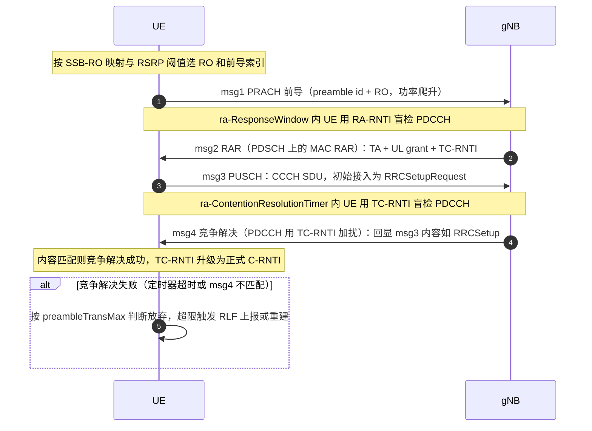

## 关联考点

- 触发场景：[随机接入的触发场景枚举](./05-关键信令流程/ch05-q006-ra-trigger-scenarios.md)
- RAR 细节：[随机接入响应 RAR 的内容与 UL grant](./05-关键信令流程/ch05-q009-rar-content-ul-grant.md)
- 两步接入：[两步随机接入（2-step RA）与四步流程对比](./05-关键信令流程/ch05-q011-two-step-ra.md)

## 面试追问

- **竞争解决为什么用"回显内容"而不是直接分配？** —— 要点：两个 UE 可能选了同一 preamble、同一 RO，网络只知"有一个接入者"；msg4 回显 msg3 的完整内容，只有发送者本人能确认"这是回给我的"，未匹配者判定失败并退避。
- **TC-RNTI 和 C-RNTI 的区别？** —— 要点：TC-RNTI 是 msg2 临时分配、只用于 msg3/msg4 阶段；msg4 竞争解决成功后升级为 C-RNTI，用于后续所有专用调度；已有 C-RNTI 的 UE（如切换）msg4 直接用 C-RNTI 加扰即视为解决。
- **如果两个 UE 的 msg3 完全相同怎么办？** —— 要点：此时用 NG-5G-S-TMSI 区分（包含 UE 专属信息）；若连 S-TMSI 都冲突（概率极低），msg4 后 NAS 层仍会因鉴权失败而剔除其中一个。

---

# 关键信令流程 · CFRA 免竞争随机接入与使用场景（切换/波束恢复）

> 难度：中 ｜ 频率：中

## 一句话答案

免竞争随机接入（CFRA, Contention-Free Random Access）由网络预先给 UE 分配专用 preamble，UE 发出后直接在 msg2 拿到 TA 与确认，无需 msg3/msg4 竞争解决；典型场景是切换、SCG 添加/变更和波束失败恢复——这些场景网络已知 UE 身份，可以"点名"接入。

## 详细展开

**与 CBRA 的差异**：

| 维度 | CFRA | CBRA |
|---|---|---|
| preamble 来源 | 网络专用分配（RRC 信令/DCI） | UE 从公共池随机选 |
| 流程 | msg1 → msg2 即完成 | msg1 → msg2 → msg3 → msg4 |
| 竞争风险 | 无（专用资源） | 有（需竞争解决） |
| 时延 | 低 | 高（多两步 + 重传可能） |
| 典型场景 | 切换、SCG、BFR、SI 请求（部分配置） | 初始接入、重建、失同步数据到达 |

**典型场景展开**：

1. **切换**：源 gNB 向目标 gNB 发切换请求，目标 gNB 在 HANDOVER COMMAND 中携带专用 RACH 资源（rach-OccasionAndPreambleIndex 等）；UE 收到 RRCRelease/切换命令后在目标小区发送专用 preamble，msg2 带 TA，切换即完成上行同步。
2. **SCG 添加/变更**（EN-DC / NR-DC）：主节点为 UE 在 SCG 小区申请专用 preamble，SCG MAC 层完成接入后通知 MCG。
3. **波束失败恢复（BFR）**：UE 检测到波束失败（BFD）后，在 candidate beam list 中选一个质量达标的候选波束，发送与该波束关联的专用 preamble；gNB 以 C-RNTI 加扰 PDCCH 回应即恢复成功。
4. **on-demand SI 请求**：SIB1 中 si-RequestConfig 若配置专用 preamble，UE 发送后网络把 SI 置为广播。

**要点**：

- CFRA 失败会回落 CBRA（如专用 preamble 失效、波束又变了），回落机制保证鲁棒性。
- DCI 1_0 / PDCCH order 也可触发 CFRA（网络主动"点名"UE 做接入，常用于 TA 校正）。

## 关联考点

- 竞争流程：[CBRA 竞争随机接入四步流程](./05-关键信令流程/ch05-q007-cbra-four-step.md)
- 触发场景：[随机接入的触发场景枚举](./05-关键信令流程/ch05-q006-ra-trigger-scenarios.md)
- 切换流程：[测量配置三要素与测量 GAP](./05-关键信令流程/ch05-q019-meas-config-gap.md)

## 面试追问

- **CFRA 为什么没有竞争解决步骤？** —— 要点：专用 preamble 只有该 UE 使用，网络收到即知身份，msg2 直接以 C-RNTI 加扰 PDCCH 携带 TA 与授权，无需 msg3/msg4 确认。
- **波束恢复用 CFRA 的前提是什么？** —— 要点：网络需提前通过 RRC 配置 candidateBeamList，把候选波束（SSB/CSI-RS）与专用 preamble 关联；UE 在质量达标的候选波束上发对应 preamble，网络由此知道"往哪个波束调度 UE"。
- **CFRA 失败会怎样？** —— 要点：专用 preamble 无效或 msg2 超时后，UE 回退到 CBRA（用公共池资源）；若 CBRA 也超限（preambleTransMax），触发 RLF 走重建。

---

# 关键信令流程 · 随机接入响应 RAR 的内容与 UL grant

> 难度：中 ｜ 频率：中

## 一句话答案

随机接入响应（RAR, Random Access Response）是 MAC 层在 msg2 发给 UE 的响应块，核心三要素是定时提前命令（TA Command）、上行授权（UL grant）和临时 C-RNTI（TC-RNTI），另含回退指示（BI）；UL grant 指明了 msg3 的时频资源、MCS、功率控制与 HARQ 信息，UE 据此直接发送首个上行数据。

## 详细展开

**1. RAR 的承载位置**

- gNB 在 ra-ResponseWindow 内以 RA-RNTI 加扰 PDCCH（DCI 1_0）调度 PDSCH，PDSCH 中携带 MAC RAR 或回退 RAR。
- 一个 PDSCH 可承载多个 RAR（子头 + 载荷结构），子头中的 RAPID 标明该 RAR 对应哪个 preamble。

**2. MAC RAR 字段（每个 RAR）**

| 字段 | 作用 |
|---|---|
| TA Command（12 bit） | 定时提前量，单位 16Ts 或按扩展粒度；UE 据此调整上行发送时刻 |
| UL grant（27 bit） | msg3 的调度信息，见下 |
| TC-RNTI（16 bit） | 临时标识，用于 msg3/msg4 的 PDCCH 加扰 |

**3. UL grant（27 bit）的组成**

| 字段 | 说明 |
|---|---|
| 频域资源分配 | msg3 的 PRB 位置 |
| 时域资源分配 | 相对 msg2 的时隙偏移与起止符号 |
| MCS（4 bit） | 调制编码方式，msg3 常用低码率保证可靠性 |
| TPC 命令（3 bit） | PUSCH 功控调整 |
| CSI 请求（1 bit） | msg3 一般不用 |
| 载波/信道指示等 | 部分场景用于指示 NUL/SUL 与 PUSCH 信道 |

**4. 回退 RAR（Backoff Indicator）**

- 若 gNB 未能处理某个 preamble，回退 RAR 子头带 BI（4 bit，指示 0~20 ms 左右的回退档位），UE 延时后重发 msg1，避免冲击。
- 响应窗超时仍未收到匹配 RAPID 的 RAR：UE 按 preambleTransMax 判断重发或放弃。

## 关联考点

- 四步流程：[CBRA 竞争随机接入四步流程](./05-关键信令流程/ch05-q007-cbra-four-step.md)
- msg3 内容：[CBRA 竞争随机接入四步流程](./05-关键信令流程/ch05-q007-cbra-four-step.md)
- 两步接入的 MsgA：[两步随机接入（2-step RA）与四步流程对比](./05-关键信令流程/ch05-q011-two-step-ra.md)

## 面试追问

- **TA Command 为什么必须有？** —— 要点：UE 初次接入时上行定时未知，gNB 通过测量 preamble 到达时刻计算 TA，UE 据此提前发送才能让信号在基站侧对齐；后续周期性 TA 命令通过 MAC CE 维护。
- **msg3 的 MCS 为什么偏低？** —— 要点：msg3 常带 RRC 消息（如 RRCSetupRequest）且此时 UE 尚未完成精确同步/功控，低码率、低阶调制换取高可靠性，失败代价（重新接入）远大于一两个 RB 的开销。
- **RA-RNTI 怎么算？** —— 要点：由发起 msg1 的 RO 位置（符号/时隙/频域/载波）按公式唯一确定，UE 与 gNB 各自按同一公式计算，UE 只解码自己 RO 对应的 RAR；因此换 RO 重发时 RA-RNTI 也随之变化。

---

# 关键信令流程 · 竞争解决失败的表现与定位

> 难度：难 ｜ 频率：中

## 一句话答案

竞争解决失败的典型表现是 UE 在竞争解决定时器（ra-ContentionResolutionTimer）超时前未收到 TC-RNTI 加扰的 msg4，或 msg4 内容与 msg3 不匹配；UE 判定失败后重发 msg1，超过 preambleTransMax 次数则上报 RRC 层，表现为接入失败、RRC 建立请求无响应，最终可能触发无线链路失败（RLF）与重建。

## 详细展开

**1. 失败发生在哪一步**

| 失败点 | 判据 | 信号特征 |
|---|---|---|
| msg1 失败 | 未收到 msg2（RAR） | 基站侧看不到 preamble 解码，或解码但 RAR 覆盖不到 |
| msg3 失败 | msg3 HARQ 重传耗尽仍未成功 | 基站收到 preamble 但无 msg3 解码 |
| msg4 失败（竞争解决失败） | 定时器超时/内容不匹配 | 基站已发 msg4，UE 侧无响应 |

**2. 竞争解决失败的根因**

- **真实冲突**：高负荷小区多个 UE 同时选同一 preamble/RO（大话务、突发并发如地震后批量接入）。
- **覆盖/干扰问题**：msg3 功率不足、上行干扰导致基站解不出或解错 msg3。
- **参数问题**：ra-ResponseWindow 太短、ra-ContentionResolutionTimer 太短、preambleTransMax 过小，弱覆盖 UE 来不及完成流程。
- **msg4 下行丢失**：DL 质量差、PDCCH 聚合度不足、竞争解决 PDSCH 未被 UE 正确接收。
- **msg3 内容冲突**：两个 UE 用同一 NG-5G-S-TMSI（极少见，常因核心网数据异常）。

**3. 定位思路（从计数器入手）**

1. 看基站侧 RACH 尝试次数 vs preamble 解码次数：差值大 → msg1 阶段问题（覆盖/干扰/RACH 资源不足）。
2. 看 RAR 发送 vs msg3 接收：差值大 → msg3 阶段问题（UL 覆盖、TA 异常、功率爬升不够）。
3. 看 msg3 解码 vs msg4 确认（UE 侧 ACK / 基站重传统计）：差值大 → 竞争解决问题（DL 质量或真实冲突）。
4. 结合 UE 侧信令 trace 看 RRCSetupRequest 是否重发、RA 流程终止在哪一步。
5. 现场排查：RACH 资源占比是否够（高负荷要扩 RO）、ssb-PerRACH-OccasionAndCB-PreamblesPerSSB 配置、preamble 目标功率与爬升步长。

## 关联考点

- 四步流程：[CBRA 竞争随机接入四步流程](./05-关键信令流程/ch05-q007-cbra-four-step.md)
- RAR 细节：[随机接入响应 RAR 的内容与 UL grant](./05-关键信令流程/ch05-q009-rar-content-ul-grant.md)
- 接入控制：[随机接入的触发场景枚举](./05-关键信令流程/ch05-q006-ra-trigger-scenarios.md)

## 面试追问

- **怎么区分"真实竞争冲突"和"msg3 解码失败"？** —— 要点：真实冲突时基站能正常解码 msg3，但存在两个 UE 抢同一 preamble——表现为 msg4 发出后一个 UE 确认、另一个无响应；msg3 解码失败则基站根本收不到上行数据，通过 msg3 解码成功率计数器即可区分。
- **大话务场景怎么减少竞争解决失败？** —— 要点：扩展 RACH 资源（增加 RO、增加 CBRA preamble 数）、开启接入限制（ACB/UAC）让部分 UE 延后接入、提高 preambleTransMax 与响应窗，必要时通过 SI 请求引导终端分批接入。
- **UE 竞争解决失败后会立刻重建吗？** —— 要点：不会，先按 backoff 重发 msg1；只有 preambleTransMax 次数耗尽后才进入失败处理——初始接入场景放弃并回 IDLE，连接态场景触发 RLF 走重建流程。

---

# 关键信令流程 · 两步随机接入（2-step RA）与四步流程对比

> 难度：难 ｜ 频率：中

## 一句话答案

两步随机接入把四步合并：UE 在 msgA 中同时发送 preamble 和 PUSCH 数据，gNB 回 msgB（同时携带 RAR 的 TA/授权与竞争解决结果）；相比四步流程省一次往返，显著降低时延，适合小包快速接入，R16 引入，R17 进一步增强。失败时可自动回退到四步（fallback）。

## 详细展开

**1. 流程对比**

| 维度 | 4-step（CBRA） | 2-step |
|---|---|---|
| msg1 + msg3 | 分开：先 preamble 后 RRC 消息 | 合并为 MsgA：PRACH + PUSCH 一次发出 |
| msg2 + msg4 | 分开：RAR 后再竞争解决 | 合并为 MsgB：TA/授权 + 竞争解决一体 |
| 往返次数 | 2 次 | 1 次 |
| 时延 | 高（RA 窗 + 调度） | 低（约省一半接入时延） |
| 控制面开销 | 每步独立调度 | 单次调度更紧凑 |
| 失败回退 | — | MsgA 失败可回退 4-step |
| 引入版本 | R15 | R16，R17 增强 |

**2. MsgA 的组成**

- **PRACH 部分**：与四步相同的前导码，占用独立或共享的 RO 资源（RRC 配置 rach-ConfigCommonTwoStepRA）。
- **PUSCH 部分**：占用 PUSCH 时机（PO），承载 CCCH/DCCH/CDT 数据；用 DMRS 序号区分不同 UE，功率基于 preamble 接收功率推算并加 powerOffset。

**3. MsgB 的判决分支**

- **成功（竞争解决）**：网络用 C-RNTI 或 TC-RNTI 加扰 PDCCH 调度 MsgB，内容含 TA、冲突解决（对 CCCH 回显）或时间对齐命令。
- **回退（fallback）**：MsgB 以 RA-RNTI 回退 RAR（fallback RAR），相当于传统 msg2，UE 接着走 msg3/msg4 四步流程。
- **失败**：MsgA 重发（preambleTransMax 限制），耗尽后同四步失败处理。

**4. 适用场景**

- 小包低时延接入（URLLC、小数据 NIR 状态恢复）。
- NR 时延敏感型初始接入、边缘场景快速恢复。
- 大规模并发接入（R17 增强：SDT 前的接入优化）。
- 现网以四步为主，两步按小区/按频点选择性开启。

## 关联考点

- 四步流程：[CBRA 竞争随机接入四步流程](./05-关键信令流程/ch05-q007-cbra-four-step.md)
- RAR 与 UL grant：[随机接入响应 RAR 的内容与 UL grant](./05-关键信令流程/ch05-q009-rar-content-ul-grant.md)
- 免竞争接入：[CFRA 免竞争随机接入与使用场景](./05-关键信令流程/ch05-q008-cfra-scenarios.md)

## 面试追问

- **MsgA 的 PUSCH 功率怎么定？** —— 要点：以 preamble 目标接收功率为基准，加上网络配置的 msgA-PUSCH 功率偏移，再叠加路损补偿与爬升；因为此时 TA 未建立，允许较大偏差范围，网络侧用 DMRS 序号区分 UE。
- **为什么需要 fallback 到四步？** —— 要点：两步对覆盖与负荷更敏感（PUSCH 部分功率需求更高）；弱覆盖 UE 的 MsgA PUSCH 可能到不了基站，回退机制保证这类 UE 仍能通过更可靠的四步接入，兼顾效率与覆盖鲁棒性。
- **2-step RA 在什么场景收益最大？** —— 要点：小数据包 + 高时延要求 + 覆盖良好（如 URLLC 控制信令、INACTIVE 态小数据传输）；往返减半的时延收益在控制面建链与状态恢复时最明显。

---

# 关键信令流程 · RRC 建立流程与建立原因值

> 难度：易 ｜ 频率：高

## 一句话答案

RRC 建立是终端从 RRC_IDLE 进入 RRC_CONNECTED 的过程：UE 在 msg3 中发送携带建立原因的 RRCSetupRequest，gNB 回 RRCSetup（含 SRB1 配置），UE 回 RRCSetupComplete 完成建立，随后触发 NAS 层注册或服务请求；建立原因共 6 类，其中紧急呼叫优先级最高。

## 详细展开

**1. 流程三步（建立在四步随机接入之上）**

```
UE                          gNB
 |--- msg1: PRACH preamble -->|
 |<-- msg2: RAR (TC-RNTI/TA) -|
 |--- msg3: RRCSetupRequest -->|   ← CCCH，携带建立原因
 |<-- msg4: RRCSetup ----------|   ← SRB1 配置
 |--- RRCSetupComplete ------->|   ← SRB1 上发送，携带选中的 PLMN/注册区信息
```

- RRCSetupRequest 内容：UE 标识（有 5G-S-TMSI 用 ng-5G-S-TMSI-Part，否则随机初始 UE 标识）+ establishmentCause。
- RRCSetup 只配 SRB1，之后所有 RRC 消息（含 Complete）都走 SRB1。

**2. 建立原因值（establishmentCause）**

| 原因值 | 含义 | 典型场景 |
|---|---|---|
| emergency | 紧急呼叫 | 112/110 等无卡/限卡呼叫 |
| highPriorityAccess | 高优先级接入 | 特权用户/ MPS |
| mt-Access | 移动终接接入 | 响应寻呼（来话、来数据） |
| mo-Signalling | 主叫信令 | 注册、去附着、TAU |
| mo-Data | 主叫数据 | 上网、应用数据 |
| mo-VoiceCall / mo-SMS（R16+ 细化） | 主叫语音/短消息 | VoNR、SMS over NAS |

- 原因值影响接入控制（UAC/ACB）与调度优先级，运营商可按原因做差异化准入。

**3. 建立完成之后**

- RRCSetupComplete 上报选网结果（selectedPLMN-Identity、registeredAMF 等），触发 NG 口 Initial UE Message，进入 NAS 注册或服务请求流程。
- 若小区禁止或接入受限（SIB1 cellBarred / UAC），UE 不会发起建立，转而重选其他小区。

**4. 与 LTE 的差异**

- NR 的建立原因值集基本沿用 LTE 并在 R16 增加了 mo-VoiceCall / mo-SMS 的细分，便于语音/短消息业务识别。
- NR 的 RRCSetupRequest 走 SRB0（CCCH），成功后才建 SRB1，与 LTE 一致。

**标准信令时序（UE ↔ gNB，SRB0 → SRB1 转换）**：

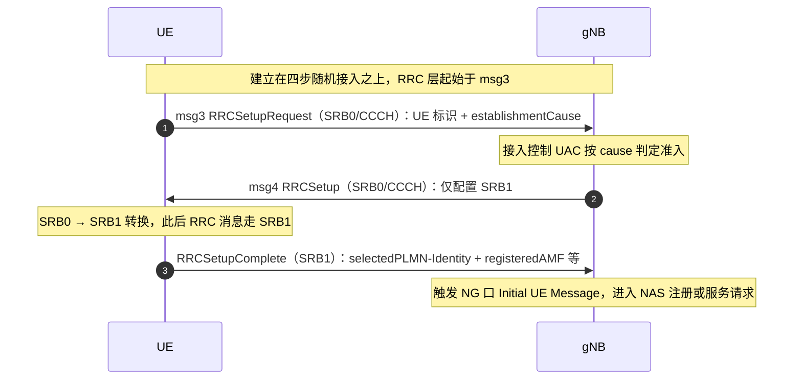

## 关联考点

- 随机接入：[CBRA 竞争随机接入四步流程](./05-关键信令流程/ch05-q007-cbra-four-step.md)
- 注册流程：[NAS 注册流程要点](./05-关键信令流程/ch05-q013-nas-registration-flow.md)
- 服务请求：[Service Request 流程](./05-关键信令流程/ch05-q016-service-request.md)

## 面试追问

- **为什么 msg3 里就要带建立原因？** —— 要点：基站与核心网需要尽早知道接入意图，用于接入控制（UAC 按 cause 分类限制）与差异化调度；等到 NAS 消息才上报就失去了准入控制的意义。
- **mt-Access 和 mo-Signalling 分别什么时候用？** —— 要点：被叫场景（寻呼响应）用 mt-Access；UE 主动发起的纯信令过程（注册、周期性 TA 更新、去附着）用 mo-Signalling，两者在话统中是区分被叫/信令负荷的关键。
- **RRCSetupComplete 之后一定跟注册吗？** —— 要点：不一定——若 UE 已注册且只是被寻呼或要传数据，走 Service Request 流程；只有 IDLE 下未注册/注册态失效时才触发完整 NAS 注册。

---

# 关键信令流程 · NAS 注册流程要点（鉴权/安全模式/注册区域更新）

> 难度：中 ｜ 频率：高

## 一句话答案

5G 注册由 UE 通过 AN 消息携带 Registration Request 发起，网络依次完成：AMF 选择与上下文获取、主鉴权与一致性校验（AUSF/UDM）、NAS 安全模式命令（激活完整性保护与加密）、注册接受（分配 5G-GUTI、TAI list、注册区域）。周期性注册与移动性注册通过重新发 Registration Request（type 为 mobility/periodic updating）完成，无需重新建 RRC。

## 详细展开

**1. 完整注册流程（初始注册）**

```
UE → (RAN) → AMF : Registration Request（type=initial registration）
AMF → UE        : Authentication Request   ← 5G-AKA 鉴权
UE → AMF        : Authentication Response
AMF → UE        : Security Mode Command    ← NAS 安全激活
UE → AMF        : Security Mode Complete
AMF ⇄ UDM       : 注册、签约/接入移动性数据获取
AMF → UE        : Registration Accept（5G-GUTI、TAI List、允许 NSSAI）
UE → AMF        : Registration Complete
```

- RRC 层承载：RRCSetupComplete 携带 NAS Registration Request（初始注册走 SRB1），后续 NAS 消息走 SRB2/DRB 建立前的 SRB1。
- AMF 侧流程：初始 AMF 可能先做重定向（RAN 触发 RRC 重配到目标 AMF）。

**2. 三大要点**

1. **鉴权与一致性**：主鉴权（5G-AKA 或 EAP-AKA'）在安全激活之前完成；网络侧还有一致性校验（对 AKA 失败场景做进一步确认），防伪卡/伪网。
2. **NAS 安全模式**：Security Mode Command 指定完整性算法与加密算法（NR 从 NIA1/NIA2/NIA3 与 NEA0~NEA3 中选），从此 NAS 消息完整性必选、加密可选（NEA0 为不加密）。
3. **注册区域与 5G-GUTI**：AMF 分配 TAI list（注册区域），UE 在区域内移动不用更新；5G-GUTI 作为临时标识替代 IMSI 上行，保护隐私。周期性注册定时器（T3512）到期或移出注册区域时，UE 发起类型为 mobility/periodic updating 的注册更新。

**3. 注册类型**

| 类型 | 触发 |
|---|---|
| initial registration | 开机/从 LTE 互通初始接入 |
| mobility registration updating | 移出注册区域、TAI list 失效、能力/参数变更 |
| periodic registration updating | T3512 定时器到期（保活） |
| emergency registration | 紧急注册（无卡/受限） |

**标准信令时序（UE ↔ gNB ↔ AMF）**：

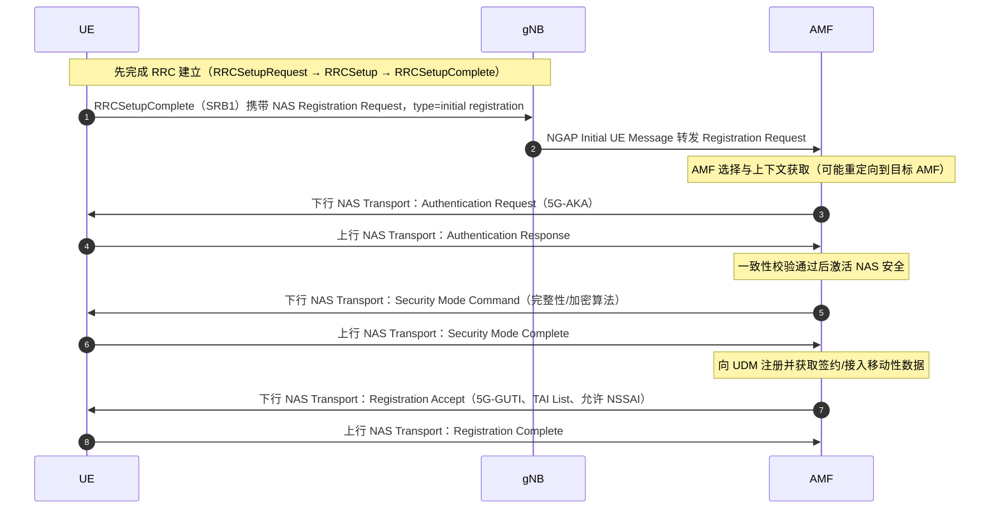

## 关联考点

- 鉴权细节：[5G-AKA 鉴权流程概览](./05-关键信令流程/ch05-q014-5g-aka.md)
- NAS 安全：[NAS 安全模式命令与激活流程](./05-关键信令流程/ch05-q015-nas-security-mode.md)
- RRC 建立：[RRC 建立流程与建立原因值](./05-关键信令流程/ch05-q012-rrc-establishment.md)

## 面试追问

- **注册区域（TAI list）与跟踪区是什么关系？** —— 要点：TA 是寻呼的基本单位，AMF 给 UE 分配一组 TA 构成注册区域，UE 在区域内移动无需注册更新，出区域才发 mobility updating；TAI list 的粒度是寻呼开销与更新信令的折中。
- **鉴权为什么必须在安全激活之前？** —— 要点：安全激活所需密钥（K_amf 衍生）正是鉴权向量/-anchor key 协商的产物；先鉴权拿到锚密钥，才能推导 NAS 与 AS 层密钥并开启完整性/加密。
- **周期性注册的作用是什么？** —— 要点：让网络确认 UE 仍在覆盖且可达，超时未注册则网络把 UE 标记为不可达并可能去功能化（隐式去附着），同时清理过期用户上下文。

---

# 关键信令流程 · 5G-AKA 鉴权流程概览

> 难度：中 ｜ 频率：中

## 一句话答案

5G 主鉴权有 5G-AKA 与 EAP-AKA' 两种，默认由 AMF 发起、AUSF/UDM 协作：UDM/ARPF 生成鉴权向量（RAND、AUTN、XRES*、K_AUSF），AMF 向 UE 发 Authentication Request，UE 用 USIM 校验网络（验 AUTN）并算出 RES*，网络比对 RES* 与 XRES*（5G-AKA 的新特性是*锚点算法与归属域绑定）后完成双向鉴权，锚密钥 K_SEAF 逐级派生 NAS/AS 层密钥。

## 详细展开

**1. 5G-AKA 信令流程**

```
AMF(SEAF) → AUSF : Nausf_UEAuthentication（SUPI/SUCI）
AUSF → UDM       : 获取鉴权向量（ARPF 生成）
UDM → AUSF       : RAND, AUTN, XRES*, K_AUSF（5G 鉴权向量）
AUSF → SEAF      : RAND, AUTN, HXRES*（XRES* 摘要）, K_SEAF
SEAF → UE        : Authentication Request（RAND, AUTN）
UE（USIM）        : 验 AUTN（网络合法性）→ 算 RES*、K_AUSF
UE → SEAF        : Authentication Response（RES*）
SEAF             : 校验 HXRES*（本地比对）
SEAF → AUSF      : 上报 RES*，AUSF 与 XRES* 终局比对
AUSF → SEAF      : 确认，SEAF 推导 K_SEAF → 各层密钥
```

- **SUCI（隐藏订阅标识）**：UE 不直接发 IMSI，用归属网络公钥加密的 SUCI 上报，防 IMSI 捕获——这是 5G 相对 4G 的重要安全增强。

**2. 关键密钥层级**

```
K（USIM 根密钥）
 └ K_AUSF      ← 鉴权产出
    └ K_SEAF   ← AMF 侧锚点
       └ K_AMF
          ├ K_NAS_int / K_NAS_enc   （NAS 完整性/加密）
          └ K_gNB / K_NG-RAN *      （AS 层，经水平/垂直密钥推导）
             ├ K_RRC_int / K_RRC_enc
             └ K_UP_int / K_UP_enc
```

**3. 5G-AKA vs EAP-AKA'**

| 维度 | 5G-AKA | EAP-AKA' |
|---|---|---|
| 承载 | NAS 消息（AMF 中转） | EAP 帧（AMF 透传给 AUSF） |
| 校验位置 | SEAF 先比 HXRES*，AUSF 终局比 | AUSF 直接做 EAP 校验 |
| UE 验证网络 | AUTN 校验（归属域确认前不最终信任） | EAP-Success 由归属域签发 |
| 使用倾向 | 默认、信令少 | 部分运营商/漫游场景 |

**4. 鉴权失败处理**

- UE 校验 AUTN 失败回 Authentication Failure（如 MAC 失败/SYNCH 失败），网络可重发或判为伪网。
- 网络比对失败（RES* ≠ XRES*）拒绝接入，防伪卡。

## 关联考点

- 注册流程：[NAS 注册流程要点](./05-关键信令流程/ch05-q013-nas-registration-flow.md)
- NAS 安全激活：[NAS 安全模式命令与激活流程](./05-关键信令流程/ch05-q015-nas-security-mode.md)
- AS 安全：[NAS 注册流程要点](./05-关键信令流程/ch05-q013-nas-registration-flow.md)

## 面试追问

- **SUCI 解决什么问题？** —— 要点：4G 时代 IMSI 明文上行易被伪基站/侦听设备捕获；SUCI 用归属网络公钥加密订阅标识，只有归属 UDM 能解，是 5G 用户身份隐私的核心增强。
- **HXRES* 与 XRES* 为什么要分两处比？** —— 要点：SEAF（拜访地）只拿摘要 HXRES* 做快速校验，完整 XRES* 留在归属 AUSF 终局比对——拜访地无需接触完整凭据，降低泄露面。
- **5G-AKA 与 EAP-AKA' 怎么选？** —— 要点：网络在签约/漫游策略中决定，EAP-AKA' 的 EAP-Success 由归属域颁发、UE 对网络的信任建立更严格，常用于对安全要求高的漫游场景；5G-AKA 信令更少、时延更低，是多数商用网默认。

---

# 关键信令流程 · NAS 安全模式命令与激活流程

> 难度：中 ｜ 频率：中

## 一句话答案

鉴权完成后，AMF 向 UE 发 NAS Security Mode Command，指定完整性保护算法（NIA）与加密算法（NEA），UE 校验命令本身已受完整性保护后回 Security Mode Complete，此后 NAS 消息全部启用完整性保护（必选）与加密（可选）；AS 层（RRC/PDCP）安全由后续 AS Security Mode Command 单独激活，密钥从 K_AMF 推导。

## 详细展开

**1. 流程与消息内容**

```
AMF → UE : Security Mode Command
           ├── selectedNASSecurityAlgorithms（NIA/NEA）
           ├── ngKSI（密钥集标识）
           └── ABBA（防降级攻击参数，R15 特有）
UE（校验完整性 OK）
UE → AMF : Security Mode Complete（已加密+完整性保护）
```

- **算法协商**：网络按 UE 能力（注册时上报的 5G-EA/5G-IA 列表）与自身策略从高到低选择；算法集 NIA0（空完整性，仅限紧急呼叫特殊场景）/NIA1（SNOW 3G）/NIA2（AES）/NIA3（ZUC），NEA0（不加密）/NEA1~NEA3 对应同族。
- **ABBA**：5G 特有字段，把"本次协商结果"绑定进完整性校验，防止中间人降级算法。

**2. 安全激活的时序规则**

- 鉴权成功后才发安全模式命令——密钥材料（K_AMF）由鉴权产出。
- Security Mode Command 本身**已用 K_NAS_int 完整性保护**（但未加密），UE 收到先验完整性，通过才回 Complete；这一步"自保护"防伪造命令。
- Security Mode Complete 起双向全保护；此前上行消息仅明文。
- 若 UE 校验失败回 Security Mode Reject，网络可重协商或拒绝接入。

**3. NAS 安全与 AS 安全的分工**

| 层 | 命令 | 保护对象 | 密钥来源 |
|---|---|---|---|
| NAS | Security Mode Command（AMF↔UE） | NAS 信令 | K_NAS_int/enc，由 K_AMF 派生 |
| AS | AS Security Mode Command（gNB↔UE） | RRC 信令 + 用户面数据 | K_gNB，由 K_AMF 派生（水平/垂直推导） |

- 切换/重建时 AS 密钥刷新（K_gNB*），NAS 密钥不变——分层设计让移动性不影响核心网安全上下文。

**4. 实践要点**

- NEA0（不加密）是合法配置，但完整性不可关闭（NIA0 仅紧急呼叫例外）——"必完整、可选密"是 5G 原则。
- 密钥集标识 ngKSI 用于 UE 重连时匹配安全上下文，避免重复鉴权。

## 关联考点

- 鉴权流程：[5G-AKA 鉴权流程概览](./05-关键信令流程/ch05-q014-5g-aka.md)
- 注册流程：[NAS 注册流程要点](./05-关键信令流程/ch05-q013-nas-registration-flow.md)
- 协议栈安全：[RRC 建立流程与建立原因值](./05-关键信令流程/ch05-q012-rrc-establishment.md)

## 面试追问

- **为什么 Security Mode Command 只做完整性不加密？** —— 要点：加密密钥 K_NAS_enc 同样已具备，但命令是安全机制的"起点"，若自身加密则 UE（此时安全上下文尚未激活确认）处理链路复杂且出错难定位；业界做法是"完整性先行，Complete 之后再全加密"。
- **NAS 安全和 AS 安全为什么分两次激活？** —— 要点：两者保护对象与密钥归属不同——NAS 保护 UE 与 AMF 的非接入层信令，AS 保护 UE 与 gNB 的 RRC/用户面；gNB 是不可信程度更高的网元，AS 密钥单独派生，gNB 泄露不影响 NAS 层。
- **完整性保护为什么不能关闭？** —— 要点：完整性是防篡改/重放的最后防线，5G 安全架构强制 NAS 与 RRC 均须完整（NIA0 仅紧急呼叫等特殊场景例外）；加密可协商关闭（保护隐私为主），但信令被篡改的代价不可接受。

---

# 关键信令流程 · Service Request 流程（寻呼响应/上行数据触发）

> 难度：中 ｜ 频率：中

## 一句话答案

Service Request 让处于 CM-IDLE 或 CM-CONNECTED（INACTIVE）的 UE 重新建立 NAS 连接：被叫场景 UE 收寻呼后以 mt-Access 原因做 RRC 建立，上行数据/信令场景以 mo-Data/mo-Signalling 主动发起；NAS 层发 SERVICE REQUEST（用 5G-S-TMSI 或 I-RNTI 标识），AMF 恢复/建立上下文，gNB 随后完成 AS 安全激活与 DRB 建立，用户面打通。

## 详细展开

**1. 两种触发路径**

| 触发 | 起点 | 过程 |
|---|---|---|
| 寻呼响应（被叫） | 网络下行数据到达 → 5GC 寻呼 → RAN 寻呼 → UE 收到 | UE 发 RRCSetup（mt-Access）→ RRCSetupComplete 携带 SERVICE REQUEST（5G-S-TMSI） |
| 上行数据/信令（主叫） | UE 有数据或 NAS 信令要发 | RRC 建立（mo-Data/mo-Signalling）→ 同样在 Complete 中带 SERVICE REQUEST |
| INACTIVE 恢复 | UE 在 RRC_INACTIVE 有数据/被寻呼 | 走 RRCResume 流程（I-RNTI），与 NAS SR 并行或触发 NAS SR |

**2. 信令链（以寻呼响应为例）**

```
UE → RAN : RRCSetupRequest(establishmentCause=mt-Access)
RAN → UE : RRCSetup / UE → RAN : RRCSetupComplete（含 SERVICE REQUEST）
RAN → AMF: Initial UE Message（N2，转发 SERVICE REQUEST）
AMF      : 校验 5G-S-TMSI → 找到 UE 上下文
AMF ⇄ RAN: （可选）鉴权/安全模式
AMF → RAN: Initial Context Setup Request（安全算法、PDU 会话信息、QoS flow）
RAN ⇄ UE : AS 安全激活（AS Security Mode Command）+ RRCReconfiguration（建 SRB2/DRB）
RAN → AMF: Initial Context Setup Response → 用户面隧道建立（N3）
```

- SERVICE REQUEST 可加密完整性保护（NAS 安全已激活时），或用明文 5G-S-TMSI（仅当无有效 NAS 安全时，此时网络需先鉴权）。
- AMF 若判定需要，可回 SERVICE REJECT（如无上下文、鉴权失败）。

**3. INACTIVE 态的差异**

- RRC_INACTIVE 的 UE 先走 RRCResume（AS 层恢复），若 AS 上下文里已带 NAS 传递通道则 NAS SR 可省；触发原因同为被叫寻呼或主叫数据。
- 数据量很小的场景 R17 引入 RRC Inactive 小数据传输（SDT），可在 Resume 消息里直接捎带数据，避免进入 CONNECTED。

**4. 关键点**

- Service Request 是"NAS 连接级"恢复：不重建 PDU 会话，只重建 N3 隧道与空口 DRB。
- 原因值（mt-Access vs mo-Data）沿 RRC 建立原因传递，影响准入与话统。

**标准信令时序（UE ↔ gNB ↔ AMF，以寻呼响应为例）**：

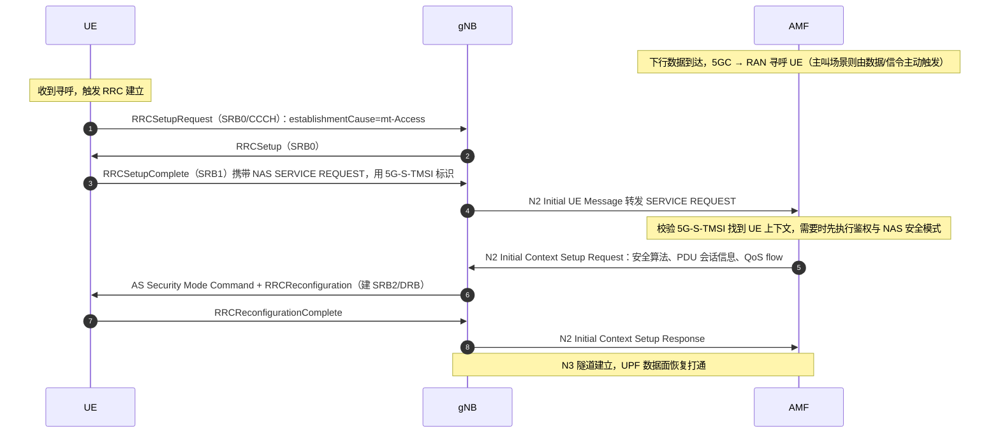

## 关联考点

- RRC 建立：[RRC 建立流程与建立原因值](./05-关键信令流程/ch05-q012-rrc-establishment.md)
- INACTIVE 态：[RRC Release with suspend 与进入 INACTIVE](./05-关键信令流程/ch05-q017-rrc-release-suspend.md)
- 注册流程：[NAS 注册流程要点](./05-关键信令流程/ch05-q013-nas-registration-flow.md)

## 面试追问

- **被叫 UE 收到寻呼后为什么用 mt-Access 而不是 mo-Data？** —— 要点：establishmentCause 表明"谁发起"——寻呼响应是被网络触发的接入，用 mt-Access；这影响接入控制的优先级分类与话统口径（主叫/被叫区分）。
- **SERVICE REQUEST 放在 RRCSetupComplete 里有什么好处？** —— 要点：省一条独立 NAS 消息，RRC 建立完成的同时就把 NAS 请求带到 AMF，缩短被叫建立时延（寻呼→通话/数据通路少一次往返）。
- **Service Request 和 Registration 有什么区别？** —— 要点：Registration 建立的是"注册上下文"（TAI list、5G-GUTI、签约同步），Service Request 建立的是"连接上下文"（N3 隧道、DRB）；已注册 UE 传数据只需 SR，无需重新注册。

---

# 关键信令流程 · RRC Release with suspend 与进入 INACTIVE

> 难度：中 ｜ 频率：中

## 一句话答案

网络用带 suspendConfig 的 RRCRelease 把 UE 从 RRC_CONNECTED 释放到 RRC_INACTIVE：UE 保存完整 AS 上下文（安全密钥、配置、I-RNTI），保持 CM-CONNECTED 与 NG 连接，寻呼由 RAN 侧负责；相比释放到 IDLE，恢复时只需 RRCResume 三步即可收发数据，时延与信令开销显著降低。

## 详细展开

**1. 三个 RRC 状态对比**

| 维度 | RRC_IDLE | RRC_INACTIVE | RRC_CONNECTED |
|---|---|---|---|
| AS 上下文 | 不保存 | UE 与 gNB 保存 | 双方保存 |
| 标识 | 5G-GUTI | I-RNTI（非激活 RNTI） | C-RNTI |
| 寻呼 | 核心网寻呼（5GC 发起） | RAN 寻呼（RNA 内 gNB 发起）+ 核心网寻呼兜底 | 专用调度 |
| 移动性 | 小区重选（UE 自主） | 小区重选 + RNA 更新 | 测量切换（网络控制） |
| NG/N3 连接 | 释放 | 保持（AMF/UPF 侧上下文在） | 保持 |

**2. 释放流程**

```
gNB → UE : RRCRelease（含 suspendConfig）
           ├── rnac-Info：RNA 标识、RNA 更新相关定时器（T380）
           ├── 专用优先级（可选）
           └── 与 SIB 配置的 RACH 资源关联（恢复用）
UE       : 存上下文 → 进 INACTIVE → 按重选机制驻留
```

- suspendConfig 可由专用 RRCRelease 下发（也可在网络配置下由 UE 侧触发恢复失败后回到 IDLE）。
- gNB 侧保留 UE 上下文并把 I-RNTI 与 anchor gNB 信息登记到 RNA 内相邻 gNB（通过 Xn/X2 传递），这是 RAN 寻呼能找到 UE 的前提。

**3. 恢复流程（RRCResume）**

```
UE → gNB : RRCResumeRequest（I-RNTI + resumeMAC-I 短校验）
gNB      : 用 I-RNTI 找回上下文（本站命中或 Xn 取回）
gNB → UE : RRCResume（恢复 SRB1/安全，必要时重配）
UE → gNB : RRCResumeComplete
```

- 恢复失败（gNB 无上下文/I-RNTI 校验失败）时 gNB 回 RRCSetup 走 fallback，UE 降级为四步建立。
- 恢复可携带原因（如被寻呼、上行数据、RNA 更新）。

**4. 价值与代价**

- 价值：省去初始接入+上下文建立（对比 IDLE→CONNECTED 的完整 NAS SR 流程），小包业务时延明显降低；NG/N3 不拆，网络侧状态轻量保持。
- 代价：gNB 要长期保存上下文与 I-RNTI 映射，UE 省电效果介于 IDLE 与 CONNECTED 之间（需周期性 RNA 更新与 RAN 寻呼监听）。

## 关联考点

- RNA 更新：[RNA 更新的两种方式](./05-关键信令流程/ch05-q018-rna-update.md)
- Service Request：[Service Request 流程](./05-关键信令流程/ch05-q016-service-request.md)
- 状态机：[RRC 建立流程与建立原因值](./05-关键信令流程/ch05-q012-rrc-establishment.md)

## 面试追问

- **INACTIVE 与 IDLE 最本质的区别是什么？** —— 要点：网络侧是否保留连接上下文——INACTIVE 保持 CM-CONNECTED 与 NG/N3 关联，恢复走 AS 层 RRCResume；IDLE 一切从零开始，恢复需完整 NAS Service Request 流程。
- **RAN 寻呼为什么只发在 RNA 内？** —— 要点：UE 在 RNA 内移动不通知网络，网络只知道"UE 在这个 RNA 的某个小区"；RNA 内所有 gNB 同时发 RAN 寻呼（在各自的寻呼时机上），区域外则靠 RNA 更新保证 UE 位置新鲜度，兜底仍有 5GC 寻呼。
- **RRCResume 失败会怎样？** —— 要点：gNB 无该 UE 上下文（上下文老化、跨 RNA 丢失）时回 RRCSetup 走回退建立；I-RNTI 校验失败同样回退——设计上保证恢复失败不导致 UE 卡死，代价是多走一次完整建立。

---

# 关键信令流程 · RNA 更新的两种方式

> 难度：中 ｜ 频率：低

## 一句话答案

RRC_INACTIVE 态的 UE 在移动出 RNA（RAN 通知区域，RAN-based Notification Area）或 RNA 更新定时器（T380）到期时发起 RNA 更新，有两种方式：一是通过 RRCResumeRequest（resumeCause=rna-Update）走恢复流程更新，二是网络在配置周期性 RNAU 时让 UE 用 NAS 层 Registration 更新携带（周期性 TAU 兼做 RNAU）。前者是默认方式，后者仅在网络明确启用时使用。

## 详细展开

**1. 为什么需要 RNA 更新**

- INACTIVE 态 UE 位置对网络只精确到 RNA（一组小区/TA 的集合）；UE 移出 RNA 后若不更新，RAN 寻呼将找不到 UE。
- 即使不动，T380 到期也要周期更新一次，向网络证明"我还活着"，与 IDLE 态的周期性注册（T3512）思想一致，但粒度与触发主体是 RAN。

**2. 两种更新方式**

| 方式 | 载体 | 触发条件 | 特点 |
|---|---|---|---|
| RRC 层 RNAU | RRCResumeRequest（resumeCause=rna-Update）→ gNB 回 RRCRelease（可再带 suspendConfig） | 出 RNA 或 T380 到期 | 默认方式；走 AS 恢复，gNB 可顺带重配/刷新上下文，完成即回 INACTIVE，不进 CONNECTED |
| NAS 层 RNAU | Registration Request（registration type=mobility registration updating，RNAU 指示） | 网络配置 periodicRegistrationUpdate 且 T380 到期 | 复用 NAS 注册更新，信令层级更高，AMF 参与；现网少用 |

**3. RRC 层 RNAU 流程要点**

```
UE → gNB : RRCResumeRequest(I-RNTI, resumeCause=rna-Update)
gNB      : 校验/取回上下文（本站或 Xn）
gNB → UE : RRCResume（激活 SRB1）
UE → gNB : RRCResumeComplete
gNB → UE : RRCRelease（suspendConfig，重置 T380）
```

- 网络可在 Resume 后修改 RNA 范围（重新下发 rnac-Info）。
- UE 重选进入新 RNA 的小区时，在驻留后发起；若此时有数据要发，resumeCause 直接用数据原因，RNA 更新顺带完成。

**4. 与 IDLE 态移动性的对比**

- IDLE：重选后无需通知（位置对网络只到 TA），仅 T3512/移出 TA 触发 NAS 层更新。
- INACTIVE：RNA 更新让网络维持"RNA 粒度"的位置，换取 RAN 寻呼低时延；这是 INACTIVE 比 IDLE 多出的信令开销。

## 关联考点

- 进入 INACTIVE：[RRC Release with suspend 与进入 INACTIVE](./05-关键信令流程/ch05-q017-rrc-release-suspend.md)
- 恢复流程：[Service Request 流程](./05-关键信令流程/ch05-q016-service-request.md)
- NAS 注册更新：[NAS 注册流程要点](./05-关键信令流程/ch05-q013-nas-registration-flow.md)

## 面试追问

- **RNA 的范围怎么定？** —— 要点：由网络配置，可以是单 gNB 内的小区列表、RAN 节点列表或 TA 列表三种粒度；范围大省更新信令但寻呼开销大，范围小则相反，运营按用户移动性与寻呼容量折中。
- **RNAU 时 UE 会进入 CONNECTED 吗？** —— 要点：RRC 层方式下短暂进入（完成 Resume/Release 握手）即回 INACTIVE，不建立 DRB、不涉及用户面；NAS 方式则需要完成注册更新的 NAS 交互。
- **T380 和 T3512 有什么区别？** —— 要点：T380 是 RAN 侧 RNA 更新定时器（INACTIVE 态，gNB 下发），T3512 是核心网周期注册定时器（IDLE 态，AMF 签约配置）；两者独立运行，INACTIVE 态 UE 若 NAS 方式更新也会涉及 T3512 的复位。

---

# 关键信令流程 · 测量配置三要素（测量对象/报告配置/测量标识）与 GAP

> 难度：中 ｜ 频率：高

## 一句话答案

NR 测量配置由三要素构成：测量对象（measObject，定义测谁的频点/参考信号）、报告配置（reportConfig，定义怎么报——事件触发/周期、门限、迟滞、触发时间）、测量标识（measId，把两者绑在一起交给 UE 执行）；当目标频点不在 UE 收发机带宽内时，需要配置测量 GAP——在指定周期里暂停收发、把射频调到异频/异系统测量，GAP 模式（如 40 ms 周期）按需激活。

## 详细展开

**1. 三要素关系**

```
measObjectNR ──┐
               ├── measId ──→ 下发给 UE 执行
reportConfig ──┘
```

| 要素 | 关键内容 | 典型配置 |
|---|---|---|
| measObjectNR | ssbFrequency（频点）、ssbSubcarrierSpacing、幅值偏移 freqOffsetOFDM、SMTC 周期、referenceSignalCSIs-RS（CSI-RS 测量时） | 每个被测频点一个 |
| reportConfig | reportType（eventA1~A6/eventB、periodical）、触发门限、hysteresis、timeToTrigger、reportAmount/reportInterval、相关 RS 类型 | 每种报告策略一个 |
| measId | 把 measObject 与 reportConfig 绑定 | 一个 measId = 一条完整测量任务 |

- UE 能力（bandCombination、measAndMobilityParameters）决定可测频段组合与 GAP 需求；网络按能力+邻区配置生成三要素。

**2. 测量 GAP**

- **作用**：单射频链 UE 无法边服务边测异频，网络下发 gapConfig（如 GP0：约 6 ms 窗口 / 40 ms 周期）让 UE 在 GAP 期间暂停当前小区收发，调谐到目标频点测量。
- **模式**：NR 定义 per-UE GAP（gapUE）与 per-FR GAP，支持 40 ms 与 80 ms 等周期；GAP 是否需要由 UE 频段组合能力（measGap 相关字段）与目标频点相对服务频点的关系决定。
- **代价**：GAP 期间无本小区收发，影响吞吐与时延——因此同频测量优先免 GAP，异频测量尽量用多链路 UE 或 SMTC 控制测量窗口。

**3. 配置下发与生效**

- RRCReconfiguration 携带 measConfig（measObjectToAddModList、reportConfigToAddModList、measIdToAddModList、gapConfig 等），UE 侧按 measId 逐一执行。
- SMTC（SSB 测量时机配置）限制 UE 在哪些时间窗测 SSB，与 SSB 周期对齐，降低耗电。
- 测量结果通过 MeasurementReport（SRB1）上报，作为切换判决输入。

## 关联考点

- 事件体系：[事件 A1–A6 的含义与典型使用场景](./05-关键信令流程/ch05-q020-events-a1-a6.md)
- 波束测量：[波束管理整体流程](./03-MIMO与波束管理/ch03-q005-beam-management-flow.md)
- NSA 测量：[NSA 终端如何驻留 LTE 并测量 NR](./01-无线基础与演进/ch01-q014-nsa-measurement-b1-b3.md)

## 面试追问

- **measId 为什么要存在？** —— 要点：把"测什么"与"怎么报"解耦复用——同一个频点对象可配不同报告策略（如 A3 与周期报告），同一报告策略可套多个频点；measId 是网络灵活组合、UE 无歧义执行的关键。
- **GAP 对业务有什么影响，怎么减少？** —— 要点：GAP 期间暂停调度，吞吐与时延受损；减少手段包括优先同频测量、按 UE 能力用双链路免 GAP、精配 SMTC 缩窄测量窗、仅在需要切换时才激活 GAP。
- **SSB 测量与 CSI-RS 测量在配置上的区别？** —— 要点：SSB 测量配 ssbFrequency+SMTC，用于同频/异频小区级移动性；CSI-RS 测量在 measObject 的 referenceSignalCSIs-RS 中列举资源，用于连接态精细移动性（如 CFRA 准备）与波束级测量，粒度更细但配置更重。

---

# 关键信令流程 · 事件 A1–A6 的含义与典型使用场景

> 难度：易 ｜ 频率：高

## 一句话答案

NR 事件 A1–A6 是同频/异频（NR 内）测量事件的"六兄弟"：A1 服务小区变好（停止异频测量/恢复业务）、A2 服务小区变差（启动异频测量/触发负载转移准备）、A3 邻区比服务小区好偏移量（同频/等优先级切换主力）、A4 邻区绝对门限（异频负荷均衡/定向切换）、A5 服务小区差于门限1 且邻区好于门限2（弱覆盖切换主力）、A6 邻区比 SCM（服务小区复用指标）好——用于辅载波/邻区管理。

## 详细展开

**1. 六个事件的触发条件与典型用途**

| 事件 | 触发条件（进入条件） | 典型使用场景 |
|---|---|---|
| A1 | 服务小区质量 > 门限 | 质量恢复：关闭 GAP/异频测量、停用载波聚合辅助小区相关操作 |
| A2 | 服务小区质量 < 门限 | 质量恶化预警：开启异频/异系统测量、准备切换或重定向 |
| A3 | 邻区质量 > 服务小区质量 + offset | 同频/等优先级切换（最常用，基于相对比较，对路损抖动鲁棒） |
| A4 | 邻区质量 > 绝对门限 | 异频定向切换/负荷均衡（不管服务小区多好，目标够好就走） |
| A5 | 服务小区 < 门限1 且 邻区 > 门限2 | 弱覆盖/边缘切换（双门限确认"服务确实差、目标确实好"） |
| A6 | 邻区质量 > SCM + offset（SCM 为服务小区复用质量） | 辅小区（SCell）邻区评估与 CA 场景管理 |

- 事件 A 报告用于 NR 内移动性；跨系统（NR↔E-UTRA）另有 B1/B2 事件（目标系统好于门限/服务差且目标好）。
- 进入/离开由 entering/leaving 条件 + hysteresis（迟滞）+ timeToTrigger（触发时间 TTT）三重防抖。

**2. 事件参数怎么配**

- a3-Offset / a4-Thresh / a5-Threshold1/2：核心门限，RSRP（dBm）或 RSRQ（dB）。
- hysteresis：迟滞量，防乒乓。
- timeToTrigger：条件需持续 TTT 才上报，抑制瞬时抖动。
- reportInterval / reportAmount：上报节奏；触发型事件后常配"事件触发一次 + 后续周期"组合。
- offset 可带频点级（freqSpecificOffset）与小区级（cellIndividualOffset）修正，是现网优化切换带的常用抓手。

**3. 典型联动**

- 弱覆盖切换链：A2 启动异频测量 → A5（或 A3）触发切换 → 切到新频点后 A1 关闭测量。
- 负载均衡链：A4 让用户向空闲频点迁移，配合优先级与门限实现话务疏导。
- CA 管理：A6/A5 组合评估 SCell 增删（加 SCell 用 A4/A5 判断目标载波质量）。

## 关联考点

- 测量配置：[测量配置三要素与测量 GAP](./05-关键信令流程/ch05-q019-meas-config-gap.md)
- B 事件：[NSA 终端如何驻留 LTE 并测量 NR](./01-无线基础与演进/ch01-q014-nsa-measurement-b1-b3.md)
- 波束级测量：[波束失败检测 BFD 与候选波束 CBF 的判定条件](./03-MIMO与波束管理/ch03-q010-bfd-cbf-criteria.md)

## 面试追问

- **A3 和 A5 在切换中怎么选？** —— 要点：同频/等优先级覆盖连续场景用 A3（相对比较，天然适应路损波动）；异频或覆盖断裂场景用 A5（绝对双门限，能确认"服务确实不可用"）；现网常 A3 为主、A5 兜底。
- **hysteresis 和 timeToTrigger 各防什么？** —— 要点：hysteresis 防"边界来回跨"（信号在门限附近抖动），TTT 防"瞬时抖动误报"（快衰落尖峰）；两者叠加让切换只在稳定趋势下发生。
- **A1 为什么要存在——不是切换完就自动关测量吗？** —— 要点：A1 是"质量恢复"的显式判据，用于控制测量开销与 GAP 停用、恢复单载波工作；没有 A1，网络只能凭超时或盲策略回收测量资源，效率与灵活性都差。

---

# 关键信令流程 · 事件 B1/B2 的含义与异系统测量流程

> 难度：易 ｜ 频率：高

## 一句话答案

B 事件是异系统（inter-RAT）测量事件：B1 表示"异系统邻区质量好于绝对门限"，用于 NR→LTE 重定向/E-UTRAN 测量的开启与触发；B2 表示"服务小区质量差于门限1，且异系统邻区好于门限2"，双门限确认服务确实恶化、目标确实可用。两者都基于异系统对应信号量（如 E-UTRA RSRP/RSRQ）判决，是 4G/5G 互操作的核心判决依据。

## 详细展开

**1. 两个事件的触发条件与典型用途**

| 事件 | 进入条件 | 典型使用场景 |
|---|---|---|
| B1 | 异系统邻区质量 > 绝对门限 | 负载均衡/语音 EPS fallback 时寻找 LTE 落脚小区；与 A2 配合：A2 先开异系统测量，B1 触发重定向 |
| B2 | 服务小区质量 < 门限1 且 异系统邻区 > 门限2 | 覆盖边缘向低频段/异系统迁移，确保"服务确实差、目标确实好"才走，防误切 |

**2. 触发的完整信令链（以 NR→LTE 重定向为例）**

1. gNB 通过 RRC Reconfiguration 下发 measConfig：measObject（E-UTRA 频点）、reportConfig（B1/B2 事件门限 + hysteresis + timeToTrigger）；
2. 若异系统频点与服务小区不共帧，还需配测量 GAP（gap 模式让 UE 离开当前频点去测异系统）；
3. UE 上报 MeasurementReport（含 E-UTRA RSRP/RSRQ）；
4. gNB 判决后执行移动性动作：连态走重定向（RRC Release 带 redirectedCarrierInfo，去 LTE 读 SIB1 重选回落）或 N2/NG 切换到 EPC； idle 态按广播的重选优先级执行小区重选。

**3. 与 A 事件的关系**

- A 事件解决"NR 内部移动性"（同频/异频），B 事件解决"跨 RAT 移动性"（NR↔E-UTRA）；
- 典型组合是"A2 启动、B1 触发"或"A2 + B2 直接判决"，A2 是测量开关，B1/B2 是执行开关；
- 参数结构与 A 事件一致：门限 + hysteresis（迟滞）+ timeToTrigger（触发时间）三重防抖。

## 关联考点

- 同系统事件对照：[事件 A1–A6 的含义与典型使用场景](./05-关键信令流程/ch05-q020-events-a1-a6.md)
- NSA 侧的 B 事件用法：[NSA 终端如何驻留 LTE 并测量 NR（B1/B3 事件与系统消息配合）](./01-无线基础与演进/ch01-q014-nsa-measurement-b1-b3.md)
- 测量配置与 GAP：[测量配置三要素（测量对象/报告配置/测量标识）与 GAP](./05-关键信令流程/ch05-q019-meas-config-gap.md)
- 互操作总览：[4G/5G 互操作：EPC 与 5GC 间的切换与重选](./01-无线基础与演进/ch01-q017-4g-5g-interworking.md)

## 面试追问

- **为什么语音 EPS fallback 常用 B1 而不是 B2？** —— 要点：发起回落时服务小区 NR 覆盖往往尚可（业务不受限），只需确认 LTE 目标够好即可，用 B1 绝对门限更直接；若等 B2 的双门限，可能服务先掉到不可用，回落时延和失败率都变差。边缘弱覆盖场景才用 B2 兜底。
- **B1 门限配高了/低了会怎样？** —— 要点：配高→LTE 目标要求苛刻，触发慢甚至不触发，回落时延大或 fallback 失败重试；配低→目标质量不保证，回落到 LTE 后可能立即弱覆盖掉话。需要按覆盖衔接仿真+路测校准，并结合 hysteresis/TTT 防乒乓。
- **UE 连态测 E-UTRA 一定要 GAP 吗？** —— 要点：取决于 UE 测量能力和频点关系；若终端支持无 GAP 测异频/异系统（能力上报声明），且不与收发冲突，可省 GAP；否则必须配 GAP，GAP 会打断数据传输，是覆盖与速率权衡的一部分。

---

# 关键信令流程 · 测量上报的方式（周期/事件触发）与上报内容

> 难度：中 ｜ 频率：中

## 一句话答案

测量上报由 reportConfig 控制，分两大类：周期性上报（periodical）按 reportInterval 定时上报，常用于负载均衡、SON 和 SON 类采集；事件触发上报在满足事件进入条件且持续 timeToTrigger 后上报，常配合"事件触发一次 + 事件后周期上报（reportAmount 有限次数）"的组合。上报内容包括测量标识、服务小区与邻区的测量结果量（RSRP/RSRQ/SINR）、以及满足进入条件的小区列表（可含小区级偏移信息）。

## 详细展开

**1. 两种上报方式的触发逻辑**

| 方式 | 触发条件 | 典型用途 |
|---|---|---|
| 周期上报 | 每个 reportInterval 到期即报 | 负荷均衡持续评估、强删/强插邻区关系（ANR 采集）、参数自优化数据源 |
| 事件触发上报 | 事件进入条件持续 timeToTrigger 满足 | A/B/C 类事件判决：切换、重定向、CA 辅小区增删 |
| 事件触发 + 周期跟随 | 事件满足后先报一次，再按 reportInterval 报 reportAmount 次 | 切换场景最常见：既保证及时触发，又给网络后续判决留观察窗 |

**2. 上报内容的关键字段**

- measId（测量标识）：把测量对象与上报配置关联起来，网络据此识别是哪条测量任务；
- 测量结果量：由 reportQuantity 决定，RSRP（dBm，信号强度）、RSRQ（dB，质量）、SINR（dB，干扰与质量），NR 与 E-UTRA 各自独立配；
- cellsTriggeredList：满足进入条件的小区及其结果（可含最近一次结果与是否含 offset）；
- 事件触发类还可能包含 exceededThreshold 小区的 beam 级结果（SSB RI/RSRP 等），NR 支持按 beam 上报供波束管理用。

**3. 防抖与节流参数**

- hysteresis（迟滞）：门限附近抖动防乒乓；
- timeToTrigger（触发时间）：条件须持续存在才上报，防瞬时快衰落误报；
- reportInterval / reportAmount / maxReportCells：控制上报节奏、次数与每次携带的小区数上限，直接关联空口信令开销。

**4. 触发后的执行链**

事件上报本身不执行任何动作，只把结果交 gNB 判决：gNB 结合负载、目标小区接纳、Xn/NG 链路状态决定切换/重定向/去激活等动作——上报与执行解耦，是"测量-判决-执行"三段式的中段。

## 关联考点

- 测量配置框架：[测量配置三要素（测量对象/报告配置/测量标识）与 GAP](./05-关键信令流程/ch05-q019-meas-config-gap.md)
- A 类事件：[事件 A1–A6 的含义与典型使用场景](./05-关键信令流程/ch05-q020-events-a1-a6.md)
- B 类事件：[事件 B1/B2 的含义与异系统测量流程](./05-关键信令流程/ch05-q021-b1-b2-events.md)

## 面试追问

- **为什么切换场景常用"事件触发一次 + 后续周期"？** —— 要点：事件上报是切换判据，但判决后网络可能还想观察目标稳定性；后续周期上报让网络掌握最新小区排序，若第一次目标不合适可用最新结果改选目标，同时 reportAmount 有限次可自动收敛，不形成长期开销。
- **maxReportCells 配多大合适？** —— 要点：太小→网络拿不到完整邻区排序，目标选择次优；太大→单条报告变大，GAP 测量期间空口开销上升；现网通常配 4–8 个，配合 ANR 还能顺带完善邻区关系表。
- **事件上报里为什么会带 beam 级结果？** —— 要点：NR 的 SS/PBCH block 与 CSI-RS 都是波束化的，切换后初始波束选择需要 L3 过滤后的波束结果；上报 SSB 级 RSRP 可帮助目标 gNB 直接完成波束对准，缩短切换后的波束建立时延。

---

# 关键信令流程 · Xn 接口切换的完整流程（含数据前转与路径切换）

> 难度：难 ｜ 频率：高

## 一句话答案

Xn 切换是源 gNB 与目标 gNB 之间直接通过 Xn 接口协商完成的切换，不经核心网参与切换决策。流程为：源 gNB 发 Xn 切换请求（Handover Request）→ 目标 gNB 准备资源并回复 ACK → 源 gNB 下发 RRC Reconfiguration（含 target 配置与 rrc-TransactionIdentifier）→ UE 断源随机接入目标 → 目标 gNB 通过 Xn 发 Data Forwarding 相关的 SN Status Transfer（PDCP 序列号状态）并向 AMF 发 Path Switch Request 切换用户面下行路径，AMF 回 Path Switch ACK，最后源 gNB 释放 UE 上下文。

## 详细展开

**1. 准备阶段（Xn 上完成）**

- 源 gNB 依据测量上报（如 A3/A5）判决切换，通过 XnAP 发送 **Handover Request**，携带目标小区 ID、UE 上下文（能力、AS 安全信息、E-RAB/QoS flow 信息、PDCP 配置等）；
- 目标 gNB 做接纳控制，预留资源（含 PDCP/RLC/MAC/PHY 配置、随机接入专用 CFRA 前导码），回复 **Handover Request Acknowledge**，内含目标侧的 RRC 重配置容器与给源侧的前转参数；
- 若目标拒绝，走 Handover Preparation Failure，源侧另择目标或保持。

**2. 执行阶段（Uu 空口）**

- 源 gNB 向 UE 下发 **RRCReconfiguration**（含 mobControlInfo：目标 PCI、专用随机接入配置、目标小区专用配置），同时启动对本 UE 下行数据的前转（若配了 data forwarding）；
- UE 收到后脱离源小区，按专用 CFRA（免竞争随机接入）或 CBRA 接入目标小区，发 **RRCReconfigurationComplete** 给目标 gNB；
- 接入成功前，源 gNB 继续收发并按 SN Status Transfer 维护 PDCP 状态；接入成功后目标 gNB 通知源侧停止前转（或继续前转剩余数据）。

**3. 完成阶段（Xn + NG 协作）**

- 目标 gNB → 源 gNB：XnAP **SN Status Transfer**（下行/上行 PDCP SN 与 HFN 状态，供无损前转排序）；
- 目标 gNB → AMF：**Path Switch Request**（告知新下行终结点），AMF 通知 UPF 切换下行路径到目标 gNB，回 **Path Switch Response**；
- 目标 gNB → 源 gNB：**UE Context Release**，源 gNB 释放上下文，残留前转数据按指示丢弃或继续清空。

**4. 三个关键机制**

| 机制 | 作用 |
|---|---|
| 数据前转（data forwarding） | 源侧把未确认的下行 PDCP PDU 前转到目标侧，避免切换期间丢包（make-before-break 精神） |
| SN Status Transfer | 传递 PDCP 收发序列号状态，目标侧据此继续按序处理，实现无损且有顺序保障 |
| Path Switch | 用户面下行终结点从源 gNB 换到目标 gNB，上行因 UE 已直接发给目标，无需切换路径 |

**标准信令时序（源 gNB ↔ UE ↔ 目标 gNB）**：

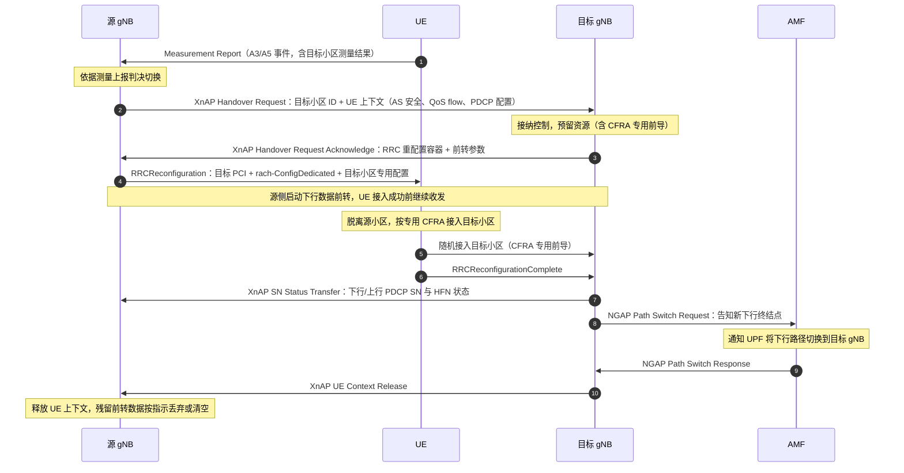

## 关联考点

- 与 NG 切换对比：[NG 接口切换与 Xn 切换的差异](./05-关键信令流程/ch05-q024-ng-vs-xn-handover.md)
- 切换安全：[切换中的密钥更新（KgNB 刷新与水平/垂直推导）](./04-空口协议栈/ch04-q028-handover-key-update.md)
- PDCP 顺序保障：[PDCP 重排序与按序递交（含重建/切换场景）](./04-空口协议栈/ch04-q006-pdcp-reordering.md)

## 面试追问

- **Xn 切换时 UPF 的下行数据在切换期间去哪了？** —— 要点：UPF 下行仍发往源 gNB；源 gNB 一边继续发给 UE（在 UE 离开前），一边按前转配置复制/前转到目标 gNB 缓存；UE 接入目标后由目标侧下发缓存数据，配合 SN Status Transfer 保证按序不丢。
- **为什么 Path Switch 由目标 gNB 发起而不是源 gNB？** —— 要点：切换完成的确认点在目标侧（收到 RRCReconfigurationComplete），只有目标 gNB 确认 UE 已接入，才有资格请求修改核心网下行路径；源侧此时已无法保证 UE 还在自己下面。
- **Xn 切换失败的可能原因有哪些？** —— 要点：目标资源接纳失败、Xn 链路故障退化为 NG 切换、UE 在目标侧随机接入失败或 RRCReconfigurationComplete 超时（回退源小区或走重建）、目标判定配置不兼容拒绝；现网排查需结合 Xn 建链状态与目标小区负荷。

---

# 关键信令流程 · NG 接口切换与 Xn 切换的差异

> 难度：中 ｜ 频率：中

## 一句话答案

两者的核心差异在"切换准备走哪条路"：Xn 切换由源 gNB 与目标 gNB 直接通过 Xn 接口协商准备，核心网只在最后做路径切换（Path Switch）；NG 切换则由源 gNB 通过 AMF 中转，走 NGAP 的 Handover Required → Handover Command，目标侧再与 AMF 做资源准备。NG 切换信令路径更长、时延更大，但适用于无 Xn 链路、跨 AMF、跨 UPF 或需要核心网重路由承载的场景。

## 详细展开

**1. 信令路径对比**

| 维度 | Xn 切换 | NG 切换 |
|---|---|---|
| 准备路径 | 源 gNB ↔ 目标 gNB（XnAP Handover Request/Ack） | 源 gNB → AMF → 目标 gNB（NGAP Handover Required/Request/Command/Ack） |
| 核心网角色 | 不参与准备，仅收 Path Switch | 全程参与准备与执行，切换命令由 AMF 中转 |
| 数据前转 | 源/目标 gNB 间直接经 Xn 前转 | 经 UPF/间接前转（源与目标间可走核心网中转） |
| 完成阶段 | 目标 gNB 发 Path Switch Request，AMF 换 UPF 下行端点 | 目标 gNB 发 Handover Notify，AMF/UPF 侧承载路径重构 |
| 跨 AMF/UPF | 不支持（或需额外锚点） | 支持（含 AMF 间与 UPF 重选插入） |
| 前提条件 | 两 gNB 间已建 Xn 且目标无跨核心网需求 | 无 Xn 也可靠 NG 兜底 |

**2. NG 切换的流程要点**

1. 源 gNB 判决后发 **Handover Required**（含目标 gNB ID、待切换 QoS flow）；
2. AMF 向目标 gNB 发 **Handover Request**，目标做接纳并回 **Handover Request Acknowledge**（含目标侧 RRC 容器）；
3. AMF 向源 gNB 发 **Handover Command**，源下发 RRCReconfiguration 给 UE；
4. UE 接入目标小区并回 RRCReconfigurationComplete，目标 gNB 发 **Handover Notify**；
5. 源侧经 AMF 收到释放指示后释放 UE 上下文。

**3. 现网选型逻辑**

- 邻站间、同 AMF/UPF、Xn 健在 → 优先 Xn（时延小、信令少，对 VoNR 类低时延业务友好）；
- 跨 AMF 池、跨 UPF 大区域、Xn 未建或故障 → NG 兜底；
- 一些设备商实现里，Xn 准备失败也会自动退化为 NG 切换重试。

**4. 时延差异的来源**

NG 切换多两跳核心网信令（AMF 中转），且目标侧资源准备要经过 AMF 协调；Xn 切换的准备在空口"直连对端"完成，通常快几十毫秒量级——这在高铁等高速移动场景下直接影响切换中断时间与掉话率。

## 关联考点

- Xn 切换细节：[Xn 接口切换的完整流程（含数据前转与路径切换）](./05-关键信令流程/ch05-q023-xn-handover-procedure.md)
- 核心网架构：[5GC 网络功能总览（AMF/SMF/UPF/UDM/PCF/AUSF/NSSF/NRF）](./06-组网与架构/ch06-q003-5gc-nf-overview.md)
- 密钥更新：[切换中的密钥更新（KgNB 刷新与水平/垂直推导）](./04-空口协议栈/ch04-q028-handover-key-update.md)

## 面试追问

- **为什么 NG 切换里 RRC 命令还要经 AMF 中转而不是直发？** —— 要点：切换涉及核心网侧承载与安全上下文的一致性管理，AMF 是控制面锚点；gNB 间无 NG 直连，NGAP 只存在于 gNB-AMF 之间，RRC 容器必须嵌套在 NGAP 消息里逐跳传递。
- **跨 AMF 的 NG 切换多什么动作？** —— 要点：源 AMF 与目标 AMF 间还要完成上下文转移（ Namf_Communication 相关），必要时目标 AMF 还要重选 UPF 并在目标侧插入新 UPF 做 PDU 会话重路由；对 UE 透明，只感知 RRC 命令。
- **Xn 切换的 Path Switch 和 NG 切换的 Handover Notify 是不是一回事？** —— 要点：作用类似（让核心网知道 UE 已到新侧），但机制不同：Path Switch 是 Xn 切换专用，直接请求换 UPF 下行端点，AMF 回应后即完成；Handover Notify 是 NG 切换流程中的"到达确认"，路径重构在准备阶段已由 AMF/UPF 协调完成。

---

# 关键信令流程 · 条件切换 CHO 的机制与价值

> 难度：难 ｜ 频率：中

## 一句话答案

条件切换（CHO, Conditional Handover）把"切换判决"与"切换执行"解耦：源 gNB 提前向多个候选小区准备资源，并把带执行条件的 RRC 重配置提前发给 UE；UE 在源小区保持连接的同时持续评估条件（如 A3/A5 事件），一旦某候选满足条件就自行发起接入目标，无需再等网络下发命令。价值在于把"测量上报→网络判决→下发命令"的往返时延从切换关键路径上移除，显著降低高速/高频场景的切换失败率与中断时延。

## 详细展开

**1. 与普通切换的流程对比**

| 环节 | 普通切换 | 条件切换 CHO |
|---|---|---|
| 资源准备 | 判决后单目标准备 | 提前向 1 个及以上候选小区准备（早于条件满足） |
| 下发配置 | 条件满足后下发 RRCReconfiguration | 提前下发，内含 executionCondition（如 A3/A5） |
| 执行触发 | 网络命令驱动 | UE 本地评估条件满足即自主执行 |
| 失败回退 | 回退源小区或重建 | 条件未满足前仍在源小区正常收发；已发 MCG failure 时按重建流程 |

**2. 关键机制**

- **提前准备**：源 gNB 通过 Xn 向候选 gNB 发 Handover Request，候选预留资源并回确认；资源占用由成功执行或取消（Handover Cancel）释放；
- **executionCondition**：RRCReconfiguration 中携带的触发条件（复用 A3/A5 事件框架），UE 只在条件满足时才应用候选配置；
- **多候选并行**：UE 可同时持有多个候选配置，哪个先满足条件就用哪个，其余配置收到取消或超时后丢弃；
- **条件解除**：UE 执行 CHO 后丢弃所有候选配置；若源链路先失败（T310 超时）而条件从未满足，走 RRC 重建立。

**3. 价值与代价**

- **价值**：
  - 切换中断时延明显缩短（省掉"上报→判决→命令"往返）；
  - 高铁/毫米波快速衰落场景鲁棒：条件不满足就不切，避免晚切/误切；
  - 与 DAPS（双活协议栈）思想一致，都是"先备好再切"的预防式设计；
- **代价**：
  - 候选小区资源提前占用，网络资源效率下降；
  - UE 需存储并持续评估多套配置，实现复杂度高；
  - 候选过多会产生信令与准备开销，现网一般控制候选数量。

**4. 与相关机制的关系**

- CHO 解决"切换命令晚到"；DAPS 解决"切换期间业务不断"；两者可组合（CHO + DAPS）用于高速与高可靠场景；
- LTM（低时延切换）是后续版本演进方向，进一步细化解耦粒度。

## 关联考点

- 切换失败处理：[切换失败与 RLF 的关联处理（重建/回退源小区）](./05-关键信令流程/ch05-q026-ho-failure-rlf.md)
- A 类事件：[事件 A1–A6 的含义与典型使用场景](./05-关键信令流程/ch05-q020-events-a1-a6.md)
- Xn 切换准备：[Xn 接口切换的完整流程（含数据前转与路径切换）](./05-关键信令流程/ch05-q023-xn-handover-procedure.md)

## 面试追问

- **CHO 的 executionCondition 典型怎么配？** —— 要点：复用 A3/A5 事件参数框架（offset + hysteresis + timeToTrigger），A3 适合同频连续覆盖，A5 适合异频/覆盖断裂；TTT 在高速场景要配短（如 100–200 ms 量级），否则车速快于判决速度就会先 RLF。
- **UE 同时持有多个候选配置，会不会用错？** —— 要点：每个候选绑定各自 executionCondition 与目标小区配置；UE 独立评估，首个满足条件的即执行并清空全部候选；网络侧通过 Handover Cancel 或配置释放主动撤销失效候选，避免陈旧配置引发误切。
- **CHO 未执行成功时 UE 处于什么状态、怎么恢复？** —— 要点：若条件从未满足且源链路一直正常，UE 继续在源小区工作，无影响；若源链路先失败（T310 超时判定 RLF），UE 停止源侧工作、启动 T311，通过重建立恢复，重建立成功后网络重新配置移动性参数（可能再次下发 CHO）。

---

# 关键信令流程 · 切换失败与 RLF 的关联处理（重建/回退源小区）

> 难度：难 ｜ 频率：高

## 一句话答案

切换失败不等于立即掉话：若 UE 尚未离开源小区（如切换命令迟迟未到、目标随机接入失败），可以回退源小区继续工作；若源小区已不可用（T310 超时判定无线链路失败 RLF），UE 启动 T311 走 RRC 重建立，在"重建候选小区"上恢复连接。UE 会维护失败信息（如 failedPCellId、reestablishment 小区、C-RNTI），重建成功后通过 RRCReestablishmentComplete/UEInformationResponse 告知网络，供网络做移动性参数优化（MRO）。

## 详细展开

**1. 切换失败的三种典型表现与出路**

| 场景 | UE 状态 | 出路 |
|---|---|---|
| 切换命令未及时到达（源链路尚好） | 还在源小区 | 等待/回退源小区，源可重发命令或取消切换 |
| UE 已收到命令但目标随机接入失败 | 已脱源 | 目标侧重试前导码；超限则判定切换失败，走重建立 |
| 源链路先恶化（T310 超时 RLF） | RLF | 启动 T311，选择小区发起 RRC 重建立 |

**2. RLF 与重建立的联动时序**

1. RLF 判定（T310 超时 / 随机接入问题 / RLC 达最大重传）→ UE 挂起所有 SRB/DRB，启动 **T311**；
2. UE 选择重建候选小区（同频优先，必要时异频/异系统），发起 CBRA 随机接入；
3. 在 SRB0 上发 **RRCReestablishmentRequest**（携带原 C-RNTI 与源 PCI）；
4. 目标 gNB 通过源侧或核心网取回 UE 上下文与密钥，校验通过后回 **RRCReestablishment**，重建 SRB1 并恢复 AS 安全；若上下文取不到或校验失败，回 **RRCSetup** 让 UE 走新建流程（体验上是掉话重连）；
5. UE 回 RRCReestablishmentComplete，网络再通过 RRCReconfiguration 恢复其余 SRB/DRB 与测量。

**3. 网络侧如何利用失败信息做优化**

- UE 通过 UEInformationResponse 上报失败细节（失败小区、重建小区、是否曾收到切换命令等）；
- 网络据此做 MRO（移动性鲁棒性优化）：判别"过晚切换/过早切换/切到错误小区"三类问题，反向调整 CIO（小区独立偏移）、A3 offset、TTT 等参数；
- 这是切换参数自优化的闭环数据来源。

**4. 常见根因**

- 弱覆盖/快衰落导致命令晚到（过晚切换）；
- 目标接纳失败或前导码冲突（目标拥塞）；
- TTT/迟滞配置过保守、CIO 不合理；
- Xn/NG 链路异常导致准备失败退化为重建。

## 关联考点

- RLF 判定细节：[无线链路失败 RLF 的判定条件与后续动作](./04-空口协议栈/ch04-q030-rlf-declaration-recovery.md)
- 重建立流程：[RRC 重建立流程详解](./05-关键信令流程/ch05-q030-rrc-reestablishment.md)
- 关键定时器：[关键计时器 T300/T301/T310/T311 的作用](./04-空口协议栈/ch04-q029-timers-t300-t311.md)
- 条件切换预防：[条件切换 CHO 的机制与价值](./05-关键信令流程/ch05-q025-conditional-handover.md)

## 面试追问

- **重建成功的连接和掉话重连有什么本质区别？** —— 要点：重建成功恢复了 AS 安全上下文并保留 SRB1/密钥体系，PDCP 状态可延续（部分数据不丢），且 NAS 层无感知，不触发重新注册；掉话重连是完整 RRC 建立+注册恢复，业务中断明显更长，体验上是"掉话"。
- **UE 在 RLF 后怎么选重建小区？** —— 要点：优先选择"有 UE 上下文的小区"（原源小区、切换目标小区、曾服务过的小区），因为上下文可取回、重建成功率高；找不到才选任意合适小区（选择准则与小区选择 S 准则一致），此时大概率走新建而非重建。
- **网络怎么区分"过晚切换"与"过早切换"？** —— 要点：结合 UEInformationResponse 里的失败时间与位置关系：收到切换命令后很快在目标失败且回退重建到源小区附近 → 典型过晚切换（应提前触发）；切换后短时间内即 RLF 且重建回源小区 → 过早切换（目标选择或参数过激）；判定后分别调整 TTT/offset 与 CIO。

---

# 关键信令流程 · SN Addition 辅节点添加流程与信令

> 难度：中 ｜ 频率：高

## 一句话答案

SN Addition（辅节点添加）是主节点（MN）为 UE 增加辅节点（SN）以建立 SCG 的流程，EN-DC 下即 eNB 通过 X2 向 gNB 请求添加 SgNB。核心信令为 SgNB Addition Request/Acknowledge，其中 SgNB 内部生成 SCG 配置容器，由 MN 通过 RRCConnectionReconfiguration（EN-DC 下为 LTE 的 RRC 连接重配置，携带 NR 的辅小区组配置）下发给 UE，UE 回复后 MN 通知 SN 完成添加，随后 UE 与 NR 侧建立同步并可开始收发数据。

## 详细展开

**1. 流程步骤（EN-DC 视角，MN = eNB，SN = SgNB）**

1. **触发条件**：LTE 锚点侧收到 NR 邻区测量报告（EN-DC 下典型为 B1 事件：NR 邻区好于门限），或负载/策略触发；
2. **MN → SN**：经 X2/Xn 发 **SgNB Addition Request**，携带 UE 能力（含 NR 能力）、SCG 承载需求、MN 侧安全密钥 S-KgNB 衍生输入、测量结果等；
3. **SN 准备资源**：做接纳控制，分配 NR 侧资源（SpCell/SCG SCell 配置、随机接入配置），生成 SCG 配置容器（NR RRCReconfiguration 消息），回 **SgNB Addition Request Acknowledge**；
4. **MN 下发空口配置**：MN 将 SN 的容器嵌入 **RRCConnectionReconfiguration**（LTE RRC 消息，内含 nr-SecondaryCellGroupConfig 与 SCG 承载配置）发给 UE；SCG 承载若为 split/SCG 类型，还需完成 PDCP 层面的承载变更；
5. **UE 接入 NR**：UE 按专用随机接入配置在 PSCell 上发起免竞争随机接入（CFRA），与 NR 取得上行同步；
6. **完成通知**：UE 回 RRCConnectionReconfigurationComplete 给 MN；MN → SN 发 **SgNB Reconfiguration Complete**（含 UE 在 NR 侧的 C-RNTI），SN 开始调度，流程结束。

**2. 关键点**

| 关键点 | 说明 |
|---|---|
| 密钥 | MN 依据自身密钥衍生 S-KgNB 传给 SN，SN 生成自己的 AS 安全上下文，与 MN 相互独立 |
| 承载形态 | 可配 MCG bearer（不加 SN 承载，仅控制面 SCG）、split bearer 或 SCG bearer，决定 NR 侧是否分担用户面 |
| 测量前提 | EN-DC 添加依赖 LTE 侧配置的 NR 测量（B1/B3 事件 + 测量 GAP），测量不到 NR 就无从添加 |
| SN 侧随机接入 | 走 CFRA（专用前导码），避免与 NR 小区内其他 CBRA 用户冲突，接入更快 |

**3. SA 下的对应流程**

SA（NR 独立组网）下的对应概念是"NR 内 SN Addition"（CU/DU 架构或 NR-NR 双连接），信令逻辑同构：MN 通过 Xn 请求、SN 回容器、MN 融合后经 RRCReconfiguration 下发、UE 在 PSCell 随机接入完成。

**标准信令时序（MN ↔ UE ↔ SN）**：

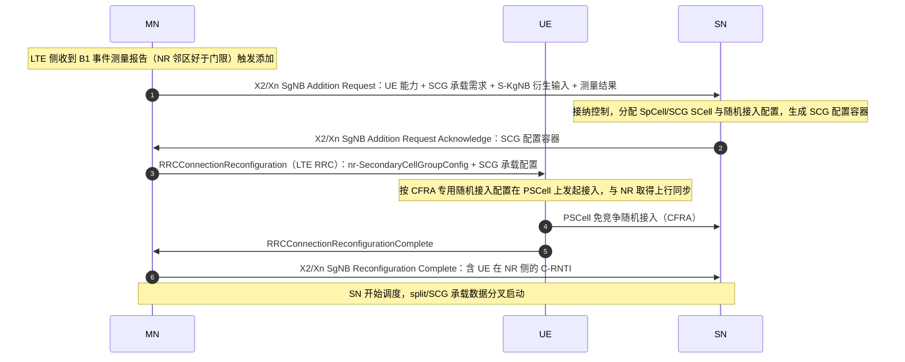

## 关联考点

- SCG 流程总览：[SCG 添加、修改、变更与失败的典型流程](./01-无线基础与演进/ch01-q008-scg-procedures.md)
- EN-DC 架构：[EN-DC 双连接的基本概念与整体架构](./01-无线基础与演进/ch01-q005-en-dc-architecture.md)
- 添加失败处理：[SCG failure 流程与失败信息上报](./05-关键信令流程/ch05-q034-scg-failure-report.md)

## 面试追问

- **SN Addition 时 UE 需要重新做安全激活吗？** —— 要点：不需要完整重做。MN 衍生 S-KgNB 传给 SN，SN 侧自行建立 AS 安全（PDCP 加密/完整性保护），对 NAS 层透明；UE 侧由 MN 通知后按 SN 的安全配置处理 SCG 承载，MN 与 SN 的安全上下文相互独立。
- **如果 UE 一直测不到 NR 小区，SN Addition 会怎样？** —— 要点：流程根本不会触发——EN-DC 添加以 B1 事件测量报告为前提；需排查 LTE 侧是否配置了 NR 邻频点测量、测量 GAP 是否分配、NR 小区 SSB 是否可检测、以及终端能力是否支持 EN-DC 组合。
- **SN Addition 和载波聚合加 SCell 有什么区别？** —— 要点：CA 加 SCell 是同一 gNB 内增加载波，配置经一条 RRC 消息即可，无跨节点信令与独立密钥；SN Addition 是跨节点（跨 gNB）添加小区组，涉及 X2/Xn 协商、独立安全上下文、独立调度器与 PDCP 分拆决策，复杂度高一个量级。

---

# 关键信令流程 · PSCell 修改与辅节点释放流程

> 难度：中 ｜ 频率：中

## 一句话答案

PSCell 修改（PSCell change）指 UE 的辅节点内主小区更换：SN 修改自身 SCG 配置（或经 MN 协调），通过 RRC 重配置让 UE 在新 PSCell 上重新同步，分为 SN 内部变更（不经 MN 的用户面重锚）与经 MN 的跨 SN 变更两类。辅节点释放（SN Release）则由 MN（或 SN 自身请求）发起，通过 SgNB Release Request/Release Confirm 完成，空口侧经 RRC 重配置移除 SCG 配置，UE 回退到纯 MN 工作，NR 侧上下文与前转数据清理。

## 详细展开

**1. SN 内 PSCell 修改（SN internal change）**

- 触发：SN 内部移动性（NR 侧测量显示 SN 内更优小区）或 SN 负载管理；
- 信令简化：SN 自行决定，仅需通知 MN 发 RRC 重配置（或按厂商实现经 SN 内部下发），用户面锚点不变（数据路径仍终结原 SN）；
- 空口：UE 在新 PSCell 上执行随机接入（CFRA），C-RNTI 更新，旧 PSCell 资源释放。

**2. 跨 SN 的 PSCell 变更（SN change）**

- 涉及旧 SN 释放 + 新 SN 添加的组合动作，MN 全程协调，含数据前转与承载路径更新，详见辅节点变更流程。

**3. SN Release 流程（MN 发起）**

1. **触发**：LTE 覆盖优先策略、NR 测量变差（如 A2 类判据）、负载调整、语音回落 EPS fallback 前、UE 移出 NR 覆盖；
2. **MN → SN**：发 **SgNB Release Request**（携带释放原因）；
3. **SN 侧清理**：SN 停止调度、启动必要的数据前转（split/SCG 承载未收完的数据前转回 MN）、回 **SgNB Release Confirm**；
4. **空口配置**：MN 经 RRC 重配置删除 SCG 配置与 SCG 承载（SCG bearer 数据回迁为 MCG bearer 或释放）；
5. SN 释放 UE 上下文与 NR 侧资源。

**4. SN 主动请求释放（SN initiated）**

- SN 自身异常或策略（如 NR 侧过载、SCG 同步长期失败）时，SN 可向 MN 发释放请求，MN 确认后按上述流程执行，空口动作一致。

**5. 与失败场景的区别**

| 场景 | 性质 | 空口表现 |
|---|---|---|
| SN Release（正常） | 网络主动管理 | UE 平滑移除 SCG，MN 侧业务不中断 |
| SCG failure（异常） | UE 判定 SCG 失败 | UE 主动上报 SCGFailureInformation，由 MN 决定释放或重建 SCG |

## 关联考点

- SCG 流程总览：[SCG 添加、修改、变更与失败的典型流程](./01-无线基础与演进/ch01-q008-scg-procedures.md)
- SN 变更：[SN change 辅节点变更的触发与流程](./05-关键信令流程/ch05-q029-sn-change.md)
- SCG 失败：[SCG failure 流程与失败信息上报](./05-关键信令流程/ch05-q034-scg-failure-report.md)

## 面试追问

- **EPS fallback 前为什么要先释放 SN？** —— 要点：语音回落到 LTE（VoLTE）时业务全部迁移回 MN 侧，NR 侧无数据承载需求；先释放 SN 可避免业务迁移过程中两套承载并存造成的资源浪费与路径混乱，也简化回落后的测量与移动性管理。
- **SN 内 PSCell 修改为什么可以不惊动 MN 的用户面？** —— 要点：用户面锚点在 SN 的 GTP-U 端点，只要 SN 不变，数据路径终结点就不变；变更只是 UE 与 SN 之间的空口重选，MN 仅需同步 SCG 配置容器，无需重锚承载。
- **释放 SN 时 UE 正在 SCG bearer 上传数据怎么办？** —— 要点：走数据前转——SN 把未确认/缓存的 PDCP PDU 前转给 MN，MN 继续通过 MCG 承载下发，配合 SN Status Transfer 保证序列号衔接，业务无感。

---

# 关键信令流程 · SN change 辅节点变更的触发与流程

> 难度：难 ｜ 频率：中

## 一句话答案

SN change（辅节点变更）指 UE 的辅节点从旧 SN 切换到新 SN，本质是"旧 SN 释放 + 新 SN 添加"的组合流程，由 MN 全程协调。典型触发是 NR 侧移动性测量显示另一 gNB 的小区更优、旧 SN 负载调整或故障；流程含 Xn/X2 上的 SgNB Addition Request（对新 SN）与 SgNB Release（对旧 SN），空口一次 RRC 重配置同时下发新 SCG 配置并删除旧 SCG，关键点在于数据前转与承载路径（GTP-U 端点）向新 SN 重锚，保证业务连续。

## 详细展开

**1. 触发场景**

- **NR 侧移动性**：UE 在 NR 覆盖内移动，SgNB 间测量（NR 内事件如 A3/A5 对 SN 小区）显示新 gNB 更优——最常见；
- **负载/策略**：旧 SN 过载或运营商策略要求迁移；
- **异常兜底**：旧 SN 故障、SCG 失败后的恢复性变更。

**2. 完整流程（EN-DC，MN 协调）**

1. **测量与判决**：SN（或 MN）收集 NR 测量结果，MN 决定变更目标 SN；
2. **新 SN 准备**：MN → 新 SN 发 **SgNB Addition Request**（携带 UE 能力、密钥衍生输入、测量结果、承载信息），新 SN 接纳并回 ACK（含新 SCG 配置容器与数据前转地址）；
3. **旧 SN 释放准备**：MN → 旧 SN 发 **SgNB Change Required**（或组合的 Change Request），旧 SN 回应前转参数（Xn/X2 地址、SN Status Transfer 要求）；
4. **空口重配置**：MN 经一条 RRCConnectionReconfiguration 下发新 SCG 配置（含新 PSCell 专用随机接入配置），同时指示删除旧 SCG；
5. **UE 接入新 SN**：UE 脱离旧 PSCell，在新 PSCell 上发起 CFRA 随机接入，回重配置完成消息；
6. **路径重锚**：数据前转（旧 SN → 新 SN，必要时经 MN 中转）+ SN Status Transfer（PDCP 序列号状态）；
7. **清理**：MN 通知旧 SN 释放完成，旧 SN 释放上下文；用户面下行路径按承载类型切换到新 SN（SCG bearer）或维持 MN（split bearer 数据面在 MN 分发）。

**3. 与锚点更换的区别**

| 维度 | SN change | 锚点（MN）更换 |
|---|---|---|
| 变更对象 | 辅节点（NR 侧） | 主节点（LTE eNB，EN-DC 下） |
| 用户面影响 | NR 承载路径重锚，MCG 承载不动 | 全部承载经新锚点重建路径 |
| NAS 影响 | 无 | 无（但信令面路径全换） |
| 触发频率 | 高（NR 内移动常态） | 低（跨 eNB 移动才触发） |

**4. 业务连续性保障**

- 前转 + 序列号状态转移保证 SCG 承载数据不丢不乱；
- MCG/split 承载的 MN 侧部分全程不受影响；
- 对 NAS 层完全透明，UE 不感知节点变化。

## 关联考点

- 锚点更换：[SgNB 变更与锚点更换的触发场景](./01-无线基础与演进/ch01-q019-sgnb-change-mnb-change.md)
- SN 添加：[SN Addition 辅节点添加流程与信令](./05-关键信令流程/ch05-q027-sn-addition.md)
- PDCP 顺序保障：[PDCP 重排序与按序递交（含重建/切换场景）](./04-空口协议栈/ch04-q006-pdcp-reordering.md)

## 面试追问

- **SN change 期间 split bearer 的 MN 侧数据会不会中断？** —— 要点：不会。split bearer 的 MN 分支全程保持，变更只影响 SCG 分支；PDCP 在 MN 侧（EN-DC 的 split bearer PDCP 位于 MN），MN 控制两分支的数据分发与重定向，前转从旧 SN 的缓存补齐即可。
- **SN change 和 NR 内 Xn 切换在信令上最像的地方是什么？** —— 要点：都遵循"准备（资源+容器）→ 执行（空口重配置+随机接入）→ 完成（前转+路径更新）"三段式；区别仅在于 SN change 由 MN 居中协调且嵌在双连接信令体系（SgNB Addition/Release）内，而 Xn 切换是 gNB 间直接协商。
- **为什么 SN change 对 NAS 透明？** —— 要点：NAS 连接终结在 UE 与 AMF 之间，SN 只承载 AS 层数据面/部分控制面；MN 作为 NAS 终结点（EN-DC 下 NAS 走 LTE），SN 变更不触及 NAS 层任何实体，UE 无需重新注册。

---

# 关键信令流程 · RRC 重建立流程详解

> 难度：中 ｜ 频率：高

## 一句话答案

RRC 重建立（RRC Reestablishment）是 UE 在无线链路失败（RLF）或切换失败后，快速恢复连接的应急流程：UE 停止收发、启动 T311，选择一个可能持有自己上下文的小区，经 SRB0 发 RRCReestablishmentRequest（带原 C-RNTI 与源 PCI），网络取回上下文并校验后回 RRCReestablishment，重建 SRB1 并重新激活 AS 安全，再经 RRCReconfiguration 恢复其余承载。成功则业务快速恢复且 NAS 无感知，失败则退化为 RRCSetup 走新建流程。

## 详细展开

**1. 触发条件（哪些情况允许发起）**

- 检测到 RLF（T310 超时、随机接入问题、RLC 达最大重传次数）；
- 切换失败（目标侧接入失败、重配置失败）且需恢复；
- 从 E-UTRA/NR 间移动性失败回退；
- 完整性校验失败等其他异常（触发重建请求的合法场景有限，规范枚举）。

**2. 完整流程**

| 步骤 | 动作 | 说明 |
|---|---|---|
| 1 | UE 判定失败，启动 T311 | 停止所有 SRB/DRB 收发，挂起 HARQ/RLC 状态（保留 PDCP 状态以减小丢包） |
| 2 | 小区选择 | 优先选"有 UE 上下文"的小区（原服务小区、切换目标小区等），选择准则同 S 准则 |
| 3 | CBRA 随机接入 | 用正常流程接入所选小区 |
| 4 | RRCReestablishmentRequest（SRB0） | 携带 ue-Identity：原 C-RNTI + 源小区 PCI |
| 5 | 网络侧上下文获取 | 目标 gNB 经 Xn/NG 向源 gNB 取回 UE 上下文与密钥（KgNB 与 NextHop 参数） |
| 6 | RRCReestablishment（SRB0 下发，SRB1 激活后确认） | 重建 SRB1；UE 激活 AS 安全（完整性+加密，基于更新后的密钥） |
| 7 | RRCReconfiguration | 网络恢复其余 SRB2/DRB、测量配置、移动性参数 |
| 8 | 失败回退 | 若上下文取不到/校验失败，回 RRCSetup 让 UE 走全新建立（NAS 侧相当于掉话重连） |

**3. 成功与失败的本质差异**

- **成功**：AS 安全上下文延续（密钥体系内更新，非重新推导根密钥），SRB1 恢复，PDCP 层已确认数据不丢，NAS 层无感知，不触发注册更新——这是"重建"与"掉话重连"的分水岭；
- **失败**：全部回退，UE 视为掉话，重新走小区选择→RRC 建立→注册/服务请求全链路。

**4. 与相邻流程的关系**

- 重建立与 CHO/普通切换失败互为出口：切换失败→重建恢复；
- 重建立过程中若 T311 超时或所选小区不合适，UE 进入空闲态走重选；
- 网络可通过拒绝重建立（回 RRCSetup）实现"软掉话"控制。

**标准信令时序（UE ↔ gNB）**：

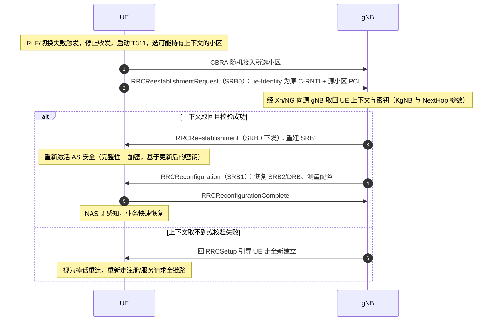

## 关联考点

- 重建与 SRB0：[RRC 重建的条件、流程与 SRB0 的使用](./04-空口协议栈/ch04-q031-rrc-reestablishment-srb0.md)
- 切换失败联动：[切换失败与 RLF 的关联处理（重建/回退源小区）](./05-关键信令流程/ch05-q026-ho-failure-rlf.md)
- 密钥更新：[NR 安全密钥体系（K 到 KgNB/KAMF 的推导链）](./04-空口协议栈/ch04-q026-nr-key-hierarchy.md)

## 面试追问

- **为什么重建必须先激活 AS 安全才能收发 RRCReconfiguration？** —— 要点：重建消息本身走 SRB0 无安全保护，但那是一条固定格式的短消息，不承载敏感配置；一旦进入 SRB1 之后的任何 RRC 消息（含重配置）都必须完整性保护，防止攻击者伪造重配置劫持连接——这是 AS 安全架构的强制顺序。
- **重建时 PDCP 状态保留意味着什么？** —— 要点：已确认的数据不重传、未确认的从断点继续，配合网络侧前转可将重建期间的数据损失降到很低；这依赖 UE 与网络侧都保留 PDCP 接收/发送序列号状态，是重建"快速无损"价值的核心。
- **网络什么情况下会拒绝重建？** —— 要点：取不到 UE 上下文（跨池/无 Xn/NG 链路）、完整性校验失败（UEIdentity 对不上）、该小区无准备资源、或网络策略性拒绝；拒绝后回 RRCSetup 引导 UE 走新建，UE 层面表现为业务重建但时长明显增加。

---

# 关键信令流程 · 连接去激活流程与两侧状态保持

> 难度：中 ｜ 频率：低

## 一句话答案

连接去激活指网络在业务间隙释放空口专用资源但保留 UE 上下文与核心网连接（N2/PDU 会话）的过程：gNB 发 RRC Release（可带 suspendConfig 让 UE 进入 RRC INACTIVE，或直接回 IDLE），UE 侧保留 AS 安全上下文、密钥与部分承载状态，网络侧保留 UE 上下文以便快速恢复。价值在于"下次业务来时恢复快、信令少"，是状态机在"连接态资源开销"与"空闲态恢复时延"之间的折中设计。

## 详细展开

**1. 两条去激活路径**

| 路径 | 空口消息 | UE 目标状态 | 保留内容 |
|---|---|---|---|
| 释放挂起（suspend） | RRC Release 带 suspendConfig | RRC INACTIVE | AS 安全上下文、UE 非激活态标识（I-RNTI）、RNA 配置、PDCP 状态（部分实现保留） |
| 直接释放 | RRC Release（无 suspend） | RRC IDLE | 仅 NAS 层注册状态（5G-GUTI 等），AS 上下文全清 |

**2. 网络侧状态保持**

- **gNB（最后服务 gNB）**：INACTIVE 路径下保留完整 UE 上下文与 AN 状态，等待 RNA 内其他 gNB 取回（通过 Xn 寻址上下文检索）或 UE 回来；
- **AMF**：无论哪条路径，N2 连接与 PDU 会话上下文都保留（除非走显式的去注册流程），CN 侧"知道"UE 曾在哪个接入网区域；
- **UPF**：PDU 会话的锚点保留，下行数据到达即触发网络侧寻呼（INACTIVE 时经 RAN 寻呼，IDLE 时经 CN 寻呼）。

**3. 恢复侧的差异**

- **INACTIVE 恢复**：UE 发 RRC Resume Request（带 I-RNTI），最后服务 gNB 取回上下文（或从新 gNB 经 Xn 取），跳过完整安全建立（密钥基于恢复参数刷新），快速回到 CONNECTED——信令轮次远少于完整建立；
- **IDLE 恢复**：走完整 RRC 建立 + NAS Service Request/注册更新，时延与信令开销大得多。

**4. 网络为什么需要"去激活"这个动作**

- 无线资源（SR/调度、DRB 配置）是稀缺的，业务突发间隙挂起可释放给其他用户；
- 但完整释放到 IDLE 会让下一次恢复变慢（尤其对物联网小包、即时消息类业务不友好）；
- INACTIVE 态（NR 新增，LTE 没有的状态）正是为这类"间歇小业务"设计的中间态。

## 关联考点

- INACTIVE 态详解：[RRC INACTIVE 与 LTE IDLE 的区别及 RNA 概念](./04-空口协议栈/ch04-q022-rrc-inactive-vs-lte-idle.md)
- 释放挂起流程：[RRC Release with suspend 与进入 INACTIVE](./05-关键信令流程/ch05-q017-rrc-release-suspend.md)
- 恢复触发：[Service Request 流程（寻呼响应/上行数据触发）](./05-关键信令流程/ch05-q016-service-request.md)

## 面试追问

- **去激活与释放是一回事吗？** —— 要点：不是。释放是空口资源与上下文的清理（可到 IDLE 或 INACTIVE），去激活强调"核心网连接与 UE 上下文保留、仅空口专用资源释放"；严格说 RRC Release with suspend 是实现去激活效果的空口动作，CN 侧 N2/PDU 会话始终未拆除。
- **INACTIVE 下 UE 侧具体保留了什么？** —— 要点：AS 安全上下文与密钥、I-RNTI、RNA（基于 RAN 的通知区域）配置、测量与移动性相关参数、部分 PDCP 状态；这些正是"快速恢复"的资本，也是它与 IDLE 态最本质的区别。
- **什么场景下网络宁愿直接释放到 IDLE？** —— 要点：UE 长时间无业务、终端移动性极强（RNA 更新开销大于收益）、网络上下文资源紧张或调度策略；对 eMBB 大流量用户业务结束后也常直接到 IDLE，INACTIVE 主要服务小包间歇业务。

---

# 关键信令流程 · TAU 跟踪区更新与周期性 TAU

> 难度：中 ｜ 频率：中

## 一句话答案

TAU（Tracking Area Update，跟踪区更新）是 UE 在空闲态检测到所在跟踪区（TA）变化或周期性定时器到期时，向网络发起的位置更新流程，5GC 中体现为 Mobility Registration Update。作用有二：让 AMF 维持准确的寻呼范围（注册区域），以及通过周期性 TAU 让网络确认 UE 仍可达（否则标记为不可达，停止寻呼）。NR/5GC 中 TAU 与重选联动：UE 重选到不属于注册区域的新小区后触发更新。

## 详细展开

**1. 触发条件**

| 类型 | 触发时机 | 目的 |
|---|---|---|
| 移动性更新 | 重选进入注册区域外的新小区（TA 不在 TAI list 内） | 更新 AMF 的寻呼区域记录 |
| 周期性更新 | T3512（周期性注册定时器）到期 | 网络确认 UE 可达；超时未更新则 AMF 标记 UE 不可达 |
| 其他 | 接入禁止解除、需要更新能力/DRX 参数等 | 维持上下文一致性 |

**2. 流程要点**

1. UE 在新小区完成同步与系统消息读取，判断 TAI 是否在注册区域列表内；
2. 不在则经 RRC 建立（原因 registration update）发 **Registration Request**（mobility registration update 类型）；
3. 网络侧：AMF（可能变化）完成上下文获取/转移（跨 AMF 时经旧 AMF），必要时执行鉴权与安全模式；
4. AMF 回 **Registration Accept**（携带新的注册区域 TAI list、周期性注册定时器等），UE 回完成消息；
5. 若网络拒绝（如区域受限），UE 按拒绝原因处理（重试或去注册）。

**3. 周期性 TAU 的价值与参数权衡**

- **价值**：网络侧 UE 上下文与可达性标记的保鲜机制；UE 关机/没电未通知网络时，靠周期性超时发现不可达，避免无效寻呼；
- **参数权衡**：定时器短→网络记录更准、寻呼命中率高，但 UE 耗电与信令负荷上升；定时器长→省电但寻呼浪费增多；现网常按业务类型分级（物联网终端配长周期，甚至配合 eDRX）。

**4. 与 4G 的对应关系**

- LTE 的 TAU（Tracking Area Update，EPC/EMM 层）与 NR 的 Mobility Registration Update 概念同构；
- NR 引入 RNA（RAN 通知区域，RAN 侧更新）分担了一部分高频小范围更新，减少 CN 侧信令——RAN Paging/更新在 RRC INACTIVE 态完成，不必每次都到 AMF。

**5. 寻呼的关联**

- 注册区域更新后，AMF 寻呼按 TAI list 发起；寻呼不到（UE 不可达或超出覆盖）时，结合周期性定时器状态决定是否标记不可达。

## 关联考点

- 注册全流程：[NAS 注册流程要点（鉴权/安全模式/注册区域更新）](./05-关键信令流程/ch05-q013-nas-registration-flow.md)
- RNA 更新：[RNA 更新的两种方式](./05-关键信令流程/ch05-q018-rna-update.md)
- 寻呼机制：[NR 寻呼完整流程（核心网寻呼/RAN 寻呼）](./05-关键信令流程/ch05-q035-nr-paging-flow.md)

## 面试追问

- **TAU 和 RNA Update 有什么区别？** —— 要点：TAU 是 NAS 层动作（UE↔AMF），更新核心网注册区域，触发重选后的小区跨注册区；RNA Update 是 AS 层动作（UE↔RAN，RRC INACTIVE 态），更新 RAN 侧通知区域，不惊动 AMF；两者分层负责，NR 用 RNA 吸收了大部分高频移动性更新。
- **周期性 TAU 超时后网络会怎么处理？** —— 要点：AMF 将 UE 标记为不可达（PMM-IDLE 不可达状态），下行数据到达时不再寻呼（或按运营商策略延迟处理），等 UE 下次出现（主动发起或移动性更新）再恢复；这是省信令与省电的必要机制。
- **注册区域（TAI list）为什么是一个列表而不是单个 TA？** —— 要点：给网络分配灵活性——把相邻几个 TA 打包给 UE，减少边缘小区乒乓重选引发的更新频率；列表长度与寻呼范围之间做权衡，列表越长寻呼开销越大。

---

# 关键信令流程 · 波束失败恢复 BFR 的信令流程

> 难度：难 ｜ 频率：中

## 一句话答案

波束失败恢复（BFR, Beam Failure Recovery）是服务波束质量恶化时 UE 快速换波的应急流程：UE 检测到波束失败（BFD 参考信号低于门限达次数上限）后，在专用 PRACH 资源上向候选波束发波束恢复请求（BFRQ），gNB 通过 DCI 或 CS-RNTI 调度确认后，UE 在指定时机上报候选波束信息，gNB 经 RRC/MAC 层激活新 TCI 状态完成恢复。它发生在"波束级"，若恢复失败才升级为"小区级"处理（随机接入或 RLF）。

## 详细展开

**1. 流程三段式：检测 → 请求 → 恢复**

| 阶段 | 动作 | 关键要素 |
|---|---|---|
| 检测（BFD） | UE 对 BFD-RS（周期 CSI-RS 或 SSB）持续测量，虚拟 DCI 盲检配合；连续 qout 次低于门限 Qout → 判波束失败 | 由 beamFailureInstanceMaxCount 与 Qout_LR 门限控制灵敏度 |
| 请求（BFRQ） | UE 启动 beamFailureRecoveryTimer，在候选波束（CB-RS 集中质量最好的）对应的专用 PRACH 资源发前导码 | 候选波束来自网络配置（SSB 或 CSI-RS 关联的 rach 资源） |
| 响应 | gNB 用专门 RA-RNTI 的 DCI（在 BFR 专用 CORESET/搜索空间）回应；UE 收到后停止定时器，经 PUCCH/PUSCH 上报候选波束标识 | 若配置了 CS-RNTI，gNB 可用 CS-RNTI 调度重传请求消息 |
| 恢复 | gNB 经 MAC CE 激活新 TCI 状态（PDCCH/PDSCH 的接收波束），UE 完成波束对准 | MAC CE 生效有时延要求（数 ms 量级） |

**2. 与随机接入的关系**

- BFRQ 本质是"带专用资源的随机接入"：gNB 为每个候选波束预留专用前导码与 RACH 时机，UE 按波束选资源，隐式告知候选波束——这是 CFRA 思想在波束管理的复用；
- 若未配置专用资源（无 beamFailureRecoveryConfig），UE 退化为发正常随机接入流程（在竞争资源上），gNB 通过其他方式感知。

**3. 失败升级路径**

- beamFailureRecoveryTimer 超时（请求无响应）或前导码发送次数达上限 → 波束恢复失败 → 判定 RLF（T310 超时）→ 走 RRC 重建立；
- 即 BFR 是"小区级失败"前的第一道缓冲：多数瞬时遮挡/波束失配在 BFR 阶段即可恢复，避免掉话。

**4. FR2 与 FR1 的差异**

- FR2（毫米波）波束窄、易遮挡，BFR 价值最大，通常必配；
- FR1 宽波束，波束失败概率低，BFR 常按需配置。

**5. SCG 侧的特殊处理**

- PSCell 波束失败不走 MCG 的 BFR，而是走 SCG failure 信息上报（SCGFailureInformation），由 MN 决定 SCG 重建或释放——两套处理路径不可混淆。

## 关联考点

- 检测判定细节：[波束失败检测 BFD 与候选波束 CBF 的判定条件](./03-MIMO与波束管理/ch03-q010-bfd-cbf-criteria.md)
- 完整恢复流程：[波束失败恢复 BFR 的完整流程](./03-MIMO与波束管理/ch03-q011-bfr-procedure.md)
- SCG 侧失败：[SCG failure 流程与失败信息上报](./05-关键信令流程/ch05-q034-scg-failure-report.md)

## 面试追问

- **BFRQ 为什么用专用 PRACH 而不是普通随机接入？** —— 要点：专用资源绑定候选波束（前导码与 SSB/CSI-RS 波束对应），UE 发前导码即隐式上报"我认为这个波束最好"，gNB 从接收资源即可定向用该波束回应，省掉一轮显式上报；且免竞争，响应快、冲突少。
- **BFR 失败为什么会升级为 RLF？** —— 要点：BFR 是波束级的快速自救，前提是小区还有可用参考信号与上行资源；请求无响应说明下行链路或上行授权都不可用，链路已无法在原小区维系，按协议转入 RLF 流程（T310/T311 → 重建立），这是分层失败的兜底设计。
- **BFR 与切换是什么关系，会不会冲突？** —— 要点：两者可并行触发——网络可能正在准备切换，UE 同时在做 BFR；执行顺序上谁先满足谁先生效（BFR 恢复成功则继续原配置等切换命令，切换命令到达则丢弃 BFR 状态）；CHO 场景下若 BFR 失败与条件满足同时发生，以实际执行的为准，协议要求避免并发冲突。

---

# 关键信令流程 · SCG failure 流程与失败信息上报

> 难度：中 ｜ 频率：中

## 一句话答案

SCG failure 指 EN-DC/双连接下辅节点侧（SCG/PSCell）发生失败但主节点侧连接仍正常的情况：UE 通过 SRB1（走 MN）上报 SCGFailureInformation，内容含失败类型与相关测量，MN 据此决定释放 SCG、重建 SCG 或触发 SN change。与 MCG failure 的根本区别在于：SCG 失败不触发 RRC 重建立（MCG 还活着），UE 不掉话，NR 侧业务中断但 LTE 侧业务可继续。

## 详细展开

**1. 触发条件（SCG 侧判定失败）**

| 触发 | 说明 |
|---|---|
| SCG 侧 RLF | PSCell 上 T310 超时判定无线链路失败 |
| PSCell 随机接入失败 | 同步重配置后接入 PSCell 失败、波束恢复请求失败 |
| SCG 重配置失败 | 收到含 SCG 配置的 RRC 消息后建立失败 |
| SR 失败 | SCG 侧调度请求达最大次数（如 sr-ProhibitTimer 到期后仍无授权，达 maxSR-Counter） |
| SCG 侧完整性校验失败 | SCG 承载安全校验不通过 |

**2. 上报与处理流程**

1. UE 判定 SCG 失败，**挂起 SCG 侧所有承载**（SCG bearer 停止收发，split bearer 仅 NR 分支停止），启动相应保护定时器；
2. UE 通过 SRB1（MN 侧）发送 **SCGFailureInformation**，携带失败类型与 PSCell 上的最后测量结果（RRC 消息经 MN 转发）；
3. MN 判决处置：
   - **释放 SCG**（SgNB Release）：NR 覆盖不可用，业务回迁 MN 承载；
   - **重建 SCG**（SN change / SN Addition 重来）：换 SN 或重配 PSCell；
   - **保持并等待**：短暂失败场景下等 UE 侧定时器与恢复；
4. 对 UE 的空口配置：MN 经 RRC 重配置删除或重建 SCG 配置，split/SCG bearer 数据路径调整。

**3. 与 MCG failure 的关键差异**

| 维度 | SCG failure | MCG failure |
|---|---|---|
| 失败范围 | 仅辅节点侧 | 主节点侧（整条连接） |
| UE 动作 | 上报 SCGFailureInformation，不重建 | RLF → T311 → RRC 重建立 |
| 业务影响 | NR 分支中断，LTE 分支（MN 承载）继续 | 全部业务中断，需恢复流程 |
| NAS 影响 | 无 | 无（重建成功时），失败则掉话重连 |
| 数据保全 | split bearer 的 MN 分支不受影响 | 依赖前转与 PDCP 状态保留 |

**4. 失败信息的用途**

- SCGFailureInformation 里的测量结果与失败类型供 MN/SN 分析失败根因（覆盖/干扰/参数过严），驱动移动性参数优化（类似 MCG 侧的 MRO）；
- 也可触发网络侧统计与自愈动作（如 SN 故障告警）。

## 关联考点

- SCG 流程总览：[SCG 添加、修改、变更与失败的典型流程](./01-无线基础与演进/ch01-q008-scg-procedures.md)
- SN 释放：[PSCell 修改与辅节点释放流程](./05-关键信令流程/ch05-q028-pscell-modify-sn-release.md)
- MCG 侧失败：[无线链路失败 RLF 的判定条件与后续动作](./04-空口协议栈/ch04-q030-rlf-declaration-recovery.md)

## 面试追问

- **SCG failure 为什么不需要重建立？** —— 要点：重建立的目的是恢复 MCG（SRB1/AS 安全）——这些都在 MN 侧且未受影响；SCG 失败只损失 NR 分支资源，MN 可通过常规 RRC 重配置直接增删 SCG，无需走 SRB0 应急流程，业务（MCG/split 的 MN 分支）全程在线。
- **UE 上报 SCGFailureInformation 用的 SRB1 在哪个节点终结？** —— 要点：SRB1 终结在 MN（EN-DC 下 SRB0/1/2 都在 MN），消息经 MN 的 PDCP/RLC 收发；MN 收到后决定本地处理或经 X2/Xn 转给 SN——这也是"SCG 失败由 MN 主导处置"的控制面依据。
- **PSCell 上 SR 失败也算 SCG failure 吗，为什么？** —— 要点：算。SR 持续失败说明 UE 拿不到 SCG 上行授权，SCG 上行链路已实质不可用（可能覆盖差、功率受限或参数错误），继续保留只会浪费资源；把它纳入 SCG failure 触发集合是"上行先死先报"的设计，让 MN 尽快回收 NR 资源。

---

# 关键信令流程 · NR 寻呼完整流程（核心网寻呼与 RAN 寻呼）

> 难度：中 ｜ 频率：高

## 一句话答案

NR 寻呼分两类：核心网寻呼（CN Paging）由 AMF 发起、经 NG 接口下发，用于寻呼 RRC IDLE/INACTIVE 态的 UE（如下行数据到达），UE 收到后发 Service Request 建立连接；RAN 寻呼（RAN Paging）由 gNB 发起、经 Xn 在 RNA 内分发，仅用于寻呼 RRC INACTIVE 态 UE（如 RAN 侧下行数据或 RNA 内定位），UE 收到后走 RRC Resume 快速恢复。两类共用空口的寻呼机制（PF/PO 计算、PDCCH P-RNTI 加扰的 DCI 1_0 指示）。

## 详细展开

**1. 两类寻呼对比**

| 维度 | 核心网寻呼 | RAN 寻呼 |
|---|---|---|
| 发起者 | AMF（5GC 侧） | 最后服务 gNB |
| 传递路径 | AMF → NGAP Paging → 各 gNB → Uu | 最后服务 gNB → Xn → RNA 内 gNB → Uu |
| 目标状态 | RRC IDLE 或 INACTIVE | 仅 RRC INACTIVE |
| UE 响应 | NAS Service Request（可触发完整建立或 resume） | RRC Resume Request（快速恢复） |
| 典型场景 | 下行数据/短信/CS 回落类 NAS 触发 | RAN 侧数据到达、RNA 内 INACTIVE UE 管理 |

**2. 空口寻呼机制（两类共用）**

1. gNB 按 UE 的 5G-S-TMSI（或 I-RNTI 推导）计算 **PF（Paging Frame，寻呼帧）与 PO（Paging Occasion，寻呼时机）**，PF 是特定 SFN，PO 是 PF 内的特定 PO 时隙索引；
2. gNB 在 PO 上用 **P-RNTI 加扰 PDCCH**，发 DCI 1_0（短格式），指示 UE 到对应 PDSCH 接收寻呼消息（RRC Paging 消息）或指示系统信息变更/ETWS 等公共通知；
3. UE 在 IDLE/INACTIVE 态按 DRX 周期在各自 PO 醒来监听，未命中则继续休眠；
4. 寻呼消息内含被呼 UE 标识列表（5G-S-TMSI 或完整 I-RNTI），命中后按对应流程响应。

**3. CN 寻呼的端到端链路（下行数据到达为例）**

UPF 收到下行数据 → 通知 SMF/AMF → AMF 查 UE 状态（IDLE/INACTIVE 且可达）→ 向注册区域（TAI list）内所有 gNB 发 NG Paging（含 5G-S-TMSI、寻呼优先级、DRX）→ gNB 空口寻呼 → UE 响应发 Service Request → 建立连接后 UPF 下行数据送达。

**4. RAN 寻呼的链路（INACTIVE 下行数据为例）**

UPF 数据到最后服务 gNB（INACTIVE 下锚点仍在原 gNB 或经 Xn 前转）→ 原发 gNB 向 RNA 内 gNB 发 Xn RAN Paging → 空口寻呼 → UE 回 RRC Resume Request → 最后服务 gNB 取回上下文恢复连接。

**5. 寻呼不到的处理**

- UE 不可达（周期性注册超时标记）或 RNA/TA 内未响应 → 网络按策略延迟或丢弃数据；
- RAN 寻呼失败可退化为 CN 寻呼（最后服务 gNB 通知 AMF 走 NG Paging 兜底）。

## 关联考点

- PF/PO 计算细节：[NR 寻呼机制与 PF/PO 的计算](./04-空口协议栈/ch04-q032-nr-paging-pf-po.md)
- 寻呼响应流程：[Service Request 流程（寻呼响应/上行数据触发）](./05-关键信令流程/ch05-q016-service-request.md)
- INACTIVE 态：[RRC INACTIVE 与 LTE IDLE 的区别及 RNA 概念](./04-空口协议栈/ch04-q022-rrc-inactive-vs-lte-idle.md)

## 面试追问

- **为什么 CN 寻呼对 INACTIVE UE 也能用，二者不冲突吗？** —— 要点：不冲突。CN 寻呼是"兜底通道"（AMF 视角 UE 只要不在连接态都可 CN 寻呼）；RAN 寻呼是"快速通道"（INACTIVE 专属，恢复快）；实际中最后服务 gNB 对 INACTIVE UE 的下行数据优先走 RAN 寻呼，失败才通知 AMF 走 CN 寻呼，两条通道最终空口机制相同。
- **寻呼 DRX 周期越长越好吗？** —— 要点：不是。周期长→UE 醒得少、省电，但被呼时延增大、寻呼消息在 PO 上可能积压；周期短→响应快但耗电与 PDCCH 开销上升。现网按业务类型与终端类别（物联网长周期、手机短周期）差异化配置。
- **RAN 寻呼为什么要限定在 RNA 内？** —— 要点：RNA 是"RAN 侧通知区域"，INACTIVE UE 只在 RNA 变化时更新 RAN 侧记录；gNB 知道 UE 在这个范围内但不知具体小区，故在 RNA 内全量寻呼——范围比注册区域（CN 侧）小，寻呼开销低于 CN 寻呼，这正是 INACTIVE 态省信令的设计意图。

---

# 关键信令流程 · EN-DC 下 NR 的测量与 B1/B2 事件使用

> 难度：中 ｜ 频率：高

## 一句话答案

EN-DC 下 NR 的测量由 LTE 侧（MeNB）配置并下发：MeNB 通过 LTE 的 RRCConnectionReconfiguration 携带 NR 测量对象（NR 频点/SSB）与 B1/B2 报告配置，UE 测到 NR 邻区好于门限后上报，MeNB 据此触发 SN Addition/SN change；B2 用于 NR 覆盖恶化时先开测量再找新 SN。由于 UE 同时驻留 LTE 和 NR 两个载波，测 NR 需要测量 GAP 或 UE 具备无 GAP 能力，测量结果全部先报给 LTE 侧再经 MeNB 协调到 SgNB。

## 详细展开

**1. 测量配置的下发路径**

- 测量配置由 **MeNB 决定**（SgNB 可经 SgNB Addition Required/Required Ack 流程提需求，但最终由 MeNB 统一下发）；
- 承载在 LTE RRC 消息中：measObject（含 NR 的 ARFCN/频点、SSB 子载波间隔、SSB 周期）+ reportConfig（B1/B2 门限、hysteresis、timeToTrigger）+ measId 关联；
- UE 按 LTE 侧测量框架执行，上报也回 LTE 侧。

**2. B1/B2 在 EN-DC 的具体用法**

| 事件 | EN-DC 场景用途 |
|---|---|
| B1（NR 邻区 > 门限） | 触发 **SN Addition**（首次添加 SgNB）或 **SN change**（换 SgNB）；NR 覆盖恢复时重建 SCG |
| B2（LTE 服务 < 门限1 且 NR 邻区 > 门限2） | LTE 覆盖弱、需要 NR 分流的场景；或 LTE 覆盖边缘仍能通过 NR 提速的判断 |
| （LTE 内 A 事件） | 同时共存：A2 开 NR 测量 GAP，A1 关 NR 测量，B1 触发添加 |

**3. 完整联动示例（首次 SN Addition）**

1. UE 在 LTE 连接态，MeNB 配置 NR 测量（B1 事件 + GAP）；
2. UE 测到 NR SSB RSRP 超门限且持续 TTT → 上报 B1 事件（含 NR 频点、PCI、RSRP）；
3. MeNB 判决发起 SgNB Addition：X2 SgNB Addition Request → SgNB 回 SCG 配置容器 → MeNB 经 RRCConnectionReconfiguration 下发 NR 配置；
4. UE 在 PSCell 上 CFRA 随机接入，SCG 建立，此后 NR 侧测量（用于 SN change）仍由 MeNB 配置（或经 SN 协调）。

**4. 关键工程要点**

- **GAP 与速率的矛盾**：GAP 期间 LTE 数据传输中断，影响吞吐；无 GAP 测量（UE 能力支持、频点组合允许）是现网优化重点；
- **测量不到 NR 的排查链**：MeNB 是否下发 NR 邻频点测量配置 → GAP 是否生效 → NR 小区 SSB 是否可检测（覆盖/干扰/参数）→ UE 能力是否支持该 EN-DC 组合；
- **NSA 与 SA 测量的差异**：SA 下 NR 测量（A 事件）由 gNB 自己配自己收；EN-DC 下一切经 LTE 中转，信令路径与参数体系都挂在 LTE 测量框架上。

## 关联考点

- B 事件基础：[事件 B1/B2 的含义与异系统测量流程](./05-关键信令流程/ch05-q021-b1-b2-events.md)
- NSA 测量背景：[NSA 终端如何驻留 LTE 并测量 NR（B1/B3 事件与系统消息配合）](./01-无线基础与演进/ch01-q014-nsa-measurement-b1-b3.md)
- 添加流程：[SN Addition 辅节点添加流程与信令](./05-关键信令流程/ch05-q027-sn-addition.md)

## 面试追问

- **为什么 EN-DC 下 NR 测量结果报给 LTE 而不是直接给 NR？** —— 要点：EN-DC 的控制面锚点在 MeNB，SRB1 终结在 LTE，所有 RRC 上行（含测量报告）只走 LTE；NR 侧（SgNB）对 UE 的控制都需 MeNB 中转，这是"锚点集中控制"的架构决定的。
- **SN change 的测量（NR 内 A 事件）由谁配置？** —— 要点：NR 侧小区间测量（A3/A5 等）在 EN-DC 下可由 SgNB 通过 SgNB Modification 流程请求 MeNB 代为下发，最终仍嵌入 LTE RRC 消息；SN change 的测量判决链是"UE 测 NR → 报 MeNB → MeNB 与 SN 协商 → SN change"。
- **UE 报了 B1 但 SN Addition 失败，可能什么原因？** —— 要点：SgNB 接纳拒绝（资源/许可证）、X2 链路问题、UE 能力不支持该 NR 频段组合、SCG 配置下发后 UE 侧建立失败（回 SCG failure）；排查要分层看 X2 信令、SgNB 日志与 UE 上报，不能只盯空口测量。

---

# 关键信令流程 · 上行失步的判定与恢复流程

> 难度：中 ｜ 频率：中

## 一句话答案

上行失步指 UE 的上行到达时间偏离网络可接受范围（TA 失效）或上行质量持续恶化导致网络无法正确接收：gNB 通过 UE 专用 PDCCH/参考信号监测和 TAT（时间对齐定时器）管理定时，TA 超期后 UE 不能自发 PUSCH/PUCCH；UE 侧则通过随机接入响应/竞争解决超时等感知失步，超限后判定 RLF 并走重建立。恢复手段是重做随机接入重新获取 TA（CFRA 或 CBRA），轻则波束/TA 校正，重则 RRC 重建立。

## 详细展开

**1. 上行失步的两种含义**

| 类型 | 判定主体 | 表现 |
|---|---|---|
| 定时失步（TA 失效） | gNB 下发 TA 命令维持；UE 侧 TAT（timeAlignmentTimer）超时 | UE 移动快/时钟漂移导致 TA 过期；TAT 超时后 UE 不得再发 PUSCH/SRS，PUCCH 仍可发（承载 SR/HARQ 反馈） |
| 上行质量失步（UL RLF） | gNB 通过 UCI 监测（SR 失败、HARQ 全 NACK）判定后经 DL 通知，或 UE 侧 RACH 问题 | gNB 无法解调上行；达到判定条件后触发 RLF 流程 |

**2. gNB 侧的监测与判决**

- **SR 失败**：UE 多次请求调度无响应/无授权（SR 计数超限），上行控制面先死；
- **HARQ 反馈异常**：PDSCH 的 ACK/NACK 长期收不到或全错，说明上行反馈链路失效；
- **TA 更新无响应**：gNB 发 TA 命令后 PUSCH 定时仍不收敛；
- 判定后 gNB 启动 RLF 相关处理（如通过 RRC 消息触发 UE 侧 RLF 声明，或等待 UE 侧超时自行判定）。

**3. UE 侧的感知与动作**

- **TAT 超时**：停止 PUSCH/SRS 上发（PUCCH 例外），等待网络指示或自己发起恢复；
- **随机接入问题**：RA 响应超时或竞争解决失败达次数上限 → 上行链路失败 → 判定 RLF；
- 判定 RLF 后：启动 T311 → 选择小区 → RRC 重建立（或回 IDLE 重选）。

**4. 恢复流程**

| 严重度 | 恢复动作 |
|---|---|
| 轻度（TA 轻微漂移） | gNB 周期性/按需下发 TA 命令（MAC CE），UE 校正后即恢复 |
| 中度（TAT 超时） | UE 发起随机接入重获 TA：有专用资源走 CFRA（快），无则 CBRA |
| 重度（上行质量持续恶化 → RLF） | RRC 重建立恢复上下文，或掉话重连 |

**5. 常见根因**

- 高速移动导致多普勒与 TA 快变（高铁场景）；
- 上下行链路不平衡（下行好、上行弱，如 UE 功率受限或远点）；
- 干扰（邻区上行干扰、外部干扰）导致 gNB 解调失败；
- TAT 配置过短（移动快场景提前过期）。

## 关联考点

- RLF 判定：[无线链路失败 RLF 的判定条件与后续动作](./04-空口协议栈/ch04-q030-rlf-declaration-recovery.md)
- 定时提前机制：[随机接入响应 RAR 的内容与 UL grant](./05-关键信令流程/ch05-q009-rar-content-ul-grant.md)
- 重建立流程：[RRC 重建立流程详解](./05-关键信令流程/ch05-q030-rrc-reestablishment.md)

## 面试追问

- **为什么 TAT 超时后 UE 还能发 PUCCH？** —— 要点：PUCCH 承载 SR、HARQ 反馈与 CSI，是"还手"的通道——如果连 PUCCH 也停，UE 无法告知网络自己还在/需要资源，恢复只能靠网络盲判；允许 PUCCH 维持最小信令面，随机接入与重建立才有可能被触发。
- **上下行链路不平衡怎么识别？** —— 要点：典型表现是下行 RSRP/RSRQ 正常（UE 能收到），但上行调度失败、SR 无授权、gNB 收不到；结合 gNB 侧测量（干扰/噪底）与 UE 侧测量对比可确认；根因常是 UE 最大发射功率不够（远点）或上行干扰，优化方向是功率参数、接收灵敏度或加站点。
- **TAT 和 T310 是什么关系？** —— 要点：TAT 管"定时对齐是否有效"（物理层 TA 有效性），T310 管"无线链路是否可用"（RLM 层链路质量）；TAT 超时本身不直接触发 RLF，需配合其他条件（如 RACH 问题或 T310 超时）才升级为 RLF——一个是定时域、一个是质量域，两层保护不重复。

---

# 关键信令流程 · RRC 重配置流程与失败后的回退行为

> 难度：中 ｜ 频率：高

## 一句话答案

RRC 重配置（RRCReconfiguration）是 gNB 在连接态下修改 UE 配置的通用消息，覆盖测量配置、移动性控制（切换）、SCG/SCell 增删、SRB/DRB 变更等；UE 成功应用后回 RRCReconfigurationComplete，失败则回 RRCReconfigurationFailure（或触发重建立流程），未成功应用前 UE 保持原配置继续工作。失败回退的原则是"未应用的配置不生效、原配置尽量维持"，无法维持原配置（如切换场景已脱源）时走 RLF → 重建立。

## 详细展开

**1. 重配置消息的三大类内容**

| 内容块 | 用途 |
|---|---|
| measConfig | 增加/修改/释放测量（对象、报告配置、GAP） |
| mobilityControlInfo | 切换控制（目标 PCI、专用 RACH 配置、目标小区配置）——最关键也最易失败的块 |
| radioBearerConfig | SRB/DRB 的增删与 PDCP/RLC 参数调整 |
| secondaryCellGroupConfig | SCG/SCell 配置（EN-DC 下嵌套 NR 配置容器） |

**2. 成功与失败的判定逻辑**

- **成功**：UE 完整解析并应用所有配置块，回 Complete，gNB 确认后按新配置调度；
- **失败**：UE 无法应用（如配置组合超终端能力、参数矛盾、目标小区同步失败），回 Failure 或按场景触发重建；关键点是 **UE 内部保证配置应用的原子性**——要么全部应用成功，要么全部回退到旧配置。

**3. 按场景的失败回退行为**

| 场景 | 失败后的 UE 行为 |
|---|---|
| 测量/承载类重配置失败（不涉移动性） | UE 继续用原配置，回 Failure 通知 gNB，gNB 重新下发修正配置 |
| 切换重配置失败（含 mobilityControlInfo） | UE 尝试目标小区同步/接入；失败则按切换失败处理——回退源小区（若还在）或触发 RLF → 重建立 |
| SCG 配置失败 | 仅 SCG 部分失败，走 SCGFailureInformation 上报，MCG 不受影响 |
| 安全相关失败（如密钥不匹配） | 可能触发完整性校验失败 → RLF/释放 |

**4. 与 reconfigurationWithSync 的关系**

- 带同步的重配置（reconfigurationWithSync）专用于切换：UE 需先与目标小区完成下行同步、按专用 RACH 接入后才回 Complete；
- 正因"先同步再确认"，切换类重配置失败的后果最重（UE 可能已脱离源小区），所以协议对切换失败的回退与重建做了专门规定。

**5. 工程注意点**

- 重配置失败多由配置组合错误引起（能力超限、参数越界），实验室可复现的失败要与现场切换失败区分；
- 大批量重配置（同时改测量+承载+SCG）失败概率高于分步下发，现网优化常拆小步。

## 关联考点

- 重建立兜底：[RRC 重建立流程详解](./05-关键信令流程/ch05-q030-rrc-reestablishment.md)
- 切换失败处理：[切换失败与 RLF 的关联处理（重建/回退源小区）](./05-关键信令流程/ch05-q026-ho-failure-rlf.md)
- SRB 体系：[SRB0–SRB3 的用途与差异](./04-空口协议栈/ch04-q024-srb0-to-srb3.md)

## 面试追问

- **UE 回 RRCReconfigurationComplete 前网络能按新配置调度吗？** —— 要点：不能。gNB 必须等确认才切换到新配置（否则双方配置不一致会解调失败）；切换场景下即使 UE 已收到命令，gNB 侧也以收到 Complete（或目标侧确认接入）为执行边界，这保证了空口配置切换的一致性。
- **配置原子性失败后，UE 怎么保证"原配置"还能用？** —— 要点：UE 在应用新配置前保留旧配置的完整状态（MAC/RLC/PDCP/PHY 参数），应用失败即恢复旧状态继续工作；对不涉移动性的重配置这是标准行为，让网络可以安全重试。
- **为什么切换重配置失败不能简单"回退原配置"？** —— 要点：切换重配置要求 UE 离开源小区（停止原配置的收发），失败时 UE 可能已在目标小区做同步/接入；能否回退取决于源链路是否还可用——还在则回退，不在则只能走重建立，这正是切换失败处理复杂的根源。

---

# 关键信令流程 · 随机接入失败的综合定位思路（案例向）

> 难度：难 ｜ 频率：中

## 一句话答案

随机接入失败要按四步流程分层定位：msg1 发了没响应（RAR 超时）查覆盖/前导码功率/PRACH 资源冲突；msg3 丢失查上行链路质量与 TA；msg4 收不到（竞争解决失败）查竞争冲突与调度资源；现象归类后结合信令（RA 计数、RLF 上报）与参数（功率爬坡、RA 资源、RSRP 门限）定位根因。核心方法论是"先分步、再归类、后看参数"，避免一上来就调参数。

## 详细展开

**1. 分步定位框架**

| 失败点 | 典型现象 | 优先排查 |
|---|---|---|
| msg1 无 RAR（RA 响应超时） | UE 发前导码多次无响应，功率爬坡到最大仍失败 | 上下行覆盖（下行是否能收到？上行路损是否超限？）、PRACH 资源配置、前导码格式与频域位置、RA-RNTI 计算、近远端干扰 |
| msg3 丢失 | 收到 RAR 但 msg3 重传耗尽 | 上行链路质量（PUSCH 初传误块率）、TA 是否合理（RAR 给的 TA 校正）、功率参数 |
| msg4 竞争解决失败 | msg3 发出、msg4 超时或 C-RNTI 对不上 | 竞争冲突（多用户同前导码）、调度资源冲突、gNB 侧接收异常 |
| 恢复流程失败 | 重建或切换接入也失败 | 转向系统性问题（参数错配、邻区漏配、硬件故障） |

**2. 典型案例两则**

- **案例1：切换后随机接入失败率高**
  现象：A3 切换到目标小区后 RACH 失败率高。定位：msg1 无 RAR 占比高 → 查目标小区 PRACH 配置与源小区切换命令中的专用前导码 → 发现目标小区 PRACH 频域位置与邻区冲突（PRACH 干扰）；调整 PRACH 频偏后恢复。教训：跨站切换失败先看目标小区 PRACH 资源规划。
- **案例2：弱覆盖边缘 msg3 频繁丢失**
  现象：小区边缘终端 RACH 失败且失败点集中在 msg3。定位：RAR 能收到（下行 OK），msg3 丢（上行弱）→ 上行链路不平衡；核查 msg3 功率参数（P0-PRACH/alpha、PUSCH 功控参数）与覆盖仿真 → 远点用户上行功率不足；适当上调 msg3 目标功率并优化下倾角后改善。

**3. 参数视角的快速排查清单**

- RACH 资源类：PRACH 时频位置、前导码格式（长/短）、根序列规划（是否与邻区冲突导致虚警）；
- 功控类：preambleReceivedTargetPower、powerRampingStep（爬坡步长）、preambleTransMax（最大次数）；
- 门限类：RAR 窗口时长、msg3 HARQ 重传次数、竞争解决定时器；
- 结构类：是否区分 CBRA/CFRA 资源（切换/恢复用 CFRA 是否与 CBRA 混用导致拥塞）。

**4. 数据来源**

- UE 侧：信令跟踪（RRCReestablishmentRequest 触发原因）、RLF 上报中的失败类型；
- 网络侧：gNB 统计（各前导码接收次数、RAR 发送次数、msg3/mgs4 成功率）、PRACH 底噪检测；
- 两边对齐时间戳定位"UE 发了但 gNB 没收到"还是"gNB 收到了但没回"。

## 关联考点

- 四步流程基础：[CBRA 竞争随机接入四步流程（msg1–msg4 细节）](./05-关键信令流程/ch05-q007-cbra-four-step.md)
- 竞争解决失败：[竞争解决失败的表现与定位](./05-关键信令流程/ch05-q010-contention-resolution-failure.md)
- RLF 兜底：[无线链路失败 RLF 的判定条件与后续动作](./04-空口协议栈/ch04-q030-rlf-declaration-recovery.md)

## 面试追问

- **msg1 失败和 msg3 失败的根因集合为什么差异很大？** —— 要点：msg1 失败意味着"下行 PRACH 检测或上行前导码接收"任一环节失效，涉及覆盖、干扰、资源配置；msg3 失败时 RAR 已通（下行 OK、TA 已给），问题聚焦上行 PUSCH 质量——两者根因集合不同，把失败点分准才能少走弯路，这是"先分步"的价值。
- **前导码根序列规划不合理会怎样？** —— 要点：相邻小区根序列重复或间隔过小会导致 gNB 把邻区用户的前导码误判为本区的（虚警 RAR），引发错误 TA 分配与竞争混乱，表现就是"偶发 RACH 失败且与话务分布无明显规律"；规划时要保证根序列逻辑间隔足够，这是小区级参数而非全局参数。
- **怎么区分"PRACH 资源冲突"和"覆盖不足"？** —— 要点：看失败率与位置的关联——覆盖不足呈空间聚集（弱 RSRP 区域失败率高），资源冲突呈时间/随机分布（与 RSRP 无关、可能与邻区话务时段相关）；再结合 gNB 的 PRACH 干扰检测（底噪抬升）可进一步确认，两者优化方向完全不同。

---

# 关键信令流程 · 完整呼通流程串讲（开机到建立业务）

> 难度：中 ｜ 频率：高

## 一句话答案

完整呼通链路是"搜索同步 → 小区选择 → 读系统消息 → 随机接入 → RRC 建立 → NAS 注册（鉴权/安全）→ 会话建立（PDU 会话）→ 业务收发"八个环节；其中空闲态解决"找到并驻留合适的网络"，连接态解决"鉴权合法、建立安全、搭好承载"。面试时按这条主线串讲，每环节点到关键信令与消息名，体现对端到端流程的整体把握。

## 详细展开

**1. 八环节串讲**

| 环节 | 关键动作 | 关键信令/参数 |
|---|---|---|
| ① 小区搜索 | SSB 同步（PSS/SSS/PBCH），获取 PCI 与 MIB | 同步栅格、SSB 周期 |
| ② 小区选择 | 按 S 准则判断是否可选（RSRP/RSRQ 达门限） | Srxlev/Squal 计算 |
| ③ 系统消息获取 | 读 SIB1（初始 BWP、上行配置、接入控制），按需读其他 SIB | SIB1 是驻留前提 |
| ④ 随机接入 | CBRA 四步（msg1–msg4）或两步，获得 TA 与 C-RNTI | 前导码、RAR、竞争解决 |
| ⑤ RRC 建立 | UE 发 RRCSetupRequest（带建立原因），gNB 下发 RRCSetup，回 Complete；SRB1 建立 | 建立原因值（emergency/…/mo-Data） |
| ⑥ NAS 注册 | 经 SRB1 发 Registration Request → 鉴权（5G-AKA）→ NAS 安全模式 → 注册接受（获 5G-GUTI/TAI list） | AMF 侧主流程 |
| ⑦ 会话建立 | 注册中/后建立 PDU 会话（PDU Session Establishment，含 QoS flow），gNB 侧建立 DRB（AS 安全：RRC SecurityModeCommand → 重配置 DRB） | N2/NG 信令 + 空口重配置 |
| ⑧ 业务收发 | 数据经 DRB → UPF → DN；调度/功控/HARQ 常态运行 | 上行 BSR/SR 触发首个调度 |

**2. 状态机视角**

- ①–③ 在 RRC IDLE；④–⑤ 从 IDLE 到 CONNECTED；⑥–⑧ 在 CONNECTED 完成；
- 呼通后业务间隙可能去激活（回 INACTIVE），下次业务走 resume 快速恢复——完整链路与状态机互通。

**3. 安全视角**

- NAS 安全（注册流程内，AMF-UE 之间）与 AS 安全（gNB-UE 之间，RRC/UP 加密完整性保护）分别激活，密钥体系从 K 分层推导（KAMF/KgNB），呼通流程中两次安全激活不可混淆顺序。

**完整信令时序（开机 → msg1 → 业务收发）**：

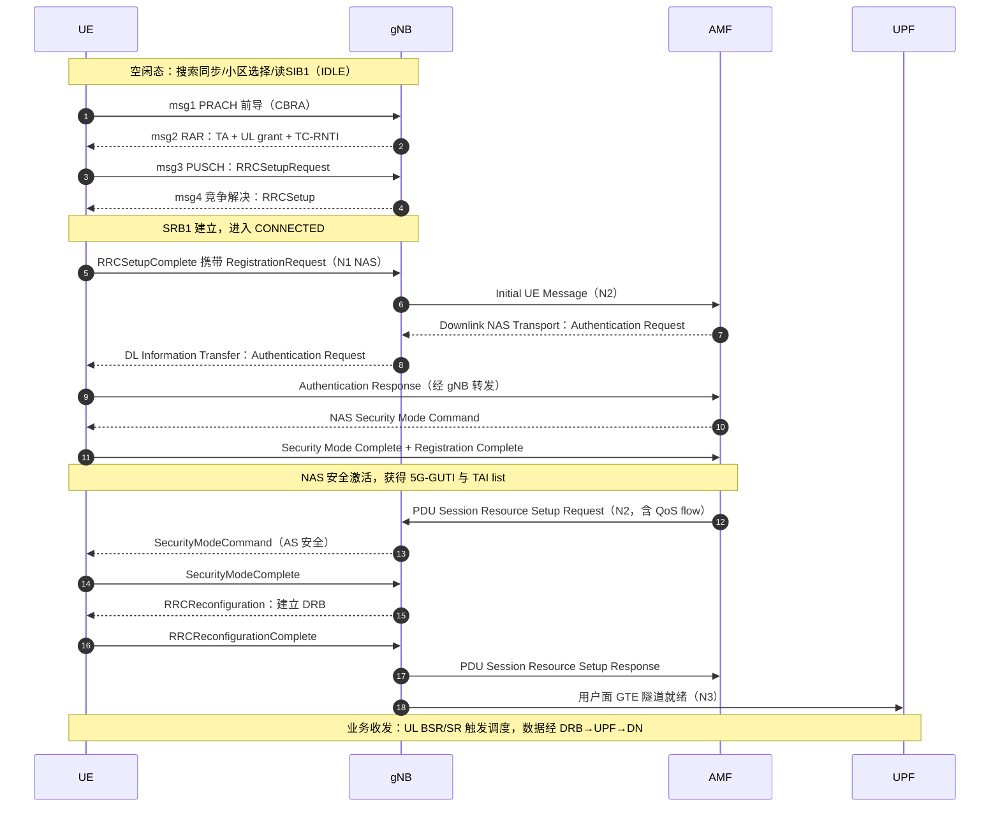


**4. 排障视角（面试加分点）**

- 卡在 ①–②：覆盖/同步问题（看 RSRP、S 准则差多少）；
- 卡在 ④：随机接入失败（按四步分点定位）；
- 卡在 ⑤：接入控制/许可问题（看拒绝原因）；
- 卡在 ⑥：鉴权失败（查 USIM/鉴权参数）、安全模式失败（查算法协商）；
- 卡在 ⑦：会话拒绝（查 DNN/切片签约、QoS 参数）；
- 串讲时能指出"哪一步卡了看什么日志"是工程功底的体现。

## 关联考点

- 开机三步：[NR 小区搜索完整流程：从 SSB 检测到读取 SIB1](./05-关键信令流程/ch05-q001-cell-search-full-procedure.md)
- 接入与注册：[RRC 建立流程与建立原因值](./05-关键信令流程/ch05-q012-rrc-establishment.md)、[NAS 注册流程要点（鉴权/安全模式/注册区域更新）](./05-关键信令流程/ch05-q013-nas-registration-flow.md)
- 业务触发：[数据到达触发的连接建立全链路（service request 视角）](./04-空口协议栈/ch04-q037-service-request-mob-data.md)

## 面试追问

- **注册和 PDU 会话建立的先后关系是什么？** —— 要点：注册先行且必须成功（网络要确认 UE 合法并建立安全），PDU 会话可在注册流程内同步请求（注册请求带会话建立需求）或注册完成后按需发起；没有注册（无安全上下文）就不可能建会话。
- **AS 安全激活前能传用户数据吗？** —— 要点：不能。RRC 层在 SecurityModeComplete 之后才允许下发含用户面配置的重配置，DRB 建立前数据无承载可走；协议强制"先安全、后业务"，呼通时延里安全激活是必经环节。
- **如果让你优化呼通时延，你会动哪些环节？** —— 要点：按耗时排序找瓶颈——常见优化：减少 SIB 获取轮次（按需 SIB 提前广播）、两步随机接入（省 msg2/msg4 轮次）、注册与会话建立并行（early data/注册携带）、INACTIVE resume 替代完整建立；但每项都有代价（资源开销/兼容性），需按业务模型权衡。

---

# 组网与架构 · gNB 逻辑架构：CU/DU 分离的动机与切分点

> 难度：中 ｜ 频率：高

## 一句话答案

5G RAN 把传统一体化基站的基带功能拆成集中式单元（CU, Centralized Unit）与分布式单元（DU, Distributed Unit）两级逻辑节点，CU 承载非实时的上层协议（SDAP/RRC/PDCP），DU 承载实时性要求高的下层协议（RLC/MAC/PHY 部分）。切分点选在 PDCP 与 RLC 之间，是在实时性要求与集中化收益（资源共享、协同、成本）之间权衡后的结果。

## 详细展开

**1. 分离的动机**

- **灵活部署**：CU 可云化/虚拟化（vDU、vCU），降低机房与传输成本；DU 贴近射频拉远部署。
- **性能/成本折中**：不同层协议对时延的敏感度差异巨大，把低时延部分留在 DU、把可集中的部分上移 CU。
- **多小区协同与开放**：CU 集中后便于多小区无线资源管理（RRM）、支持 Open RAN 生态与设备商解耦。

**2. 各层实时性要求与切分点**

| 协议层 | 时延敏感度 | 所在节点 |
|---|---|---|
| SDAP | 低 | CU |
| RRC（控制面） | 低 | CU |
| PDCP | 中（加密/重排序，可容忍较高时延） | CU |
| RLC / MAC | 高（调度、HARQ 周期为 ms 级） | DU |
| PHY 高层 | 高 | DU |
| PHY 低层（FFT/OFDM 等） | 极高 | DU 或 AAU |

3GPP 对 CU/DU 切分研究过约 8 种功能切分选项，最终采用高层切分：CU 与 DU 之间通过 F1 接口互联。实时性由 DU 本地闭环（HARQ 重传、调度），非实时功能集中到 CU。

**3. 实际组网形态**

- 一个 CU 可以管理多个 DU（1:N），CU 也可以容灾池化。
- 工程上 CU/DU 可以同机房部署，甚至物理合一（逻辑分离、物理同设备），取决于传输条件与时延预算。
- F1 用户面（F1-U）对时延有要求，一般要求 CU 与 DU 间传输时延在数百微秒到毫秒级以内。

## 关联考点

- F1 接口细节：F1 接口与 CU-CP/CU-UP 进一步分离
- 空口协议栈层次：[NR 用户面协议栈总览](./04-空口协议栈/ch04-q001-up-stack-overview.md)
- 与 LTE 一体化基站的对比：[LTE 与 NR 帧结构的差异](./01-无线基础与演进/ch01-q012-lte-nr-frame-structure-diff.md)

## 面试追问

- **为什么最终选在 PDCP 与 RLC 之间切分？** —— 要点：PDCP 之上功能（加密、头压缩、重排序）非实时、适合集中；RLC/MAC 的重传与调度必须在 ms 级闭环，集中会受传输时延制约，放在 DU 才能保证空口效率。这个切分点与 LTE 双连接中 MeNB/SeNB 的堆叠方式一致，演进平滑。
- **CU/DU 可以部署在同一台设备上吗？** —— 要点：可以。CU/DU 是逻辑概念，物理上可同机房甚至同框部署；传输条件差或小站场景常物理合一，此时 F1 就是内部接口，不改变逻辑架构。
- **CU/DU 分离与 EN-DC 中主辅站堆叠有什么关系？** —— 要点：EN-DC 下作为 SN 的 gNB 也可拆成 CU/DU，MCG/SCG 承载的 PDCP 锚定关系建立在 CU 层；理解分离有助于分析双连接下用户面路径与分流。

---

*难度提示：中 | 相关规范方向：38.401（gNB 架构与 F1 接口总体）*

---

# 组网与架构 · F1 接口与 CU-CP/CU-UP 进一步分离

> 难度：中 ｜ 频率：中

## 一句话答案

F1 是 CU 与 DU 之间的逻辑接口，分为控制面 F1-C（承载 NGAP 类似的应用协议 F1AP）与用户面 F1-U（GTP-U 隧道）。3GPP 进一步把 CU 拆成控制面部分（CU-CP）与用户面部分（CU-UP），二者之间通过 E1 接口互联，实现控制面与用户面的独立扩展与容灾。

## 详细展开

**1. F1 接口**

- **F1-C**：基于 SCTP，承载 F1AP，负责 UE 上下文管理（上下文建立/修改/释放）、RRC 消息传递（DU 与 CU-CP 之间透传 RRC）、系统信息调度、寻呼、测量报告转发等。
- **F1-U**：基于 GTP-U/UDP，承载用户数据隧道；PDCP 在 CU、RLC 在 DU，所以 F1-U 传递的是 PDCP PDU。
- 特点：RRC 在 CU，DU 只做 RRC 的中转与部分信令（如小区配置）；F1 支持无状态化设计，UE 上下文可在 CU 与 DU 间建立/删除。

**2. CU 内部进一步分离：CU-CP 与 CU-UP**

一个 gNB-CU-CP 可连接多个 gNB-CU-UP（1:N），一个 CU-UP 可服务多个 CU-CP 与多个 DU（M:N）。

| 节点 | 承载协议 | 接口 |
|---|---|---|
| CU-CP | RRC、PDCP-C（控制面） | F1-C（对 DU）、NG-C（对 AMF）、Xn-C |
| CU-UP | SDAP、PDCP-U（用户面） | F1-U（对 DU）、NG-U（对 UPF）、Xn-U |
| CU-CP ↔ CU-UP | — | E1（承载 E1AP，承载上下文管理） |

**3. 分离带来的好处**

- **独立扩容**：用户面（流量驱动）与控制面（信令驱动）资源需求不同，可分别弹性伸缩。
- **容灾与池化**：CU-UP 可池化部署，故障影响面小；CU-CP 故障影响控制信令，需重点保障。
- **灵活选路**：核心网侧用户面锚点不变时，可独立更换 CU-UP，减少切换时数据中断。

## 关联考点

- 上一级架构：[gNB 逻辑架构：CU/DU 分离的动机与切分点](./06-组网与架构/ch06-q001-gnb-cu-du-split.md)
- NG 与 Xn 接口：[N2/N3/Xn 接口的作用与协议栈](./06-组网与架构/ch06-q007-ng-n3-xn-interfaces.md)
- 切换中 CU-UP 更换：[NG 接口切换与 Xn 切换的差异](./05-关键信令流程/ch05-q024-ng-vs-xn-handover.md)

## 面试追问

- **E1 接口上传送什么？** —— 要点：E1AP 消息，核心是承载上下文管理（Bearer Context Setup/Modification/Release），CU-CP 通过它指示 CU-UP 建立/修改/释放 SDAP 与 PDCP-U 实体及对应隧道；还有 gNB-CU-UP 配置更新、测量信息交互等。
- **CU-CP 与 CU-UP 分离后，切换流程有什么变化？** —— 要点：Xn/NG 切换中，源与目标可以是不同 CU-UP；CU-CP 负责信令决策与上下文协调，CU-UP 只负责数据面，路径切换（如 UPF 侧隧道端点更新）由 CU-CP 经 NGAP 触发，数据中断更短。
- **F1-U 上跑的是 PDCP PDU 还是 RLC PDU？** —— 要点：PDCP PDU。因为 PDCP 在 CU、RLC 在 DU，DU 的 RLC 从 F1-U 收到 PDCP PDU 后再加 RLC/MAC 头；这也决定了加密（PDCP 层）在 CU 完成。

---

*难度提示：中 | 相关规范方向：38.460 系列（F1AP/F1-U）、38.463（E1AP）*

---

# 组网与架构 · 5GC 网络功能总览（AMF/SMF/UPF/UDM/PCF/AUSF/NSSF/NRF）

> 难度：易 ｜ 频率：高

## 一句话答案

5G 核心网（5GC）由一组服务化的网络功能（NF, Network Function）组成：AMF 负责接入与移动性管理，SMF 负责会话管理，UPF 负责用户面转发，UDM 存签约数据，PCF 出策略，AUSF 负责鉴权，NSSF 负责切片选择，NRF 负责服务发现与注册。NF 之间通过服务化接口（SBI）基于 HTTP/2 交互，取代了 4G EPC 点对点硬连接。

## 详细展开

**1. 主要 NF 一览**

| NF | 全称 | 核心职责 |
|---|---|---|
| AMF | Access and Mobility Management Function | 注册管理、连接管理、移动性管理、NAS 信令终结 |
| SMF | Session Management Function | PDU 会话建立/修改/释放、IP 地址分配、UPF 选择与控制 |
| UPF | User Plane Function | 用户面数据路由转发、QoS 执行、计费采集、锚点 |
| UDM | Unified Data Management | 签约数据管理、鉴权凭证生成、用户标识处理 |
| PCF | Policy Control Function | QoS 策略（PCC）、计费策略、接入与移动性策略下发 |
| AUSF | Authentication Server Function | 主鉴权服务（5G-AKA / EAP-AKA'） |
| NSSF | Network Slice Selection Function | 为 UE 选择网络切片实例与 AMF 集合 |
| NRF | NF Repository Function | NF 注册/发现/状态维护，SBA 的"通讯录" |

**2. 与 4G EPC 的对应关系**

| EPC | 5GC | 说明 |
|---|---|---|
| MME | AMF + 部分 SMF | 移动性管理与会话管理分离更彻底 |
| SGW/PGW-C | SMF | 控制面合一 |
| SGW-U/PGW-U | UPF | 用户面合一，且可多级下沉 |
| HSS | UDM + AUSF | 数据与鉴权分离 |
| PCRF | PCF | 命名变化，职责延续 |

**3. 架构特点**

- 基于服务化架构（SBA）：每个 NF 把能力封装为"服务"，通过统一接口暴露，其他 NF 可直接调用，NRF 负责发现。
- 控制面与用户面彻底分离（CUPS 思想的完全体）：控制面 NF 不转发用户数据，UPF 独立按流量/位置灵活部署。

## 关联考点

- 服务化架构原理：[SBA 服务化架构与网络功能接口](./06-组网与架构/ch06-q006-sba-service-based-architecture.md)
- AMF/SMF 分工：[AMF 与 SMF 的职责区分及协作](./06-组网与架构/ch06-q004-amf-smf-responsibilities.md)
- 用户面部署：[UPF 的位置、作用与下沉部署](./06-组网与架构/ch06-q005-upf-position-deployment.md)

## 面试追问

- **5GC 与 EPC 最本质的区别是什么？** —— 要点：从"点对点专有接口"变成"服务化接口（SBI，HTTP/2 + JSON）"，NF 可即插即用、按需调用；配合 CUPS 实现控制面与用户面彻底解耦，具备云原生弹性。
- **UDM 与 AUSF 为什么要分开？** —— 要点：UDM 保存签约与凭证（前端 UDR 存储），AUSF 只做鉴权算法执行与鉴权服务；分离后鉴权能力可独立调用、独立扩容，也让归属网络与拜访网络（漫游）的鉴权边界更清晰。
- **NRF 挂了会怎样？** —— 要点：NRF 是发现入口，新建会话/注册等需要发现的操作会失败；已建立的信令关联与用户面不受影响。生产上 NRF 需集群高可用部署，NF 侧也会缓存已发现的 NF 地址。

---

*难度提示：易 | 相关规范方向：23.501（5G 系统架构总览）*

---

# 组网与架构 · AMF 与 SMF 的职责区分及协作

> 难度：易 ｜ 频率：高

## 一句话答案

AMF 管"人"——接入与移动性：注册管理、连接管理、移动性管理、NAS 信令终结与透传；SMF 管"会话"——PDU 会话的建立/修改/释放、IP 地址分配、UPF 选择与控制、QoS 与计费策略执行。AMF 收到会话相关 NAS 消息后通过 N11 接口转给 SMF，自己不解析会话细节。

## 详细展开

**1. 职责边界**

| 维度 | AMF | SMF |
|---|---|---|
| 管理对象 | UE（终端） | PDU 会话 |
| 核心职责 | 注册管理（RM）、连接管理（CM）、移动性管理（MM）、可达性、寻呼 | 会话建立/修改/释放、UE IP 分配、UPF 选择、下行数据通知触发寻呼、计费与 QoS 策略执行 |
| NAS 消息 | Registration、Service Request、Paging 相关 | PDU Session Establishment/Modification 等会话类消息 |
| 接口 | N1（NAS）、N2（NGAP，对 gNB）、N8/N12（UDM/AUSF）、N14（AMF 间） | N4（PFCP，对 UPF）、N7（PCF）、N10（UDM）、N16（SMF 间） |

**2. 协作流程（以 PDU 会话建立为例）**

```
UE → AMF : PDU Session Establishment Request（NAS，经 gNB 透传）
AMF → SMF : N11（Nsmf_PDUSession_CreateSMContext）
SMF      : 选 UPF、与 PCF 交互策略、向 UDM 取签约
SMF → UPF : N4 会话建立（PFCP）
SMF → AMF : 会话建立结果 + N2 SM 信息
AMF → gNB : N2 PDU Session Resource Setup（经 NGAP）
gNB → UE  : RRC 重配 + NAS PDU Session Establishment Accept
```

AMF 全程只做"搬运与触发"：解析到这是会话类消息就交给 SMF；移动性流程（切换、寻呼）则不惊动 SMF，只在需要更新用户面隧道时才引入会话管理。

**3. 分离的意义**

- **移动性与会话解耦**：UE 移动（如站间切换）不动会话锚点；会话释放也不影响注册状态。
- **独立扩容**：物联网场景 AMF 密集、大流量场景 SMF/UPF 密集，可分别弹性伸缩。
- **AMF 重选不中断业务**：UE 移出 AMF 服务区时，AMF 间走 N14 转移上下文，PDU 会话由 SMF/UPF 维持。

## 关联考点

- 会话建立全流程：[PDU 会话建立流程涉及的功能与接口](./06-组网与架构/ch06-q008-pdu-session-establishment.md)
- 5GC NF 总览：[5GC 网络功能总览](./06-组网与架构/ch06-q003-5gc-nf-overview.md)
- 移动性管理流程：[NAS 注册流程要点](./05-关键信令流程/ch05-q013-nas-registration-flow.md)

## 面试追问

- **切换时 AMF 和 SMF 分别做什么？** —— 要点：Xn 切换常不经 AMF（只更新上下文）；NG 切换经 AMF 走 NGAP，AMF 负责信令中转；若 UPF 隧道端点变化，AMF 触发 SMF 走 N4 修改会话。核心：移动性由 AMF 驱动，用户面更新由 SMF 执行。
- **为什么 NAS 信令要经过 AMF 透传给 SMF 而不是 UE 直连 SMF？** —— 要点：UE 只与网络保持一条 NAS 连接（N1），所有 NAS 消息终结在 AMF；这样空口信令路径唯一、安全上下文统一（AMF 参与密钥管理），会话管理作为"服务"挂在注册管理之下，架构更简洁。
- **一个 UE 可以有多个 SMF 吗？** —— 要点：可以。每个 PDU 会话由一个 SMF 管理，不同会话（不同 DNN/切片）可选不同 SMF，实现按业务隔离。

---

*难度提示：易 | 相关规范方向：23.501（架构）、24.501（NAS 会话类消息）*

---

# 组网与架构 · UPF 的位置、作用与下沉部署（边缘计算）

> 难度：中 ｜ 频率：高

## 一句话答案

UPF（User Plane Function）是 5GC 的用户面网关，负责用户数据的路由转发、QoS 执行、计费与流量上报，全部用户面数据都必须经过它。UPF 可按业务需求灵活下沉到地市/园区/基站机房，让数据就近卸载（边缘计算 MEC），降低时延并减少回传占用。

## 详细展开

**1. 核心作用**

- **转发与锚点**：执行 SMF 下发的 PFCP 规则（N4 接口），按规则匹配、转发、封装（GTP-U）用户数据；PDU 会话锚点（UE IP 的终点）就在 UPF。
- **QoS 执行**：按 QoS flow 做门控、速率限制（GBR/MBR）、标记（如 DSCP）。
- **计费与上报**：流量计量、使用量上报（与 CHF 配合）、合法监听。
- **其他**：下行数据缓存与通知（触发网络寻呼）、分流（UL CL/IPv6 多宿主）、与 DN 的 N6 接口对接。

**2. 部署位置与下沉**

| 部署位置 | 场景 | 特点 |
|---|---|---|
| 大区/省中心 | 普通上网业务 | 集中池化、锚点稳定，时延较高 |
| 地市/区域 | 一般本地业务 | 折中 |
| 园区/基站侧 | 工业控制、云游戏、车联网 | 就近卸载，时延最低，但锚点易变 |

下沉带来的问题：UE 移动跨越 UPF 服务区需要改变锚点或插入中间 UPF。5GC 用**上行分类器（UL CL, Uplink Classifier）**或 **IPv6 多宿主（Multi-homing）**在本地插入一个分流 UPF：主锚点不变（保证 IP 连续），本地业务就近分流到本地 DN。

**3. 与 4G 的对比**

4G 时代通过 CUPS（控制面/用户面分离扩展）引入 SGW-U/PGW-U 分离，但 5GC 从设计之初就是 CUPS 架构：SMF 经 N4（PFCP 协议）统一控制多个分布式 UPF，控制面完全不再承载用户数据。

## 关联考点

- 控制它的 NF：[AMF 与 SMF 的职责区分及协作](./06-组网与架构/ch06-q004-amf-smf-responsibilities.md)
- 架构总览：[5GC 网络功能总览](./06-组网与架构/ch06-q003-5gc-nf-overview.md)
- 低时延与空口侧配合：URLLC 场景（第 1 章三类场景）

## 面试追问

- **UL CL 是什么，什么时候用？** —— 要点：Uplink Classifier，一个 IPv4 会话中插入的分流点；SMF 发现 UE 靠近本地数据网络时，在锚点 UPF 前插入 UL CL UPF，按目的地址把本地流量分流到本地 UPF、其余继续到锚点；UE 无感知、IP 不变。IPv6 场景用 Multi-homing（多个 PDU 会话锚点共享前缀）实现同样效果。
- **UPF 下沉后，UE 移动到另一个城市，IP 会变吗？** —— 要点：不一定。若会话锚点 UPF 不变，仅中间 UPF（UL CL）更换，IP 保持；若需要更换锚点（HR 模式不适用时），则触发会话重建，IP 会变。运营商通过"会话与业务连续性模式"（SSC mode）控制这一行为。
- **N4 接口用什么协议？** —— 要点：PFCP（Packet Forwarding Control Protocol），SMF 通过它下发转发规则（PDR/FAR/QER/URR 等规则集），UPF 按规则执行匹配、转发、QoS 与计量上报。

---

*难度提示：中 | 相关规范方向：23.501（UPF 与 SSC）、29.244（PFCP）*

---

# 组网与架构 · SBA 服务化架构与网络功能接口

> 难度：中 ｜ 频率：中

## 一句话答案

SBA（Service Based Architecture，服务化架构）是 5GC 控制面的组织方式：每个网络功能（NF）把自己的能力封装成若干"网络服务"通过服务化接口（SBI）对外暴露，其他 NF 直接调用，不需要为每对 NF 定义专有接口。接口统一基于 HTTP/2 + JSON，NRF 充当服务的注册与发现中心。

## 详细展开

**1. 从点对点到服务化**

- 4G EPC：MME↔HSS、MME↔SGW……每对 NF 之间是**专有点对点接口**（S1-MME、S11、S6a 等），每加一种 NF 或能力都要定义新接口，网状耦合。
- 5GC：控制面 NF 两两之间不再定义专有接口，而是都连到同一个"总线"——服务化接口。NF 提供服务（如 AMF 提供 Namf_Communication），消费者 NF 经 NRF 查询后直接调用。

**2. 服务化接口约定**

| 要素 | 约定 |
|---|---|
| 协议 | HTTP/2（TLS 加密） |
| 消息体 | JSON |
| 服务注册 | NF 启动后向 NRF 注册（Nnrf_NFManagement） |
| 服务发现 | 消费者向 NRF 查询目标 NF 实例（Nnrf_NFDiscovery） |
| 服务命名 | N**nf**_**服务名**，如 Namf_Communication、Nsmf_PDUSession |
| 通信方式 | 请求-响应为主，也支持订阅-通知（如 PCF 订阅 UDM 签约变更） |

**3. 参考点与服务化接口并存**

图中 NF 之间的连线有两类：NF↔NF 的服务化接口（总线式），以及少量**非服务化参考点**——如 N1（UE↔AMF 的 NAS）、N2（AN↔AMF）、N3（AN↔UPF）、N4（SMF↔UPF）。这些接口一端是传统网元（基站/UPF），不走 HTTP，仍用 NGAP/PFCP/GTP-U 等专有协议。

**4. 好处与代价**

- **好处**：NF 即插即用、按需组合（编排），支持网络切片按需实例化；接口标准化程度高，利于多厂商解耦与云化部署。
- **代价**：HTTP/2 信令效率低于二进制专有协议，需靠 NF 集群化与缓存发现结果弥补性能；对运维与安全（全 TLS、边缘防护）提出更高要求。

## 关联考点

- NF 职责：[5GC 网络功能总览](./06-组网与架构/ch06-q003-5gc-nf-overview.md)
- 非服务化接口：[N2/N3/Xn 接口的作用与协议栈](./06-组网与架构/ch06-q007-ng-n3-xn-interfaces.md)
- 切片选择依赖 NRF/NSSF：[切片选择流程（NSSF 与 AMF 的分工）](./06-组网与架构/ch06-q010-slice-selection-nssf.md)

## 面试追问

- **SBI 为什么选 HTTP/2 而不是 Diameter 或自定义二进制？** —— 要点：HTTP/2 生态成熟、天然支持多路复用与流控、易与 Web/云原生体系（负载均衡、API 网关、微服务治理）集成；JSON 可读性好、扩展方便。Diameter 是点对点时代产物，扩展性差；自定义二进制不利于多厂商互通。
- **订阅-通知机制举例？** —— 要点：PCF 向 UDM 订阅签约数据变更（Nudm_SDM_Subscribe），签约变化时 UDM 主动通知 PCF 更新策略；AMF 也可向 SMF 订阅会话状态变化。这是 SBA 中除请求-响应外的另一类交互模式。
- **SBA 架构下用户面也走 HTTP 吗？** —— 要点：不。SBA 只用于控制面 NF 之间；N3/N4/N6/N9 等涉及用户面数据的接口仍用 GTP-U/PFCP 等高效二进制协议，保证转发性能。

---

*难度提示：中 | 相关规范方向：23.501（SBA 总览）、29.500/29.501（SBI 框架）*

---

# 组网与架构 · N2/N3/Xn 接口的作用与协议栈

> 难度：中 ｜ 频率：高

## 一句话答案

N2 是 gNB 与 AMF 之间承载 NGAP 信令的控制面接口（对应 LTE 的 S1-MME）；N3 是 gNB 与 UPF 之间的用户面接口，跑 GTP-U 隧道（对应 S1-U）；Xn 是 gNB 与 gNB 之间的接口，同时承载信令（XnAP）与数据前转/用户面（Xn-U），支撑站间切换与双连接。三者构成 NG-RAN 对外的主要连接。

## 详细展开

**1. 三接口对比**

| 接口 | 两端 | 面向 | 协议栈（承载层以上） | 主要功能 |
|---|---|---|---|---|
| N2 | gNB ↔ AMF | 控制面 | NGAP over SCTP | UE 上下文管理、PDU 会话资源管理、切换信令、寻呼、NAS 透传 |
| N3 | gNB ↔ UPF | 用户面 | GTP-U over UDP/IP | 承载 PDU 会话用户数据（上行分类/下行转发） |
| Xn | NG-RAN 节点 ↔ NG-RAN 节点 | 控制面+用户面 | XnAP over SCTP（Xn-C）；GTP-U over UDP（Xn-U） | 站间切换（含数据前转）、上下文获取、双连接（EN-DC/NGEN-DC 中 MN↔SN 的 X2/Xn） |

**2. 协议栈细节**

- **N2/NGAP**：SCTP 保障信令可靠有序；NGAP 消息分 UE 相关（UE Context Setup/Modification/Release、PDU Session Resource Setup 等）与非 UE 相关（NG Setup、Error Indication、寻呼）。NAS 消息在 N2 上只是"透传包裹"，逻辑上属于 N1（UE↔AMF）。
- **N3/GTP-U**：每个 QoS flow 到 DRB 映射后，gNB 与 UPF 之间按 PDU 会话建 GTP-U 隧道，TEID 标识隧道端点；QoS flow 级别的标记（QFI）封装在 GTP-U 扩展头中。
- **Xn**：控制面 Xn-C（SCTP）+ 用户面 Xn-U（UDP/GTP-U）。切换时源站经 Xn-U 前转未确认数据，减少丢包；XnAP 的 Xn Setup 过程交互小区信息，实现 ANR 式自动邻区建立的基础。

**3. 与 LTE 接口的对应**

| LTE | NR | 变化点 |
|---|---|---|
| S1-MME | N2 | MME→AMF，会话管理信息由 AMF 中转给 SMF |
| S1-U | N3 | SGW→UPF，可直接对接分布式 UPF |
| X2 | Xn | 功能类似，增加 EN-DC 场景兼容（Xn 兼容部分 X2 流程） |

## 关联考点

- Xn 切换流程：[Xn 接口切换的完整流程](./05-关键信令流程/ch05-q023-xn-handover-procedure.md)
- NG 与 Xn 切换对比：[NG 接口切换与 Xn 切换的差异](./05-关键信令流程/ch05-q024-ng-vs-xn-handover.md)
- QFI 与 QoS 映射：[QoS flow、DRB、PDU session 的层级关系](./06-组网与架构/ch06-q013-qos-flow-drb-session.md)

## 面试追问

- **N2 和 N3 为什么要分开？** —— 要点：控制面与用户面分离（CUPS）的结果。信令归 AMF、数据归 UPF，用户面可以按需下沉扩容而不牵动信令网；4G 的 S1-MME/S1-U 也是分离的，但 5G 中 UPF 数量与位置更灵活，解耦价值更大。
- **Xn 切换和 NG 切换数据面有什么不同？** —— 要点：Xn 切换期间源 gNB 直接经 Xn-U 向目标 gNB 前转数据，路径切换（UPF 侧隧道改向）在 UE 接入目标小区后进行，中断更短；NG 切换数据前转经核心网中转（源 gNB→UPF→目标 gNB），信令也经 AMF，时延略高但适用于无 Xn 或跨 AMF 场景。
- **NG Setup（N2 上第一条非 UE 消息）交互什么信息？** —— 要点：gNB 向 AMF 上报全局标识（PLMN、gNB ID）、支持的 TAI/切片（S-NSSAI）列表，AMF 回复可用 PLMN/切片信息；这是基站"入网登记"，让 AMF 知道该 gNB 覆盖哪些 TA、支持哪些切片。

---

*难度提示：中 | 相关规范方向：38.413（NGAP）、38.423（XnAP）、29.281（GTP-U）*

---

# 组网与架构 · PDU 会话建立流程涉及的功能与接口

> 难度：难 ｜ 频率：高

## 一句话答案

PDU 会话建立由 UE 发起 NAS 消息（PDU Session Establishment Request），经 gNB/AMF 转交 SMF；SMF 查签约、选 UPF、向 PCF 取策略，通过 N4 在 UPF 建立转发规则，再经 AMF/N2 指示 gNB 建立 DRB 与 N3 隧道，最后 NAS Accept 回到 UE，端到端通路打通。整个过程串联了 AMF（N1/N2 中转）、SMF（会话控制）、UPF（用户面锚点）、PCF（策略）、UDM（签约）。

## 详细展开

**1. 端到端流程**

```
① UE → gNB → AMF : UL NAS TRANSPORT 携带 PDU Session Establishment Request
                    （DNN、S-NSSAI、请求类型、PDU 会话 ID）
② AMF → SMF      : Nsmf_PDUSession_CreateSMContext（N11）
                    AMF 已按 (S-NSSAI, DNN) 选好 SMF（可经 NRF 发现）
③ SMF ⇄ UDM      : N10 取会话签约（默认 QoS、允许的 SSC mode、计费）
④ SMF ⇄ PCF      : N7 获取 PCC 规则（动态策略）
⑤ SMF → UPF      : N4 PFCP Session Establishment（下发 PDR/FAR/QER）
⑥ SMF → AMF      : Nsmf 响应，携带 N2 SM 信息（N3 隧道 UPF 端 TEID、QoS profile）
⑦ AMF → gNB      : NGAP PDU Session Resource Setup Request（N2）
⑧ gNB            : 建立 DRB（RRC 重配），完成与 UPF 的 N3 GTP-U 隧道
⑨ gNB → AMF      : PDU Session Resource Setup Response（gNB 侧隧道信息）
⑩ AMF → SMF      : 更新会话（N11），SMF 完成与 UPF 的 N4 修改
⑪ UE ← AMF ← SMF : NAS PDU Session Establishment Accept（UE IP、QoS 规则、DNN）
⑫ UE             : Registration Complete 类确认（会话级 ACK）
```

**2. 关键决策点**

| 决策 | 执行者 | 依据 |
|---|---|---|
| 选 AMF | gNB/NSSF | 初始注册时按切片与 TA |
| 选 SMF | AMF | (S-NSSAI, DNN)，可问 NRF |
| 选 UPF | SMF | 位置（TAI/Cell）、DNN、时延需求、负载 |
| QoS 策略 | PCF→SMF | 业务签约与运营商策略（PCC） |
| 会话与业务连续性 | SMF | SSC mode 1/2/3 |

**3. 要点提示**

- PDU 会话 ID 由 UE 分配并保持稳定，是移动性流程中会话关联的钥匙。
- 会话建立在**注册完成之后**（异常时允许注册中夹带），NAS 层会话消息与注册消息分属不同过程。
- gNB 只在 ⑦⑧ 才知道会话存在：核心网先选好 UPF 再通知空口，说明**锚点选择与空口资源建立是解耦的**。

**标准信令时序（UE ↔ gNB ↔ AMF ↔ SMF ↔ UPF）**：

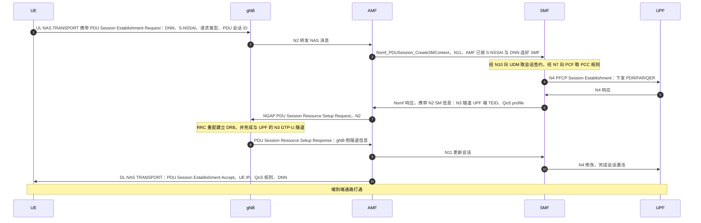

## 关联考点

- AMF/SMF 协作：[AMF 与 SMF 的职责区分及协作](./06-组网与架构/ch06-q004-amf-smf-responsibilities.md)
- UPF 选择与下沉：[UPF 的位置、作用与下沉部署](./06-组网与架构/ch06-q005-upf-position-deployment.md)
- QoS 策略来源：[动态 PCC 与 PCF 策略下发](./06-组网与架构/ch06-q014-dynamic-pcc-pcf.md)
- 空口承载映射：[QoS flow、DRB、PDU session 的层级关系](./06-组网与架构/ch06-q013-qos-flow-drb-session.md)

## 面试追问

- **PDU 会话建立请求中的"请求类型"有哪些？** —— 要点：initial（新会话）、existing PDU session（3GPP 与非 3GPP 接入间迁移/切换沿用）、emergency（紧急会话）、session transfer 等；UE 从非 3GPP（如 WiFi）切到 3GPP 时用 existing 类型保持同一会话与 IP。
- **SMF 怎么选 UPF？** —— 要点：综合 UE 当前位置（TAI/小区）、DNN 对应的数据网络、切片、时延/位置约束（如企业本地分流）、UPF 负载与能力（如是否支持 UL CL），从 NRF 或本地配置的 UPF 池中选；跨 TA 移动时可插入中间 UPF 而不换锚点。
- **会话建立失败常见原因有哪些？** —— 要点：签约不允许该 DNN/切片（UDM 签约拒绝）、切片不可用（NSSF/NSSAA 未通过）、UPF 资源不可用（N4 失败）、策略获取失败（PCF 超时）、IP 地址池耗尽；排查时按 N1→N11→N4→N2 各段定位。

---

*难度提示：难 | 相关规范方向：23.502（会话建立过程）、24.501（NAS 会话消息）*

---

# 组网与架构 · 网络切片 S-NSSAI 的结构与配置

> 难度：中 ｜ 频率：高

## 一句话答案

S-NSSAI（Single Network Slice Selection Assistance Information）是网络切片的标识，由 SST（Slice/Service Type，8 bit，表示切片类型）和可选的 SD（Slice Differentiator，24 bit，区分同类型不同实例）组成。UE 通过它表达想接入的切片，网络按 S-NSSAI 做选择、签约、准入与资源隔离。

## 详细展开

**1. 结构**

```
S-NSSAI = SST（8 bit）+ SD（24 bit，可选）
```

| 字段 | 长度 | 含义 | 取值示例 |
|---|---|---|---|
| SST | 8 bit | 切片/服务类型，标准化范围 0–127 | 1 = eMBB，2 = URLLC，3 = mIoT（3GPP 预定义） |
| SD | 24 bit | 切片区分符，运营商自定义 | 0x01A2B3（区分不同租户/区域） |

- 只含 SST 的 S-NSSAI 称"默认 S-NSSAI"（如仅 SST=1）。
- SST 128–255 为非标准取值，运营商可用 SD 配合做私有切片。
- **配置约定**：SST/SD 在 PLMN 内有效；漫游场景签约里可带 mapped S-NSSAI（归属网络与拜访网络切片的映射）。

**2. 配置位置**

| 位置 | 内容 |
|---|---|
| UE（USIM/签约） | 允许的 S-NSSAI（Allowed NSSAI）、默认配置 NSSAI |
| UDM 签约 | 订阅的 S-NSSAI、各切片对应的 DNN、默认 SSC mode |
| gNB | 本小区支持的切片列表（NG Setup / Xn Setup 时上报 AMF/对端） |
| NSSF | 切片→AMF 集合/网络切片实例的映射 |
| AMF | 可服务的 S-NSSAI 集合（AMF 按切片能力选择） |

**3. NSSAI 的几种形态**

- **Requested NSSAI**：UE 发起注册时带上想用的切片。
- **Allowed NSSAI**：网络（AMF 参照签约与切片可用性）批准 UE 在当前注册区域可用的切片。
- **Configured NSSAI**：签约预配置给 UE 的切片集合，用于构造 Requested NSSAI。

注册接受消息把 Allowed NSSAI 下发给 UE；之后每个 PDU 会话必须绑定到 Allowed NSSAI 中的一个切片。

## 关联考点

- 切片选择流程：[切片选择流程（NSSF 与 AMF 的分工）](./06-组网与架构/ch06-q010-slice-selection-nssf.md)
- 切片与 QoS：[切片与 5QI/QoS 策略的关系](./06-组网与架构/ch06-q011-slice-5qi-qos.md)
- 会话建立中的切片参数：[PDU 会话建立流程涉及的功能与接口](./06-组网与架构/ch06-q008-pdu-session-establishment.md)

## 面试追问

- **SST 和 SD 各起什么作用？只配 SST 行不行？** —— 要点：SST 表达业务类型大类（eMBB/URLLC/mIoT），SD 在同类型下区分不同切片实例（不同租户、不同区域、不同隔离等级）；只配 SST 完全合法，表示"该类型下的默认切片"，SD 是可选的精细化手段。
- **Requested NSSAI 和 Allowed NSSAI 不一致怎么办？** —— 要点：网络只批准签约且当前可用的子集，注册接受会带 Rejected NSSAI（及拒绝原因，如该 TA 不可用/未签约）；UE 若必须用被拒切片，可在相应条件下换 TA 或发起重注册，否则只能用 Allowed NSSAI 建会话。
- **切片隔离体现在哪些层面？** —— 要点：签约/准入隔离（不同切片不同用户群）、控制面隔离（可部署独立 AMF/SMF 实例）、用户面隔离（独立 UPF/传输）、资源隔离（gNB 可为切片配置专用 PRB/权重）；从"逻辑隔离"到"物理专网"由 SLA 决定。

---

*难度提示：中 | 相关规范方向：23.501（切片架构与 NSSAI）、23.003（S-NSSAI 编码）*

---

# 组网与架构 · 切片选择流程（NSSF 与 AMF 的分工）

> 难度：难 ｜ 频率：中

## 一句话答案

切片选择分两级：注册时 NSSF 根据 UE 的 Requested NSSAI 与签约，决定允许的切片、选择的网络切片实例，并给出应服务的 AMF 集合（若当前 AMF 不合适则触发 AMF 重选）；AMF 则在已定切片的前提下，为每个 PDU 会话选择 SMF 与 UPF。简言之，NSSF 管"选切片+选 AMF"，AMF 管"在切片内选会话网元"。

## 详细展开

**1. 注册阶段的切片选择**

```
① UE → (R)AN → AMF : Registration Request（Requested NSSAI, guided 信息）
② AMF 判断自身能否服务所有 Requested NSSAI
   ├─ 能：直接继续注册，无需 NSSF
   └─ 不能：AMF → NSSF 调用 Nnssf_NSSelection_Get
③ NSSF 查询：
   - 签约切片（经 NRF 找 UDM/NF）
   - 各切片可用的网络切片实例（NSI）
   - 该切片可用的 AMF 集合（AMF Set）
④ NSSF → AMF : Allowed NSSAI、映射关系、目标 AMF 集合（或 NSI 信息）
⑤ 若当前 AMF 不在集合内 → RAN/AMF 触发 AMF 重选（Reroute NAS）
⑥ 新 AMF 继续注册，注册接受携带 Allowed NSSAI
```

**2. 会话阶段的切片选择（AMF 主导）**

- UE 建 PDU 会话时携带目标 S-NSSAI（必须在 Allowed NSSAI 内）。
- AMF 按（S-NSSAI, DNN）选择 SMF：本地配置或经 NRF 发现支持该切片的 SMF 实例。
- SMF 再选 UPF：同样受切片约束——不同切片通常有各自的 UPF 池，保证用户面隔离与 SLA。

**3. NSSF 与 AMF 分工对比**

| 维度 | NSSF | AMF |
|---|---|---|
| 职责 | 切片级：Allowed NSSAI、NSI 选择、候选 AMF 集合 | 会话级：切片内选 SMF、会话承载管理 |
| 介入时机 | 注册阶段（AMF 不确定能否服务时） | 全程（注册与每个 PDU 会话） |
| 输出 | NSSAI 相关决策 + 路由指引 | NAS 流程执行与资源建立 |

**4. 工程要点**

- 多数现网把 NSSF 能力与 NRF/UDM 合设或轻量部署，独立 NSSF 多见于多租户/行业专网。
- "guided 信息"（RAN 侧路由指示）可帮助 RAN 直接把 NAS 消息送到合适 AMF，减少重定向。

## 关联考点

- S-NSSAI 结构：[网络切片 S-NSSAI 的结构与配置](./06-组网与架构/ch06-q009-snssai-structure.md)
- AMF 职责：[AMF 与 SMF 的职责区分及协作](./06-组网与架构/ch06-q004-amf-smf-responsibilities.md)
- NRF 与服务发现：[SBA 服务化架构与网络功能接口](./06-组网与架构/ch06-q006-sba-service-based-architecture.md)

## 面试追问

- **什么情况下注册不需要 NSSF 参与？** —— 要点：当前 AMF 的可服务切片集合覆盖 UE 的全部 Requested NSSAI（AMF 本地可判断），或 UE 请求默认切片且 AMF 能服务；NSSF 只在"AMF 不确定/不能服务"时介入，避免每注册都多一跳查询。
- **AMF 重选（Reroute NAS）怎么做？** —— 要点：NSSF/AMF 给出目标 AMF 集合后，AMF 可指示 RAN 把 UE 的后续 NAS 消息重路由到集合内的新 AMF（含上下文转移或让 UE 重新发起）；目标 AMF 通过 AMF Set 内的上下文获取（N14 接口）延续注册，尽量不让 UE 重头再来。
- **切片实例（NSI）和 S-NSSAI 是一回事吗？** —— 要点：不是。S-NSSAI 是逻辑标识，NSI 是实际部署的一组 NF 实例组合（含 AMF/SMF/UPF 子集）；一个 S-NSSAI 可映射到不同区域的多个 NSI，NSSF 维护这层映射，实现"一个切片标识、多地就近部署"。

---

*难度提示：难 | 相关规范方向：23.501/23.502（切片选择与 AMF 重选）*

---

# 组网与架构 · 切片与 5QI/QoS 策略的关系

> 难度：中 ｜ 频率：中

## 一句话答案

切片解决"资源与用户隔离"，5QI/QoS 解决"会话内业务等级"，二者是两个正交的维度：一个 PDU 会话必须属于某个切片（S-NSSAI），会话内每条 QoS flow 再按 5QI 获得调度优先级、时延包误码等控制。切片的 SLA 通过该切片内各会话的 QoS 策略（PCF 下发）与空口资源配比来兑现。

## 详细展开

**1. 两个维度的定位**

| 维度 | 标识 | 控制对象 | 典型决策者 |
|---|---|---|---|
| 切片 | S-NSSAI | 用户群/业务域的资源与隔离（准入、NF 选择、传输资源） | NSSF/AMF/SMF + 运营编排 |
| QoS | 5QI / QoS 参数 | 单条 QoS flow 的调度与丢包/时延行为 | PCF（动态）或签约默认 |

类比：切片是"包间"，5QI 是"包间内的服务档次"。

**2. 切片如何影响 QoS 策略**

- 签约与策略按切片差异化：UDM 中同一 DNN 在不同 S-NSSAI 下可配不同默认 5QI/ARP；PCF 可按 (S-NSSAI, DNN, 业务) 组合下发不同 PCC 规则。
- gNB 调度器按切片做准入与权重：切片级 PRB 配比/优先级 + flow 级 5QI 调度，两层共同决定最终体验。
- 计费与 SLA 监控也按切片维度聚合（每个切片的 KPI/用量单独统计）。

**3. 典型组合示例**

| 切片 | 典型会话 5QI | 说明 |
|---|---|---|
| eMBB（SST=1） | 5（默认，非 GBR）、8/9 | 大带宽，非 GBR 为主 |
| URLLC（SST=2） | 82/83（GBR，低时延档） | 小包低时延，GBR 保障 |
| mIoT（SST=3） | 9 或低优先级非 GBR | 海量连接，容忍时延 |

要点：**切片决定"能用哪类 5QI、有多少资源配额"，5QI 决定"会话内具体怎么调"**。URLLC 切片里也可以建非 GBR 的普通会话；反之没有切片约束时，eMBB 用户也能建 GBR 承载（如 VoNR）。

## 关联考点

- 5QI 细节：[5QI 标准化取值与 GBR/非 GBR 分类](./06-组网与架构/ch06-q012-5qi-gbr-non-gbr.md)
- 策略下发机制：[动态 PCC 与 PCF 策略下发](./06-组网与架构/ch06-q014-dynamic-pcc-pcf.md)
- 会话绑定切片：[网络切片 S-NSSAI 的结构与配置](./06-组网与架构/ch06-q009-snssai-structure.md)

## 面试追问

- **没有切片的商用网，QoS 就没意义了吗？** —— 要点：有意义。5QI/QoS flow 在单会话内依然生效（如 VoNR 用 5QI=1 的 GBR flow），与是否切片无关；切片是把 QoS 差异化从"flow 级"扩展到"用户群/资源域级"的增强手段。
- **切片 SLA 欠佳时，先查空口还是先查核心网？** —— 要点：分层定位——先看切片准入与会话是否绑对切片（NAS/N11 段）、UPF 是否在切片专属池；再看 gNB 切片级资源配比与 flow 级 5QI 配置是否一致；最后看传输是否做了切片隔离（硬/软管道）。多数"切片不提速"问题出在空口资源未配比或策略未下发。
- **同一 UE 的两个会话可以属于不同切片吗？** —— 要点：可以，只要两个切片都在 Allowed NSSAI 内。每个 PDU 会话独立绑定一个 S-NSSAI，eMBB 上网 + URLLC 行业通道可并存，各自走各自的 SMF/UPF 与策略。

---

*难度提示：中 | 相关规范方向：23.501（切片与 QoS 架构关系）*

---

# 组网与架构 · 5QI 标准化取值与 GBR/非 GBR 分类

> 难度：中 ｜ 频率：高

## 一句话答案

5QI（5G QoS Identifier）是一个标量索引，指向一组预定义的 QoS 特征（资源类型、优先级、包时延预算 PDB、包误码率 PER、是否缺省最大数据突发等）。资源类型分 GBR（有专用速率保障）、延迟关键的 GBR（URLLC 档）与非 GBR（尽力而为/受控）三类，VoNR、视频、普通上网各有典型取值。

## 详细展开

**1. 三个资源类型**

| 类型 | 特征 | 适用 |
|---|---|---|
| GBR | 承诺 GFBR，超过 MFBR 可能被门控丢弃 | 语音、视频通话 |
| 延迟关键的 GBR（Delay-critical GBR） | 更严格的 PDB/PER，含 MDBV（最大突发） | 工业控制、URLLC |
| 非 GBR | 无专用保障，靠优先级与调度竞争 | 上网、流媒体、消息 |

**2. 常用标准化 5QI 一览**

| 5QI | 类型 | 优先级 | 典型业务 |
|---|---|---|---|
| 1 | GBR | 20 | 语音（VoNR/VoLTE 对应） |
| 2 | GBR | 40 | 视频通话 |
| 5 | 非 GBR | 10 | IMS 信令（默认承载级） |
| 7 | 非 GBR | 30 | 视频（流式） |
| 8 | 非 GBR | 80 | 运营商默认上网 |
| 9 | 非 GBR | 90 | 默认承载（4G 沿用最广） |
| 65 | GBR | 7 | 关键任务语音（MCPTT） |
| 67 | GBR | 5 | 关键任务视频 |
| 69 | 非 GBR | 5 | 关键任务信令 |
| 70 | 非 GBR | 55 | 关键任务数据 |
| 79 | 非 GBR | 65 | V2X 消息 |
| 80 | 非 GBR | 68 | 低时延 eMBB（AR 场景） |
| 82/83 | 延迟关键 GBR | 19/22 | URLLC（离散自动化/电力保护，PDB 毫秒级） |

**3. 5QI 与动态参数的关系**

- **标准化 5QI**：控制面只传索引，QoS 特征在网元本地按标准表展开，信令省。
- **动态 5QI（QoS 特征显式下发）**：PCF/SMF 可显式携带参数集（优先级、PDB、PER 等），取值 128–254 预留给非标准化组合。
- GBR flow 还需 GFBR/MFBR/会话级 AMBR 之外注意：非 GBR flow 共享会话的会话-AMBR；ARP（分配与保持优先级）决定拥塞时谁先被抢占，独立于 5QI。

## 关联考点

- flow/DRB/session 层级：[QoS flow、DRB、PDU session 的层级关系](./06-组网与架构/ch06-q013-qos-flow-drb-session.md)
- 切片与 5QI 配合：[切片与 5QI/QoS 策略的关系](./06-组网与架构/ch06-q011-slice-5qi-qos.md)
- 策略来源：[动态 PCC 与 PCF 策略下发](./06-组网与架构/ch06-q014-dynamic-pcc-pcf.md)
- 反射 QoS：[反射 QoS（RQA）的工作机制](./04-空口协议栈/ch04-q004-reflective-qos.md)

## 面试追问

- **5QI=8 和 5QI=9 都是默认上网，为什么并存？** —— 要点：历史与优先级设计——5QI=8/9 均为非 GBR，默认差异是优先级（80 vs 90）与源自 LTE 的 QCI 沿革（QCI8/9 映射）；运营商按签约选择，国内常见默认 9，部分套餐用 8 以区分优先级。
- **GBR flow 的 GFBR 保证不了会怎样？** —— 要点：GBR 的"保证"前提是网络准入控制——接纳时按 GFBR 预留资源；若空口拥塞导致实际速率跌破 GFBR，网络侧可触发流程放弃保障（如释放承载或降级），避免虚假承诺；这也解释了为什么 GBR flow 要谨慎准入。
- **ARP 和 5QI 优先级有什么区别？** —— 要点：5QI 优先级用于正常状态下调度排布（PDB 内的调度顺序）；ARP 用于准入控制与资源冲突时的抢占决策（哪个 flow 可被丢弃/降级）；一个 5QI 低优先级但 ARP 高的 flow，调度靠后但不容易被踢。

---

*难度提示：中 | 相关规范方向：23.501（5QI 表与 QoS 特征）*

---

# 组网与架构 · QoS flow、DRB、PDU session 的层级关系

> 难度：中 ｜ 频率：高

## 一句话答案

PDU 会话是 UE 与数据网络之间的端到端连接（一个会话一个 UE IP）；会话内按 QoS flow 划分服务质量粒度（每条 flow 一个 5QI/ARP）；空口侧再由 SDAP 把若干 QoS flow 映射到 DRB 上传输。即：session ⊇ QoS flow →（映射）→ DRB，核心网按 flow 控制 QoS，空口按 DRB 传数据。

## 详细展开

**1. 三层结构**

```
UE ←—— PDU Session（端到端，绑 S-NSSAI/DNN，1 个 UE IP）——→ DN
        │
        ├── QoS flow 1（5QI=1, GBR, VoNR）      ← 核心网/空口统一 QoS 粒度
        ├── QoS flow 2（5QI=9, 非 GBR, 上网）
        └── QoS flow 3（5QI=7, 非 GBR, 视频）
                    │ SDAP 映射（RRC 配置）
        ├── DRB 1（承载 flow 1）
        └── DRB 2（聚合承载 flow 2 + flow 3）
```

| 层级 | 定义域 | 标识 | 数量关系 |
|---|---|---|---|
| PDU session | UE↔DN 端到端 | PSI（PDU Session Identity） | 每 UE 可多个（不同 DNN/切片） |
| QoS flow | 会话内 | QFI（8 bit） | 每会话可多条（GBR 有限制，非 GBR 较多） |
| DRB | UE↔gNB 空口 | DRB ID | 每会话/每小区可多条；1 条 DRB 可承载多条 flow |

**2. 映射规则要点**

- **flow → DRB**：由 RRC 配置映射关系，双向（上行/下行）；多条同 QoS 特性的 flow 可合用一条 DRB，GBR flow 一般独立 DRB 以便调度保保障。
- **DTCH 与逻辑信道**：DRB 对应空口 DTCH 逻辑信道，MAC 层按 DRB（逻辑信道优先级）调度——**空口调度粒度是 DRB，不是 flow**；flow 级差异通过"分到不同 DRB"或"同 DRB 内靠 5QI 近似"来体现。
- **N3 隧道**：gNB↔UPF 按 PDU 会话建 GTP-U 隧道，QFI 在 GTP-U 扩展头携带，UPF 据此区分 flow 做计费/策略。
- **与 LTE 的差异**：LTE 的 EPS bearer 是 QoS 粒度=传输承载合一（TFT 绑定）；NR 把两者拆开（flow 管策略、DRB 管传输），才有了 SDAP 与反射 QoS。

**3. 一个记忆口径**

- 核心网视角：只有 PDU session 与 QoS flow（NAS 层概念）。
- 空口视角：只有 DRB 与逻辑信道（AS 层概念）。
- SDAP 是桥：负责 flow↔DRB 映射并打/读 QFI 标记。

## 关联考点

- SDAP 细节：[SDAP 层的引入与 QoS flow 到 DRB 的映射](./04-空口协议栈/ch04-q003-sdap-qos-flow-drb.md)
- 承载类型（双连接视角）：[MCG bearer、SCG bearer 与 split bearer 的区别及选择](./01-无线基础与演进/ch01-q007-bearer-types.md)
- 5QI 分类：[5QI 标准化取值与 GBR/非 GBR 分类](./06-组网与架构/ch06-q012-5qi-gbr-non-gbr.md)

## 面试追问

- **为什么 NR 要把 EPS bearer 拆成 flow 与 DRB 两级？** —— 要点：灵活性与扩展性——LTE 的 bearer 粒度绑死 QoS 与传输，新建一条 QoS 就要新建承载、信令重；NR 中 flow 可动态增删而 DRB 复用，支持反射 QoS（UE 从下行包学映射，无需信令），适配多样化业务与双连接分流。
- **两条 5QI 不同的 flow 能映射到同一条 DRB 吗？** —— 要点：可以但没有意义且通常不这样配——DRB 是调度单位，混放会让 5QI 差异（时延/优先级）在空口失效；实际配置原则是"相同或相近 QoS 特性的 flow 合 DRB，差异大的分 DRB"。
- **UE 怎么知道上行数据该走哪条 DRB？** —— 要点：显式方式是 RRC 下发映射规则；反射方式是 SDAP 读取下行包的 QFI，UE 把"该 flow→该 DRB"记下来并对上行生效（这是 RQA 反射 QoS 的机制）。两条路径最终都落到 UE 本地的映射表。

---

*难度提示：中 | 相关规范方向：23.501（QoS 框架）、37.324（SDAP）*

---

# 组网与架构 · 动态 PCC 与 PCF 策略下发

> 难度：难 ｜ 频率：中

## 一句话答案

PCC（Policy and Charging Control）框架由 PCF 生成策略规则、SMF 负责执行与转发安装：静态规则来自签约，动态规则由 PCF 按业务事件（AF 请求、用量门限、位置变化）实时下发。SMF 把 PCC 规则翻译成 PDR/FAR/QER 装到 UPF，同时把 QoS 参数映射成 QoS flow 并经 N2/RRC 落到空口，实现"业务感知—策略决策—全栈执行"的闭环。

## 详细展开

**1. PCC 链路**

```
AF（应用功能，如 IMS/视频平台）
   ⇅ N5（Rx 类服务，业务信息：媒体带宽、流描述）
PCF  ⇄ N7 策略下发 ⇄ SMF
   ↑ N7                        ⇅ N4 规则安装
UDM（签约策略）                 UPF（执行门控/计费/QoS）
                                ⇅ N2/RRC
                                gNB/UE（空口执行）
```

- **静态策略**：签约里预置（默认 5QI、会话-AMBR），建立会话时 SMF 直接套用。
- **动态策略**：AF 经 N5 请求（如 IMS 为主叫语音申请 GBR flow），PCF 结合签约与运营商策略生成/修改 PCC 规则下发 SMF。

**2. PCC 规则的执行分解**

| 执行点 | SMF 转化结果 | 作用 |
|---|---|---|
| UPF（N4） | PDR（包检测）+ FAR（转发）+ QER（QoS 执行）+ URR（用量上报） | 按流描述匹配、限速、标记 QFI、计量 |
| 会话（NAS） | QoS flow 增删改（NAS PDU Session Modification） | 核心网侧 QoS 粒度调整 |
| 空口（AS） | gNB 经 RRC 重配建立/修改 DRB、调度权重 | 空口资源兑现 QoS |

**3. 触发动态下发的典型事件**

- AF 请求：VoNR 建立专用语音 flow、视频会议申请带宽、应用告知业务开始/结束。
- 策略计数器/用量：用户流量接近套餐门限 → 降速或提醒（PCF 主动改规则）。
- 位置/接入变化：用户漫游出区域、从 5G 切 WiFi（非 3GPP 接入）→ 策略调整。
- 签约变更：UDM 通知 PCF → PCF 重算并推送。

**4. 要点**

- SMF 是"策略中枢执行者"：向下翻译到 UPF 与空口，向上代理会话事件给 PCF。
- 动态 GBR flow 的建立/释放走 NAS 会话修改流程，体现"策略—信令—资源"联动。

## 关联考点

- 5QI 语义：[5QI 标准化取值与 GBR/非 GBR 分类](./06-组网与架构/ch06-q012-5qi-gbr-non-gbr.md)
- 会话修改流程：[PDU 会话建立流程涉及的功能与接口](./06-组网与架构/ch06-q008-pdu-session-establishment.md)
- 反射式 QoS（无策略下发路径）：[反射 QoS（RQA）的工作机制](./04-空口协议栈/ch04-q004-reflective-qos.md)

## 面试追问

- **静态策略和动态策略怎么共存？冲突时谁赢？** —— 要点：PCC 规则有优先级，动态规则（预定义或动态分配优先级）通常覆盖默认签约行为；SMF 合并安装时按优先级匹配，命中的规则生效；删除动态规则后回落到静态默认。
- **VoNR 从拨号到通话，PCC 链路发生了什么？** —— 要点：UE 发起 IMS 信令（5QI=5 flow）→ IMS 的 AF（P-CSCF 角色）经 N5 请求媒体授权 → PCF 下发专用 GBR 规则（5QI=1）→ SMF 建 GBR flow 并通知 gNB 建立 DRB → 通话结束 AF 通知，PCF 撤销规则释放 GBR flow。全程体现"信令 flow 与媒体 flow 分离、按需保障"。
- **PCF 挂了会怎样？** —— 要点：已有会话按已安装策略继续运行（策略驻留在 SMF/UPF）；新建会话退化为按签约静态策略执行（若无 PCF 对接能力则按默认 5QI），动态保障类业务（如 GBR 申请）不可用。生产部署 PCF 需高可用池化。

---

*难度提示：难 | 相关规范方向：23.503（PCC 框架）、29.512（Nsmf 策略交互）*

---

# 组网与架构 · 4G/5G 融合核心网与互操作（N26 接口）

> 难度：中 ｜ 频率：高

## 一句话答案

N26 是 5GC 的 AMF 与 EPC 的 MME 之间的互通接口，让 4G/5G 混合组网下 UE 在 EPC 与 5GC 之间切换/重选时能转移上下文、保持 IP 与业务连续。它是 EPDG/5G 互操作的"桥梁"，最典型应用是 EPS fallback 语音：5G 上发起 VoNR 条件不满足时切回 4G VoLTE 接续。

## 详细展开

**1. 融合组网形态**

- 运营商现实组网常为 4G/5G 长期共存：EPC 与 5GC 并行运行，gNB 与 eNB 共站。
- 融合的实现要素：
  - **HSS+UDM 融合**：同一签约库同时服务 MME 与 AMF。
  - **PCF+PCRF 融合**：统一策略。
  - **MME 与 AMF 经 N26 互通**：移动性上下文转移。
  - UE 支持"4G/5G 双模 + 互通注册"，NAS 层有 unified registration 概念（E-UTRA connected to EPC 与 NR connected to 5GC 间的模式切换）。

**2. N26 的作用**

| 场景 | N26 的角色 |
|---|---|
| 5GC → EPC 切换/重选（如 5G 覆盖弱） | AMF 向 MME 转移 MM/SM 上下文，MME 向 SGW/PGW 发起承载建立，尽量保持 IP 不变 |
| EPC → 5GC 迁移 | 反向：MME 经 N26 把上下文交给 AMF，PDU 会话/承载映射延续 |
| EPS fallback 语音 | 5G 数据态 → 4G VoLTE：基于 N26 的互通切换是优选路径，语音接续快 |
| 互通注册管理 | MME/AMF 互相标记对端注册状态，避免双注册冲突 |

**3. 有无 N26 的差异**

| 对比项 | 有 N26 | 无 N26 |
|---|---|---|
| 切换方式 | 互通切换（上下文转移，IP 可保持） | 只能先释放再重选（interworking without N26：UE 换网后重新注册/建会话） |
| 业务连续性 | 会话连续（SSC 类似效果） | 业务中断、IP 变更 |
| 语音 | EPS fallback 快速接续 | 只能靠重选回 4G 后再发起（时延长） |
| 部署要求 | MME 与 AMF 同 PLMN 且打通 N26 | 无需打通 |

**4. 工程要点**

- N26 上跑的是 **GTPv2-C** 类互通信令（沿用 EPC 语境的上下文请求/响应 + 创建承载请求等），并非 SBA/HTTP。
- 无 N26 互操作适用于数据业务为主、语音已有 VoNR 或不依赖 fallback 的网络。

## 关联考点

- 语音互操作：[EPS fallback 与 VoNR 的关系](./01-无线基础与演进/ch01-q015-nsa-voice-eps-fallback.md) 、[VoNR 与 EPS fallback](./01-无线基础与演进/ch01-q016-vonr-vs-eps-fallback.md)
- 互操作全景：[4G/5G 互操作：EPC 与 5GC 间的切换与重选](./01-无线基础与演进/ch01-q017-4g-5g-interworking.md)
- N26 专题：[N26 接口的作用与无 N26 互操作的区别](./01-无线基础与演进/ch01-q018-n26-interface.md)
- 会话连续性：[UPF 的位置、作用与下沉部署](./06-组网与架构/ch06-q005-upf-position-deployment.md)

## 面试追问

- **EPS fallback 为什么偏好基于 N26 的切换而不是重选？** —— 要点：基于切换的 fallback 走"上下文转移+承载建立"，UE 在 4G 侧直接进入连接态接续语音，端到端时延可控；重选要先释放、小区重选、再注册再建承载，接续时延大且易掉话。现网把"无 N26 也强制走切换"作为优化项，但 N26 存在时体验最稳。
- **N26 接口用什么协议？为什么不是 SBA？** —— 要点：GTPv2-C（复用 EPC 的 S3/S10/S11 信令风格）。因为对端 MME 是 4G 设备，不支持 HTTP/2 的 SBI；N26 本质是把 EPC 的 S10 语义搬到 4G/5G 之间，AMF 充当"5G 侧的 MME"角色与之对话。
- **5G 会话（PDU session）和 4G 承载（EPS bearer）在互操作中怎么映射？** —— 要点：一对一映射为默认规则——一个 PDU 会话对应一个（默认）EPS 承载，QoS flow 与 EPS bearer 的 QoS 参数近似对齐（5QI↔QCI 取同值）；非 GBR 会话易迁移，GBR/特殊切片会话可能无法迁移（MME 拒绝或降级），这也是 EPS fallback 只迁语音相关会话的原因。

---

*难度提示：中 | 相关规范方向：23.501/23.502（4G/5G 互操作）、38.413（N2 切换语境）*

---

# 组网与架构 · 跟踪区 TA/TAI 列表与注册区设计

> 难度：中 ｜ 频率：中

## 一句话答案

跟踪区（TA, Tracking Area）是核心网侧的移动性管理区域，AMF 通过 TAI 列表（一个 UE 同时被分配多个 TA）来抑制边界区的频繁位置更新，寻呼则在 TAI 列表覆盖的所有 TA 内下发。5G 还引入了基于 RAN 的通知区（RNA, RAN-based Notification Area）配合 RRC INACTIVE 状态，把小颗粒移动性管理下沉到无线侧，减轻核心网信令。

## 详细展开

**1. 基本概念**

- **TA（Tracking Area）**：由运营商规划的一组小区集合，是核心网寻呼与位置管理的基本单元；每个 TA 用 TAI（TA Identifier = PLMN + TAC，Tracking Area Code）唯一标识。
- **TAI List**：注册时 AMF 给 UE 分配一个 TAI 列表（可包含多个 TAI，数量受信令容量限制），UE 处于列表内任意 TA 都不必发起注册区更新——这是对抗"边界乒乓"的关键设计。
- **RNA（RAN-based Notification Area）**：5G 特有，服务于 RRC INACTIVE 状态；RNA 更新由 gNB 处理，不上报核心网。RNA 粒度可以是小区列表、RAN 通知区内的 TA 列表或整个 TA，比 TA 更小更灵活。

**2. 设计权衡**

| 规划倾向 | 效果 |
|---|---|
| TA 规划过大 | 寻呼范围大、寻呼信道负担重，寻呼响应时延增加 |
| TA 规划过小 | 位置更新（TAU）信令频繁，消耗空口与核心网资源 |
| TAI 列表条数多 | 边界 UE 少发 TAU，但核心网寻呼范围变大 |
| TAI 列表条数少 | 信令省了，边界 UE 频繁 TAU |

工程上通常：TA 边界尽量与行政区/高速铁路走廊、话务热点错开，避免把密集商圈切在边界上；相邻 TA 不重叠、一个小区只属于一个 TA。

**3. 寻呼与注册区更新的关系**

- 有下行数据/信令时，AMF 向 TAI 列表内所有 TA 的 gNB 发寻呼（经 N2），UE 在任一 TA 内小区都能被叫到。
- UE 移动到 TAI 列表外的 TA 时，发起移动性注册更新，AMF 重新分配 TAI 列表。
- RRC INACTIVE 的 UE 移动跨 RNA 时只做 RNA 更新（RRC 层信令，gNB 间经 Xn 联系），核心网无感知——这是 5G 相对 4G 减负的体现。

## 关联考点

- RRC INACTIVE 与 RNA：[RRC INACTIVE 与 LTE IDLE 的区别](./04-空口协议栈/ch04-q022-rrc-inactive-vs-lte-idle.md)
- RNA 更新流程：[RRC 去激活与 RNA 更新](./05-关键信令流程/ch05-q018-rna-update.md)
- 寻呼机制：[5G 寻呼流程与 PF/PO 计算](./05-关键信令流程/ch05-q035-nr-paging-flow.md)
- 4G 对应机制：[跟踪区更新 TAU 流程](./05-关键信令流程/ch05-q032-tau-tracking-update.md)

## 面试追问

- **TAI 列表和 RNA 能不能互相替代？** —— 要点：不能。TAI 列表服务核心网管理态（CM-IDLE/连接态的注册区），RNA 服务 RRC INACTIVE；颗粒度上 RNA 可细到小区列表，TA 至少是一个 TAC。二者配合实现"核心网粗管、无线侧细管"。
- **为什么 5G 把部分位置管理下沉到 RAN（RNA）？** —— 要点：海量物联网与高频小包终端若全部 TAU 打到 AMF，核心网信令风暴风险大；INACTIVE+RNA 让大量短距离移动只在 gNB 间消化，AMF 只在跨 RNA 寻呼等必要场景被唤醒。
- **TA 规划和寻呼成功率的关系？** —— 要点：TA 过大导致单 TA 寻呼小区数多、寻呼资源（PF/PO、PDCCH）拥塞而漏呼；TA 过小则 TAU 频发、UE 耗电。规划要结合话务分布与寻呼容量联合评估。

---

*难度提示：中 | 相关规范方向：23.501（移动性管理与注册区域）*

---

# 组网与架构 · NFV/云化对 gNB 与核心网部署的影响

> 难度：中 ｜ 频率：中

## 一句话答案

NFV（Network Functions Virtualization，网络功能虚拟化）把传统跑在专用设备上的网元改为软件化 NF，运行在通用服务器 + 虚拟化/容器平台的电信云上。对核心网的影响是彻底的：5GC 从设计之初就面向云原生，NF 可按需扩缩容、灰度升级；对 gNB 的影响则是渐进的：CU 可云化集中部署（vCU/容器化），DU 与 AAU 因实时性要求高仍多采用专用硬件。

## 详细展开

**1. NFV 参考架构三要素**

| 组件 | 含义 | 5GC 语境对应 |
|---|---|---|
| VNF/CNF | 虚拟化/容器化网络功能 | AMF、SMF、UPF 等软件实例 |
| NFVI | 通用硬件 + 虚拟化层（ hypervisor/K8s） | 电信云资源池 |
| MANO | 管理与编排（NFVO/VNFM/VIM） | 网络切片与 NF 生命周期编排 |

5GC 原生 SBA + 无状态设计（状态外置到统一数据层）使其天然适合容器化（CNF），可以滚动升级、故障快速迁移。

**2. 对核心网部署的影响**

- **集中化**：控制面 NF（AMF/SMF/PCF）大区/省中心集中部署，故障自愈、资源池共享。
- **分层下沉**：UPF 按时延需求分布式下沉到地市/园区/边缘云，控制面不动。
- **弹性伸缩**：话务潮汐（如节假日景区）可自动扩容 SMF/UPF 实例，这是专用设备时代做不到的。
- **运维模式转变**：从"设备维保"变为"软件 DevOps"，版本迭代以周/月计。

**3. 对 gNB 部署的影响**

| 逻辑单元 | 实时性要求 | 云化程度 |
|---|---|---|
| CU（非实时，≥10ms 量级） | 低 | 可云化/集中部署（vCU），与边缘 UPF 同机房 |
| DU（准实时，100μs~ms 级） | 中 | 通常专用设备，机房/接入局所集中；部分厂商探索容器化 DU |
| RU/AAU（实时，百 μs 级） | 极高 | 专用硬件，天生分布在天面 |

CU 云化的收益：多个 CU 共池、与 MEC/UPF 协同部署、减少机房数量；代价：前传/中传传输时延预算约束更紧，F1/CU-DU 间时延要满足时序要求。

**4. 落地注意点**

- 电信级 KPI（可靠性 99.999%、时延）要求对云平台做增强：网络转发加速（如 SR-IOV/DPDK）、时钟同步、故障检测加速。
- x86 通用算力替代专用设备后，单功耗效率下降，机房供电/散热压力上升。

## 关联考点

- 服务化架构：[SBA 服务化架构与网络功能接口](./06-组网与架构/ch06-q006-sba-service-based-architecture.md)
- UPF 下沉：[UPF 的位置、作用与下沉部署](./06-组网与架构/ch06-q005-upf-position-deployment.md)
- CU/DU 切分：[gNB 逻辑架构：CU/DU 分离的动机与切分点](./06-组网与架构/ch06-q001-gnb-cu-du-split.md)
- 边缘协同：[MEC 边缘计算架构与 UPF 下沉的协同](./06-组网与架构/ch06-q018-mec-upf-synergy.md)

## 面试追问

- **为什么 5GC 能全面云化而接入网不能？** —— 要点：核心网控制面是信令处理与事务逻辑，对时延不敏感（毫秒~十毫秒级），且 SBA 无状态化后适合容器弹性；而 DU/RU 处理物理层实时过程，对处理时延（百微秒级）和确定性要求苛刻，通用服务器 + 虚拟化开销难以保证，需专用加速硬件。
- **CNF 相比 VNF 好在哪？** —— 要点：容器粒度更细、启动秒级、资源开销小，配合 K8s 实现微服务化编排与灰度发布；VNF 基于 hypervisor 的虚机较重，扩容慢。5GC 设计阶段即按微服务拆分，天然适配 CNF。
- **云化后故障域变大还是变小？** —— 要点：要看设计——无状态 NF + 数据外置后，单实例故障影响面缩小且可秒级拉起新实例（变小）；但共享资源池若出底层故障（存储/网络分区）可能波及大量 NF（变大），所以电信云要分区容灾、双池异地备份。

---

*难度提示：中 | 相关规范方向：23.501（架构通识）、ETSI NFV 架构框架*

---

# 组网与架构 · MEC 边缘计算架构与 UPF 下沉的协同

> 难度：中 ｜ 频率：中

## 一句话答案

MEC（Multi-access Edge Computing，多接入边缘计算）把计算与存储能力部署在靠近用户的网络边缘，而 5G 中用户面流量的"出水口"就是 UPF，所以 MEC 与 UPF 下沉天然是一对搭档：把 UPF（以及可联动部署的 SMF 控制分支、LADN/DNAI 配置）下沉到边缘机房，业务流量在本地卸载，不回传省中心大网，从而把端到端时延从几十毫秒压到个位数毫秒。

## 详细展开

**1. MEC 是什么**

- 由 ETSI MEC ISG 推动的架构框架：在 RAN 与核心网之间引入边缘云平台，向上提供计算/存储资源，向应用提供网络能力开放（位置、无线信息等 API）。
- 3GPP 在 5G 架构中提供了让"数据面贴近边缘"的原生支持：UPF 可灵活插拔部署、会话可选择不同 DNAI（Data Network Access Identifier，数据网络接入标识）。
- MEC 平台与 5GC 的接口关系：MEC 平台通过本地卸载的 UPF 获得流量，通过 NEF/SBI 能力开放获取网络信息。

**2. UPF 下沉协同机制**

| 环节 | 协同点 |
|---|---|
| 会话锚点选择 | SMF 按 UE 位置、DNN、订阅信息选择边缘 UPF 作为 PSA（PDU Session Anchor） |
| DNAI | 标识数据网络接入位置，边缘应用实例注册到某个 DNAI，会话导向该 DNAI 即接本地 MEC |
| 本地分流 | ULCL/IPv6 Multi-homing 插入分支点，业务分流到本地 UPF，其余走中心锚点 |
| 会话连续性 | SSC mode 2/3 支持锚点重定位，UE 移动离开边缘覆盖时切换到新锚点，尽量不断业务 |
| 位置触发 | AF/NEF 订阅 UE 位置变化，触发 SMF 重选 UPF（边缘-中心迁移） |

**3. 部署形态与时延量级**

- 中心大网 UPF：端到端时延通常几十毫秒量级（取决于传输距离与业务位置）。
- 地市级/园区边缘 UPF + MEC：可到 5~20ms。
- 站点级（与 CU 同址）极端下沉：面向工业控制类场景，个位数毫秒。
- 传输是主要瓶颈之一：下沉的意义就是缩短"最后几十公里"，同时避免回传拥塞。

**4. 工程要点**

- 边缘机房条件（供电、空调、安防）远不如核心机房，设备要做小型化/免维护设计。
- 边缘 UPF 数量多、分散，需要集中化运维与自动化开通。
- 计费与合法监听在本地卸载流量上同样要满足，边缘 UPF 需具备完整计费上报能力。

## 关联考点

- UPF 部署详解：[UPF 的位置、作用与下沉部署](./06-组网与架构/ch06-q005-upf-position-deployment.md)
- 本地分流：[本地分流方案（LADN 与 ULCL）](./06-组网与架构/ch06-q019-ladn-ulcl-local-traffic.md)
- 云化背景：[NFV/云化对 gNB 与核心网部署的影响](./06-组网与架构/ch06-q017-nfv-cloud-gnb-core.md)
- 边缘场景：[5G 与边缘云/云网协同的落地场景](./06-组网与架构/ch06-q022-edge-cloud-scenarios.md)

## 面试追问

- **MEC 下沉后 UE 移动出边缘覆盖怎么办？** —— 要点：三条路——(1) SMF 触发锚点重定位（SSC mode 2 短暂中断重建 / SSC mode 3 先建后删）；(2) 会话回切到中心锚点继续承载；(3) 应用层配合做状态同步（边缘实例间迁移）。DL 转发缓冲与 AF 通知（Npcf/NEF 订阅）可减少丢包感知。
- **边缘 UPF 和边缘 CU 为什么常放同一机房？** —— 要点：两者都受时延约束且都面向本地业务：CU 云化后与 MEC 共享资源池，本地卸载流量从 CU 经边缘 UPF 直接出本地，中传/回传都不占用；同时统一运维、统一容灾。
- **MEC 与 CDN 有什么区别？** —— 要点：CDN 是内容分发加速（缓存静态/流媒体内容），MEC 是通用边缘计算平台（可跑任意应用 + 网络能力开放 + 与 5GC 会话联动）；可以说 CDN 是 MEC 上的一种典型应用，MEC 还承载工业视觉、云游戏、本地专用网络等动态计算业务。

---

*难度提示：中 | 相关规范方向：23.501（UPF 选择与 DNAI）、ETSI GS MEC 003（架构框架）*

---

# 组网与架构 · 本地分流方案（LADN 与 ULCL）

> 难度：难 ｜ 频率：中

## 一句话答案

5G 的本地分流有两类代表机制：LADN（Local Area Data Network，本地局域数据网络）通过把 DNN 关联到特定服务区域，UE 只有进入该区域才能接入对应 DNN，实现"本地业务本地接入"；ULCL（Uplink Classifier，上行分类器）则在 PDU 会话的传输路径上插入一个分类点 UPF，按过滤规则把匹配本地业务的流量分流到本地 UPF/本地网络，其余流量继续走中心锚点。两者常与边缘计算配合使用。

## 详细展开

**1. LADN：以 DNN 为粒度的区域接入**

- 原理：签约数据中把某个 DNN 标记为 LADN，并绑定一组服务区域（TA 列表）。UE 在区域内可请求建立到该 DNN 的 PDU 会话；离开区域则会话不可建立/被释放。
- 特点：
  - 本地 DNN 通常对应本地 UPF 锚点，天然实现本地疏导。
  - 接入控制发生在会话建立环节，逻辑简单，运营商易运营（像给企业/园区开"本地专网 APN"）。
  - 代价：一个 LADN 对应一条独立 PDU 会话，UE 多条会话并行，终端与网络开销略大。

**2. ULCL：单会话内的动态分流**

- 原理：对已建立的 PDU 会话（IPv4/IPv6、SSC mode 1），SMF 在 UE 与中心锚点（PSA1）之间插入一个 ULCL UPF，ULCL 按目标 IP/端口等规则分流：
  - 匹配本地业务的分组 → 转发到本地 PSA2（本地 UPF）→ 本地数据网络（如园区服务器）；
  - 其余流量 → 继续 PSA1 → 互联网/中心网。
- 特点：
  - 会话保持一个 IP（UE 无感知），业务"无感"分叉，应用不用改。
  - 支持动态插入/移除（SMF 按 UE 位置与 AF 请求控制）。
  - 过滤规则由 SMF 经 N4 下发（PDR/FAR 一类转发规则）。
- IPv6 场景的姊妹方案是 IPv6 Multi-homing：本地 PSA 通过分支点（BP）接入同一会话，多个前缀并存，靠源前缀选路。

**3. 两种方案对比**

| 对比项 | LADN | ULCL |
|---|---|---|
| 分流层级 | 会话级（独立 PDU 会话） | 流级（会话内分流） |
| UE 感知 | 感知到不同 DNN/多条会话 | 无感知，IP 不变 |
| 触发条件 | UE 位于 LADN 服务区 | SMF 按 UE 位置/AF 请求动态插入 |
| 典型场景 | 园区专网、本地政务网 | 边缘计算应用、本地内容加速 |
| 复杂度 | 低（接入控制简单） | 高（分类点管理、锚点协同） |

**4. 工程要点**

- ULCL 的引入增加转发路径节点，时延与故障点增多，过滤规则要精简。
- 本地 PSA 与中心 PSA 间的计费、监听口径要在 SMF 统一编排。
- 与 MEC 联动时，AF 可通过 NEF 请求按 DNAI/区域触发 ULCL 插入，实现"应用驱动"的分流。

## 关联考点

- 边缘协同：[MEC 边缘计算架构与 UPF 下沉的协同](./06-组网与架构/ch06-q018-mec-upf-synergy.md)
- UPF 选择：[UPF 的位置、作用与下沉部署](./06-组网与架构/ch06-q005-upf-position-deployment.md)
- 会话建立：[PDU 会话建立流程涉及的功能与接口](./06-组网与架构/ch06-q008-pdu-session-establishment.md)
- 会话连续性：会话与业务连续性 SSC mode（本章 UPF 部署题内有涉及）

## 面试追问

- **ULCL 与 IPv6 Multi-homing 的区别？** —— 要点：ULCL 用于 IPv4/IPv6 单前缀会话，靠目标地址分类器分流；Multi-homing 只用于 IPv6，会话同时有多个 PSA、多个 IPv6 前缀，靠分支点 + 源前缀选路。二者都是 SMF 经 N4 控制，机制上 Multi-homing 的 BP 是 UPF 支持多前缀的自然结果。
- **LADN 为什么不直接用一个普通 DNN + 本地 UPF 实现？** —— 要点：普通 DNN 全网可接入，锚点可能选在中心，业务仍回传；LADN 在签约里绑定服务区域，仅在本地区域内可接入并把锚点压到本地，是"区域限制 + 本地锚点"的组合控制，安全与本地化意图更强，适合园区/政务等封闭场景。
- **ULCL 插入后 UE 的 IP 会不会变？计费怎么做？** —— 要点：不变——ULCL 只在传输路径上分叉，会话锚点 PSA1 仍在，UE 侧 IP 维持；计费按各 UPF（ULCL、本地 PSA）的流量上报由 CHF/SMF 汇总，本地分流流量同样可出话单，需在 N4 计费触发规则上区分 FAUS/UPL 场景配置。

---

*难度提示：难 | 相关规范方向：23.501（LADN、ULCL、IPv6 Multi-homing）*

---

# 组网与架构 · 漫游架构（home-routed 与 LBO）

> 难度：中 ｜ 频率：中

## 一句话答案

5G 漫游有两种用户面架构：home-routed（归属地路由）——PDU 会话锚点 UPF 在归属网（HPLMN），拜访网（VPLMN）只接一个中间 UPF，流量绕回归属地；LBO（Local Breakout，本地疏导）——会话完全由拜访网服务，锚点 UPF 与 SMF 都在拜访网，流量本地直接出网。控制面上两种模式都涉及拜访网与归属网 NF 的协作（如 vPCF/hPCF、vNRF/hNRF）。

## 详细展开

**1. 两种模式对比**

| 对比项 | Home-routed | LBO |
|---|---|---|
| 会话锚点 UPF | 归属网 | 拜访网 |
| SMF | 拜访网 V-SMF + 归属网 H-SMF 协作 | 仅拜访网 SMF |
| PCF | vPCF + hPCF（策略协作） | 主要 vPCF（仍受归属签约约束） |
| 计费归属 | 归属网可精确计流量（锚点在其网内） | 拜访网本地出账，归属按漫游协议结算 |
| 业务时延 | 高（流量绕回归属国/归属运营商） | 低（本地出网） |
| 业务策略控制权 | 归属运营商完全掌控 | 拜访网本地策略，归属约束力弱 |
| 典型场景 | 普通手机国际漫游（语音/数据均可用归属业务） | 出海企业本地接入、物联网本地化 |

**2. 架构要点**

- **Home-routed**：
  - 拜访网 AMF 选择 V-SMF，V-SMF 与 H-SMF 之间协作管理同一会话；用户面为 V-UPF →（N9 跨网 GTP/特有互通）→ H-UPF → 归属 DN。
  - 归属网可继续执行签约 QoS、计费与业务策略，是"控制权优先"的选择。
- **LBO**：
  - 拜访网 SMF/UPF/UPF 锚点全套本地化，归属网只提供签约参数（UDM 交互仍由拜访网经鉴权等流程获得）。
  - 访问归属网络业务（如归属国流媒体）反而要绕回，存在内容定位问题。
- **控制面公共部分**：
  - 鉴权：AUSF/UDM 总在归属网，拜访网经认证流程取得密钥材料。
  - NRF 有 vNRF/hNRF 分层发现；策略有 vPCF/hPCF 协同。
  - 切片漫游：VPLMN 侧可做 S-NSSAI 映射（mapping of S-NSSAI），拜访网用本地资源承载归属切片。

**3. 工程与商业考量**

- home-routed 流量绕行导致时延高、传输成本高，但对计费透明、防欺诈有利——国际漫游联盟多采用。
- LBO 适合对时延敏感或数据量巨大的场景（如跨国企业、邮轮/港口本地化），但要求拜访网具备完整策略执行能力，且归属网难以实施内容级策略。
- 切片漫游（slice roaming）让企业专网"归属切片、全球漫游"成为可能，是 5G 漫游的新卖点。

## 关联考点

- 会话建立基础：[PDU 会话建立流程涉及的功能与接口](./06-组网与架构/ch06-q008-pdu-session-establishment.md)
- 切片漫游标识：[网络切片 S-NSSAI 的结构与配置](./06-组网与架构/ch06-q009-snssai-structure.md)
- 计费链路：[运营商 5GC 建设模式与计费话单链路简述](./06-组网与架构/ch06-q030-operator-deployment-billing.md)
- 核心网 NF：[5GC 网络功能总览](./06-组网与架构/ch06-q003-5gc-nf-overview.md)

## 面试追问

- **为什么国际漫游默认用 home-routed 而不是 LBO？** —— 要点：三方面——(1) 商业结算：锚点在归属网，流量计费精确、话单在归属侧，防止单边记账纠纷；(2) 策略控制：归属运营商保留对用户业务（QoS、内容策略、 parental control）的完全控制；(3) 防欺诈与监管：归属网全程可见会话。代价是时延与传输成本。
- **V-SMF 和 H-SMF 在 home-routed 中怎么分工？** —— 要点：H-SMF 持有会话锚点控制权（选 H-UPF、归属策略、计费），V-SMF 负责拜访网内接入侧细节（选 V-UPF、AN 资源、本地 QoS 执行）；两者经 SBI 协作，N4 会话在两段分别下发。可以类比"总包-分包"：归属出策略，拜访出落地。
- **切片漫游时 S-NSSAI 映射是怎么回事？** —— 要点：归属切片标识（SST/SD）在拜访网不一定有对应资源，签约/漫游协议里配置映射关系，UE 在拜访网发起携带 mapped S-NSSAI（或网络侧转换），拜访网用自己的本地切片资源承载，归属网视角仍是原切片——实现"逻辑切片跨网、物理资源本地"。

---

*难度提示：中 | 相关规范方向：23.501（漫游与 VPLMN 架构）、23.502（漫游注册与会话流程）*

---

# 组网与架构 · O-RAN 架构概览（O-RU/O-DU/O-CU 与 RIC）

> 难度：中 ｜ 频率：中

## 一句话答案

O-RAN（Open RAN，开放无线接入网）联盟在 3GPP 逻辑架构基础上，把 gNB 进一步拆为 O-RU（无线单元）、O-DU（分布单元）、O-CU（集中单元），并用开放接口（开放前传、O-F1、开放 F1 等）打破设备厂商黑盒，再引入 RIC（RAN Intelligent Controller，无线智能控制器）实现无线侧的智能化与第三方应用生态。其核心诉求是：接口开放、硬件白盒化、智能闭环。

## 详细展开

**1. 功能拆分与开放接口**

- O-RAN 沿用 3GPP CU/DU/RU 拆分思想，但把接口标准化得更彻底：
  - **开放前传接口**（替代 CPRI 的 eCPRI/7-2x 类分割）：O-RU ↔ O-DU 之间，经 O-Cloud/交换网络，支持更低成本的光模块与灵活的室内外部署。
  - **O-F1**：O-DU ↔ O-CU，对标 3GPP F1 的增强版。
  - **O2 接口**：RIC/SMO（Service Management and Orchestration）对网元的云化管理接口。
- 逻辑关系：O-CU 可进一步分 O-CU-CP/O-CU-UP（与 3GPP 一致）；O-RU 是最靠近天线的实时单元。

**2. 两大 RIC**

| 组件 | 管控对象 | 时延等级 | 承载技术 |
|---|---|---|---|
| Non-RT RIC | 非实时优化（≥1s 量级）：策略、ML 模型训练、网络级编排 | 非实时 | 部署在 SMO 侧，经 O1/O2 下发 |
| Near-RT RIC | 准实时控制（10ms~1s）：波束/调度策略、切换参数优化、QoE 优化 | 准实时 | 部署在边缘云，经 E2 接口连 O-CU/O-DU |

- E2 接口是 Near-RT RIC 与网元间的重要新接口；xApp（部署在 Near-RT RIC 上的应用）与 rApp（Non-RT RIC 上的应用）构成开放应用生态。
- A1 接口：Non-RT RIC → Near-RT RIC 下发策略/意图。

**3. 与 3GPP 架构的关系**

- O-RAN 不改变 3GPP 空口协议与 UE 行为：Uu 口仍然照旧，N2/N3 对核心网的接口也不变——O-RAN 是"设备与网管层"的开放，不是新空口。
- 分割点选择（如 7-2x）决定了前传带宽与时延预算，是 O-RU/O-DU 工程设计的关键。

**4. 价值与挑战**

- 价值：多供应商混搭、降低专用硬件依赖、把 AI/ML 引入无线优化闭环（如 AI 波束管理、节能）。
- 挑战：多厂商互操作集成成本、E2/xApp 生态尚在成熟中、白盒设备的性能与功耗调优、与既有厂商私有优化能力（预编码、算法）的差距。

## 关联考点

- 3GPP 基线：[gNB 逻辑架构：CU/DU 分离的动机与切分点](./06-组网与架构/ch06-q001-gnb-cu-du-split.md)
- 接口细节：[F1 接口与 CU-CP/CU-UP 进一步分离](./06-组网与架构/ch06-q002-f1-cucp-cuup.md)
- 前传工程：[AAU 内部结构与射频拉远](./07-射频与网优/ch07-q002-aau-internal-structure.md)
- AI 方向：[AI/ML 在波束管理中的应用](./03-MIMO与波束管理/ch03-q031-ai-beam-management.md)

## 面试追问

- **O-RAN 和 3GPP 的 CU/DU 分离是什么关系？** —— 要点：O-RAN 复用并扩展了 3GPP 的逻辑拆分（RU/DU/CU），把 3GPP 未强制的开放前传接口（如 7-2x 分割）、E2/A1/O1/O2 管理接口以及 RIC 智能层标准化出来；可以说 3GPP 定义"功能怎么分"，O-RAN 定义"接口怎么开、智能怎么进"。
- **Near-RT RIC 为什么不能管实时调度？** —— 要点：其闭环时延在 10ms~1s 量级，而 MAC 调度/物理层过程要求亚毫秒级确定性，RIC 经 E2 的策略只能指导网元"如何做"（策略参数、决策建议），不能替代实时执行体；真正的实时执行仍在 O-DU 内，RIC 做的是"调节旋钮"。
- **xApp 和 rApp 的区别？** —— 要点：xApp 运行在 Near-RT RIC 上，面向准实时控制（如切换优化、干扰协调），消费 E2 数据；rApp 运行在 Non-RT RIC/SMO 上，面向非实时分析与模型训练，通过 A1 把策略/模型下发给 Near-RT RIC，形成"慢环训模型、快环做决策"的两级智能闭环。

---

*难度提示：中 | 相关规范方向：O-RAN Alliance 架构规范（WG1）、3GPP 38.401（基线拆分）*

---

# 组网与架构 · 5G 与边缘云/云网协同的落地场景

> 难度：易 ｜ 频率：中

## 一句话答案

"云网协同"指 5G 网络与云资源（中心云、边缘云）在部署与运营层面一体化供给：网络按需连接、算力就近下沉。典型落地场景包括工业视觉质检与远程控制、云游戏/AR/VR、智慧港口与矿山远程操控、车路协同以及本地政企专网，共性逻辑都是"5G 大带宽/低时延 + 算力下沉到边缘 + 会话本地卸载"。

## 详细展开

**1. 云网协同的三层含义**

| 层次 | 内容 |
|---|---|
| 资源层协同 | UPF/MEC 平台/边缘应用同机房或同园区部署，缩短传输路径 |
| 网络层协同 | 切片、QoS、ULCL/LADN 等能力按应用需求动态供给 |
| 运营层协同 | 云网一体化开通、统一编排（算力+连接联合调度）、统一计费 |

**2. 典型场景与关键诉求**

| 场景 | 5G 能力 + 边缘云组合 | 关键指标 |
|---|---|---|
| 工业质检/机器视觉 | 边缘云 GPU 推理 + UPF 本地卸载 + 确定性切片 | 上行大带宽、低抖动（识别结果回传控制机械臂） |
| 远程操控（矿车/港机） | 边缘 UPF + 视频回传边缘渲染 | 端到端时延 20ms 量级内、可靠性高 |
| 云游戏/云 VR | 边缘渲染 + MEC 节点下沉 | 时延敏感（每跳都省）、大下行 |
| 车路协同（V2X） | 路侧边缘云 + 多源感知融合 | 本地事件本地处理，跨路口协作 |
| 政企专网/园区 | LADN + 本地 UPF + 边缘服务器 | 数据不出园、隔离与安全 |
| 4K/8K 回传直播 | 上行大带宽 + 边缘转码分发 | 上行容量、处理就近 |

**3. 落地模式**

- **运营商边缘云**：UPF 下沉 + MEC 平台 + 应用商店式开通，面向行业客户卖"连接+算力"套餐。
- **企业自建园区云 + 运营商专网**：数据不出园区，运营商提供切片与本地会话锚点。
- **公有云厂商 Edge 节点**：与运营商合作，把云服务能力复制到地市边缘机房。

**4. 落地难点**

- 场景碎片化：每个行业的 SLA、终端形态、集成方式都不同，难以复制规模效应。
- 商业模式：连接费下降快，"算力+应用"的价值分成模式仍在探索。
- 端到端保障：空口波动是时延瓶颈之一，需要 5G LAN、TSN（时间敏感网络）等技术与边缘配合。

## 关联考点

- 边缘机制：[MEC 边缘计算架构与 UPF 下沉的协同](./06-组网与架构/ch06-q018-mec-upf-synergy.md)、[本地分流方案（LADN 与 ULCL）](./06-组网与架构/ch06-q019-ladn-ulcl-local-traffic.md)
- 专网运营：[网络切片 SLA 保障与企业专网运营](./06-组网与架构/ch06-q027-slice-sla-private-network.md)
- 公专网对比：[5G 专网与公网的区别](./01-无线基础与演进/ch01-q030-private-network-vs-public.md)
- 三大场景：[eMBB/uRLLC/mMTC 三大场景](./01-无线基础与演进/ch01-q002-three-scenarios-embb-urllc-mmtc.md)

## 面试追问

- **为什么工业场景非要"数据不出园区"？** —— 要点：三条刚性约束——(1) 时延与确定性：现场控制/视觉闭环要求毫秒级响应，出园传输不可控；(2) 数据安全与合规：工艺参数、视觉数据是商业机密，客户要求本地留存；(3) 网络依赖度：园区专网希望在公网故障时仍可本地自治运行。这决定了本地 UPF 锚点 + 本地边缘云是标配。
- **云游戏为什么是边缘云的"好场景"？** —— 要点：渲染在云端、画面以视频流回传、操作指令上行——输入到画面端到端时延要求苛刻（约几十毫秒内），公网中心机房回传难以达标；边缘云把渲染资源放到离用户一跳的位置，配合 UPF 本地卸载可显著压时延，且用户分布广、流量模型统一，适合规模化复制。
- **车路协同为什么需要边缘计算而不是中心云？** —— 要点：碰撞预警、绿波引导等是"本地事件"，感知数据处理（多路视频/雷达融合）必须在上百毫秒内完成并反馈给车辆；中心云往返时延与带宽不经济。路侧边缘云做本地融合决策，中心云做区域级调度与模型训练，形成分层协同。

---

*难度提示：易 | 相关规范方向：23.501（本地接入能力）、ETSI MEC 场景白皮书*

---

# 组网与架构 · 网络自动化（自优化/自愈合）与意图驱动网络

> 难度：中 ｜ 频率：低

## 一句话答案

网络自动化指用软件与数据闭环替代人工完成网络配置、优化与故障处理，经典范式是 SON（Self-Organizing Network，自组织网络）的自配置/自优化/自愈合三特性；演进方向是意图驱动网络（Intent-based Networking）——运维人员只表达"期望状态"（如某区域时延低于某阈值），系统自动翻译为配置并持续闭环验证，5G 时代借助云化网元与 AI/ML 能力（含 O-RAN RIC）加速落地。

## 详细展开

**1. SON 三支柱（4G 起步，5G 深化）**

| 支柱 | 含义 | 5G 典型例子 |
|---|---|---|
| 自配置 Self-configuration | 新站即插即用，自动获取参数 | gNB 开站自动建立 NG/Xn/F1 连接、自动 PCI 配置 |
| 自优化 Self-optimization | 基于测量数据自动调参 | 移动性参数优化（切换带/迟滞）、负载均衡、干扰协调、覆盖优化 |
| 自愈合 Self-healing | 故障自动检测与恢复/隔离 | 小区退服自动补偿（邻区功率/倾角调整）、告警根因定位 |

**2. 5G 时代的新要素**

- **云化底座**：NF 容器化后，弹性伸缩、灰度发布、故障自迁移成为自动化的"基础设施级"能力。
- **数据闭环**：网络测量（KPI/CHR/Minimization of Drive Test 类数据）→ 分析（AI 模型）→ 决策 → 执行 → 效果验证，形成闭环。
- **O-RAN RIC**：Non-RT/Near-RT RIC 把"分析-策略-执行"分层开放，第三方算法应用（xApp/rApp）进入无线优化。
- **网络数字孪生**：在仿真环境验证变更再下发生产网，降低自动化动作风险。

**3. 意图驱动网络（IBN）**

- 表达层：用自然语言/模板表达意图（Intent）——"保障园区内视频回传速率 50Mbps"。
- 转译层：意图编译为切片参数、QoS 策略、资源分配与监控指标（常借助 NRM、MDAF 类数据分析框架）。
- 闭环层：持续采集实际达成情况，偏差时自动调整或告警——"承诺-验证-修正"的持续过程。
- 价值：运维从"面向设备/参数"变为"面向业务结果"，人力效率与一致性提升。

**4. 工程现实**

- 分阶段落地：单域自动化（无线优化/核心网弹性）→ 跨域协同 → 全网意图闭环，当前多数运营商处于单域自动化向跨域过渡阶段。
- 自动化动作的"信任"问题：误操作放大风险，需要灰度、回滚与数字孪生验证机制。

## 关联考点

- 智能架构：[O-RAN 架构概览（O-RU/O-DU/O-CU 与 RIC）](./06-组网与架构/ch06-q021-oran-architecture-ric.md)
- 优化基础：[天线权值优化](./07-射频与网优/ch07-q014-antenna-weight-optimization.md)
- 切片运营：[网络切片 SLA 保障与企业专网运营](./06-组网与架构/ch06-q027-slice-sla-private-network.md)
- AI 应用：[AI/ML 在波束管理中的应用](./03-MIMO与波束管理/ch03-q031-ai-beam-management.md)

## 面试追问

- **SON 自优化和 AI 优化是什么关系？** —— 要点：SON 是"自动化"的方法论与场景集（调什么参数、触发条件是什么），早期多为基于规则/阈值的启发式；AI 是升级手段——用 ML 从历史数据学出更优的决策函数，处理多参数耦合与非线性问题。可以理解为"SON 是骨架，AI 是大脑"，两者场景一致、实现代际不同。
- **意图驱动网络和传统网管（如参数工单）的本质区别？** —— 要点：传统网管面向"配置动作"——工程师决定改哪个参数；IBN 面向"业务结果"——系统自行决定并持续验证结果。本质区别在于闭环的位置：人工看报表再决策，还是系统持续自动决策与修正。IBN 的技术挑战在意图的形式化表达与可验证性。
- **自愈合怎么避免"越修越坏"？** —— 要点：三个机制——(1) 动作前仿真/数字孪生验证；(2) 灰度与限制执行范围（先单站/单小区）；(3) 严格的效果观察窗口与自动回滚策略；另外要区分根因与症状，避免对同一故障多个自愈功能重复干预（需功能间协调与互斥机制）。

---

*难度提示：中 | 相关规范方向：3GPP 28.x 系列（网管/自组织网络方向）、O-RAN RIC 规范*

---

# 组网与架构 · 5GC 与 EPC 的核心差异总结（高频对比题）

> 难度：易 ｜ 频率：高

## 一句话答案

5GC 相对 4G EPC 的差异可归纳为五大转变：接口从点对点专有接口变为服务化接口（SBI）；控制面与用户面彻底分离（CUPS 完全体）；网元按功能拆得更细（MME 拆为 AMF+部分 SMF，SGW/PGW 合一化拆为 SMF+UPF）；数据与逻辑分离（UDM+UDR、统一数据仓库）；原生支持网络切片与更灵活的会话/业务锚点（SSC、LADN、本地分流），并统一承载 3GPP 与非 3GPP 接入。

## 详细展开

**1. 核心差异对照表**

| 维度 | 4G EPC | 5G 5GC |
|---|---|---|
| 接口形态 | 点对点专有接口（GTP-C/S1-MME 等，Diameter/GTPv2） | 服务化接口 SBI：HTTP/2 + JSON，NF 即服务 |
| 网元对应 | MME → AMF + （部分）SMF；SGW-C/PGW-C → SMF；SGW-U/PGW-U → UPF；HSS → UDM+UDR+AUSF；PCRF → PCF | |
| 鉴权 | 4G-AKA / EAP-AKA | 5G-AKA / EAP-AKA'，锚点密钥体系升级（Kseaf/Kamf 分层） |
| 移动性状态机 | ECM-IDLE/CONNECTED | CM-IDLE/CM-CONNECTED + RRC INACTIVE（RAN 侧节电与快速唤醒） |
| 会话模型 | EPS 承载（默认+专有承载） | PDU 会话 + QoS flow（一个会话多条 QoS 流，免专有承载信令风暴） |
| 锚点灵活性 | PGW 固定锚点 | SSC mode 1/2/3、多锚点、ULCL、IPv6 Multi-homing |
| 切片 | 无原生切片（靠 APN/DNN 区分） | 原生 S-NSSAI 切片，NSSF 选网 |
| 本地分流 | SIPTO/LIPA（有限） | LADN、ULCL、DNAI 原生化 |
| 接入统一 | eUTRAN 为主，non-3GPP 走 ePDG/PGW | 3GPP 与 non-3GPP 接入统一到 5GC（TNGF/N3IWF） |
| 网络智能化 | 网管集中式 | SBA 便于能力开放（NEF）、网络数据分析 NWDAF |
| 语音 | VoLTE | VoNR（+EPS fallback 互操作） |

**2. 三个"为什么"**

- **为什么换 SBI？** 点对点接口下，任何网元升级都牵动全网接口改造；SBI 让 NF 注册到 NRF、按服务调用，网元可独立演进、弹性扩缩，这是云化的前提。
- **为什么控制面无状态化？** 状态（用户上下文）外置到统一数据存储层后，控制面 NF 成为"无状态计算单元"，可随时重启、扩容、迁移——电信级高可用从"主备"走向"池化+自愈"。
- **为什么 QoS flow 替代专有承载？** EPS 每条专有承载要端到端信令建立，应用流多时信令开销大；5G 把"会话"和"QoS 流"解耦，QoS flow 的建立可以由 NAS/RRC 灵活映射，反射式 QoS 还能让 UE 自学过滤规则，省显式信令。

**3. 面试答题框架（30 秒结构）**

1. 先说接口革命：点对点 → SBA；
2. 再说 CUPS：控制/用户面彻底分离，UPF 可下沉；
3. 然后网元映射与拆分（MME 拆 AMF/SMF、HSS 拆 UDM/AUSF）；
4. 最后点两个 5G 新能力：切片与会话锚点灵活性（SSC/本地分流）。

## 关联考点

- NF 总览：[5GC 网络功能总览（AMF/SMF/UPF/UDM/PCF/AUSF/NSSF/NRF）](./06-组网与架构/ch06-q003-5gc-nf-overview.md)
- SBA 详解：[SBA 服务化架构与网络功能接口](./06-组网与架构/ch06-q006-sba-service-based-architecture.md)
- CUPS 思想：[控制面/用户面分离 CUPS 的思想与价值](./06-组网与架构/ch06-q025-cups-separation-value.md)
- 4G/5G 互通：[4G/5G 融合核心网与互操作（N26 接口）](./06-组网与架构/ch06-q015-n26-interworking.md)

## 面试追问

- **EPC 就不能云化吗？为什么说 5GC 才是"云原生"？** —— 要点：EPC 可以虚拟化（vEPC，把网元搬上虚机），但接口仍是点对点、状态在网元内部，只能"整机级"弹性；5GC 从架构上按微服务拆分、SBI 解耦、状态外置，可按 NF 甚至按服务粒度伸缩与灰度——前者是"搬上云"，后者是"为云而生"。
- **QoS flow 与 EPS bearer 的映射关系？** —— 要点：一对一映射是互操作默认——默认承载 ↔ 默认 QoS flow，专有承载 ↔ GBR 类 QoS flow；5QI 与 QCI 参数语义基本对齐。互操作（如 N26 切换）时按此映射转换，这也是 4G/5G 会话能连续的技术基础。
- **5GC 统一了 non-3GPP 接入，有什么实际意义？** —— 要点：Wi-Fi 等非 3GPP 接入可以经 N3IWF/TNGF 直连 5GC，与 5G 接入共享统一鉴权、统一会话与统一策略，运营商可实现"固移/Wi-Fi/蜂窝一体"的融合产品（如 Wi-Fi 通话 2.0、多接入切换 PDU 会话 MA-PDU），业务体验与计费统一，这是 EPC 时代做不到的原生能力。

---

*难度提示：易 | 相关规范方向：23.501 vs 23.401（架构对比）*

---

# 组网与架构 · 控制面/用户面分离 CUPS 的思想与价值

> 难度：中 ｜ 频率：中

## 一句话答案

CUPS（Control and User Plane Separation，控制面与用户面分离）指把网元的"决策逻辑"（控制面）与"数据转发"（用户面）拆开：控制面集中、少而精，负责策略与会话控制；用户面分布式、多而广，只负责按指令高效转发，二者用标准化接口（4G 的 Sxa/Sxb，5G 的 N4）协同。价值在于：用户面可按需下沉贴近用户降时延，控制面集中池化降成本，两者独立扩容互不拖累。

## 详细展开

**1. 思想来源**

- 传统 EPC 中 SGW/PGW 控制与转发一体，网元既是"大脑"又是"搬运工"，导致：
  - 用户面要下沉降时延时，必须连控制能力一起下沉，成本高、复杂度高；
  - 转发容量扩容时被迫连控制信令能力一起扩，资源错配。
- 3GPP 在 R14 为 EPC 引入 CUPS（Sxa/Sxb/Sb 接口），R15 的 5GC 则把 CUPS 思想作为原生设计原则全面落地。

**2. 分离后的分工**

| 面 | 关注点 | 扩容驱动 | 部署位置 |
|---|---|---|---|
| 控制面（SMF 等） | 会话建立/修改、策略决策、UPF 选择 | 信令量（用户数、会话数） | 集中大区/省中心 |
| 用户面（UPF/SGW-U 等） | 按 PDR/FAR 规则高速转发、计费统计、缓存 | 吞吐量（流量、带宽） | 按需下沉（边缘/地市/园区） |

- 控制面下发"转发规则"（如 5G N4 上的 PDR 包检测规则、FAR 转发动作规则、QER QoS 执行规则、URR 使用上报规则），用户面照章执行，规则外的事件再上报控制面。

**3. 价值总结**

- **时延**：用户面下沉到边缘，数据不出本地，配合 MEC 实现低时延业务。
- **成本**：控制面集中共享（一个 SMF 管成百上千 UPF），软件许可与运维集中化。
- **弹性**：流量潮汐只扩 UPF 容器，不影响控制面；信令风暴只扩控制面，不动用户面。
- **灵活性**：同一控制面可管理不同形态的 UPF（中心/边缘/行业定制），支持多级 UPF 组网。

**4. 与 5GC 的关系**

- 5GC 中分离是"先天"的：SMF 与 UPF 从设计之初就是两个 NF，经 N4 交互（控制面 PFCP 类协议语义）。
- 4G 时代 CUPS 是"后天"改造：旧网元拆为 C/U 面两个逻辑节点，改造有限、应用不广；真正把分离红利吃满的是 5GC。

## 关联考点

- 5GC 完全体：[5GC 与 EPC 的核心差异总结（高频对比题）](./06-组网与架构/ch06-q024-5gc-vs-epc-diff.md)
- N4 接口：[N2/N3/Xn 接口的作用与协议栈](./06-组网与架构/ch06-q007-ng-n3-xn-interfaces.md)
- 下沉实践：[UPF 的位置、作用与下沉部署](./06-组网与架构/ch06-q005-upf-position-deployment.md)
- 云化基础：[NFV/云化对 gNB 与核心网部署的影响](./06-组网与架构/ch06-q017-nfv-cloud-gnb-core.md)

## 面试追问

- **CUPS 后用户面出了故障控制面怎么知道？** —— 要点：N4 上有会话报告机制——UPF 检测到异常（资源不足、心跳丢失、规则执行失败）经 N4 报告给 SMF；SMF 对 UPF 有周期心跳（PFCP Echo），超时即判定故障，触发会话迁移或重建（把受影响会话切到备用 UPF），配合 PFCP 关联恢复机制实现用户面故障自愈。
- **控制面集中后，会不会成为性能瓶颈/单点？** —— 要点：设计上靠三点化解——(1) 控制面只做信令，负载与用户面流量解耦，单 SMF 可管理大量 UPF；(2) 无状态化 + 集群部署，横向扩容与故障转移；(3) 用户面转发路径一旦建立，后续流量不经过控制面（控制面只参与建立/修改），控制面瞬时故障不影响已建立会话的转发。
- **N4 下发的 PDR/FAR/QER/URR 分别管什么？** —— 要点：PDR（Packet Detection Rule）定义"识别哪些包"（接口、F-TEID、QFI 等匹配条件）；FAR（Forwarding Action Rule）定义"识别后干什么"（转发到哪、复制、缓存、丢弃）；QER 定义"怎么执行 QoS"（速率限制、标记）；URR 定义"怎么统计计费"（流量/时长上报触发）。四者组合构成用户面的可编程转发规则集。

---

*难度提示：中 | 相关规范方向：23.501（N4/PFCP 语义）、23.214（EPC CUPS）*

---

# 组网与架构 · EN-DC 双连接下的核心网锚定与用户面走向

> 难度：难 ｜ 频率：中

## 一句话答案

EN-DC（E-UTRA-NR Dual Connectivity）是 NSA 组网形态：eNB 为主节点（MN，Master Node）连 EPC，gNB 为辅节点（SN，Secondary Node），NR 不直接连核心网。控制面始终锚定在 MeNB（走 MME），用户面则可有两条支路：MCG 承载经 eNB 走 EPC，SCG 承载直接从 gNB 经 S1-U 到 SGW/PGW——即 NR 侧用户面可以"抄近道"直连核心网，不必绕经 eNB。

## 详细展开

**1. 控制面走向（全锚定在 eNB）**

- UE 与 MeNB 之间是 RRC（SRB1/SRB2），gNB 侧的 SRB3 可选存在（仅处理 NR 侧部分测量/重配，减轻 MeNB 负担，但 RRC 终点仍在 MeNB）。
- NAS 信令终点在 MME，路径：UE → MeNB → MME。
- MeNB 与 SgNB 之间走 X2-C：SN 添加/修改/释放、SCG 变更等由 MeNB 决策发起（MeNB 是"总指挥"）。

**2. 用户面走向（承载体类型决定路径）**

| 承载类型 | 数据路径 | 特点 |
|---|---|---|
| MCG bearer | UE → eNB → S1-U → SGW/PGW | 全部流量走 eNB，NR 不承载该业务 |
| SCG bearer | UE → gNB → S1-U → SGW/PGW | NR 流量直连核心网，不经 eNB，是分流主力 |
| Split bearer | UE → eNB/gNB 分流 → 经 X2-U 汇聚到 eNB → S1-U → 核心 | eNB 是汇聚点，PDCP 在 eNB |

- 关键理解：**EN-DC 没有 PDCP 层在 gNB 侧的"NR-only master"形态**；split bearer 的 PDCP 在 MeNB，SCG bearer 的 PDCP 在 SgNB。
- S1-U 上从 SgNB 直发的 GTP 隧道由 MME/S-GW 配置：SN 添加时 MeNB 经 X2 传来 SN 侧 GTP 信息，MME 通知 SGW 建立直达隧道。

**3. 与核心网的连接关系**

- gNB 在 EN-DC 中通过 S1 与 EPC 相连（S1-U 用户面 + 有限 S1-C 类信令由 MeNB 代管），并非独立站：它的"合法性"来自 MeNB 的 SN 添加。
- 演进对比：SA 组网中 gNB 直连 5GC（NG 接口），AMF/SMF 才是它的控制/会话归属——这是 NSA 与 SA 在"谁连核心网"上的本质区别。

**4. 面试速记口诀**

- 控制面：一个大脑（MeNB），一个司令部（MME）。
- 用户面：两条腿走路（MCG 走 eNB，SCG 走 gNB 直连），三条承载类型（MCG/Split/SCG）。

## 关联考点

- 架构基础：[EN-DC 架构与角色（MN/SN）](./01-无线基础与演进/ch01-q005-en-dc-architecture.md)
- 控制面细节：[EN-DC 的控制面与用户面分离](./01-无线基础与演进/ch01-q006-en-dc-cp-up.md)
- 承载类型：[EN-DC 承载类型（MCG/Split/SCG）](./01-无线基础与演进/ch01-q007-bearer-types.md)
- SN 流程：[SN 添加流程](./05-关键信令流程/ch05-q027-sn-addition.md)

## 面试追问

- **SCG 承载为什么能让 gNB 直连 SGW？MME 知道吗？** —— 要点：知道。SN 添加/修改过程中，MeNB 把 SgNB 的 GTP 地址信息（经 X2-C 拿到）通过 S1 的 E-RAB 修改过程告知 MME，MME 再通知 SGW 更新隧道端点，于是 SGW 直连 gNB 建立第二隧道。核心网视角是"一个 E-RAB 两个可能的隧道端点"，与双连接架构语义一致。
- **EN-DC 中 gNB 有没有自己的核心网控制面连接？** —— 要点：没有独立的 NG/N2 连接（连的是 EPC 而非 5GC，且 S1-C 语义由 MeNB 主导）；gNB 的控制面行为由 MeNB 经 X2-C 驱动。这也是 NSA 阶段"切片、VoNR、5GC 新特性"都用不了的根因——NR 只是 EPC 的一块"加速板"。
- **从用户面视角，NSA 向 SA 升级后发生了什么变化？** —— 要点：控制面从 MeNB/MME 体系切换为 gNB 直连 5GC（NG-C 到 AMF），NAS 端点变为 AMF；用户面锚点从 SGW/PGW 变为 UPF（N3 直达），PDU 会话替代 EPS 承载，QoS flow 与 SDAP 层登场；双连接由"EN-DC（4G 主）"转为 NR-DC 或纯 SA——gNB 从"辅节点"升格为"主节点"。

---

*难度提示：难 | 相关规范方向：37.340（NR 双连接）、23.401（EPC 侧承载管理）*

---

# 组网与架构 · 网络切片 SLA 保障与企业专网运营

> 难度：难 ｜ 频率：中

## 一句话答案

切片 SLA 保障是"把商业承诺翻译成技术配置、再把运行数据翻译成达标证明"的端到端闭环：售前用 S-NSSAI + SLA 参数（速率、时延、可靠性、覆盖）定义服务等级，开通时映射为切片配置（QoS/5QI、优先级、资源隔离、专用 UPF/频谱），运营中持续采集 KPI 监控达标率，违约时触发优化或赔付。企业专网运营则是切片/专网能力的商业产品化——提供隔离等级（共享切片/专用切片/物理专网）、管理门户与计费模式。

## 详细展开

**1. SLA 到网络配置的映射链**

| SLA 参数 | 网络配置映射 |
|---|---|
| 峰值/保障速率 | 上行/下行 AMBR、GBR 类 QoS flow（5QI 选型）、调度优先级 |
| 时延 | 5QI 时延档位、UPF 下沉位置、传输专线、URLLC 参数（冗余传输） |
| 可靠性 | 冗余会话/双 PDU 会话锚点、PDCP duplication、多连接 |
| 隔离性 | 切片资源配额、专用 NSSAI 路由、（更高等级）专用频谱/独立网元 |
| 覆盖 | 切片级测量配置、专属载波/小区参数 |

**2. 端到端 SLA 闭环流程**

1. **售前评估**：客户需求（场景、容量、覆盖点）→ 网络可行性评估（现网资源、竞电环境）。
2. **签约定义**：SLA 条款量化（如"园区内上行速率≥50Mbps、时延≤20ms、月度达标率≥99%"）。
3. **开通编排**：NSSF/AMF/SMF 配置 S-NSSAI 路由，PCF 下发策略，UPF/传输/无线侧按切片配置资源。
4. **监控计量**：采集切片级 KPI（时延、速率、掉线、覆盖满足率），生成达标率报告——这是计费与赔付依据。
5. **闭环治理**：未达标 → 根因分析（空口/传输/核心）→ 优化动作（参数/扩容/下沉）→ 效果验证。

**3. 企业专网的三种形态**

| 形态 | 隔离度 | 典型场景 |
|---|---|---|
| 共享切片（公网切片） | 逻辑隔离，与公网共资源 | 智慧电网采集、视频监控等大连接 |
| 混合专网（切片 + 专属资源） | 关键网元/频谱专用（如园区 UPF、专属载波） | 智能工厂、港口 |
| 物理专网（独立建网） | 完全物理隔离 | 矿山、军事、涉密园区 |

**4. 运营关键点**

- 计费模式：连接费 + SLA 等级费 + 流量费组合；SLA 达标率与账单联动是差异点。
- 自服务门户：客户自助查看 KPI、提交工单、管理终端（切片运营的"控制台"体验）。
- 5G LAN 类能力：园区终端组播/局域互联需求可用 5G LAN 承载，增强专网吸引力。

## 关联考点

- 切片基础：[网络切片 S-NSSAI 的结构与配置](./06-组网与架构/ch06-q009-snssai-structure.md)、[切片选择流程（NSSF 与 AMF 的分工）](./06-组网与架构/ch06-q010-slice-selection-nssf.md)
- QoS 保障：[切片与 5QI/QoS 策略的关系](./06-组网与架构/ch06-q011-slice-5qi-qos.md)
- 专网对比：[5G 专网与公网的区别](./01-无线基础与演进/ch01-q030-private-network-vs-public.md)
- 策略下发：[动态 PCC 与 PCF 策略下发](./06-组网与架构/ch06-q014-dynamic-pcc-pcf.md)

## 面试追问

- **逻辑切片怎么向客户证明"真的隔离"？** —— 要点：三层证据——(1) 协议层：S-NSSAI 独立路由、切片级准入与资源配额（调度器按切片优先级/配额隔离）；(2) 部署层：专属 UPF/DNN、必要时专属传输与频谱，减少共享面；(3) 计量层：切片级 KPI 独立统计与达标率报告。完全物理隔离只有专网形态能给，售前要讲清楚"逻辑隔离的边界条件"。
- **SLA 里"月度达标率 99%"怎么统计出来的？** —— 要点：定义测量对象（哪些指标、哪些位置/终端采样点）、测量周期（如 5 分钟粒度）与合格判定（单次测量满足阈值为合格）；达标率 = 合格样本数/总样本数，按月聚合；争议点通常在"统计口径"（空口速率 vs 应用层速率、采样位置），售前合同要写清口径，否则运营必出纠纷。
- **工厂切片突发拥塞，SLA 要破了，运营侧怎么办？** —— 要点：短周期三步——(1) 快速定位层段（空口干扰/容量？传输拥塞？核心网？）；(2) 立即动作：提升切片调度优先级/资源配额、临时扩容载波、把会话迁移到更近的 UPF；(3) 中期措施：规划专用频谱或小区、调整切片配额模型；同时按合同启动客户沟通与赔付流程，避免事故升级为信任危机。

---

*难度提示：难 | 相关规范方向：23.501（切片架构）、28.530+（切片管理与 SLA 方向）*

---

# 组网与架构 · 定位架构（LMF）与常见定位方法

> 难度：中 ｜ 频率：低

## 一句话答案

5G 定位架构的核心是 LMF（Location Management Function，定位管理功能）：AMF 收到定位请求后选择 LMF，LMF 通过 NRPPa 类协议与 gNB 交互获取测量信息、控制 gNB 发送定位参考信号，对 UE 则经 LPP（LTE Positioning Protocol 类协议）辅助与采集测量，最终计算位置。常见方法按精度从低到高：小区级定位（CELL ID/TA）、GNSS、E-CID 增强小区识别、RTT/ AoA 多站交会、UL-TDOA 多站到达时间差、DL-TDOA 与 PRS 测量等。

## 详细展开

**1. 架构与接口**

- **LMF**：定位计算与流程控制中枢，管理定位方法选择、辅助数据下发、测量采集与位置计算；可接入 E-SMLC/SMLC 体系实现 4G/5G 联合定位。
- **AMF**：定位请求入口（来自网关移动位置中心类功能、AF 经 NEF、或 UE 自身），选择并访问 LMF。
- **gNB/ng-eNB**：提供测量（如 gNB Rx-Tx 时间差、角度）、按 LMF 配置发送/接收定位参考信号。
- **UE**：经 LPP 接收辅助数据、上报测量（如 UE Rx-Tx 时间差、PRS 参考信号时间差 RSTD）。
- 协议要点：LMF↔UE 用 LPP（ NAS 承载/经 AMF 转发），LMF↔gNB 用 NRPPa；定位请求外部来源经 NEF 能力开放。

**2. 常见定位方法与量级**

| 方法 | 原理 | 典型精度 | 依赖 |
|---|---|---|---|
| CELL ID + TA | 服务小区 + 时间提前量估距 | 数百米量级 | 无新增配置，兜底手段 |
| GNSS | 卫星定位，UE 上报 | 米级（室外） | 终端卫星接收，室内失效 |
| E-CID | 小区 ID + TA + 参考/邻区信号质量 | 数十~数百米 | 测量报告增强 |
| Multi-RTT | UE 与多站往返时间测距，多圆交会 | 米级（1~3m 量级，视部署） | 各站对齐时钟或补偿 |
| UL-TDOA | UE 发 SRS，多 gNB 测到达时间差 | 米级 | 网络侧测量，终端无感 |
| DL-TDOA | gNB 发定位参考信号（PRS），UE 测 RSTD | 米级 | UE 支持 PRS 测量 |
| AoA/AoD | 到达角/离开角测向，与测距联合 | 亚米级潜力 | 大规模天线阵（与 mMIMO 天然契合） |

**3. 工程要点**

- 精度受时钟同步（站间同步误差直接进 TDOA 误差）、几何布局（GDOP，站点相对 UE 的几何分布）、NLOS（非视距）影响显著。
- 定位参考信号（PRS, Positioning Reference Signal）在 NR 中专列配置，支持波束赋形（FR2 定位也靠它）；SRS 用于上行定位测量。
- 商用落地：UAV 监管、资产追踪、E911 类应急呼叫、工厂 AGV 调度（配合 URLLC）。

## 关联考点

- SRS 资源：[SRS 的用途与天线切换](./02-物理层/ch02-q033-srs-usage-antenna-switching.md)
- 时间提前：[TA 定时提前原理](./02-物理层/ch02-q045-timing-advance.md)
- MIMO 天线阵列：[massive MIMO 定义与阵列增益](./03-MIMO与波束管理/ch03-q001-massive-mimo-definition.md)
- 核心网 NF：[5GC 网络功能总览](./06-组网与架构/ch06-q003-5gc-nf-overview.md)

## 面试追问

- **为什么 5G 把定位做成独立 NF（LMF）？** —— 要点：定位是能力型服务，算法与参考信号管理复杂度高，独立成 NF 后可独立扩容/演进（引入 AI 定位算法不动其他网元）、可多供应商混布、可经 NEF 能力开放给第三方应用——这是 SBA 思想的典型体现，也统一了 3GPP/non-3GPP 接入下的定位框架。
- **UL-TDOA 和 DL-TDOA 怎么选？** —— 要点：看终端与业务——UL-TDOA 终端无感（只需发 SRS），适合海量资产追踪/低复杂度终端，但对网络站间同步与接收处理要求高；DL-TDOA 由 UE 测 PRS，省网络侧算力、支持终端侧自定位（离线场景），但要求终端芯片支持。网络定位平台通常按终端能力协商选择，两者也可混合（Multi-RTT 兼具上下行）。
- **室内为什么定位难？怎么补？** —— 要点：室内 NLOS 与多径严重，卫星信号衰减，站点几何布局受限导致 GDOP 差。补法：加密部署（室分站/皮站提供更好几何）、利用多径指纹（AI/指纹库定位）、融合 Bluetooth/UWB/地磁等非蜂窝手段做混合定位；5G 则靠 PRS 波束赋形与高密度部署提升室内可达精度。

---

*难度提示：中 | 相关规范方向：38.305（定位架构与用例方向）、36.355/37.355（LPP 协议族）*

---

# 组网与架构 · 5GC 对 IoT 的支持（NB-IoT 演进路径）

> 难度：中 ｜ 频率：低

## 一句话答案

5GC 为物联网提供了比 EPC 更轻量的支撑：统一的 3GPP/非 3GPP 接入、面向 mMTC 场景的小数据优化（控制面数据传输类机制、NIDD 设备数据投递）、更灵活的注册与节电协同（eDRX/PSM 沿用并增强）。NB-IoT 的演进路径是从 EPC 承载（经 CIoT 优化）走向 5GC 承载：NB-IoT 终端可通过 NG 接入 5GC（等同其他 3GPP 接入），也可经 N26/互操作与 4G 侧互通，运营商按存量终端与业务节奏选择迁移。

## 详细展开

**1. 5GC 面向 IoT 的关键能力**

| 能力 | 说明 |
|---|---|
| 小数据传输优化 | 短包数据不必走完整用户面建立：控制面类传输（数据装在 NAS/信令内）+ 用户面类小包（RRC INACTIVE 态走小数据传输、经锚点 UPF 转发），减少信令与状态迁移 |
| NIDD（Non-IP Data Delivery） | 非 IP 数据（如 NLPD 小包）经 AMF/NEF 直达应用服务器，绕过 IP 协议栈，适合超简单终端 |
| 节电协同 | PSM（Power Saving Mode）、eDRX 在 5GC 中继续支持，AMF 保存可达性信息并配合寻呼调度 |
| 高密度连接 | mMTC 设计目标每平方公里百万级连接（通识口径），靠接入控制与信令精简支撑 |
| 能力开放 | NEF 让行业平台直达设备事件（可达性、位置），降低 IoT 平台对接成本 |

**2. NB-IoT 的技术背景与演进**

- NB-IoT（Narrowband IoT）是 3GPP 在 R13 引入的 LPWAN（低功耗广域）技术：180kHz 窄带、深覆盖增强（通识目标 MCL 约 20dB 相对 GPRS 提升）、超低成本、超长电池寿命（通识目标 10 年量级）。
- 原生绑定 EPC：其 CIoT 优化（控制面 CIoT EPS 优化、用户面 CIoT EPS 优化）定义在 EPC 侧。
- 向 5G 演进的三条路线：
  1. **NB-IoT 接入 5GC**：NB-IoT 载波作为 3GPP 接入经 NG 连 5GC，享受 5GC 的小数据/节电框架（Rel-17 起 3GPP 推进 NB-IoT/eMTC 纳入 NR/5GC 体系方向）。
  2. **长期停在 EPC**：现网海量存量终端迁移成本高，运营商可将 NB-IoT 核心网长期独立运行（低成本 EPC 专用池），业务不受影响。
  3. **N26/融合互通**：4G/5G 融合核心下 NB-IoT 会话在 4G/5G 间移动性保持。
- 决策依据：终端生命周期（存量表计 vs 新建项目）、语音/数据需求（NB-IoT 不支持语音）、运营商 2G/3G/4G 退网节奏。

**3. 对比速览**

| 维度 | NB-IoT（EPC 承载） | NR mMTC（5GC 承载愿景） |
|---|---|---|
| 接入技术 | NB-IoT 窄带载波 | NR（含 RedCap 等轻量终端方向） |
| 核心网 | EPC + CIoT 优化 | 5GC + 小数据优化 |
| 典型业务 | 表计、烟感、井盖 | 可穿戴、视频类 IoT、工业传感 |
| 迁移关注点 | 存量终端不可换卡换网 | 终端芯片生态成熟度 |

## 关联考点

- 节电机制：[eDRX 扩展非连续接收](./04-空口协议栈/ch04-q033-edrx-extended-paging.md)
- INACTIVE 节电：[RRC INACTIVE 与 LTE IDLE 的区别](./04-空口协议栈/ch04-q022-rrc-inactive-vs-lte-idle.md)
- 三大场景：[eMBB/uRLLC/mMTC 三大场景](./01-无线基础与演进/ch01-q002-three-scenarios-embb-urllc-mmtc.md)
- 4G/5G 互通：[4G/5G 融合核心网与互操作（N26 接口）](./06-组网与架构/ch06-q015-n26-interworking.md)

## 面试追问

- **控制面数据传输为什么能省电省信令？** —— 要点：常规路径要"RRC 建立 + 用户面承载（会话激活）"两套开销；控制面小包把数据直接装在 NAS 信令里经 AMF/锚点送达，免去用户面建立与释放，短包业务（每次几十字节、每天几次上报）整个生命周期都省；代价是不适合大数据量（信令通道效率低），所以有"小包阈值"判定走哪条路。
- **NB-IoT 会被 5G 取代吗？** —— 要点：短期不会——NB-IoT 的核心价值在极低成本、极低功耗与深覆盖，存量终端生命周期长达 10 年量级；5G mMTC 的落地形态（含 RedCap 类中速轻量终端）与 NB-IoT 是互补（速率/成本分层），而非替代；演进看运营商退网节奏与 NB-IoT 接 5GC 的部署进展。
- **PSM 和 eDRX 有什么区别，5GC 下怎么用？** —— 要点：PSM 是"深睡"——终端注册后进入极低功耗，几乎不可达，只在有数据/周期 TAU 时醒来，适合表计类极低频业务；eDRX 是"拉长打盹周期"——仍周期性监听寻呼，但周期可达分钟~小时级，适合需一定可达性（如下行指令延迟容忍分钟级）的业务。5GC 中 AMF 维护可达性计时并协调寻呼窗口，配合 NEF 事件开放，让应用知道"设备何时可达"。

---

*难度提示：中 | 相关规范方向：23.501（小数据/NIDD）、23.682（CIoT 优化）、36.331 方向（NB-IoT 空口）*

---

# 组网与架构 · 运营商 5GC 建设模式与计费话单链路简述

> 难度：中 ｜ 频率：低

## 一句话答案

运营商 5GC 建设的典型模式是"控制面大区/省集中 + 用户面分层下沉"：AMF/SMF/PCF/UDM 等控制面 NF 池化部署在核心机房，UPF 按时延需求下沉到地市/园区边缘，配套电信云（虚机/容器）与容灾双池。计费链路上，SMF 在会话过程中按 PCF 下发的计费策略在 UPF 触发流量采集（URR 规则），经 SBI 向 CHF（Charging Function，计费功能）上报，CHF 生成话单记录（xDR/CDR 类）交给计费系统出账，漫游场景另有归属/拜访侧协同出账。

## 详细展开

**1. 建设模式要点**

| 维度 | 典型做法 |
|---|---|
| 部署层级 | 控制面集中（大区/省），UPF 分层（中心 + 地市 + 边缘/园区） |
| 云底座 | 电信云双池（同城/异地容灾），虚机与容器混合，逐步 CNF 化 |
| 融合网元 | HSS/UDM 融合、PCRF/PCF 融合、MME+AMF 融合池，支持 4G/5G 一体运营 |
| 容灾 | NF 池化 + 跨池备份（AMF 池间重注册、UPF 会话迁移/重建），STN/传输双路由 |
| 独立/共享 | 与广电共建共享场景下的核心网归属与漫游式结算（可类比漫游架构） |

**2. 在线/离线计费框架**

- 5G 计费框架把在线（预付费，需实时配额）与离线（后付费，事后出话单）统一到 CHF：
  - **在线计费（OCS 类）**：SMF 经 Nchf（ConvergedCharging 服务）向 CHF 实时申请配额，用户面按配额放行与上报。
  - **离线计费（CHF 出账）**：SMF/UPF 只上报用量事件，CHF 生成话单（CDR），经话单网关交给 BOSS（业务支撑系统）批价出账。
- 计费触发点：会话建立/修改/释放、QoS 变更、配额用尽、用量门限到达、位置/切片变化等。

**3. 话单链路走向（简化）**

```
UE 流量 → UPF（按 SMF 下发的 URR 统计用量）
        ↓ N4 报告
       SMF（会话上下文 + 策略关联）
        ↓ Nchf 计费事件
       CHF（生成 CDR/xDR 话单）
        ↓ 话单文件
       BOSS/计费中心（批价、优惠、出账单）
```

- 关键配置载体：PCF 经 PCC 生成计费特征（rating group、计费键），SMF 转译为 N4 侧 URR 规则下发给 UPF——"策略-转发-统计-出账"四段闭环。
- 漫游场景：home-routed 下归属 CHF 从锚点侧拿话单，拜访网另有本地记录供结算；LBO 下拜访网直接出账。

**4. 工程关注点**

- 话单准确性（用量误差、时戳）、完整性（故障期间不丢计费事件——本地缓存补传）、及时性（预付费场景秒级配额交互）。
- 切片/专网计费：按 S-NSSAI 区分费率与 SLA 联动计费，是 5G 计费的新维度。

## 关联考点

- 策略体系：[动态 PCC 与 PCF 策略下发](./06-组网与架构/ch06-q014-dynamic-pcc-pcf.md)
- CUPS 规则：[控制面/用户面分离 CUPS 的思想与价值](./06-组网与架构/ch06-q025-cups-separation-value.md)（URR 计费规则）
- 漫游结算：[漫游架构（home-routed 与 LBO）](./06-组网与架构/ch06-q020-roaming-home-routed-lbo.md)
- 建设形态：[NFV/云化对 gNB 与核心网部署的影响](./06-组网与架构/ch06-q017-nfv-cloud-gnb-core.md)

## 面试追问

- **预付费用户流量为什么不会"超额透支"？链路上谁在把关？** —— 要点：SMF 向 CHF 申请"配额"（如 100MB），UPF 按 URR 统计用量，接近门限即上报 SMF，SMF 再向 CHF 续配额；配额未批/用户余额为零时，SMF 让 UPF 停止放行（FAR 动作改为缓冲或丢弃）——把关点是"UPF 执行 + SMF 控制 + CHF 授权"三方闭环，实时性要求在秒级。
- **计费与合法监听为什么都强调 UPF 不能绕过？** —— 要点：UPF 是用户数据的必经锚点，是天然采集点——计费的用量统计、监听的分光复制都要在数据路径上做；若业务走了本地分流（ULCL/边缘 UPF），每段 UPF 都必须具备同样能力，否则出现计费漏记/监听盲区。这也是行业专网项目要重点审查的合规点。
- **5G 计费和 4G 计费在架构上最大的变化？** —— 要点：4G 分离为 OCS（在线）与 OFCS（离线）两套接口体系，PCRF 与策略耦合较深；5G 收敛为统一 CHF 的 ConvergedCharging 服务（SBI/HTTP），计费作为"服务"被 SMF 调用，与 SBA 一致，且新增按切片/DNN/网络能力的多维计费触发。本质是从"专有点对点计费接口"走向"服务化统一计费"。

---

*难度提示：中 | 相关规范方向：32.290（5G 融合计费架构与话单方向）、23.501（计费触发）*

---

# 射频与网优 · 5G 站点设备形态演进：BBU+AAU 与一体化基站

> 难度：易 ｜ 频率：高

## 一句话答案

5G 站点设备从 4G 的"基带单元（BBU, Baseband Unit）+ 无源天线 + 射频拉远单元（RRU, Remote Radio Unit）"三件套，演进为"BBU + 有源天线单元（AAU, Active Antenna Unit）"两件套：AAU 把 RRU 的收发信机、功放与大规模天线阵（如 64T64R）集成进一个有源天线柜体。进一步演进方向是一体化基站（如高通/华为等推的 SoC 化方案），把基带、射频、天线进一步压缩到杆站/微站单柜体，实现极简站点、快速部署。

## 详细展开

**4G 时代（三件套）**：BBU 放机房做基带处理，RRU 拉到塔上贴近天线（省馈线损耗），天线仍是无源无源阵列；RRU 与天线之间用馈线/跳线连接，插损约 0.5-2 dB。

**5G 时代（两件套）**：massive MIMO 要求 64/32 个射频通道与天线阵元紧密耦合（中频信号馈线不可行），于是把收发信机、功放、滤波器、天线阵子全部集成进 AAU，一根电源/光纤上塔：

| 对比项 | LTE（BBU+RRU+无源天线） | NR（BBU+AAU） |
|---|---|---|
| 天线与射频 | 分离，馈线连接 | 一体化集成 |
| 通道数 | 典型 4T4R/8T8R | 64T64R/32T32R |
| 塔上柜体 | RRU + 天线 | 单个 AAU |
| 波束赋形 | 部分靠天线 | 数字波束赋形（基带权值） |
| 馈线损耗 | 0.5-2 dB | 无（射频前端贴阵子） |

**演进收益**：馈线插损归零（等效增益 1-2 dB）、支持多流波束赋形、塔上简化为"一柜一电一纤"；代价是 AAU 重量/迎风面积增大、功耗集中在塔上、温控要求高。

**一体化基站**：面向杆站、室分信源、行业专网场景，把基带芯片、射频收发、天线集成在一个一体化设备（all-in-one），甚至引入通用 SoC 支持 4G/5G 双模。特点是免机房、免空调、即装即用，但容量与覆盖能力弱于宏站 BBU+AAU。规模商用形态还包括"BBU 集中机房 + 若干 AAU 拉远"的集中式（C-RAM 型）部署。

**面试定位**：此题是射频章节的"地图题"，先把形态说清，后面 AAU 内部构成、功耗等才有挂靠点。

## 关联考点

- [AAU 的内部构成：64T64R、功放与滤波器一体化](./07-射频与网优/ch07-q002-aau-internal-structure.md)
- [MIMO 与波束赋形的模拟/数字/混合架构](./03-MIMO与波束管理/ch03-q003-analog-digital-hybrid.md)
- BBU 与 AAU 间的前传接口（第 6 章 CU/DU 与前传相关题目）

## 面试追问

- **为什么 5G 不能再沿用 RRU+无源天线的形态？** —— 64 通道的中频/射频信号无法通过馈线与无源天线连接，通道数与带宽（100 MHz）决定了射频前端必须贴着阵子放置，否则馈线数量与损耗都不可接受；同时数字波束赋形要求每通道独立收发，只能在有源天线内实现。
- **AAU 一体化带来了哪些新问题？** —— 塔上功耗集中（单台典型 1-2 kW 级，需改造供电与备电）、重量与迎风面积增加（工程勘察要点）、有源器件上塔后故障率与维护成本上升、高温对功放效率与可靠性的影响。
- **一体化基站和宏站怎么选型？** —— 看场景：宏覆盖用 BBU+AAU 保证容量与覆盖半径；补盲、吸热、室分信源、专网局部覆盖用一体化杆站，省机房与传输，后续可随业务迁移。

---

# 射频与网优 · AAU 的内部构成：64T64R、功放与滤波器一体化

> 难度：中 ｜ 频率：高

## 一句话答案

AAU（有源天线单元）从上到下依次是天线阵子层、无源校正网络与滤波器/合路器、射频收发单元（含低噪放 LNA、功放 PA）、数字中频与收发信机单元（DFE/收发芯片），再加电源与温控模块，最终通过 eCPRI 光口与 BBU 相连。64T64R 指 64 个独立收发通道对应 192 阵子级的大规模天线阵（典型 8×12 双极化或 12×16 排布），数字波束赋形权值由 BBU/DU 计算下发；功放普遍采用 Doherty+数字预失真（DPD, Digital Pre-Distortion）提升效率，滤波器则向陶瓷/小型化介质滤波器演进。

## 详细展开

**信号链路（下行）**：BBU 发出基带 IQ → eCPRI 光口 → AAU 数字中频（CFR 削峰、DPD 数字预失真）→ 收发信机芯片（DAC/上变频）→ PA 放大 → 滤波器/环行器 → 天线阵子辐射。上行链路相反：阵子接收 → 滤波器 → LNA → 收发信机（ADC/下变频）→ 数字中频（DDC）→ 光口回传 BBU。

**64T64R 的"64"指什么**：64 个收发通道（TX 64 / RX 64），每通道驱动一个双极化阵子组；天线面典型为 192 个双极化阵子（可写作 64×3 或按 8 行×8 列×3 描述，各厂商略有差异）。水平面可赋形、垂直面也可扫描（fd-MIMO），广播波束可做多波束分裂。

**关键器件与指标**：

| 模块 | 作用 | 关注点 |
|---|---|---|
| PA 功放 | 射频大信号放大 | 效率（Doherty 典型 40-50%，GaN 器件）、DPD 线性化后的 ACLR |
| LNA 低噪放 | 上行首级放大 | 噪声系数决定上行灵敏度 |
| 收发信机 | 变频与 AD/DA | EVM、通道一致性 |
| DFE 数字前端 | CFR/DPD/时延对齐 | 预失真带宽、削峰对 EVM 的影响 |
| 滤波器 | 收发分集/带外抑制 | 介质滤波器小型化、抑制杂散 |
| 校正耦合网络 | 通道幅相校准 | 波束赋形精度依赖收发互易校准 |
| 电源/温控 | 供电散热 | 整机效率、噪声、可靠性 |

**3.5 GHz 与 700 MHz AAU 差异**：3.5 GHz 用 64T64R 大规模阵列做数字赋形；700 MHz（FDD 大栅格低频）波长长、天线面大，多采用 4T4R/8T8R 或多频融合无源+有源方案，不追求大规模赋形。

**为什么滤波器也进了 AAU**：TDD 系统收发同频分时，需要环行器/开关与带通滤波器抑制自身发射对上行接收的泄漏与带外杂散；一体化集成后插损更小、装配简化，也带动了陶瓷介质滤波器替代传统金属腔体。

## 关联考点

- [5G 站点设备形态演进：BBU+AAU 与一体化基站](./07-射频与网优/ch07-q001-site-equipment-evolution.md)
- [射频关键指标 EVM/ACLR/杂散/灵敏度](./07-射频与网优/ch07-q003-rf-kpis-evm-aclr-spurious.md)
- [massive MIMO 的模拟/数字/混合赋形架构](./03-MIMO与波束管理/ch03-q003-analog-digital-hybrid.md)
- [天线通道校准与互易性](./03-MIMO与波束管理/ch03-q019-antenna-calibration.md)

## 面试追问

- **DPD 是干什么的？没有它会怎样？** —— 功放是非线性器件，大功率下产生交调与带外辐射；DPD 在数字域预先生成反特性失真"以毒攻毒"，使 PA 输出线性化。没有 DPD 就必须大回退（降平均功率比）保指标，效率大幅下降，ACLR/杂散也难达标。
- **为什么说 LNA 的噪声系数决定上行覆盖？** —— 上行链路预算中接收灵敏度 = 热噪声 + 噪声系数 + SINR 要求；接收机前级噪声系数直接加进总噪声，NF 每 +1 dB 灵敏度恶化 1 dB，等效覆盖半径收缩，所以塔放/AAU 把 LNA 尽量放最前端。
- **64T64R 相比 4T4R 的上行收益从哪来？** —— 主要不是阵列增益而是接收分集与干扰抑制：64 通道合并的阵列增益、波束域零陷对邻区干扰的抑制、多流 MU-MIMO 提升频谱效率；同时广播/业务波束增益还可补偿高频路损。

---

# 射频与网优 · 射频关键指标 EVM/ACLR/杂散/接收灵敏度

> 难度：中 ｜ 频率：中

## 一句话答案

发射侧三大件：**EVM（误差矢量幅度，Error Vector Magnitude）**衡量调制精度，决定高阶调制能否用；**ACLR（邻道泄漏功率比，Adjacent Channel Leakage power Ratio）**衡量本信道功率漏到相邻信道的比例，关系共存干扰；**杂散发射（spurious emission）**是带外离散频点的无用辐射，受国家无线电法规约束。接收侧核心是**灵敏度（sensitivity）**——满足一定解调质量（如 5% 吞吐损失）时天线口的最小接收电平，由热噪声+噪声系数+SINR 要求决定。发射指标差伤邻区和共存，接收指标差伤自己的覆盖。

## 详细展开

**四个指标逐个看**：

| 指标 | 定义 | 典型量级（3.5 GHz 64T64R 宏站通识） | 恶化后果 |
|---|---|---|---|
| EVM | 理想符号与实测符号的矢量误差 RMS 比值 | QPSK ≤17.5%；64QAM ≤3.5%；256QAM ≤2% 左右 | 高阶调制解调失败，吞吐掉阶 |
| ACLR | 本道功率与相邻信道测得泄漏功率之比 | ≥45 dB 量级（基站发射机要求） | 对邻道系统（如与 4G/其他运营商）产生邻道干扰 |
| 杂散 | 带外非谐波离散发射 | 按共址/共存表要求，如对相关系统 -96 dBm/100 kHz 量级 | 干扰其他系统接收，属法规硬约束 |
| 灵敏度 | 满足参考性能的最小输入电平 | 噪声底 ≈ -174 dBm/Hz + 10lg(BW) + NF | 覆盖收缩，边缘速率下降 |

**口径要点**：

- 热噪声底通识公式：N = -174 dBm/Hz + 10·lg(带宽 Hz) + NF。以 100 MHz、NF=3 dB 计，基站噪声底约 -91 dBm；单载波 15 kHz 子带则约 -121 dBm。
- EVM 与 ACLR 的成因不同：EVM 主要来自相位噪声、ADC/DAC 量化、非线性失真的带内效应；ACLR 是非线性（三阶交调）的带外效应。所以 PA 用 DPD 修 ACLR，但 EVM 更多靠时钟/本振质量。
- 杂散与 ACLR 的区别：ACLR 看邻道内聚积功率，杂散看所有带外频点的离散辐射，杂散要求通常更严，涉及对其他系统（含安全频段）的保护。
- 终端侧也有对应要求（如 UE 最大功率下的 EVM/ACLR），网优排查干扰时要区分"本站杂散/互调干扰"与"外部干扰"。

**现网意义**：新增频点后若邻站出现抬升噪声底的投诉，先查本站 ACLR/杂散与互调（PIM），再看外部干扰源；灵敏度不达标则常表现为"上行弱覆盖但下行正常"。

## 关联考点

- [基站功率等级与实际发射功率](./07-射频与网优/ch07-q004-bs-power-class.md)
- [AAU 的内部构成](./07-射频与网优/ch07-q002-aau-internal-structure.md)
- [上下行覆盖不平衡的原因与解决手段](./07-射频与网优/ch07-q010-ul-dl-imbalance.md)
- 上行干扰排查（第 7 章 CLI/大气波导相关题目）

## 面试追问

- **为什么 256QAM 对 EVM 要求严得多？** —— 高阶调制的星座点间距小，EVM 大到一定程度点会被判到相邻星座点。256QAM 点距约为 QPSK 的 1/8，通识上要求 EVM 在 2% 量级，因此高频段（相位噪声大）常用较低阶调制。
- **ACLR 和杂散发射谁的约束更严？** —— 杂散更严：ACLR 是针对邻道的相对比值（随本道功率缩放），杂散是绝对电平约束且覆盖全部带外频率（含其他系统的接收频段），由法规与共存协议规定，不随发射功率放宽。
- **上行灵敏度不够，可能有哪些原因？** —— LNA/馈线/连接器劣化使噪声系数增大、干扰（外部干扰或邻区过载）抬高噪声底、收发通道校准偏差、以及本站互调产物落进接收带；排查思路是先看底噪谱形（宽带抬升 vs 窄带尖刺）再定位。

---

# 射频与网优 · 基站功率等级与实际发射功率

> 难度：易 ｜ 频率：中

## 一句话答案

3GPP 对基站按最大输出功率划分功率等级（power class）：宏站广覆盖常用 49 dBm（80 W）/载波（3.5 GHz AAU 的 200 W 通常按总功率口径，即 53 dBm 量级），微站/室站常用 24-33 dBm 数档。实际发射功率 = 最大功率 − 回退，日常受静态配置（如按 RS 功率反算的 EPRE）、通道功率分配和功控共同决定；网优口中的"RS 功率"是把总功率按资源粒子（RE）均摊后的每 RE 电平，改 RS 功率本质是重排总功率的分配方式。

## 详细展开

**功率等级（BS power class）通识**：

| 场景 | 典型每载波最大功率 | 说明 |
|---|---|---|
| 宏站广覆盖 | 49 dBm（80 W）量级 | 3.5 GHz TDD 64T64R 常见整机 200 W（53 dBm），64 通道合计 |
| 中容量/补盲 | 33-40 dBm 数档 | 一体化站、扩展简单宏站 |
| 室分/微站 | 24-33 dBm | 皮站/飞站按档位供货 |

（准确数值以厂商设备与主管部门核准为准，面试给量级即可，不必背表号。）

**从整机功率到 RS 功率**：AAU 标 200 W 是整机射频输出，均摊到全部子载波上得到每 RE 功率。工程上用"RS EPRE（每资源粒子的参考信号功率）"描述，关系通识为：

RS 功率(dBm) = 总功率(dBm) − 10·lg(总子载波数)

例如 53 dBm 摊在 273 个 12×15 kHz 子载波上约 28.6 dBm；若仅 100 MHz、60 kHz SCS，子载波数不同，结果随之变化。改 RS 功率时总功率不变，只是 EPRE 重新分配，PBCH/PDSCH 等与 RS 的功率偏置（power offset）随之联动。

**实际发射功率由三层决定**：

1. **硬件上限**：功放能力 + 准核定的最大输出。
2. **静态配置**：RS 功率、各信道功率偏置（SSB、PBCH、PDSCH/PDCCH EPRE 偏置）。
3. **动态功控**：下行 PDSCH/PDCCH 功控（基于路损与 TPC 类似机制的调整），上行见功控参数体系题。

**网优含义**：功率不是越大越好——抬高 RS 功率提升覆盖的同时抬高了对邻区的下行干扰，TDD 系统还加大越区覆盖与大气波导型远端干扰的风险；边缘弱覆盖时优先查天馈、权值与邻区，再考虑加功率。

## 关联考点

- [射频关键指标 EVM/ACLR/杂散/灵敏度](./07-射频与网优/ch07-q003-rf-kpis-evm-aclr-spurious.md)
- [功控参数体系（P0/alpha/闭环修正）](./07-射频与网优/ch07-q012-power-control-params.md)
- [链路预算的构成与典型计算](./07-射频与网优/ch07-q006-link-budget.md)
- [SSB 与数据信道的覆盖差异](./02-物理层/ch02-q050-ssb-vs-data-coverage.md)

## 面试追问

- **把 RS 功率调高 3 dB，覆盖一定变好吗？** —— 不一定：SSB/RS 电平抬升改善的是测量与驻留，但若数据信道功率偏置未同步调整，PDSCH 解调未必改善；同时干扰同步抬升，SINR 未必提升，还可能引发新的越区/干扰投诉。
- **64T64R 的 200 W 和 4T4R 的 80 W 怎么公平比较？** —— 200 W 是 64 通道整机合计，均摊到每 RE 后与通道数无关；但 64 通道通过赋形获得阵列增益，等效覆盖能力更强，所以比覆盖要看"EIRP（等效全向辐射功率）= 功率 + 天线增益"，不能只看功率。
- **为什么室分站功率等级低很多？** —— 室内传播距离短、隔墙损耗大但单层面积有限，低功率即可满足；且室分要求严格控制外泄，避免干扰宏网，功率等级自然向下细分。

---

# 射频与网优 · 终端功率等级 PC1.5/PC2 与上行覆盖改善

> 难度：中 ｜ 频率：中

## 一句话答案

终端功率等级（UE power class）规定最大上行发射功率：PC3 为 23 dBm（200 mW），是历史默认；PC2 为 26 dBm（400 mW，俗称 HPUE，High Power UE），比 PC3 多 3 dB 上行功率；PC1.5 为 29 dBm（800 mW），再高 3 dB。由于 5G 高频段上行路损大、TDD 上行时隙占比低，上行常是覆盖瓶颈，把边缘终端从 PC3 升到 PC2/PC1.5 等效于直接加大链路预算，可明显改善上行边缘速率与弱覆盖投诉，但带来功耗、发热与对邻区干扰的增加，需要基站侧与终端生态配合。

## 详细展开

**功率等级通识**（准确频段支持矩阵以 3GPP 38.101 系列为准）：

| 等级 | 最大发射功率 | 常见叫法 | 定位 |
|---|---|---|---|
| PC1 | 31 dBm | （数据卡/FWA 起源） | 固定无线接入类终端 |
| PC1.5 | 29 dBm | 1.5 级 | 面向广覆盖增强的新档 |
| PC2 | 26 dBm | HPUE | 已规模商用的增强档 |
| PC3 | 23 dBm | 默认档 | 手机标配 |
| PC4 | 21 dBm | — | 部分低复杂度场景 |

**为什么上行是瓶颈**：

- 频段越高（3.5 GHz/4.9 GHz）路损与穿透损耗越大，终端功率却受限于电池与 SAR（比吸收率）。
- TDD 帧结构上行占比低（典型 4:1、8:2 下下行时隙远多于上行），上行覆盖天然吃亏。
- 下行侧基站可以用大功率+64R 接收增益补偿，上行侧手机只有 200 mW 起步。

**PC2/PC1.5 的收益量化**：功率 +3 dB（PC3→PC2）等效上行链路预算 +3 dB；若按通识经验每 3.5 dB 折合覆盖半径约 10-15%（视传播指数），改善幅度在边缘速率、上行丢包、掉话类 KPI 上可直接观测。PC1.5 再 +3 dB，叠加后相对 PC3 共 +6 dB，上行覆盖增益显著。

**代价与配套**：

- **功耗/发热/SAR**：功率翻 2-4 倍对终端散热与法规 SAR 是硬约束，需要终端厂商在器件与占空比上做设计（如降占空比保 SAR）。
- **干扰侧**：边缘用户功率变大后，对邻区上行干扰增加，需要配合功控参数（如降低 P0/α 组合）与调度约束。
- **基站配套**：接收侧还需配合 SRS/波束接收增强，否则只是"喊得更响"，解调增益有限。

**面试口径**：谈上行覆盖优化时，把"终端功率等级升级"列为与 SUL、上行载波聚合、更大阵列接收增益并列的手段之一，并说明生态成熟度差异（PC2 已较成熟，PC1.5 生态在演进）。

## 关联考点

- [上下行覆盖不平衡的原因与解决手段](./07-射频与网优/ch07-q010-ul-dl-imbalance.md)
- [SUL 上下行解耦的覆盖价值](./07-射频与网优/ch07-q011-sul-coverage-value.md)
- [功控参数体系与优化思路](./07-射频与网优/ch07-q012-power-control-params.md)
- [上行功控基本公式（开环与闭环 TPC）](./02-物理层/ch02-q039-uplink-power-control.md)

## 面试追问

- **为什么手机不直接都做成 PC1.5？** —— 受电池容量、散热、SAR 法规与成本约束：800 mW 持续发射的发热与耗电在手机形态下代价大，语音类小包业务也用不到；所以增强档位按频段与场景选用，数据卡/FWA 反而更容易用高功率档。
- **开了 PC2 之后为什么还要调功控参数？** —— 功率上限提高不等于一直满功率发射；功控仍按目标 SINR/路损补偿工作，若 P0/α 不相应调整，边缘用户反而可能对邻区造成更大干扰，需要重新平衡覆盖增益与上行干扰。
- **PC2 在 NSA 和 SA 下收益一样吗？** —— NSA 下终端同时与 4G/5G 交互，上行功率在两网间统筹，且 4G 锚点也可能占用上行时频资源，PC2 收益可能打折；SA 纯 5G 上行收益更直接。

---

# 射频与网优 · 链路预算的构成与典型 5G 链路预算计算

> 难度：难 ｜ 频率：高

## 一句话答案

链路预算（link budget）从发射端到接收端逐项加减增益与损耗，求"最大允许路径损耗（MAPL, Maximum Allowable Path Loss）"，再套传播模型换算覆盖半径。5G 链路预算公式骨架：MAPL = EIRP − 接收灵敏度 + 接收增益 − 各项损耗 − 余量，其中 EIRP = 发射功率 + 发射天线增益（含赋形增益）；5G 相比 4G 多了波束赋形增益、TDD 帧结构折算和更大的穿透/雨衰余量项。通常上行是瓶颈（终端 23 dBm 对基站 200 W），所以规划常以上行受限。

## 详细展开

**上行 MAPL 通识公式**：

MAPL = EIRP_UE + G_NB(接收) − S_NB(灵敏度) − PL_穿透 − L_馈线/人体 − M_阴影 − M_干扰 − IL_快衰落余量

其中 EIRP_UE = P_UE(23/26/29 dBm) + G_UE(0，终端天线≈0 dBi)。

**分项明细（3.5 GHz 城区上行示例，口径为通识量级）**：

| 项目 | 取值示例 | 说明 |
|---|---|---|
| UE 发射功率 | 26 dBm（PC2） | PC3 为 23 dBm |
| gNB 接收天线增益 | 25 dB 量级 | 64R 阵列增益+赋形增益 |
| gNB 灵敏度 | 约 -112 dBm 量级 | 目标 SINR+噪声底+NF；随带宽/调制目标变化 |
| 穿透损耗 | 20 dB（城区浅室内） | 深室内 26-30 dB |
| 阴影衰落余量 | 8~10 dB | σ≈6~8，对应约 90% 边缘覆盖率；面积覆盖率口径下等效余量更低 |
| 干扰余量/快衰落余量 | 3-4 dB + 1-2 dB | 密集组网与多径 |
| 人体/线损等 | 0-3 dB | 视场景 |

合计 MAPL 约 130 dB 量级；用 3GPP TR 38.901 UMa 模型（频率 3.5 GHz、天线挂高 25 m）反算，对应覆盖半径数百米级。

**下行 MAPL 同理**：EIRP_NB = 53 dBm + 25 dB 赋形增益；终端灵敏度差于基站（UE NF 更大），但下行 EIRP 优势大，通常下行强于上行。

**5G 特有的三项修正**：

1. **赋形增益**：发送/接收波束增益分别计入两侧天线增益（广播波束增益小于业务波束，SSB 覆盖与业务覆盖需分别验算）。
2. **TDD 帧结构**：上行时隙占比低不影响 MAPL 本身，但影响上行吞吐与 HARQ 重传资源，边缘速率要按"可用 RE×频谱效率"折算。
3. **覆盖 vs 速率分层**：先定目标业务（如上行 5 Mbps 边缘）→ 定 SINR/灵敏度 → 再算 MAPL，目标不同结果差异大。

**规划闭环**：MAPL → 传播模型 → 半径 → 站间距（= 半径×1.5 的经验换算）→ 仿真校核 → 现网 KPI 回归。

## 关联考点

- [传播模型（3GPP TR 38.901 等）](./07-射频与网优/ch07-q009-propagation-model-38901.md)
- [阴影衰落余量与边缘覆盖率](./07-射频与网优/ch07-q008-shadow-margin-coverage.md)
- [穿透损耗与室内覆盖设计](./07-射频与网优/ch07-q007-penetration-loss-indoor.md)
- [终端功率等级 PC1.5/PC2 与上行覆盖改善](./07-射频与网优/ch07-q005-ue-power-class-pc2.md)

## 面试追问

- **为什么 5G 3.5 GHz 常说"上行受限"？** —— 基站下行有大功率与 64T 赋形增益补偿高频路损，终端上行功率封顶在 23/26 dBm 且无法靠阵列增益，导致同一位置下行可达而上行不达标；解决方向是 SUL、PC2/PC1.5、上行增强接收。
- **链路预算里干扰余量怎么取？** —— 按负载率与复用度估：满载密集组网取 3-6 dB，轻载或隔离好的场景取 1-3 dB；本质是把"同频邻区负荷对 SINR 的挤压"折成预留余量，负载越高余量越大。
- **边缘目标从 2 Mbps 提到 10 Mbps，站间距会怎样变？** —— 目标速率↑→所需 SINR↑→灵敏度恶化→MAPL 缩小→半径收缩；提速率诉求通常意味着更密站距或更强上行能力，而不是简单加功率。

---

# 射频与网优 · 穿透损耗与室内覆盖设计（频段间差异）

> 难度：中 ｜ 频率：高

## 一句话答案

穿透损耗（penetration loss）是电磁波从室外进入建筑物、车厢等介质空间的附加损耗，是链路预算中最大单项之一：通识量级上混凝土墙约 10-20 dB、低透玻璃几 dB、高层建材与镀膜玻璃可达 25-30 dB，且频率越高穿透越差（700 MHz 城区浅室内约 10-15 dB，3.5 GHz 约 18-22 dB，毫米波更深）。室外站只能覆盖"浅室内"，深室内必须靠室内分布系统（室分）或一体化小站补盲；规划时按目标场景选穿透余量，是覆盖指标能否兑现的关键假设。

## 详细展开

**穿透损耗的规律**：

- **随频率升高而增大**：低频绕射与穿透能力强，这是 700 MHz 做广覆盖、做深室内穿透底牌的原因；3.5 GHz 比低频多 5-10 dB 量级，毫米波（FR2）基本只覆盖室外与视距室内。
- **随入射角与材质变化大**：垂直入射损耗小，大入射角（掠射）损耗急剧增大；镀膜/低辐射玻璃（Low-E）损耗远高于普通玻璃。
- **同建筑内差异大**：靠近外墙窗边（浅层）与核心筒内（深层）可差 10-20 dB，形成"窗边能打电话、电梯间没信号"的典型分布。

**典型量级表（城区通识）**：

| 场景 | 700 MHz | 2.6/3.5 GHz | FR2 毫米波 |
|---|---|---|---|
| 浅室内（窗边/近墙） | 10-15 dB | 18-22 dB | 基本不可用 |
| 深室内/电梯井 | 20-25 dB | 25-35 dB | 不可用 |
| 车体 | 6-10 dB | 10-15 dB | 不可用 |
| 高层镀膜玻璃楼宇 | 可达 25-30 dB | 30 dB+ | 不可用 |

**室内覆盖设计三条路线**：

1. **无源室分**：信源（RRU/一体化站）+ 无源天馈分布，改造旧楼宇常用；注意无源器件的宽频化（支持多频合路）与互调指标。
2. **数字化室分（皮站/飞站类）**：BBU+光纤+有源小天线单元（pRRU/一体化站），支持 MIMO 与多频灵活扩容，是新建主流；部署快、可管可控，但造价高于无源。
3. **室外打室内（宏站渗透）**：只对浅室内有效，前提是链路预算已把穿透余量计入；高层楼宇靠宏站"对打"易出现 ping-pong 与孤立覆盖。

**设计要点**：按"最差概率位置"定目标（如 90% 面积达标）；多系统合路时注意隔离度与互调；电梯、地下车库等易漏点位单独补盲；高层建筑常做"分区覆盖"（低中高区分信源）防干扰。

## 关联考点

- [链路预算的构成与典型 5G 链路预算计算](./07-射频与网优/ch07-q006-link-budget.md)
- [传播模型（3GPP TR 38.901 等）](./07-射频与网优/ch07-q009-propagation-model-38901.md)
- [FR1/FR2 频段特性](./01-无线基础与演进/ch01-q009-fr1-fr2-bands.md)
- [上下行覆盖不平衡的原因与解决手段](./07-射频与网优/ch07-q010-ul-dl-imbalance.md)

## 面试追问

- **为什么 700 MHz 室内覆盖好却仍要建室分？** —— 低频穿透好只解决"浅层与中深层"的一般楼宇；对高损耗建材（镀膜玻璃、金属幕墙）、地下空间与高容量场景（商场、写字楼业务密度大），宏站容量与穿透都不够，必须室分专网补覆盖+补容量。
- **同一栋楼，为什么高层信号反而比低层差？** —— 高层受周边建筑遮挡少，接收到的远处基站信号杂、无主服务小区，且镀膜玻璃损耗更大；低层通常有近站主服务小区，信号纯净。所以高层楼宇常需室分或专用高层覆盖方案。
- **设计穿透余量取大了会怎样？** —— 站数虚高、投资浪费，且宏站过强会造成室外过覆盖与干扰；取小了则现网浅室内不达标、投诉多。正确做法是按实测建材数据与场景目标（是否含深室内）分层取值。

---

# 射频与网优 · 阴影衰落余量与边缘覆盖率的关系

> 难度：难 ｜ 频率：中

## 一句话答案

阴影衰落（shadow fading）是建筑物、地形遮挡造成的慢衰落，其对数正态分布的标准差 σ 在城区约 8 dB 量级。为了让"小区边缘位置以一定概率达到目标电平/SINR"，链路预算必须预留阴影衰落余量（shadow fading margin）：边缘覆盖率要求越高，余量越大——通识对应关系为 90% 边缘覆盖率约留 1.28σ，95% 约 1.65σ（按单侧分位点近似）。余量多留 1 dB，MAPL 少 1 dB、站间距缩短，覆盖率与投资成本就在这里做交换。

## 详细展开

**模型**：把阴影衰落视为叠加在路径损耗均值上的零均值高斯随机变量（dB 域），标准差 σ（城区 3.5 GHz 通识 6-10 dB，郊区更小）。小区边缘用户实际路损 = 均值 PL(半径) + X，X~N(0, σ²)。

**余量与边缘覆盖率**：若不留余量，只有 50% 概率满足门限。要达到边缘覆盖率 p，需预留 z_p·σ，z_p 为标准正态单侧分位点：

| 边缘覆盖率 p | z_p | 余量（σ=8 dB） |
|---|---|---|
| 75% | ≈0.68 | ≈5.4 dB |
| 90% | ≈1.28 | ≈10.2 dB |
| 95% | ≈1.65 | ≈13.2 dB |

（部分工程手册按"面积覆盖率"换算会取更小的等效余量，因为边缘概率低不等于全小区概率低；面试讲清"边缘 vs 面积"两个口径即可，不必背换算表。）

**σ 的影响因素**：频率（高频 σ 略大）、地形（山区>丘陵>平原）、场景（密集城区>郊区）、以及是否视距（LOS 时 σ 小，NLOS 时大）。38.901 给了各场景的 σ 参考值，工程上常按仿真模型或路测校正取值。

**与链路预算的联动**：MAPL = EIRP − 灵敏度 − Σ损耗 − M_阴影 − M_干扰。M_阴影从 8 dB 加到 12 dB（提升覆盖率），MAPL 缩 4 dB，按通识路损斜率 ~35 dB/decade 折算半径缩约 23%，站数显著增加——这就是"覆盖率每提一档，投资上一个台阶"的原因。

**快速衰落与阴影余量的区分**：快衰落（多径）靠 HARQ/调度/分集对抗，链路预算中只留很小的快衰落余量或不单独留；阴影衰落是位置相关的系统性慢变，必须用余量在规划期固化。两者不可混。

## 关联考点

- [链路预算的构成与典型 5G 链路预算计算](./07-射频与网优/ch07-q006-link-budget.md)
- [传播模型（3GPP TR 38.901 等）](./07-射频与网优/ch07-q009-propagation-model-38901.md)
- [穿透损耗与室内覆盖设计](./07-射频与网优/ch07-q007-penetration-loss-indoor.md)
- [S 准则与小区选择门限](./05-关键信令流程/ch05-q002-cell-selection-s-criteria.md)

## 面试追问

- **边缘覆盖率和区域覆盖率有什么区别？** —— 边缘覆盖率是"小区边缘环形带内满足门限的位置概率"，对应余量 = z·σ 直接法；区域覆盖率是"全小区面积上满足门限的面积占比"，因为小区内大部分位置路损小于边缘均值，同样余量下面积覆盖率数值更高，两者换算与路损斜率有关。
- **σ 取小了会出什么问题？** —— 规划乐观、现网边缘覆盖率不达标，表现为弱覆盖投诉、掉话/切换失败集中在小区边缘；这是规划质量问题，现网只能靠加站、加功率或调天线补救，成本高于规划期修正。
- **实测路测数据怎么反推 σ？** —— 在固定路线多次采样，把 RSRP 实测值减去传播模型预测值得到残差，剔除异常点后统计残差标准差即为本地 σ，同时可用于校正传播模型斜率（模型校准）。

---

# 射频与网优 · 传播模型（3GPP TR 38.901 等）的概念与用法

> 难度：中 ｜ 频率：中

## 一句话答案

传播模型用公式描述"路径损耗均值随距离/频率/天线高度/环境"的变化，并叠加阴影衰落随机项，是站址规划与仿真的数学底座。业界通识两路：经验/半经验模型（如 Okumura-Hata 及其扩展，适合低频大区粗算）与 3GPP TR 38.901 的统计模型（覆盖 0.5-100 GHz，分 UMi/UMa/RMa/InH 等场景，给出 LOS/NLOS 公式、σ 与相关性建模）。工程用法是"选场景 → 算均值 PL → 叠加 σ 与余量 → 反算半径"，再用路测数据做模型校准。

## 详细展开

**TR 38.901 的场景族**：

| 场景 | 含义 | 典型用途 |
|---|---|---|
| RMa | 农村（Rural Macro），挂高 25-45 m | 广覆盖低频规划 |
| UMa | 城区宏站（Urban Macro），挂高 6-25 m | 3.5 GHz 宏网规划常用 |
| UMi | 城区微站（Street Canyon），挂高 3-6 m | 密集小站、杆站 |
| InH/InF | 室内热点/室内到室外 | 室分与室穿外仿真 |

每个场景给出 LOS/NLOS 两套公式，形如 PL = A·lg(d3D) + B + C·lg(f_c) + …，并附断点距离（breakpoint distance，与天线高度、频率相关，d 后损耗斜率变陡）与 LOS 概率函数。阴影衰落 σ 按场景给参考值（UMa NLOS 通识约 6-8 dB），且支持空间相关性建模（影响切换带设计）。

**与经典经验模型的关系**：Okumura-Hata/COST-231-Hata 是 150 MHz-2 GHz 时代的经验模型，简单稳定，适合低频宏覆盖快速估算；38.901 频段扩展到毫米波、区分 LOS/NLOS 与高度项，适合 5G 仿真平台（商用规划软件普遍内置 38.901 与私有校正版本）。

**用法四步**：

1. **选型**：按频段、挂高、环境选场景与 LOS/NLOS；断点距离处注意模型切换。
2. **算均值**：代入频率、3D 距离、天线有效高度得 PL 均值。
3. **加随机项**：叠加 σ（阴影）与余量，与 MAPL 对比得半径/覆盖率。
4. **校准**：用 CW 测试或路测 RSRP 数据回归修正 A/B 系数与 σ（模型校准，目标通常残差均值≈0、残差标准差≤8 dB 量级）。

**注意点**：38.901 是统计模型，描述的是"环境中平均行为"，对单栋高楼、桥下、隧道等特殊结构无能为力，需射线跟踪（ray-tracing）或现场勘察补齐；天线挂高超过模型适用范围（如 UMa 上限 25 m）时外推要谨慎。

## 关联考点

- [链路预算的构成与典型 5G 链路预算计算](./07-射频与网优/ch07-q006-link-budget.md)
- [阴影衰落余量与边缘覆盖率的关系](./07-射频与网优/ch07-q008-shadow-margin-coverage.md)
- [穿透损耗与室内覆盖设计](./07-射频与网优/ch07-q007-penetration-loss-indoor.md)
- [天线权值优化的方法与典型收益](./07-射频与网优/ch07-q014-antenna-weight-optimization.md)

## 面试追问

- **断点距离是什么？为什么越过它损耗变快？** —— 断点距离 d_BP ≈ 4·h_TX·h_RX·f/c 量级（第一菲涅尔区首次触地的距离）；超过 d_BP 后地面反射与直射波反相叠加加剧，路损斜率从 ~20-30 dB/decade 变陡到 ~35-40 dB/decade，模型公式在断点两侧分别取斜率。
- **为什么要做模型校准？直接用 38.901 不行吗？** —— 38.901 给的是全球统计均值，本地建筑密度、材质、地形会带来数 dB 级系统性偏差；用本地路测数据回归校准 A/B/C 系数与 σ，能让半径预测误差从"百分之几十"收敛到工程可接受范围，直接决定站数与投资估算的准确性。
- **LOS 和 NLOS 概率函数有什么用？** —— 仿真中每个栅格按距离与环境概率判定 LOS/NLOS 再选公式，使覆盖率与干扰仿真更贴近真实；忽略 LOS 概率会把边缘覆盖算得过于悲观或乐观。

---

# 射频与网优 · 上下行覆盖不平衡的原因与解决手段

> 难度：中 ｜ 频率：高

## 一句话答案

上下行覆盖不平衡指同一位置"下行（基站→终端）满足要求、上行（终端→基站）不达标"的不对称现象，根因是两端功率与增益能力不对称：下行有基站大功率加 64T 赋形增益，上行只有终端 23/26 dBm 加受限的接收增益。表现为"信号满格但上传慢/易掉话/随机接入失败"，在高频段、TDD 大下行业务配比、深室内场景更突出。解决方向是"补上行"：上行链路增强（SUL 解耦、高功率终端、上行载波聚合）、接收侧增强（更大阵列、干扰抑制）、以及网优侧参数与站址修正。

## 详细展开

**为什么会不平衡（原因分类）**：

1. **设备能力不对称**：终端 EIRP 约 23-29 dBm，基站 EIRP 可达 78 dBm 量级（53 dBm+赋形）；差值 40 dB 以上，靠基站 64R 接收增益也只能部分拉平。
2. **帧结构挤压上行**：TDD 配比（如 8:2、4:1）上行时隙占比小，上行覆盖/吞吐双吃亏。
3. **频段越高越吃亏**：高频路损与穿透损耗大，终端无补偿手段，而基站侧可用功率和阵列硬扛。
4. **接收侧劣化**：LNA/馈线故障、底噪抬升（外部干扰、邻区过载）使上行灵敏度恶化。
5. **规划失衡**：站间距按下行 RSRP 设计，上行 MAPL 更小，边缘上行必然先破。

**识别方法**：路测看"RSRP 达标但 UL SINR/上行 MCS/PHR（功率余量，Power Headroom）异常"；PHR 长期为 0 说明终端打满功率仍不够；话统看上行 BLER/丢包、接入成功率与掉话的空间分布是否与弱 RSRP 分布错位。

**解决手段矩阵**：

| 层面 | 手段 | 说明 |
|---|---|---|
| 频率/制式 | SUL 上下行解耦 | 上行走低频补充载波，绕开高频上行劣势 |
| 终端 | PC2/PC1.5 高功率等级 | 上行功率 +3~+6 dB，见终端功率等级题 |
| 频谱 | 上行载波聚合（UL CA）/多载波 | 聚合低频上行扩覆盖与容量 |
| 接收侧 | 更大阵列、上行 2 通道多天线接收增强、IR 增益 | 提升接收灵敏度与赋形接收增益 |
| 网优 | 功控参数（P0/α）、切换门限、天线权值/下倾角 | 让边缘用户资源与功率用在刀刃上 |
| 工程 | 查干扰与硬件、补盲站、室分 | 排除底噪抬升与规划失衡 |

**与切换带的关系**：上行受限时，切换带实际由上行覆盖边界决定；若下行强上行弱，用户在"下行已弱区"仍驻留，到上行崩溃点才切换，易掉话。可适当下调切换/重选的偏置门限让终端更早迁出，或直接解决上行覆盖。

## 关联考点

- [SUL 上下行解耦的覆盖价值](./07-射频与网优/ch07-q011-sul-coverage-value.md)
- [终端功率等级 PC1.5/PC2 与上行覆盖改善](./07-射频与网优/ch07-q005-ue-power-class-pc2.md)
- [功率余量 PHR 的类型、触发与作用](./02-物理层/ch02-q040-phr-types-trigger.md)
- [链路预算的构成与典型 5G 链路预算计算](./07-射频与网优/ch07-q006-link-budget.md)

## 面试追问

- **怎么区分"上行受限"和"上行干扰"？** —— 上行受限是功率打满仍不够：PHR≈0、上行 MCS 低、RSRP 同步偏弱，空间上集中在边缘；上行干扰是底噪被抬高：PHR 可能仍有余量但 SINR 差，底噪谱看得到抬升，空间上与干扰源方位相关。前者补覆盖，后者清干扰，药方完全不同。
- **为什么 TDD 大下行业务配比会加剧上行不平衡？** —— 上行时隙少意味着单 HARQ 周期内上行资源少，边缘用户可用上行 RE 少、重传机会也少；同样目标速率需要更高 SINR，等效抬高上行覆盖门限，覆盖与容量双输。
- **加功率能解决上行不平衡吗？** —— 基站侧加功率只帮下行；上行瓶颈在终端，终端功率受 SAR 与电池约束不可无限加。所以上行问题的正解是 SUL/高功率终端/接收增强等"上行专项"，而非调基站功率。

---

# 射频与网优 · SUL 上下行解耦的覆盖价值

> 难度：中 ｜ 频率：中

## 一句话答案

SUL（补充上行，Supplementary Uplink）是在 5G 高频载波（如 3.5 GHz TDD）旁再配一段低频上行（如 1.8/2.1 GHz 或 700 MHz 的上行频段）作为补充载波：高频下行覆盖好但高频上行打不远，于是让终端在上行侧"智能选择"——近点用高频上行（大带宽），边缘自动切换到低频上行（路损小、覆盖远），实现"下行高频承载、上行低频兜底"的上下行解耦。效果是小区上行边缘覆盖对齐低频站半径，同时保住高频下行的大容量，是上行受限组网的核心解法之一。

## 详细展开

**原理**：高频（3.5 GHz）与低频上行（如 1.8 GHz）路损差约 6 dB（20lg(3.5/1.8)≈5.8 dB），叠加低频穿透优势，边缘上行能力显著改善。SUL 载波只有上行（或极少下行资源），与 3.5 GHz 载波组成"载波组合"，同一个小区（同一 PCI）内两个上行，终端按 RSRP 门限在两者间选择：

- 边缘/深室内：PUSCH/PUCCH/PRACH 走低频 SUL，覆盖半径由低频决定；
- 近中点：走 3.5 GHz 上行，享大带宽。

**配置与工作机制**：SIB1 中广播 SUL 载波的随机接入配置与选择门限；终端在初始接入时按门限选普通上行（NUL, Normal Uplink）或 SUL 发起随机接入；连接态由基站通过调度指示（DCI 中 UL 授权指向哪个载波）与测量控制动态切换。上行载波切换/双连接式承载是商用的两种形态。

**与相关方案的对比**：

| 方案 | 思路 | 特点 |
|---|---|---|
| SUL | 同小区双上行，边缘走低频 | 覆盖对齐低频，需低频频谱资源；终端需支持 SUL 频段组合 |
| 上行 CA | 多上行载波聚合 | 主打容量叠加，边缘覆盖改善依赖低频 PCell |
| 高功率终端 PC2/1.5 | 直接加功率 | 不需额外频谱，收益 +3~+6 dB，受 SAR/生态约束 |
| 下行高频+上行低频组网（TDD+FDD 独立小区） | 频间互操作 | 简单但跨小区切换时延大，资源利用率低 |

**组网价值**：

- **半径对齐**：3.5 GHz 站点的上行半径可对齐 1.8 GHz 站，避免"下行覆盖浪费在打不上去的位置"。
- **频谱利用率**：低频上行资源本来就富余（FDD 上行多为轻载），SUL 把它盘活给 5G 用。
- **代价**：需低频频谱与支持该频段组合的终端；双上行调度增加基站复杂度；边缘速率受低频带宽限制。

## 关联考点

- [上下行覆盖不平衡的原因与解决手段](./07-射频与网优/ch07-q010-ul-dl-imbalance.md)
- [SUL 与上行解耦概念](./01-无线基础与演进/ch01-q023-sul-uplink-decoupling.md)
- [终端功率等级 PC1.5/PC2 与上行覆盖改善](./07-射频与网优/ch07-q005-ue-power-class-pc2.md)
- [随机接入触发与 CFRA 场景](./05-关键信令流程/ch05-q008-cfra-scenarios.md)

## 面试追问

- **SUL 和上行 CA 有什么区别？** —— SUL 是"同小区同载波组合内的上行选择"，边缘用户整体切到低频上行，解决覆盖；上行 CA 是"同时聚合多个上行载波"，近点扩容量为主。商用常配合使用：边缘走 SUL 保覆盖，近点再 CA 提速率。
- **终端怎么决定初始随机接入走 NUL 还是 SUL？** —— 终端测量 3.5 GHz SSB RSRP 与门限比较：高于门限在 NUL 发起，低于则在 SUL 载波发起（SIB1 里配置了 SUL 的 RACH 资源）；接入后连接态由基站调度决定，网络侧还可通过测量事件主动迁移。
- **SUL 会占用低频 4G 的上行资源吗？** —— SUL 使用的低频段本身是 5G 可用频谱（如运营商的 1.8/2.1 GHz 上行块），与同频段 4G 上行是同频共存关系，需做邻区规划与干扰协调，并非"偷用 4G 资源"；4G/5G 共用低频上行会互相影响底噪与调度。

---

# 射频与网优 · 功控参数体系（P0/alpha/闭环修正）与优化思路

> 难度：中 ｜ 频率：高

## 一句话答案

NR 上行功控骨架是"P0 + 10·lg(M) + α·PL + 闭环 TPC"：P0 是目标接收功率基准（标称+终端专属两部分，RRC 配置），α 是路损补偿系数（0~1，部分补偿控制小区间上行干扰），闭环由 TPC（Transmit Power Control）命令 ±3/±1 dB 逐次修正。网优视角：P0/α 定"工作点与干扰-覆盖折中"，闭环吸收快衰落残差；优化思路是按场景分层——边缘用户保覆盖用 α=1、高 P0，密集容量场景用 α<1、降 P0 控干扰，并结合 PHR、上行 SINR 分布与底噪观察迭代。

## 详细展开

**PUSCH 开环公式**：

P_PUSCH = P0_NOMINAL + P0_UE + 10·lg(M) + α·PL + f(Δ_TPC)

| 参数 | 作用 | 网优抓手 |
|---|---|---|
| P0（标称+专属） | 目标接收功率基准，抬高=P0↑=全小区上行更响 | 增 1 dB，边缘 SINR 与小区间干扰同升 |
| α（路损补偿系数） | 0~1：1=全补偿（边缘公平），<1=部分补偿（近点省功率、控干扰） | 密集组网降 α；覆盖受限场景升 α |
| 10·lg(M) | 带宽补偿，RB 数翻倍功率 +3 dB，保功率谱密度 | 无需调，理解口径 |
| f(Δ_TPC) | 闭环累计修正 | 网络自适应，一般不手调 |

PUCCH/SRS 各有独立 P0 与路径损耗参考；PRACH 为开环功率爬坡（preambleInitialReceivedTargetPower + powerRampingStep），无闭环。

**参数之间的联动**：

- **P0 与 α 组合定斜率**：α 小时近点压得狠、边缘抬不高，边缘 SINR 靠 P0 兜底；α=1 时边缘完全补偿，但近点发射功率大、对邻区干扰大。规划软件/网管常按"目标边缘 MCS"反推 P0。
- **路损参考**：SSB 或 CSI-RS，选哪个参考决定路损估计的波束对应性（高频多波束下选准参考很关键）。
- **闭环 reset**：波束切换/路损参考切换后闭环累计值清零重来，防止历史残差污染。

**优化思路（现网闭环）**：

1. **看分布**：上行 SINR 分布、MCS 分布、PHR 分布、底噪抬升幅度。
2. **定症状**：边缘上行差（PHR≈0、MCS 低）→ 升 P0 或 α→1；全网底噪高、邻区互扰（近点功率大）→ 降 P0/降 α。
3. **分层配置**：按小区场景（边缘型/容量型）差异化 P0/α，而不是全网一套参数。
4. **小步验证**：P0 每步 1 dB 量级，观察 KPI（上行吞吐、掉话、接入成功率、干扰底噪）回归，避免大幅震荡。
5. **联动检查**：功控调整要与帧结构、切换门限、邻区规划联动评估——P0 全网抬升等于"全体喊大声"，人均 SINR 未必改善。

## 关联考点

- [上行功控基本公式：开环路损补偿与闭环 TPC 修正](./02-物理层/ch02-q039-uplink-power-control.md)
- [功率余量 PHR 的类型、触发与作用](./02-物理层/ch02-q040-phr-types-trigger.md)
- [上下行覆盖不平衡的原因与解决手段](./07-射频与网优/ch07-q010-ul-dl-imbalance.md)
- [PRACH 根序列规划与冲突排查](./07-射频与网优/ch07-q020-prach-planning-conflict.md)

## 面试追问

- **P0 抬 1 dB，上行吞吐一定变好吗？** —— 不一定：边缘用户解调改善，但全体用户上行功率抬升使小区间干扰同步抬升，SINR 是相对量，人均吞吐可能持平甚至下降；密度高的组网里"降 P0 换干扰余量"反而带来吞吐收益，需要按负载分场景。
- **α=0 意味着什么？什么场景用？** —— α=0 是不补偿路损，发射功率只随带宽与 P0 走，所有用户到达基站的接收功率接近一致（路损大者不加功率），最大化"接收功率归一"；干扰极敏感的密集小站场景可用，代价是边缘覆盖差，不适合边缘受限场景。
- **PRACH 功率爬坡参数乱配会怎样？** —— 目标前导接收功率过低→前导失败率高、接入时延大；爬坡步长过大→接入快但上行干扰尖刺明显；配合根序列规划不当（PRACH 冲突）时还会把接入失败误判成功率问题，排查要先分清"功率不够"与"伪相关冲突"。

---

# 射频与网优 · 天线下倾角与方位角规划原则及计算

> 难度：中 ｜ 频率：中

## 一句话答案

下倾角控制天线主瓣垂直指向、决定覆盖半径与控制越区；方位角控制主瓣水平指向、决定朝哪里覆盖和切换带位置。规划原则通识为：下倾角 = 波束半功率角一半 + 挂高/站距对应的最小倾角（经验公式 θ ≈ arctan(h/d) + 垂直半功率角/2，再加电子/机械下倾的组合分配）；方位角按蜂窝三扇区标准为 0°/120°/240° 并按道路、话务分布微调，避免正对长直街道造成波导效应。机械下倾会有方向图畸变（旁瓣上翘），优先用电子下倾（RET 远程电调）。

## 详细展开

**下倾角计算**：

- 基本几何：目标距离 d（站间距的一半量级）、挂高 h，主瓣指向目标时几何倾角 θ_geom = arctan(h/d)。
- 完整经验公式：**θ = arctan(h/d) + β/2**（β 为垂直半功率角），含义是"几何对准 + 波束上半边留出覆盖余量"。
- 覆盖半径反推：已知倾角求覆盖半径时用上式反解 d。3.5 GHz AAU 垂直波宽典型 6-12°，挂高 25-30 m、站距 300-500 m 场景，总下倾多在 6-12° 量级。
- **电子 vs 机械**：机械下倾转动整面天线，大下倾时水平方向图变胖（各方向等效倾角不同）产生旁瓣畸变；电子下倾（RET）移相不改机械姿态，方向图规整、可远程批量调整，massive MIMO 更是纯数字移相（权值里的下倾分量）。

**方位角规划原则**：

1. **标准三扇区**：0°/120°/240°（正北起顺时针），保证水平覆盖均匀。
2. **顺路优先**：主瓣顺主干道方向（±15° 内）提升道路覆盖与切换顺畅，但避免正对长直街道（波导效应，越区覆盖）。
3. **话务导向**：朝话务热点（商圈、住宅区）倾斜，避免朝水域、山体等无话务方向。
4. **干扰规避**：避免同频邻区主瓣正对正对（反射面、正对面站），控制重叠覆盖区；避免方位角指向邻站主瓣形成 CLI（交叉时隙干扰）暴露面。
5. **一致性**：同站三扇区夹角尽量 120° 均匀，异频层与同站扇区方位可按分层策略错开。

**massive MIMO 的变化**：广播波束可分裂成多波束（如 5/6/8 波束）扩覆盖，方位/下倾由权值参数化配置，"调天线"从上塔拧螺丝变成网管改权值参数（水平/垂直方位角、波束宽度、分裂方式），迭代成本大幅降低，优化节奏从"按月"到"按天"。

**验收与复查**：调整后看 RSRP/SINR 分布、切换带位置、重叠覆盖率、掉话与上下行不平衡改善情况；注意下倾过大导致近区信号弱（天线底脚效应）与切换带过近。

## 关联考点

- [天线权值优化的方法与典型收益](./07-射频与网优/ch07-q014-antenna-weight-optimization.md)
- [交叉时隙干扰 CLI 与 TDD 帧同步要求](./07-射频与网优/ch07-q017-cli-cross-slot-interference.md)
- [阴影衰落余量与边缘覆盖率的关系](./07-射频与网优/ch07-q008-shadow-margin-coverage.md)
- [massive MIMO 广播/业务波束权值](./03-MIMO与波束管理/ch03-q021-broadcast-traffic-beam-weights.md)

## 面试追问

- **下倾角过大会有什么问题？** —— 主瓣打得太近，近区电平过高、远区覆盖塌陷，切换带被压到基站脚下；机械下倾大角度还伴旁瓣上翘与水平波束展宽，可能制造新的越区/干扰。一般用"覆盖半径达标+重叠覆盖可控"来约束倾角上限。
- **为什么不能让方位角正对长直街道？** —— 街道两侧建筑形成波导，主瓣顺街传播损耗远小于自由空间，信号跑到几公里外形成越区覆盖与远端干扰，切换关系混乱；顺路覆盖要"斜穿"街道或控制倾角压住传播。
- **massive MIMO 站还需要传统意义上的机械调天线吗？** —— 广播/业务波束的方向基本由权值决定，常规优化在网管改权值即可；机械姿态仍需在开站期校准（安装方位/下倾正确、防风固定），权值优化以机械姿态为基准，基准歪了权值也救不回来。

---

# 射频与网优 · 天线权值优化的方法与典型收益

> 难度：难 ｜ 频率：中

## 一句话答案

天线权值优化是 massive MIMO 时代"参数化调天线"：不改机械姿态，而在网管上调整广播/业务波束的水平方位角、垂直下倾角、水平/垂直波宽与波束分裂方式（如广播波束 1 拆 5/6/8），通过改变赋形方向图来重塑覆盖与干扰分布。方法上遵循"先诊断（MR/路测定位弱覆盖、重叠覆盖、干扰区）→ 改权值（单小区试点）→ 复测验证 → 批量推广"的闭环；典型收益是把重叠覆盖率、边缘 SINR、驻留与切换类 KPI 改善数个百分点，弱覆盖投诉与掉话明显下降，且迭代周期从上塔调天线的周级缩短到小时级。

## 详细展开

**权值参数集**（各厂商命名不同，语义通识）：

| 参数维度 | 含义 | 典型调节 |
|---|---|---|
| 水平方位角 | 广播/业务波束水平指向 | 相对机械方位偏转 ±10-30° |
| 垂直下倾角 | 波束垂直指向 | 数字下倾 ±数度 |
| 水平波宽 | 水平主瓣宽度 | 窄=增益高干扰小，宽=覆盖匀 |
| 垂直波宽 | 垂直主瓣宽度 | 宽=远近区均匀（波束赋形平坦化） |
| 广播波束分裂 | SSB 波束数 | 1/2/5/6/8 波束，扩水平覆盖 |
| 业务波束模式 | 赋形跟踪模式 | 波束跟随用户或固定扫描 |

**优化流程**：

1. **数据采集**：MR（测量报告）栅格化、路测、话统，输出弱覆盖栅格、重叠覆盖栅格、上行/下行 SINR 分布、切换带热力。
2. **问题归因**：区分"主瓣打偏"（方位/下倾）、"波宽不匹配站距"（宽站距配了窄波束）、"高层楼宇垂直覆盖问题"（垂直波宽/下倾多波束）、"过覆盖越区"（下倾不足）。
3. **方案设计**：单小区或簇级试点，选目标场景的权值组合（如高站改垂直波宽+下倾分层；街道场景加分裂波束顺路）。
4. **验证迭代**：改前后对比 MR/路测/KPI（重叠覆盖率、边缘速率、掉话率、切换成功率），达标后批量。
5. **工具化**：主流厂商提供权值自动优化（基于 MR 栅格仿真+寻优），人工做异常校核与场景定制。

**典型收益（通识量级）**：重叠覆盖率降 3-5 个百分点、边缘 SINR 提 1-3 dB、掉话率与切换类 KPI 改善、部分场景上行覆盖（配垂直多波束）改善——最终反映为速率与投诉类指标。

**与其他手段的关系**：权值优化"免费、快、可回退"，应排在加站、加功率之前；但权值不能替代物理缺陷修复（遮挡、天线故障）与站址级问题，机械安装基准错误时权值调整事倍功半。

## 关联考点

- [天线下倾角与方位角规划原则及计算](./07-射频与网优/ch07-q013-tilt-azimuth-planning.md)
- [massive MIMO 广播/业务波束权值](./03-MIMO与波束管理/ch03-q021-broadcast-traffic-beam-weights.md)
- [MIMO 与波束赋形的模拟/数字/混合架构](./03-MIMO与波束管理/ch03-q003-analog-digital-hybrid.md)
- [交叉时隙干扰 CLI 与 TDD 帧同步要求](./07-射频与网优/ch07-q017-cli-cross-slot-interference.md)

## 面试追问

- **广播波束 1 拆 6 有什么代价？** —— SSB 功率要分给 6 个波束轮询扫描，单波束 EIRP 下降、扫描周期资源占用增加；换来水平覆盖展宽与深度改善，适合水平面大、站距近的场景。站距大的农村场景反而常用单宽波束保单波束增益。
- **权值优化和传统机械调天线怎么选？** —— 常规覆盖微调、批量迭代、多场景试验用权值（快、可回退）；权值已达边界（如方位偏转超限）或机械基准本身错装时才动机械。两者必须先核对"机械基准"，否则权值语义全错。
- **怎么证明一次权值优化是有效的？** —— 做前后对照：同栅格 MR 采样（弱覆盖/重叠覆盖栅格占比）、定点 CQT、话统 KPI 三层证据；控制变量（期间无加站/无帧结构改动），必要时做邻区对照组排除整体波动。

---

# 射频与网优 · PCI 规划原则（冲突/混淆/模三）

> 难度：中 ｜ 频率：高

## 一句话答案

PCI（Physical Cell Identifier，物理小区标识）由主同步信号与辅同步信号确定，共 1008 个（3×168：N_ID_2∈{0,1,2}，N_ID_1∈{0..167}）。规划要避开三类问题：**冲突**（collision）——两个相邻小区同 PCI，终端无法区分；**混淆**（confusion）——某小区的两个邻区同 PCI，切换目标歧义；**模三**（mod 3）——相邻小区 PCI 模三相同则 PSS/CRS 类干扰对齐（NR 中主要体现为 SSB/PSS 频域对齐干扰），需错开。规划流程是"合理复用 + 工具校验冲突/混淆 + 模三错开 + ANR 兜底"。

## 详细展开

**PCI 结构**：PCI = 3×N_ID_1 + N_ID_2。PSS 由 N_ID_2（0-2）决定，SSS 由 N_ID_1（0-167）+ N_ID_2 共同决定；1008 个 PCI 构成复用池。解调流程：终端先盲检 PSS 得到组内序号与符号同步，再解 SSS 得组号，合成 PCI。

**三类问题**：

| 问题 | 定义 | 危害 |
|---|---|---|
| 冲突 collision | 相邻（互为邻区或覆盖重叠）小区同 PCI | 终端无法区分两个小区，接入/重选/切换异常 |
| 混淆 confusion | 服务小区的两个邻区同 PCI | 服务小区下发切换命令时目标歧义（eNB/gNB 侧切换准备失败），切换失败 |
| 模三 mod3 | 相邻小区 PCI mod 3 相同 | PSS 时频位置对齐，同频邻区 PSS/SSS 相互干扰；4G 还影响 CRS 位置（NR 无 CRS，主要看 SSB 对齐） |

**规划原则**：

1. **保留段**：预留 PCI 段给室分/边界/专网，避免外泄与现网大网混用。
2. **复用距离**：同 PCI 小区间隔足够远（工具按传播模型校验同 PCI 覆盖不相邻）。
3. **邻区关系驱动**：按规划邻区表校验"邻区不同 PCI"（防冲突）与"无同 PCI 公共邻区"（防混淆）。
4. **模三错开**：同频相邻小区 PCI mod 3 错开；NR 还衍生模 4（如 DMRS 位置相关场景）等提法，按厂商建议执行。
5. **站内优先**：同站三扇区 PCI 连续分配、模三自然错开，简化管理。

**流程与兜底**：规划工具（基于 GIS+传播预测+邻区矩阵）自动分配 → 校验冲突/混淆/模三报告 → 开站复核 → 入网后靠 ANR 建立的邻区关系持续校验，发现混淆/冲突告警及时整改。NR 1008 个 PCI 与 LTE 相同数量，但 NR 密度高、同频部署多，模三与混淆管控更依赖工具。

## 关联考点

- [PSS/SSS 与 PCI 规划](./02-物理层/ch02-q014-pss-sss-pci-planning.md)
- [模三干扰的成因与优化方法](./07-射频与网优/ch07-q016-mod3-interference.md)
- [邻区规划原则与 ANR 自动邻区关系](./07-射频与网优/ch07-q019-neighbor-planning-anr.md)
- [小区搜索全流程](./05-关键信令流程/ch05-q001-cell-search-full-procedure.md)

## 面试追问

- **PCI 混淆为什么会导致切换失败？** —— 源小区向"PCI=X 的邻区"发起切换准备时，若两个邻区都是 X，gNB 无法确定目标小区，切换命令下不了或下错目标；表现为切换准备失败、UE 回落或重建立，KPI 上是切换成功率下降。ANR 与规划工具都要校验混淆。
- **NR 里"模三干扰"和 LTE 一样吗？** —— 机制类似（PSS 频域位置由 N_ID_2 决定，模三相同则同步信号对齐互扰），但 LTE 的 CRS 干扰（影响信道估计/测量）在 NR 不存在（NR 无 CRS），NR 模三主要影响 SSB 相关测量与解调，且可通过波束赋形部分缓解，危害弱于 LTE 时代但仍要错开。
- **开站时发现 PCI 冲突，临时怎么处理？** —— 优先改新站 PCI（影响面小），并同步更新邻区表与告警；若是历史遗留冲突，按影响范围评估在业务低谷整改；整改后需复验冲突/混淆/模三三项均消除。

---

# 射频与网优 · 模三干扰的成因与优化方法

> 难度：中 ｜ 频率：高

## 一句话答案

模三干扰指同频相邻小区 PCI mod 3 相同（即 N_ID_2 相同），导致主同步信号（PSS）等始终以相同频域/时域模式出现，两小区的同步信号与相关参考/导频在时频资源上对齐、互相对打，恶化边缘用户的测量与解调。成因是 PCI 规划时模三约束缺失或后期扩站/室分/边界新增小区打乱复用。优化方法是先定位（路测 SINR 凹陷带、邻区模三对齐清单），再改 PCI 错开模三；massive MIMO 波束赋形可部分缓解，但规划期错开仍是基本要求。

## 详细展开

**成因机制**：PCI = 3×N_ID_1 + N_ID_2，PSS 序列只由 N_ID_2（0/1/2）决定，三个 PSS 序列占用固定的频域位置。同频相邻小区若 N_ID_2 相同，则：

- PSS 时频资源完全对齐 → 双方 PSS 互为干扰，弱区用户同步/测量（RSRP/SINR）受污染；
- SSB 内其余信道（PBCH/SSS）虽由完整 PCI 区分，但 SSB 突发对齐时整体干扰抬升；
- 部分参考信号/解调参考的图样也随 PCI 变化，模三对齐时可能重叠，信道估计精度下降。

**LTE 与 NR 的差异**：LTE 时代还有小区专属参考信号（CRS），模三相同则 CRS 对齐，干扰影响大、模三是重点优化项；NR 没有 CRS，模三主要影响 SSB 对齐干扰，且 massive MIMO 的波束赋形让干扰方向性更强（波束间对打才是主要矛盾），模三危害相对弱化，但同频组网仍按规范错开。

**识别方法**：

- **路测/CQT**：两小区切换带出现与模三对齐小区相关的 SINR 凹陷，SS-SINR 差而 SS-RSRP 尚可。
- **清单核查**：导出邻区表，筛"同频邻区对 + PCI mod 3 相同 + 覆盖重叠"清单，按干扰风险排序。
- **MR 栅格**：重叠覆盖栅格与模三对齐小区对叠加分析。

**优化方法**：

1. **改 PCI**：把其中一小区 PCI 改为 mod 3 不同的值，同时校验不引入新冲突/混淆（改动需同步邻区表，影响用户短暂重选）。
2. **规划源头**：规划工具内置模三约束，同站三扇区连续 PCI、相邻站错开。
3. **权值/下倾配合**：对波束对打区域用权值压缩重叠区，属辅助手段。
4. **室分/边界专项**：外泄小区与宏站模三对齐是常见来源，整改室分 PCI 或泄漏。

**注意**：模三错开是必要条件不是充分条件——SINR 差的本质是重叠覆盖/干扰，只改 PCI 不压重叠区，增益有限；"模三优化"要和重叠覆盖率治理一起做。

## 关联考点

- [PCI 规划原则（冲突/混淆/模三）](./07-射频与网优/ch07-q015-pci-planning.md)
- [PSS/SSS 与 PCI 规划](./02-物理层/ch02-q014-pss-sss-pci-planning.md)
- [交叉时隙干扰 CLI 与 TDD 帧同步要求](./07-射频与网优/ch07-q017-cli-cross-slot-interference.md)
- [SSB 的构成与波束扫描](./02-物理层/ch02-q010-ssb-composition.md)

## 面试追问

- **为什么 NR 时代模三干扰没有 LTE 那么致命？** —— LTE 有全带宽常发的 CRS，模三相同则 CRS 碰撞影响所有信道估计与测量；NR 无 CRS，同步信号突发占比小，且 massive MIMO 使干扰随波束指向变化，静态模三对齐未必形成有效对打。但 SSB 对齐干扰仍影响边缘测量与接入，规划仍需错开。
- **改 PCI 会带来什么风险？** —— 终端需重新同步该小区（重选/重建短暂波动），若新 PCI 与周边形成冲突/混淆会引发新问题；因此改前要工具校验全局约束，改在业务低谷，并同步更新邻区与监控 KPI。
- **模三对齐但 SINR 正常，需要处理吗？** —— 不必教条：若重叠区小、波束隔离好、SINR 达标，无需为合规而改；PCI 整改优先级按"覆盖重叠+性能指标"排序，避免大规模无收益改动。

---

# 射频与网优 · 交叉时隙干扰 CLI 与 TDD 帧同步要求

> 难度：中 ｜ 频率：中

## 一句话答案

交叉链路干扰（CLI, Cross Link Interference）指同频 TDD 组网中，基站 A 处于下行时隙发射、而基站 B 同一时刻处于上行时隙接收，A 的发射功率直接灌进 B 的接收机，把底噪打爆；反过来终端对终端也有 UE-to-UE CLI。根因是两站帧结构（时隙配比/起点相位）不同步或站间隔离不足。治理要求"能同步则同步"——同一区域内 TDD 载波按同一时钟源（GPS/北斗/1588v2）对齐帧起点与上下行配比；确实需要异构配比时，靠保护时隙、站点隔离、CLI 测量与协调（CSI-IM/SRS 资源用于测量、调度避让）控制影响。

## 详细展开

**干扰模型**：TDD 同频组网隐含"全网同拍"假设——所有小区同一时刻要么全下、要么全上。一旦打破：

- **gNB↔gNB CLI**：基站对基站，发射功率大（数十瓦级），近站对打直接抬底噪几十 dB，上行全瘫；
- **UE↔UE CLI**：终端对终端，功率小（200 mW 级），影响限于邻近用户，表现为局部 SINR 波动。

**触发场景**：同频带不同配比（如 DDDSU vs DDDUU）、帧起点偏移（不同运营商同频段、时钟失步）、宏微同频但微站独立配比、跨运营商边界（如 3.5 GHz 两个运营商频率相邻/交叠且配比不同）。

**R16 引入的 CLI 治理机制（通识）**：

| 机制 | 方向 | 说明 |
|---|---|---|
| 远端干扰管理（RSSI 测量+报告） | gNB→gNB | 受害基站测量干扰并报告，施扰侧调整 |
| CLI 测量 CSI-IM / SRS-RSRP | gNB→gNB | 受害 gNB 配置 CSI-IM 测施扰侧下行；施扰侧 UE 的 SRS 用于测 UE 对 gNB 的干扰 |
| 时域/频域/空域协调 | 调度层 | 受扰区域错开调度、波束避开、功率压制 |

**帧同步要求（工程口径）**：

1. **同一运营商同频带内**：全网统一帧结构与起点（同一绝对时间参考），禁止私改配比；微调子帧配比需评估邻区影响并同步成簇变更。
2. **时钟源**：GPS/北斗或 IEEE 1588v2 时间同步，TDD 站间时间偏差要求在微秒级（通识 ±1.5 μs 量级要求，含保护间隔设计余量）。
3. **跨运营商边界**：频率隔离或协商统一配比；不可协商时用边界站降功率/压下倾、留保护时隙。

**识别 CLI**：底噪（RSSI）按时隙规律性抬升——上行符号处底噪高、且抬升时刻与邻站下行符号对齐；OSS 按时隙画底噪曲线呈方波状即典型交叉时隙干扰。这是与外部干扰（持续宽带抬升）区分的重要特征。

## 关联考点

- [模三干扰的成因与优化方法](./07-射频与网优/ch07-q016-mod3-interference.md)
- [TDD 帧结构与上下行配比](./02-物理层/ch02-q005-tdd-pattern-impact.md)
- [上行对齐与保护间隔（GP/TDD 时序）](./02-物理层/ch02-q051-ul-alignment-guard-period.md)
- [远端干扰（大气波导）的识别与抑制](./07-射频与网优/ch07-q018-remote-interference-atmospheric-waveguide.md)

## 面试追问

- **怎么从话统上区分 CLI、外部干扰和大气波导？** —— CLI 按时隙呈规律性方波抬升、位置固定、与邻站配比相关；外部干扰通常持续宽带抬升、与帧结构无关；大气波导远端干扰呈突发性、成片出现、随气象昼夜变化，且干扰源距离远（几十到几百公里）。三者时域特征是关键区分点。
- **为什么 TDD 站间时钟偏差要控制在微秒级？** —— 保护间隔（GP）只有百微秒到几百微秒量级的一部分可用，时钟偏差+传播时延差超出 GP 就会出现"一边还在收、另一边已开发"的重叠窗口；微秒级偏差保证收发转换落在保护窗内，不留交叉暴露。
- **异运营商同频段配比不同，边界能共存吗？** —— 勉强能但代价大：边界区域必有 CLI，只能靠地理隔离带、边界站功率/下倾收敛、保护时隙对齐等手段压低影响；根治要么频率错开，要么协商帧结构对齐。这是频谱划拨与共存协议层面的经典问题。

---

# 射频与网优 · 远端干扰（大气波导）的识别与抑制

> 难度：难 ｜ 频率：中

## 一句话答案

大气波导（atmospheric ducting）指海洋/湖泊/平原上空温湿度逆温层把电磁波"压"在贴地波导层内低损耗超视距传播，使 TDD 基站的下行信号绕过保护间隔跑出几百甚至上千公里，落入远端基站的上行接收窗，形成成片、突发、随气象昼夜涨落的远端干扰（Remote Interference）。识别特征是底噪在保护间隔后某偏移处规律抬升、早加剧缓（清晨海上/湖面最重）、成片基站同时受害。治理分三层：感知与定位（RIM 测量上报）、施扰侧抑制（下行远端干扰抑制、波束/功率）、受害侧保护（帧结构偏移保护、上行调度规避），R17 将远端干扰管理场景标准化。

## 详细展开

**物理机理**：正常大气折射率随高度缓降，电波微弯；逆温层（温度随高度升高/湿度骤降）使折射率梯度异常，电波弯向地面形成"贴地波导"，路损接近自由空间甚至更小。于是远端基站的下行 TDD 信号传播时延超过本站保护间隔（GP），远端站已从下行转上行接收，施扰站的下行符号正好灌进来——保护间隔防的是"近端"时延，防不了这种超视距超长时延。

**典型场景**：沿海岸线（海面波导）、大湖周边、广阔平原（秋冬清晨逆温），中国渤海湾、东南沿海是经典案例区。特征是季节性/昼夜性强：清晨（逆温稳定）最重，午后与降水后减轻。

**识别方法**：

1. **时域特征**：底噪抬升集中在某些符号偏移位置（对应几十至数百公里传播时延），受扰站的干扰底噪"按时隙结构"分层；干扰到达偏移量可反算干扰源距离（每 100 km 约 333 μs）。
2. **时间规律**：清晨重、白天轻，与气象（逆温、湿度）强相关；成片基站同一天同一时段受害。
3. **与 CLI/外部干扰区分**：CLI 与邻站帧结构相关且位置固定；外部干扰持续稳定；大气波导突发、成片、随季节昼夜波动。

**R17 标准化的 RIM 框架（通识）**：

- **感知**：受害侧在远端干扰可能到达的符号位置做 RSSI/干扰测量，通过网管/接口上报；施扰侧配远端干扰管理参考信号（RIM-RS）供受害侧识别施扰源。
- **协调动作**：施扰侧下行功率控制、天线（波束下倾/零陷）抑制；受害侧帧结构偏移（把上行窗后移留保护）、调度规避、上行资源避让。
- **自动化**：网络级 RIM 架构让成片基站自动协作识别与响应，缩短从"干扰爆发"到"抑制生效"的时间。

**工程抑制（标准机制之外）**：沿海/湖岸第一排站点压下倾与功率、区域统一帧结构偏移方案、干扰高发季的参数预案、受害清单与气象联动监控。

## 关联考点

- [交叉时隙干扰 CLI 与 TDD 帧同步要求](./07-射频与网优/ch07-q017-cli-cross-slot-interference.md)
- [上行对齐与保护间隔（GP/TDD 时序）](./02-物理层/ch02-q051-ul-alignment-guard-period.md)
- [TDD 帧结构与上下行配比](./02-物理层/ch02-q005-tdd-pattern-impact.md)
- [上下行覆盖不平衡的原因与解决手段](./07-射频与网优/ch07-q010-ul-dl-imbalance.md)

## 面试追问

- **为什么保护间隔（GP）防不住大气波导干扰？** —— GP 按"站间传播时延+收发转换时间"设计，只能覆盖几十公里内的时延差；大气波导使几百公里外的信号低损耗到达，时延几百微秒到毫秒级，远超 GP，下行符号直接落入上行接收窗，属于超视距的同频远端干扰。
- **怎么估算干扰源有多远？** —— 测干扰抬升的符号偏移量对应时间差 Δt，距离 ≈ c·Δt/2（考虑来回路径近似）或按下行符号起点对齐推算；工程上结合底噪抬升符号位置与气象图（逆温分布）、受扰成片的方位分布交叉定位施扰区域。
- **大气波导干扰为什么清晨严重？** —— 夜间海面/地面辐射降温形成贴地逆温，清晨波导层最稳定，电波贴地传播损耗最小；白天日照混合大气层破坏逆温、波导减弱，加上降水会打断波导，所以干扰呈"清晨爆发、午后消散"的节律。

---

# 射频与网优 · 邻区规划原则与 ANR 自动邻区关系

> 难度：易 ｜ 频率：高

## 一句话答案

邻区规划为每个小区配置"可以被切换/重选到"的邻近小区表：原则是"该有的不漏（防漏配掉话）、不该有的不加（防误配乒乓）"，覆盖上要求相邻、同频优先、按信号强度与地理关系配置，并控制邻区数量以降低测量开销。ANR（自动邻区关系，Automatic Neighbour Relation）让基站通过终端测量报告自动发现、建立、删除邻区关系（NRT，Neighbour Relation Table），把"人配邻区"变成"网络自学习"，是新开站与拓扑变化时防漏配的核心机制，但需要白名单/黑名单与人工复核防止错误邻区引入。

## 详细展开

**手工邻区规划原则**：

1. **地理相邻**：同站扇区互配；同频第一层邻站按传播预测/实测强度配。
2. **同频优先**：同频邻区保证移动性；异频/异系统邻区按分层策略（覆盖层优先驻留、容量层按负荷/门限迁移）配置。
3. **数量控制**：邻区表过长增加测量开销与混淆风险（PCI 混淆校验依赖邻区表），通识同频邻区控制在 32 以内量级（具体上限受设备实现约束）。
4. **对称性**：邻区尽量双向配置（A→B 有则 B→A 有），避免单向切换导致掉话。
5. **边界与室分专项**：省界/市界做跨地域邻区协商；室分与宏站互配防外泄乒乓；重点线路（高铁）做链状邻区优化。

**漏配与误配的后果**：

- **漏配**：移动到未配置邻区的小区覆盖下，无法测量/切换 → 掉话或重建立，是切换失败的头号原因。
- **误配**：把不相关/过远小区配成邻区 → 测量浪费、乒乓切换、误切换到劣质小区。

**ANR 机制（NR/RRC 层）**：

1. **发现**：服务小区让终端对未配置邻区做测量上报（LTE/NR 中通过事件触发+上报全局小区标识：NR 用全球小区标识 NCGI，含 PLMN 与 PCI）。
2. **建立**：gNB 收到上报后把新邻区加入 NRT，并通过 Xn/NG 接口获取目标小区属性（是否允许建立 Xn、TAC 等），自动开通关系。
3. **删除/抑制**：长期不被选择、切换成功率极低的邻区关系可自动或半自动清理；配合白名单（重点保证邻区）、黑名单（禁加）与人工审核。

**ANR 与手工的关系**：ANR 兜"漏配"，但统计驱动的删除有滞后性，误配导致的乒乓需人工/专项工具治理；开站期的邻区基线（规划工具输出）仍必要，ANR 做持续微调。NR 引入 ANR 后，PCI 混淆问题可通过 Xn 侧校验暴露，但根因仍要 PCI 规划解决。

## 关联考点

- [PCI 规划原则（冲突/混淆/模三）](./07-射频与网优/ch07-q015-pci-planning.md)
- [切换流程（Xn/NG 切换）](./05-关键信令流程/ch05-q023-xn-handover-procedure.md)
- [测量事件 A1-A6 与 B 类事件](./05-关键信令流程/ch05-q020-events-a1-a6.md)
- [切换失败与 RLF 的处理](./05-关键信令流程/ch05-q026-ho-failure-rlf.md)

## 面试追问

- **ANR 怎么区分"漏配的邻区"和"PCI 混淆"？** —— 终端上报的是全局唯一标识（NR 的 NCGI 含 PLMN+小区标识），天然消除 PCI 歧义；若 gNB 发现两个邻区 PCI 相同但全局标识不同，即为 PCI 混淆，触发告警整改。所以 NR 的 ANR 在"发现"环节就能暴露混淆。
- **邻区配多了有什么坏处？** —— 测量开销增大（GAP 测量占用、终端功耗）、PCI 混淆概率上升、切换判决候选集变大易乒乓；所以邻区表不是越多越安全，要按信号强度与地理有效性裁剪。
- **开站后掉话集中在小区边缘的某方向，最可能是什么问题？** —— 优先怀疑该方向邻区漏配或切换带参数不当：查该方向未配邻区的强信号小区（MR/路测可证）、补配邻区或 ANR 确认；若邻区齐全则查切换参数与该方向覆盖塌陷（下倾/权值）。

---

# 射频与网优 · PRACH 根序列规划与冲突排查

> 难度：难 ｜ 频率：中

## 一句话答案

PRACH 前导是 ZC（Zadoff-Chu）序列，基站按"根序列索引 + 零相关区数（Ncs）"生成 64 个前导，邻区若用相同根序列且前导集重叠，远端小区的前导会被本小区误判——即 PRACH 冲突/伪相关（false correlation），造成随机接入失败与上行虚警。规划原则：相邻小区根序列错开，按小区半径选 Ncs（半径大→需要大 Ncs→根序列消耗快），高频高站大半径场景根序列资源紧张时要"先算容量再分配"；冲突排查看接入失败与前导虚警的空间相关性，工具化校验根序列复用距离。

## 详细展开

**序列结构**：每个根序列（root sequence，由 rootSequenceIndex 指定）可生成多个前导，数量 = 839（长格式）/139（短格式）长序列中按 Ncs 划分；每个小区从起始根序列起连续取 64 个前导供终端随机选择。Ncs（zeroCorrelationZone config）越大，一个根序列能产出的前导越少——因为要留出的零相关区等于往返时延窗。

**Ncs 与小区半径**：Ncs 按最大往返时延 + 多径时延扩展选，通识对应关系为小区半径越大所需 Ncs 越大（如 Ncs=13 支撑约 1-2 km 量级、Ncs=93/167 支撑十几公里到几十公里量级，准确数值按 38.211 的 Ncs 表查，此处不引表号）。半径 1 km 的 3.5 GHz 站用小 Ncs，一个根序列就能出 64 个前导；半径 30 km 的高站/海面站要消耗十几个根序列——**根序列规划本质是"半径决定消耗"**。

**规划原则**：

1. **先算消耗**：按每小区半径/场景定 Ncs → 算每小区根序列数 → 核对总需求（839/139 量级的根序列池，长格式 838 个根索引）。
2. **复用错开**：邻区与强重叠小区根序列区间错开，同 PCI 复用距离原则同样适用于根序列（复用距离≥干扰可达范围；高站/波导场景要放大）。
3. **分层保留**：宏网/室分/边界分区段预留；高铁等线性场景按链连续分配。
4. **短格式与长格式**：3.5 GHz 常用短格式（139 长度，池小更易冲突），700 MHz 大半径用长格式（839，池大）；规划时按格式分别成池。

**冲突的表现与排查**：

- **表现**：随机接入成功率低但干扰/覆盖正常；Msg2 未收到前导（虚警解码把远端前导判成本区）；冲突在时间上与远端小区话务相关、空间上朝向干扰源方向。
- **排查步骤**：①看失败率按方向/时段分布；②提取本区与邻区根序列配置，做重叠校验（本区 64 前导区间与邻区区间是否交叠）；③核对 Ncs 与实际半径是否匹配（Ncs 偏小→远端前导落不进相关窗反而安全，Ncs 与复用距离共同决定风险）；④调整：错开根序列区间、修正 Ncs、必要时收紧复用。
- **与"功率问题"区分**：功率爬坡不足是"基站收不到前导"（前导检测计数低）；根序列冲突是"收到但解码成错的前导"（检测到但 Msg2 后无 Msg3、虚警率高）——看"前导检测数 vs Msg3 到达数"的比例即可分流。

## 关联考点

- [PRACH 格式：长/短序列与场景](./02-物理层/ch02-q042-prach-long-short-format.md)
- [PRACH RO 资源计算](./02-物理层/ch02-q043-prach-ro-calculation.md)
- [随机接入四步流程](./05-关键信令流程/ch05-q007-cbra-four-step.md)
- [PRACH 功控与爬坡（见功控参数题）](./07-射频与网优/ch07-q012-power-control-params.md)

## 面试追问

- **为什么小区半径决定根序列消耗？** —— 零相关区 Ncs 必须覆盖"最大往返时延+多径扩展"，半径大则 Ncs 大；每个根序列能切出的前导数 = 序列长/Ncs 量级，Ncs 大则单根序列产出的前导 < 64，需要连续多个根序列凑齐 64 个，消耗随之增加。
- **PRACH 冲突和 PCI 冲突有什么相似之处？** —— 都是"标识资源复用距离不足"的规划问题：PCI 冲突是同步信号无法区分小区，PRACH 冲突是前导无法区分用户归属；都表现为"远端信号被本地误判"，都要靠"复用距离+工具校验+现网告警"三道防线治理。
- **短格式根序列池小，密集城区怎么防冲突？** —— 密集城区半径小、Ncs 小，单根序列即可出满 64 前导，根序列消耗低，按"邻区错开+复用距离控制"即可满足；风险主要出在高站、海面覆盖、波导环境下等效半径虚大，这类站点要单独放大复用距离甚至独立根序列段。

---

# 射频与网优 · 5G 接入类 KPI 的定义与统计口径

> 难度：中 ｜ 频率：高

## 一句话答案

接入类 KPI 衡量"用户能不能顺利连上网"，核心是 RRC 建立成功率和 E-RAB/PDU 会话建立成功率（SA 网还有 NG 接口相关建立）。RRC 建立成功率 = RRC 建立成功次数 ÷ RRC 连接建立请求次数，口径的关键在分子分母都要落在同一段信令链路上（从 RRCSetupRequest 到 RRCSetupComplete），且要剔除重发造成的重复统计。

## 详细展开

**接入链路分层**：一次完整接入是"随机接入（L1）→ RRC 建立（L3）→ NAS 注册 → QoS 流/PDU 会话建立"逐层串联，KPI 也逐层统计：

| KPI | 分子/分母 | 反映的问题 |
|---|---|---|
| 随机接入成功率 | 收到 Msg3 / 发送 Msg1（设备商口径不一） | 前导接收、上行覆盖 |
| RRC 建立成功率 | RRCSetupComplete / RRCSetupRequest | 接入准入、拥塞、覆盖 |
| NG 口径的注册类指标 | 注册成功 / Initial UE Message | 核心网、鉴权 |
| PDU 会话建立成功率 | 会话建立成功 / 尝试次数 | 5GC、QoS 策略 |

**统计口径要点**（面试常考细节）：

1. **尝试次数的定义**：以收到第一条 RRCSetupRequest 计一次尝试，同一 UE 的重发（相同 RRC 事务标识）不重复计数；若设备把重发也计数，成功率会被人为压低。
2. **建立原因分类**：RRC 建立按原因值（emergency、highPriorityAccess、mt-Access、mo-Signalling、mo-Data 等）分类统计，通常以 mo-Data 为业务口径，信令类单独看。
3. **失败在哪一层**：RRC 建立失败常见于小区-barred、接入拥塞（ACB 统一接入控制）、RRCSetupComplete 丢失（上行覆盖差）；随机接入失败在更底层，先用 RA 指标定位再往下钻。
4. **NSA 与 SA 口径不同**：NSA 下"接入"主体在 4G 锚点，NR 侧看的是辅节点添加成功率（SN Addition Success Rate）；SA 才有完整的 RRC/注册/会话建立 KPI 链。

**分析套路**：先看时段分布（忙时拥塞还是突发故障），再分原因值/失败阶段拆分，最后结合 CHR（Call History Record）与信令跟踪定位到具体消息。接入成功率劣化往往和小区退服、PCI 混淆、上行干扰、license/容量参数改动相关。

## 关联考点

- [随机接入失败的综合定位思路（案例向）](./05-关键信令流程/ch05-q039-ra-failure-troubleshooting.md)
- [随机接入的触发场景枚举](./05-关键信令流程/ch05-q006-ra-trigger-scenarios.md)
- [RRC 建立流程与建立原因值](./05-关键信令流程/ch05-q012-rrc-establishment.md)
- 投诉处理案例：无服务/注册失败的排查（ch07-q029）

## 面试追问

- **RRC 建立成功率和随机接入成功率有什么关系？哪个先出问题？** —— 随机接入是 RRC 建立的第一步（L1 过程），RA 失败则连 RRCSetupRequest 都发不出去，表现为 RA 成功率低而 RRC 尝试次数同步下降；若 RA 正常而 RRC 建立差，问题在准入控制/拥塞/覆盖边缘 Msg3 丢包，需要分层定位。
- **为什么同一 UE 重发 RRCSetupRequest 不能重复计入分母？** —— 上行覆盖差时 UE 会多次重发同一请求，若逐条计数，分母虚增、成功率失真；规范做法按 RRC 事务标识去重，取首条作为尝试。
- **NSA 网的"5G 接入"看什么指标？** —— 看 SN Addition 成功率与 NR 侧的测量上报/添加时延，锚点 4G 的 RRC 建立属于 4G 口径；两套指标要分开看，不能混用。

---

# 射频与网优 · 掉线率的定义与常见原因分析

> 难度：中 ｜ 频率：高

## 一句话答案

掉线率属于保持性（Retention）KPI，反映"连上之后能不能保持住"。通用口径是：掉线次数 ÷ 释放请求总次数（或 Σ掉线 ÷ Σ正常释放+异常释放），关键在"什么算掉线"——异常原因释放（如 UE 丢失、切换失败回退失败）计入，而正常去附着、用户主动挂机、切换导致的释放不算。常见原因集中在覆盖（弱场掉线）、干扰（SINR 恶化失步）、切换失败链（切出失败→RLF→重建失败）和设备/参数异常四类。

## 详细展开

**口径细节**：

- NR/SA 常用 **RRC 连接异常释放率**：异常释放（RLF 触发的重建立失败、UE Lost 等原因）÷ 全部 RRC 释放。计为"掉线"的典型原因值包括 radio connection with ue lost、重建立失败、切出失败未成功重建立等。
- **切换类释放不算本小区掉线**：正常切出到邻区属于移动性释放，但要警惕"切换失败隐藏在掉线里"——切出失败→RLF→重建不回来→异常释放，本质是切换问题被统计成掉线，需要按终端 CHR 重建指向小区交叉定位。
- NSA 网还要看 **SCG 掉线率（SCG Failure）**：NR 辅链路失败但 4G 锚点还在，主服务不中断，是 NSA 特有的"辅站掉线"指标。

**常见原因分层**：

| 层面 | 典型原因 | 佐证特征 |
|---|---|---|
| 覆盖 | 弱覆盖、上下行不平衡、室分外泄区乒乓 | 掉线点 SS-RSRP 低或上行弱（PHR 频繁） |
| 干扰 | 同频模三/重叠覆盖、大气波导远端干扰、交叉时隙 | SS-SINR 低，底噪抬升 |
| 移动性 | 邻区漏配、切换参数过迟/过早、乒乓切换 | 掉线前有切换失败事件，重建回源小区 |
| 参数/设备 | T310 过短、SIB 中 barred 波动、单板告警、license 失效 | 集中某小区/某时段突发 |

**定位流程**：先看掉线率劣化范围（全网/区域/单站）与时间相关性 → 拉异常释放原因值分布 → 抽样终端 CHR 看掉线前最后事件（测量报告？失步？T310 超时？）→ 结合路测/MR 复现掉线点无线环境 → 按覆盖/干扰/邻区/参数四个方向闭环。

## 关联考点

- [无线链路失败 RLF 的判定条件与后续动作](./04-空口协议栈/ch04-q030-rlf-declaration-recovery.md)
- [切换失败与 RLF 的关联处理（重建/回退源小区）](./05-关键信令流程/ch05-q026-ho-failure-rlf.md)
- [RRC 重建的条件、流程与 SRB0 的使用](./05-关键信令流程/ch05-q030-rrc-reestablishment.md)
- 投诉处理案例：无服务/注册失败的排查（ch07-q029）

## 面试追问

- **切换失败为什么会体现成掉线率劣化？怎么区分？** —— 切换失败后 UE 发生 RLF，重建若不成功就直接异常释放，被计入掉线统计。区分方法：看掉线前终端最后上报的测量事件与重建目标，若重建回源小区且前有测量报告，基本可判定为切换问题；全网可用"切换失败率+重建成功率"两个指标联动核对。
- **掉线率忽然翻倍但覆盖和干扰指标都正常，先查什么？** —— 先查变更：最近有没有版本升级、参数/权值下发、license 或单板告警；再查异常释放原因值分布是否集中于某一种（如 UE Lost 集中出现指向覆盖或终端行为，重建立失败集中指向切换/邻区）。
- **NSA 的 SCG 掉线率和 SA 掉线率能直接对比吗？** —— 不能。SCG 失败时 4G 锚点仍在线，用户感知是"5G 断了一下回到 4G"，业务不中断；SA 掉线是业务真断。两者语义不同，汇报时必须分开表述。

---

# 射频与网优 · 切换成功率的口径与切换失败定位思路

> 难度：中 ｜ 频率：高

## 一句话答案

切换成功率 = 切换成功次数 ÷ 切换执行（尝试）次数，口径的分界在"尝试"的定义：通常以发出 HandoverCommand（Xn 口径为 SN Status Transfer 前的准备阶段可另算准备成功率）计入尝试，收到 HandoverConfirm 计成功。整体口径常拆成"切换准备成功率 × 切换执行成功率"两段。失败定位沿"准备失败（邻区/Xn/接纳）→ 执行失败（终端侧随机接入/超时）→ 后续（重建/回退）"三段走。

## 详细展开

**两段式口径**：

| 阶段 | 网络侧动作 | 失败常见原因 |
|---|---|---|
| 准备（Preparation） | 源站向目标发切换请求，目标站做资源接纳 | 邻区关系错、Xn/NG 链路断、目标小区拥塞或退服 |
| 执行（Execution） | 下发 HO Command，UE 与目标小区同步+随机接入 | 目标侧覆盖突差、上行同步失败、T304 超时、命令丢失 |

执行失败后 UE 发生 RLF 并发起 RRC 重建，重建成功率与切换成功率必须联动看——重建回源小区说明"切不过去但源还能救"，重建到第三方小区说明源目标两不沾边。

**定位思路（按现象分层）**：

1. **准备失败集中**：查 Xn/NG 建链告警、目标小区状态与拥塞（PRB 利用率）、邻区表中错漏（如 PCI 混淆导致的准备被拒）。
2. **执行失败集中**：先看失败发生在哪些目标小区——集中在高频/边缘小区多为覆盖问题；抽查终端 CHR，看 T304 超时还是随机接入失败；结合路测复现切换带，看 SS-RSRP/SS-SINR 交叠区是否太窄（过迟切换）或太宽（过早切换/乒乓）。
3. **时间/空间相关性**：忙时劣化指向容量与干扰；特定路段劣化指向 RF 结构（方位角、下倾、权值）。
4. **参数核查**：A3 offset/timeToTrigger、CIO（Cell Individual Offset）是否被批量调整；迟滞过大导致来不及切，CIO 配反导致往弱小区切。

**移动性状态匹配**：高铁等高速场景若沿用普通参数，终端穿越小区太快导致执行失败率高，需要独立的移动性参数集（更短的 timeToTrigger、更大的 CIO 余量）。

## 关联考点

- [Xn 接口切换的完整流程（含数据前转与路径切换）](./05-关键信令流程/ch05-q023-xn-handover-procedure.md)
- [NG 接口切换与 Xn 切换的差异](./05-关键信令流程/ch05-q024-ng-vs-xn-handover.md)
- [切换失败与 RLF 的关联处理（重建/回退源小区）](./05-关键信令流程/ch05-q026-ho-failure-rlf.md)
- [条件切换 CHO 的机制与价值](./05-关键信令流程/ch05-q025-conditional-handover.md)

## 面试追问

- **切换准备成功率和执行成功率分别反映什么问题？** —— 准备失败是"网络侧没准备好"：接口、邻区配置、目标站接纳，多为工程/配置问题；执行失败是"终端切不过去"：无线环境、同步、定时，多为 RF/参数问题。先分清段位再钻方向，效率最高。
- **过早切换、过迟切换、乒乓切换分别怎么调？** —— 过早（源还很强就切、切完掉回）→ 减小 CIO 或增大 offset/迟滞；过迟（源已经很弱才切、切换带 SINR 已崩）→ 减小 offset/timeToTrigger；乒乓（两小区来回切）→ 增大迟滞与 timeToTrigger，或用 CIO 定向压制，同时检查是否重叠覆盖过宽的 RF 根因。
- **什么时候用条件切换（CHO）替代普通切换？** —— 高铁、高架桥等快速穿越场景，或切换带信令丢失率高的区域：CHO 让终端在满足条件后自行执行、无需等信令往返，能显著降低执行失败与中断时长，代价是目标资源预留和终端处理开销。

---

# 射频与网优 · PRB 利用率与小区容量评估

> 难度：中 ｜ 频率：中

## 一句话答案

PRB（Physical Resource Block，物理资源块）利用率是空口资源占用程度的核心容量指标，= 被调度占用的 PRB 数 ÷ 可用 PRB 总数，分上行/下行、按时隙统计。评估小区容量不能只看 PRB：同样 70% 的 PRB 利用率，MCS 高的小区还有余量，MCS 低（干扰/弱覆盖）的小区可能已经拥塞，所以要"PRB 利用率 + 激活用户数 + 感知速率"三件套联合判断。

## 详细展开

**资源骨架**：1 个 PRB = 12 个子载波 × 1 个时隙内 14 个 OFDM 符号（常规 CP）。100 MHz @ 30 kHz SCS 共 273 个 PRB。TDD 网还要按上下行配比折算，下行可用 PRB 只占一部分，利用率统计应基于"实际可调度"的资源。

**为什么不能只看 PRB**：PRB 利用率衡量"资源被用掉多少"，不衡量"用得效率多高"。调度器在资源紧张时会给用户塞更小的 RB 数、更低的 MCS，速率下降在先、PRB 打满在后。因此：

- **PRB 利用率高 + MCS 高**：真容量瓶颈，扩容（加频点/载波聚合/加站）收益直接；
- **PRB 利用率高 + MCS 低**：效率瓶颈，先治干扰/弱覆盖，速率改善会"腾出"PRB；
- **PRB 利用率不高但速率差**：看是否吞吐受限于传输（回传）、核心网、服务器，或个别大流量用户。

**容量评估要素**：

| 指标 | 作用 |
|---|---|
| PRB 利用率（含分时段分布） | 资源占用度，看忙时均值与峰值 |
| 激活用户数 / 并发调度用户数 | 用户维度压力 |
| 下行 MCS 均值 / 频谱效率 | 资源利用效率 |
| 感知速率（抽样均值/边缘速率） | 最终用户体验出口 |

**扩容判断的通识做法**：连续多日忙时 PRB 利用率持续超过设定门限（运营商常用经验值如 70%–80%）且感知速率跌破目标，启动扩容流程；优先级一般是：参数/负载均衡挖潜 → 载波聚合/加频点 → 加站/劈裂。

## 关联考点

- [RB/PRB/RE 的频域量化关系与带宽计算（手算题）](./02-物理层/ch02-q048-rb-re-bandwidth-calc.md)
- [上下行配比（如 DDDSU）对网络性能的影响](./02-物理层/ch02-q005-tdd-pattern-impact.md)
- [宽带与子带 CQI 及频率选择性调度](./02-物理层/ch02-q034-wideband-subband-cqi.md)
- 大话务场景保障（演唱会/枢纽）优化要点（ch07-q034）

## 面试追问

- **两个小区 PRB 利用率都是 75%，为什么一个速率好一个差？** —— 看 MCS/频谱效率：MCS 高的小区单位 PRB 吞吐大、还有调度余量；MCS 低的多半被干扰或弱覆盖拖累，同样占用下效率低。前者按扩容处理，后者先做 RF 优化，路径完全不同。
- **PRB 利用率统计要剔除什么？** —— 要区分业务 PRB 与控制/参考开销（PDCCH、SSB、CSI-RS 等通常不计入业务利用率口径）；TDD 下行统计应只算下行可调度时隙，混合统计会稀释真实压力。
- **忙时 PRB 不高但用户投诉慢，还有哪些方向？** —— 看用户分布（少数用户吃满？边缘用户为主？）、传输侧告警与环回测试、服务器/CDN 侧，以及上行是否受限（视频通话、直播上行场景），速率问题不都在空口容量。

---

# 射频与网优 · RRC 连接数与在用户数等指标辨析

> 难度：中 ｜ 频率：中

## 一句话答案

RRC 连接数是"正在 RRC Connected 状态的 UE 数"，是网络资源占用视角；在用户数/激活用户数是"有业务的用户规模"，是业务视角。两者不相等也不必相等：一个用户可能同时有多个 PDU 会话，也可能长时间挂在线上不传数据（连接态零流量），而空闲态用户不计入 RRC 连接。看数时要分清"平均/峰值""分承载/分 QoS""含不含信令连接"等口径。

## 详细展开

**常见用户数指标辨析**：

| 指标 | 含义 | 口径注意 |
|---|---|---|
| RRC 连接数 | 处于 RRC Connected 的 UE 数 | 含信令连接与业务连接；平均与峰值差异大 |
| 激活用户数 | 采样时刻有数据调度的用户数 | ≤ RRC 连接数；反映真实并发 |
| 在线用户数 | 注册成功的用户规模 | 空闲态也计入，最大 |
| 承载/QoS flow 数 | 一个 UE 可有多个会话 | 按会话统计会大于按 UE 统计 |
| 最大用户数（license） | 单小区同时接入上限 | 参数/许可限制，超限触发准入拒绝 |

**为什么会"连接多而流量少"**：C-DRX 与 RRC INACTIVE（R17 之前依赖厂家实现将不活动用户尽快释放到 Idle/Inactive）之外，App 心跳、推送保活会让大量终端周期性进入连接态但不产生有效流量，表现为"RRC 连接数虚高、激活用户数低"。信令风暴/信令拥塞问题就源于此，评估容量要看"激活用户数"而非"RRC 连接数"。

**统计细节**：

- 采样周期：话统按固定周期采样求均值，峰值单独记录；扩容依据用峰值，趋势分析用均值。
- 状态细分：RRC Connected 内还要区分"有上行授权/有缓存"的活跃程度（有的设备商细分出活跃用户数）。
- NSA 双连接：终端同时挂在 4G 锚点与 NR 辅站，两边都会计数，跨网对账要防止重复统计。

**应用场景**：容量预警（激活用户数与 PRB 联动）、信令容量评估（连接建立次数/寻呼量）、节假日大话务保障预案（按峰值连接数预评估准入与 license 余量）。

## 关联考点

- [RRC 三种状态及各状态下的行为差异](./04-空口协议栈/ch04-q021-rrc-three-states.md)
- [RRC INACTIVE 与 LTE IDLE 的区别及 RNA 概念](./04-空口协议栈/ch04-q022-rrc-inactive-vs-lte-idle.md)
- [C-DRX 的关键参数与功耗/时延折中](./02-物理层/ch02-q046-c-drx-parameters.md)
- PRB 利用率与小区容量评估（ch07-q024）

## 面试追问

- **为什么忙时 RRC 连接数很高但 PRB 利用率不高？** —— 大量连接处于"在线但不活跃"（心跳/推送），有连接无调度。评估空口容量看 PRB 与激活用户数，评估信令与准入能力才看 RRC 连接数与建立次数；两者承载不同的容量含义。
- **一个 UE 一定只算一个 RRC 连接吗？** —— 在一个节点内是；但 NSA 下 UE 同时与 4G 和 5G 保持连接，4G 侧和 NR 侧各有一套 RRC 状态统计，对账时要按终端维度归一，避免双计。
- **最大用户数达到 license 上限会发生什么？** —— 新用户接入被拒绝（RRC 建立失败或准入失败），表现为接入成功率劣化但无线资源并不紧张；扩 license 或优化不活动用户释放策略（缩短用户不活动定时器、尽快进 INACTIVE）是两个方向。

---

# 射频与网优 · 单站验证/簇优化/全网优化的流程要点

> 难度：易 ｜ 频率：中

## 一句话答案

网优按范围递进分三步：单站验证确认"每一个站点自身健康"（覆盖、接入、业务基本功能达标），簇优化在成片站点间解决移动性与干扰（切换、重叠覆盖、邻区），全网优化面向业务与感知（KPI 达标、投诉闭环、参数一致性）。顺序不能颠倒——单站没过关，簇阶段的问题会淹没在硬件故障里。

## 详细展开

**单站验证（Site Verification / Single Site Verification）**：

- 前置：开通告警清零、RF 检查（方位角/下倾/挂高与设计一致）。
- 内容：SSB 覆盖测试（设计覆盖半径内 RSRP/SINR 达标）、接入与切换基本功能、上传下载业务验证、核查邻区/PCI/功率等关键参数与规划一致。
- 输出：单站验收报告，不达标站整改后复验；站点通过率达标才进入簇阶段。

**簇优化（Cluster Optimization）**：

- 划簇：按地理位置把 20–30 个连续站点划为一簇，边界选在自然隔离（河流/山体/主干道），保证簇内问题簇内闭环。
- 内容：路测为主——覆盖类指标（RSRP/SINR 达格率）、移动性（切换成功率、乒乓切换）、异常事件（掉线、未接通）逐条定位；处理手段按"先 RF 后参数"：天馈/下倾/权值 → 邻区/PCI/切换参数。
- 验收：按路测 KPI 门限（如覆盖率、平均 SINR、切换成功率）达标出簇。

**全网优化（全网达标/专项优化）**：

- 从路测转向网管话统与 MR 大数据分析：KPI 达标（接入/掉线/切换/容量）、栅格化覆盖评估、投诉工单闭环。
- 专项并行：容量专项、语音专项（VoNR/EPS fallback）、边界漫游带、室分协同。
- 常态化：日常 KPI 监控+告警联动+参数一致性核查，进入"日常优化"节奏。

**三阶段的共同纪律**：先查故障告警再谈参数、先 RF 后参数、每次改动有基线有回退、改动后复测闭环。

## 关联考点

- [天线权值优化的方法与典型收益](./07-射频与网优/ch07-q014-antenna-weight-optimization.md)
- [邻区规划原则与 ANR 自动邻区关系](./05-关键信令流程/ch05-q036-endc-nr-measurement.md)
- [模三干扰的成因与优化方法](./07-射频与网优/ch07-q016-mod3-interference.md)
- 网优常用工具（路测/MDT/CHR/网管话统）概览（ch07-q039）

## 面试追问

- **为什么簇的边界要选自然隔离带？** —— 保证簇内小区间的切换/干扰关系基本封闭，问题可以在簇内解决而不被边界外的未知邻区干扰；若边界穿过密集切换带，簇测时大量问题源于簇外小区，无法闭环。
- **单站验证通过但进了簇就切换混乱，说明什么？** —— 说明问题在"站与站之间"：邻区漏配、PCI 冲突混淆、方位角/下倾与规划不符造成重叠异常。单站只验证自身健康，交互类问题必须在簇阶段暴露和处理，这正是分阶段的意义。
- **全网优化阶段为什么主要看话统而不是继续路测？** —— 路测样本有限、成本高，只能抽样验证"感知"；话统/MR 是全网全量数据，适合定位趋势性、结构性问题。正确关系是"话统发现问题，路测验证闭环"。

---

# 射频与网优 · 投诉处理案例：弱覆盖问题的排查步骤

> 难度：易 ｜ 频率：高

## 一句话答案

弱覆盖投诉的标准动作是"先定性、再定位、后定量"：通过用户信息（位置、终端、时段、业务）和网管数据判断是否真是覆盖问题，再用 MR 栅格/路测把弱区钉在具体位置，最后按"室分外泄→天馈异常→RF 优化→补点/增强"的优先级闭环。面试时重点展示分层思路和证据链，而不是背参数。

## 详细展开

**第一步：信息采集与定性**

- 用户侧：具体地点（精确到楼层/房间）、时段、业务类型（通话/上网）、终端型号、是持续还是偶发。
- 网侧：该位置最近有无工程变更（扩容、割接、天馈调整）；用户常驻小区的话统有无异常（退服告警优先）。

**第二步：定位弱区**

- **MR 栅格分析**：看投诉点所在栅格的 SS-RSRP 分布，区分"真弱覆盖"（全时段低）与"假弱覆盖"（忙时 SINR 差导致感知差）。
- **现场路测/CQT**：室内投诉优先做定点 CQT，记录服务小区、RSRP/SINR、邻区电平；判断弱源（无主覆盖？主覆盖信号被挡？）。
- **区分场景**：室外弱、室内弱、边缘弱、高层（杂散/飞地）各有不同成因，高层弱覆盖常是远处基站越站覆盖造成，处理手段完全不同。

**第三步：分场景处理**

| 根因 | 典型特征 | 处理 |
|---|---|---|
| 站点/天馈异常 | 原覆盖好近期变差，伴随告警 | 修故障、校天馈 |
| RF 参数不当 | 主覆盖小区下倾过大/方位角偏 | 调下倾/方位角/权值 |
| 缺主覆盖 | 全时段 RSRP 低且无邻近小区可借 | 加站、加 RRU/拉远、微站补盲 |
| 室内深度覆盖 | 室外达标室内差 | 室分建设、提升穿透（低频段协同） |
| 参数问题 | 邻区漏配导致驻留差小区 | 补邻区、调重选/切换参数 |

**第四步：闭环验证**：整改后复测投诉点，比对整改前后 RSRP/SINR/速率，必要时回访用户；同步检查整改是否引入新问题（如调整后邻区覆盖带变窄）。

**答题技巧**：先讲清"我怎么确认这是弱覆盖而不是干扰/容量"（给证据），再讲"我按什么顺序排处理手段"（给优先级：能调参数不动天馈、能调天馈不建站点），体现成本意识。

## 关联考点

- [链路预算的构成与典型 5G 链路预算计算](./07-射频与网优/ch07-q006-link-budget.md)
- [穿透损耗与室内覆盖设计（频段间差异）](./07-射频与网优/ch07-q007-penetration-loss-indoor.md)
- [天线下倾角与方位角规划原则及计算](./07-射频与网优/ch07-q013-tilt-azimuth-planning.md)
- 速率类问题的通用定位框架（ch07-q030）

## 面试追问

- **怎么区分弱覆盖和干扰？两者用户感知都差。** —— 看两个量的组合：RSRP 低且邻区也低是弱覆盖；RSRP 不低但 SINR 很差、存在强邻区对打是干扰。MR 上弱覆盖是"无主"，干扰是"多主"，先分清再动手。
- **高层住宅投诉弱覆盖但地面路测正常，为什么？** —— 高层脱离了近站主瓣覆盖，收到的是远处基站的越站信号，杂乱且不稳定。处理思路是控制越站（下倾/权值收敛远处小区）、必要时上高楼分布或定向天线专打，不能靠地面参数调优解决。
- **3.5 GHz 与 700 MHz 在弱覆盖处理上怎么配合？** —— 3.5 GHz 容量大但穿透/绕射差，深度覆盖靠站密度；700 MHz 传播好适合广覆盖打底。弱覆盖区域先确认 700 MHz 是否有效覆盖，再决定是补 3.5 GHz 站点还是解决 700 MHz 驻留参数。

---

# 射频与网优 · 投诉处理案例：上传速率慢的定位

> 难度：中 ｜ 频率：中

## 一句话答案

上传速率慢的定位要从"上行是弱项"这个先天事实出发：上行发射功率受终端功率等级限制、TDD 上下行配比压缩上行资源，所以上行问题比下行更常见。排查沿四步走——确认基准（对比测试排除终端/卡问题）、定位瓶颈层（空口/传输/服务器）、看空口指标（上行 MCS、RB 数、PHR、SINR）、按覆盖/干扰/容量/参数四方向收敛。

## 详细展开

**为什么上行更容易慢**：

- 终端发射功率上限（如 PC2 用户约 26 dBm 量级）远小于基站，上行链路预算天然吃亏；
- TDD 典型配比（如 8:2 类）上行时隙占比小，上行峰值受限；
- 上行还有多用户共享与功率竞争，边缘用户上行 RB 分配和 MCS 双降。

**定位四步**：

1. **排除终端与业务侧**：换终端/换卡复测；确认是持续慢还是特定应用慢（某些 App 服务器上行收流能力有限）；测速服务器选型也影响上行结果。
2. **分层确认瓶颈**：CQT 记录上行应用层速率，同时抓空口吞吐——空口吞吐与应用速率同低且 PRB/MCS 满打满算，瓶颈在空口；空口吞吐高而应用速率低，查传输/核心网/服务器。
3. **空口指标细看**：
   - **PHR（Power Headroom）**：频繁低余量 → 上行功率受限，指向覆盖；
   - **上行 MCS 分布**：整体低 → 干扰或弱覆盖；仅边缘低 → 半静态功控/覆盖问题；
   - **调度 RB 数**：被限 RB → 多用户竞争，容量问题；
   - **上行 SINR/底噪**：底噪抬升 → 交叉时隙干扰、大气波导或外部干扰。
4. **按根因处理**：弱覆盖 → 功控参数（P0/alpha）核查、权值/下倾优化、PC2 终端推广；干扰 → 模三/重叠覆盖治理、帧同步核查；容量 → 载波聚合/调度优先级；参数 → 关闭对上行不利的过度限RB配置、核查 SRS/波束配置。

**对比意识**：同一位置做上下行对比测试与多用户对比，区分"普遍慢"（网络问题）与"个别慢"（终端/卡/位置微观问题），是投诉处理快速收敛的关键。

## 关联考点

- [上行功控基本公式：开环路损补偿与闭环 TPC 修正](./02-物理层/ch02-q039-uplink-power-control.md)
- [功率余量报告 PHR 的类型、触发与作用](./02-物理层/ch02-q040-phr-types-trigger.md)
- [上下行覆盖不平衡的原因与解决手段](./07-射频与网优/ch07-q010-ul-dl-imbalance.md)
- 速率类问题的通用定位框架（ch07-q030）

## 面试追问

- **PHR 持续很低说明什么？怎么处理？** —— 说明终端发射功率顶到上限、功率余量耗尽，上行 MCS/RB 被压，是覆盖受限的典型信号。处理：核查功控目标 P0 是否过低（过补偿会导致功率顶格）、优化 RF 提升路损、评估边缘用户上行体验专项。
- **为什么直播/视频通话类投诉大多集中在上行？** —— 这类业务上行码率要求高且持续发送，而上行受功率、时隙占比、多用户竞争三重限制，最先是上行触顶。定位时优先看上行调度记录与 PHR 轨迹。
- **TDD 配比能为了上行体验去调整吗？** —— 可以作为专项手段（如火车站、场馆等上行热点场景临时调整配比），但下行容量会相应减少，全网统一调整代价大，通常配合载波间的差异化配比（不同频层不同 pattern）来平衡。

---

# 射频与网优 · 投诉处理案例：无服务/注册失败的排查

> 难度：中 ｜ 频率：中

## 一句话答案

无服务/注册失败要先把"无服务"拆开：终端搜不到任何小区（物理层覆盖/频段问题），还是能搜到小区但注册不成功（接入/鉴权/核心网问题），还是已注册但无业务（会话/策略问题）。三段的检查对象完全不同——前者查覆盖与频段支持，中段查 RRC/注册信令与鉴权，后段查 PDU 会话与签约数据。面试时展示"分段拆解+信令证据"的意识最加分。

## 详细展开

**第一段：搜不到小区（信号格空）**

- 终端是否支持该频段（新频段/700 MHz 老终端不支持）、是否被手动锁模式；
- 该位置是否存在覆盖：MR/路测确认；室内深处考虑穿透损耗；
- 小区是否因故障退服或 SIB1 中 barred；
- SIM 是否有效、终端是否欠费停机（运营商侧停机也会表现为无服务）。

**第二段：搜到小区但注册失败**

沿注册信令链逐环排查：

| 环节 | 失败表现 | 常见原因 |
|---|---|---|
| RRC 建立 | RRCSetup 后无 Complete | 上行弱、准入拒绝 |
| 初始 NAS（Registration Request） | 无 Initial UE Message 上行 | 上行失步、NG 接口故障 |
| 鉴权（5G-AKA） | 鉴权失败/拒绝 | USIM 问题、序列号失步、HSS/UDM 数据错 |
| 安全模式 | SMC 失败 | 安全算法协商问题 |
| 注册接受/拒绝 | 带 5GMM cause 拒绝 | 签约、切片不可用、AMF 拥塞 |

排查手段：信令跟踪（终端侧 logs + 网管信令仪）对齐时间轴，看卡在哪条消息、拒绝原因值是什么；拒绝原因值直接指向下一步（如 5GMM cause 指向签约就查 UDM/HLT，指向 AMF 拥塞就查容量与过载控制）。

**第三段：注册成功但无业务**

- PDU 会话建立失败：DNN/切片配置、SMF/UPF 侧、IP 地址分配；
- 签约限速/欠费策略；
- NSA 场景核查锚点与 SN 添加链路。

**通用纪律**：先在好位置复测区分"用户位置问题"还是"全网问题"；单用户投诉与批量投诉处理路径不同（单用户偏签约/终端，批量偏网络/数据配置）。

## 关联考点

- [NAS 注册流程要点（鉴权/安全模式/注册区域更新）](./05-关键信令流程/ch05-q013-nas-registration-flow.md)
- [5G-AKA 鉴权流程概览](./05-关键信令流程/ch05-q014-5g-aka.md)
- [PDU 会话建立流程涉及的功能与接口](./06-组网与架构/ch06-q008-pdu-session-establishment.md)
- 5G 接入类 KPI 的定义与统计口径（ch07-q021）

## 面试追问

- **终端显示"无服务"但周围用户都正常，先查什么？** —— 先查终端维度：换机换卡复测、确认终端支持当地频段、SIM 状态与欠费；再查该用户常驻位置的微观覆盖（室内深处、电梯井）。周围正常说明宏网大概率没问题，问题收敛在终端/卡/微观环境。
- **注册过程中鉴权失败，可能的原因有哪些？** —— 终端 USIM 异常、鉴权序列号（SQN）失步、UDM/HSS 中用户数据异常、鉴权算法协商问题。排查时取 AMF 与 UDM 侧日志看鉴权向量下发与校验在哪一步失败，必要时重置 SQN 或换卡验证。
- **批量用户同时注册失败和单用户失败，排查重点有何不同？** —— 批量看共因：AMF/UPF 故障、NG 断链、割接变更、license 失效、拥塞过载；单用户看个性：签约、卡、终端、位置。先按影响面分诊，再进入对应排查树，避免单用户问题全网乱查。

---

# 射频与网优 · 速率类问题的通用定位框架（覆盖/干扰/容量/参数四象限）

> 难度：难 ｜ 频率：高

## 一句话答案

速率慢的定位可以固化为四象限框架：覆盖（信号够不够强）、干扰（信噪比干不干净）、容量（资源挤不挤）、参数（功能开没开对）。每象限有对应的证据指标与处理手段，定位顺序通常是"先看覆盖与干扰（无线层原因占大头），再看容量，最后查参数与传输"。这个框架的价值在于让排查不遗漏、可复述、可交接。

## 详细展开

**四象限的证据链与手段**：

| 象限 | 证据指标 | 典型特征 | 处理方向 |
|---|---|---|---|
| 覆盖 | SS-RSRP、PHR、上行 MCS | RSRP 低/功率顶格/边缘速率差 | RF 优化、功控、补点、SUL/低频协同 |
| 干扰 | SS-SINR、底噪、MCS 分布 | RSRP 尚可但 SINR 差、底噪抬升 | 模三/重叠覆盖治理、帧同步、外部干扰排查 |
| 容量 | PRB 利用率、激活用户数、调度 RB | 忙时劣化、RB 被限、调度排队 | 负载均衡、载波聚合、扩容、调度权重 |
| 参数 | 特性开关、MCS 上限、BWP、调度配置 | 指标与同站邻站系统性偏差 | 参数基线核查、特性（如 256QAM/CA）开通 |

**标准定位流程**：

1. **建立基准**：同位置多终端对比、异频层对比（700 M/2.6 G/3.5 G）、忙闲时对比——基准能把"网络问题"与"终端/业务问题"分开。
2. **抓关键比值**：RSRP 与 SINR 的组合判断（RSRP 差→覆盖；RSRP 好 SINR 差→干扰），再叠加忙时特性判断容量。
3. **沿链路分层**：空口吞吐与应用速率对齐则查无线侧；空口好而应用差则查传输（回传带宽、丢包时延）、核心网与服务器侧。
4. **改动闭环**：每次只改一个变量，改前取基线、改后复测，避免多因素叠加说不清收益。

**进阶意识**：四象限并非互斥——弱覆盖小区常伴随低 MCS 高 PRB 占用，覆盖问题会伪装成容量问题；优先修覆盖/干扰往往同时释放容量，这是"先 RF 后参数、先质量后容量"排序的依据。

**表述模板**（面试可直接用）：先说框架四象限 → 说每象限的代表性指标 → 说我的排序逻辑与理由 → 落到一个小案例串一遍。

## 关联考点

- 投诉处理案例：弱覆盖问题的排查步骤（ch07-q027）
- 投诉处理案例：上传速率慢的定位（ch07-q028）
- [PRB 利用率与小区容量评估](./07-射频与网优/ch07-q024-prb-utilization-capacity.md)
- [宽带与子带 CQI 及频率选择性调度](./02-物理层/ch02-q034-wideband-subband-cqi.md)

## 面试追问

- **RSRP 好、SINR 差、速率也差，走哪个象限？为什么？** —— 干扰象限。RSRP 好说明覆盖无虞，SINR 差说明同频能量污染，速率由 SINR 与 MCS 决定而非绝对电平。处理先找干扰源：邻区对打（重叠覆盖/模三）、外部干扰、交叉时隙，而不是加功率——加功率只会加剧对打。
- **忙时慢、闲时正常，一定先扩容吗？** —— 不一定。先看忙时的 MCS 与 PRB 结构：若忙时 MCS 明显塌陷，说明质量随负载恶化（干扰/调度压力），治质量优先；只有"质量稳定、资源打满"才是纯容量问题。扩容前先做负载均衡与参数挖潜也是成本顺序。
- **这个框架对 NSA 和 SA 有差异吗？** —— NSA 多一层"锚点协同"：速率慢可能出在 4G/5G 数据分流异常（SCG 未添加、分流比例失衡），要先确认 NR 侧激活状态；SA 则完整走四象限加核心网策略。框架通用，但 NSA 要在开头加一步"分流是否正常"。

---

# 射频与网优 · 载波聚合部署与 CA 激活率优化

> 难度：中 ｜ 频率：中

## 一句话答案

载波聚合（CA, Carrier Aggregation）把多个载波的频谱资源绑给同一终端以提升速率与资源利用率，部署上受终端能力、覆盖对齐度、负载分布三重制约。CA 激活率低是网优常见专题，典型原因有：辅小区覆盖差（SCell 边缘测不到）、参数门限过严（A4/A5 事件配置保守）、终端能力分布不足、两载波负载不均。优化核心是"让该聚合的终端及时加上 SCell、不该加的尽快释放"。

## 详细展开

**部署条件与形态**：

- 同频段内连续/非连续聚合、跨频段聚合（如 2.6 G + 4.9 G，或 700 M + 2.6 G 上行互补）；
- 终端需支持对应组合能力（能力查询/上报决定可聚合终端集合）；
- 宏站间 CA 常态化后，重点难题是两载波覆盖差异：高频层半径小，SCell 常常"心有余而力不足"。

**CA 激活率低的典型原因与对策**：

| 原因 | 证据 | 对策 |
|---|---|---|
| SCell 覆盖不足 | SCell 添加后频繁变更/释放，A4 难触发 | RF 优化补高频层覆盖；低频+高频跨段配对 |
| 门限过严 | 测量报告多但添加少 | 调 A4/A5 门限与迟滞，缩短添加时延 |
| 添加后不活跃 | SCell 激活但分流比例低 | 核查 SCG/分流配置与负载均衡策略 |
| 终端能力占比低 | 按终端型号统计聚合支持率 | 属用户结构问题，优化空间有限，报真实上限 |
| 参数不一致 | 同站邻站激活率明显分化 | 参数基线核查 |

**评估指标**：CA 激活率（配置了 CA 的终端中成功聚合的比例）、SCell 平均驻留时长、CA 用户速率增益、添加/变更/释放次数（乒乓添加要治理）。优化后看"激活率 + 增益"双指标，防止只提激活率不提体验。

**与双连接的区分**：CA 在一个节点内聚合多载波，DC（如 EN-DC）跨节点聚合；现网话题里"双载波""三频聚合"多指 CA，谈论时注意说清聚合的频段组合与终端渗透率，这是判断增益天花板的两个关键数。

## 关联考点

- [载波聚合（CA）与双连接（DC）的区别与联系](./01-无线基础与演进/ch01-q011-ca-vs-dc.md)
- [EN-DC 下 NR 的测量与 B1/B2 事件使用](./01-无线基础与演进/ch01-q014-nsa-measurement-b1-b3.md)
- [事件 A1–A6 的含义与典型使用场景](./05-关键信令流程/ch05-q020-events-a1-a6.md)
- [多天线容量增益估算（对比 2T2R/4T4R/64T64R）](./03-MIMO与波束管理/ch03-q030-mimo-capacity-gain.md)

## 面试追问

- **CA 激活率提上去了但用户速率没变化，可能是什么问题？** —— 看 SCell 是否真在传数据：分流比例、SCell 激活后立刻去激活、主载波调度把资源全吃掉（SCell 空转）。用"CA 用户平均速率增益"验证，必要时查负载均衡与调度策略，而不是继续调添加门限。
- **高频层覆盖小于低频层，CA 怎么部署才有效？** —— 两种思路：跨段互补配对（低频做覆盖层 SCell 或 PCell、高频补速率），或对高频层做 RF 补盲后同热点部署。关键是避免 SCell 添加后频繁失败/释放造成的乒乓与测量开销，覆盖对齐度是 CA 收益的前提。
- **SCell 添加用哪个测量事件？门限怎么定？** —— 常用 A4/A5（邻小区/幅度条件）触发 SCell 添加。门限要保证添加后 SCell 有可用的调度质量（SINR 而非仅 RSRP），过松造成乒乓与资源浪费，过严抑制激活率；实践上结合两载波边缘覆盖差与变更率统计迭代调整。

---

# 射频与网优 · DSS 部署对 4G/5G 性能的影响与调优

> 难度：难 ｜ 频率：低

## 一句话答案

DSS（Dynamic Spectrum Sharing，动态频谱共享）让 4G 和 5G 在同一载波上按需动态分配资源，价值是"不新增频谱快速铺开 5G 广覆盖"，代价是两制式互为干扰源、参考信号开销增加、峰值速率明显低于独立载波。调优的核心矛盾是资源分配策略：共享比例决策是否跟得上两网负载变化，以及 SSB/MR 类参考信号的开销压缩。

## 详细展开

**工作原理**：基站按两网负载动态划分时/频资源给 LTE 与 NR，终端侧通过现有 LTE 测量与 NR 测量协作驻留。关键实现点是 NR 的参考信号设计与 LTE CRS 的兼容共存（如 SSB 与 CRS 位置避让），这也是 DSS 相对独立载波存在固有开销的原因。

**对性能的影响**：

| 维度 | 影响 |
|---|---|
| 5G 峰值速率 | 低于独立 5G 载波（频谱被分摊 + 参考开销增加） |
| 4G 用户 | 与 NR 动态争抢资源，忙时 4G 速率也受影响 |
| 覆盖 | NR 广播波束受 LTE 参考信号格局约束，覆盖略受影响 |
| 时延/调度 | 资源决策与时隙格式约束带来额外复杂度 |

**调优要点**：

1. **资源分配策略**：优先保障承载用户多的制式；观察忙时两网 PRB 竞争，动态门限避免"5G 饿着不敢要资源"；
2. **参考开销压缩**：合理配置 SSB 周期与 MBSFN 子帧利用，减少 CRS 冲突损失；
3. **驻留与互操作参数**：DSS 载波上 4/5G 重选/切换门限与独立载波不同，要单独基线，防止终端在两制式间乒乓；
4. **适用边界**：DSS 适合"4G 负载仍重、5G 独立频谱未到位"的过渡期；一旦 5G 独立载波就位、4G 负载下降，应退网 DSS 恢复独立载波，或在低忙时域动态关断。

**评估口径**：不能拿 DSS 载波 5G 速率与独立载波直接比，要对比"该频谱在纯 LTE 时代的承载效率"与"DSS 双网合计效率"，体现频谱利用率视角。

## 关联考点

- [DSS 动态频谱共享原理与部署价值](./01-无线基础与演进/ch01-q024-dss-dynamic-spectrum-sharing.md)
- [NSA 与 SA 组网架构的区别及演进路径](./01-无线基础与演进/ch01-q003-nsa-vs-sa-evolution.md)
- [4G/5G 互操作：EPC 与 5GC 间的切换与重选](./01-无线基础与演进/ch01-q017-4g-5g-interworking.md)
- 基站节能特性（通道/符号/载波关断）与节能效果（ch07-q033）

## 面试追问

- **DSS 的 5G 峰值速率为什么比独立载波低很多？** —— 两个原因：频谱要按负载分给 LTE，5G 可用资源打折；NR 参考信号要与 LTE CRS 共存，额外开销压缩了有效资源。两者叠加使峰值与均值都低于独立载波，DSS 定位是覆盖过渡手段而非速率手段。
- **什么时候应该关闭 DSS？** —— 当 4G 负载持续下降、5G 有独立频谱可用且覆盖已形成时，DSS 的共存开销不再值得；关闭后频谱回归独立载波，5G 速率立即恢复。判断依据是两网忙时负载与 DSS 相对独立部署的效率差。
- **DSS 载波上互操作参数为什么不能照抄独立载波？** —— 同一载波上 4/5G 资源随负载动态变化，边缘电平与 SINR 特性与独立载波不同；照抄参数会造成驻留偏好错位与乒乓，需按 DSS 载波的实测覆盖特征单独定基线。

---

# 射频与网优 · 基站节能特性（通道/符号/载波关断）与节能效果

> 难度：中 ｜ 频率：中

## 一句话答案

5G 基站功耗高，节能按粒度从细到粗分四级：符号关断（无数据调度的符号静默功放）、通道关断（降低发送通道数/天线的收发阵子）、载波关断（整载波在低话务时段关闭）、深度休眠（RRU/AAU 整机休眠）。共同原理是"业务空闲时把不需要的射频输出关掉"，效果与话务潮汐强相关，节能与用户感知的平衡靠分场景策略与时段门限。

## 详细展开

**四级节能对比**：

| 级别 | 粒度 | 节能效果 | 感知风险 |
|---|---|---|---|
| 符号关断 | 符号级（微秒） | 中等，随业务负载动态 | 小，调度无影响时静默 |
| 通道关断 | 通道/阵子级 | 明显（功放与通道静态功耗） | 间隙性影响 MIMO 增益/覆盖，需保障态退出 |
| 载波关断 | 载波级（秒/分钟） | 显著（整载波休眠） | 依赖驻留/负载迁移，风险可控需验证 |
| 深度休眠 | 设备级 | 最大 | 只适合完全无业务时段，恢复时延较长 |

**关键机制**：

- **符号关断**：调度器发现某符号无 PDCCH/PDSCH/PUCCH/PUSCH 分配时，功放静默。影响收益的两个因素：业务负载（越低收益越大）与参考/控制信号的存在（SSB、CSI-RS 常发限制静默范围，可通过拉长 SSB 周期、按需 CSI-RS 扩大静默窗口）。
- **通道关断**：低负载时从 64T64R 降到部分通道，功耗随通道数下降；但要保证广播波束与基本覆盖不劣化，通常配置"话务门限触发、退出需回滞"。
- **载波关断**：多层网中把低频层负载迁到高频层（或反之）后关闭空载载波，依赖覆盖互补与重选/切换参数把用户先"请走"。
- **统计口径**：节能效果看"基站日均能耗下降百分比"与"关断时长占比"，同时必须监控感知指标（接入/掉线/速率分位值）确保无劣化。

**策略要点**：按场景分类配置——居民区夜间深度节能、商务区周末、校园寒暑假；任何节能特性上线前做感知对比验证，设定自动退出条件（话务突增、指标越限），避免"节能节能，先把体验省没了"。

## 关联考点

- [SSB 周期、GSCN 频栅与小区搜索的关系](./02-物理层/ch02-q012-ssb-period-gscn.md)
- [上下行配比（如 DDDSU）对网络性能的影响](./02-物理层/ch02-q005-tdd-pattern-impact.md)
- [RRC INACTIVE 与 LTE IDLE 的区别及 RNA 概念](./04-空口协议栈/ch04-q022-rrc-inactive-vs-lte-idle.md)
- DSS 部署对 4G/5G 性能的影响与调优（ch07-q032）

## 面试追问

- **为什么符号关断在低负载小区收益大、高负载小区几乎无效？** —— 符号静默的前提是"该符号上没有任何收发"。高负载时几乎所有符号被调度占用，可静默窗口趋近于零；低负载小区大量符号空闲，静默时间长。因此节能收益天然与话务潮汐绑定，策略必须分时段分场景。
- **载波关断怎么避免用户感知劣化？** —— 关断前把用户迁移走：依赖多层网覆盖互补，调整重选优先级与切换参数让用户先驻留到保持开启的层；关断时段选择在统计低话务期，并设置快速自动恢复机制（话务门限触发退出），上线前做感知指标对比验证。
- **节能和覆盖增强类特性会不会冲突？** —— 会。比如拉长 SSB 周期利于符号关断但可能影响终端搜索接入时延；通道关断影响波束赋形增益。凡同时开启多特性要做叠加验证，明确优先级（感知 > 覆盖基本盘 > 节能），避免参数互相打架。

---

# 射频与网优 · 大话务场景保障（演唱会/枢纽）优化要点

> 难度：中 ｜ 频率：中

## 一句话答案

大话务保障的核心是"把有限的空口资源顶到感知底线之上"：事前做容量预测与扩容（应急车载/临时小区/载波聚合）、事中做参数预案（接入控制、调度权重、限速策略）与指标盯防、事后复盘沉淀场景模板。技术主线上是四件事——增加资源供给、均衡负载分布、提升频谱效率、必要时做业务分级保障。

## 详细展开

**事前准备**：

1. **容量预测**：按场地面积、历史同场景人流、单用户并发业务模型估算忙时连接数与 PRB 需求；对标现网站点容量找缺口。
2. **资源供给**：扩容（临时载波/应急通信车/便携站）、开启运营商间协同（共建共享站）、核查 license 与 license 临时扩容。
3. **RF 与参数预案**：
   - 天线权值临时调整，把覆盖收进场馆、减少外溢与远端干扰；
   - 接入类：提升最大接入用户数、调整统一接入控制参数防雪崩；
   - 调度类：加大调度优先级差异（保障信令与小包业务）、开启大话务专项特性（如终端不活动快速释放，尽快回收连接态资源）；
   - 限速/分业务策略：保通话与即时消息，弱化大流量业务，防止少数用户吃满资源。
4. **驻留策略**：多层网（700 M/2.6 G/4.9 G）负载均衡参数，把用户摊到各频层。

**事中保障**：

- 盯防指标：RRC 连接数/激活用户数、PRB 利用率、接入成功率、掉线率、速率分位值；
- 应急手段：现场参数热调整（接入门限、调度权重）、必要时启用车载站分流；
- 关键是"降级有序"：宁可整体慢一点，不能出现信令拥塞导致的接入雪崩。

**事后复盘**：话务模型校准（预测 vs 实际）、特性收益评估、模板化沉淀为场景保障基线。

**答题要点**：面试时给出"预测→供给→均衡→保底"四步框架，再举一个自己参与过的场馆/枢纽案例，量化用户数与速率指标变化，比背参数更有说服力。

## 关联考点

- [PRB 利用率与小区容量评估](./07-射频与网优/ch07-q024-prb-utilization-capacity.md)
- [RRC 连接数与在用户数等指标辨析](./07-射频与网优/ch07-q025-rrc-connections-vs-active-users.md)
- [5G 接入类 KPI 的定义与统计口径](./07-射频与网优/ch07-q021-access-kpi-definitions.md)
- [上行免调度 CG 类型1/类型2 的配置与使用](./02-物理层/ch02-q036-sps-cg-scheduling.md)

## 面试追问

- **演唱会散场时几万人同时移动，最大风险是什么？** —— 切换风暴与接入拥塞叠加：人流涌向出入口，切换量瞬时激增，同时大量用户发起上报/直播。预案重点是出入口方向的邻区与切换参数优化、接入控制保护、连接态资源快速回收，防止单点拥塞扩散成信令雪崩。
- **为什么大话务场景要"限速保底"而不是放开抢？** —— 无调度优先级约束时少数大流量用户吃满 PRB，大多数用户速率趋近于零，感知投诉反而集中。合理限速/分级（保信令、保小包、限大流量）用轻微的峰值损失换整体可用性，是容量受限下的帕累托改进。
- **7-8 个载波都用上了还不够，还能做什么？** —— 频谱之外看空分与效率：MU-MIMO 配对提升并发流数、提升调度效率（MCS 保高）、压缩控制开销；再不够只能加节点（车载/便携/临时室分）增加空间复用，或引导用户走 Wi-Fi 分流。资源供给的层级是"频谱→空分→节点→异网分流"。

---

# 射频与网优 · 高铁/高速场景的专网优化（多普勒/重叠覆盖）

> 难度：难 ｜ 频率：中

## 一句话答案

高铁/高速专网的两大物理约束是高速移动带来的多普勒频移（350 km/h 时 2.6 GHz 频段频偏可达数百 Hz 量级）与切换频繁（每 20–30 秒跨一个小区），叠加车厢穿透损耗大（30 dB 量级），形成"频偏、快切、深衰"三重挑战。专网优化思路是"专用频率+专用参数+专网小区"：频率上与公网错开或设过渡带，参数上启用频偏补偿与快速移动性参数集，覆盖上沿线连续链状覆盖控制重叠区。

## 详细展开

**三大挑战的机理**：

1. **多普勒频移**：f_d = v·f_c/c。350 km/h、2.6 GHz 时 f_d ≈ 840 Hz（最大值），进出小区方向变化使频偏在 ±f_d 间跳变，恶化上行解调与信道估计；基站需开启频偏估计/补偿（AFC），短 PRACH 格式等对频偏敏感的过程要专项核查。
2. **切换频繁**：站间距 1–2 km 时穿越时间约 20–40 秒，信令流程必须在一个穿越窗口内完成；普通公网参数（较长 timeToTrigger）会导致"还没切完已经冲过去"。
3. **穿透损耗**：高铁车体（镀膜玻璃+金属车体）穿透损耗约 24–30 dB 量级，靠沿线基站打车内必须留足穿透余量，站址距铁轨一般控制在百米量级并采用窄波束天线沿轨覆盖。

**专网设计要点**：

| 维度 | 做法 |
|---|---|
| 频率 | 专网专用频点或与公网设频率隔离带，避免公网小区混入切换链 |
| 覆盖 | 链状连续覆盖，方向角沿轨、下倾小、天线窄水平波瓣；控制单小区重叠区（过高重叠→乒乓与干扰，过低→切换失败） |
| 移动性 | 独立参数集：短 timeToTrigger、增大切换执行余量、必要时 CHO（条件切换）降低信令时序风险 |
| 邻区 | 严格按列车行进方向配邻区链，双向分开配置，删除非沿轨邻区 |
| 公专协同 | 车站/隧道口与公网的进出口小区专门设计，防公网用户被吸入专网 |

**测量与验证**：专网优化用沿轨路测（高速条件下的切换成功率、掉线、覆盖达标率），指标按方向（上行/下行线）分别统计；隧道场景单独评估泄漏电缆或隧道站覆盖。

## 关联考点

- [定时提前 TA 的获取与调整（随机接入与 TA 命令）](./02-物理层/ch02-q045-timing-advance.md)
- [条件切换 CHO 的机制与价值](./05-关键信令流程/ch05-q025-conditional-handover.md)
- [邻区规划原则与 ANR 自动邻区关系](./05-关键信令流程/ch05-q036-endc-nr-measurement.md)
- [天线下倾角与方位角规划原则及计算](./07-射频与网优/ch07-q013-tilt-azimuth-planning.md)

## 面试追问

- **多普勒频移对上行的影响为什么比下行大？** —— 下行终端是接收方，用下行同步即可跟踪基站频率；上行是终端发射、基站接收，频偏随终端速度变化且基站侧估计补偿有残差，同时上行波形（DFT-s-OFDM）对频偏更敏感。因此高铁场景上行 MCS/误块率劣化更明显，AFC 与功控要专项优化。
- **高铁小区重叠区设计为什么是"适度"而不是越大越好？** —— 重叠区要保证"测量上报+切换信令+随机接入"完整完成，这是下限；但重叠过大意味着两小区长时间对打，SINR 恶化、乒乓切换、容量下降。设计按列车速度反推最小重叠时长（通常数百毫秒量级）再留余量，而不是盲目拉宽。
- **公网用户被专网小区吸入会有什么问题？怎么防？** —— 专网参数为高速移动设计（快速切换、链状邻区），慢速用户驻留后反而体验差且占用专网资源；沿线慢速用户会频繁被公专来回切换。防护手段：频率隔离（专网独立频点）、公网侧重选优先级压制、专网小区对低速用户可配置驻留限制。

---

# 射频与网优 · 数字化室分的特点与优化要点

> 难度：中 ｜ 频率：中

## 一句话答案

数字化室分用"基带单元 + 集线器（RHub）+ 皮基站（pRRU）"的有源架构替代传统无源馈线+天线分布，每副天线点位变成可独立管理的小小区，具备点位级监控、软件扩容、多频多网融合的能力。优化要点与传统室分不同：重点从"馈线施工工艺"转向"点位规划、小区合并拆分、干扰协同与远程运维"。

## 详细展开

**架构与特点**：

| 维度 | 传统无源室分 | 数字化室分 |
|---|---|---|
| 分布方式 | BBU+RRU+馈线+无源天线 | BBU+RHub+pRRU（网线/光电复合缆） |
| 点位管理 | 无源不可监控 | 每点位有源可管（告警到点） |
| 容量扩展 | 换设备/加载频 | 软件扩容、小区分裂 |
| 多网支持 | 合路器复杂 | 一套点位多网融合 |
| 成本 | 点位密集场景施工贵 | 设备贵、施工快 |

**优化要点**：

1. **点位规划**：按建筑结构与业务分布布点（电梯、地下车库、会议室重点），pRRU 点位即小区边界，规划阶段决定后续干扰格局。
2. **小区合并与拆分**：低话务区多点合并为一个逻辑小区（减少切换与干扰、省信令），高话务区（会议室、大厅）拆分小区提升容量；合分策略随业务变化软件调整，是数字化室分最核心的运营手段。
3. **干扰协同**：楼宇内小区密集，重点控制同频干扰——合理分配 PCI、控制小区重叠、必要时利用多点协作与波束赋形；与宏站的关系上防外泄（室分信号漏到街道造成乒乓）。
4. **参数特点**：室内场景移动速度慢，重选/切换参数可比室外保守（更大迟滞），优先稳定性；多层楼宇注意垂直切换链设计（电梯场景）。
5. **运维价值**：点位级告警快速定位故障（传统室分只能笼统判定"某层信号差"），配合 MDT/CQT 定位到具体房间。

**典型问题**：电梯穿越切换失败、地下车库与地面出入口乒乓、会议高峰单小区拥塞（拆分解决）、室分外泄干扰宏网。

## 关联考点

- [穿透损耗与室内覆盖设计（频段间差异）](./07-射频与网优/ch07-q007-penetration-loss-indoor.md)
- [PCI 规划原则（冲突/混淆/模三）](./07-射频与网优/ch07-q015-pci-planning.md)
- [投诉处理案例：弱覆盖问题的排查步骤](./07-射频与网优/ch07-q027-complaint-weak-coverage.md)
- [小区重选 R 准则与同频/异频/异系统重选](./05-关键信令流程/ch05-q003-cell-reselection-r-criteria.md)

## 面试追问

- **数字化室分"小区合并/拆分"是怎么实现的？什么场景用？** —— 多个 pRRU 在基带侧合并为一个逻辑小区（同 PCI 同频），或单个高负荷逻辑小区拆成多个。合并用于走廊/车库等低话务区减少切换与干扰，拆分用于会议厅等热点提升容量。因为点位有源且软件可配，策略可随业务动态调整，这是相对传统室分的根本优势。
- **室分信号外泄到街道会怎样，怎么处理？** —— 街道用户被室分小区吸引造成乒乓切换/掉线，也污染宏网测量。处理：降低泄漏点天线功率、调整室分小区边缘参数（增大对宏站的偏移）、必要时收窄室分覆盖方向；规划期靠点位与功率设计避免临街强信号。
- **电梯场景的切换怎么优化？** —— 电梯是高速垂直移动+金属轿厢屏蔽的组合难题：电梯井专用点位覆盖（随行电缆或井内天线）、为电梯穿越单独设计切换链与参数（缩短 timeToTrigger 保证切得动）、楼层驻留优先级设计防止轿厢内用户乱驻留。

---

# 射频与网优 · 700MHz 广域覆盖的特点与规划考虑

> 难度：中 ｜ 频率：中

## 一句话答案

700 MHz（n28，中国由广电持有、与移动共建共享）是黄金低频段，传播损耗小、绕射穿透强、单站覆盖半径大（相对 2.6 GHz 可省一半以上站点量级），是农村广覆盖、室内浅层打底、FDD 上下行平衡的主力频段。代价是带宽有限（n28 每向最大 30 MHz，国内通过载波聚合扩展）、容量低、天线增益与波束能力弱，规划定位是"打底覆盖层"，与中频容量层做分层组网。

## 详细展开

**传播特性带来的规划差异**：

| 特性 | 700 MHz | 2.6/3.5 GHz |
|---|---|---|
| 路径损耗 | 小（比 3.5 GHz 低约 14 dB，仅路损口径 20lg(3500/700)；含穿透等综合链路预算优势约 10~14 dB，视穿透损耗假设） | 大 |
| 绕射/穿透 | 强，室内浅层好 | 弱，依赖站密度 |
| 单站半径 | 大（郊区可达数公里） | 小 |
| 带宽 | 有限（n28 每向最大 30 MHz，国内通过载波聚合扩展） | 100 MHz+ |
| 容量 | 低，打底层 | 高，容量层 |

**规划要点**：

1. **覆盖目标定位**：广域打底（乡镇、道路、面覆盖）+ 室内浅层穿透（一堵墙内），深度覆盖仍靠中频或室分。
2. **链路预算**：低频路损小，但注意 FDD 上行受限问题缓解（终端在低频的上行路损更小），SUL/上行覆盖压力小的区域可不依赖上行增强。
3. **帧结构**：n28 为 FDD，无需 TDD 交叉时隙协同，上下行配比灵活，适合上行敏感业务打底。
4. **与中频层协同**：700 M 做驻留与覆盖基础层，中频做容量层；重选/切换参数把用户"闲时回低频、忙时上中频"分流，形成分层驻留策略（连接态优先级与负载均衡联合配置）。
5. **干扰与隔离**：与既有系统（广播、邻国/邻运营商）需核对频率隔离度；低频传播远，越站覆盖与远端干扰更明显，下倾与功率规划要预留控制。
6. **共建共享**：移动+广电共享载波，规划时需双方站址协同，核查共享配置与结算口径是工程实践特色。

**典型问题**：低频容量瓶颈（忙时 PRB 打满速率塌陷）、与中频层乒乓（参数协同不当）、终端频段支持度差异（老旧终端不支持 n28）。

## 关联考点

- [FR1 与 FR2 频段范围、传播特点及典型频段号](./01-无线基础与演进/ch01-q009-fr1-fr2-bands.md)
- [中国运营商主流 5G 频段与组网策略（移动/电信/联通/广电）](./01-无线基础与演进/ch01-q010-china-operator-bands.md)
- [上行两种波形 CP-OFDM 与 DFT-s-OFDM 的选择](./02-物理层/ch02-q041-cp-ofdm-vs-dft-s-ofdm.md)
- [上下行覆盖不平衡的原因与解决手段](./07-射频与网优/ch07-q010-ul-dl-imbalance.md)

## 面试追问

- **700 MHz 会不会取代中频成为主力？** —— 不会。低频带宽与容量天花板明显，只适合打底；中频是容量与体验主力。正确关系是分层：700 M 保"随时有 5G"，中频保"5G 快"。评估时两层的 KPI 目标也要分开定，不能拿中频速率标准考核 700 M。
- **700 MHz 上的上行覆盖还受限吗？** —— 相比中频大幅缓解：低频下终端路损更小，FDD 又没有 TDD 上行时隙占比限制，上下行覆盖更平衡。但在极端边缘（如深山、海面）仍可能上行受限，需结合高增益终端、功率等级、帧结构（更灵活的上行配比）进一步优化。
- **低频越站覆盖为什么更需要重视？** —— 传播损耗小意味着信号传得远，山区/平原上小区信号可跨多个站距离，造成远处干扰与飞地覆盖；规划时下倾、功率与地形修正要更精细，必要时用栅格仿真核对越区覆盖带。

---

# 射频与网优 · 4/5G 协同优化（互操作参数与锚点策略）

> 难度：中 ｜ 频率：高

## 一句话答案

4/5G 协同优化的目标是"5G 能用尽用、4G 兜底稳定"：通过重选/切换优先级、测量事件门限和负载策略，让支持 5G 的终端尽量驻留并激活 NR，同时在 5G 覆盖边缘平稳回落 4G。NSA 阶段核心是锚点选择与 SN 添加策略（B1/B3 事件、锚点优先级），SA 阶段核心是 4/5G 间的重选与切换参数（低优先级异系统重选、A5/B2 类事件），两者参数体系不同但目的一致。

## 详细展开

**协同目标的三层含义**：

1. **驻留层**：5G 终端优先驻留 NR（空闲态重选优先级），避免"有 5G 却挂 4G"；
2. **业务层**：NSA 下锚点 4G 小区正常，NR 辅站及时添加（B1 触发 SN Addition）；SA 下 5G 覆盖内业务全程 5G 承载；
3. **移动层**：5G 边缘平稳切换/回落 4G，避免乒乓与掉线。

**NSA 锚点策略要点**：

| 策略 | 内容 |
|---|---|
| 锚点优先级 | 通过 4G 侧重选/切换优先级与专用优先级，把 NSA 终端引到支持 EN-DC 的锚点层 |
| B1/B2 事件 | B1 触发 NR 测量与 SN 添加，门限决定"多好的 NR 才加"；B2 用于 SN 变更/释放判断 |
| 添加/释放门限 | 过严→NR 激活率低；过松→加了就掉、乒乓，需结合 SS-RSRP 而非仅绝对电平 |
| 锚点负荷 | 锚点层容量有限，防止 NSA 终端把 4G 锚点打满 |

**SA 互操作要点**：

- 空闲态：NR 与 LTE 频率优先级配置（NR 高优先级），5G 弱信号按 R 准则异系统重选回 4G；
- 连接态：A5/B2 类事件触发向 4G 的切换（覆盖触发），负载触发类切换按策略配置；
- 语音：VoNR 未普及区域配置 EPS fallback 策略，通话回落 4G 的门限与时延是感知重点。

**常见问题与调优**：NR 激活率低（门限过严/测量 gap 不足/漏配邻区）、乒乓回落（边缘 SINR 波动+门限对称，可用不对称门限/迟滞治理）、锚点与 NR 覆盖不匹配（锚点好但 NR 差→添加后快速失败）、参数不一致（全网基线核查）。

## 关联考点

- [NSA 终端如何驻留 LTE 并测量 NR（B1/B3 事件与系统消息配合）](./01-无线基础与演进/ch01-q014-nsa-measurement-b1-b3.md)
- [事件 B1/B2 的含义与异系统测量流程](./05-关键信令流程/ch05-q021-b1-b2-events.md)
- [4G/5G 互操作：EPC 与 5GC 间的切换与重选](./01-无线基础与演进/ch01-q017-4g-5g-interworking.md)
- [SA 语音方案：VoNR 与 EPS fallback 的对比](./01-无线基础与演进/ch01-q016-vonr-vs-eps-fallback.md)

## 面试追问

- **NSA 和 SA 的互操作参数为什么不能混用？** —— NSA 的"互操作"发生在 4G 锚点与 NR 辅站之间（B1/B3，SN 添加/变更），承载主体在 4G；SA 是独立 5G 小区与 4G 之间的重选/切换（优先级+A5/B2），语义与信令都不同。混用会导致门限体系错位，比如把 SN 添加门限套到 SA 切换上会大面积回落。
- **NR 激活率低的排查顺序是什么？** —— 先查测量与上报（终端是否测到 NR、B1 是否触发），再查添加信令（SN Addition 是否成功），最后查添加后是否保持（快速释放说明覆盖不支撑）。三段分别对应测量配置、接口/流程、RF 覆盖三类问题，先分段再定位。
- **5G 边缘"乒乓回落"怎么治理？** —— 根因是边缘 SINR 波动且 4/5G 双向门限对称。手段：加大迟滞与时间触发、设置不对称门限（往 5G 回的门限高于往 4G 回的门限，形成"回落缓冲带"）、对个别边界小区用 CIO 定向偏置；若根因是覆盖交叠过宽，最终还要 RF 收敛。

---

# 射频与网优 · 网优常用工具（路测/MDT/CHR/网管话统）概览

> 难度：易 ｜ 频率：中

## 一句话答案

网优工具按数据来源分四类：路测/CQT（终端侧实测，定位现场问题）、MDT（Minimization of Drive Tests，终端自动上报测量，全网化路测）、CHR（Call History Record，终端级信令与事件日志，精确定位单次异常）、网管话统/MR（全网统计与栅格数据，看趋势找结构）。四者互补：话统发现问题→MR/MDT 缩小范围→路测/CHR 精确定位。

## 详细展开

**四类工具对比**：

| 工具 | 数据视角 | 覆盖范围 | 典型用途 |
|---|---|---|---|
| 路测（DT）/CQT | 终端在移动/定点状态的全量空口数据 | 抽样路线/点位 | 现场复现、感知验证、RF 优化 |
| MDT | 商用终端按配置上报的测量（含位置） | 大规模全网 | 栅格化覆盖评估、替代部分路测 |
| CHR | 单终端呼叫历史（信令/事件/参数快照） | 单用户单次流程 | 掉线/未接通根因到消息级 |
| 网管话统/MR | 网元计数器与测量报告统计 | 全网全量 | KPI 趋势、容量分析、栅格评估 |

**各工具要点**：

1. **路测/CQT**：采集 SS-RSRP/SS-SINR、调度记录、信令全流程；分析看"覆盖→干扰→信令"三层。优点是信息全，缺点是成本高、样本少、测试终端与商用终端有差异。
2. **MDT**：网络下发配置（签名/区域触发），商用终端在连接态/空闲态上报测量（含 SS-RSRP 等），数据量大、真实业务环境；受限点是用户授权、位置精度与上报量控制。
3. **CHR**：设备商终端侧日志机制，记录每次呼叫的信令事件、失败原因、定时器状态；投诉处理利器——能回答"这次掉线前终端看到了什么"。需要专用工具解析，且终端需开启记录。
4. **网管话统/MR**：KPI 计数器按周期聚合（接入/掉线/切换/容量），MR 数据做栅格化覆盖与重叠覆盖分析；是日常优化与报告的主要数据源，缺点是统计口径要吃透（分子分母定义）。

**组合使用范式**：全网 KPI 劣化（话统）→ 栅格/区域定位（MR/MDT）→ 问题点路测复现（DT）→ 单次失败根因（CHR）→ 优化闭环后再用话统验证指标回归。面试时按这个"漏斗"讲，展示工具体系观而不是单个工具用法。

## 关联考点

- [测量配置三要素（测量对象/报告配置/测量标识）与 GAP](./05-关键信令流程/ch05-q019-meas-config-gap.md)
- [测量上报的方式（周期/事件触发）与上报内容](./05-关键信令流程/ch05-q022-meas-report-types.md)
- 单站验证/簇优化/全网优化的流程要点（ch07-q026）
- 速率类问题的通用定位框架（ch07-q030）

## 面试追问

- **MDT 相比传统路测的优势与局限？** —— 优势：商用终端真实业务环境、海量样本、成本低，能形成全网栅格视图，路测只覆盖抽样路线。局限：上报内容与频率受限（配置驱动）、位置精度有限、涉及用户隐私授权；对信令级根因仍需路测/CHR 补充。定位是"面"的评估工具而非"点"的根因工具。
- **CHR 能解决什么其他工具解决不了的问题？** —— 终端视角的"最后一毫秒"：掉线/未接通时终端最后收发的消息、定时器（T310/T304）状态、测量历史。网管只看到结果（失败计数），路测不一定复现，CHR 把单次失败还原到消息与事件序列，是疑难投诉定界的常用手段。
- **话统指标口径为什么必须先搞清楚再用？** —— 不同设备商/运营商对同一 KPI 的分子分母定义可能不同（尝试计数是否去重、失败原因归类），口径不清会造成指标失真甚至错误决策；做趋势分析要保证口径前后一致，跨网对比要标注口径差异。

---

# 射频与网优 · 5G-A 时代网优的新挑战（万兆/低时延/通感）

> 难度：难 ｜ 频率：低

## 一句话答案

5G-A（5G-Advanced，R18 起的演进阶段）把网优从"覆盖+容量"二维推向多维：万兆体验依赖更高阶调制（1024QAM）与更大载波聚合，低时延业务要求空口与传输端到端协同，通感一体（ISAC）让基站具备雷达式感知能力，AI/自动化则要求网优工作方式本身升级。对网优人员意味着：优化对象从"人的通信"扩展到"机器与环境的感知"，指标体系与工具链都要换代。

## 详细展开

**四大挑战方向**：

1. **万兆体验（速率维）**：
   - 依赖更大带宽聚合（多频层 CA、毫米波扩展）与 1024QAM 高阶调制；
   - 网优重心从"平均速率"转向"确定性体验"：速率分位值、热点持续高速率，对覆盖质量与干扰治理的要求更苛刻（高阶调制对 SINR 极敏感）。
2. **低时延（时延维）**：
   - URLC 类业务扩展，空口时延靠更短 TTI/更快调度，但端到端时延要拉通传输与核心网（UPF 下沉协同）；
   - 网优新增"时延地图"视角：不仅看覆盖，还要看业务节点的就近部署。
3. **通感一体（ISAC, Integrated Sensing and Communication）**：
   - 基站复用空口资源实现探测感知（无人机/车辆/海面监测等）；
   - 网优新增感知维指标：感知精度、覆盖率、通信感知资源协调（感知波形对通信的干扰与资源占用）；
   - 站址、波束、同步的要求与纯通信优化不同，需联合设计。
4. **AI 与自动化（方法维）**：
   - 波束/调度/移动性参数的 AI 预测与自优化（R16/R17 起的 nwDAIC 类工作及网络自动化方向）；
   - 网优角色从"人工调参"转向"训练与验证 AI 策略、定义意图与门限"，强调数据治理（MR/CHR/话统数据的质量）。

**RedCap 与无源物联**：中速物联（RedCap）与蜂窝无源物联网引入后，网优还要管"海量连接的深度覆盖与功耗"，覆盖评估对象从人手持终端扩展到贴片标签。

**答题策略**：面试被问 5G-A 时，别背 R18 特性清单，按"速率/时延/感知/智能化"四个维度讲对网优工作的影响，落点放在"指标体系怎么变、我的方法怎么变"。

## 关联考点

- [5G-A（R18）关键方向：通感一体、AI 空口与 RedCap 增强](./01-无线基础与演进/ch01-q022-5ga-r18-directions.md)
- [网络自动化（自优化/自愈合）与意图驱动网络](./06-组网与架构/ch06-q023-network-automation-son-intent.md)
- [AI 波束管理（R18 方向）与波束预测思想](./03-MIMO与波束管理/ch03-q031-ai-beam-management.md)
- [1024QAM 对信道质量、设备与部署的要求](./03-MIMO与波束管理/ch03-q025-1024qam-requirements.md)

## 面试追问

- **通感一体为什么对站址和同步提出更高要求？** —— 感知是收发信号的时间/多普勒测量，精度取决于时钟同步（收发间同步误差直接变成测距误差）与站址几何（定位精度与基站分布几何强相关）。通信优化可以容忍一定异步与站址随意性，感知不行，因此部署要按"雷达思维"重新审视站址与同步。
- **万兆时代为什么说"干扰治理更重要了"？** —— 1024QAM 需要极高 SINR 才能启用，平均速率的短板取决于高 SINR 区域的持续时长；干扰治理从"能用"变成"能否解锁最高阶调制"，直接决定体验分层。速率指标也应从均值转向高分位值考核。
- **AI 进入网优后，网优工程师的价值在哪里？** —— 在数据与验证：AI 策略需要干净的训练数据（MR/CHR/话统的质量决定上限），需要有人定义合理的意图与安全门限（AI 改参数不能失控），需要人工审核异常案例。工程师从"操作者"升级为"策略定义者与验证者"，这是答题的价值落点。

---

# 场景与软技能 · 通信工程师面试自我介绍的 STAR 框架

> 难度：易 ｜ 频率：高

## 一句话答案

自我介绍用 STAR 框架组织项目素材：情境（Situation）交代项目背景、任务（Task）说明你的职责目标、行动（Action）突出你做了什么、结果（Result）用量化指标收尾。通信面试的自我介绍建议控制在 1~3 分钟：基本信息 15 秒 + 一到两个 STAR 项目故事 + 与岗位匹配的技能总结，全程围绕"我能解决这个岗位的问题"来讲。

## 详细展开

STAR 是行为面试法的经典结构，四个要素各有讲究：

| 要素 | 内容 | 常见错误 |
|---|---|---|
| Situation 情境 | 项目背景：什么网络、什么规模、什么问题 | 背景铺垫过长，讲成项目立项汇报 |
| Task 任务 | 你个人的职责与目标（不是团队的） | 用"我们"代替"我"，责任模糊 |
| Action 行动 | 你采取的具体技术动作与思路 | 只说结果不说过程，无法验证真实性 |
| Result 结果 | 量化收益：KPI 提升、用户投诉下降、交付提前 | 用"效果良好"等形容词代替数字 |

**1 分钟版自我介绍的推荐骨架**：

1. 开场（15 秒）：姓名、学校/工龄、当前角色，一句话定位，例如"三年 5G 网优经验，主导过 XX 市 3000 站规模的 SA 规划优化"。
2. 核心故事（40 秒）：挑与岗位最相关的一个项目，压缩成 STAR 四句——"该区域（S）掉线率长期高于 2% 且投诉集中（T 指定我牵头整治），我通过 MR（Measurement Report，测量报告）定位分析锁定弱覆盖路段，推动加站 5 个、调整下倾角 20 处（A），两个月内掉线率降到 0.8%、相关工单下降 70%（R）"。
3. 收尾（15 秒）：一句话技能栈 + 为什么投这个岗，如"熟悉 NR 空口与 KPI 体系，希望往研发/标准方向深入"。

**三个实战要点**：

- **数字先行**：结果环节尽量给"百分比 + 时间窗"，面试官对量化最敏感，数字也最方便他往下追问。
- **留钩子**：Action 里埋一个你最有把握的技术点（如"MR 定位""切换参数优化"），引导面试官追问到你擅长的领域。
- **按岗位裁剪**：面网优岗突出规划优化与 KPI 故事；面研发岗突出协议分析、问题定位与代码/仿真经验；同一个项目要准备两个版本。

## 关联考点

- 项目经历提炼与话术包装方法：[项目经历提炼](./08-场景与软技能/ch08-q002-project-story-refine.md)
- 网优岗与研发岗的简历差异：[简历撰写要点](./08-场景与软技能/ch08-q015-resume-tips-network-rnd.md)

## 面试追问

- **STAR 和"项目难点"类问题怎么衔接？** —— 要点：STAR 的 Action 部分就是难点故事的素材库，回答"遇到的最大困难"时同样套 STAR，但重心放在 A（排查思路、工具、为什么选这条路径），R 简短收尾即可。
- **没有量化的结果数据怎么办？** —— 要点：可以用相对量代替绝对量（"提升约 30%""为基线的 3 倍"），或用交付类结果（"形成 SOP 被全省推广""提前两周上线"）；切忌编造精确数字，被追问口径时容易露馅。
- **自我介绍里该不该讲劣势/转行原因？** —— 要点：不要主动讲；自我介绍的目的是建立"匹配感"，劣势留给"你的缺点是什么"这类问题再答，且要配改进动作。

---

# 场景与软技能 · 项目经历提炼：把网优/研发项目讲出彩的方法

> 难度：中 ｜ 频率：高

## 一句话答案

讲好项目的方法是"技术闭环 + 量化结果 + 个人贡献"三件套：先用一句背景说清项目价值，再按"问题—分析—动作—结果"展开技术闭环，全程用第一人称和数字说话。网优项目突出 KPI 前后对比与排查方法论，研发项目突出协议理解、方案取舍与交付质量，切忌流水账式罗列日常工作。

## 详细展开

**第一步：筛选项目（宁缺毋滥）**

准备 2~3 个深度项目即可，挑选标准：与目标岗位强相关、你本人参与度深（能答住三层追问）、有可量化的结果。日常工作里"参与了某项目"但只做边缘工作的，不如一个完整解决过问题的小案例。

**第二步：套用叙述模板**

推荐"四段式"，比 STAR 更适合技术叙述：

1. **一句话价值**："这是一个解决 XX 问题的项目，规模/意义是 XX"——让面试官 10 秒内理解项目。
2. **问题现象**：给出可感知的现象，最好带数字，如"某片区 5G 掉线率 2.3%，远高于全省 1% 的基线，投诉工单每月 80+ 张"。
3. **排查与动作（重心）**：讲清"怎么想到的"——用了什么数据（MR、信令、Counter）、排除了哪些假设、为什么最终锁定根因、动作是什么。这是体现技术功底的部分，应占叙述的一半篇幅。
4. **量化结果 + 复盘**：前后 KPI 对比 + 一句沉淀（"总结的方法论后来被用于 XX"）。

**网优项目的加分话术**：

- 强调方法论：覆盖类问题→弱覆盖/重叠覆盖/越区覆盖分类排查；干扰类→外部干扰排查流程；容量类→PRB（Physical Resource Block，物理资源块）利用率与用户数关联分析。
- 强调闭环：从"发现—定位—方案—实施—验证"讲出完整闭环，而不是只讲"调了参数"。
- 强调协同：网优涉及与建设、传输、核心网配合，点一句跨专业协作是加分项。

**研发项目的加分话术**：

- 强调协议依据：方案基于 3GPP 38 系列哪部分设计（说章节主题即可，没把握不说表号）。
- 强调取舍：为什么选方案 A 不选 B，代价是什么——面试官最想看设计思维。
- 强调验证：单测/仿真/外场数据怎么证明方案有效。

**三个雷区**：把团队成果全说成个人（追问一层就穿帮）；只讲"做了什么"不讲"为什么"；堆砌名词不讲逻辑。

## 关联考点

- 自我介绍的 STAR 框架：[STAR 自我介绍](./08-场景与软技能/ch08-q001-star-self-introduction.md)
- 网优岗与研发岗简历差异：[简历撰写要点](./08-场景与软技能/ch08-q015-resume-tips-network-rnd.md)
- 掉线类问题的排查思路可引用：[随机接入失败排查](./05-关键信令流程/ch05-q039-ra-failure-troubleshooting.md)

## 面试追问

- **面试官追问"这个结果真的是你做的吗"怎么应对？** —— 要点：用细节证明参与度——当时的参数取值、定位过程中排除的弯路、遇到的反常数据；细节的真实感比结论更重要，平时准备项目时就把这些细节回忆固化下来。
- **项目不够出彩、数据不好看怎么办？** —— 要点：换叙述视角——小项目可以讲"问题小但定位过程经典"，或者讲"从 0 到 1"（搭建了某流程/工具）；亮点可以是效率提升、成本节约、风险规避，不一定都是 KPI 提升。
- **被问"如果重来一次你会怎么做"？** —— 要点：这是考察复盘能力，别答"没什么要改的"；讲一个当时受限于认知/资源的取舍点，现在有了什么新思路，体现成长性。

---

# 场景与软技能 · 「5G 与 4G 的区别」3 分钟标准答案

> 难度：易 ｜ 频率：高

## 一句话答案

推荐按"三大场景指标 → 空口新技术 → 网络架构演进"三层结构作答：先讲 5G 面向 eMBB（enhanced Mobile BroadBand，增强移动宽带）、URLLC（Ultra-Reliable Low-Latency Communication，超高可靠低时延通信）、mMTC（massive Machine-Type Communication，海量机器类通信）三大场景的指标目标；再讲支撑这些目标的空口技术（更大频谱与带宽、灵活参数集、massive MIMO、新编码）；最后讲架构演进（SA/NSA、CU/DU 分离、5GC 服务化与网络切片）。3 分钟讲不完所有细节，关键是结构清晰、每层给 2~3 个点。

## 详细展开

**答题结构总览（口播约 3 分钟）**：

| 层次 | 要点 | 口播时长 |
|---|---|---|
| ① 指标与场景 | 三大场景及 KPI 目标：峰值 10~20 Gbps、时延空口 1 ms 量级、每平方公里百万连接 | 40 秒 |
| ② 空口技术 | FR1/FR2 频谱、灵活参数集与 mini-slot、massive MIMO 与波束管理、LDPC/Polar 编码 | 80 秒 |
| ③ 架构演进 | SA/NSA 组网、CU/DU 分离、5GC（SBA 服务化架构、网络切片、MEC） | 60 秒 |

**第①层怎么讲**：先立靶子——"4G 是为人的宽带通信设计的，5G 要同时服务人、关键任务和海量物联"。然后给三大场景各一句 KPI：eMBB 峰值速率 10 Gbps 量级（4G 约 1 Gbps 量级）、URLLC 空口时延 1 ms 量级且可靠性 99.999%、mMTC 连接密度每平方公里 100 万。强调"这些指标决定了后面所有技术选型"，体现逻辑感。

**第②层怎么讲（挑 3~4 个最熟的展开）**：

- **频谱与带宽**：从 sub-3 GHz 走向 FR1（410 MHz~7.125 GHz）+ FR2（24.25~71 GHz）毫米波，单载波带宽最高 100 MHz（FR1）/ 400 MHz（FR2），而 LTE 单载波最大 20 MHz。
- **灵活参数集**：子载波间隔从 LTE 固定 15 kHz 扩展为 15×2^μ kHz，配合 mini-slot 与自包含时隙，支撑低时延调度；TDD 配帧比 LTE 灵活得多。
- **massive MIMO**：64 收发通道 + 波束赋形成为标配，通过波束扫描与管理对准用户，弥补高频路损并提升频谱效率——这是 5G 区别于 4G 最直观的物理层变化。
- **新编码**：数据信道用 LDPC（Low-Density Parity-Check，低密度奇偶校验）码、控制信道用 Polar 码，替换 LTE 的 Turbo 码，大码块并行译码吞吐更高。

**第③层怎么讲**：一句话概括"无线侧解耦、核心网服务化"。无线侧 CU/DU 分离支持功能按需部署；组网从 NSA（EN-DC 锚定 4G）演进到 SA 独立组网；5GC 采用服务化架构（SBA），控制面网元功能拆分为 AMF/SMF/UPF 等，支持网络切片按需组合；UPF 可下沉配合 MEC 实现本地分流。收尾一句："核心是 5G 不只是一张更快的网，而是一张可按业务切片编排的网络。"

**加分收尾**：按面试岗位侧重收口——网优岗补一句"这些变化落到网络上的就是 massive MIMO 参数体系与新 KPI"；研发岗补一句"协议栈变化最大的是 SDAP 新增层与 RRC INACTIVE 状态"。

## 关联考点

- LTE 到 NR 的设计差异详解：[LTE 到 NR](./01-无线基础与演进/ch01-q001-nr-vs-lte-design.md)
- 三大场景指标细节：[三大场景](./01-无线基础与演进/ch01-q002-three-scenarios-embb-urllc-mmtc.md)
- NSA 与 SA 演进路径：[NSA 与 SA](./01-无线基础与演进/ch01-q003-nsa-vs-sa-evolution.md)
- 新编码选型：[LDPC 与 Polar 码](./01-无线基础与演进/ch01-q013-ldpc-polar-codes.md)

## 面试追问

- **面试官说"你说的都是背的，说点和 4G 比你实际感受到的变化"？** —— 要点：转向工程视角的真实体会，如"4G 时代规划主要管覆盖，5G 要先管波束——SSB 波束没对准，覆盖再好也接不上""5G 室内 3.5 GHz 穿透损耗明显，室分改造需求比 4G 刚需得多"，用工程差异代替参数背诵。
- **5G 这么多指标，哪个最容易被夸大？** —— 要点：可答峰值速率（实验室多载波聚合条件下的值，现网单用户体验远低于此）或时延（端到端时延比空口时延大一个量级，还受核心网部署位置影响）；体现辩证认知。
- **如果只让你说一条 4G 和 5G 最本质的区别？** —— 要点：可选"从'一张为连接设计的网'变成'一张按业务定义的网'"——灵活参数集、灵活帧结构、网络切片都是这一设计哲学的体现；有观点、能自圆其说即可。

---

# 场景与软技能 · 手撕题：画出 NR 帧结构并标注关键参数

> 难度：中 ｜ 频率：高

## 一句话答案

这题考的是帧结构体系是否成体系：从 10 ms 无线帧 → 1 ms 子帧 → 时隙 → OFDM 符号逐级画下来，重点标注三组参数——SFN（System Frame Number，系统帧号）0~1023 循环；每子帧时隙数 = 2^μ（由子载波间隔 15×2^μ kHz 决定，μ=1 即 30 kHz 时每子帧 2 个时隙）；常规 CP（Cyclic Prefix，循环前缀）下每时隙 14 个符号。画完基础结构后，主动补上 TDD 时隙格式（D/U/F 符号）与典型配置模式，才是完整答案。

## 详细展开

**第一步：画时间层级图**

```
无线帧 (10 ms, SFN: 0~1023)
├── 子帧 0 ──┬── 子帧 1 ──┬── ... ──┬── 子帧 9
│   1 ms     │   1 ms              │   1 ms
│
├── (μ=1, 30 kHz 示例) 每个子帧划分为 2 个时隙：
│
│   ┌── 时隙 0 (0.5 ms) ──┐┌── 时隙 1 (0.5 ms) ──┐
│   │ 14 个 OFDM 符号      ││ 14 个 OFDM 符号      │
│   │ S S S D D D D D D D ││ D D D D D D D D U U │  ← TDD 时隙格式示意
│   └─────────────────────┘└─────────────────────┘
│      F(灵活)/D(下行)/U(上行)
└── 对齐关系：所有 μ 的时隙边界都对齐到子帧边界
```

层级递进关系一图串起来（以 μ=1、30 kHz 为例）：

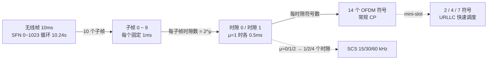

**第二步：边画边标的关键参数**

| 参数 | 取值 | 标注要点 |
|---|---|---|
| 无线帧长 | 10 ms | SFN 10 bit，0~1023，10.24 s 循环 |
| 子帧长 | 1 ms | 固定，与 μ 无关，是跨参数集对齐基准 |
| 每子帧时隙数 | 2^μ | μ=0→1 个，μ=1→2 个，μ=2→4 个 |
| 时隙长 | 1/2^μ ms | 15 kHz→1 ms；30 kHz→0.5 ms；120 kHz→0.125 ms |
| 每时隙符号数 | 14（常规 CP） | 扩展 CP 仅 60 kHz SCS 可用，为 12 个 |
| OFDM 符号长（不含 CP） | 1/SCS | 15 kHz→约 66.7 μs |
| 最小时间单位 | Tc | 1/(480 kHz×4096)≈0.509 ns |

**第三步：主动补充 TDD 配帧（拉开差距的部分）**

在图上把符号标成三类：D（Downlink，下行）、U（Uplink，上行）、F（Flexible，灵活）。然后说明典型配置方式：小区级由 SIB1 中 tdd-UL-DL-ConfigurationCommon 下发周期性图案，例如"7+3"类的 DDDSU 或 DDDDDSUUU 模式（数字表示各方向连续符号数，具体取值现网常见但不唯一，面试讲清"周期内下行偏多、上行占比通常 20%~30%"即可）。再补一句：信令可进一步用 Slot Format Indicator（SFI，时隙格式指示）通过组公共 PDCCH 把灵活符号动态指派给 UE。

**收尾话术**：画完补一句"帧结构是空口一切时序的坐标系——HARQ 时序、SR/BSR 周期、测量 gap 都挂在这套坐标系上，所以网优改帧结构会牵动大量时序参数"，把图和应用连起来。

## 关联考点

- 帧结构时间体系详解：[NR 帧结构](./02-物理层/ch02-q001-frame-structure.md)
- 参数集与子载波间隔：[Numerology](./02-物理层/ch02-q002-numerology-scs.md)
- TDD 时隙格式与配比影响：[时隙格式](./02-物理层/ch02-q004-slot-format-tdd.md)
- LTE 与 NR 帧结构对比：[帧结构差异](./01-无线基础与演进/ch01-q012-lte-nr-frame-structure-diff.md)

## 面试追问

- **30 kHz 子载波间隔下，一个无线帧有多少个时隙？符号呢？** —— 要点：每子帧 2 个时隙 × 10 子帧 = 20 时隙/帧，每时隙 14 符号 → 280 符号/帧；这类换算要能脱口而出。
- **为什么时隙长度要随参数集变，子帧却固定 1 ms？** —— 要点：子帧是跨参数集、跨信道的对齐基准（不同 SCS 的信道调度边界统一对齐子帧）；时隙变短是为了给高 SCS 载波提供更细的调度与更低时延。
- **mini-slot 和普通时隙调度有什么区别？什么场景用？** —— 要点：mini-slot 可以从任意符号开始、长度 2/4/7 符号，不必等整时隙边界，用于 URLLC 的快速抢占调度与未同步初始传输；代价是控制开销更大、与 DMRS 位置的约束更复杂。

---

# 场景与软技能 · 手撕题：画出随机接入完整流程并标注消息

> 难度：中 ｜ 频率：高

## 一句话答案

画竞争随机接入（CBRA, Contention-Based Random Access）四步流程：msg1 前导（PRACH）→ msg2 随机接入响应 RAR（PDSCH 上的 MAC 层消息）→ msg3 调度传输（PUSCH，承载 RRCSetupRequest）→ msg4 竞争解决（PDCCH 用 TC-RNTI 加扰调度，RRCSetup 下发）。每一步标注信道、RNTI（Radio Network Temporary Identifier，无线网络临时标识）和定时器是拿分关键：msg1 用 RA-RNTI 关联，msg2 在 ra-ResponseWindow 内监听，msg4 在 ra-ContentionResolutionTimer 内监听。

## 详细展开

**标准流程图（四步）**：

```
UE                                              gNB
│                                               │
│ (1) msg1: PRACH 前导                           │
│──── preamble id + RO(选波束), 功率爬升 ────────▶│
│                                               │
│   ← 在 ra-ResponseWindow 内用 RA-RNTI 盲检 PDCCH │
│ (2) msg2: RAR (PDSCH, MAC RAR)                │
│◀─── TA(定时提前) + UL grant + TC-RNTI ─────────│
│                                               │
│ (3) msg3: PUSCH (HARQ 初传, 支持重传)           │
│──── CCCH SDU: RRCSetupRequest ───────────────▶│
│     (S-TMSI 或 随机值)                         │
│                                               │
│   ← 在 ra-ContentionResolutionTimer 内用        │
│     TC-RNTI 盲检 PDCCH                         │
│ (4) msg4: 竞争解决                             │
│◀─── 回显 msg3 内容(如 RRCSetup) ───────────────│
│                                               │
│   TC-RNTI → C-RNTI, 接入成功                    │
```

同一条流程用标准时序图表达（面试白板可照此画）：

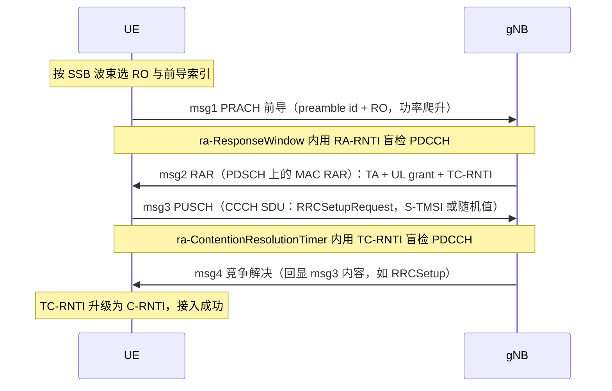

> **CFRA 分叉说明**：非竞争接入（CFRA）的前导由网络专属分配（如切换命令携带 rach-ConfigDedicated），不存在竞争，流程到 msg1 + msg2 即完成——没有 msg3/msg4，也就没有竞争解决环节。

**逐步标注要点**：

| 步骤 | 信道 | 关键内容 | 失败处理 |
|---|---|---|---|
| msg1 | PRACH | 前导索引 + RO（RACH Occasion，联合指示波束） | 无响应→功率爬升重发，超 preambleTransMax 判失败 |
| msg2 | PDCCH(RA-RNTI 加扰) + PDSCH | TA、UL grant、TC-RNTI（还可能有回退指示 BI） | 超窗未收到→回 msg1 重发 |
| msg3 | PUSCH | CCCH SDU（初始接入为 RRCSetupRequest） | 按 TC-RNTI 调度 HARQ 重传 |
| msg4 | PDCCH(TC-RNTI 加扰) + PDSCH | 回显完整 msg3 内容 | 定时器超时/内容不匹配→重发 msg3 或转 RLF |

**画图时的加分标注**：

- 在 msg1 旁标"RO 与 SSB 的映射关系：UE 按下行最佳 SSB 波束选择对应 RO/前导，gNB 由此反推下行波束"——体现波束管理联动。
- 在 msg2 旁标"TA 命令首次对齐上下行定时"——体现上行同步建立。
- 在 msg4 旁标"竞争解决逻辑：两个 UE 选同一前导时会都收到 RAR，只有 msg4 内容回显与自身 msg3 一致的 UE 才算成功，另一个退避重接"。

**可主动扩展的点**：一句话提两步接入（msgA = msg1+msg3 合并，msgB = msg2+msg4 合并，用于降低时延，适合小包场景），说明知道演进方向即可，画图仍以四步为主——四步是所有场景的基础。

## 关联考点

- 四步接入每步细节：[CBRA 四步流程](./05-关键信令流程/ch05-q007-cbra-four-step.md)
- 触发场景枚举：[RA 触发场景](./05-关键信令流程/ch05-q006-ra-trigger-scenarios.md)
- RAR 内容详解：[RAR 与 UL grant](./05-关键信令流程/ch05-q009-rar-content-ul-grant.md)
- 两步接入对比：[2-step RA](./05-关键信令流程/ch05-q011-two-step-ra.md)

## 面试追问

- **RA-RNTI 是怎么算的？为什么 msg2 不用 C-RNTI？** —— 要点：RA-RNTI 由 RO 所在的时频位置（帧号、子帧/时隙号、频域索引等）计算得出，同一 RO 上发前导的所有 UE 算出的 RA-RNTI 相同，因此都能读到 RAR——此时网络还不知道接入者是谁，只能广播；C-RNTI 要等竞争解决后才生效。
- **非竞争接入（CFRA）和这图的区别在哪？** —— 要点：CFRA 的前导由网络专属分配（如切换时的 RRC 命令携带专用 rach-ConfigDedicated），无竞争问题，流程缩到 msg1+msg2 即完成，不需要 msg3/msg4；适用于切换、波束失败恢复、SCG 添加等有 RRC 连接的场景。
- **随机接入失败的常见根因有哪些？** —— 要点：按步骤定位——msg1 无响应查覆盖/PRACH 功控/前导格式；msg2 超窗查 PRACH 误检与拥塞（回退指示高）；msg3/4 失败查上行质量与冲突率；再结合信令与 Counter 区分弱覆盖、拥塞、干扰三类根因。

---

# 场景与软技能 · 手撕题：链路预算表逐项讲解

> 难度：难 ｜ 频率：高

## 一句话答案

链路预算手撕题考两件事：一是能否默写"发射端功率与增益 − 各项损耗 − 接收端灵敏度 = 最大允许路径损耗（MAPL, Maximum Allowable Path Loss）"的完整账目并解释每项含义；二是能否说清 5G 相对 4G 新增的关键项——波束赋形增益、更大的穿透损耗与阴影余量、TDD 上行受限。口径：MAPL = EIRP − 接收灵敏度 + 接收天线增益 − 穿透/人体等损耗 − 阴影/干扰/衰落余量，通常按上行（终端→基站）计算，因为上行是覆盖瓶颈。

## 详细展开

**白板画法：先把链路预算画成一条"加加减减"的流水线**（数值与下表一致，3.5 GHz 城区上行）：

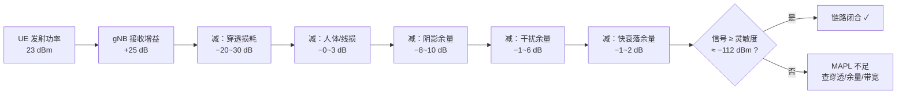

**上行链路预算总账（3.5 GHz 城区通识量级）**：

```
MAPL = EIRP_UE + G_NB(接收) − S_NB(灵敏度)
       − L_穿透 − L_人体/线损 − M_阴影 − M_干扰 − M_快衰落
```

| 项 | 典型取值 | 讲解要点 |
|---|---|---|
| UE 发射功率 | 23 dBm（PC3）/ 26 dBm（PC2） | 终端功率等级决定上行起点 |
| UE 天线增益 | ≈ 0 dBi | 终端天线增益有限 |
| gNB 接收增益 | 25 dB 量级 | 64 通道阵列增益 + 波束赋形（接收）增益，5G 特有的大项 |
| gNB 接收灵敏度 S | 约 -112 dBm 量级 | = 噪声底 + NF + 目标 SINR；噪声底 = -174 + 10lg(带宽)，随分配带宽变化 |
| 穿透损耗 | 城区浅室内 20 dB，深室内 26~30 dB | 3.5 GHz 比 2.6 GHz/1.8 GHz 更吃穿透 |
| 人体/馈线损耗 | 0~3 dB | 视场景 |
| 阴影衰落余量 | 8~10 dB | σ≈6~8，对应约 90% 边缘覆盖率；面积覆盖率口径下等效余量更低，取值与对数正态标准差和目标概率相关 |
| 干扰余量 | 1~6 dB | 按邻区负载与复用度取 |
| 快衰落余量 | 1~2 dB | 承认非理想功控与多径起伏 |

**逐项讲解的顺序与话术**：先说方向（上行受限所以算上行），再从左到右过表——每项给"是什么、为什么有、典型值怎么定"三层。重点讲两个：

1. **灵敏度**：展示公式链"噪声谱密度 -174 dBm/Hz → 加带宽得噪声底 → 加 NF（基站 2~3 dB、UE 7~9 dB 量级）→ 加解调所需 SINR → 得灵敏度"，说明目标业务（边缘速率）不同，SINR 要求不同，整张预算就变了。
2. **阴影余量与边缘覆盖率的关系**：覆盖率要求越高，余量越大，MAPL 越小，站越密——这是规划"钱"与"质量"的直接交换点。

**算完 MAPL 后的收尾（必做）**：把 MAPL 代入传播模型（如 3GPP TR 38.901 UMa）反算覆盖半径，再换算站间距（常用经验：站间距 ≈ 半径 × 1.5 量级，视扇区配置），说明"链路预算的最终产出是站高/站距，不是 dB"。

**5G 相对 4G 的三个新增讨论点**：

- 波束赋形增益按"广播波束 vs 业务波束"分别核——SSB 覆盖与业务覆盖要分别验算，广播波束增益低。
- 上下行解耦（SUL）作为上行受限的补救手段。
- 边缘速率目标显著提高（如上行 5 Mbps 起），使"上行受限"比 4G 更突出。

## 关联考点

- 链路预算完整方法：[链路预算](./07-射频与网优/ch07-q006-link-budget.md)
- 传播模型：[TR 38.901 传播模型](./07-射频与网优/ch07-q009-propagation-model-38901.md)
- 阴影余量与覆盖率：[阴影衰落余量](./07-射频与网优/ch07-q008-shadow-margin-coverage.md)
- 穿透损耗与室分：[穿透损耗](./07-射频与网优/ch07-q007-penetration-loss-indoor.md)

## 面试追问

- **为什么灵敏度里带宽影响那么大？5G 大带宽不是反而难覆盖吗？** —— 要点：噪声底随带宽线性增加（10 MHz≈-104 dBm、100 MHz≈-94 dBm 噪声底量级），带宽翻 10 倍噪声底抬 10 dB；但这主要影响全带宽接收，边缘用户只占部分 RB（Resource Block，资源块）调度，所以规划按"目标业务占用的 RB 数"算噪声底，不是全带宽——这是新手最常见的口径错误。
- **下行 EIRP 有 78 dBm 量级，为什么还说上行受限？** —— 要点：下行是"基站大功率 + 赋形增益"对"终端较差灵敏度"，上行是"终端 23/26 dBm + 无赋形"对"基站较优灵敏度"，两头都不占优；高频段路损抬升后上行先崩，故有 SUL、PC2、上行多流接收等补救技术。
- **如果把边缘覆盖率从 90% 提到 95%，站间距变化方向和量级？** —— 要点：阴影余量约增加 2~3 dB（取决于标准差），MAPL 等量缩小，按传播模型斜率（城区约 35~40 dB/decade 量级）折算半径缩小约 15%~20%，站数增加约三成量级——给出方向 + 大致量级即可，关键是展示"余量→半径→站数"的传导链。

---

# 场景与软技能 · 手撕题：香农公式与频谱效率估算

> 难度：难 ｜ 频率：中

## 一句话答案

香农容量公式 C = B × log₂(1 + S/N)：信道容量等于带宽乘以以信噪比为变量的对数项。手撕题通常给信噪比（SNR, Signal-to-Noise Ratio）求频谱效率，核心两个换算要熟练：SNR 从线性值换 dB（10lg）再换回来（10^(dB/10)），以及"频谱效率 = log₂(1+SNR) bit/s/Hz"。典型锚点值要背：SNR=0 dB → 1 bit/s/Hz，10 dB → 约 3.46，20 dB → 约 6.66，30 dB → 约 10。

## 详细展开

**白板画法：一条容量链 + 一张 SNR↔频谱效率对照**：

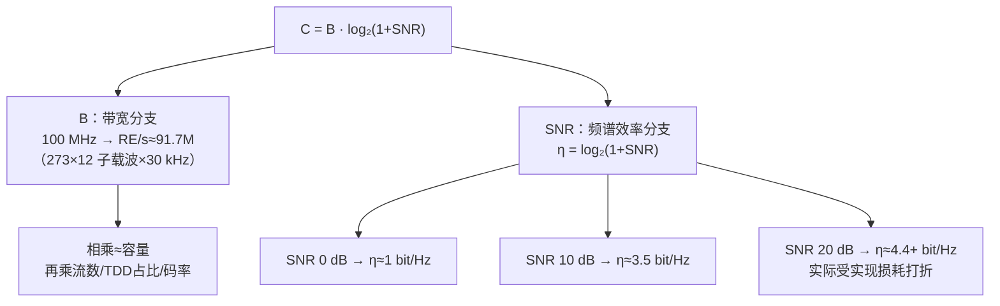

**公式与单位**：

```
C = B · log₂(1 + S/N)

C: 信道容量 (bit/s)
B: 带宽 (Hz)
S/N: 线性信噪比（功率比）
频谱效率 η = C/B = log₂(1 + SNR)   单位 bit/s/Hz
```

**三步解题模板**：

1. **统一口径**：把 dB 换回线性值——SNR(dB) = 10·lg(S/N)，反向 S/N = 10^(SNR_dB/10)。
2. **代入公式**：算 log₂(1 + SNR)。手算技巧：log₂x = lg x ÷ lg 2 = lg x ÷ 0.301。
3. **回到速率**：速率 = 频谱效率 × 带宽；若问 MIMO，再乘层数（理想条件下 C = B·log₂(1+SNR) 按每层独立信道近似，面试讲清"层数乘的是并行独立信道数"即可）。

**典型算例（面试最常给的两道）**：

- **算例 1**：SNR = 20 dB，带宽 100 MHz，求峰值速率量级。
  20 dB → 线性 100 → log₂(101) ≈ 6.66 bit/s/Hz → 100 MHz × 6.66 ≈ 666 Mbit/s（单层）。
- **算例 2**：目标频谱效率 7.4 bit/s/Hz（近似 256QAM 高码率的量级），求所需 SNR。
  2^7.4 ≈ 169 → SNR ≈ 168 → 约 22.3 dB。反过来记住：256QAM 满速率大约需要 20 dB 出头的 SINR 量级。

**必背锚点表**：

| SNR (dB) | 线性值 | 频谱效率 (bit/s/Hz) |
|---|---|---|
| 0 | 1 | 1.00 |
| 3 | 2 | 1.58 |
| 10 | 10 | 3.46 |
| 20 | 100 | 6.66 |
| 30 | 1000 | 9.97 |

**讲完公式后的加分点（体现"懂通信"而非"会计算"）**：

1. **对数律的工程含义**：低 SNR 区每 3 dB 信噪比增益约换来 1 bit/s/Hz（近似线性区），高 SNR 区每 3 dB 只换来不到 0.5 bit/s/Hz——高阶调制高码率的边际收益递减，这解释了 1024QAM 只在近点小范围有效。
2. **实际系统达不到香农极限的原因**：有限码长、实际信道估计误差、HARQ/重传开销、控制开销（PDCCH/参考信号）、实现损失（EVM）等；现网下行平均频谱效率通常在 2~4 bit/s/Hz 量级（视负载），距理论值有折损。
3. **与 MIMO 结合**：多天线把容量变成 log₂(1+SNR) 乘以独立层数（和/或空分复用增益），这是 NR 用 massive MIMO 提频谱效率的信息论依据。

## 关联考点

- 256QAM/1024QAM 对 SINR 的要求：[高阶调制要求](./03-MIMO与波束管理/ch03-q025-1024qam-requirements.md)
- MIMO 容量增益推导：[MIMO 容量](./03-MIMO与波束管理/ch03-q030-mimo-capacity-gain.md)
- 频谱效率与 KPI 的关系：[射频 KPI 体系](./07-射频与网优/ch07-q003-rf-kpis-evm-aclr-spurious.md)

## 面试追问

- **SNR 和 SINR 有什么区别，容量公式该用哪个？** —— 要点：SNR 只考虑噪声，SINR 还要计入干扰（I）；香农公式原始形式针对单链路噪声信道，用 SNR；现网是干扰受限系统，评估实际可达速率时把公式里的 N 换成 (I+N)，用 SINR 代入更接近真实。
- **带宽翻倍、功率不变，容量怎么变？** —— 要点：噪声功率也随带宽翻倍，SNR 减半（-3 dB），容量 C = 2B·log₂(1+SNR/2) > 原容量——带宽带来的收益是"线性乘 + 对数减"的净增益，弱 SNR 区净增益接近翻倍，说明扩频谱比加功率更划算（也是 5G 上大带宽的信息论依据）。
- **现网频谱效率为什么远低于理论值？主要折损在哪几项？** —— 要点：按开销列——控制信道与参考信号开销（约两成量级）、有限码长与码率格栅、信道估计误差与 EVM、HARQ 重传损耗、切换/空洞；把"理论→实测"的折算讲清楚比精确数字更重要。

---

# 场景与软技能 · 开放题：为什么 NR 数据信道选择 LDPC 码

> 难度：中 ｜ 频率：中

## 一句话答案

数据信道选 LDPC（Low-Density Parity-Check，低密度奇偶校验）码，根本原因是它满足 5G 数据信道的三条硬约束：大码块下吞吐极高（译码天然并行）、码长码率灵活可变（一套基础图覆盖所有业务）、HARQ 增量冗余配合高效。对照 4G 的 Turbo 码：其译码串行依赖强、并行化困难，成为高吞吐低时延的瓶颈，这是换码的直接动因。

## 详细展开

**答题框架：从需求反推选型（比背结论高一档）**

先立需求：5G 数据信道要同时服务 eMBB 的 10 Gbps 量级峰值、URLLC 的短包低时延、大范围码长码率的灵活调度。再看候选方案的匹配度。

**LDPC 胜出的四个理由**：

1. **并行译码 → 高吞吐**：LDPC 基于稀疏校验矩阵做置信传播，变量节点/校验节点消息传递互相独立，可用大规模并行硬件实现数十 Gbps 译码吞吐；Turbo 的 MAP 译码沿码字序列滑动、前后向度量互相依赖，并行化代价高——这是最核心的一条。
2. **一套结构覆盖全场景 → 协议简洁**：NR 用两张基础图（BG1 面向大码块高码率、BG2 面向小码块低码率）+ 提升（lifting）因子缩放 + 打孔/重复完成速率匹配，一套机制覆盖从几十比特到 8448 比特码块、1/5 到 8/9 码率，无需 Turbo 那样为不同码率设计复杂的删余图案。
3. **增量冗余 HARQ 天然友好**：不同冗余版本（RV0~RV3）对应校验位不同的读取起点，重传只发增量校验比特，接收端软合并增益随重传累积，与 NR 异步自适应 HARQ 完美配合。
4. **时延与功耗**：并行度高、单轮迭代时延低、迭代收敛快，对终端功耗和 URLLC 时延都友好。

**为什么不是其他候选**：

- **Turbo 码**：短中码块性能不差，但吞吐/并行度/功耗三条全输，且速率匹配不优雅。
- **Polar 码**：短码块性能逼近容量极限、赢控制信道，但长码下 SCL（Successive Cancellation List，串行消除列表）译码的串行度随码长增长，吞吐上不去，所以分工给了控制信道——"长码 LDPC、短码 Polar"按码长分段是整个选型的设计哲学。
- **卷积码**：长码性能差距明显，只在高可靠小 redundancy 场景（如部分反复编码）保留。

**收尾升华**：通信设计里"选型 = 需求 → 结构特性 → 硬件可实现性"的匹配过程，LDPC 赢在"结构化稀疏"恰好同时命中并行吞吐与灵活速率匹配两个需求——这也是它 60 年代提出、经 WiFi/5G 等标准反复验证的原因。

## 关联考点

- LDPC 与 Polar 的分工：[LDPC 与 Polar 码](./01-无线基础与演进/ch01-q013-ldpc-polar-codes.md)
- 三大场景对编码的需求：[三大场景](./01-无线基础与演进/ch01-q002-three-scenarios-embb-urllc-mmtc.md)
- HARQ 与编码配合：[HARQ 过程](./04-空口协议栈/ch04-q019-harq-process.md)

## 面试追问

- **BG1 和 BG2 怎么选？** —— 要点：按传输块大小与目标码率分界——大码块/高码率走 BG1（支持大提升因子、高吞吐），小码块/低码率走 BG2（短码块性能更好）；记住"大图大块高码率、小图小块低码率"的口诀即可。
- **LDPC 的"低密度"具体指什么，带来什么好处？** —— 要点：校验矩阵中非零元素占比极低（每行/列只有少量非零），矩阵稀疏使校验节点和变量节点的连接度低——译码消息传递的计算量与密度成正比，稀疏才能硬件并行；且稀疏结构可用基础图 + 循环移位扩展，节省协议描述与存储。
- **URLLC 短包场景为什么不用 Polar 而仍用 LDPC？** —— 要点：URLLC 数据包虽短，但并非所有短包都归 Polar——Polar 在 NR 中主要用于控制信道；数据信道的短包走 BG2 + 小提升因子的 LDPC，性能已足够，且保持数据信道编码体系统一（避免双编码器复杂度）；同时 Polar 最优区间在几十到几百比特的控制信令。

---

# 场景与软技能 · 开放题：为什么需要毫米波与 sub-6GHz 搭配组网

> 难度：中 ｜ 频率：中

## 一句话答案

sub-6GHz（FR1）覆盖好、移动性强，但频谱资源有限、容量天花板明显；毫米波（FR2）带宽极大（单载波最高 400 MHz）、易获得连续大频谱，但路损大、穿透差、覆盖只有数百米量级。两者互补而非替代：sub-6GHz 做"广覆盖 + 移动基底"，毫米波做"热点容量 + 低时延增强"，搭配组网才能同时满足覆盖与容量两个目标——这也是很多市场 FR2 与 FR1 同站址或分层部署的原因。

## 详细展开

**答题框架：先摆两者的物理特性差异，再推组网结论**

**第一步：频段物理特性对比**

| 维度 | sub-6GHz（FR1，如 3.5 GHz） | 毫米波（FR2，如 26/28/39 GHz） |
|---|---|---|
| 可用带宽 | FR1 单载波最高 100 MHz | 单载波最高 400 MHz |
| 路径损耗 | 相对小 | 频率高一个量级，自由空间路损约多 20 dB |
| 穿透/绕射 | 穿透尚可，绕射较好 | 穿透差（墙体几乎阻断），绕射弱，人体遮挡明显 |
| 覆盖半径 | 数百米到公里级 | 数百米量级（密集热点） |
| 移动性 | 好，适合连续组网 | 波束细、易失锁，适合低速/静止热点 |
| 器件成本 | 成熟 | 高频器件、大数量天线单元成本高 |

**第二步：推结论——单独用谁都有硬伤**

- **只有 sub-6GHz**：3.5 GHz 连续频谱通常只有 100~160 MHz 量级，热点区域（体育场、商圈、交通枢纽）用户密度高，容量不够；且无法体现 5G 峰值速率优势。
- **只有毫米波**：覆盖要达到同等面积需要极密的站址，穿透一堵墙信号即断崖，室内基本要靠室分/专用的毫米波小站，连续广域组网在经济上不可行；移动场景波束管理开销大。

**第三步：搭配组网的三种典型形态**

1. **分层网（overlay/underlay）**：FR1 做覆盖层承载控制面与移动性，FR2 做容量层在热点叠加，双连接（NR-NR DC）或载波聚合把两者绑在一起，数据面在毫米波可用时走 FR2。
2. **同站异频**：同一站点 AAU（Active Antenna Unit，有源天线单元）同时配置 FR1 与 FR2 射频通道，毫米波借用 sub-6GHz 的站址资源，节省选址成本。
3. **场景化部署**：毫米波优先用于室内热点（配合室分）、固定无线接入（FWA）、工业专网等可控场景——这也是毫米波现网落地最多的三类场景。

**第四步：升华**——这题的底层逻辑是"电波传播特性由频率决定，网络架构是物理规律的补偿"：毫米波牺牲覆盖换带宽，网络就用密集部署、波束赋形、高低频协同来补覆盖；sub-6GHz 牺牲容量换覆盖，就用 mMIMO、载波聚合来补容量。能讲到这层，说明理解的是方法论而不是结论。

**中国现网补充**：国内运营主体在 FR1（2.6/3.5/4.9 GHz）规模建网，FR2 毫米波处于试验/预商用推进阶段；海外（北美、日本、韩国）毫米波已规模商用——面试可按求职地调整表述。

## 关联考点

- FR1/FR2 频段定义：[FR1 与 FR2](./01-无线基础与演进/ch01-q009-fr1-fr2-bands.md)
- 三大场景与频段选择：[三大场景](./01-无线基础与演进/ch01-q002-three-scenarios-embb-urllc-mmtc.md)
- 载波聚合与双连接：[CA 与 DC](./01-无线基础与演进/ch01-q011-ca-vs-dc.md)
- 高频覆盖问题的网优视角：[穿透损耗](./07-射频与网优/ch07-q007-penetration-loss-indoor.md)

## 面试追问

- **毫米波穿透差到什么程度？有哪些补救手段？** —— 要点：典型混凝土墙穿透损耗 30~40 dB 量级，人体遮挡 10~20 dB；补救靠密集小站 + 室分专覆盖、波束赋形（大阵列补偿路损）、多波束冗余与快速波束恢复，以及与 FR1 的双连接兜底（FR2 丢锁时业务回落 FR1）。
- **为什么说毫米波更适合 FWA？** —— 要点：固定无线接入的接收端（CPE）位置固定、可用室外定向高增益天线，规避了移动性和人体遮挡两大短板，只保留"大带宽、易部署（无需开挖）"的优点，是毫米波投入产出比最高的场景。
- **如果 6G 出现更高频段（如太赫兹），这题的逻辑还成立吗？** —— 要点：成立且更极端——频率越高"带宽大/覆盖差"的 trade-off 越尖锐，必然是"低频打底 + 高频按需叠加"的分层结构，区别只在叠加的粒度（从小区级走向更细的场景级/链路级协同）；体现可迁移的方法论。

---

# 场景与软技能 · 开放题：5G 如何支撑低时延（端到端全链路分析）

> 难度：难 ｜ 频率：高

## 一句话答案

低时延不是单点技术，而是端到端全链路的系统工程：空口侧用灵活参数集（大子载波间隔、短时隙）、mini-slot 快速调度、HARQ 快速反馈（K1/K0 时序可配）、预调度与免授权（Configured Grant，配置授权）压时延；无线架构侧用 CU/DU 分离与功能下沉缩短处理路径；传输与核心网侧用 UPF（User Plane Function，用户面功能）下沉 + MEC（Multi-access Edge Computing，多接入边缘计算）本地分流、网络切片保障资源。每段链路砍掉一段时延，加起来才到毫秒级目标。

## 详细展开

**端到端时延的分段账本（URLLC 目标空口 1 ms 量级、端到端数 ms~10 ms 量级）**：

```
UE 处理 → 空口上行 → gNB 处理 → 传输网 → 核心网/UPF → 应用服务器
```

**① 空口侧（贡献最大、面试重点）**：

- **更短的时间单元**：子载波间隔 15×2^μ kHz，μ 越大时隙越短（30 kHz → 0.5 ms，120 kHz → 0.125 ms），调度粒度直接变细；mini-slot（2/4/7 符号）不必等整时隙，来了就发。
- **自包含时隙与快速反馈**：同一时隙内完成"下行数据 + 上行 ACK"的快速 HARQ 反馈；PDSCH→ACK 的 K1、调度→PUSCH 的 K0/K2 时序协议允许可配的最小值（符号级），处理时延能力（capability）按 UE 能力协商。
- **免调度接入**：上行配置授权（CG，Configured Grant）让 URLLC 终端周期性/事件性直接发数据，省掉"SR→UL grant"的调度往返（一步时延通常是毫秒级的大头）。
- **抢占机制**：eMBB 大包传输中，URLLC 小包可通过抢占指示（DCI 2-1 携带的 INT-RNTI）通知 UE 数据被"打洞"，高优先级业务无需等时隙边界。
- **重复与高可靠配合**：PUCCH/PUSCH 多次重复、多 TRP（Transmission/Reception Point，收发点）发送，用冗余换可靠性，同时通过更早的首次传输保时延。

**② 无线架构侧**：

- CU/DU 分离后 DU 靠近射频部署（时延敏感的 MAC/PHY 本地闭环），CU 集中（非实时功能上收）；RRU-AAU 化减少模拟段处理。
- 交叉时隙干扰控制、帧结构上行占比调整（如为工业场景配置更多 U 时隙）缓解上行时延。

**③ 传输与核心网侧**：

- **UPF 下沉**：用户面功能部署到地市/园区级，数据不再绕行省中心，单程传输时延从数十 ms 压到个位数 ms。
- **MEC 本地算力**：应用服务器与 UPF 同址，业务闭环在边缘完成（如工业控制、云游戏）。
- **切片与 TSN 协同**：URLLC 切片预留资源（GBR 类 5QI、优先级调度），传输网切片保障承载确定性，工业场景与时间敏感网络（TSN）对接。

**答题收尾话术**："空口砍调度往返、架构砍处理跳数、核心网砍传输距离、切片砍资源竞争——四个'砍'叠起来，才把端到端时延压进 URLLC 的目标区间。单说某一个点（比如只说大子载波间隔）是不完整的。"

## 关联考点

- mini-slot 与短时隙调度：[mini-slot](./02-物理层/ch02-q006-mini-slot-urllc.md)
- 配置授权与免调度：[SR 与配置授权](./04-空口协议栈/ch04-q015-sr-config-trigger.md)
- CU/DU 分离：[gNB CU/DU](./06-组网与架构/ch06-q001-gnb-cu-du-split.md)
- UPF 下沉与 MEC：[UPF 部署](./06-组网与架构/ch06-q005-upf-position-deployment.md)

## 面试追问

- **URLLC 和 eMBB 在同一载波上怎么共存？** —— 要点：空分（不同波束）+ 时域抢占（URLLC 用 mini-slot 打断 eMBB 长包，发 INT 指示让 eMBB 接收端放弃被打洞的码块组）+ 频域预留资源；核心思想是"高优先级业务不等边界，低优先级业务事后补偿（重传被抢占部分）"。
- **毫秒级时延里，传输网和空口各占多少？优化先动哪边？** —— 要点：量级上远距离传输（省中心往返）往往是最大头（数十 ms），所以先看 UPF/MEC 部署位置；空口时延受帧结构与调度往返主导（1~数 ms），优化靠免调度与更短时序；先测分段时延再对症下药，这是工程化答法。
- **时延和可靠性为什么是 trade-off？NR 怎么同时要？** —— 要点：重传提可靠但加时延，高码率降时延但损可靠；NR 的解法是解耦——用重复/分集（多 TRP、多时隙重复）换可靠性而不加"等待重传"时延，用免调度与短时序砍掉固有往返，即"用空间冗余换时间冗余"。

---

# 场景与软技能 · 开放题：网络切片如何保证隔离性

> 难度：难 ｜ 频率：中

## 一句话答案

网络切片的隔离性靠"四层隔离"保证：标识与选择隔离（S-NSSAI 唯一标识切片，NSSF 按切片选网元）、网元隔离（不同切片可用不同的 AMF/SMF/UPF 实例，控制面服务按切片订阅）、资源隔离（无线侧 QoS 流与优先级调度、承载网切片、UPF 独立部署）、运维与安全隔离（独立管理、独立鉴权策略）。核心思想：逻辑上共享一张物理网，运营上互不可见——隔离深度按行业需求分级，从纯 QoS 隔离到"物理独享"可定制。

## 详细展开

**先立框架：切片是什么、隔离为什么是关键问题**

切片是把一张物理网络"虚拟"成多张端到端逻辑网络，各面向不同业务（eMBB、URLLC、专网）。共享带来成本优势，但共享必然引入"邻居干扰"问题——一个切片的突发流量/故障不能影响另一个切片，这就是隔离性要解决的核心。

**四层隔离机制逐层展开**：

| 层次 | 机制 | 说明 |
|---|---|---|
| ① 标识与选择 | S-NSSAI（Single Network Slice Selection Assistance Information，单网络切片选择辅助信息）= SST + SD | UE 通过 NSSAI 指示签约切片，NSSF（Network Slice Selection Function）据此选择服务该切片的 AMF 实例与网络切片实例，从入口就分流 |
| ② 核心网网元 | 控制面按切片选择/部署，用户面 UPF 独立 | 不同切片可共享 AMF（控制面共享是常态）但用独立 SMF/UPF 实例；高隔离需求切片可整组网元独享，会话与上下文物理隔离 |
| ③ 无线与承载资源 | 无线侧：5QI 驱动的 QoS 流隔离 + 专用调度优先级（如 NR 的切片级准入与资源预留机制）；承载网：FlexE/VPN 硬隔离或 QoS 软隔离 | 无线是共享最重的一段，隔离靠"资源预留 + 优先级 + 准入控制"组合，Rel-16+ 引入切片感知的调度与拥塞控制增强；承载网用 FlexE 时隙隔离可达近似物理隔离 |
| ④ 运维与安全 | 独立的切片级监控/告警/SLA，独立鉴权与数据面安全 | 切片作为可运营单元独立计费、独立 SLA 承诺；行业切片可要求独立签约数据与安全策略 |

**按隔离强度分级（回答的加分结构）**：

- **软隔离**：共享网元 + QoS 区分——成本低，适合普通 eMBB 与物联业务。
- **中度隔离**：共享控制面 + 独立用户面（UPF 独享）+ 承载网 VPN——适合一般行业专网。
- **硬隔离**：网元/频谱/承载时隙物理独享——适合电网差动保护、轨道交通等高安全场景。

**端到端视角的关键点**：切片隔离是"无线 + 承载 + 核心网"三段联动，短板在最弱一段——无线共享度最高、最难硬隔离，所以"无线是否参与切片隔离"常是行业客户追问的重点；现网常用手段是小区级资源预留、专用载波（不同频段独立小区）来补齐无线段的硬隔离。

**收尾话术**："隔离性的本质是'共享程度'的取舍——从纯 QoS 到物理独享是一条连续光谱，方案按客户 SLA 与付费意愿选，而不是越硬越好。"

## 关联考点

- S-NSSAI 结构：[S-NSSAI](./06-组网与架构/ch06-q009-snssai-structure.md)
- 切片选择与 NSSF：[切片选择](./06-组网与架构/ch06-q010-slice-selection-nssf.md)
- 5QI 与 QoS 框架：[切片与 5QI](./06-组网与架构/ch06-q011-slice-5qi-qos.md)
- QoS 流到 DRB 的映射：[QoS 流与 DRB](./06-组网与架构/ch06-q013-qos-flow-drb-session.md)

## 面试追问

- **两个切片可以共享同一个 AMF 吗？什么情况下不共享？** —— 要点：可以且常见——控制面共享 AMF、按 S-NSSAI 关联不同网络切片实例是成本最优解；不共享的情况：行业客户要求独立信令面（安全/合规）、切片 SST 差异极大（如高安全专网），此时部署专用 AMF 实例，但仍同属一张 PLMN。
- **无线侧怎么防止切片 A 的用户把资源吃光影响切片 B？** —— 要点：组合拳——切片级准入控制（负载高时拒绝新接入或转其他频率/切片）、切片级最小资源预留（保障带宽下限）、按切片优先级的调度权重、负载超限时跨切片负载迁移；极端需求用专用频率小区实现物理隔离。
- **切片之间用户漫游/切换时上下文怎么隔离？** —— 要点：UE 签约的 S-NSSAI 决定可选切片，跨切片移动本质是"目标侧不存在该切片服务能力则业务不可用"；同一切片内切换沿用切片上下文，跨切片业务切换要经注册/NSSAA 等流程重选，控制面信息按切片隔离存储，避免跨切片上下文泄漏。

---

# 场景与软技能 · 高频英文术语中英对照（一）：接入与移动性

> 难度：易 ｜ 频率：高

## 一句话答案

接入与移动性是外企/标准组织面试和现网英文文档中术语密度最高的领域之一，高频词分四组：接入流程类（RACH、RAR、Contention Resolution）、移动性事件类（Handover、Measurement Event、Reestablishment）、RRC 状态类（RRC_CONNECTED/INACTIVE/IDLE）、标识类（C-RNTI、TC-RNTI、5G-S-TMSI、RNA）。背熟"全称 + 缩写 + 一句话含义"，做到听到缩写 1 秒内反应出中文。

## 详细展开

**① 接入流程类**：

| 英文 | 缩写 | 中文规范名 |
|---|---|---|
| Random Access Channel | RACH | 随机接入信道 |
| Random Access Preamble | — | 随机接入前导 |
| Random Access Response | RAR | 随机接入响应 |
| RACH Occasion | RO | 随机接入时机 |
| Contention-Based Random Access | CBRA | 基于竞争的随机接入 |
| Contention-Free Random Access | CFRA | 免竞争随机接入 |
| Contention Resolution | — | 竞争解决 |
| Timing Advance | TA | 定时提前 |
| Backoff Indicator | BI | 回退指示 |
| Two-step Random Access | — | 两步随机接入（msgA/msgB） |

**② 移动性与测量类**：

| 英文 | 缩写 | 中文规范名 |
|---|---|---|
| Handover | HO | 切换 |
| Measurement Gap | — | 测量间隙 |
| Measurement Report | MR | 测量报告 |
| Reference Signal Received Power | RSRP | 参考信号接收功率 |
| Reference Signal Received Quality | RSRQ | 参考信号接收质量 |
| Signal-to-Interference plus Noise Ratio | SINR | 信干噪比 |
| Measurement Event A1~A6 / B1~B2 | — | 测量事件（A 系列服务小区/同频邻区，B 系列异系统） |
| Conditional Handover | CHO | 条件切换 |
| RRC Reestablishment | — | RRC 重建 |
| Radio Link Failure | RLF | 无线链路失败 |
| Beam Failure Detection / Recovery | BFD/BFR | 波束失败检测/恢复 |

**③ RRC 状态与连接管理类**：

| 英文 | 缩写 | 中文规范名 |
|---|---|---|
| RRC_CONNECTED / INACTIVE / IDLE | — | RRC 连接态/非激活态/空闲态 |
| Radio Network Temporary Identifier | RNTI | 无线网络临时标识（前缀分类：C-小区级、TC-临时、RA-随机接入） |
| 5G S-Temporary Mobile Subscription Identity | 5G-S-TMSI | 5G 全球唯一临时标识（寻呼用） |
| RAN-based Notification Area | RNA | 基于 RAN 的通知区（INACTIVE 态移动性范围） |
| Connection Reconfiguration | — | 连接重配置 |
| Suspension / Resume | — | 挂起/恢复（INACTIVE 转换） |

**记忆方法**：按"一次完整移动过程"串记——UE 在 IDLE 收到 Paging（寻呼）→ 发起 RACH → 拿 RAR（TA + TC-RNTI）→ msg4 竞争解决升 C-RNTI → CONNECTED 下测量 Gap 中做 MR → 满足 Event A3 触发 HO → 失败走 RLF → Reestablishment → 闲时 suspend 进 INACTIVE（RNA 移动）→ Resume。能把这条故事线用双语讲顺，比孤立背词表牢固得多。

## 关联考点

- 四步随机接入流程（术语场景）：[CBRA 四步流程](./05-关键信令流程/ch05-q007-cbra-four-step.md)
- 测量事件体系：[A1~A6 事件](./05-关键信令流程/ch05-q020-events-a1-a6.md)
- RRC 三状态：[RRC 状态](./04-空口协议栈/ch04-q021-rrc-three-states.md)
- 切换完整流程：[Xn 切换](./05-关键信令流程/ch05-q023-xn-handover-procedure.md)

## 面试追问

- **C-RNTI、TC-RNTI、RA-RNTI 有什么区别？** —— 要点：RA-RNTI 按 RACH 时机时频位置算出，用于 msg2 盲检（同 RO 的 UE 共享）；TC-RNTI 是 RAR 分配的临时标识，用于 msg3/msg4 阶段；C-RNTI 是小区级正式标识，竞争解决成功后由 TC-RNTI 升级而来，用于后续所有专用调度。
- **RSRP/RSRQ/SINR 各自在什么决策里用？** —— 要点：RSRP 衡量覆盖强度，用于小区选择/重选与切换判决；RSRQ 反映"强度+干扰"的复合质量，用于负载均衡与异频切换；SINR 直接决定可达速率，用于链路自适应评估。三者的英文全称必须能脱口而出。
- **RLF 和切换失败（HOF）是什么关系？** —— 要点：切换失败是 RLF 的常见诱因之一（T310 超时等），RLF 后 UE 走 RRC 重建或回 IDLE；英文场景能说清"HO failure → RLF → reestablishment / fallback"这条链即达标。

---

# 场景与软技能 · 高频英文术语中英对照（二）：物理层与射频

> 难度：易 ｜ 频率：高

## 一句话答案

物理层与射频的英文术语分四组：帧结构类（Numerology、Slot、CP）、信道与信号类（SSB、PDCCH/PDSCH/PUCCH/PUSCH、DMRS/CSI-RS/SRS）、天线与波束类（MIMO、Beamforming、QCL、TCI）、射频指标类（EVM、ACLR、Sensitivity、EIRP）。物理层术语的特点是"缩写即身份"——面试和文档中几乎只说缩写，但被问"SSB 是什么"时必须能给出全称同步/信号块（Synchronization Signal Block）。

## 详细展开

**① 帧结构与参数集类**：

| 英文 | 缩写 | 中文规范名 |
|---|---|---|
| Numerology | μ | 参数集（决定子载波间隔 15×2^μ kHz） |
| Subcarrier Spacing | SCS | 子载波间隔 |
| Cyclic Prefix | CP | 循环前缀 |
| Slot / Mini-slot | — | 时隙 / 迷你时隙 |
| System Frame Number | SFN | 系统帧号 |
| Bandwidth Part | BWP | 带宽部分 |
| Slot Format Indicator | SFI | 时隙格式指示 |

**② 物理信道与参考信号类**：

| 英文 | 缩写 | 中文规范名 |
|---|---|---|
| Synchronization Signal / PBCH Block | SSB | 同步信号/广播信道块 |
| Primary / Secondary Synchronization Signal | PSS/SSS | 主/辅同步信号 |
| Physical Broadcast Channel | PBCH | 物理广播信道 |
| PDCCH / PDSCH | — | 物理下行控制/共享信道 |
| PUCCH / PUSCH | — | 物理上行控制/共享信道 |
| Physical Random Access Channel | PRACH | 物理随机接入信道 |
| Demodulation Reference Signal | DMRS | 解调参考信号 |
| Channel State Information RS / Sounding RS | CSI-RS/SRS | 信道状态信息参考信号/探测参考信号 |
| Phase Tracking RS | PT-RS | 相位跟踪参考信号（FR2 用） |
| Downlink Control Information | DCI | 下行控制信息 |
| Transport Block / Code Block | TB/CB | 传输块/码块 |
| Resource Block | RB | 资源块（频域 12 个子载波） |

**③ 天线与波束类**：

| 英文 | 缩写 | 中文规范名 |
|---|---|---|
| Multiple Input Multiple Output | MIMO | 多输入多输出 |
| Beamforming / Beam Management | — | 波束赋形 / 波束管理 |
| Quasi Co-Location | QCL | 准共址（Type A/B/C/D） |
| Transmission Configuration Indicator | TCI | 传输配置指示 |
| Rank Indication / Precoding Matrix Indicator | RI/PMI | 秩指示/预编码矩阵指示 |
| Layer | — | 层（空分复用流数） |
| Active Antenna Unit | AAU | 有源天线单元 |
| Massive MIMO | — | 大规模 MIMO（如 64T64R） |

**④ 射频指标类**：

| 英文 | 缩写 | 中文规范名 |
|---|---|---|
| Error Vector Magnitude | EVM | 误差矢量幅度（调制质量） |
| Adjacent Channel Leakage power Ratio | ACLR | 邻道泄漏功率比 |
| Spurious Emission | — | 杂散辐射 |
| Equivalent Isotropic Radiated Power | EIRP | 等效全向辐射功率 |
| Receiver Sensitivity | — | 接收灵敏度 |
| Noise Figure | NF | 噪声系数 |
| Out-of-Band Emission | — | 带外辐射 |

**记忆方法**：物理层术语按"一个时隙里发生了什么"串记——PDCCH 调度（DCI）→ PDSCH 传数据（DMRS 解调）→ UE 用 PUCCH 反馈（HARQ-ACK/CSI）→ 上行 PUSCH 携带 SRS 供波束管理 → 全程靠 SSB 同步。射频指标按"一台 AAU 的出厂测试"记——EVM 管调制质量、ACLR 管邻道、杂散管远端、灵敏度管接收。串成场景记忆比单词表高效。

## 关联考点

- SSB 组成与扫描：[SSB 组成](./02-物理层/ch02-q010-ssb-composition.md)
- 参考信号体系：[PDSCH DMRS](./02-物理层/ch02-q024-pdsch-dmrs-mapping-type.md)
- QCL 与 TCI：[QCL 类型](./03-MIMO与波束管理/ch03-q007-qcl-types.md)
- 射频 KPI 详解：[射频 KPI](./07-射频与网优/ch07-q003-rf-kpis-evm-aclr-spurious.md)

## 面试追问

- **SSB 的全称和组成？** —— 要点：Synchronization Signal / PBCH block，同步信号/广播信道块，四个连续符号内依次为 PSS（符号 0）、SSS（符号 2）、PBCH+PBCH DMRS（符号 1、3）；用于小区搜索、同步与 MIB 接收——全称与频域位置一起说更完整。
- **DMRS、CSI-RS、SRS 各自的作用方向？** —— 要点：DMRS 是"专属解调"（跟数据同波束同预编码，接收端估信道用）；CSI-RS 是"下行测量"（UE 测 CSI、波束、跟踪）；SRS 是"上行探测"（gNB 测上行信道，TDD 借信道互易性推下行波束）。方向相反、用途互补。
- **EVM 差会导致什么现象？** —— 要点：EVM 直接映射到调制星座图的散点扩散，过大导致高阶调制（256QAM/1024QAM）解调误码率上升，表现为"信号强但速率上不去/回落到低阶调制"——射频指标与用户感知的联动是加分点。

---

# 场景与软技能 · 高频英文术语中英对照（三）：核心网与业务

> 难度：易 ｜ 频率：中

## 一句话答案

核心网与业务术语分四组：网元类（AMF、SMF、UPF、PCF、NSSF、UDM）、架构类（SBA、N1~N6 接口、PDU Session、Network Slice）、业务与 QoS 类（5QI、GBR、QoS Flow、DNN、MEC）、演进与语音类（EPS Fallback、VoNR、N26）。核心网术语的面试特征是"缩写承载角色"——说 AMF 必须能展开 Access and Mobility Management Function（接入与移动性管理功能），并说清它管什么、不管什么。

## 详细展开

**① 核心网网元类**：

| 英文 | 缩写 | 中文规范名 | 一句话职责 |
|---|---|---|---|
| Access and Mobility Management Function | AMF | 接入与移动性管理功能 | 注册、连接管理、移动性、NAS 信令终结 |
| Session Management Function | SMF | 会话管理功能 | PDU 会话建立/修改、IP 分配、UPF 选择 |
| User Plane Function | UPF | 用户面功能 | 数据面锚点、路由转发、QoS 执行 |
| Policy Control Function | PCF | 策略控制功能 | 下发 QoS/计费策略 |
| Network Slice Selection Function | NSSF | 网络切片选择功能 | 按 NSSAI 选择服务的切片/AMF |
| Unified Data Management | UDM | 统一数据管理 | 签约数据、鉴权凭证（配合 AUSF 鉴权服务功能） |
| Network Repository Function | NRF | 网络存储功能 | 网元注册与发现（SBA 的"通讯录"） |
| Network Exposure Function | NEF | 网络开放功能 | 能力对外开放（第三方调用） |

**② 架构与接口类**：

| 英文 | 缩写 | 中文规范名 |
|---|---|---|
| Service-Based Architecture | SBA | 服务化架构 |
| PDU Session | — | PDU 会话（UE 与 DN 间的连接） |
| Data Network Name | DNN | 数据网络名称（相当于 4G 的 APN） |
| Network Slice Selection Assistance Information | NSSAI / S-NSSAI | 网络切片选择辅助信息/单网络切片选择辅助信息 |
| Next Generation (interface) | N1~N6 | N1（UE-AMF）、N2（gNB-AMF）、N3（gNB-UPF）、N4（SMF-UPF）等 |
| Xn interface | Xn | gNB 间接口 |
| Multi-access Edge Computing | MEC | 多接入边缘计算 |

**③ 业务与 QoS 类**：

| 英文 | 缩写 | 中文规范名 |
|---|---|---|
| 5G QoS Identifier | 5QI | 5G QoS 标识（标量索引，映射时延/丢包等特性） |
| Guaranteed Bit Rate | GBR | 保证比特速率（及其扩展 GBRLINK 等） |
| Non-GBR | — | 非保证比特速率 |
| QoS Flow | — | QoS 流（5G QoS 的最小粒度） |
| Reflective QoS | — | 反射式 QoS（UE 由下行包学习上行 QoS 规则） |
| Session and Service Continuity | SSC | 会话与业务连续性（模式 1/2/3） |

**④ 语音与互操作类**：

| 英文 | 缩写 | 中文规范名 |
|---|---|---|
| Voice over NR | VoNR | 5G 新空口语音 |
| EPS Fallback | — | EPS 回落（5G 打电话回落 4G VoLTE） |
| Interworking Function（N26 接口） | — | 4G/5G 互操作接口 |
| Tracking Area Update | TAU | 跟踪区更新 |
| Service Request | — | 业务请求（空闲态唤醒） |

**记忆方法**：网元按"一次注册 + 一次上网"串记——UE 注册先碰 AMF（移动性）→ SMF 建会话（选 UPF、分 IP）→ UPF 送数据 → PCF 给策略、UDM 查签约、NSSF 定切片、NRF 全程"通讯录"。QoS 按"一条流的一生"记——PCF 下策略 → SMF 建 QoS Flow（5QI 定特性）→ gNB 映射 DRB → UPF 执行标记。能对英文缩写讲出"它在流程里的位置"，才算真掌握。

## 关联考点

- AMF/SMF 职责划分：[AMF 与 SMF](./06-组网与架构/ch06-q004-amf-smf-responsibilities.md)
- 服务化架构：[SBA](./06-组网与架构/ch06-q006-sba-service-based-architecture.md)
- 5QI 与 GBR/Non-GBR：[5QI 体系](./06-组网与架构/ch06-q012-5qi-gbr-non-gbr.md)
- VoNR 与 EPS Fallback：[语音方案对比](./01-无线基础与演进/ch01-q016-vonr-vs-eps-fallback.md)

## 面试追问

- **AMF 和 SMF 的职责边界？为什么 5G 要把控制面拆这么细？** —— 要点：AMF 管接入与移动性（不管会话），SMF 管会话（不管移动性）；拆细是服务化架构"功能解耦、按需组合"的体现——AMF 可服务多切片、SMF 可按 DNN/切片灵活选择，4G MME 把两者绑在一起，扩展性差。
- **PDU Session 和 4G 的 PDN Connection 有什么本质区别？** —— 要点：PDU Session 支持多种 PDU 类型（IPv4/IPv6/Ethernet/Unstructured）、可锚定多个 UPF（支持 SSC 模式切换与会话连续性）、QoS 粒度到 QoS Flow 且支持反射式 QoS——一句话"从'一条管道'变成'可编排、可迁移的会话'"。
- **N2 和 N3 分别走什么？为什么分开？** —— 要点：N2 是 gNB-AMF 控制面信令，N3 是 gNB-UPF 用户面数据；分开是 C/U 分离的延续——控制面集中慢变、用户面可灵活下沉快变，UPF 换位置不需要动 AMF 关系。

---

# 场景与软技能 · 简历撰写要点：网优岗与研发岗的差异

> 难度：易 ｜ 频率：高

## 一句话答案

网优岗简历的核心是"数据 + 工具 + 闭环"：用 KPI 前后对比量化成果，列清熟练使用的平台/工具（如网管 Counter、MR 分析、路测软件），展示"发现—定位—解决—验证"的问题闭环能力。研发岗简历的核心是"协议 + 方案 + 交付"：写清涉及的协议领域与版本（如 RRC/PDCP 层开发）、方案设计的取舍与验证方式、代码/交付物质量。同一份经历必须按岗位重新组织重心，不能一稿两投。

## 详细展开

**两类岗位的关注点对照**：

| 维度 | 网优岗 | 研发岗 |
|---|---|---|
| 核心能力 | 定位问题 + 参数优化 + 协同推动 | 协议理解 + 方案设计 + 代码实现 |
| 成果表达 | KPI 提升（掉线率/切换成功率/流量）、专项结项 | 功能上线、性能指标、缺陷率、版本交付 |
| 技能清单 | 网管平台、MR/路测/扫频工具、GIS、仿真（如规划类）、Office/Python 数据处理 | C/C++/Python、DSP/嵌入式或云平台、协议栈框架、调试抓包工具 |
| 加分项 | 大型活动保障、专项整治项目、代维/交付经验 | 标准提案/专利、38 系列协议精读、外场联调经验 |
| 自我评价写法 | 强调"网络敏感度 + 沟通推动力" | 强调"协议功底 + 工程严谨性" |

**网优岗简历的三个写法要点**：

1. **成果全部量化**：不要写"负责某市网络优化"，要写"负责某市 5G SA 站点约 2000 站的优化，牵头切换成功率专项，从 98.2% 提升至 99.3%，相关投诉工单下降 60%"——有基数、有动作、有前后值。
2. **项目分层写**：按"专项类（问题整治）、日常类（参数核查/巡检）、保障类（重大活动）"分层，每层挑最有含金量的一条展开，避免流水账。
3. **技能写"熟练度 + 场景"**："熟练使用 MR 定位弱覆盖问题""掌握 PRB 利用率分析与扩容门限评估"，比只写工具名更可信。

**研发岗简历的三个写法要点**：

1. **协议能力具体化**："深入理解 NR 空口协议栈"太空，写"负责 PDCP 层重排序与安全激活功能开发，对应 TS 38.323 功能域"——到层、到功能域（不确定的编号宁可写层名）。
2. **方案写取舍**：一句话讲"遇到什么问题 → 两个方案为什么选了 A → 上线后指标如何"，体现设计思维；纯执行型任务也要写清你在其中的判断点。
3. **验证与质量**：写清测试手段（单测覆盖率、仿真对比、外场验证）与结果，研发面试官对"怎么证明它对"极其看重。

**通用红线**：一页纸原则（10 年内经验压缩一页）；项目按时间倒序；不要堆砌没实际用过的名词（被追问两层就暴露）；离职原因/期望薪资不写在简历上。

**投递前自检三问**：这份简历的每一行，我都能被追问三层吗？关键词与 JD（职位描述）是否对齐（网优岗对齐 KPI/工具词，研发岗对齐协议/语言词）？有没有至少一个让面试官想追问的"钩子"项目？

## 关联考点

- STAR 框架自我介绍：[STAR 自我介绍](./08-场景与软技能/ch08-q001-star-self-introduction.md)
- 项目经历提炼方法：[项目经历提炼](./08-场景与软技能/ch08-q002-project-story-refine.md)
- 手撕链路预算（网优岗高频笔试）：[链路预算手撕](./08-场景与软技能/ch08-q006-link-budget-whiteboard.md)

## 面试追问

- **简历上的 KPI 数据被面试官质疑口径怎么办？** —— 要点：主动给出口径——统计周期、对比基线、剔除条件（如"剔除割接影响的两天"）；口径清晰本身就是专业度证明，平时整理项目时就应把口径记录下来。
- **没有目标岗位的直接经验（如 4G 网优想转 5G 研发）怎么写？** —— 要点：用"可迁移能力"桥接——把现经历中与目标岗位同构的部分前置（协议分析经验、脚本工具能力），再补"学习证据"（自学完成的协议笔记、开源/仿真项目）；切忌假装有经验，诚实的迁移叙事更受认可。
- **简历里该不该写证书（如 HCIE/厂商认证）？** —— 要点：网优/运营商体系岗位写，含金量高且是硬筛选项；研发岗作用较弱，放在技能栏末尾即可；所有证书要写清方向与级别（如"HCIE-无线（数通方向不写混）"）。

---

# 场景与软技能 · 网优岗面试侧重与准备清单

> 难度：易 ｜ 频率：高

## 一句话答案

网优岗面试的核心是"KPI 指标 + 问题排查案例 + 工具能力"三条线：技术面重点问覆盖/干扰/切换/接入类 KPI 的定义、劣化原因和优化手段，辅以 1-2 个亲手处理过的现场案例。准备时把自己的项目按"现象—定位—措施—效果"整理成 STAR 结构，并复习行列车表式的指标口径（如 RRC 连接建立成功率、切换成功率）。

## 详细展开

**面试侧重**：网优面试官（多为项目主管/资深网优）最关心三件事——

1. **指标体系是否扎实**：覆盖类（RSRP/SINR 分布）、干扰类、接入类（RRC 建立成功率、RACH 成功率）、保持类（掉线率）、切换类（切换成功率）、速率与感知类。要能说出指标公式、参考门限、劣化的常见原因。
2. **排查思路是否成体系**：面对"某小区掉线率高"这类开放题，能按"指标拆解 → 相关联指标交叉分析（如伴随低 SINR/高 TA）→ 提取话统与用户投诉 → 路测/MR 定位 → 参数或工程整改 → 效果复验"的闭环讲清楚。
3. **工具与实操经验**：路测软件、后台参数管理、MR/CT 分析、常用统计工具；强调亲手做过的部分，不夸大团队成果。

**准备清单**：

| 类别 | 具体内容 |
|---|---|
| 指标复习 | 接入/切换/掉线/速率四大类 KPI 的口径与门限 |
| 案例整理 | 2-3 个完整案例：覆盖弱、模三/重叠覆盖干扰、切换带不合理、邻区漏配 |
| 参数复习 | 功控、切换参数（CIO/门限/时间触发）、邻区与 PCI 类参数 |
| 流程话术 | "接单→分诊→定位→方案→实施→复验"闭环叙述 |
| 反问准备 | 项目类型（集采/专项/日常优化）、驻场还是中心、考核方式 |

**答题风格**：网优面试大量使用场景题，答案要有"先分诊再动手"的专业感，避免一上来就堆参数名。提到效果时用相对变化（如"切换成功率提升约 1 个百分点"），不编绝对数据。

## 关联考点

- KPI 指标体系与常见劣化排查（第 7 章）
- 切换类问题排查思路（第 5 章、第 7 章）
- 面试复盘与知识体系搭建方法（ch08-q030-interview-review-knowledge.md）
- 技术面试中的诚实表达与答题边界（ch08-q029-honesty-answering-boundary.md）

## 面试追问

- **为什么切换成功率掉了，你会从哪里查起？** —— 先分方向：是目标小区问题还是源小区问题；看切换失败原因值（如目标侧接纳、UE 超时）、失败小区分布是否集中；交叉看目标小区干扰/负载/PCI 冲突，源小区覆盖变化；再决定查参数、查干扰还是查邻区。
- **没有真实项目经验怎么办？** —— 用学习期做过的仿真/复现实验 + 把网优排查方法论讲扎实，并明说经验边界（见诚实表达一题）；展示快速上手能力的证据（工具使用、报告样例）。
- **网优岗和设备商调测岗怎么选？** —— 网优偏现场与指标闭环、成长在问题定位能力；调测偏开局与联调、成长在设备与协议细节。结合出差接受度与长期方向（优化→专项→网规/产品）作答。

---

# 场景与软技能 · 研发岗（终端/设备商）面试侧重与准备

> 难度：中 ｜ 频率：高

## 一句话答案

研发岗面试分"协议理解、代码能力、系统思维"三层：终端/芯片侧偏 PHY 层算法与协议流程实现，设备商偏基带/MAC 调度/射频与系统联调，但共同点是都要对着 3GPP 38 系列协议讲细节。准备重点：吃透一个纵向切片（如从 DCI 到 PDSCH 解调的完整链路），刷透简历上写的每个模块，并准备手写代码题。

## 详细展开

**不同研发方向的面点差异**：

| 方向 | 技术侧重 | 常见考察形式 |
|---|---|---|
| 终端/芯片（PHY） | 信道估计、译码（LDPC/Polar）、测量、定时同步 | 算法推导 + C/C++ 手撕 |
| 终端协议栈 | RRC/NAS 状态机、异常流程（RLF/重建立） | 场景题 + 代码实现 |
| 设备商基带 | MAC 调度、HARQ、MIMO 检测、载波聚合 | 协议细节 + 系统设计 |
| 测试/联调 | 信令跟踪、仪表使用、问题分诊 | 抓包分析题 |
| 算法/标准研究 | R16/R17/R18 新特性、专利与提案视角 | 开放式论述 |

**准备方法**：

1. **简历即考点**：写上去的每个词（如"LDPC 译码"）都要能讲到实现层面——算法选择、定点化、性能与复杂度权衡。说不清的模块要么补课要么删掉。
2. **纵向切片法**：准备 1-2 条完整链路，如"终端开机到数据业务建立"（小区搜索→MIB/SIB→RACH→RRC→注册→PDU 会话），每步都能答"做了什么、关键字段、异常会怎样"。
3. **协议原文阅读**：面试常问"38.331 里 RRCRelease 的 suspend 字段什么时候置位"这类题，答不出精确条款没关系，但要体现读过原文的术语习惯。
4. **代码准备**：链表、位操作、状态机、简单 DSP 题是高频手撕类型；C/C++ 岗注意内存与指针题。
5. **系统思维展示**：被问到不熟的模块时，用分层拆解（"这层上游给我什么、我输出什么、失败模式是什么"）展示可迁移能力。

**与网优岗的差别**：研发面试更抠"为什么这么设计"（如 RLC 为什么去掉了 ARQ 下沉到 PDCP 的设计动机），需要从设计权衡角度回答，而不是背结论。

## 关联考点

- 空口协议栈分层与功能（第 4 章）
- 关键信令流程（第 5 章）
- 谈薪与多 offer 比较框架（ch08-q023-salary-negotiation-offer-comparison.md）
- 职业规划类问题的回答思路（ch08-q024-career-plan-answer.md）

## 面试追问

- **没有 38 系列协议阅读经验，怎么补救？** —— 短期重点读两份：一份流程类（如 38.331 的 RRC 建立消息交互）+ 一份自己方向的（如 38.211 物理信道结构）；面试时坦承阅读广度，展示精读能力与自学路径。
- **让你设计一个 HARQ 缓冲管理，怎么入手？** —— 先明确约束（进程数、缓冲大小、时延），再分层：数据结构（软合并缓冲池）、策略（新传/重传优先级）、异常（缓冲不足时丢谁）；边写边说权衡。
- **终端研发和设备商研发怎么选？** —— 终端偏芯片集成度、功耗与量产压力；设备商偏系统容量与现网规模。可结合芯片/设备生态、出差强度、技术栈深度偏好作答。

---

# 场景与软技能 · 售前/解决方案岗面试侧重与准备

> 难度：中 ｜ 频率：中

## 一句话答案

售前/解决方案岗面试考察"技术底座 + 客户视角 + 表达与应变"的组合：技术面确认你懂组网与产品能力边界，业务面看你会不会把技术参数翻译成客户价值（成本、覆盖、时延、运维效率）。准备核心是练"一页纸讲方案"——给定场景（园区专网、矿井、港口），能快速给出架构、关键指标和商务卖点。

## 详细展开

**面试侧重**：

1. **技术底座验证**：核心网 NF 分工、切片（S-NSSAI）、QoS 流、专网组网（UPF 下沉、边缘计算）、无线侧覆盖与容量估算。不需要研发级深度，但要能画出架构图并解释每个网元为什么在那。
2. **客户场景理解**：常见行业场景（制造、矿山、港口、电力、医院）各自的痛点与 5G 切入点，如矿井的低时延远程控制、港口的无人集卡、电力的配电差动保护。
3. **方案表达力**：这是售前面试的重头——现场给题（如"给一个钢厂做专网"），考察结构化表达：需求拆解 → 组网架构 → 关键设计（频率、冗余、安全）→ 与 WiFi/有线方案的对比卖点 → 报价与交付边界意识。
4. **商务与合规意识**：频谱（专用频段 vs 运营商频段）、数据不出园、与运营商的合作模式，展示你懂"方案不是纯技术题"。

**准备清单**：

| 类别 | 具体内容 |
|---|---|
| 案例库 | 准备 2-3 个行业案例，能讲到参数级（带宽、时延、连接数） |
| 一页纸模板 | 需求/架构/指标/卖点/风险五段式，练到 10 分钟白板讲完 |
| 对比话术 | 5G 专网 vs WiFi 6 vs 有线：可靠性、移动性、覆盖、运维 |
| 公司研究 | 目标公司的产品线、标杆案例、竞品差异 |
| 反问准备 | 解决方案团队与研发/交付的协作方式、行业方向 |

**答题风格**：先给结论再展开（金字塔表达）；数字要留有余地（"大概、量级"），体现商务敏感；被客户视角追问（"客户为什么要买这个"）时要能跳出技术谈收益。

## 关联考点

- 组网与架构：5GC、切片、UPF 部署（第 6 章）
- 专网与公网差异（ch01-q030-private-network-vs-public.md）
- 运营商、设备商、终端厂的工作差异（ch08-q019-operator-vendor-terminal-difference.md）
- 谈薪与多 offer 比较框架（ch08-q023-salary-negotiation-offer-comparison.md）

## 面试追问

- **客户说 WiFi 也能满足，你怎么回应？** —— 不贬低对方方案，先问清需求边界（移动性、连接密度、时延抖动、覆盖面积、运维团队），再逐项对比：WiFi 在固定小范围低成本场景确实合适，但在广覆盖移动场景、确定性时延、企业级安全管控上 5G 专网有优势；最后给混合组网的务实建议，展示客观性。
- **UPF 为什么要下沉到园区？** —— 数据面本地卸载：降低端到端时延（业务在本地终结）、数据不出园满足合规、减轻省级骨干压力；代价是运维分散与计费/策略同步复杂度，配合边缘计算平台部署。
- **没有售前经验，怎么证明适合？** —— 用证据链：课堂/项目里做过的方案汇报、写的架构文档；现场表现结构化表达与场景理解；说明技术岗转售前的可迁移能力（技术判断力 + 学习力）。

---

# 场景与软技能 · 运营商、设备商、终端厂的工作差异

> 难度：易 ｜ 频率：中

## 一句话答案

运营商是网络的建设与运营方，工作围绕规划、开通、优化、业务经营展开；设备商（华为、爱立信、中兴、诺基亚等）是产品研发与交付方，工作围绕研发、测试、开局、网优服务展开；终端厂面向芯片模组与整机，聚焦射频、协议栈移植与量产测试。三方的技术视角分别是"用好网络、造好网络、接好网络"。

## 详细展开

**三方角色对比**：

| 维度 | 运营商 | 设备商 | 终端厂 |
|---|---|---|---|
| 角色 | 建网、运维、卖业务 | 研发设备、卖解决方案 | 研发整机/模组、卖产品 |
| 典型岗位 | 网优、网规、政企、核心网维护 | 研发、测试、交付、网优服务 | 射频、协议栈、驱动、产线测试 |
| 技术视角 | 网络级 KPI 与用户体验 | 设备级性能与特性实现 | 终端级功耗、兼容性、入网认证 |
| 工作节奏 | 例行优化 + 专项攻坚，属地化 | 项目制，交付期强度大 | 量产节点驱动，节奏由产品定 |
| 出差/驻场 | 少（本地为主） | 多（开局、督导、驻场） | 中（试产、认证、供应厂跟进） |

**对个人成长的影响**：

- **运营商**：能看到全网视角（多厂商、端到端），熟悉指标体系与流程规范，但接触单点技术的深度有限，深度取决于岗位（省公司 vs 地市 vs 区县差异大）。
- **设备商**：技术深度最好，能接触产品实现与最前沿特性；但视角偏"自家设备"，交付岗受项目节奏支配。
- **终端厂**：对空口协议的"另一侧"实现理解深，涉及互操作性（IOT, Interoperability Testing）测试；受芯片方案与量产周期约束。

**面试怎么用这个考点**：面试官问"你了解我们单位做什么吗"或"为什么投运营商/设备商"，本质是考察行业认知是否与现实匹配。答题要点：说清目标单位在产业链中的位置与该岗位的日常，再讲自己的技能与该视角的匹配（如做过路测→适合网优/交付；写过协议栈→适合研发），最后带一句对工作强度/出差的理性认知，会显著加分。

## 关联考点

- 5G 专网与公网的差异（ch01-q030-private-network-vs-public.md）
- 网优岗面试侧重与准备清单（ch08-q016-rf-optimization-interview-checklist.md）
- 研发岗（终端/设备商）面试侧重与准备（ch08-q017-r-d-interview-terminal-vendor.md）
- 谈薪与多 offer 比较框架（ch08-q023-salary-negotiation-offer-comparison.md）

## 面试追问

- **你为什么想进运营商而不是设备商？** —— 避免"稳定"单理由：从视角差异切入（想练端到端指标闭环与用户感知视角/想深耕某省网络），并结合自己经验（如实习做过切片验证、对 KPI 体系熟）说明匹配度。
- **设备商交付岗天天出差，你怎么看？** —— 给出理性权衡：承认强度，说明职业早期能快速积累现网经验与独立解决问题能力，同时说明自己可接受的年限与后期转型方向（转网优专家、产品、售前）。
- **三方协作里终端厂最关心什么？** —— 互操作性与一致性：不同厂商网络的接入兼容（GCF/CTA 认证体系下的 IOT 测试）、功耗指标、量产良率；面试可举例终端与网络的 BWP/特性协商不兼容导致接入失败这类问题。

---

# 场景与软技能 · 压力面试与连环追问的应对策略

> 难度：中 ｜ 频率：高

## 一句话答案

压力面试的目的是测试情绪稳定性与知识边界诚实度，不是刁难：应对策略是"稳住节奏、承认边界、逐层拆解"。面对连环追问，每答一层都留好"钩子"（只延伸自己有把握的部分），被问到不会的题先给出已知框架再坦承盲区，绝不硬编——追问链通常有 3-5 层，撑到第 2 层硬编，第 3 层必然崩塌。

## 详细展开

**连环追问的典型模式**：面试官沿一个知识点往深处打，如"讲讲切换流程"→"测量报告里带什么"→"事件 A3 的进入条件公式"→"迟滞和触发时间为什么这么设"→"如果切换失败怎么恢复"。前 1-2 层考基础，3 层以后考的是真实深度与诚实度。

**分层应对法**：

1. **第 1 层（正常作答）**：结构化讲清主干，术语规范，语速放慢。
2. **第 2 层（主动收窄）**：回答里只延伸自己有把握的分支，避免抛出自己讲不透的概念——你的每个名词都可能成为下一个追问点。
3. **第 3 层及以后（边界处理）**：到知识边界时用三段式——"这块我掌握的框架是 X（说 30 秒）；具体的 Y 细节我没有深入研究过；但按我的理解推断应该是 Z，因为（给依据）"。这既展示知识框架，又诚实，还展示推理能力。
4. **被打断/被否定时**：先听完，判断对方是真的指出错误还是施压。真错了就大方承认并修正（"您说得对，我刚才混淆了 A 和 B"）；若自己站得住，可以温和坚持并给依据（"我理解是这样的，依据是……如果您方便的话想听听您的看法"）。

**压力源与拆法**：

| 压力形式 | 内在考察点 | 应对 |
|---|---|---|
| 连环追问 | 深度 + 诚实度 | 分层应对法，留钩子不冒进 |
| 质疑简历 | 真实性 | 每个项目能讲到实现细节与自己的具体贡献 |
| 打断、皱眉、沉默 | 情绪稳定性 | 停顿 2 秒再答，不慌不补碎 |
| "你这也不会？" | 抗压 + 自我认知 | 承认 + 迁移："这块没接触过，但我解决过类似问题 X，方法是……" |
| 反常识开放题 | 思维过程 | 边想边说，展示推理路径而非只给结论 |

**红线**：绝不硬编参数与协议细节（违背诚实红线，极易被戳穿）；不与面试官争胜负（赢了辩论输了面试）；不因被打乱而全盘否定自己前面的正确答案。

## 关联考点

- 技术面试中的诚实表达与答题边界（ch08-q029-honesty-answering-boundary.md）
- 群面/技术辩论题的应对（ch08-q021-group-discussion-nsa-sa-debate.md）
- 网优岗面试侧重与准备清单（ch08-q016-rf-optimization-interview-checklist.md）

## 面试追问

- **（模拟压力）你连这个都不知道，怎么胜任这个岗位？** —— 不防御不贬低自己："这个点确实是我的盲区，我入职前会补上；同时我在 X 领域有扎实基础，刚才的 Y 问题我是从原理推的——我的学习路径一直是先框架后细节，这在 Z 项目里验证过。"
- **面试官在你回答时一直看手机，怎么办？** —— 保持正常节奏，可在段落间自然停顿；如果确实影响作答，可以礼貌确认："这部分我讲完了吗，还是您希望我重点展开哪一块？"把主动权要回来，同时展示掌控力。
- **如何判断该坚持还是改口？** —— 看依据类型：面试官给出的是新信息（如"我们现网不是这么配的"）→ 立刻吸收修正；面试官只给态度（皱眉、沉默）没有新依据 → 可以礼貌坚持并请对方指教；拿不准时说"两种可能我都分析一下"。

---

# 场景与软技能 · 群面/技术辩论题的应对（如 NSA 与 SA 之争）

> 难度：中 ｜ 频率：中

## 一句话答案

群面技术辩论题考的不是立场而是"论据质量 + 协作表现"：选哪边不重要，重要的是论点结构化（技术依据 + 场景适配 + 成本权衡）、不抢话不攻击、能在混乱中归纳推进。以 NSA 与 SA 之争为例，高分表现是先拆解评价维度（覆盖、时延、成本、业务），再说明两制各有所长，最后落到"阶段与场景决定选择"，展现的不是站队而是分析框架。

## 详细展开

**群面的评分维度**：论点质量（技术依据是否准确）、推进作用（是否帮小组收敛结论）、倾听与回应（是否针对别人观点）、控场与克制（不抢话、不打断、不冷场依赖）。技术辩论题额外多一条：术语与数值是否规范。

**NSA 与 SA 辩论的答题框架**（经典题，可直接套用）：

1. **先定义，防跑偏**：NSA（Non-Standalone，非独立组网）依赖 4G 基站做锚点与控制面（典型 Option 3x），SA（Standalone，独立组网）是 5G 基站 + 5G 核心网端到端组网。很多群面败在连选项都没定义清楚就开吵。
2. **分维度对比**：

| 维度 | NSA | SA |
|---|---|---|
| 部署速度/成本 | 快、复用 4G 站与 EPC | 慢，需新建 5GC 与连续覆盖 |
| 覆盖 | 依托 4G 广覆盖，体验连续 | 初期覆盖受限，需建设期 |
| 上行/大带宽能力 | 受锚点与 4G 辅助限制 | 完整 5G 能力 |
| 典型业务 | 增强移动宽带（eMBB）热点 | 低时延、切片、uRLLC 类业务 |
| 演进方向 | 过渡形态 | 目标形态 |

3. **给结论要有条件**："运营商存量网络大、要快速放号，NSA 是合理过渡；要开切片与低时延行业应用，必须 SA。两者的争论本质是投资节奏之争，不是技术优劣之争。"
4. **协作加分动作**：分歧僵持时主动归纳（"我们其实分歧在成本权重上"）、让未发言者有机会、被反驳时先确认对方合理部分再补充。

**通用技巧**：

- 准备 2-3 个经典辩题（NSA/SA、TDD/FDD、公网专用、WiFi vs 蜂窝）的框架，现场套维度分析。
- 立论用"三段式"：立场 + 两个技术论据 + 一个让步（承认对方场景），显得客观且难被攻破。
- 数据引用留余地，不确定的规范细节不引（见质量红线）。
- 角色策略：不强争 leader，做"框架贡献者 + 总结者"性价比最高。

## 关联考点

- NSA 与 SA 的架构差异与演进（ch01-q003-nsa-vs-sa-evolution.md）
- NSA 到 SA 的升级路径（ch01-q025-nsa-to-sa-upgrade.md）
- 压力面试与连环追问的应对策略（ch08-q020-stress-interview-follow-up.md）
- 职业规划类问题的回答思路（ch08-q024-career-plan-answer.md）

## 面试追问

- **如果小组结论和你的立场相反，你怎么办？** —— 服从小组收敛是群面潜规则：表明"保留个人分析，但支持小组结论"并主动承担总结或补充论据；面试考察的是协作与收敛能力，坚持己见对抗全场是减分项。
- **有人说 SA 才是真 5G，NSA 是假 5G，你怎么看？** —— 拒绝标签化、给出工程视角：NSA 是真实的商用形态，快速兑现了 eMBB 业务；SA 才能发挥 5GC 的切片与低时延能力。两者是演进阶段而非真假之分，用部署数据与业务维度说话。
- **你们组有人一直抢话还讲错了技术点，怎么处理？** —— 不直接否定：先肯定参与度，再以补充形式纠偏（"刚才 X 说的时延方向我补一个数据维度……"）；如果形成事实错误共识，在总结阶段温和更正，展示事实敏感度与情商。

---

# 场景与软技能 · 反问面试官的高质量问题

> 难度：易 ｜ 频率：中

## 一句话答案

反问环节的目的是双向选择与展示思考深度，不是凑流程：好问题的标准是"答不了百度、指向岗位本质"。推荐三类——岗位真实工作内容与成长路径类、团队技术栈与业务方向类、入职后的考核与期望类；避免一上来问薪资福利（留到 HR 面或 offer 阶段）和明知故问的百科题。

## 详细展开

**反问的三层价值**：获取决策信息（你也要挑公司）、展示动机与专业度（问题质量反映你的思考层次）、验证面试印象（面试官回答的深度与坦率度本身就是信息）。

**高质量问题库**（按面试阶段选用）：

| 类别 | 示例问题 | 展示什么 |
|---|---|---|
| 工作内容 | "这个岗位前三个月主要做什么，承担独立工作大概在什么时候？" | 务实、关注落地 |
| 团队技术 | "团队目前主要在 5G-A 哪个方向投入，R18 的哪些特性会落地到产品？" | 技术敏感度 |
| 成长路径 | "在团队里，技术序列往上走的前辈通常具备什么共同点？" | 长期意愿 |
| 考核期望 | "如果入职，前半年您最希望我解决或学会的一件事是什么？" | 目标感、谦逊 |
| 行业认知 | "您怎么看这个方向未来两三年的变化（如 RedCap、NTN 落地）？" | 行业视野 |
| 面试反馈 | "基于今天的交流，您觉得我还需要在哪些方面补强？" | 开放、抗压（适合终面前） |

**按面试官角色选问题**：

- **技术面（未来同事/主管）**：问团队技术栈、项目节奏、技术决策方式——对方最愿意聊自己的工作。
- **主管/经理面**：问团队规划、岗位定位、对新人期望——对方关心你能否留下并成长。
- **HR 面**：问流程、培养机制、入职安排；薪资此时可以礼貌试探流程（"后续会有薪酬沟通环节吗"）。

**避雷清单**：

1. 技术面首问就问加班与调休（关心可以，但放在对方主动提及或 offer 沟通时）。
2. "公司是做什么的""这个产品有什么特点"——暴露没做功课。
3. "我表现怎么样，能过吗"——施压式问题，前面那一条"需要补强什么"是更体面的问法。
4. 完全没有反问——相当于放弃一次展示机会，至少准备两个问题防"已经被回答过"。

**加分细节**：认真听答案并短暂回应（"明白，这和我在 X 项目里遇到的很像"）形成对话感；面试官反问"你想知道什么"时的第一个问题建议选"岗位期望"类，安全且务实。

## 关联考点

- 谈薪与多 offer 比较框架（ch08-q023-salary-negotiation-offer-comparison.md）
- 职业规划类问题的回答思路（ch08-q024-career-plan-answer.md）
- 行业趋势：5G-A 与 6G 愿景陈述（ch08-q025-5ga-6g-vision.md）

## 面试追问

- **反问时面试官说"我没什么要补充的，你问点实际的"，怎么接？** —— 这往往是邀请你问真实关心的问题：可以坦率切换到务实层（团队规模与分工、项目的交付节奏、驻场/出差情况），坦率本身也是匹配信号，比硬凹宏大问题更好。
- **面试官反问"你还有什么担心吗"，怎么答？** —— 给一个真实但可控的担心并说明应对："我担心的是从学校/上一份工作过渡到现网项目的节奏，我打算入职前把团队用的工具链和流程文档先过一遍"，既真实又展示了主动性。
- **多轮面试都要反问，问题重复了怎么办？** —— 每轮问给该轮角色的问题（技术面问技术、HR 问流程），并把前一轮获得的信息作为后续提问的输入："上一轮了解到团队在做 X，我想追问这个方向上 Y 怎么安排"，还能展示信息吸收能力。

---

# 场景与软技能 · 谈薪与多 offer 比较框架

> 难度：中 ｜ 频率：中

## 一句话答案

谈薪的本质是用"市场行情 + 自身筹码"支撑期望值，而不是报一个数等人砍：先查行情区间（同城市、同岗位、应届或社招同级），再给出带区间的期望（"期望 15-18K"比报单一数好谈），理由落在技能匹配与替代 offer 上。多 offer 比较用加权框架：总包、成长性、平台与方向、工作强度与地点、风险五个维度，先定权重再打分，避免只看月薪。

## 详细展开

**谈薪三步法**：

1. **定价**：收集同岗位行情（招聘平台区间、同学/同行数据、目标公司级别体系），确定自己的"底价、合理价、理想价"三档。应届生可参考总包口径（月薪 × 月数 + 签约费 + 补贴 + 股票/期权折现），社招重点谈级职与调薪机制。
2. **报价**：给区间并锚定在中上（"期望 15-18K"，对方通常从下沿谈），理由给两条就够——能力证据（技能匹配岗位核心要求）与市场证据（在谈的其他机会，只提事实不虚张声势）。
3. **交换**：底薪到不了理想值时，谈判空间依次是：级职与title、签字费/签约期补贴、调薪承诺写进 offer、年终奖口径明确化、期权/股票数量、试用期折扣、入职时间弹性。每让一步换一步（"月薪可以接受，希望年终保底写进 offer"）。

**红线**：不虚报其他 offer 金额（对方可能追问细节或背调）；不先报底价；offer 未落纸面不算数，口头承诺要落到邮件或 offer 文件里。

**多 offer 加权比较框架**：

| 维度 | 说明 | 参考权重 |
|---|---|---|
| 总包（当前） | 月薪、年终、补贴、股票，注意折算到手与交付强度 | 25% |
| 成长性 | 技术栈深度、导师与团队水平、晋升案例 | 25% |
| 平台与方向 | 公司在产业链位置、业务是否上行（如 5G-A/6G 方向 vs 存量维护） | 20% |
| 强度与生活 | 加班常态、出差、城市、通勤 | 20% |
| 风险 | 业务稳定性、裁员历史、合同与竞业条款 | 10% |

操作方法：按自己的阶段定权重（应届成长性权重调高，有家庭责任强度权重调高），逐项打分（1-5），加权求和后再做"直觉校验"——如果排序与直觉冲突，通常是权重没反映真实在意的东西，回头修权重而不是硬套分。

**通信行业特有注意点**：设备商交付/网优岗的出差补贴要问清口径（覆盖哪些、项目空档期有没有）；运营商不同地市与省公司待遇差异大，谈的是岗位地点不是"运营商"三个字；终端厂关注产品线是上行（新平台）还是存量维护。

## 关联考点

- 运营商、设备商、终端厂的工作差异（ch08-q019-operator-vendor-terminal-difference.md）
- 反问面试官的高质量问题（ch08-q022-questions-to-interviewer.md）
- 职业规划类问题的回答思路（ch08-q024-career-plan-answer.md）

## 面试追问

- **HR 问"你目前手上还有哪些 offer"，怎么答？** —— 只说事实与阶段（"有两家在流程里，一家已发口头 offer"），不报对方金额与公司细节；目的是展示市场验证与决策认真度，而非比价威胁。
- **期望薪资报高了，对方说超出预算怎么办？** —— 先确认差距量级再决定：差 10% 左右可以谈交换项（签字费、调薪承诺、年 totally 包口径）；差距过大就礼貌表达遗憾并保留联系方式，不当场大幅跳水——接受远低于预期的 offer 后悔成本更高。
- **应届生总包怎么拆着比较两家公司？** —— 统一口径折算：月薪 × 保底月数 + 可靠补贴，股票/期权按行权价与流动性打折估算；再叠加成长性权重，避免被"月薪高但年终浮动大"或"月薪低但签字费高"的口径游戏误导。

---

# 场景与软技能 · 职业规划类问题的回答思路

> 难度：易 ｜ 频率：高

## 一句话答案

回答职业规划题的安全公式是"三年深耕岗位 → 五年形成专长 → 长期与公司方向绑定"：先证明你理解这个岗位的典型成长路径（如网优→专项优化→网规/专家），再说自己计划沿这条路径积累什么能力，最后把个人方向与公司业务挂钩。核心是"可信"——规划与岗位现实匹配、与简历经历连贯，不要画"三年做到管理岗"这种与岗位无关的大饼。

## 详细展开

**面试官在考察什么**：稳定性（会不会干一年就跑）、自我认知（是否清楚岗位的真实工作与成长路径）、目标感（有没有主动规划能力）、匹配度（你的方向与团队需要是否一致）。

**三段式答法**：

1. **短期（1-3 年）——岗位深耕**：说清这个岗位的成长阶梯与自己要补的能力。例如网优岗："前两年跟项目把覆盖、干扰、切换类问题的独立定位能力练扎实，掌握后台到路测的完整工具链。"
2. **中期（3-5 年）——形成专长**：在岗位内选定一个深方向。例如："往专项优化或网规方向走，能独立牵头一个区域/一个专项，沉淀方法论。"
3. **长期——与公司绑定**："公司在大规模推进 5G-A，我希望在能力跟上后参与这类新方向的落地。"把个人叙事接到公司业务上。

**常见陷阱与修正**：

| 陷阱回答 | 问题 | 修正 |
|---|---|---|
| "三年当主管" | 与岗位现实脱节，显得不懂行 | 走技术/业务深耕路线，管理岗不是新人该规划的事 |
| "我还没想好" | 无目标感 | 哪怕粗颗粒也要给路径，诚实但要有方向 |
| "先干两年考公/考研" | 稳定性一票否决 | 规划期内不提退出计划 |
| "贵公司平台大，我想学技术" | 空泛、以自我为中心 | 落到具体岗位阶梯与可交付的价值 |
| "和行业无关的创业梦" | 与岗位无关 | 长期叙事锚定在本行业纵深 |

**与简历的一致性**：规划要能解释你的过去——跨专业或转岗的求职者尤其要用规划把经历串成"能力递进"的故事（如本科自动化 + 研究生通信 → "我在两个领域各打了地基，目标岗位正好用得上两者的交集，规划就是在岗位内做深交集方向"），而不是让面试官看到一段段断裂的经历。

**跨岗差异**：研发岗规划里多提技术深度与产品贡献；售前岗多提行业理解与客户经营；运营商岗位多提指标闭环与专项牵头。规划必须说"这个岗位的语言"。

## 关联考点

- 跨专业转通信岗的答题策略（ch08-q027-cross-major-transition.md）
- 谈薪与多 offer 比较框架（ch08-q023-salary-negotiation-offer-comparison.md）
- 反问面试官的高质量问题（ch08-q022-questions-to-interviewer.md）
- 面试复盘与知识体系搭建方法（ch08-q030-interview-review-knowledge.md）

## 面试追问

- **"如果发现岗位和预期不符怎么办？"** —— 给过程化答案："先区分是信息差还是方向性问题；信息差就主动调整认知，和主管确认岗位定位；若确实是方向问题，会在内部先寻找轮岗/转方向的机会，而不是轻易离职。"展示成熟度与稳定性。
- **"你规划里为什么不提管理路线？"** —— 可如实说明："行业里技术纵深是我的强项方向，管理岗需要的是另一套能力，我保持开放，但近几年的重点是先把技术做深。"既诚实又不关闭选项。
- **"你的五年规划和读博/深造冲突吗？"** —— 提前想清楚再答，不要面试现场摇摆；如果打算边工作边提升，说明形式（在职学习、认证、内部项目），把"深造"转译为对岗位有价值的能力建设。

---

# 场景与软技能 · 行业趋势：5G-A 与 6G 愿景陈述

> 难度：中 ｜ 频率：中

## 一句话答案

5G-A（5G-Advanced，对应 3GPP R18 起的版本）定位为 5G 向 6G 演进的增强阶段，主线是更高谱效与上行能力、无源物联与通感一体、AI 与网络融合、RedCap 深化；6G 目前处于研究与愿景阶段（业界预期 2030 年前后商用），方向包括太赫兹与更高频段、空天地一体、通感算智融合、内生安全与 AI 原生设计。面试答趋势题的关键是"愿景 + 落地难点"都要讲，只背口号会显得浮。

## 详细展开

**5G-A（R18 及以后）的核心方向**：

| 方向 | 要点 | 现实约束 |
|---|---|---|
| 性能增强 | 载波聚合深化、更大带宽与上行增强 | 频谱资源与成本 |
| 通感一体 | 无线信号兼做感知（测距/测速/成像），面向低空经济、交通 | 感知精度、法规、跨站协作 |
| 无源物联（Passive IoT） | 无电池标签类连接，蜂窝化演进（继承 RFID 思路） | 链路预算极紧，读距有限 |
| RedCap/eRedCap | 中速物联终端降成本，承接 LTE 物联演进 | 产业链成熟度 |
| AI/ML 引入 | 波束管理、定位、调度等用例的 AI 增强框架 | 模型泛化与标准化程度 |
| XR 与低时延 | 能力集与节能机制面向 XR 业务 | 终端与内容生态 |

**6G 愿景的公认方向**（ITU 已发布的 IMT-2030 框架提出六大场景：沉浸式通信、超大规模连接、极高可靠低时延、泛在连接、AI 与通信融合、感知与通信融合）：

1. **新频谱与新形态**：向更高频段（如太赫兹方向）与更低频段（广覆盖）两端扩展，网络架构向分布式智简演进。
2. **空天地一体**：NTN（Non-Terrestrial Network，非地面网络）与地面网络深度融合，实现泛在覆盖。
3. **通信感知一体化深化**：从 5G-A 的初步能力走向原生设计。
4. **AI 原生**：AI 不仅作为用例，也作为网络设计与运行的内生机制。

**面试陈述的加分点**：

- **讲难点显专业**：通感一体的难点是感知精度与蜂窝网络架构（感知节点选择、多站协作）的匹配；太赫兹的难点是器件与传播损耗；AI 融网的难点是训练数据与泛化、以及标准化所需的确定性。
- **给时间锚点但留余地**：可说"业界普遍预期 6G 在 2030 年前后启动商用，标准与频谱仍在讨论中"，不引用不确定的具体规范编号。
- **结合岗位**：研发岗答"这些方向对算法/协议的影响"，网优岗答"对覆盖与干扰管理的影响"，售前岗答"对行业场景的落地节奏"。

## 关联考点

- 5G-A（R18）方向与技术点（ch01-q022-5ga-r18-directions.md）
- 行业趋势：RedCap/NTN/通感一体的应用（ch08-q026-redcap-ntn-isac-applications.md）
- RIS 可重构智能表面概念（ch03-q032-ris-concept.md）
- 反问面试官的高质量问题（ch08-q022-questions-to-interviewer.md）

## 面试追问

- **5G-A 和 5G 到底有什么区别？** —— 不是换代而是增强：同一家族内通过 R18 起的版本增强性能与扩展场景（上行增强、通感、无源物联、AI 用例），网络可平滑演进而非推翻重建；商用上的标志是运营与终端产业以 5G-A 品牌推广新能力。
- **6G 为什么要做太赫兹，困难在哪？** —— 目标是获得连续大带宽支撑极致速率与高精度感知；困难在器件（功放与收发链路）、传播（距离短、绕射差、雨衰与阻挡敏感）、组网成本，因此业界共识是太赫兹定位为补充而非替代 Sub-6GHz。
- **AI 会取代网优工程师吗？** —— 给结构性答案：AI 在指标预测、参数寻优、工单预处理等环节显著提效，但责任闭环、跨系统定位、与客户/现场交互仍需要人；趋势是"AI 工具化 + 人做决策与例外处理"，工程师的价值向建模与问题定义迁移。

---

# 场景与软技能 · 行业趋势：RedCap/NTN/通感一体的应用

> 难度：中 ｜ 频率：中

## 一句话答案

RedCap（Reduced Capability，降低能力终端）用裁剪带宽、天线和功能的方式把中速物联终端做便宜，替代部分 4G Cat.1/Cat.4 场景；NTN（Non-Terrestrial Network，非地面网络）把 5G 扩展到卫星，解决无地面网络覆盖的泛在连接；通感一体（ISAC，Integrated Sensing And Communication）让通信信号同时具备感知能力，面向低空经济、交通与安防。三者是 R17/R18 落地并被产业普遍看好的"第二增长曲线"技术。

## 详细展开

**RedCap：为中速物联降本**：

- **裁剪内容**：带宽从 NR 的 100 MHz（FR1）级降到约 20 MHz；天线从 4 收降到 1-2 收；峰值速率约百 Mbps 级；可省略部分测量与特性（如可选裁剪载波聚合），R18 的 eRedCap 进一步压缩到约 10 Mbps 级。
- **应用场景**：工业传感器与视频监控、可穿戴、电网采集、车载 T-Box 等——需要蜂窝级可靠性与低时延，但不需要 eMBB 峰值速率的"中间地带"市场，衔接 NB-IoT（低速）与 eMBB（高速）之间。
- **产业价值**：终端成本、功耗显著下降，配合运营商 2.6G/4.9G 等频段与 LTE 物联退网节奏形成承接。

**NTN：把蜂窝协议搬上天**：

- **两条路线**：卫星侧分 S 频段/L 频段等传统卫星频谱与地面频谱（上行的补充上行思路）；轨道上 GEO（同步轨道，高时延）与 LEO（低轨，时延与链路预算更好但需星座）。
- **协议适配**：R17 起 NR-NTN 与 IoT-NTN 引入，核心适配是长时延（GEO 可达数百 ms）、大多普勒（需星历辅助频偏预补偿）、大覆盖半径下定时关系增强、以及基于位置的切换/小区选择。
- **应用场景**：海洋/沙漠/山区覆盖、应急通信、车联与资产追踪、手机直连卫星（早期以短消息/语音起步）。

**通感一体：一网两用**：

- **原理**：利用无线信号回波做测距/测速/成像，通信基站兼职"雷达"；低频段广覆盖感知、毫米波高精度成像各有分工。
- **场景**：低空无人机监管（探测+连拍跟踪）、智慧交通（路口感知）、周界安防、天气与海面监测；与 RedCap/NTN 一样，商业闭环尚在验证期。

**面试表达建议**：三者共同点是"5G 从消费者市场走向行业市场的能力扩展"；答题时先一句话讲清"解决什么问题"，再给 1-2 个场景与约束（成本/精度/法规），体现的不是背概念而是产业理解。

## 关联考点

- 5G-A 与 6G 愿景陈述（ch08-q025-5ga-6g-vision.md）
- SUL 补充上行与覆盖增强（ch01-q023-sul-uplink-decoupling.md）
- SSB 与波束扫描（ch02-q011-ssb-burst-beam-sweep.md）
- 5G 三大场景与 2B 市场（ch01-q002-three-scenarios-embb-urllc-mmtc.md）

## 面试追问

- **RedCap 和 NB-IoT、4G Cat.1 怎么分工？** —— 按速率与成本分档：NB-IoT 面向低速低功耗（抄表类），Cat.1 面向语音与中低速（POS、穿戴），RedCap 面向更高吞吐与 5G 原生能力（工业传感、视频），RedCap 逐步承接 Cat.4 及部分 Cat.1 市场，NB-IoT 继续承担极低速存量。
- **NTN 的切换和地面网络有什么不同？** —— 卫星高速移动导致"小区过顶"时间短（LEO 尤其），邻区关系与切换准备需基于卫星星历与终端位置预测；GEO 场景主要是波束内驻留，LEO 场景频繁的小区间/馈线切换是设计重点，测量时间关系也因长传播时延而需专门适配。
- **通感一体现在最大的瓶颈是什么？** —— 商用瓶颈而非纯技术：感知精度与专 业雷达仍有差距；低空感知涉及空域法规与责任主体；感知数据与隐私合规；跨基站协作感知的网络架构与计费模式都在探索，因此多见于试点与示范项目。

---

# 场景与软技能 · 跨专业转通信岗的答题策略

> 难度：中 ｜ 频率：中

## 一句话答案

跨专业面试的核心策略是"交集定位 + 补课证据 + 迁移叙事"：先找到原专业与目标岗位的真实交集（电子→射频、计算机→协议栈/云化、自动化→工业物联、数学→算法），把简历重组为朝目标岗位收敛的能力链，再用可验证的补课证据（课程、仿真项目、开源代码、证书）证明已跨过入场门槛。切忌隐藏原专业或假装科班——面试官三个问题就能探出底细。

## 详细展开

**第一步：定位交集**。常见映射关系：

| 原专业 | 交集方向 | 岗位示例 |
|---|---|---|
| 计算机/软件 | 协议栈实现、核心网云化（SBA）、测试工具开发 | 设备商/终端协议栈研发、核心网研发 |
| 电子/微电子 | 射频、基带硬件、信号处理 | 射频工程师、基带算法 |
| 数学/统计 | 信道估计、AI/ML for 无线、性能仿真 | 算法岗、标准研究 |
| 自动化/控制 | 工业网络、低时延控制类场景、专网 | 政企/解决方案、测试 |
| 物理/光学 | 电磁场与天线、光通信 | 天线/射频、传输网 |
| 应用化学/材料等弱交集 | 硬件可靠性、供应链技术岗、测试 | 转岗难度大，宜选支撑类岗位切入 |

**第二步：组织证据链**（按可信度排序）：

1. **硬证据**：相关课程成绩单、发表/专利、与通信相关的毕设或竞赛（数模、电子设计、通信仿真类）。
2. **项目证据**：自己搭的仿真（如 MATLAB/Python 做 OFDM 收发链、LDPC 译码复现）、GitHub 上的协议解析工具、开源社区贡献。
3. **面试表现**：基础概念答得比科班还扎实——这是最强的证据，因为不可伪造。

**第三步：迁移叙事**。用一句话把跨度讲成优势而非劣势：

- "我的背景让我在 X 上比科班强（如软件工程能力/数学功底），通信部分我用 Y 方式补齐了（课程+仿真项目），目标岗位恰好需要 X+Y 的组合。"
- 被问"为什么不继续本专业"：给正向拉力（对通信/该方向的具体兴趣点）而非负向推力（原专业不好找工作），并可给具体的兴趣触发点（某个课程、某次项目）。

**补课清单**（按目标岗位裁剪，不必全补）：通信原理（调制、信道、分集）→ NR 帧结构与随机接入 → 协议栈分层与 RRC 状态 → 38 系列协议结构（知道哪章讲什么即可）→ 目标岗位的工具（MATLAB/Python 仿真、Wireshark、频谱仪概念）。

**心态与话术红线**：不贬低原专业（面试官可能觉得你不稳定也不尊重过去）；不夸大补课深度（说"系统自学了通信原理并做了仿真"而不是"精通物理层"）；被指出基础缺口时按诚实边界处理，展示学习路径而非辩解。

## 关联考点

- 职业规划类问题的回答思路（ch08-q024-career-plan-answer.md）
- 技术面试中的诚实表达与答题边界（ch08-q029-honesty-answering-boundary.md）
- 压力面试与连环追问的应对策略（ch08-q020-stress-interview-follow-up.md）
- 空口协议栈分层（第 4 章）

## 面试追问

- **"你不是科班，怎么保证三个月内上手？"** —— 给计划而非表决心：入职前已完成的补课清单（具体到做了什么仿真/读了哪些章节）+ 入职后的学习路径（跟师傅的模块、先接手什么任务）+ 已有迁移能力（如工程习惯、编程规范），让对方看到可执行的路径。
- **"你觉得你比科班生差在哪？"** —— 坦诚 + 具体化："系统性课程训练的深度我不如科班，特别是通信原理的推导细节；但我的 X 能力是多数科班生欠缺的，我正在用 Y 方式缩小差距。"不回避、不泛化、有行动。
- **"原专业课程跟通信没关系，为什么你的成绩单上有 X 课程还考得一般？"** —— 就事论事解释当时的取舍，把话题引向与目标岗位相关的证据；不要为无关课程编造重要性的故事，坦诚的优先级解释反而可信。

---

# 场景与软技能 · 英文面试常见问题与作答模板

> 难度：中 ｜ 频率：低

## 一句话答案

英文技术面试的关键是"结构化 + 术语准确 + 语速可控"，不追求华丽词汇：自我介绍用 60-90 秒三段式（背景 → 技能与项目 → 动机），技术问答保持"先结论后细节"的英文表达框架，专业术语直接用 3GPP 标准缩写（如 HARQ、beam management），不会的表达用固定句型争取时间或优雅承认。准备 5-8 个高频问题的模板并练到脱口而出，剩余临场发挥。

## 详细展开

**高频问题与模板骨架**：

1. **Self-introduction**（60-90 秒）：
   - "I'm ..., a master's student in communications engineering at ..."
   - "My main focus is on ... (PHY layer / protocol stack / RF optimization). I've worked on ..., where I was responsible for ..."
   - "I'm applying for this position because ... (one specific reason tied to the company/team)."
2. **Describe a project**：STAR 框架——"The goal was ... / My role was ... / The main challenge was ..., and I solved it by ... / As a result, ...（给量化效果）"。
3. **Strength / weakness**："My strength is ... (one technical + one collaboration, each with evidence). As for weakness, I tend to ... , and I'm addressing it by ..."
4. **Why our company / Why this position**："Three reasons: first, ...; second, ...; finally, ..."——避免背公司百科，落到产品线与个人方向交集。
5. **Plan for career**："In the first two years I'd like to build solid hands-on skills in ..., then deepen my expertise in ..."

**技术表达的常用句式**：

| 场景 | 句式 |
|---|---|
| 给结论 | "In short, ... / The key point is ..." |
| 展开 | "There are two main aspects. First, ... / Let me elaborate on ..." |
| 举例 | "For example, in NR, ... / A typical scenario is ..." |
| 争取时间 | "That's a good question. Let me think for a second." |
| 承认边界 | "I haven't worked on that hands-on, but based on my understanding, ..." |
| 确认理解 | "If I understand correctly, you're asking about ..." |

**术语处理**：技术名词直接用英文缩写（MIMO、SDAP、CQI），不要硬译；中文面试里学过的中文表述要预先准备对应英文说法（如"切换"handover、"波束赋形"beamforming、"掉话率"call drop rate）；说错术语被纠正时微笑接受并复述正确版本，展示学习力。

**练习方法**：

1. 把自我介绍与 3 个项目故事写成英文稿，逐段录音自查（每段不超过 5 句）。
2. 用英文复述本章库里的"一句话答案"（如 numerology、HARQ），练"30 秒讲清一个概念"。
3. 找同伴做 2-3 轮模拟问答，重点练听不懂时的反问："Sorry, could you rephrase that?"
4. 语速降到平时七成，重音落在关键词，比流利但含糊更加分。

## 关联考点

- 技术面试中的诚实表达与答题边界（ch08-q029-honesty-answering-boundary.md）
- 压力面试与连环追问的应对策略（ch08-q020-stress-interview-follow-up.md）
- 职业规划类问题的回答思路（ch08-q024-career-plan-answer.md）

## 面试追问

- **没听懂面试官的英文问题怎么办？** —— 用固定句型澄清而不装懂："Could you say that again, please?" 或 "Do you mean ... ?"——确认后再答；对技术面试官来说，准确理解比假装听懂专业得多。
- **英文卡壳忘了术语怎么说？** —— 用描述绕过去："the process where the UE re-establishes the connection after radio link failure"（即便一时想不起 re-establishment 一词）；事后补一句 "I mean the RRC re-establishment procedure"，描述能力比背单词更能证明工程素养。
- **外企英文面和技术面怎么分配？** —— 常见模式是技术面以中文为主（术语夹英文）+ HR/经理面英文，或全英文一轮技术+软技能混合；准备策略是把本章模板全覆盖，因为英文面通常就是"软技能问题 + 换语言的技术复述"，极少临场考新知识。

---

# 场景与软技能 · 技术面试中的诚实表达与答题边界

> 难度：易 ｜ 频率：高

## 一句话答案

技术面试的原则是"知之为知之"：会的问题答出框架与细节，不会的问题给出已知部分 + 明确边界 + 推理尝试，绝不编造参数、协议条款或项目经历——面试官手里的信息远超你的想象，一个编造的细节足以否定整个面试的可信度。诚实不等于裸答"不会"，标准动作是三段式：已知框架（30 秒）+ 盲区声明 + 依据推理。

## 详细展开

**为什么诚实是收益最大的策略**：

1. **不对称信息**：面试官是现网/研发一线人员，问的每个细节都有标准答案，编造必被识破；而"不会但思路清晰"在资深面试官眼里反而是可培养的信号。
2. **追问链放大**：一个编造的答案会引来更深追问，把小破绽放大成诚信问题；诚实说不会则追问链自然终止。
3. **背调与入职校验**：简历与面试中的技术陈述可能进入背调环节，入职后笔试/实操也会验证。

**答题边界的操作框架**：

| 情形 | 动作 | 示例话术 |
|---|---|---|
| 完全掌握 | 结构化作答，主动收窄到有把握的分支 | 直接答，不再扩展没把握的名词 |
| 部分掌握 | 三段式：已知框架 → 盲区声明 → 依据推理 | "这块我掌握的是……；具体到 X 我没深入研究；按原理推断应该是……因为……" |
| 完全不会 | 快速承认 + 关联能力 + 学习意愿 | "这块没接触过；我解决过类似的 Y 问题，方法是……入职前我会把这块补上" |
| 概念混淆被打断 | 立即承认并修正 | "您说得对，我把 A 和 B 混了——A 是……B 是……" |
| 数字/参数记不准 | 说量级不说精确值 | "大概是百毫秒级，精确值我记不准，入职前会核对协议" |

**三条具体红线**：

1. **不编造规范细节**：记不清的消息名、参数名、表号就说"记不准"，引用错比不引用更糟（与质量红线一致：不确定的不写）。
2. **不注水项目经历**："参与"和"主导"严格区分；团队成果要说明自己的具体贡献；写了"熟悉 X"就要经得起两层追问。
3. **不用万能话术掩饰**："这个我学过但是忘了"如果是真的可以说；若根本没学过却说忘了，下一问就露馅。

**与"压力面试"的配合**：诚实表达是应对连环追问的地基——因为不冒进，所以每个已答内容都守得住；因为标了边界，追问可以自然收敛到你的强项区。资深面试官常刻意留出"你承认不会"的机会观察反应，把不会的题答得体面，比把会的题答完更加分。

## 关联考点

- 压力面试与连环追问的应对策略（ch08-q020-stress-interview-follow-up.md）
- 跨专业转通信岗的答题策略（ch08-q027-cross-major-transition.md）
- 面试复盘与知识体系搭建方法（ch08-q030-interview-review-knowledge.md）

## 面试追问

- **"你刚才说的 X 到底是多少？"（记不清精确值时）** —— 给量级 + 承认边界："量级上是几十毫秒到百毫秒级；精确值我记不准，不敢随口报数。"——在需要数值准确性的岗位上，这种回答比报错数字的候选人有明显优势。
- **"这个项目是你独立做的吗？"（实际是团队项目）** —— 精确切分："项目是团队做的，我负责的是 A 和 B 模块，其中我独立完成了……C 部分是同事做的，我们通过……协作。"——既不贪功也不贬低参与度，这是面试官最爱看到的诚实切分。
- **承认不会会不会显得能力差？** —— 不会，前提是承认方式专业：给已知框架、给迁移证据、给补课路径，三者有其一就不空；真正减分的是"不会还硬编"或"不会且毫无思路"。面试官对校招生的预期本来就是"基础扎实 + 潜力"，不是全知。

---

# 场景与软技能 · 面试复盘与知识体系搭建方法

> 难度：中 ｜ 频率：低

## 一句话答案

面试复盘的正确粒度是"题目 → 知识点 → 盲区清单 → 修复动作"：每场面试后 24 小时内记录被问到的所有题与自己的作答质量（稳答/勉强/不会），把"不会"的题追溯到知识体系的缺口并排期补齐，而不是只记答案。知识体系按"框架树 + 切片精读 + 间隔复习"搭建：先有章节骨架（如协议栈分层、信令流程主线），再往骨架里挂细节，用主动回忆而非重读来巩固。

## 详细展开

**复盘四步法**：

1. **即时记录**（面试后 1 小时内，记忆最完整）：列出全部被问题目、追问链走向、自己卡壳的位置、面试官的提示与反应。只记录不复盘，防止记忆衰减。
2. **分级归档**（当天）：每题标三级——A 稳答（结构完整）、B 勉强（答出了但逻辑/细节有洞）、C 不会（空白或编了）。B 和 C 是复盘主对象；A 里如果有"靠直觉答对"的也要降级为 B（说不清原理的都可能被下一轮打穿）。
3. **追溯缺口**（1-2 天内）：把 B/C 题映射回知识树的具体节点（如"切换参数怎么设"→ 第 7 章功控与移动性参数），区分三类缺口：概念没学过、学过没记牢、会但没组织好表达——三种缺口对应不同修法（补课 / 复习 / 刷话术）。
4. **修复与验证**：修复动作要可验证——概念缺口补完后用自己的话讲一遍（费曼法），表达缺口写成"一句话答案"并口播计时（30 秒）。下一场面试里被同类问题时验证修复效果。

**知识体系搭建**：

| 方法 | 做法 | 适用 |
|---|---|---|
| 框架树先行 | 先建章节骨架（如"物理层→信道→流程→参数"），再挂细节 | 面试季冲刺，防止知识碎片化 |
| 纵向切片 | 选 1-2 条完整链路（开机→注册→业务）逐环节吃透 | 研发/系统岗，防"广而不深" |
| 间隔复习 | 按 1 天/3 天/7 天/14 天节奏主动回忆，不重读 | 长期备考（如秋招跨 2-3 个月） |
| 输出倒逼 | 给同学讲题、写题解、模拟面试 | 表达型缺口，性价比最高 |

**常见误区**：

1. **只刷面经不复盘**：收集 50 篇面经不如精修自己的 20 道 C 级题——别人被问什么不可控，自己的盲区可控。
2. **复盘停在"知道答案"**：把标准答案抄进笔记不算复盘，要能闭卷重构答案并答出追问链第 2 层。
3. **体系建成后不维护**：每场面试都是一次免费的全真检测，用其结果持续修剪知识树，直到面试季结束。

**与题库的配合用法**：本题库的"一句话答案"用于口播训练（对镜子/录音 30 秒），"详细展开"用于补深，"面试追问"用于模拟追问链——按复盘分级结果选择性使用，C 级题从一句话答案读起，B 级题直接做追问演练。

## 关联考点

- 技术面试中的诚实表达与答题边界（ch08-q029-honesty-answering-boundary.md）
- 网优岗面试侧重与准备清单（ch08-q016-rf-optimization-interview-checklist.md）
- 研发岗（终端/设备商）面试侧重与准备（ch08-q017-r-d-interview-terminal-vendor.md）
- 职业规划类问题的回答思路（ch08-q024-career-plan-answer.md）

## 面试追问

- **面完自我感觉很差，还有必要复盘吗？** —— 越差越要复盘：感觉差通常源于两类——真盲区多（价值最大的复盘素材）或仅表达崩了（最容易修复）。先按三级归档区分，避免情绪化全盘否定；下一场的进步就来自这一场的 B/C 清单。
- **知识点太多记不住，怎么安排复习？** —— 放弃平铺复习，改用优先级三问：这门面试最可能考什么（频率权重）、我哪最弱（复盘分级）、哪性价比最高（基础概念 > 罕见细节）；每天固定 1-2 小时只攻"高频 × 弱项"交集，用主动回忆自测而不是重读笔记。
- **怎么判断自己的知识体系是否完整？** —— 用三层自检：能画出全章骨架图（广度）；任选一节点能向下讲 2-3 层（深度）；能顺着一条链路跨章讲通（连通性，如从 RACH 触发讲到 MAC 与 RRC 的配合）。三层都能过，体系就达到了面试要求的程度。

---

# 场景与软技能 · 开放题：基站节能怎么做（符号关断/通道关断/深度休眠与 AI 节能）

> 难度：中 ｜ 频率：高

## 一句话答案

基站节能按"分层、分时、保感知"三层作答：空间上按粒度从细到粗分四级——符号关断→通道关断→载波关断→深度休眠，越深越省电但唤醒时延越长；时间上围绕负载潮汐设计窗口（凌晨居民区深关、白天浅关），用 TDD 帧结构与参考信号配置预留静默空间；再往上用 AI 流量预测自动编排开关时刻。全程必须守住用户感知：上线前对比验证、运行中监控关键绩效指标（KPI）、越限自动退出。收尾点题：节能的本质是在电费与体验之间做动态平衡。

## 详细展开

**第一步：先答为什么（业务动机，30 秒内给结论）**

5G 大规模 AAU（有源天线单元，Active Antenna Unit）功耗远高于 4G RRU（射频拉远单元，Remote Radio Unit），64T64R 通道满载达千瓦级；电费通常占运营商网络运营成本（OPEX，Operating Expenditure）的两到三成，是最大头的可控成本。而话务有明显的昼夜潮汐：凌晨小区 PRB（物理资源块，Physical Resource Block）利用率常低于 10%，设备却仍满载待命——"闲时待机功耗"正是节能的主要挖掘空间。

**第二步：分层框架（技术主干，建议画金字塔）**

| 层级 | 关什么 | 节能效果 | 恢复时延 | 主要风险 |
|---|---|---|---|---|
| 符号关断 | 无调度符号上的功放静默 | 随负载动态 | 微秒级（符号级） | 小 |
| 通道关断 | 部分收发通道（64T→32T/16T） | 明显 | 毫秒级 | MIMO 增益/覆盖变化 |
| 载波关断 | 整载波休眠（先迁走负载） | 显著 | 秒~分钟级 | 需覆盖互补层兜底 |
| 深度休眠 | RRU/AAU 整机休眠 | 最大 | 分钟级 | 只适合确定无业务时段 |

答题金句："**越深越省，越深醒得越慢**"——选哪一层取决于该时段的业务能否承受恢复时延。机制的参数细节见[基站节能特性](./07-射频与网优/ch07-q033-energy-saving-features.md)，开放题里点到为止。

**第三步：帧结构与潮汐（工程落地抓手）**

- TDD（时分双工，Time Division Duplex）帧结构的上下行配比决定静默上限：低负载时段大量下行符号无调度即可静默；夜间还可临时调整配比、预留空闲符号扩大关断窗口（见[上下行配比对网络性能的影响](./02-物理层/ch02-q005-tdd-pattern-impact.md)）。
- 拉长 SSB（同步信号块，Synchronization Signal Block）周期、按需发送 CSI-RS（信道状态信息参考信号，Channel State Information Reference Signal），让常发信号"按需出现"，扩大符号静默范围。
- 分场景策略：居民区夜间深关、商务区周末、校园寒暑假——先对话务做聚类，再按时段套策略。

**第四步：AI/网络级节能（加分项）**

- 单站门限策略是规则式（负载低于门限 X 分钟→进入某级节能）；AI（人工智能，Artificial Intelligence）节能用历史话务预测按小时/天粒度**提前编排**各层开关时刻，避免"话务突增→临时唤醒"的抖动。
- 网络级协同：低频覆盖层+中频容量层之间做负载预测与迁移，跨层联动关断；与网络自动化/意图驱动网络结合（见[网络自动化与意图驱动网络](./06-组网与架构/ch06-q023-network-automation-son-intent.md)），从"人工配策略"走向"网络自优化"。

**第五步：KPI 保障与收尾话术**

- 上线前：分场景做感知对比验证（接入成功率、掉线率、速率分位值）；运行中同时监控"节能时长占比"与感知 KPI，任一越限自动退出。
- 收尾话术："节能不是把电省了把体验省没了。我的做法是三层护栏——分级开关控制粒度、潮汐窗口控制时机、KPI 自动回退控制底线。在上一份工作/实习中，我们通过对 XX 区域夜间开启符号+通道关断，日均能耗下降约 X%，感知指标无劣化。"（数据换成自己的真实项目，没有项目就讲方法论。）

## 关联考点

- 四级关断的机制与参数细节：[基站节能特性](./07-射频与网优/ch07-q033-energy-saving-features.md)
- 负载潮汐怎么度量：[PRB 利用率与小区容量评估](./07-射频与网优/ch07-q024-prb-utilization-capacity.md)
- "无业务"的判据与统计口径：[RRC 连接数与在用户数等指标辨析](./07-射频与网优/ch07-q025-rrc-connections-vs-active-users.md)
- AI 编排的架构挂靠点：[网络自动化（自优化/自愈合）与意图驱动网络](./06-组网与架构/ch06-q023-network-automation-son-intent.md)
- 章内延伸：[网优岗面试侧重与准备清单](./08-场景与软技能/ch08-q016-rf-optimization-interview-checklist.md)

## 面试追问

- **符号关断为什么只在低负载小区有效？高负载小区怎么办？** —— 要点：静默的前提是该符号上没有任何收发；高负载时符号几乎被调度占满，静默窗口趋近于零。所以高负载小区本来就不是节能对象，节能收益天然绑定话务潮汐——先看忙闲分布再谈策略，这是工程化答法。
- **深度休眠唤醒要多久？为什么不能全网夜里都深度休眠？** —— 要点：整机休眠涉及功放偏置、时钟与同步链路重建，恢复在分钟级；而夜间仍可能有紧急呼叫与物联网设备，不能一刀切。所以深度休眠只用于确定无业务的时段/区域，且必须保留话务突增的紧急唤醒通道；更稳妥的是用载波关断（恢复快）承接"较闲但非全闲"的时段。
- **节能与感知/覆盖冲突时怎么权衡？举一个例子。** —— 要点：优先级排序是"感知 > 覆盖基本盘 > 节能"；多特性叠加要做互锁验证——例如拉长 SSB 周期有利于符号关断，但会拖慢终端搜索接入；通道关断削弱 MIMO（多输入多输出，Multiple-Input Multiple-Output）波束增益影响边缘覆盖。开放题必须落到自己的具体例子或数据，这是与背题者的分水岭。

---

# NTN卫星通信 · 什么是 NTN？R17 为什么引入非地面网络？

> 难度：易 ｜ 频率：高

## 一句话答案

NTN（Non-Terrestrial Network，非地面网络）是 3GPP 在 R17 中把 5G NR 接入扩展到卫星与高空平台（HAPS, High Altitude Platform Station）的空口技术，让手机、物联网终端能通过卫星接入 5G 核心网。引入动机是补齐地面网络做不到的三件事：覆盖海洋/沙漠/山区等盲区、灾害时的应急通信、以及航空与海事等移动场景的连续服务。

## 详细展开

传统地面网络靠密集基站实现覆盖，但地球上大部分区域（海洋、极地、荒漠）和经济性差的低密度区域无法建站，且地震、洪水等灾害会摧毁地面设施。卫星天然具备广域覆盖、对地面灾害免疫、快速布署的特点，因此 3GPP 从 R15 起立项研究，R17 正式将 NTN 写入 38 系列规范。

R17 NTN 的三个核心设计原则：

1. **复用 NR 空口而非新造协议**：NTN 尽量沿用 NR 的波形、帧结构和高层协议，只针对卫星特性做增强（定时、多普勒、移动性），这是"5G 卫星"区别于专用卫星体制（如 Iridium、Globalstar）的关键。
2. **两类平台**：
   - 卫星：弯管（transparent/bent-pipe）或再生（regenerative）载荷，轨道分 LEO/MEO/GEO；
   - 高空平台：8~50 km 高度，介于卫星与地面站之间。
3. **与地面网络统一架构**：NTN 基站通过 NG 接口接入 5GC，与地面 gNB 共存、可互操作，UE 可以在两者间切换。

规范体系上，TR 38.811 定义信道模型与部署场景，TR 38.821 定义解决方案与评估，TS 38.331/38.213/38.214 等承载具体机制（如 NTN-Config、K-offset、定时预补偿）。R17 支持的终端形态包括手持机（S 频段）与 VSAT 类大天线终端（Ka 频段）。

一句话记忆：**NTN = NR 空口 + 卫星中继/载荷 + 5GC，解决"地面上建不到、建不起、建了会毁"的覆盖问题。**

**规范依据**：TR 38.821 §4.1（典型场景与网络元素）；TR 38.811 §5（部署场景）

## 关联考点

- NTN 两种架构弯管与再生的区别：[弯管与再生架构](./09-NTN卫星通信/ch09-q002-transparent-vs-regenerative.md)
- 不同轨道高度对系统设计的影响：[GEO/MEO/LEO 轨道](./09-NTN卫星通信/ch09-q003-geo-meo-leo-orbits.md)
- NTN 与地面 5G 的多普勒和时延差异：[多普勒与时延量级](./09-NTN卫星通信/ch09-q004-doppler-delay-analysis.md)

## 面试追问

- **NTN 和传统卫星通信（如 VSAT 专网）的本质区别？** —— 要点：NTN 复用 5G 标准空口与核心网，UE 侧是标准 5G 芯片模组，产业规模大、成本可摊薄；传统卫星专网是封闭体制，终端与体制绑定。
- **R17 的 NTN 能直接连普通手机吗？** —— 要点：R17 面向 S 频段手持终端做了设计（如低轨、大波束、链路预算增强），但商用早期主要是支持 NTN 频段的定制手机或物联网模组；普通存量手机需厂商支持相应频段与 NTN 能力。
- **NTN 属于 RAN 还是核心网的技术？** —— 要点：R17 NTN 主要改 RAN（38.2/38.3 系列），核心网侧仅少量增强（如 TS 23.501 的卫星接入相关条目、TA 设计）；大部分挑战（时延、多普勒、定时）在空口解决。

---

# NTN卫星通信 · NTN 弯管（transparent）与再生（regenerative）两种架构的区别

> 难度：中 ｜ 频率：高

## 一句话答案

弯管（transparent，也叫 bent-pipe）载荷只做"变频+滤波+放大"，gNB 全部在地面网关，卫星相当于一个模拟中继器；再生（regenerative）载荷在星上实现部分或全部 gNB 功能（至少 PHY 层解调再生成基带信号），支持星上交换与星间链路。R17 标准化以弯管为主，再生作为架构选项写入 TR 38.821。

## 详细展开

TR 38.821 给出两种载荷的准确定义：

- **弯管载荷（transparent payload）**：对上行射频信号"改变载波频率、滤波、放大"后直接下发——信号不经过任何基带处理，卫星只转发射频。
- **再生载荷（regenerative payload）**：对上行信号先做变换（解调、解码、再编码调制）再放大下发，"变换"包括解扩/解调/解码/重路由等数字处理。

| 维度 | 弯管 | 再生 |
|---|---|---|
| gNB 位置 | 全部在地面网关（NTN Gateway），卫星只是"射频中继" | gNB-DU（至少 PHY/MAC）可上星，gNB-CU 在地面 |
| 星上复杂度/功耗 | 低，卫星可简单可靠、寿命长 | 高，需要星载基带处理与路由 |
| 端到端时延 | 上行+下行都吃满传播时延，无处理开销 | 星上解调可避免"两次调制解调跨星传输"，单跳业务时延更优 |
| 组网灵活性 | 一颗卫星对应接入它的网关，切换与路由都靠地面 | 支持星间链路（ISL, Inter-Satellite Link）与星上路由，可减少关口站数量 |
| 业务落地 | R17 商用主流（如 IoT-NTN、手机直连） | 演进方向，需星间组网与星载算力支持 |

TR 38.821 对应给出 4 类参考架构：弯管 GEO/LEO（场景 A/B）与再生 GEO/LEO（场景 C/D）；再生的部署选项（Architecture options 1~5）区分 gNB-CU/gNB-DU 哪部分上星、馈电链路走什么接口。R17 规范（38.3xx/38.4xx）按弯管假设定义了 NTN 参数（星历、K-offset 等），这些机制对再生同样适用，因为定时/多普勒问题与载荷方式无关。

**规范依据**：TR 38.821 §4.1.2（载荷定义）、§4.2（参考场景）、§8.7（馈电切换下的架构）

## 关联考点

- NTN 参考场景 A-D 与链路类型：[参考场景](./09-NTN卫星通信/ch09-q005-38821-reference-scenarios.md)
- 馈电链路与馈电切换：[馈电切换](./09-NTN卫星通信/ch09-q012-feeder-link-switchover.md)
- 再生架构下 gNB 上星的部署选项：[gNB 上星部署](./09-NTN卫星通信/ch09-q015-gnb-du-satellite-regenerative.md)

## 面试追问

- **为什么 R17 先落弯管？** —— 要点：弯管卫星成熟、部署快，星上只做射频转发；标准改动集中在定时/多普勒/移动性，不需要定义星载基带与星间接口；运营商可与现有地面 5G 核心网直接对接。
- **再生架构对切换有什么影响？** —— 要点：星上有 gNB-DU 时，卫星移动会造成"UE 与卫星都动"，星间切换变成 gNB 内/gNB 间切换问题（Xn over ISL 或经由地面 CU）；38.821 §8.4 讨论了 Inter-Satellite Xn 与 On-ground NTN-terrestrial Xn 两类拓扑。
- **弯管架构下时延一定更大吗？** —— 要点：对"UE-星-UE"单跳卫星业务，再生可省一次跨星传输的解调环节，时延略优；但对"UE-地面服务器"的常规业务，两者都要经历同样的星地传播，差异主要来自处理而非传播。

---

# NTN卫星通信 · GEO/MEO/LEO 轨道特点及其对通信系统设计的影响

> 难度：中 ｜ 频率：高

## 一句话答案

GEO（地球静止轨道，约 35 786 km）固定对地但时延大；MEO（中圆轨道，约 2 000~35 786 km 之间，典型 20 000 km 附近如 GPS/北斗）性能居中；LEO（低地球轨道，约 500~2 000 km）时延小、链路损耗低，但卫星高速移动带来强多普勒、频繁切换和小区覆盖移动问题。轨道高度直接决定了传播时延、多普勒、链路预算和移动性机制的设计取舍。

## 详细展开

TR 38.811/38.821 采用的轨道通识数值：

| 轨道 | 典型高度 | 覆盖特点 | 单向传播时延 | 多普勒 | 切换 |
|---|---|---|---|---|---|
| LEO | 500~2 000 km（评估常用 600/1 200 km） | 单星覆盖小，需大星座 | 约 2~13 ms | 大，可达 ±48 kHz（2 GHz，LEO-600 量级） | 卫星过顶仅几分钟，切换频繁 |
| MEO | 约 2 000~35 786 km（导航星典型 20 000 km 级） | 单星覆盖中等 | 约 30~100 ms | 中 | 数小时量级 |
| GEO | 35 786 km（对地静止） | 单星覆盖约 1/3 地球 | 约 120~140 ms | 小（仅卫星定点漂移与 UE 移动引起） | 几乎无卫星切换 |

对系统设计的影响逐项展开：

1. **定时与 HARQ**：GEO 往返时延超过 20 ms，NR 标准 HARQ 时序（k1 等）在 GEO 下不够用，因此 NTN 引入 K-offset 把上行调度整体推迟；LEO 时延小但对定时预补偿精度要求高。详见 K-offset 与定时预补偿两题。
2. **多普勒**：LEO 卫星速度约 7.5 km/s，2 GHz 载频下多普勒可达数十 kHz 且快速变化，UE 必须基于星历+自身位置做频率预补偿；GEO 的多普勒接近地面网的量级。
3. **链路预算**：LEO 路径损耗低（600 km @ 2 GHz 自由空间损耗约 154 dB，见 38.863 的通识数值），是手机直连可行的前提；GEO 需要大口径天线或 VSAT 终端。
4. **小区与移动性**：GEO 波束相对地面静止（准静止大小区）；LEO 波束随卫星扫过地面，TR 38.821 区分"移动波束（earth-moving）"与"地球固定小区（earth-fixed）"两种设计，直接影响 TA 设计与切换逻辑。
5. **星座与切换频率**：非静止轨道（NGSO）必须组星座保证连续覆盖，卫星间切换（inter-satellite HO）成为常态，R17 引入基于星历的条件切换等增强。

**规范依据**：TR 38.811 §5.2/§6（轨道平台与时延模型）；TR 38.821 §4.2（参考场景参数表）

## 关联考点

- 多普勒与时延的量级分析：[多普勒与时延量级](./09-NTN卫星通信/ch09-q004-doppler-delay-analysis.md)
- 星历与有效期：[卫星星历](./09-NTN卫星通信/ch09-q006-satellite-ephemeris.md)
- 移动波束与地球固定小区：[小区设计](./09-NTN卫星通信/ch09-q013-earth-fixed-vs-moving-cells.md)
- 卫星间切换与无距离依赖切换：[NTN 移动性](./09-NTN卫星通信/ch09-q016-ntn-mobility-handover.md)

## 面试追问

- **为什么手机直连 NTN 几乎都选 LEO？** —— 要点：链路预算——600 km 自由空间损耗比 GEO 低约 35 dB；时延——LEO RTT 十几毫秒可支撑普通业务；GEO 需要终端具备高增益天线，手持终端难以满足。
- **GEO 还有价值吗？** —— 要点：单星覆盖大、无需频繁切换、适合固定区域广播/回传/航空海事；38.821 场景 A/C 就是 GEO，广播类与 VSAT 类业务仍在用 GEO。
- **LEO 卫星过顶一次几分钟，网络怎么保证连续服务？** —— 要点：星座多星接力 + 基于星历的切换预测；小区设计上用地球固定小区让 UE 感知"小区不动"，把切换藏在卫星波束交割里。

---

# NTN卫星通信 · NTN 与地面 5G 的核心差异：多普勒与传播时延的量级分析

> 难度：中 ｜ 频率：高

## 一句话答案

地面 5G 的多普勒通常在几百 Hz 量级（350 km/h @ 3.5 GHz 约 ±1 kHz 以内），单向传播时延在微秒量级；NTN 中 LEO 2 GHz 频段多普勒可达 ±48 kHz、变化率最高约 300 Hz/s（38.811 通识值），单向时延数毫秒（LEO-600 约 2~13 ms）到一百多毫秒（GEO），RTT 超出 NR 原有 HARQ/调度时序假设——所以 NTN 必须引入星历辅助的预补偿和 K-offset。

## 详细展开

TR 38.811 明确指出："空天载体的运动特性造成特定的多普勒与传播时延条件，NR 必须加以应对"。两个量级差距是 NTN 所有增强的根源。

**多普勒对比**（多普勒频移 f_d = v·(f_c/c)·cosθ）：

| 场景 | 载频 | 相对速度 | 最大多普勒 |
|---|---|---|---|
| 地面高速移动 UE | 3.5 GHz | 350 km/h ≈ 97 m/s | 约 ±1.1 kHz |
| LEO-600 卫星过顶 | 2 GHz | 约 7.5 km/s | 约 ±48 kHz（含波束边缘项） |
| LEO Ka 频段 | 20/30 GHz | 约 7.5 km/s | 可达数百 kHz |

三个关键差异：

1. **来源不同**：地面多普勒来自 UE 移动，同一小区内各用户差异小；NTN 的主要来源是卫星高速运动，UE 与波束边缘几何关系不同导致小区内多普勒差异也很大（波束边缘与波束中心的多普勒差可达 kHz 量级），即"差分多普勒"。
2. **变化率不同**：LEO 多普勒变化率高（38.811 通识值最高约 300 Hz/s），闭环频率校正在物理层反馈周期内跟不上，必须开环预补偿。
3. **补偿手段不同**：地面靠常规频偏估计与 AFC；NTN 要求 UE 已知卫星星历与自身位置，按几何关系直接算出频移并预偏（TR 38.821 定义的方案），残余频偏再靠环路跟踪。

**传播时延对比**：

| 链路 | 单向时延 | RTT 影响 |
|---|---|---|
| 地面小区（<10 km） | <0.03 ms | TA 小、k1 足够 |
| LEO-600（仰角 30°~90°） | 约 2~13 ms | RTT 最高 26 ms，HARQ 往返严重受限 |
| GEO | 约 120~140 ms | RTT 约 240~280 ms，标准 HARQ 时序完全不可用 |

时延带来三个连锁反应：上行 TA 从"基站下发修正量"变为"UE 基于星历自算预补偿"；HARQ 进程数按 RTT/T_slot 增长（38.821 明确此假设）不现实，因此允许网络禁用 HARQ 反馈；调度时序整体后移，引入 K-offset。

**规范依据**：TR 38.811 §5.3.1（多普勒与时延特性）；TR 38.821 §6.1/§6.2（HARQ 与定时关系）

## 关联考点

- K-offset 的定义与取值：[K-offset](./09-NTN卫星通信/ch09-q008-k-offset-definition.md)
- 上行定时预补偿流程：[定时预补偿](./09-NTN卫星通信/ch09-q009-uplink-timing-precompensation.md)
- HARQ 去激活与禁用：[HARQ 禁用](./09-NTN卫星通信/ch09-q010-harq-disable-ntn.md)
- 轨道高度与时延的关系：[GEO/MEO/LEO 轨道](./09-NTN卫星通信/ch09-q003-geo-meo-leo-orbits.md)

## 面试追问

- **为什么 NTN 不直接把地面方案"加大 TA"就完事？** —— 要点：TA 解决定时，解决不了多普勒；而且 LEO 下定时随卫星运动快速漂移，闭环 TA 命令的往返时延跟不上变化率，必须 UE 侧基于星历开环预补偿，这是地面网没有的设计。
- **多普勒是 UE 补还是卫星补？** —— 要点：下行频偏由 UE 按星历+自身位置预补偿（网络广播公共频偏参数辅助）；上行主要靠卫星载荷侧或网关侧补偿公共部分，UE 预补自身部分；R17 以 UE 预补偿 + 残余环路跟踪为基线。
- **GEO 的多普勒为什么小？** —— 要点：GEO 相对地面静止，残余相对速度只有定点漂移与 UE 自身运动，多普勒回到地面网量级；但时延问题无法回避，这是 GEO 与 LEO 设计难点的互补。

---

# NTN卫星通信 · TR 38.821 的 NTN 参考场景（场景 A/B/C/D）与链路类型

> 难度：中 ｜ 频率：中

## 一句话答案

TR 38.821 用"载荷类型 × 轨道类型 × 小区移动方式"组合出 4 个参考场景：A=弯管+GEO，B=弯管+LEO，C=再生+GEO，D=再生+LEO；其中 LEO 又按波束是否随卫星移动分为 C1/D1（移动波束）与 C2/D2（地球固定小区）。链路分三种：UE↔卫星的服务链路（service link）、卫星↔网关的馈电链路（feeder link）、卫星↔卫星的星间链路（ISL，可选）。

## 详细展开

TR 38.821 §4.2 的场景矩阵：

| 场景 | 载荷 | 轨道 | 变体 | 典型评估配置 |
|---|---|---|---|---|
| A | 弯管 | GEO | — | GEO，Ka 频段 VSAT / S 频段手持 |
| B | 弯管 | LEO | — | LEO-600 / LEO-1200，Ka 或 S |
| C | 再生 | GEO | C1 移动波束 / C2 地球固定 | — |
| D | 再生 | LEO | D1 移动波束 / D2 地球固定 | LEO-600，带/不带 ISL |

**链路类型**（38.821 §4.1 网络元素定义）：

1. **服务链路（service link）**：UE 与卫星之间，即用户面空口，NTN 的定时/多普勒/波束设计都围绕它。
2. **馈电链路（feeder link）**：卫星与 NTN Gateway 之间，承载 SRI（Satellite Radio Interface）中继，它的切换（feeder link switchover）是 NTN 运维的关键事件。
3. **星间链路（ISL）**：可选，仅再生星座有意义；38.821 指出带 ISL 的 LEO 场景中时延评估须至少包含馈电链路加一条 ISL。

**场景参数要点**（Table 4.2-2）：各场景规定了轨道高度（600/1200/35786 km）、目标仰角（如 LEO 最低仰角 30° 评估假设、GEO 12.5°/20°）、波束数、UE 类型（手持 S 频段、VSAT Ka 频段）等。TR 38.811 则把 HAPS（8~50 km 高空平台）也纳入部署场景，作为卫星的补充。

面试时可以给一个记忆骨架：**"先问载荷（弯管/再生），再问轨道（GEO/LEO），再问波束动不动（D1/D2）"**——三个问题定位到具体场景；服务/馈电/星间三条链路对应三种"断了怎么办"的连续性问题（UE 切换、馈电切换、星间路由）。

**规范依据**：TR 38.821 §4.1（网络元素与链路）、§4.2（参考场景矩阵与参数表）

## 关联考点

- 弯管与再生架构：[弯管与再生架构](./09-NTN卫星通信/ch09-q002-transparent-vs-regenerative.md)
- 轨道特点对比：[GEO/MEO/LEO 轨道](./09-NTN卫星通信/ch09-q003-geo-meo-leo-orbits.md)
- 馈电链路切换：[馈电切换](./09-NTN卫星通信/ch09-q012-feeder-link-switchover.md)
- 移动波束与地球固定小区：[小区设计](./09-NTN卫星通信/ch09-q013-earth-fixed-vs-moving-cells.md)

## 面试追问

- **为什么 LEO 场景要区分 C1/C2（D1/D2）？** —— 要点：波束是否随卫星移动决定了小区是"扫过 UE"还是"贴在地面"，前者切换由卫星运动触发、后者由 UE 移动触发；TA 设计、重选优先级、测量事件都因此不同。
- **馈电链路和服务链路用什么频段？** —— 要点：服务链路面向终端用 S/UHF 大众频段或 Ka；馈电链路一般用 Ka/Q/V 等宽带频段以汇聚多波束流量；38.811 的评估假设里两者分开列。
- **HAPS 属于哪个场景？** —— 要点：TR 38.811 把 HAPS 作为独立平台类型（8~50 km），可配弯管或再生载荷；38.821 的评估场景以卫星为主，但机制（定时、多普勒）对 HAPS 同样适用且量级更温和。

---

# NTN卫星通信 · 卫星星历（ephemeris）与星历有效期的概念

> 难度：中 ｜ 频率：高

## 一句话答案

星历（ephemeris）是描述卫星轨道位置随时间变化的一组参数，UE 用它结合自身位置推算定时提前、多普勒频移和可见性；R17 在 SIB19 的 NTN-Config 中广播星历（EphemerisInfo 支持 TLE 或状态向量两种格式），并配套纪元时间（epochTime）与上行同步有效期（ntn-UlSyncValidityDuration）——超过有效期 UE 必须重新获取星历才能继续上行发送。

## 详细展开

**为什么 NTN 需要给 UE 发星历**：LEO 卫星以约 7.5 km/s 移动，UE 的定时与频偏是"卫星几何"的函数；闭环命令（TA command、频偏修正）在长 RTT 下来不及跟随，唯一可行的思路是把卫星轨道信息交给 UE，让 UE 用 GNSS 定位自己后开环预计算。这就是"网络广播星历 + UE 自助计算"的设计。

**R17 的两种星历格式**（TS 38.331 EphemerisInfo）：

1. **TLE（Two-Line Element，两行轨道根数）**：经典航天格式，含偏心率、倾角、升交点赤经、平近点角等轨道根数（如 Mean anomaly M at epoch time、Step of 2.341×10⁻⁸ rad 等字段），UE 端用 SGP4 类算法外推轨道。
2. **状态向量（state vector）**：直接给某纪元时刻的位置与速度（PV），UE 用简化的轨道力学外推，实现更直接。

**三个配套参数**：

- **epochTime（纪元时间）**：星历/公共 TA 参数的参考时间点，星历参数都是"以该时刻为基准"的有效描述；TS 38.331 规定其参考点是上行时间同步参考点。
- **ntn-UlSyncValidityDuration（上行同步有效期）**：网络为星历+公共 TA 辅助信息配置的最大可用时长，超时后 UE 视上行同步失效，不能再发送上行——这是 R17 特有的"辅助信息保鲜"机制，防止外推误差累积。
- **星历邻区配置（NTN-NeighCellConfig）**：为邻卫星/邻小区提供星历与公共 TA 参数，支撑基于星历的邻区测量与切换准备。

38.821 §8.4.1.4 还指明星历可用来**预测馈电切换与移动性事件**（idle 及 connected 态），即星历不仅是物理层参数，也是移动性预测的输入。

**规范依据**：TS 38.331 NTN-Config/EphemerisInfo IE（SIB19）；TR 38.821 §8.4.1.4（Ephemeris）

## 关联考点

- 公共 TA 与 UE 位置参考：[公共 TA](./09-NTN卫星通信/ch09-q007-common-ta-ue-location.md)
- 上行定时预补偿流程：[定时预补偿](./09-NTN卫星通信/ch09-q009-uplink-timing-precompensation.md)
- 馈电切换预测：[馈电切换](./09-NTN卫星通信/ch09-q012-feeder-link-switchover.md)
- R17 UE 能力新增项：[UE 能力](./09-NTN卫星通信/ch09-q017-ntn-ue-capabilities.md)

## 面试追问

- **UE 自己能从 GNSS 信号得到卫星位置，为什么还要网络广播星历？** —— 要点：GNSS 星座（如 GPS）与 NTN 通信卫星不是同一星座，UE 的 GNSS 定位只解决"我在哪"，通信卫星"在哪"必须由 NTN 网络广播其星历（或 UE 属于能自行跟踪该卫星的专有终端，5G 场景取前者）。
- **TLE 和状态向量各有什么优缺点？** —— 要点：TLE 精度高、可长期外推但需要 SGP4 计算库；状态向量实现简单（一次外推），但外推时间越长误差越大，有效期管理更关键。
- **有效期超时会发生什么？** —— 要点：UE 停止上行发送（视为失步），需重新接收含 NTN-Config 的广播/专信令恢复同步；设计上有效期由网络按星历精度与卫星运动速度权衡设定。

---

# NTN卫星通信 · NTN 公共 TA（ta-Common）与 UE 位置参考的作用

> 难度：中 ｜ 频率：高

## 一句话答案

公共 TA（Common TA）是网络按波束内"参考点"算出的定时提前公共部分，覆盖"服务链路 + 馈电链路"中与 UE 位置无关的传播时延，通过 SIB19 的 ta-Common 广播；UE 侧再叠加基于自身位置算出的差分部分（UE 自主 TA），两者相加得到完整上行定时。ta-Common 由 ts 38.213 的公式 TACommon·… + ta-CommonDrift 等随时间外推，把小区内千差万别的 UE 定时简化为"公共量广播 + 差分量自算"。

## 详细展开

**为什么需要拆成两段**：NTN 中小区覆盖数百到上千公里，波束边缘与参考点的路径差可达数毫秒，基站闭环下发 TA 命令无法逐 UE 覆盖初始同步（且初始接入前根本没有 RRC 连接）。R17 的解法：

1. **公共段（网络算）**：网络知道卫星位置（星历）与波束参考点，把"参考点→卫星→网关"这段与 UE 无关的时延广播为 ta-Common（另有 ta-CommonDrift、ta-CommonDriftVariant 描述随时间的变化率，38.213 中 TACommon、TACommonDrift、TACommonDriftVariant 分别对应这三个字段，配合纪元时间 t_epoch 外推）。
2. **差分段（UE 算）**：UE 用 GNSS 得到自身位置，结合星历算出"UE→卫星"与服务链路参考点到卫星的传播时延差，再叠加卫星→网关馈电链路段的公共处理，得到 UE 自主 TA（autonomous TA）。38.306 的能力 IE 描述 UE 支持"UE autonomous TA estimation and common TA estimation"两条开环控制路径。
3. **闭环段（兜底）**：接入后网络仍可用常规 TA 命令做微调，修正预补偿残差。

**UE 位置参考的作用**贯穿全程：定时差分项、多普勒预补偿、基于星历的邻区测量与 RACH-less 切换（38.821：UE 依据星历与自身位置可估算目标 gNB 所需 TA）、位置上报（38.331 支持携带 locationTimestamp/locationCoordinate/velocityEstimate）。可以说"GNSS 定位 + 星历"是 NTN UE 的两大输入，缺一则开环机制全部失效。

初始接入前 UE 尚无专信令，因此 SIB19 中广播的公共 TA 参数（含 drift 项）正是为了让 UE 在发 PRACH 之前就能把上行定时预补到位，保证长时延下 PRACH 能落在基站接收窗内。

**规范依据**：TS 38.213 §4.2（NTN 定时调整与 TACommon）；TS 38.331 NTN-Config（ta-Common 系列）；TS 38.306（UE autonomous TA 能力）

## 关联考点

- 上行定时预补偿完整流程：[定时预补偿](./09-NTN卫星通信/ch09-q009-uplink-timing-precompensation.md)
- K-offset 与调度时序：[K-offset](./09-NTN卫星通信/ch09-q008-k-offset-definition.md)
- 星历与纪元时间：[卫星星历](./09-NTN卫星通信/ch09-q006-satellite-ephemeris.md)
- 随机接入的 NTN 增强：[随机接入](./09-NTN卫星通信/ch09-q011-random-access-ntn.md)

## 面试追问

- **公共 TA 和地面网的 TA 概念有何本质不同？** —— 要点：地面网 TA 完全由基站闭环控制（初始 TA=基于 PRACH 的测量值）；NTN 的初始 TA 变成"广播公共量 + UE 自算差分量"，闭环只兜残差——控制权从网络侧部分转移到 UE 侧。
- **ta-CommonDrift 是干什么的？** —— 要点：LEO 卫星运动导致公共传播时延随时间漂移（非静止轨道下参考点距离变化），drift 项给出线性漂移率、variant 给出漂移率的变化，让 UE 在两次广播之间也能外推，避免频繁重读 SIB。
- **UE 没有 GNSS 能用 NTN 吗？** —— 要点：R17 NTN 的定时与频偏预补偿强依赖 UE 自知位置，标准要求 NTN 终端具备 GNSS 能力（38.306 的 NTN 能力 IE 与 GNSS 支持绑定）；无定位的终端只能靠网络侧粗补偿，性能受限。

---

# NTN卫星通信 · K-offset（k_offset）的定义、用途与取值来源

> 难度：中 ｜ 频率：高

## 一句话答案

K_offset（TS 38.331 中的 cellSpecificKoffset）是 NTN 中把上行调度时序整体推迟的时隙级偏移量：DCI 调度的 PUSCH、以及 PDSCH→HARQ-ACK、PUSCH→PHR 等时序关系都额外加 K_offset 个时隙，用来覆盖"UE 上行预补偿后的残余传播时延差"。取值由网络按小区（链路时延类型）在 SIB 中配置，单位为时隙，与 SCS 相关，且与 UE 具体位置无关、属小区级参数。

## 详细展开

**问题的由来**：地面 NR 中 DCI→PUSCH 用 K2、PDSCH→HARQ-ACK 用 K1 的时隙级时序假设的是"调度器已知上行到达时刻"。NTN 中 UE 按各自位置预补偿定时后，信号"名义上"在基站侧对齐，但调度器要保证处理/传输时间仍需把上行授权在时间上提前一个与传播时延相关的量；同时 GEO/LEO 的 RTT 让标准 K1 时序放不下 HARQ 反馈窗口。38.211/38.214 修改的 NTN 时序关系统一用 K_offset 表达。

**定义要点**（38.331 cellSpecificKoffset 字段说明）："Scheduling offset used for the timing relationships that are modified for NTN [see TS 38.211]。The unit of the field K_offset is ..."——即 K_offset 是**小区专属调度偏移**，作用于被 NTN 修改的定时关系，单位是时隙数（按子载波间隔换算）。

**K_offset 出现在哪些关系里**（R17）：

1. 跨时隙调度的 PUSCH（DCI→PUSCH，等效 K2' = K2 + K_offset）；
2. PDSCH 接收→HARQ-ACK 反馈（K1' = K1 + K_offset）；
3. 随机接入中 MsgA 相关时序、PUSCH→PHR 等被 38.211/38.213 声明的 NTN 修改项。

**取值来源**：K_offset 是**网络配置的小区参数**，不是 UE 算的。网络依据"参考点链路时延类型"（LEO 600/1200、GEO 等类别，38.211 定义了参考 K_offset 值域）与小区 SCS 选定取值并广播；UE 无需知道"别的 UE 在哪"——K_offset 补偿的是小区公共的调度余量，UE 差异部分由公共 TA/自主 TA 机制处理。因此它同时服务于 GEO 的大 RTT（HARQ 窗口后移）与 LEO 的定时不确定余量。

一句话记忆：**K_offset = 把整条调度时间线向未来平移的"小区级缓冲"，时序公式 K' = K + K_offset。**

**规范依据**：TS 38.331 cellSpecificKoffset（SIB，NTN-Config）；TS 38.211 §4.2（NTN 定时关系修改）

## 关联考点

- 多普勒与时延量级（为什么需要 K_offset）：[多普勒与时延量级](./09-NTN卫星通信/ch09-q004-doppler-delay-analysis.md)
- HARQ 禁用（GEO 下 K_offset 也救不活 HARQ 窗口时）：[HARQ 禁用](./09-NTN卫星通信/ch09-q010-harq-disable-ntn.md)
- 公共 TA 与差分定时：[公共 TA](./09-NTN卫星通信/ch09-q007-common-ta-ue-location.md)
- 上行定时预补偿：[定时预补偿](./09-NTN卫星通信/ch09-q009-uplink-timing-precompensation.md)

## 面试追问

- **K_offset 和 K2 有什么区别？** —— 要点：K2 是 DCI 与 PUSCH 之间的动态调度时隙（每 UE 每次可变）；K_offset 是小区广播的公共附加项，任何 NTN 时序公式都要叠加，二者相加生效，概念上 K_offset 覆盖"传播时延余量"、K2 覆盖"调度灵活性"。
- **为什么 K_offset 是小区级而不是 UE 级？** —— 要点：它补偿的是相对参考点的公共链路时延量级，UE 间差异已由 TA 机制吸收；小区级配置让 DCI 开销不增加、实现简单；个别残余靠闭环 TA 与调度器余量。
- **K_offset 会加大 HARQ 进程数需求吗？** —— 要点：会——时序整体后移拉长单进程往返时间，RTT/T_slot 增长；这正是 NTN 允许网络禁用 HARQ 反馈、或减小激活进程数的动因之一。

---

# NTN卫星通信 · NTN 上行定时预补偿流程（ta-Common + 自主 TA + GNSS 位置）

> 难度：难 ｜ 频率：高

## 一句话答案

NTN 的上行定时不是"等基站下 TA 命令"，而是 UE 主动预补偿：UE 接收 SIB19 得到星历、纪元时间、ta-Common（及 drift 项）和有效期，用 GNSS 得到自身位置，按公式算出"UE→卫星→网关"总传播时延对应的时间提前量（公共段 + 差分段），再叠加服务链路多普勒预补偿后发送上行；接入后闭环 TA 命令只修正残差，有效期超时或卫星运动导致参数失效时重新同步。

## 详细展开

**流程分解**（R17 基线，对应 38.213 §4.2 与 38.331 NTN-Config）：

1. **信息获取**：UE 解码 SIB19 的 NTN-Config，得到
   - 星历（TLE 或状态向量）+ epochTime；
   - ta-Common、ta-CommonDrift、ta-CommonDriftVariant；
   - ntn-UlSyncValidityDuration（上行同步有效期）；
   - 频偏公共预补偿参数（可选）。
2. **自身定位**：GNSS 得到 UE 位置与时间戳（38.331 要求位置带时间戳，配合星历纪元做几何解算）。
3. **几何计算**：按星历外推发送时刻的卫星位置，计算
   - 服务链路距离 → 差分时延（UE 相对波束参考点）；
   - 馈电链路距离 → 已含在公共 TA 中（网络按参考点算好）。
4. **定时合成**：上行定时 = 公共 TA（含 drift 外推）+ UE 自主差分 TA；TACommon、TACommonDrift、TACommonDriftVariant 按纪元时间差进入公式（38.213："TACommon, TACommonDrift, and TACommonDriftVariant are respectively provided by ta-Common, ta-CommonDrift, and ta-CommonDriftVariant and t_epoch..."）。
5. **发送**：PRACH/ PUSCH/PUCCH 全部按预补偿后的定时发送；频率上同时按几何多普勒做预偏。
6. **维护**：
   - 闭环：TA 命令微调（38.213 常规 TA command 机制仍适用）；
   - UE 自主更新：卫星运动 → 几何变化 → UE 持续用星历刷新自主 TA（38.306 的"open loop：UE autonomous TA estimation"能力描述此行为）；
   - 失效处理：超过 ntn-UlSyncValidityDuration、或小区重选/切换到新卫星（新 NTN-Config）→ 重新执行第 1~4 步。

**设计逻辑**：闭环控制环路的带宽受 RTT 限制（LEO RTT 十几毫秒、GEO 近 300 ms，追不上多普勒变化率与快速定时漂移），所以 NTN 把定时控制从"反馈控制"改为"前馈开环 + 反馈兜底"。TA 精度关注点从"命令量化"变为"星历精度 + GNSS 精度 + 外推时长"。

**规范依据**：TS 38.213 §4.2（定时调整与 NTN）；TS 38.331 NTN-Config/SIB19；TS 38.306（autonomous TA 能力）

## 关联考点

- 公共 TA 的含义与来源：[公共 TA](./09-NTN卫星通信/ch09-q007-common-ta-ue-location.md)
- 星历与有效期：[卫星星历](./09-NTN卫星通信/ch09-q006-satellite-ephemeris.md)
- 随机接入如何利用预补偿：[随机接入](./09-NTN卫星通信/ch09-q011-random-access-ntn.md)
- K_offset 与调度时序：[K-offset](./09-NTN卫星通信/ch09-q008-k-offset-definition.md)

## 面试追问

- **预补偿后基站侧收到各 UE 信号是对齐的吗？** —— 要点：是——每个 UE 各自把自己"推到"公共参考定时上，基站看到的对齐效果与地面网闭环 TA 一致；这正是"预补偿"命名的含义。
- **TA 命令在 NTN 里还有用吗？** —— 要点：有，用于修正星历/GNSS 误差的残差，以及卫星载荷转发引入的定时偏差；但主控权在开环，闭环只是慢速微调（TR 38.821 的 TA 维护方案讨论了开环+闭环混合）。
- **如果 UE 静止，TA 还会变吗？** —— 要点：会——LEO 卫星持续运动导致几何变化，即使 UE 静止也必须不断外推更新自主 TA；这正是 38.306 把"UE 自主 TA 估计"列为 NTN 必备能力的理由。

---

# NTN卫星通信 · NTN 中 HARQ 的去激活/禁用与时延的关系

> 难度：中 ｜ 频率：高

## 一句话答案

NTN 的 RTT（LEO 最高约 26 ms、GEO 约 240~280 ms）远超地面网，HARQ 进程数若按 RTT/T_slot 配置将不可承受，且反馈时延的收益递减，因此 R17 允许网络通过 RRC 对每个 UE 的 HARQ-ACK 反馈进行去激活/禁用（disable），UE 不再发送 HARQ 反馈、重传交给 RLC ARQ 或调度器决策——38.821 评估假设 HARQ 进程数为 RTT/T_slot，并讨论了禁用反馈的方案。

## 详细展开

**HARQ 在 NTN 下的三重压力**：

1. **进程数爆炸**：停等式 HARQ 的进程数 ≥ RTT/T_slot。GEO 下 RTT 约 280 ms，15 kHz SCS 时 T_slot=1 ms，理论上需要数百个进程，远超标准 16 进程上限；38.821 明确"The number of HARQ processes is assumed to be RTT/T_slot"作为评估基线，倒逼方案设计。
2. **增益缩水**：卫星信道接近 AWGN（直射径为主、慢衰落），初次传输误码率已经可以设计得很低，快速重传的统计增益不如地面快衰落信道明显；而付出的代价是反馈上行时隙与处理复杂度。
3. **时序冲突**：PDSCH→HARQ-ACK 时序需叠加 K_offset 后仍受限于物理 RTT，GEO 下调度器等待反馈会显著拉长流水线时延，不利于时延敏感业务。

**R17 的机制落点**：RRC 层为 UE（每 UE 或每 DRB 粒度）配置"禁用 HARQ-ACK 反馈"——UE 接收 PDSCH 后不上报 HARQ-ACK，网络用保守 MCS 或依赖上层重传。这样调度器不再被 RTT 锁住，空口吞吐与时延解耦。禁用与否由网络按场景权衡：GEO/宽带 VSAT 倾向禁用，LEO/低频 IoT 视配置保留部分反馈。

**面试要点框架**：

- 判断题式记忆：**"RTT 大 → 进程多 → 进程上限 16 不够 → 要么不闭环要么禁反馈"**；
- 禁用 HARQ ≠ 没有可靠性：RLC AM 的 ARQ 重传仍在，只是把重传时延从"毫秒级快速重传"换到"慢速高可靠"；
- 与 K-offset 的关系：K_offset 解决"时序公式够不够长"，HARQ 禁用解决"进程数与反馈值不值得"，两者是互补的时延对策。

**规范依据**：TR 38.821 §6.1（HARQ 讨论与进程数假设）、§7.2（HARQ 过程相关提案汇总）；TS 38.331（NTN HARQ 反馈使能/禁用配置）

## 关联考点

- K-offset 与 NTN 定时关系：[K-offset](./09-NTN卫星通信/ch09-q008-k-offset-definition.md)
- 多普勒与时延量级：[多普勒与时延量级](./09-NTN卫星通信/ch09-q004-doppler-delay-analysis.md)
- 轨道高度与 RTT：[GEO/MEO/LEO 轨道](./09-NTN卫星通信/ch09-q003-geo-meo-leo-orbits.md)

## 面试追问

- **禁用 HARQ 后丢包怎么保证？** —— 要点：RLC AM 重传 + 外层 TCP/应用层兜底；信道特性（卫星直射信道低误码）让初次传输可靠性足够高，重传概率小，ARQ 时延代价可接受。
- **为什么 LEO 下也要考虑禁用？** —— 要点：LEO RTT 虽小于 GEO，但 IoT-NTN 终端处理能力弱、进程内存有限，且小包业务反馈占比高；禁用可省功耗与上行开销。
- **HARQ 禁用对调度器有什么要求？** —— 要点：失去反馈后调度器无法感知真实信道，需要依赖 CQI/地理位置保守选 MCS，或结合重传统计做链路自适应。

---

# NTN卫星通信 · NTN 随机接入的特殊考虑（长时延、波束对准与星历辅助）

> 难度：中 ｜ 频率：中

## 一句话答案

NTN 随机接入要解决三件地面网没有的事：一是 PRACH 发送前就得把长传播时延预补到位（ta-Common + 自主 TA 预先算好，否则前导落在基站接收窗之外）；二是 S 频段手持终端全向天线谈不上波束对准，靠网络广播星历/公共参数让 UE 对准"频-时"维度的可见波束；三是 R17 引入 GMTI（Group-based Mobility Tracking / 基于位置的移动性辅助信息）类增强与基于星历的邻区信息，让 UE 在 RA 之前就知道目标卫星与定时。

## 详细展开

**1. 长时延下的 PRACH 定时**

地面网 PRACH 前 UE 只有下行同步，上行定时靠 PRACH 本身探测。NTN 中 LEO-600 的往返传播差可达十余毫秒，PRACH 格式（循环前缀+序列长度）根本容不下"未补偿"的时延差。因此 R17 规定 UE 在发 PRACH 之前先按 SIB19 的星历+ta-Common+自身位置把定时预补偿好（详见定时预补偿题），PRACH 实际测量的只是残差，Msg2 下发的 TA 是小修正量。38.821 §6.3.3 专设 Random access 一节讨论该方案（含 RA 前基于星历的时频预补偿为基线）。

**2. 波束对准的"空口化"表达**

卫星波束宽（S 频段大波束半径数百 km）且 UE 用全向天线，物理波束对准不是 UE 侧问题；真正要"对准"的是：

- **频率维**：按几何多普勒预偏（星历+位置计算）；
- **时间维**：定时预补偿；
- **空间维**：UE 选择可见的、仰角合格的波束（小区选择），网络侧天线指向由卫星姿控完成。

38.821 §7.2 的波束管理讨论明确 NTN 波束方向可控且已知（星历），UE 无需类似地面 massive MIMO 的波束扫描（S1/SSB beam sweeping 简化）。

**3. 移动性辅助信息与邻区准备**

R17 SIB19 可携带邻区/邻卫星的星历与公共 TA 参数（NTN-NeighCellConfig），UE 重选或切换前即可算好目标小区的定时/频偏；38.821 §7.3 还研究了"无测量报告的条件性切换/CHO 类增强"。GMTI 在 R17 NTN 语境下表现为基于星历的移动性辅助广播，38.821 场景 D2（earth-fixed）与 23.501 的 earth-fixed TA 设计配合，减少不必要的重选。

**评估基线要点**（38.821）：单 RO 内同时接入 2 个 UE 为基线；PRACH 误检/虚警要求沿用地面 NR；S 频段手持 UE 的链路预算决定前导格式与重复次数选择。

**规范依据**：TR 38.821 §6.3.3（随机接入）、§7.2（波束管理）；TS 38.331 SIB19/NTN-Config（邻区星历广播）

## 关联考点

- 上行定时预补偿流程：[定时预补偿](./09-NTN卫星通信/ch09-q009-uplink-timing-precompensation.md)
- 公共 TA 与 UE 位置：[公共 TA](./09-NTN卫星通信/ch09-q007-common-ta-ue-location.md)
- 无距离依赖切换与卫星间切换：[NTN 移动性](./09-NTN卫星通信/ch09-q016-ntn-mobility-handover.md)
- 星历广播与有效期：[卫星星历](./09-NTN卫星通信/ch09-q006-satellite-ephemeris.md)

## 面试追问

- **NTN 的 PRACH 格式选择与地面有什么不同？** —— 要点：需要覆盖小区半径大（数百至数千 km），必须用长循环前缀/长序列格式（如长格式前导），并考虑仰角变化导致的时延动态范围；S 频段手持链路预算紧张时允许前导重复。
- **Msg2 里还有 TA 吗？** —— 要点：有，但语义变了——地面 Msg2 TA 是"首次上行的完整 TA"，NTN 中是"对 UE 预补偿后的残差修正"，量级小得多。
- **为什么 NTN 不需要 SSB 波束扫描？** —— 要点：卫星波束已知指向（星历+姿控），UE 全向或低增益天线也无波束选择问题；波束管理从"UE 找波束"变为"网络告知波束几何、UE 算时频参数"。

---

# NTN卫星通信 · 馈电链路与用户链路及馈电切换（feeder link switchover）

> 难度：中 ｜ 频率：中

## 一句话答案

馈电链路（feeder link）是卫星与 NTN Gateway（网关）之间的射频/中继链路，用户链路（service link，也叫服务链路）是卫星与 UE 之间的空口链路；馈电切换（feeder link switchover）是把某颗卫星的馈电链路从一个网关换到另一个网关的过程（TS 38.300 定义），起因是 LEO 卫星飞离当前网关可见区或 GEO 波束交割，切换期间必须保证服务连续性——UE 侧 Ideally 无感知，gNB-CU 不变、只换 NTN-gNB-DU 的回传路由。

## 详细展开

**两种链路的分工**：

| 链路 | 端点 | 承载 | 频段倾向 |
|---|---|---|---|
| 服务链路 service link | UE ↔ 卫星 | NR 空口（Uu） | S/UHF（手持）、Ka（VSAT） |
| 馈电链路 feeder link | 卫星 ↔ 网关 | SRI（卫星无线电接口）中继 + 回传汇聚 | Ka/Q/V 宽带 |

馈电链路汇聚整星流量，因此必须宽带、高可靠；其覆盖约束（卫星必须同时"看得见"UE 区域和某个网关）决定了关口站选址（高纬度少雨区利于 Ka 以上频段的雨衰控制）。

**为什么需要馈电切换**：非静止轨道卫星绕地球转动，与任何固定网关的可见窗口有限（LEO-600 单站可见仅数分钟到数十分钟）；要保持连续服务，卫星必须在不同时刻连接不同网关。TS 38.300 定义："A feeder link switchover is the procedure where the feeder link is changed from a source NTN Gateway to a target NTN Gateway for a specific satellite"。

**架构影响**（TR 38.821 §8.7 / §8.4）：

1. **弯管场景**：gNB 全在地面，馈电切换意味着"gNB-DU 到卫星的射频中继换站"。若新网关的 gNB-DU 属同一 gNB-CU，UE 感知为 gNB 内移动；若跨 CU 则要走 Xn/NG 切换。38.821 给出"two gNB-DUs with individual feeder link connections"下 intra-gNB-CU inter-gNB-DU 移动性的讨论。
2. **再生场景**：gNB-DU 在星上，馈电链路只是回传（NTN-fr1/NTN-fr2 类拓扑），切换回传网关对空口无影响，连续性更好，这是再生架构的运维优势之一。
3. **预测与准备**：38.821 §8.4.1.4 指明星历可用于预测馈电切换时机；网络在切换前把上下文准备好，使服务链路侧无感。

**连续性设计原则**：系统须保证连续服务与馈电切换之间有足够的时间余量（38.821："The system ensures service and feeder link continuity between the successive serving sat-gateways with sufficient time duration to proceed with mobility"）。

**规范依据**：TS 38.300（feeder link switchover 定义与服务链路类型）；TR 38.821 §8.7（馈电切换原则）、§8.4（馈电链路传输特性）

## 关联考点

- 弯管/再生架构差异（切换影响的根源）：[弯管与再生架构](./09-NTN卫星通信/ch09-q002-transparent-vs-regenerative.md)
- 参考场景与链路类型：[参考场景](./09-NTN卫星通信/ch09-q005-38821-reference-scenarios.md)
- NTN 移动性与切换：[NTN 移动性](./09-NTN卫星通信/ch09-q016-ntn-mobility-handover.md)
- 星历预测切换：[卫星星历](./09-NTN卫星通信/ch09-q006-satellite-ephemeris.md)

## 面试追问

- **馈电切换和 UE 切换有什么区别？** —— 要点：馈电切换是网络侧"换回传接入点"，服务小区可以完全不变（UE 无感）；UE 切换是空口服务波束变更。弯管下两者可能耦合（gNB-DU 变更），再生下完全解耦。
- **GEO 需要馈电切换吗？** —— 要点：GEO 卫星定点，与网关几何关系基本不变，通常无需因几何切换，但雨衰、设备故障或载波资源调整也可能触发；馈电切换主要是 NGSO 的日常事件。
- **为什么关口站常建在高纬度？** —— 要点：极轨道/倾斜轨道 LEO 在高纬度可见时间长；且高纬度雨衰小，利于 Ka/Q/V 馈电频段的链路可用性。

---

# NTN卫星通信 · NTN 小区设计：大波束、移动波束与地球固定小区

> 难度：中 ｜ 频率：中

## 一句话答案

NTN 小区设计围绕"波束与地面的相对运动"展开：S 频段手持场景用少数大波束（半径数百公里）保证链路预算与覆盖；波束几何上分两类——移动波束（earth-moving，波束随卫星扫过地面）与地球固定小区（earth-fixed/quasi earth-fixed，通过波束指向控制让小区"贴"在地面固定位置），TS 38.300 明确支持 earth-fixed、earth-moving、quasi-earth-fixed 三种服务链路类型，选择直接影响 TA 管理、重选/切换触发逻辑和 TA 设计。

## 详细展开

**大波束（large beam）是 NTN 的基线形态**：S 频段手持 UE 的 EIRP/灵敏度有限，链路预算要求星上大口径天线集中增益，单波束覆盖直径数百公里（38.811 手持场景通识值），一颗 LEO 卫星形成数十到数百个波束的点波束簇；Ka VSAT 场景波束可以更小。波束越大，单小区用户面容量摊薄，但切换/重选频率大幅下降——这是覆盖与容量的根本权衡。

**三种小区-地面关系**（TS 38.300 service link types）：

1. **earth-fixed（地球固定）**：波束始终覆盖同一地理区域（GEO 天然如此，NGSO 靠相控阵/机械指向补偿卫星运动）。小区 ID、TA 与地面位置绑定，UE 移动才触发切换——行为最接近地面网。
2. **earth-moving（移动波束）**：波束随卫星平台运动扫过地面（固定非可转向天线的 NGSO），小区"路过"UE，切换由卫星运动而非 UE 移动触发；38.300 对应描述为"coverage area slides over the Earth surface"。
3. **quasi-earth-fixed（准地球固定）**：波束对地面固定点在一段时间内保持，随后快速跳到下一个位置；UE 可基于时间/位置做邻区测量预判（38.300："In the quasi earth fixed cell scenario, UE can perform time-based and location-based measurements on neighbour cells in RRC_IDLE/RRC_INACTIVE"）。

**设计影响逐项看**：

- **TA/公共参数**：earth-fixed 小区广播的星历+ta-Common 与固定区域绑定，参数稳定；earth-moving 小区的公共参数随时间快速变化，依赖 drift 项外推与较短的有效期。
- **移动性触发**：earth-fixed 下事件触发与地面一致（RSRP 事件）；earth-moving 下"切换频率"由星座几何决定，需要基于星历的预测式重选/切换，38.821 §7.3 的"cell overlap and reduced signal strength variation"指出卫星小区边界信号变化平缓，传统滞后参数需调整。
- **TA 设计**：移动波束下小区扫过地面，23.501 要求"TA 地面静止"（地球静止 TA）以兼容注册区域管理——即小区在动、TA 边界不动。

**规范依据**：TS 38.300（service link 类型与准地球固定小区测量）；TR 38.821 §7.3（移动性场景）；TS 23.501（moving cells 下的 TA 设计）

## 关联考点

- 轨道与波束运动的关系：[GEO/MEO/LEO 轨道](./09-NTN卫星通信/ch09-q003-geo-meo-leo-orbits.md)
- 移动性与切换设计：[NTN 移动性](./09-NTN卫星通信/ch09-q016-ntn-mobility-handover.md)
- 馈电切换（网络侧的"波束交接"）：[馈电切换](./09-NTN卫星通信/ch09-q012-feeder-link-switchover.md)
- 参考场景 C1/C2、D1/D2 变体：[参考场景](./09-NTN卫星通信/ch09-q005-38821-reference-scenarios.md)

## 面试追问

- **为什么 R17 要标准化三种小区类型而不是只留一种？** —— 要点：卫星载荷能力差异大——固定天线只能 earth-moving，相控阵可 earth-fixed；标准不限定硬件，让运营商按载荷与业务（广播 vs 宽带）选择，移动性机制覆盖三种行为。
- **earth-fixed 小区下 UE 静止就不切换了吗？** —— 要点：服务波束不变但卫星在换——同一固定小区由接力卫星先后服务（波束 handover 隐藏在小区内），UE 级切换仅在跨小区/跨 TA 时发生；这正是 earth-fixed 设计降低切换信令的原理。
- **小区边界信号变化平缓对切换参数有什么影响？** —— 要点：卫星大波束的重叠区大、路径损耗随仰角缓变，RSRP 差值曲线不如地面陡峭，固定迟滞/触发时间的地面经验值需重新标定，否则乒乓或晚切。

---

# NTN卫星通信 · NTN 的频率规划：S 频段与 MSS 频谱（n255/n256 等）

> 难度：中 ｜ 频率：中

## 一句话答案

R17 NTN 分两套频谱：手机直连/大众业务走 MSS（Mobile Satellite Service，移动卫星业务）传统频段——上行 2 GHz 附近（L/S）、下行约 2.2 GHz 附近，R17 标准化了 NTN 卫星频段 n256（DL 2170–2200 MHz / UL 1980–2010 MHz）与 n255，以及 Ka 频段 VSAT 类频段（DL 约 20 GHz / UL 约 30 GHz）；38.101-5 专设 NTN 频段表，38.811/38.863 明确"约 2 GHz（S）与 20/30 GHz（Ka）"两类评估频点。

## 详细展开

**频谱分两条线**：

1. **MSS 频段（手持终端）**：ITU 划给移动卫星业务的频段（38.863 引用 ITU-R 无线电规则列出候选 MSS 频段，如 1525–1559 / 1610–1660.5 / 2483.5–2500 MHz 等 1~2.5 GHz 范围）。特点是频率低、路径损耗与雨衰小，全向天线手持终端可用；但带宽窄（每段几到几十 MHz）、需与既有 MSS 系统（Inmarsat、Globalstar 等）协调。
2. **Ka 及以上频段（VSAT/固定终端）**：DL 约 20 GHz、UL 约 30 GHz（38.811："Around 20 GHz for DL, Around 30 GHz for UL (Ka band)"），带宽宽、波束可以更小、容量高，但雨衰与终端增益要求高，只适合 VSAT 类设备。

**R17 标准化的 NTN 频段**（TS 38.101-5，NTN satellite operating bands）：

- **n256**：FDD，UL 1980–2010 MHz（Satellite Access Node 发射为 DL 2170–2200 MHz 对应 UE 接收），S 频段 MSS 主力，UE 信道带宽支持 5/10/15/20 MHz；
- **n255**：与 n256 同族的 MSS S 频段补充频段（面向 2 GHz MSS 区域划分）；
- Ka 频段 NTN 频段在 R17 的 38.101-5 中同步引入（面向 VSAT 场景，信道带宽可到数十~百 MHz 量级）。

**规划考虑因素**：

1. **频谱协调**：MSS 频段历史占用复杂，NTN 引入需满足 ITU 登记与既有卫星系统兼容；38.863 用一整卷讨论 NTN SAN 与 UE 在 MSS 频段的共存（OoB、psd 限值等）。
2. **双工与波束规划**：FDD 上下行成对（n256 间隔 190 MHz），多波束同频复用受限于星上 EIRP 与波束隔离，频率复用因子是容量设计核心。
3. **多普勒与 SCS 选择**：S 频段多普勒量级十 kHz，SCS 15/30 kHz 下残余频偏占比可控；Ka 频段多普勒大数十倍，需要更大 SCS 与更精细的预补偿。
4. **与地面网络的隔离**：2 GHz MSS 与地面 2 GHz 频段邻带/交叠区域需保护带与功率规则。

**规范依据**：TS 38.101-5（NTN 终端射频，频段 n255/n256 与信道带宽表）；TS 38.811 §4.8（频谱考虑）；TS 38.863（MSS 频段共存）

## 关联考点

- 轨道/频段对多普勒的影响：[多普勒与时延量级](./09-NTN卫星通信/ch09-q004-doppler-delay-analysis.md)
- 大波束链路预算：[链路预算](./09-NTN卫星通信/ch09-q019-ntn-link-budget-leo.md)
- UE 能力中的频段支持：[UE 能力](./09-NTN卫星通信/ch09-q017-ntn-ue-capabilities.md)
- 典型应用与商用频段选择：[应用与商用进展](./09-NTN卫星通信/ch09-q020-ntn-applications-commercial.md)

## 面试追问

- **为什么手机直连选 S 而不是 Ka？** —— 要点：手持全向天线在 Ka 频段链路预算不可行（损耗高 15 dB 以上且雨衰严重）；S 频段波长长、穿透与雨衰性能好，是 MSS 既有生态频段。
- **n256 和地面 n1/n34 等 2 GHz 频段冲突吗？** —— 要点：n256 的 1980–2010/2170–2200 MHz 是 MSS 划分，与地面频段在部分区域邻接或交叠，需地区监管协调（保护带、功率密度、部署区域限制），这也是 NTN 商用牌照的关键议题。
- **Ka 频段 NTN 的设计难点？** —— 要点：多普勒与相位噪声随频率放大、雨衰设计余量大、UE 侧必须高增益天线（相控阵/机械跟踪），故定位 VSAT/车载船载等高能力终端。

---

# NTN卫星通信 · 再生架构下的 gNB 上星部署（gNB-DU 与卫星平台）

> 难度：难 ｜ 频率：低

## 一句话答案

再生（regenerative）架构把 gNB 的部分功能搬到星上：至少 gNB-DU（PHY/MAC/RLC）在卫星载荷里，gNB-CU 可留在地面或上星，馈电链路由此从"射频中继"变为"基带回传"；TR 38.821 定义了 Architecture Options 1~5 五种部署组合（CU/DU 全在地面=纯弯管、仅 DU 上星、DU+CU 上星、上星 CU 间 Xn、含 ISL 路由等），38.821 §8.7.1.3.1 还专门讨论了再生 LEO 单 gNB-DU 载荷下的馈电切换架构。

## 详细展开

**为什么 5G 的 CU/DU 分离恰好适配卫星**：NR 的 gNB-CU/DU 分离（F1 接口）天然支持"分布式单元远置"，卫星上的 gNB-DU 通过地面 gNB-CU 归属 5GC，复用既有 NG/F1 协议。TR 38.821 §4.1 定义：

- **On board NTN gNB**：gNB 实现于卫星（或 HAPS）再生载荷中；
- **On ground NTN gNB**：弯管卫星场景下 gNB 完整在地面。

**部署选项一览**（38.821 §4.1.2 再生架构选项）：

| 选项 | CU 位置 | DU 位置 | 特点 |
|---|---|---|---|
| A | 地面 | 星上 | 最小上星集，F1 over 馈电链路 |
| B | 星上 | 星上 | 完整 gNB 上星，NG 接口 over 馈电 |
| C | 星上多卫星 | 星上 | 星间 Xn（Inter-Satellite Xn） |
| D/E | 混合（含 ISL 路由到地面 CU） | 星上 | 面向星座组网 |

**星上部署的工程约束**：

1. **算力/功耗/抗辐照**：星载基带要抗辐照器件，算力与功耗预算远低于地面 AAU，R17 阶段只支持有限能力（小带宽、低阶调度）；
2. **馈电链路带宽**：DU 上星后馈电链路跑的是 F1/NG 数字接口，流量聚合需求反而更高，推动 Ka/Q/V 与激光 ISL；
3. **时延收益**：星上 MAC 调度使 HARQ/调度环不用跨越馈电链路，控制面响应快、单跳业务时延小；但 UE 的传播时延与多普勒问题不变（物理几何决定的）；
4. **馈电切换影响**：gNB-DU 随卫星"整体搬家"，回传网关切换只影响传输层——38.821 §8.7.1.3.1 分析了再生 LEO 单 gNB-DU 载荷下 feeder link switchover 的架构选项（回传经 ISL 到另一颗仍连地面的卫星，或直接换网关）。

**R17 定位**：R17 规范按弯管基线定义 NTN 参数与流程，再生架构列入 38.821 的研究结论与 R18 演进方向（R18 开始进一步研究星上处理与 ISL 相关增强），面试时可表述为"R17 标准化为弯管、再生是明确的架构选项与演进路标"。

**规范依据**：TR 38.821 §4.1（On board/On ground NTN gNB 与再生架构选项）、§8.7.1.3.1（再生 LEO 馈电切换）

## 关联考点

- 弯管与再生的基本区别：[弯管与再生架构](./09-NTN卫星通信/ch09-q002-transparent-vs-regenerative.md)
- 馈电切换在再生下的变化：[馈电切换](./09-NTN卫星通信/ch09-q012-feeder-link-switchover.md)
- 星间链路与移动性：[NTN 移动性](./09-NTN卫星通信/ch09-q016-ntn-mobility-handover.md)

## 面试追问

- **为什么不上整个 gNB（CU+DU 都上星）？** —— 要点：CU 位置灵活但 NG 面向 5GC、AMF/UPF 仍在地面，CU 上星收益（本地卸载、低时延业务锚点）要与星载算力、固件升级难度权衡；分步部署（先 DU 后 CU）更稳妥。
- **gNB-DU 上星对切换流程有什么改变？** —— 要点：卫星移动=DU 移动，"UE 换卫星"变成"UE 换 gNB-DU"，可用 F1/Xn 流程；若星座带 ISL 且 CU 在地面，星间切换可以是 gNB 内 DU 变更，信令大幅简化。
- **再生上星后空口的定时/多普勒机制要改吗？** —— 要点：不用——SIB19 星历、ta-Common、K_offset 都基于几何关系，与载荷无关；改变的只是调度器位置（星上 MAC）与馈电链路承载内容。

---

# NTN卫星通信 · NTN 的移动性管理：无距离依赖切换与卫星间切换

> 难度：难 ｜ 频率：中

## 一句话答案

NTN 的移动性有三层：UE 移动（可忽略或缓慢）、卫星移动（主导，LEO 过顶数分钟即换星）、覆盖移动（波束扫过地面）；R17 通过"基于星历的条件/预测式切换"和"取消距离相关触发、改用时频位置辅助测量"适配，38.821 指出基于星历+UE 位置可估算目标 gNB 的 TA 从而支持 RACH-less 切换，并研究无测量报告的条件切换；卫星间切换（inter-satellite HO）按 earth-fixed/earth-moving 小区设计分别表现为"gNB 内波束接力"或"gNB-DU 间切换"。

## 详细展开

**为什么地面切换机制在 NTN 失灵**：

1. **距离阈值失效**：地面网"UE 远离基站→信号衰减"的几何在卫星下反转——UE 静止也会因卫星过顶经历"仰角从低到高再降低"的信号起伏，距离/位置触发的切换逻辑不再可靠；
2. **信号变化平缓**：大波束重叠区大（38.821 §7.3.2.1.3 "Cell overlap and reduced signal strength variation"），传统 A3 事件的差值曲线平缓，迟滞与触发时间需重新设计；
3. **切换时延容忍**：长 RTT 让测量报告→切换命令的往返占数毫秒到数百毫秒，普通切换在快速过顶场景可能来不及。

**R17 的机制组合**：

1. **星历辅助测量**：SIB19/NTN-NeighCellConfig 广播邻区（邻卫星）星历与公共 TA，UE 在 IDLE/INACTIVE/CONNECTED 都可基于时间+位置预判邻小区可用窗口，配置测量时附带"测量有效性"约束（38.821 §7.3.2.1.2 Measurement Validity：按星历确定测量窗口）。
2. **条件切换类增强（CHO/无测量触发）**：38.821 §7.3.2.2 讨论条件触发与免测量报告的切换，让 UE 提前拿到目标小区配置，到达触发条件（时间/位置/事件）即执行，规避 RTT 拖延。
3. **RACH-less 切换**：38.821 明确"Based on satellite ephemeris and UE location, the UE can estimate the required TA value of the target gNB enabling the UE to perform RACH-less handover"——UE 算好目标小区定时直接发 PUSCH，省去随机接入往返，对长时延场景收益显著。
4. **TA/注册区设计**：23.501 对 moving cells 要求 TA 地面静止（earth-stationary TA），注册区管理不随卫星移动抖动；N2/NG 侧复用既有移动性框架。

**卫星间切换的两条路径**：

- **earth-fixed 小区**：固定小区由前后卫星接力服务，UE 感知"小区不变"，波束交割对 UE 透明（gNB 内配置更新）；
- **earth-moving 小区**：UE 依次经历不同卫星的小区，是真实 inter-satellite HO，走 Xn（同 CU 或跨 CU）或 NG 切换；再生星座下还可以是星间 Xn over ISL（38.821 §8.4.3.2）。

**规范依据**：TR 38.821 §7.3（移动性增强）、§8.4.3（Inter-Satellite Xn）；TS 23.501（卫星接入 TA 设计）

## 关联考点

- 小区类型决定切换行为：[小区设计](./09-NTN卫星通信/ch09-q013-earth-fixed-vs-moving-cells.md)
- 随机接入与星历辅助：[随机接入](./09-NTN卫星通信/ch09-q011-random-access-ntn.md)
- 馈电切换（另一维度的连续性）：[馈电切换](./09-NTN卫星通信/ch09-q012-feeder-link-switchover.md)
- 星历与邻区准备：[卫星星历](./09-NTN卫星通信/ch09-q006-satellite-ephemeris.md)

## 面试追问

- **什么叫"无距离依赖"？** —— 要点：切换触发不再依赖 UE 与网络点的距离/信号单调关系，改由星历几何（时间/位置/仰角窗口）驱动；信号测量仍保留但仅作辅助与确认。
- **为什么 NTN 偏好 RACH-less 切换？** —— 要点：常规切换要在目标小区做随机接入（多一轮长 RTT 往返），星历+位置让 UE 自算目标 TA，直接同步上行业务，省时延也省 PRACH 资源。
- **测量报告还有用吗？** —— 要点：有用但角色变化——从"发现邻居"退到"验证链路质量/触发确认"；邻居发现由星历广播完成，测量有效性按卫星几何窗口限定。

---

# NTN卫星通信 · R17 NTN 对 UE 能力的新要求（38.306 相关 IE 概览）

> 难度：中 ｜ 频率：中

## 一句话答案

R17 在 TS 38.306 中为 NTN 新增了一组能力参数：核心是 nonTerrestrialNetwork-r17（声明支持 NR NTN 接入）与 NTN 场景细分参数（GSO/NGSO 场景支持声明），配套 GNSS 接收能力、自主定时/频率预补偿（autonomous TA、频偏预补）、K_offset/星历辅助相关处理能力，以及 NTN 频段（n255/n256、Ka）的射频能力（38.101-5 的信道带宽、双工参数）；网络据此判断 UE 能否接入 NTN 小区及使用哪些 NTN 特性。

## 详细展开

**能力声明的主干**（38.306 R17）：

1. **nonTerrestrialNetwork-r17**：38.306 原文描述——"Indicates whether the UE supports NR NTN access. If the UE indicates this capability the UE shall support the..."，即 NTN 接入的总开关，未声明则网络不对其启用 NTN 特性。
2. **GSO/NGSO 场景细分**：38.306 另有字段"Indicates whether the UE supports the NTN features in GSO scenario or NGSO scenario. If a UE does not include this field but includes nonTerrestrial..."——区分地球静止/非静止轨道场景支持，因为两种场景的定时/多普勒/移动性要求不同。
3. **定时与同步能力**：UE 自主 TA 估计（基于星历+GNSS 的 open loop 控制）与 common TA 处理——38.306 的 NTN 参数组描述 UE 支持"open loop (i.e., UE autonomous TA estimation, and common TA estimation) and closed (i.e., received TA commands) control loops"。
4. **频段射频能力**：TS 38.101-5 定义 NTN satellite bands（如 n256：SCS 15/30 kHz，UE 信道带宽 5/10/15/20 MHz），38.306 的 BandNR 参数承载频段组合与带宽声明；38.306 还区分 NTN 频段与地面频段的能力一致性要求（"Except for NTN bands, UE shall set the capability value consistently for all FDD-FR1 bands..."）。
5. **特性级开关**：如 CQI 上报类参数（38.306 出现的 cqi-4-BitsSubbandNTN-... 等 NTN 专属变体）、HARQ 反馈禁用支持、NTN 测量间隙与 TA 有效期处理等，逐项声明以便网络按 UE 能力调度。

**与地面终端的差异要点**：

- **GNSS 是硬前提**：定时/频偏预补偿依赖 UE 位置，NTN UE 必须内置 GNSS 接收（38.306 的 NTN 能力与 GNSS 支持关联）；
- **功耗与能力等级**：S 频段手持 UE 射频通道少、带宽小（≤20 MHz），能力等级接近低端地面终端而非 FR2 旗舰；
- **IoT-NTN 分册**：eMTC/NB-IoT NTN 的能力在对应物联网规范体系另行定义（38.306 覆盖 NR NTN），38.821/R17 演进中明确 IoT-NTN 的分段上行等特性支持声明。

**网络侧用法**：AMF/gNB 收到 UE 能力后，决定是否允许驻留 NTN 小区、是否下发 NTN-Config（星历/K_offset）、HARQ 反馈是否禁用、测量间隙配置等——能力参数是 NTN 接入控制的输入。

**规范依据**：TS 38.306（nonTerrestrialNetwork-r17 及 NTN 参数组）；TS 38.101-5（NTN 频段射频要求）

## 关联考点

- 星历/K_offset/公共 TA 等被能力约束的机制：[卫星星历](./09-NTN卫星通信/ch09-q006-satellite-ephemeris.md)、[K-offset](./09-NTN卫星通信/ch09-q008-k-offset-definition.md)
- 定时预补偿与自主 TA：[定时预补偿](./09-NTN卫星通信/ch09-q009-uplink-timing-precompensation.md)
- NTN 频段定义：[频率规划](./09-NTN卫星通信/ch09-q014-frequency-planning-mss.md)
- 手机直连对终端的要求：[直连手机现状与挑战](./09-NTN卫星通信/ch09-q018-ntn-direct-to-phone.md)

## 面试追问

- **为什么 GSO/NGSO 要分开声明能力？** —— 要点：NGSO（LEO）对多普勒预补偿、快速定时外推、切换能力要求远高于 GSO；支持 GEO 不等于扛得住 LEO 的动态，细分声明让网络避免把 LEO 小区指给能力不足的 UE。
- **UE 不上报 NTN 能力但驻上了 NTN 小区会怎样？** —— 要点：网络不会对其配置 NTN 特性（星历辅助、K_offset 生效的前提是能力声明）；实际接入控制应在其驻留前依据能力与频段支持拦截。
- **IoT-NTN 与 NR-NTN 的能力体系一样吗？** —— 要点：不同——NB-IoT/eMTC NTN 复用各自物联网空口并新增 NTN 特有参数（分段上行、扩展 DRX 等），能力 IE 在 36 系列定义，38.306 只管 NR NTN。

---

# NTN卫星通信 · NTN 直连手机（direct-to-device）的现状与挑战

> 难度：中 ｜ 频率：中

## 一句话答案

手机直连卫星（D2D，direct-to-device / direct-to-cell）是 NTN 的旗舰应用形态：R17 已为 S 频段手持终端完成空口设计（n256 等 MSS 频段 + 定时/频偏预补偿 + 大波束），现状是支持 NTN 的定制手机/模组可做窄带语音与短信（商用如 2 GHz MSS 运营卫星与手机厂商合作），挑战集中在链路预算（全向天线 vs 数百公里路径）、多普勒跟踪（普通 GNSS 芯片输出给调制解调器的辅助精度）、频谱协调与天星地网融合切换。

## 详细展开

**技术现状（R17 基线）**：

1. **射频侧**：38.101-5 的 NTN 频段（n255/n256）+ 5/10/15/20 MHz 信道带宽 + 23 dBm 级 UE 功率，配合星上大口径 S 频段天线（单波束 EIRP 高），600~1200 km 轨道可闭合链路预算，支撑窄带业务（38.811 手持场景评估基于此假设）；
2. **基带侧**：定时/频偏预补偿依赖"GNSS 定位 + 网络广播星历"，38.306 的 NTN 能力绑定 GNSS 支持；多普勒 ±48 kHz 量级、变化率约 300 Hz/s（LEO-600 通识值）要求接收机具备大范围快跟踪环路；
3. **业务形态**：R17 首发以短信/窄带物联网/语音（受限）为主，宽带仍属 VSAT 场景。

**五大挑战**：

| 挑战 | 内容 |
|---|---|
| 链路预算 | 全向天线增益 ~0 dBi，路径损耗 154~170 dB（LEO S 频段），上行余量只有几 dB，室内/遮挡几乎不可用 |
| 多普勒 | 卫星速度 7.5 km/s，未补偿频偏远超 SCS，必须 UE 预补+残余跟踪，对低成本芯片的 GNSS 辅助精度要求高 |
| 频谱 | MSS 频段地面/卫星协调、区域牌照差异（38.863 共存要求），跨区漫游政策复杂 |
| 移动性 | 天上小区动、地下小区静止，NTN↔TN 互操作切换、注册区/寻呼策略需天星地网协同（23.501 场景） |
| 星座容量 | 单波束数百 km 覆盖内用户共享窄带宽，容量密度低，只适合补盲不适合热点分流 |

**演进路标**：R18 引入 NTN 对 eMTC/NB-IoT 的支持（IoT-NTN）与覆盖增强，R18/19 讨论更高频段与再生架构演进；商业侧"存量手机直连"（利用地面频谱的专有体制）与"标准 NTN 终端直连"（3GPP 频段）两条路线并行，3GPP 路线的优势是终端标准化、可规模化。

**规范依据**：TS 38.101-5（NTN 手持终端射频）；TR 38.811 §5（手持场景与链路假设）；TS 23.501（TN-NTN 互操作）

## 关联考点

- UE 能力声明：[UE 能力](./09-NTN卫星通信/ch09-q017-ntn-ue-capabilities.md)
- 链路预算手算（可行性边界）：[链路预算](./09-NTN卫星通信/ch09-q019-ntn-link-budget-leo.md)
- S/MSS 频段规划：[频率规划](./09-NTN卫星通信/ch09-q014-frequency-planning-mss.md)
- NTN↔TN 移动性：[NTN 移动性](./09-NTN卫星通信/ch09-q016-ntn-mobility-handover.md)

## 面试追问

- **存量手机为什么不能直接连 3GPP NTN？** —— 要点：缺 NTN 射频频段（n255/n256）、缺 GNSS 辅助的预补偿支持、缺 38.306 NTN 能力；存量手机直连走的是厂商专有体制（利用地面频谱），不是 3GPP NTN。
- **NTN 直连与地面网络如何共存/切换？** —— 要点：23.501 定义 TN 与 NTN 共存场景——按业务可用性/注册区设计寻呼与重选，空闲态优先驻留地面、地面失覆盖回 NTN；切换复用普通切换流程但测量/TA 参数按两网分别配置。
- **直连手机的第一优先业务为什么是短信而不是通话？** —— 要点：短信对时延不敏感（可容忍数十秒级调度等待）、数据量极小，在窄带宽+高时延+低链路余量下最可行；语音要求连续低时延与足够编码速率，链路余量难以保证。

---

# NTN卫星通信 · NTN 链路预算手算：LEO 覆盖半径与路径损耗量级

> 难度：难 ｜ 频率：中

## 一句话答案

LEO-600 km 卫星在最小仰角 30° 假设下，单波束覆盖半径可按几何式 r = R_e·(arccos(R_e·cosE/(R_e+h)) − E) 估算为约 500 km（地心角 4.5°，对应斜距约 1075 km）；S 频段 2 GHz 的自由空间路径损耗 FSPL = 32.45 + 20log₁₀(f_MHz) + 20log₁₀(d_km) ≈ 159.1 dB，加大气/极化/指向损耗后总损耗 161~163 dB 量级——这正是 38.863 列出的"600 km@2 GHz FSPL=154.0 dB"通识数值（天顶口径）的由来，手持终端链路余量只剩个位数 dB。

## 详细展开

**1. 覆盖几何（手算框架）**

设卫星高度 h=600 km，地球半径 R_e≈6371 km，UE 最低仰角 E=30°（38.821 LEO 评估假设）：

- 地心角 ψ = arccos( R_e·cosE / (R_e+h) ) − E = arccos(6371×cos30°/6971) − 30° ≈ 4.5°
- 覆盖半径（弧长）r ≈ R_e·ψ ≈ 6371 × 4.5°/57.3° ≈ **500 km 量级**
- 斜距 d（UE-卫星）= √((R_e+h)² − (R_e·cosE)²) − R_e·sinE ≈ **1075 km**

仰角越低覆盖越大但斜距越长、损耗越大——覆盖半径与链路预算是同一几何的两面。

**2. 路径损耗（自由空间为主）**

FSPL(dB) = 32.45 + 20·lg(f/MHz) + 20·lg(d/km)：

| 配置 | 距离 | 频率 | FSPL |
|---|---|---|---|
| LEO-600，天顶 | 600 km | 2 GHz | 154.0 dB（38.863 通识值） |
| LEO-600，仰角 30° | 1075 km | 2 GHz | ≈159.1 dB |
| LEO-1200，仰角 30° | ~2000 km | 2 GHz | ≈164.5 dB |
| GEO | ~35786+ km | 2 GHz | ≈189.5 dB（38.863 通识值） |

卫星直射为主信道，附加损耗项：大气吸收（S 频段 <1 dB）、雨衰（S 频段可忽略，Ka 数 dB~数十 dB）、法拉第旋转（S 频段需圆极化或极化跟踪）、指向/扫描损耗、多径（低仰角少量）。

**3. 链路预算平衡（S 频段手持示例）**

上行：UE EIRP ≈ 23 dBm + 0 dBi ≈ 23 dBm → 到达卫星 23 − 159.1 + G_sat(如 30+ dBi) → 星上噪声温度下的 C/N₀，配合symbol速率得出 Es/N0；下行：星上 EIRP（大口径天线+功率）− 159.1 dB + UE 天线 0 dBi − UE NF 7 dB（38.811 手持 UE 假设）→ 同样只留个位数 dB 余量。结论与 38.821 评估一致：**S 频段手持 NTN 的链路是"贴地飞行"设计，覆盖增强（重复、低码率、DMRS 增强）是 R18 持续主题**。

**4. 面试可用口算锚点**

- LEO 600 km @ 2 GHz ≈ **154~156 dB**；GEO @ 2 GHz ≈ **190 dB**（差 35 dB）
- 覆盖半径 600 km 星、30° 仰角 ≈ **500 km**；60° 仰角下明显缩小
- 每 100 km 斜距变化 ≈ 2 GHz 下 **~0.9 dB** 损耗变化（20lg 系数）

**规范依据**：TR 38.863（LEO-600/GEO FSPL 通识表）；TR 38.811 §5.3/§6（路径损耗模型与 UE 假设）；TR 38.821 Table 4.2-2（仰角等场景参数）

## 关联考点

- 轨道高度与斜距/时延：[GEO/MEO/LEO 轨道](./09-NTN卫星通信/ch09-q003-geo-meo-leo-orbits.md)
- 直连手机可行性：[直连手机现状与挑战](./09-NTN卫星通信/ch09-q018-ntn-direct-to-phone.md)
- 频段选择与损耗：[频率规划](./09-NTN卫星通信/ch09-q014-frequency-planning-mss.md)

## 面试追问

- **为什么最小仰角取 30° 而不是 10°？** —— 要点：低仰角斜距大、大气/遮挡损耗高、多径严重，链路预算对全向手持不可行；30° 是 38.821 手持场景的评估折中，VSAT 场景可放宽。
- **同一卫星星下点与波束边缘损耗差多少？** —— 要点：600 km 星从 600 km（天顶）到 1075 km（30° 仰角）差约 5 dB，但叠加天线方向图（波束边缘增益下降）后实际差可达数 dB——公共参数设计要覆盖此动态范围。
- **把轨道从 600 km 提到 1200 km 链路代价多大？** —— 要点：FSPL +6 dB（距离翻倍）且斜距动态范围更大，需要更大天线/EIRP 或牺牲覆盖半径——这是星座高度选择的定量权衡。

---

# NTN卫星通信 · NTN 的典型应用与商用进展（海洋/航空/应急/物联网）

> 难度：易 ｜ 频率：中

## 一句话答案

NTN 的四类典型应用：海洋与偏远地区补盲（船舶/渔船/边远社区）、航空（机载宽带与安全通信）、应急救灾（地面网瘫痪时的快速恢复）、物联网（资产追踪、集装箱、农业传感的全球无缝连接）；商用上 R17 冻结后 2 GHz MSS 频段直连手机已落地（短信/窄带业务），IoT-NTN 模组与 LEO 星座合作进入规模验证，Ka VSAT 类宽带回传延续既有卫星产业。

## 详细展开

**四类场景与 NTN 特性的对应**：

| 场景 | 需求特点 | NTN 适配机制 |
|---|---|---|
| 海洋/边远补盲 | 覆盖优先、用户稀疏、窄带 | 大波束广覆盖、GEO/LEO 均可、窄带 MSS 频段 |
| 航空 | 高移动性、跨区连续、（安全类）低时延可靠 | 移动性增强（星历辅助切换）、Ka 宽带回传 |
| 应急 | 快速恢复、免地面设施、广播优先 | 卫星对地面灾害免疫、eMBMS 类广播、终端直连 |
| 物联网 | 海量低成本终端、小包、长电池 | IoT-NTN（NB-IoT/eMTC NTN）、扩展 DRX、上行覆盖增强 |

**商用进展要点（截至 R17/R18 阶段的通识）**：

1. **直连手机**：2 GHz MSS 运营商与手机厂商合作推出卫星短信/ SOS 服务（2023 年起商用验证），走 3GPP NTN 标准路线的终端逐步上市；S 频段 NTN 频段（n256）成为手机射频新增项。
2. **IoT-NTN**：R18 完成 NB-IoT/eMTC NTN 支持（38.821 IoT 研究结论落地），卫星物联网模组面向资产追踪/海洋浮标/电力巡检等场景试点，LTR 核心卖点是"全球一张网免漫游"。
3. **宽带卫星接入**：Ka 频段 LEO 星座（宽带 VSAT）与 NTN 框架融合，提供回传/企业专线/船载宽带，是既有卫星宽带产业的 5G 化演进。
4. **标准化节奏**：R17（NR-NTN 冻结）→ R18（IoT-NTN、覆盖增强、再生架构研究推进）→ R19+（星上处理/ISL、更大规模直连、NTN-TN 深度融合）。

**面试叙事框架**：先讲"为什么这些场景必须卫星"（地面经济性/可达性），再讲"NTN 相比专有卫星体制的差异化"（标准终端、与 5G 核心网统一、按 3GPP 节奏演进），最后落到"当前瓶颈"（频谱协调、链路余量、容量密度）——三段式覆盖一道"软题"的技术含量。

**规范依据**：TR 38.821 §4.3（NTN 用例与场景）；TR 38.811 §5（部署场景：卫星/HAPS 与终端类型）

## 关联考点

- NTN 概念与动机：[NTN 概念](./09-NTN卫星通信/ch09-q001-ntn-concept-r17-motivation.md)
- 直连手机现状：[直连手机现状与挑战](./09-NTN卫星通信/ch09-q018-ntn-direct-to-phone.md)
- 频段与商用选择：[频率规划](./09-NTN卫星通信/ch09-q014-frequency-planning-mss.md)
- 参考场景与业务映射：[参考场景](./09-NTN卫星通信/ch09-q005-38821-reference-scenarios.md)

## 面试追问

- **应急场景 NTN 相比专网卫星（如 VSAT 救灾车）的优势？** —— 要点：标准化终端可大规模预置（手机/物联网模组自带能力）、与 5GC 统一认证计费、支持广播类业务快速下发；专网 VSAT 仍适合指挥中心级宽带，两者互补。
- **为什么物联网被认为是最先规模化的 NTN 业务？** —— 要点：需求匹配最好——小包、低频次、对时延不敏感、终端可加卫星天线成本；全球资产追踪有真实付费需求，且 R18 IoT-NTN 复用成熟的 NB-IoT 生态。
- **NTN 会替代地面网吗？** —— 要点：不会——链路预算与容量密度决定 NTN 是"覆盖层"而非"容量层"；单波束数百公里、窄带宽的容量摊到人口稠密区不可行，定位是地面网的补充与韧性备份。
